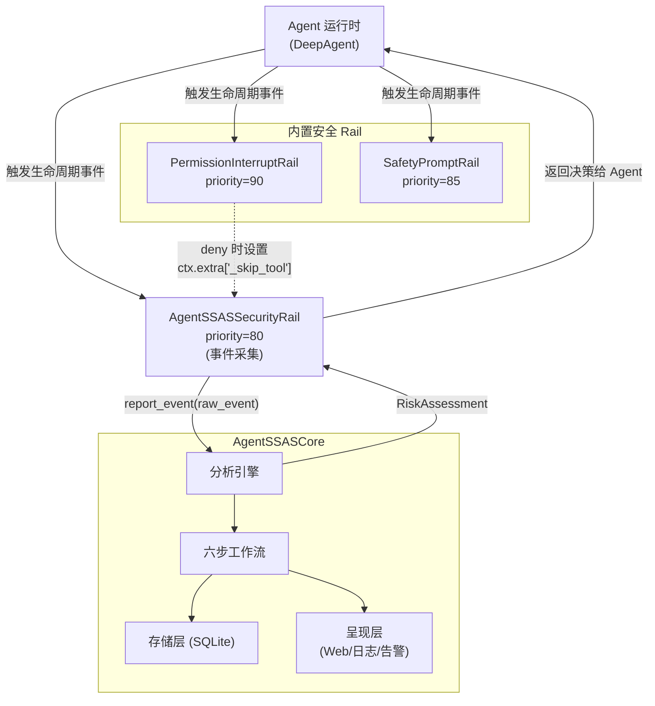
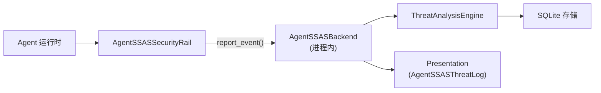
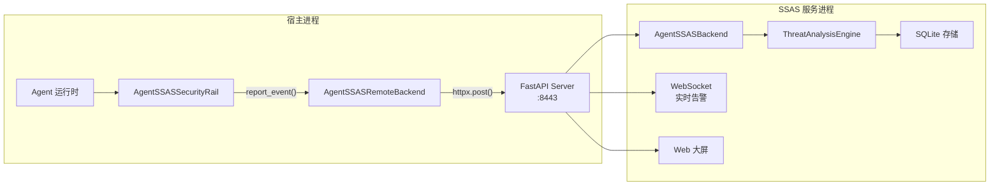
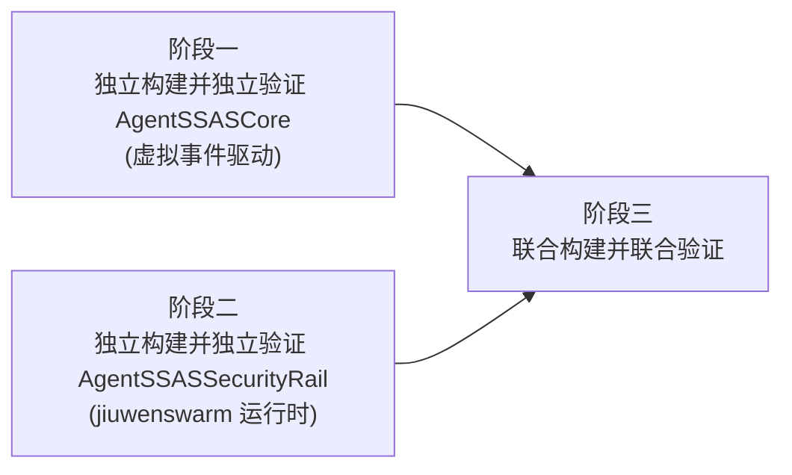

# AgentSSAS — 整体架构设计文档

> **文档定位**：AgentSSAS 项目的顶层架构设计文档，定义系统总体架构、跨仓接口契约、设计原则、实施规划与验证思路。
>
> **内容边界**：
> - 本文档不包含子系统内部模块设计（见文档 02、03）
> - 本文档不包含 agent-core Rail 机制背景（见文档 02 第二章）
> - **跨仓接口的完整定义在本文档第四章给出**，两个子系统设计文档均引用此定义

---

## 一、项目概述

### 1.1 项目定位

AgentSSAS 是一个通用的开源智能体安全态势感知系统，不绑定特定智能体框架，当前已接入 openJiuwen 智能体框架（agent-core + jiuwenswarm）。系统以"伴随式"方式接入智能体运行时，实时采集 Agent 行为事件，执行多维度安全威胁检测，并通过可视化界面呈现安全态势。

> **术语说明**：面向 JiuwenSwarm 的完整集成方案——AgentSSASCore 子系统加上 AgentSSASClient 子系统中的 openjiuwen 客户端——在早期文档中也被称为 **AgentSSAS**。它只是一个逻辑概念，指代这套组合，并不是一个独立的系统。

### 1.2 两个子系统

AgentSSAS 分为两个子系统，分别部署在不同的仓库中：

| 子系统 | 所在仓 | 功能 |
|--------|--------|------|
| **AgentSSASClient** | `AgentSecurity/AgentSSAS/`（`agent_ssas.backend_client`） | 事件采集与上报客户端。核心类 `AgentSSASSecurityRail` 继承 `BaseSecurityRail` 基类，在子类中覆写 `_run_and_apply` 方法、定义 `ExtendedSecurityCheckContext`（继承 `SecurityCheckContext`），采集 Agent 行为事件并上报给 AgentSSASCore。**agent-core 仓零修改** |
| **AgentSSASCore** | `AgentSecurity/AgentSSAS/` | 分析引擎与呈现层。接收事件，执行威胁检测，输出风险评估，呈现态势 |

### 1.3 设计目标

1. **伴随式感知**：以最小侵入方式接入 openJiuwen 智能体运行时，实时采集事件并执行威胁检测。
2. **默认开启、可关闭**：agent-ssas 作为 jiuwenswarm 的普通依赖默认安装并加载（agent-core 仓零修改）；用户可通过配置关闭 SSAS（如 `config.yaml` 中 `ssas.enabled: false`）。
3. **事件全覆盖**：采集 Agent 运行时的全部生命周期事件（13 个 `AgentCallbackEvent`）+ 安全检测衍生事件。
4. **插件化引擎**：AgentSSASCore 采用"框架 + 插件"架构，检测模块以"建模插件 + 分析插件"对形式注册，支持灵活扩展。
5. **双运行模式**：支持进程内库模式（零网络延迟）和 HTTP 服务模式（多 Agent 共享）。

---

## 二、仓库与包关系

### 2.1 三个仓库的包关系

| 仓库 | PyPI 包名 | 导入名 | 角色 |
|------|----------|--------|------|
| `agent-core` | `openjiuwen` | `openjiuwen.*` | 提供 `BaseSecurityRail` 基类。**不修改**：不添加 agent-ssas 依赖、不扩展基类、不修改 `SecurityCheckContext` |
| `jiuwenswarm` | `jiuwenswarm` | `jiuwenswarm.*` | 智能体运行时。**在 `[project.dependencies]` 中直接声明依赖 `agent-ssas`**，并负责 try/except 导入与 Rail 注册逻辑 |
| `AgentSecurity` | `agent-ssas` | `agent_ssas.core.*` | AgentSSASCore 子系统，位于 `AgentSecurity/AgentSSAS/` 子目录。AgentSSASSecurityRail 在此仓中通过子类扩展实现 |

依赖链（jiuwenswarm 同时依赖 agent-core 和 agent-ssas，agent-core 不依赖 agent-ssas）：

```
jiuwenswarm → openjiuwen[claude,codex] (agent-core)
jiuwenswarm → agent-ssas (AgentSecurity/AgentSSAS)
```

### 2.2 依赖声明模型（默认安装 + 可选加载 + 可配置关闭）

SSAS 采用"jiuwenswarm 直接依赖 agent-ssas + 代码 try/except 可选加载 + 配置可关闭"的三重机制。**agent-core 仓零修改**，所有依赖声明与注册逻辑均由 jiuwenswarm 仓负责：

1. **jiuwenswarm 的 `pyproject.toml` 在 `[project.dependencies]`（非 optional-dependencies）中声明直接依赖 `agent-ssas`**。这样安装 jiuwenswarm 时会自动拉取 agent-ssas。
2. **jiuwenswarm 代码中通过 try/except 导入 agent_ssas.core**。如果 agent-ssas 因任何原因未安装，jiuwenswarm 仍能正常运行，AgentSSASSecurityRail 不加载并输出一条 WARNING 日志。
3. **配置可关闭**。即便 agent-ssas 已安装，用户也可通过 `config.yaml` 中 `ssas.enabled: false` 关闭 SSAS 功能。

> **agent-ssas 包本身不在 `pyproject.toml` 中声明依赖 `openjiuwen`**。agent-ssas 的核心（分析引擎、存储、检测模块等）不依赖 openjiuwen；只有 `agent_ssas/backend_client/openjiuwen/` 这一特定插桩（AgentSSASSecurityRail 子类、`ExtendedSecurityCheckContext`、openjiuwen 协议适配）才会引用 openjiuwen 的类型。在实际安装场景中，jiuwenswarm 同时依赖 agent-ssas 与 openjiuwen，两者都会被安装，因此该插桩在运行时可用。如果用户对接其他智能体（不使用 openjiuwen），则不会加载 `agent_ssas/backend_client/openjiuwen/` 插桩，agent-ssas 也不需要 openjiuwen 可用。

**jiuwenswarm 的 `pyproject.toml`**：

```toml
[project]
dependencies = [
    # ... 其他依赖 ...
    "openjiuwen[claude,codex]>=x.x.x",   # 依赖 agent-core
    "agent-ssas>=0.1.0,<0.2",            # 直接依赖 agent-ssas（AgentSecurity/AgentSSAS）
]

[project.optional-dependencies]
claude = ["claude-agent-sdk>=..."]
codex = ["openai-codex>=..."]
# ssas 作为 jiuwenswarm 的直接依赖声明
```

**jiuwenswarm 代码中通过 try/except 导入**（如 `interface_deep.py`）：

```python
# jiuwenswarm 的代码中
_SSAS_AVAILABLE = True
try:
    from agent_ssas.core.framework.config.settings import AgentSSASConfig
    from agent_ssas.backend_client.openjiuwen.factory import create_agent_ssas_rail
    from agent_ssas.backend_client.openjiuwen.agent_ssas_security_rail import AgentSSASSecurityRail
except ImportError:
    _SSAS_AVAILABLE = False
    AgentSSASSecurityRail = None
    # 注意: 此处位于模块顶部,模块级 logger 尚未定义,须内联获取
    logging.getLogger(__name__).warning("AgentSSASSecurityRail not loaded: agent-ssas not installed")
```

**配置关闭**（`config.yaml`）：

```yaml
ssas:
  enabled: true   # 设为 false 即关闭整个 SSAS（不加载 AgentSSASSecurityRail）
```

| 安装方式 | 命令 | 行为 |
|---------|------|------|
| 普通安装（默认启用 SSAS） | `pip install jiuwenswarm` | jiuwenswarm 直接依赖 agent-ssas，自动拉取，AgentSSASSecurityRail 默认激活 |
| 不启用 SSAS | `pip install jiuwenswarm` + `config.yaml` 设 `ssas.enabled: false` | agent-ssas 仍被默认安装（是 jiuwenswarm 的直接依赖），但通过配置关闭不加载 AgentSSASSecurityRail |
| 源码开发 | 修改 jiuwenswarm 的 `[tool.uv.sources]` 指向本地路径（见第七章） | editable 安装本地 agent-ssas 源码，改源码立即生效 |
| 极端情况 | agent-ssas 安装失败或被手动卸载 | jiuwenswarm 仍正常运行，SSAS 不加载，日志输出一条 WARNING |

> **与 optional-dependencies 的区别**：传统 extras 需要用户显式声明 `pip install "openjiuwen[ssas]"` 才安装。本设计将 agent-ssas 作为 jiuwenswarm 的普通依赖，**默认安装**，降低用户接入成本；同时保留 try/except 兜底与配置开关，确保系统鲁棒性。依赖声明与注册逻辑全部由 jiuwenswarm 仓负责。

### 2.3 版本管理

AgentSecurity（`agent-ssas` 包）采用 semver 语义化版本：

| 版本类型 | 触发条件 | 影响 |
|---------|---------|------|
| PATCH (1.0.1) | bug 修复、性能优化 | 无需改动，自动获得 |
| MINOR (1.1.0) | 新增检测器、新增字段（有默认值） | 无需改动，自动获得 |
| MAJOR (2.0.0) | 破坏性接口变更 | 需同步升级 |

PyPI 上的版本是发布时的快照。要让 jiuwenswarm 使用 AgentSecurity 仓的最新代码，需发布到 PyPI 或通过 jiuwenswarm 的 `[tool.uv.sources]` 指向本地路径/git 仓绕过版本约束（见第七章）。agent-core 仓不涉及 agent-ssas 的版本约束。

---

## 三、系统总体架构

### 3.1 架构总览

系统有四个一级架构元素。其中 **Agent 运行时与内置安全 Rail 为外部依赖元素**（jiuwenswarm / agent-core 侧，不由 AgentSSAS 开发），**AgentSSAS 自身为两个子系统**（AgentSSASClient 与 AgentSSASCore，见 1.2 节）：



| 元素 | 归属 | 说明 |
|------|------|------|
| **Agent 运行时** | 外部依赖元素 | jiuwenswarm 的 DeepAgent，是事件源 |
| **内置安全 Rail** | 外部依赖元素 | agent-core 已有的安全检查机制。AgentSSASSecurityRail 通过 `ctx.extra` 观察它们的检测结果 |
| **AgentSSASClient** | AgentSSAS 子系统 | AgentSSAS 的事件采集与上报客户端。核心类 `AgentSSASSecurityRail` 继承 `BaseSecurityRail`（在 AgentSecurity 仓中通过子类扩展，agent-core 仓零修改），被 jiuwenswarm 注册。priority=80，在其他安全 Rail 之后执行 |
| **AgentSSASCore** | AgentSSAS 子系统 | AgentSSAS 的分析引擎。接收事件、执行威胁检测、返回风险评估、呈现态势 |

### 3.2 核心技术选择

| 技术点 | 选择 | 理由 |
|--------|------|------|
| 采集基类 | `BaseSecurityRail` | agent-core 安全护栏基类，可被 DeepAgent 自动发现和注册 |
| interaction_seq | 组内增量序号（从 0 开始）。初始值为 -1，BEFORE_INVOKE 时先自增再使用，后续事件复用 | agent-core 框架不提供 invoke 级别 ID；用 session_id + agent_id + conversation_id 确定组，组内递增 |
| llm_call_seq | 组内自增序号（int，从 0 开始）。初始值为 -1，BEFORE_MODEL_CALL 时先自增再使用，AFTER_MODEL_CALL 复用 | 区分同一 invoke 内的多次 LLM 调用。llm_call 事件（llm_input/llm_output）中为本次 LLM 调用序号；tool_call 事件（tool_input/tool_output）中为该工具调用所属的 LLM 调用序号。上级 ID 组为 session_id + agent_id + conversation_id + interaction_seq |
| tool_call_seq | SSAS 内部唯一标识工具调用。初始值为 -1，BEFORE_TOOL_CALL 时先自增再使用，AFTER_TOOL_CALL 复用 | 上级 ID 组为 session_id + agent_id + conversation_id + interaction_seq + llm_call_seq。因 tool_call_id 由外部 LLM provider 生成、格式不可控，SSAS 需自维护此序号做关联 |
| tool_call_id | LLM provider 原样透传字符串 | agent-core 已有字段，来源于 LLM provider 返回值（如 OpenAI 的 `call_xxx`、Anthropic 的 `toolu_xxx`）。可能为空字符串。SSAS 不依赖它做关联 |
| subsession_id | 子 Agent 场景携带 | 子 Agent 的 parent_session_id 写入 subsession_id，session_id 用子 Agent 自己的 |
| 引擎架构 | 框架 + 插件化检测模块 | 检测模块以"建模插件 + 分析插件"对形式注册，支持灵活扩展 |
| 上报接口 | 单一接口 `report_event(raw_event)` | 事件类型作为字段传递，不按类别区分接口 |
| 事件消息格式 | 三层结构（common / payload / metadata） | 通用字段、业务字段、扩展字段分层，清晰且可扩展 |
| 安全检测事件过滤 | 仅收集 Reject/Interrupt 结果 | 其他 Rail 返回 Allow 的事件无安全语义 |

---

## 四、跨仓接口设计

本章完整定义 AgentSSASClient 子系统（AgentSecurity/AgentSSAS，通过子类扩展 `BaseSecurityRail`）与 AgentSSASCore 子系统（AgentSecurity）之间的跨仓接口契约。两个子系统设计文档均引用此定义。**agent-core 仓零修改**，AgentSSASSecurityRail 在 AgentSecurity 仓中通过继承 `BaseSecurityRail`、覆写 `_run_and_apply` 方法实现。

> **术语约定**：在本章及后续文档中，**raw_event** 指代 AgentSSASSecurityRail 传递给 AgentSSASCore 子系统的三层结构 dict（common / payload / metadata，见 4.2 节），即跨仓接口的输入；**event** 指代 AgentSSASCore 数据预处理模块输出的 `UnifiedEvent` 对象（规范化、带唯一 event_id 的内部数据结构，见文档02）。两者阶段不同：raw_event 是采集侧产物，event 是预处理后的产物。本章接口定义与事件消息格式说明统一使用 raw_event 术语。AgentSSASCore 数据预处理模块消费 raw_event 后输出内部的 UnifiedEvent（event）。

### 4.1 AgentSSASBackendProtocol 接口

AgentSSASSecurityRail 与 AgentSSASCore 之间通过单一接口通信：

```python
from typing import Protocol

class AgentSSASBackendProtocol(Protocol):
    """AgentSSASSecurityRail 与 AgentSSASCore 之间的跨仓接口。"""

    async def report_event(self, raw_event: dict) -> RiskAssessment:
        """上报 raw_event 给 AgentSSASCore，返回风险评估结果。

        Args:
            raw_event: 三层结构的事件消息 dict（见 4.2 节），由 AgentSSASSecurityRail 在采集侧组装。
                AgentSSASCore 数据预处理模块将其转换为内部 UnifiedEvent（event）。
                通过 event_type + event_class 字段区分事件类型与大类。

        Returns:
            RiskAssessment: AgentSSASCore 子系统的风险评估结果。AgentSSASSecurityRail 收到后
                通过 _assessment_to_decision() 映射为 SecurityDecision（见文档02）。
                字段包括：
                - has_risk: 是否存在风险
                - risk_level: 风险等级（safe/low/medium/high/critical）
                - risk_type: 风险类型
                - risk_score: 风险评分
                - confidence: 置信度
                - detected_threats: 检测到的威胁列表
                - recommended_actions: 建议动作
                - evidence: 证据信息
        """
        ...
```

**接口设计要点**：

- **单一接口**：所有事件通过同一个 `report_event()` 方法上报，`event_type` + `event_class` 字段区分类型与大类。
- **raw_event 语义**：`report_event()` 的入参是 raw_event（采集侧的三层结构 dict），而非 AgentSSASCore 子系统内部的 UnifiedEvent。raw_event 经 AgentSSASCore 数据预处理模块转换为 UnifiedEvent（event）后再进入分析流水线。
- **告警落库**：分析流水线中发现的有风险报告（has_risk 且 risk_level > safe）由流水线模块统一写入主库 alerts 表（notify 与 auth 订阅模式均覆盖），`alert_id` 格式为 `{event_id}_{module_name}`。
- **实现方式**：进程内模式由 `AgentSSASBackend` 直接实现此协议；HTTP 模式由 `AgentSSASRemoteBackend` 通过 HTTP 调用实现。两种实现对外暴露相同接口，AgentSSASSecurityRail 无需感知运行模式。
- **fail-open**：AgentSSASCore 子系统自身运行故障时返回 `RiskAssessment`（risk_level=Safe），AgentSSASSecurityRail 收到后映射为 `SecurityAllow`，不阻断业务（见第五章 5.1 节）。

### 4.2 事件消息格式（三层结构）

AgentSSASSecurityRail 上报的 raw_event 采用三层结构设计，兼顾清晰性与可扩展性。raw_event 是跨仓接口的输入，其本身仍是 dict 形态；AgentSSASCore 数据预处理模块消费 raw_event 后输出内部的 UnifiedEvent（event）。common 层共 14 个通用字段：

| 层次 | 字段名 | 类型 | 说明 |
|------|--------|------|------|
| **common**（通用层） | `source` | str | 事件上报者身份。当前值为 `"AgentSSASSecurityRail"`。AgentSSASCore 数据处理模块据此选择格式解析器。未来新增其他上报源时只需新增 source 值 |
| | `event_type` | str | 事件类型标识。完整列表见 4.4 节，如 `invoke_start` / `llm_input` / `tool_input` / `permission_interrupt_tool` 等 |
| | `event_class` | str | 事件大类。值为 `"lifecycle"`（生命周期事件）或 `"security"`（安全检测事件）。与 `event_type` 配合标识事件 |
| | `timestamp` | float | 事件采集时间戳（Unix epoch 秒，浮点数）。呈现层 OCSF 的 `time` 字段为毫秒整数（×1000 换算），`created_time_dt` 为 UTC ISO 8601 字符串 |
| | `interaction_seq` | int | 组内增量序号（从 0 开始），BEFORE_INVOKE 时生成（初始值为 -1，先自增再使用），后续事件复用。组由 session_id + agent_id + conversation_id 唯一确定 |
| | `session_id` | str | 会话唯一标识 |
| | `conversation_id` | str | 会话标识，优先取 agent-core `inputs.conversation_id`，回退 `session_id` |
| | `agent_id` | str | Agent 身份标识 |
| | `trace_id` | str | 链路追踪 ID |
| | `context_id` | str | 模型对话上下文标识。invoke 级事件触发时可能为空字符串（见 4.6 节） |
| | `llm_call_seq` | int | 大模型调用序号（从 0 开始），BEFORE_MODEL_CALL 时生成（初始值为 -1，先自增再使用），AFTER_MODEL_CALL 复用。若当前事件是 llm_call 事件（llm_input/llm_output），`llm_call_seq` 就是这次大模型调用的序号；若当前事件是 tool_call 事件（tool_input/tool_output），`llm_call_seq` 就是这个工具调用所属的大模型调用的序号。上级 ID 组为 session_id + agent_id + conversation_id + interaction_seq。非 LLM/工具事件为 -1 |
| | `tool_call_seq` | int | SSAS 内部工具调用组内自增序号（从 0 开始），BEFORE_TOOL_CALL 时生成（初始值为 -1，先自增再使用），AFTER_TOOL_CALL 复用。上级 ID 组为 session_id + agent_id + conversation_id + interaction_seq + llm_call_seq。因 `tool_call_id` 由外部 LLM provider 生成、格式不可控，SSAS 需自维护此序号在内部唯一标识工具调用。非工具事件为 -1 |
| | `subsession_id` | str | 子 Agent 场景下的父会话标识。子 Agent 的 `parent_session_id` 值写入此字段，`session_id` 用子 Agent 自己的。非子 Agent 场景为空字符串 |
| | `tool_call_id` | str | agent-core 已有字段，LLM provider 原样透传的字符串（如 OpenAI 的 `call_xxx`、Anthropic 的 `toolu_xxx`）。可能为空字符串。SSAS 不依赖它做关联，关联用 `tool_call_seq` |
| **payload**（业务层） | 按事件类型变化 | dict | 携带与事件类型相关的业务数据。不同事件的 payload 字段不同，见 4.5 节 |
| **metadata**（扩展层） | `metadata` | dict | 自由 KV 扩展字段，默认为空 dict。供未来版本追加信息而不破坏现有格式 |

**raw_event 示例（生命周期事件 — LLM 调用）**：

```json
{
    "common": {
        "source": "AgentSSASSecurityRail",
        "event_type": "llm_input",
        "event_class": "lifecycle",
        "timestamp": 1715000000.0,
        "interaction_seq": 0,
        "session_id": "session-001",
        "conversation_id": "session-001",
        "agent_id": "deep-agent-1",
        "trace_id": "trace-001",
        "context_id": "ctx-001",
        "llm_call_seq": 0,
        "tool_call_seq": -1,
        "subsession_id": "",
        "tool_call_id": ""
    },
    "payload": {
        "content": {"messages": [{"role": "user", "content": "hi"}], "tools": ["bash"]},
        "tool_name": "",
        "tool_call_id": ""
    },
    "metadata": {}
}
```

**raw_event 示例（生命周期事件 — 工具调用，携带所属 LLM 调用序号）**：

```json
{
    "common": {
        "source": "AgentSSASSecurityRail",
        "event_type": "tool_input",
        "event_class": "lifecycle",
        "timestamp": 1715000005.0,
        "interaction_seq": 0,
        "session_id": "session-001",
        "conversation_id": "session-001",
        "agent_id": "deep-agent-1",
        "trace_id": "trace-001",
        "context_id": "ctx-001",
        "llm_call_seq": 0,
        "tool_call_seq": 0,
        "subsession_id": "",
        "tool_call_id": "call_abc123"
    },
    "payload": {
        "content": {"tool_args": {"command": "ls -la"}},
        "tool_name": "bash",
        "tool_call_id": "call_abc123"
    },
    "metadata": {}
}
```

**raw_event 示例（子 Agent 场景，携带 subsession_id）**：

```json
{
    "common": {
        "source": "AgentSSASSecurityRail",
        "event_type": "invoke_start",
        "event_class": "lifecycle",
        "timestamp": 1715000010.0,
        "interaction_seq": 0,
        "session_id": "session-002",
        "conversation_id": "session-002",
        "agent_id": "deep-agent-1",
        "trace_id": "trace-001",
        "context_id": "",
        "llm_call_seq": -1,
        "tool_call_seq": -1,
        "subsession_id": "session-001",
        "tool_call_id": ""
    },
    "payload": {
        "content": {"query": "do something", "parent_session_id": "session-001", "run_kind": "subagent"},
        "tool_name": "",
        "tool_call_id": ""
    },
    "metadata": {}
}
```

**raw_event 示例（安全检测事件）**：

```json
{
    "common": {
        "source": "AgentSSASSecurityRail",
        "event_type": "permission_interrupt_tool",
        "event_class": "security",
        "timestamp": 1715000005.0,
        "interaction_seq": 0,
        "session_id": "session-001",
        "conversation_id": "session-001",
        "agent_id": "deep-agent-1",
        "trace_id": "trace-001",
        "context_id": "ctx-001",
        "llm_call_seq": 0,
        "tool_call_seq": 0,
        "subsession_id": "",
        "tool_call_id": "call_abc123"
    },
    "payload": {
        "content": {"tool_args": {"command": "ls -la"}},
        "tool_name": "bash",
        "tool_call_id": "call_abc123",
        "risk_source": "PermissionInterruptRail",
        "risk_type": "tool_permission_denied",
        "risk_level": "high",
        "decision": "reject",
        "evidence": {
            "reason": "PermissionInterruptRail denied the tool call"
        }
    },
    "metadata": {}
}
```

> **设计要点**：
> - `common.source` 标识"谁把事件上报给 AgentSSASCore"（当前只有 `"AgentSSASSecurityRail"`）。安全检测事件的 `payload.risk_source` 记录"具体哪个 Rail 产生了安全检测结果"（如 `"PermissionInterruptRail"`）。两个字段语义不同，不冲突。
> - `event_type` + `event_class` 组合标识事件：`event_class` 区分大类（`lifecycle` / `security`），`event_type` 为具体类型名。report 接口层面以 `event_type` + `event_class` 标识事件，不包含 `event` 字段。
> - `llm_call_seq` 为 int 自增序号，llm_call 事件中为本次大模型调用序号、tool_call 事件中为该工具调用所属的大模型调用序号，据此可还原"某次工具调用是由哪次 LLM 调用触发的"链路。
> - `tool_call_seq` 是 SSAS 内部工具调用序号（int），用于关联；`tool_call_id` 是 LLM provider 原样透传字符串，保留供溯源，不作为关联键。
> - `subsession_id` 与 `session_id` 配合，可还原"子 Agent 属于哪个父会话"的层级关系。

### 4.3 事件两大类别

AgentSSAS 采集两大类事件，对应 raw_event 中 `common.event_class` 字段的两个值：

**生命周期事件**（`event_class = "lifecycle"`）：Agent 运行时的生命周期事件，没有安全语义。比如一次工具调用会触发 BEFORE_TOOL_CALL 和 AFTER_TOOL_CALL。这些事件由 AgentSSASSecurityRail 采集并组装为 raw_event 上报给 AgentSSASCore，用于行为态势感知。

**安全检测事件**（`event_class = "security"`）：现有安全检查机制识别到异常后、准备做出 Reject 或 Interrupt 决策时产生的衍生事件。这些事件有明确的安全语义——已经被分析过并认为有安全风险。安全检测事件的 payload 同时包含原始行为信息（如工具名、参数）和安全检查结果（如风险类型、风险等级、关键证据）。

> 注意：SafetyPromptRail 始终返回 Allow 且不做检测，因此不会产生安全检测事件。当前能产生安全检测事件的只有 PermissionInterruptRail。

### 4.4 完整事件清单

下表列出 raw_event 的全部事件类型，每个事件一行。生命周期事件共 13 个（对应 agent-core 的全部 `AgentCallbackEvent`），安全检测事件 1 个。"0.1版本支持"列标注本版本 AgentSSASSecurityRail 是否实际采集并组装为 raw_event 上报（✅ 0.1版本支持；⚠️ 后续版本拓展，agent-core 侧尚为 TODO，见文档02第四章）。

| event_type | event_class | 版本支持情况 | 触发模块 | 何时触发 | 关键 ID 字段 |
|------------|------------|------------|---------|---------|------------|
| `invoke_start` | lifecycle | ✅ 0.1版本支持 | DeepAgent | invoke 开始 | 生成 interaction_seq（初始 -1，先自增再使用） |
| `invoke_end` | lifecycle | ✅ 0.1版本支持 | DeepAgent | invoke 完成 | 复用 interaction_seq |
| `user_message` | lifecycle | ⚠️ 后续版本拓展 | ReActAgent | 用户输入写入会话前 | 复用 interaction_seq |
| `steering_drain` | lifecycle | ⚠️ 后续版本拓展 | ReActAgent | steering 消息消费前 | 复用 interaction_seq |
| `task_iteration_start` | lifecycle | ⚠️ 后续版本拓展 | DeepAgent | 外层任务迭代开始 | 复用 interaction_seq |
| `task_iteration_end` | lifecycle | ⚠️ 后续版本拓展 | DeepAgent | 外层任务迭代完成 | 复用 interaction_seq |
| `llm_input` | lifecycle | ✅ 0.1版本支持 | ReActAgent | LLM 调用前 | 生成 llm_call_seq（初始 -1，先自增再使用） |
| `llm_output` | lifecycle | ✅ 0.1版本支持 | ReActAgent | LLM 响应后 | 复用 llm_call_seq |
| `model_exception` | lifecycle | ⚠️ 后续版本拓展 | ReActAgent | LLM 调用异常 | 复用最近 llm_call_seq |
| `tool_input` | lifecycle | ✅ 0.1版本支持 | ReActAgent | 工具执行前 | 生成 tool_call_seq（初始 -1，先自增再使用）；llm_call_seq = 最近 llm_call_seq |
| `tool_output` | lifecycle | ✅ 0.1版本支持 | ReActAgent | 工具执行后 | 复用 tool_call_seq；llm_call_seq = 最近 llm_call_seq |
| `tool_exception` | lifecycle | ⚠️ 后续版本拓展 | ReActAgent | 工具执行异常 | 复用 tool_call_seq；llm_call_seq = 最近 llm_call_seq |
| `react_iteration_end` | lifecycle | ⚠️ 后续版本拓展 | ReActAgent | 一次 ReAct 迭代完成 | 复用 interaction_seq |
| `permission_interrupt_tool` | security | ✅ 0.1版本支持 | PermissionInterruptRail | 工具权限裁决为 DENY 时 | 复用 tool_call_seq；llm_call_seq = 最近 llm_call_seq |

> **事件类型命名规则**：`event_type` 采用具体类型名而非泛化的 `security_detection`，以便后续支持多种不同安全检查来源。
>
> **event_class 说明**：`event_class` 区分事件大类——`lifecycle` 表示生命周期事件（Agent 生命周期事件），`security` 表示安全检测事件（安全 Rail 产生的衍生事件）。report 接口层面以 `event_type` + `event_class` 标识事件，不包含 `event` 字段。

### 4.5 payload 字段定义

payload 按事件类型携带不同的业务数据。下表按事件分组说明。

**4.5.1 content 字段（按事件类型）**

`content` 是 payload 中的核心字段，携带与事件类型直接相关的业务数据：

| 事件 | content 内容 | 说明 |
|------|-------------|------|
| `invoke_start` | `query`, `parent_session_id`, `run_kind` | 用户输入、父会话 ID（用于子 Agent）、运行类型 |
| `invoke_end` | `result` | invoke 最终输出 |
| `user_message` | `parts`, `source` | 用户输入文本列表、来源（query/steering/resume） |
| `steering_drain` | `messages` | steering 消息列表 |
| `task_iteration_start` | `iteration`, `query`, `is_follow_up` | 迭代序号（1-based）、查询、是否追问 |
| `task_iteration_end` | `iteration`, `result` | 迭代序号、迭代结果 |
| `llm_input` | `messages`, `tools` | LLM 消息列表、可用工具列表 |
| `llm_output` | `response` | LLM 返回的响应 |
| `tool_input` | `tool_args` | 工具调用参数 |
| `tool_output` | `tool_result` | 工具执行结果 |
| `model_exception` | `exception` | 异常的字符串描述 |
| `tool_exception` | `exception` | 异常的字符串描述 |
| `react_iteration_end` | `iteration` | 迭代号 |
| `permission_interrupt_tool` | `tool_args` | 被拒绝的工具调用参数（与对应 tool_input 一致） |

**4.5.2 工具信息字段（仅工具类事件）**

仅 `tool_input` / `tool_output` / `tool_exception` / `permission_interrupt_tool` 事件携带：

| 字段 | 类型 | 说明 |
|------|------|------|
| `tool_call_seq` | int | SSAS 内部工具调用组内自增序号（从 0 开始）。上级 ID 组为 session_id + agent_id + conversation_id + interaction_seq + llm_call_seq。payload 层工具信息字段通过此序号做关联 |
| `tool_call_id` | str | agent-core 已有字段，LLM provider 原样透传的字符串（如 OpenAI 的 `call_xxx`、Anthropic 的 `toolu_xxx`）。可能为空字符串。保留原始值供溯源，不作为 SSAS 内部关联键 |
| `tool_name` | str | 被调用的工具名称 |

> **tool_call_id 与 tool_call_seq 的关系**：`tool_call_id` 由外部 LLM provider 生成，格式不可控（不同 provider 格式不同、可能为空），SSAS 不能依赖它做关联。因此 SSAS 在 common 层同时保留原始 `tool_call_id`（provider 返回值）和自维护的 `tool_call_seq`（int 自增序号），payload 层的工具信息类字段通过 `tool_call_seq` 引用关联。

**4.5.3 安全检测结果字段（仅安全检测事件）**

仅 `permission_interrupt_tool` 事件（及未来其他安全检测事件）携带：

| 字段 | 类型 | 说明 |
|------|------|------|
| `risk_source` | str | 产生此安全检测事件的 Rail 名称，如 `"PermissionInterruptRail"` |
| `risk_type` | str | 风险类型，如 `"tool_permission_denied"` |
| `risk_level` | str | 风险等级：low/medium/high/critical |
| `decision` | str | 原 Rail 的决策：reject/interrupt |
| `evidence` | dict | 关键证据信息，如匹配的规则、拒绝原因等 |

**4.5.4 payload 字段与事件类型对照速查**

> **字段归属层说明**：`content` 字段在 payload 层；`tool_call_seq`、`tool_call_id` 在 common 层（见 4.2 节）；`tool_name` 在 payload 层；安全检测字段（`risk_source` 等）在 payload 层。下表"工具字段"列中的 `tool_call_seq`、`tool_call_id` 实际位于 common 层，在此列出表示"该事件携带这些字段"，`tool_name` 才是真正的 payload 层工具字段。

| 事件 | content 字段（payload 层） | 工具字段（tool_call_seq、tool_call_id 在 common 层；tool_name 在 payload 层） | 安全检测字段（payload 层） |
|------|-------------|---------|------------|
| `invoke_start` | query, parent_session_id, run_kind | — | — |
| `invoke_end` | result | — | — |
| `user_message` | parts, source | — | — |
| `steering_drain` | messages | — | — |
| `task_iteration_start` | iteration, query, is_follow_up | — | — |
| `task_iteration_end` | iteration, result | — | — |
| `llm_input` | messages, tools | — | — |
| `llm_output` | response | — | — |
| `tool_input` | tool_args | tool_call_seq, tool_call_id, tool_name | — |
| `tool_output` | tool_result | tool_call_seq, tool_call_id, tool_name | — |
| `model_exception` | exception | — | — |
| `tool_exception` | exception | tool_call_seq, tool_call_id, tool_name | — |
| `react_iteration_end` | iteration | — | — |
| `permission_interrupt_tool` | tool_args | tool_call_seq, tool_call_id, tool_name | risk_source, risk_type, risk_level, decision, evidence |

### 4.6 context_id 可靠性说明

`context_id` 是模型对话上下文（ModelContext）的标识。ModelContext 在 invoke 开始后才创建。因此：

- **invoke 级/外层事件**（BEFORE/AFTER_INVOKE、ON_USER_MESSAGE、BEFORE_STEERING_DRAIN、BEFORE/AFTER_TASK_ITERATION）：ModelContext 可能尚未初始化，`context_id` 为空字符串。
- **invoke 内部事件**（BEFORE/AFTER_MODEL_CALL、BEFORE/AFTER_TOOL_CALL、ON_MODEL/TOOL_EXCEPTION、AFTER_REACT_ITERATION）：ModelContext 已创建，`context_id` 可靠。

其余 common 层标识字段（interaction_seq、session_id、agent_id、trace_id、conversation_id、llm_call_seq、tool_call_seq、subsession_id、tool_call_id）在对应事件中均可可靠获取（具体见 4.4 节"关键 ID 字段"列）。

> **信息采集原则**：AgentSSASSecurityRail 在采集阶段采集所有可获得的完整数据，不在采集侧做裁剪。裁剪工作放到 AgentSSASCore 侧根据实际需求进行。这是因为 agent-core 仓零修改、应保持稳定；AgentSSASSecurityRail 在独立的 AgentSecurity 仓中迭代快，可灵活调整采集策略。

### 4.7 ID 关联模型说明

raw_event 中的 ID 字段构成一个分层关联模型，用于还原完整的行为链路：

```
session_id（会话）
├── interaction_seq（组内序号，BEFORE_INVOKE 时先自增再使用）
│   ├── llm_call_seq（LLM 调用序号，BEFORE_MODEL_CALL 时先自增再使用）
│   │   ├── tool_call_seq（工具调用序号，BEFORE_TOOL_CALL 时先自增再使用）
│   │   │   └── llm_call_seq（工具事件中读取当前 LLM 调用序号）
│   │   └── ... 同一次 invoke 内可有多次 LLM 调用
│   └── ... 同一组内可有多个 interaction_seq
└── subsession_id（子 Agent 场景，指向 parent_session_id）
    └── session_id（子 Agent 自己的会话）
```

- **interaction_seq**：组内增量序号（int，从 0 开始，初始值为 -1）。组由 `session_id + agent_id + conversation_id` 唯一确定。BEFORE_INVOKE 时先自增再使用，后续事件复用。用于区分同一组内多次 invoke。因 DeepAgent/ReActAgent 外层与内层的 `ctx.extra` 不跨层共享，当前序号由 IDManager 的 session 级 LRU 池存储（最大 100 个 session，详见文档 02 第六章），初始值为 -1。
- **llm_call_seq**：LLM 调用组内自增序号（int，从 0 开始，初始值为 -1）。上级 ID 组为 `session_id + agent_id + conversation_id + interaction_seq`。BEFORE_MODEL_CALL 时先自增再使用，AFTER_MODEL_CALL 复用。同一 invoke 内可能有多次 LLM 调用（ReAct 循环），每次都有不同的 llm_call_seq。工具事件（BEFORE/AFTER_TOOL_CALL）的 `llm_call_seq` 直接读取当前值，用于标识该工具调用所属的 LLM 调用。
- **tool_call_seq**：SSAS 内部工具调用组内自增序号（int，从 0 开始，初始值为 -1）。上级 ID 组为 `session_id + agent_id + conversation_id + interaction_seq + llm_call_seq`。BEFORE_TOOL_CALL 时先自增再使用，AFTER_TOOL_CALL 复用。因 `tool_call_id` 由外部 LLM provider 生成、格式不可控，SSAS 需自维护此序号在内部唯一标识工具调用。
- **tool_call_id**：agent-core 已有字段，LLM provider 原样透传字符串。可能为空字符串。SSAS 不依赖它做关联，关联用 `tool_call_seq`。
- **subsession_id**：子 Agent 归属。子 Agent 的事件中，`subsession_id` = parent_session_id，`session_id` = 子 Agent 自己的 session_id。非子 Agent 场景为空字符串。

### 4.8 RiskAssessment 返回类型

`report_event()` 返回的 `RiskAssessment` 是 AgentSSASCore 自定义的风险评估类型，AgentSSASSecurityRail 收到后通过 `_assessment_to_decision()` 映射为 agent-core 的 `SecurityDecision`（映射逻辑见文档02）。`RiskAssessment` 的字段如下：

| 字段 | 类型 | 说明 |
|------|------|------|
| `has_risk` | bool | 是否存在风险 |
| `risk_level` | str | 风险等级：safe/low/medium/high/critical |
| `risk_type` | str | 风险类型，如 `"tool_permission_denied"` |
| `risk_score` | float | 风险评分（0-100）。按风险等级映射：safe=0 / low=25 / medium=50 / high=75 / critical=100 |
| `confidence` | float | 置信度（0.0-1.0） |
| `detected_threats` | list | 检测到的威胁列表 |
| `recommended_actions` | list | 建议动作列表 |
| `details` | dict | 模块明细（预留字段，0.1 版本聚合逻辑不填充，默认空 dict） |
| `evidence` | dict | 证据信息（按模块名合并各检测模块的非空证据） |

> **与 SecurityDecision 的关系**：`RiskAssessment` 是 AgentSSASCore 侧的评估结果，`SecurityDecision`（含 `SecurityAllow`/`SecurityReject`/`SecurityAlert`/`SecurityInterrupt`）是 agent-core 中 `BaseSecurityRail` 的决策类型。AgentSSASSecurityRail 收到 `RiskAssessment` 后，通过 `_assessment_to_decision()` 根据策略表（`decision_policies.yaml`）将 `risk_level` 映射为 `SecurityDecision` 返回给 Agent 运行时。映射逻辑的完整定义在文档02 第 8.4 节。

---

## 五、设计原则

### 5.1 fail-open 原则

当 AgentSSASCore **自身运行异常**（分析引擎故障、HTTP 调用超时等）时，返回 `RiskAssessment`（risk_level=Safe），AgentSSASSecurityRail 收到后映射为 `SecurityAllow`，不阻断 Agent 业务执行。

- **进程内模式**：引擎分析异常时返回 `RiskAssessment`（risk_level=Safe）
- **HTTP 服务模式**：网络异常或超时时返回 `RiskAssessment`（risk_level=Safe）

> fail-open 仅针对 AgentSSASCore 子系统自身的运行故障。当 AgentSSASCore 正常检测到安全风险时，返回的 `RiskAssessment` 会携带风险信息，AgentSSASSecurityRail 根据策略表（见第 6.4 节 `decision_policy` 配置）映射为 `SecurityReject`、`SecurityAlert` 或 `SecurityAllow`。
>
> **0.1版本决策策略**：AgentSSASSecurityRail 通过独立 YAML 策略文件（`decision_policies.yaml`）定义多种策略模式。`observe_only` 模式（默认）下所有风险全部放行（仅感知）；`active_protection` 模式下按风险等级处理（critical→阻断, high/medium/low→告警）。jiuwenswarm 通过 `config.yaml` 的 `ssas.decision_policy` 选择策略模式名称。

### 5.2 可选加载原则

jiuwenswarm 在 `[project.dependencies]` 中直接声明依赖 `agent-ssas`，但代码中通过 try/except 导入实现可选加载。未安装 agent-ssas 时 jiuwenswarm 正常运行，安装后自动激活。用户也可通过配置（`ssas.enabled: false`）关闭。**agent-core 仓零修改**：AgentSSASSecurityRail 通过继承 `BaseSecurityRail`、在子类中覆写 `_run_and_apply` 方法、定义 `ExtendedSecurityCheckContext`（继承 `SecurityCheckContext`）实现扩展，不改动基类与现有子类。

### 5.3 信息采集原则

AgentSSASSecurityRail 在采集阶段采集所有可获得的完整数据，不在采集侧做裁剪。裁剪工作放到 AgentSSASCore 侧根据实际需求进行。理由：agent-core 仓零修改、应保持稳定；AgentSSASSecurityRail 与 AgentSSASCore 均在独立的 AgentSecurity 仓中迭代快，可灵活调整采集与消费策略。

---

## 六、运行模式

### 6.1 双模式对比

AgentSSAS 支持两种运行模式，通过 `AgentSSASConfig.mode` 配置切换：

| 设计点 | 进程内模式 | HTTP 服务模式 |
|--------|----------|--------------|
| 分析引擎位置 | 宿主进程内 | 服务端进程 |
| 存储位置 | `${JIUWENSWARM_HOME}/ssas/` | 服务端独立目录 |
| 呈现能力 | 编程 API 或可选内嵌 FastAPI | REST API + WebSocket + 大屏 |
| 网络延迟 | 零 | 一次 HTTP RTT |
| fail-safe | 引擎异常返回 `RiskAssessment`（risk_level=Safe） | 网络异常返回 `RiskAssessment`（risk_level=Safe） |
| 多 Agent 共享 | 不支持 | 支持 |

### 6.2 进程内模式

AgentSSAS 作为库嵌入宿主进程。`AgentSSASBackend` 直接实现 `AgentSSASBackendProtocol`，直接调用分析引擎，零网络延迟。



### 6.3 HTTP 服务模式

AgentSSAS 作为独立进程运行 FastAPI 服务。宿主进程中的 `AgentSSASRemoteBackend` 通过 HTTP 调用将事件上报到服务端，同样实现 `AgentSSASBackendProtocol`，对 AgentSSASSecurityRail 透明。



HTTP 服务模式下 FastAPI 暴露以下端点。0.1版本实现事件上报端点与健康检查端点，其余端点为后续版本拓展支持：

| 方法 | 路径 | 请求体 | 响应 | 版本支持情况 | 说明 |
|------|------|-------|------|------------|------|
| POST | `/api/v1/events` | `{raw_event: dict}` | `{assessment: RiskAssessment}` | ✅ 0.1版本支持 | 上报 raw_event，返回风险评估 |
| GET | `/health` | 无 | `{"status": "ok"}` | ✅ 0.1版本支持 | 健康检查（免认证） |
| GET | `/api/v1/events` | `?session_id=&limit=` | `{events: list[dict]}` | ⚠️ 后续版本拓展 | 查询事件列表 |
| GET | `/api/v1/alerts` | `?acknowledged=&limit=` | `{alerts: list[dict]}` | ⚠️ 后续版本拓展 | 查询告警列表 |
| PATCH | `/api/v1/alerts/{alert_id}/ack` | — | `{status: "ok"}` | ⚠️ 后续版本拓展 | 确认告警 |
| GET | `/api/v1/dashboard/overview` | — | `{stats: dict}` | ⚠️ 后续版本拓展 | 态势大屏概览数据 |
| WS | `/ws/alerts` | — | `{alert: dict}` | ⚠️ 后续版本拓展 | 实时告警推送 |

> **0.1版本说明**：0.1版本 HTTP 服务模式只需实现 `POST /api/v1/events` 与 `GET /health` 端点，满足 AgentSSASSecurityRail 上报事件并获取安全决策、以及部署侧健康检查的需求。查询、告警确认、大屏、WebSocket 推送等端点为后续版本拓展支持。
>
> **HTTP 认证**：当 `AgentSSASConfig.http_token` 不为 None 时，服务端启用 Bearer token 认证中间件（`TokenAuthMiddleware`），未携带有效 `Authorization: Bearer <token>` 头的请求返回 401。`/health` 端点免认证。

### 6.4 AgentSSASConfig 配置

两种运行模式通过 `AgentSSASConfig` 统一配置。配置文件的存放位置和加载方式与 jiuwenswarm 现有模块一致：

- **配置文件位置**：运行时从 `$JIUWENSWARM_HOME/config/config.yaml` 的 `ssas` 段读取；该配置模板随 jiuwenswarm 包分发于 `jiuwenswarm/resources/config.yaml`，初始化工作区时复制为运行时配置
- **加载方式**：从 `config.yaml` 的 `ssas` 段读取，环境变量覆盖（`SSAS_` 前缀）
- **存储路径**：遵循 agent-core 的混合模式惯例（见下文"存储路径配置惯例"）

`config.yaml` 中的 SSAS 配置段示例：

```yaml
ssas:
  enabled: true              # 是否启用 SSAS (false 时不加载 AgentSSASSecurityRail)
  mode: inprocess            # inprocess | http
  ssas_home: null            # null -> 按下列顺序解析存储根目录
  storage_backend: sqlite    # 存储后端类型
  event_ttl_days: 30
  alert_ttl_days: 90
  rail_priority: 80
  enable_exception_hooks: true
  risk_report_threshold: low   # safe / low / medium / high / critical (0.1版本预留字段, 未实现过滤逻辑)
  auth_timeout: 2.0             # auth 模式超时秒数, 超时后按模块 auth_timeout_policy 处理
  decision_policy: observe_only  # AgentSSASSecurityRail 决策策略: observe_only (全部放行) | active_protection (按风险等级处理)
  # 检测模块配置覆盖 (可覆盖 module.yaml 的 enabled 字段)
  modules:
    test_detection:
      enabled: false          # test_detection 默认关闭, 测试时设为 true 启用
  # HTTP 模式专用
  http_endpoint: "http://localhost:8443"
  http_timeout: 5.0
  http_token:                    # Bearer token 认证（默认空/None 时无认证）
  http_host: "0.0.0.0"
  http_port: 8443
```

**存储路径配置惯例**：

agent-core 的存储路径采用混合模式惯例，AgentSSASConfig 沿用此惯例：

1. **环境变量驱动**：优先级从高到低为 `SSAS_HOME` → `JIUWENSWARM_DATA_DIR` → `JIUWENSWARM_HOME` → `~/.jiuwenswarm`。任一被设置即作为存储根目录的候选。
2. **Python 代码默认值**：`AgentSSASConfig` 在代码中以 `~/.jiuwenswarm` 作为兜底默认值（与 agent-core 一致）。`ssas_home` 为 `None` 时按上述环境变量顺序解析；均未设置则用默认值，最终存储根目录为 `<根目录>/ssas/`，默认情况下为 `~/.jiuwenswarm/ssas/`。
3. **config.yaml 统一配置**：上层 jiuwenswarm 的 `config.yaml` 的 `ssas` 段可显式配置 `ssas_home` 等存储相关参数，覆盖环境变量与默认值。

> **不使用 pyproject.toml 配置存储路径**：存储路径属运行期数据配置，不进入打包元数据。`pyproject.toml` 只声明包依赖与构建信息，存储路径由环境变量 + Python 默认值 + `config.yaml` 三者协同决定。

> **数据 TTL 清理**：主库 events/raw_events 表按 `event_ttl_days`（默认 30 天）、alerts 表按 `alert_ttl_days`（默认 90 天）清理；各检测模块的模块库 process.db 按 `event_ttl_days`、result.db 按 `alert_ttl_days` 清理。触发时机为初始化时清理一次 + 每 100 次事件上报后台触发清理一次；TTL ≤ 0 表示禁用对应清理。

> **可读时间列**：存储层各表除 `timestamp`（Unix 秒，用于计算与排序）外，另有 `timestamp_text` 可读时间列，格式为本地时区 `YYYY-MM-DD HH:MM:SS.mmm`；旧库打开时自动迁移补列并回填历史数据。

> **检测模块配置**：检测模块通过 `module.yaml` 声明式配置注册（见文档03第十章），各模块的 `enabled` 字段在各自的 `module.yaml` 中控制。同时支持通过 `config.yaml` 的 `ssas.modules.<module_name>.enabled` 覆盖 `module.yaml` 的 `enabled` 字段。0.1版本内置 3 个检测模块：`test_detection`（默认 disabled）、`security_rail_detection`（默认 enabled）、`agent_moss`（默认 enabled）；另有 1 个规划中的模块 `toolcall_chain_anomaly`（后续版本拓展）。

环境变量覆盖（`SSAS_` 前缀），例如 `SSAS_MODE=http`、`SSAS_RAIL_PRIORITY=75`、`SSAS_ENABLED=false`。存储路径相关环境变量不带 `SSAS_` 前缀，直接读取 `SSAS_HOME` / `JIUWENSWARM_DATA_DIR` / `JIUWENSWARM_HOME`。

**配置生效机制**：

```
config.yaml[ssas] + 环境变量 → AgentSSASConfig
    → jiuwenswarm 的 _build_agent_rails（调用 _build_ssas_rail）
        ├→ AgentSSASBackend / AgentSSASRemoteBackend (AgentSSASCore 侧)
        └→ AgentSSASSecurityRail(backend=backend, policy_name=config.decision_policy) (通过 jiuwenswarm 注册)
```

> **初始化行为**：`AgentSSASBackend.initialize()` 为幂等操作（重复调用安全），触发检测模块的扫描、加载与注册。jiuwenswarm 集成层以 fire-and-forget 方式调用 initialize()，`report_event()` 入口会自动等待初始化完成后再处理事件，因此 fire-and-forget 的初始化无害，初始化前到达的事件不会漏检测。

> **注册路径**：AgentSSASSecurityRail 的实例化与注册由 jiuwenswarm 仓的 `_build_agent_rails` 负责（通过 try/except 导入 `agent_ssas.core` 后构造），agent-core 仓不参与 Rail 的注册逻辑。

---

## 七、本地开发环境

### 7.1 跨仓调试的问题

> **重要说明**：下表描述的是 **SSAS 尚未开发时** 的当前状态。功能上线后，按 7.2 节配置 editable install，在 jiuwenswarm 目录下 `uv pip install -e .` 后会自动安装 agent-ssas（因 jiuwenswarm 声明依赖 agent-ssas）。

当前（SSAS 尚未开发时），按安装指南用 `uv pip install -e .` 安装 jiuwenswarm 后，三个包的安装状态：

| 包 | 安装方式 | 问题 |
|---|---|---|
| `jiuwenswarm` | editable | 无，改源码立即生效 |
| `openjiuwen` | **git 安装（非 editable）** | **改本地 agent-core 源码不会生效**（这是 agent-core 的现状，不需要改） |
| `agent_ssas.core` | 未安装 | **当前尚未开发，需创建包** |

> 注：openjiuwen 为 git 安装（非 editable）是 agent-core 的现状，本方案不要求修改 agent-core 仓，因此这一现状保持不变。

**目标状态**（功能上线后）：jiuwenswarm 声明依赖 agent-ssas 后，在 jiuwenswarm 目录下 `uv pip install -e .`（或 `uv sync`）安装 jiuwenswarm 时会自动安装 agent-ssas。按 7.2 节完成 editable install 配置后，agent-ssas 也为 editable，改源码立即生效。

### 7.2 全 editable install 方案

核心思路是 **只修改 jiuwenswarm 的 `pyproject.toml`**：在 `dependencies` 中声明 `agent-ssas`，在 `[tool.uv.sources]` 中将 `agent-ssas` 指向本地路径（editable）。openjiuwen 的 editable 配置可选（已有 `[tool.uv.sources]` 指向本地路径就保持，没有就加上）。

以下操作假设三个仓已克隆到同一父目录 `<WORKSPACE>` 下，目录名分别为 `agent-core`、`jiuwenswarm`、`AgentSecurity`。

**步骤 1：修改 jiuwenswarm 的 pyproject.toml**

在 `dependencies` 中添加 `agent-ssas`，并在 `[tool.uv.sources]` 中指向本地路径（editable）：

```toml
[project]
dependencies = [
    # ... 其他依赖 ...
    "openjiuwen[claude,codex]>=x.x.x",   # 依赖 agent-core
    "agent-ssas>=0.1.0,<0.2",            # 直接依赖 agent-ssas
]

[tool.uv.sources]
# 将 agent-ssas 指向本地路径（editable）
agent-ssas = { path = "../AgentSecurity/AgentSSAS", editable = true }
# openjiuwen 的 editable 可选：已有 [tool.uv.sources] 指向本地路径就保持，没有就加上
# openjiuwen = { path = "../agent-core", editable = true }
```

> **说明**：jiuwenswarm 同时依赖 agent-core 和 agent-ssas，由 jiuwenswarm 的 `[tool.uv.sources]` 负责将 agent-ssas 指向本地路径。openjiuwen 是否 editable 取决于 jiuwenswarm 现有配置，本方案不强求。

**步骤 2：创建 AgentSSASCore 可安装包**（若尚未开发）

在 `<WORKSPACE>/AgentSecurity/AgentSSAS/` 下创建：

```
AgentSecurity/AgentSSAS/
├── pyproject.toml
├── src/
│   └── agent_ssas/core/
│       └── __init__.py
└── README.md
```

`pyproject.toml`：

```toml
[build-system]
requires = ["setuptools>=61"]
build-backend = "setuptools.build_meta"

[project]
name = "agent-ssas"
version = "0.1.0"
description = "AgentSSAS - 智能体安全态势感知系统"
requires-python = ">=3.11"
dependencies = ["pyyaml>=6.0"]

[project.optional-dependencies]
# 可选扩展依赖（extras）
test = ["pytest>=7.0", "pytest-asyncio>=0.21"]   # 测试
http = ["httpx>=0.27", "fastapi>=0.115", "uvicorn[standard]>=0.30"]  # HTTP 服务模式

[tool.setuptools.packages.find]
where = ["src"]
```

`src/agent_ssas/core/__init__.py`：

```python
"""AgentSSAS - 智能体安全态势感知系统"""
__version__ = "0.1.0"
```

**步骤 3：在 jiuwenswarm 目录下同步依赖**

```powershell
cd <WORKSPACE>/jiuwenswarm
.\.venv\Scripts\activate
uv sync
```

`uv sync` 会读取 jiuwenswarm 的 `pyproject.toml`，发现其依赖 agent-ssas 并指向本地路径，自动以 editable 方式安装。

### 7.3 验证 editable 链路

```powershell
# 验证包指向本地源码
python -c "import agent_ssas.core; print(agent_ssas.core.__file__)"
# 预期路径包含: AgentSecurity/AgentSSAS/src/agent_ssas/core/__init__.py

python -c "import jiuwenswarm; print(jiuwenswarm.__file__)"
# 预期路径包含: jiuwenswarm/jiuwenswarm/__init__.py

python -c "import openjiuwen; print(openjiuwen.__file__)"
# 若 jiuwenswarm 的 [tool.uv.sources] 配置了 openjiuwen editable，预期路径包含: agent-core/openjiuwen/__init__.py
# 否则为 git 安装路径（非 editable，这是 agent-core 的现状，本方案不强求）
```

agent_ssas.core 与 jiuwenswarm 指向 `<WORKSPACE>` 下的本地源码目录，editable 链路打通。openjiuwen 是否 editable 取决于 jiuwenswarm 的 `[tool.uv.sources]` 配置（可选）。

### 7.4 调试与正式模式切换

本地调试期间对 `pyproject.toml` 的修改不应提交到正式分支。**切换点只在 jiuwenswarm 的 `pyproject.toml`**：`[tool.uv.sources]` 中 agent-ssas 的指向。agent-core 仓不做任何修改。

| 位置 | 调试模式（本地 editable） | 正式模式（PyPI 版本约束） |
|------|------------------------|------------------------|
| jiuwenswarm 的 `dependencies` 中 agent-ssas | `"agent-ssas>=0.1.0,<0.2"` | `"agent-ssas>=0.1.0,<0.2"`（不变） |
| jiuwenswarm 的 `[tool.uv.sources]` agent-ssas | `{ path = "../AgentSecurity/AgentSSAS", editable = true }` | （删除此行，从 PyPI 解析） |

推荐用 `git stash` 在两种模式间切换：

```powershell
cd <WORKSPACE>/jiuwenswarm

# 保存调试修改
git stash push -m "debug: editable install for agent-ssas" pyproject.toml

# 切换到正式模式（从 PyPI 安装 agent-ssas）
git checkout pyproject.toml
uv sync

# 恢复调试修改（editable 本地路径）
git stash pop
uv sync
```

**正式发布工作流**：

1. **AgentSecurity 仓**：将 AgentSSASCore 代码提交到 atomgit，打 git tag（如 `v0.1.0`），执行 `python -m build && twine upload dist/*` 发布到 PyPI。
2. **jiuwenswarm 仓**：确保 `dependencies` 中声明 `"agent-ssas>=0.1.0,<0.2"`（版本约束），删除 `[tool.uv.sources]` 中 agent-ssas 的本地路径指向，提交并发布。安装 jiuwenswarm 时直接拉取 agent-ssas。

**注意事项**：

- `AgentSecurity/AgentSSAS/pyproject.toml` 和 `src/agent_ssas/core/` 是正式代码，应提交。
- `jiuwenswarm/pyproject.toml` 中 `dependencies` 声明 agent-ssas 是正式代码，应提交。
- `jiuwenswarm/pyproject.toml` 中 `[tool.uv.sources]` 的本地路径指向是调试代码，不应提交。

---

## 八、实施阶段规划

本章将开发工作划分为三个阶段，遵循"先各自独立构建与验证、再联合构建与验证"的递进思路。AgentSSASClient 子系统与 AgentSSASCore 子系统均在 AgentSecurity 仓中实现（agent-core 仓零修改），两者测试均采用融合体系（`unit`/`integration`/`system` 标记 + `level0`/`level1` CI 门禁）。测试目录采用实际交付结构：Client 侧位于 `tests/agent_ssas/backend_client/openjiuwen/`，Core 侧位于 `tests/agent_ssas/core/{framework,detection_modules,integration}/`。两个子系统的具体测试设计见各自的子系统设计文档。



### 阶段一：独立构建并独立验证 AgentSSASCore

**目标**：独立构建 AgentSSASCore，确保虚拟产生的事件可以正确经过接入适配、数据预处理、数据建模、威胁分析、呈现模块执行，最终生成符合预期的威胁日志文件。本阶段不依赖 jiuwenswarm 运行时，使用虚拟事件信号驱动。

**涵盖工作**：基础架构搭建、核心引擎框架、内置检测模块、报告封装与呈现层。

**关键产出**：

- 配置模块（`AgentSSASConfig`）、存储模块（`ModuleStorageManager`、`SQLiteStore`）、数据模型（`UnifiedEvent`/`RiskAssessment`/`RiskLevel`）、`AgentSSASBackendProtocol` 接口定义
- 接入适配模块（`AccessAdapter`：`AgentSSASBackend`）、数据预处理模块（`DataPreprocessor`：解析 raw_event → UnifiedEvent，管理聚合事件栈）、6 类插件 Protocol（`AgentSSASBackendProtocol`、`EventParserProtocol`、`DataModelerPlugin`、`ThreatAnalyzerPlugin`、`StoragePlugin`、`PresentationPlugin`）+ 1 个检测模块管理器（`DetectionModuleManager`，非 Protocol）
- 检测模块管理器（`DetectionModuleManager`）：管理检测模块的生命周期（扫描、加载、注册、订阅管理、存储管理）
- 检测模块的建模+分析插件对（内置 3 个 + 规划中 1 个，与文档03第十章一致）、`module.yaml` 配置、规则文件、检测器实现
- 数据建模模块（`DataModeler`：`BlankDataModeler`）、威胁分析模块（`ThreatAnalyzer`：`BlankThreatAnalyzer`）、呈现模块（`Presentation`：`AgentSSASThreatLog`）
- 威胁分析流水线模块（`ThreatAnalysisPipeline`）：协调各检测模块的建模+分析，收集报告并聚合为 `RiskAssessment`

检测模块共 4 个：0.1版本内置 3 个（`test_detection` 默认禁用、`security_rail_detection`、`agent_moss`），另有 1 个规划中（`toolcall_chain_anomaly`，后续版本拓展）：

| 模块 | 目录名 | 建模插件 | 分析插件 | 版本支持 |
|------|--------|---------|---------|---------|
| 测试检测模块 | `test_detection` | `BlankDataModeler` | `BlankThreatAnalyzer` | ✅ 0.1版本支持（默认禁用） |
| 安全护栏检测模块 | `security_rail_detection` | `BlankDataModeler` | `SecurityRailEventAnalyzer` | ✅ 0.1版本支持 |
| AgentMoss 检测模块 | `agent_moss` | `AgentMossModeler` | `AgentMossAnalyzer` | ✅ 0.1版本支持 |
| 工具调用链异常检测模块 | `toolcall_chain_anomaly` | `ToolcallChainModeler` | `ToolcallChainAnalyzer` | ⚠️ 后续版本拓展（规划中） |

**测试设计**（AgentSSASCore 侧，`unit`/`integration` 标记，位于 `tests/agent_ssas/core/`）：

```
tests/agent_ssas/core/framework/test_config.py               # AgentSSASConfig 加载与字段默认值
tests/agent_ssas/core/framework/test_storage.py              # SQLiteStore 读写与 TTL
tests/agent_ssas/core/framework/test_models.py               # 数据模型序列化与字段验证
tests/agent_ssas/core/framework/test_agent_backend.py        # 接入适配（引擎工作流、聚合、fail-open）
tests/agent_ssas/core/framework/test_module_manager.py       # 检测模块管理器（加载、注册、订阅）
tests/agent_ssas/core/framework/test_subscription.py         # 订阅模式（notify/auth）解析、聚合事件展开、引用计数
tests/agent_ssas/core/framework/test_pipeline.py             # 威胁分析流水线（报告聚合与评分）
tests/agent_ssas/core/framework/test_preprocessor.py         # 数据预处理（raw_event → UnifiedEvent）
tests/agent_ssas/core/framework/test_threat_log.py           # 呈现层输出（威胁日志文件）
tests/agent_ssas/core/detection_modules/test_test_detection.py       # 测试检测模块（空白插件流水线）
tests/agent_ssas/core/detection_modules/test_security_rail_detection.py  # 安全护栏检测模块
tests/agent_ssas/core/detection_modules/test_agent_moss.py   # AgentMoss 检测模块
tests/agent_ssas/core/integration/test_end_to_end.py         # 报告聚合与评分、呈现层输出（虚拟事件驱动）
tests/agent_ssas/core/integration/test_e2e_inprocess.py      # 进程内模式端到端（数据库与威胁日志文件）
```

**验收用例**（均不依赖 jiuwenswarm 运行时，使用虚拟事件信号驱动）：

```powershell
# 1. 包可安装和导入
pip install -e <WORKSPACE>/AgentSecurity/AgentSSAS
python -c "import agent_ssas.core; print(agent_ssas.core.__version__)"

# 2. AgentSSASConfig 可从 config.yaml 加载
python -c "
from agent_ssas.core.framework.config.settings import AgentSSASConfig
c = AgentSSASConfig()
assert c.mode == 'inprocess'
assert c.rail_priority == 80
assert c.enabled == True
print('Config OK')
"

# 3. SQLiteStore 可读写
python -c "
import asyncio
from agent_ssas.core.storage.sqlite_store import SQLiteStore
async def test():
    s = SQLiteStore(':memory:')
    await s.record_event({'event_id': 'test1', 'event_type': 'invoke_start'})
    events = await s.get_events(limit=10)
    assert len(events) == 1
    print('Storage OK')
asyncio.run(test())
"

# 4. 引擎可加载配置并执行流水线（空插件跑通）
python -c "
import asyncio
from agent_ssas.core.framework.access_adapter.agent_backend import AgentSSASBackend
from agent_ssas.core.framework.config.settings import AgentSSASConfig
async def test():
    config = AgentSSASConfig()
    backend = AgentSSASBackend(config)
    decision = await backend.report_event({
        'common': {'event_type': 'tool_input', 'event_class': 'lifecycle', 'source': 'AgentSSASSecurityRail'},
        'payload': {'tool_name': 'bash'},
        'metadata': {}
    })
    assert decision is not None
    print('Engine OK')
asyncio.run(test())
"

# 5. 测试检测模块（空白插件流水线跑通，虚拟事件驱动）
python -c "
import asyncio
from agent_ssas.core.framework.access_adapter.agent_backend import AgentSSASBackend
from agent_ssas.core.framework.config.settings import AgentSSASConfig
async def test():
    backend = AgentSSASBackend(AgentSSASConfig())
    decision = await backend.report_event({
        'common': {'event_type': 'llm_input', 'event_class': 'lifecycle', 'source': 'AgentSSASSecurityRail'},
        'payload': {'content': {'messages': [{'role': 'user', 'content': 'hi'}]}},
        'metadata': {}
    })
    assert decision is not None
    print('Test detection module OK')
asyncio.run(test())
"

# 6. 检查威胁日志文件是否生成（虚拟事件驱动整条流水线）
# 查看 $JIUWENSWARM_HOME/ssas/ 下的 SQLite 数据库中的事件与威胁发现记录
# 检查各检测模块的 detection_modules/<module_name>/result.db 中的告警与分析结果
# 检查日志中是否出现 risk_source、risk_type、risk_level 等字段
# 威胁日志文件名格式为 threat_{trace_id}_{module_name}_{YYYYMMDD_HHMMSS_mmm}.json（本地时区）
```

### 阶段二：独立构建并独立验证 AgentSSASSecurityRail

**目标**：独立构建 AgentSSASSecurityRail。先通过测试用例验证 AgentSSASSecurityRail 的采集逻辑是否正确并输出正确的日志；然后源码安装并运行完整的 jiuwenswarm，通过 UI 或命令行操作 jiuwenswarm，看 report 接口处能否打印正确的日志。

**涵盖工作**：AgentSSASSecurityRail 子类实现（在 AgentSecurity 仓中，继承 `BaseSecurityRail`，覆写 `_run_and_apply` 方法）、`ExtendedSecurityCheckContext` 定义（继承 `SecurityCheckContext`）、jiuwenswarm 仓的 try/except 导入与 Rail 注册逻辑。

**关键产出**：`ExtendedSecurityCheckContext`（继承 `SecurityCheckContext`，新增 ID 字段：interaction_seq、llm_call_seq、tool_call_seq、subsession_id、tool_call_id）、`AgentSSASSecurityRail` 完整实现（在 AgentSecurity 仓中）、jiuwenswarm 的 Rail 注册代码。**agent-core 仓零修改**。

**测试设计**（AgentSSASSecurityRail 侧，在 AgentSecurity 仓中，位于 `tests/agent_ssas/backend_client/openjiuwen/`）：

```
tests/agent_ssas/backend_client/openjiuwen/test_extended_context.py        # ExtendedSecurityCheckContext 字段验证 (level0)
tests/agent_ssas/backend_client/openjiuwen/test_agent_ssas_security_rail.py # AgentSSASSecurityRail 采集逻辑 (level1)
tests/agent_ssas/backend_client/openjiuwen/test_id_manager.py              # ID 生成与复用逻辑
tests/agent_ssas/backend_client/openjiuwen/test_event_builder.py           # raw_event 三层结构构建
tests/agent_ssas/backend_client/openjiuwen/test_event_filter.py            # 安全检测事件过滤
tests/agent_ssas/backend_client/openjiuwen/test_event_reporter.py          # fail-open 与决策映射
```

**验收用例**：

```powershell
# 1. ExtendedSecurityCheckContext 的 ID 字段有默认值，向后兼容
python -c "
from agent_ssas.backend_client.openjiuwen.extended_context import ExtendedSecurityCheckContext
ctx = ExtendedSecurityCheckContext(callback_ctx=None, event=None)
assert ctx.session_id == ''
assert ctx.agent_id == ''
assert ctx.interaction_seq == -1
assert ctx.llm_call_seq == -1
assert ctx.tool_call_seq == -1
assert ctx.subsession_id == ''
assert ctx.tool_call_id == ''
print('ExtendedSecurityCheckContext OK')
"

# 2. 启动 jiuwenswarm，检查日志中 AgentSSASSecurityRail 是否自动注册
jiuwenswarm-start
# 日志中查找：AgentSSASSecurityRail registered, priority=80

# 3. 通过 UI 或命令行操作 jiuwenswarm，检查 report 接口处能否打印正确的日志
# 在浏览器中发送消息或命令行调用 Agent，检查 AgentSSASCore 日志中是否收到事件
# 日志中应出现：Received event: event_type=invoke_start
```

### 阶段三：联合构建并联合验证 AgentSSASSecurityRail 和 AgentSSASCore

**目标**：源码安装并运行完整的 jiuwenswarm，通过 UI 或命令行操作 jiuwenswarm。AgentSSAS 配置为多种不同模式（进程内模式、HTTP 服务模式），看是否最终都能生成符合预期的威胁日志文件。

**涵盖工作**：HTTP 服务模式（FastAPI 服务端、`AgentSSASRemoteBackend`）、端到端集成与发布验证。

**关键产出**：FastAPI 服务端（`POST /api/v1/events`）、`AgentSSASRemoteBackend`、正式发布版本。

**测试设计**（AgentSSASCore 侧 `integration` 标记，位于 `tests/agent_ssas/core/integration/`；端到端 `system` 级验证由验收用例覆盖）：

```
tests/agent_ssas/core/integration/test_http_server.py        # FastAPI 端点测试（含 /health、token 认证）
tests/agent_ssas/core/integration/test_remote_backend.py     # AgentSSASRemoteBackend fail-open
tests/agent_ssas/core/integration/test_e2e_http.py           # HTTP 服务模式端到端事件流验证
tests/agent_ssas/core/integration/test_agent_ssas_disabled.py  # 配置关闭 SSAS 验证
```

**验收用例**：

```powershell
# 1. 进程内模式：源码安装并运行 jiuwenswarm，通过 UI 或命令行操作，验证威胁日志生成
jiuwenswarm-start
# 通过 WebUI 或命令行触发 Agent 行为
# 查看 $JIUWENSWARM_HOME/ssas/ 下的 SQLite 数据库中的事件与威胁发现记录
# 检查日志中是否出现 risk_source、risk_type、risk_level 等字段，且与触发的安全场景匹配

# 2. HTTP 服务模式：独立启动 SSAS 服务端，验证事件上报与延迟
SSAS_MODE=http SSAS_HTTP_PORT=8443 python -m agent_ssas.core.modes.http.server

python -c "
import time, httpx, asyncio
async def test():
    async with httpx.AsyncClient() as c:
        start = time.time()
        r = await c.post('http://localhost:8443/api/v1/events',
                         json={'raw_event': {'common': {'event_type': 'test', 'event_class': 'lifecycle', 'source': 'AgentSSASSecurityRail'}, 'payload': {}, 'metadata': {}}})
        elapsed_ms = (time.time() - start) * 1000
        assert r.status_code == 200
        assert elapsed_ms < 100
        print(f'HTTP latency: {elapsed_ms:.1f}ms')
asyncio.run(test())
"

# 3. HTTP 服务模式：通过 UI 或命令行操作 jiuwenswarm，验证威胁日志生成
# jiuwenswarm 配置 SSAS_MODE=http，重复步骤 1 的操作与检查

# 4. 全新环境安装验证（默认会安装 agent-ssas）
python -m venv test-env
test-env\Scripts\activate
pip install jiuwenswarm
python -c "import openjiuwen; import agent_ssas.core; print('Both OK')"
# 预期：Both OK（agent-ssas 是 jiuwenswarm 的直接依赖，自动安装）

# 5. 关闭 SSAS 验证（配置关闭）
# 在 config.yaml 中设 ssas.enabled: false
jiuwenswarm-start
# 日志中应出现：AgentSSASSecurityRail disabled by config
```

---

## 九、验证思路

本章说明两种验证方式，用于确认 AgentSSAS 是否正确工作（是否产生了正确的威胁日志）。

### 9.1 本地源码验证

**适用场景**：开发调试阶段，三个仓在本地源码构建。

**验证步骤**：

1. **环境准备**：三个仓克隆到同一父目录，按 7.2 节完成 editable install 配置，确保三个包都指向本地源码。

2. **启动 jiuwenswarm**：参考 Jiuwenswarm 的安装启动流程，以两种方式操作验证：
   - **WebUI 方式**：启动 jiuwenswarm 的 WebUI，在浏览器中发送消息触发 Agent 行为。
   - **命令方式**：通过命令行直接调用 Agent，触发行为。

3. **触发安全场景**：构造能触发安全检测的输入，对应文档03的检测模块（0.1版本内置 3 个 + 规划中 1 个）：
   - 测试检测模块：任意 Agent 行为均可，验证空白插件流水线跑通（产生 `safe` 威胁分析报告）。
   - 安全护栏检测模块：触发被 PermissionInterruptRail 拒绝的工具调用（如配置某工具为 deny）。
   - AgentMoss 检测模块：构造常规 Agent 行为事件，验证基于生命周期事件的威胁分析输出。
   - 工具调用链异常检测模块（规划中）：构造工具调用序列，验证控制流/数据流建模与异常检测输出（后续版本拓展）。

4. **检查威胁日志**：验证 AgentSSASCore 子系统是否产生了正确的威胁日志：
   - 查看 `$JIUWENSWARM_HOME/ssas/` 下的 SQLite 数据库中的事件与威胁发现记录。
   - 检查各检测模块的 `detection_modules/<module_name>/result.db` 中的告警与分析结果。
   - 威胁日志文件名格式为 `threat_{trace_id}_{module_name}_{YYYYMMDD_HHMMSS_mmm}.json`（本地时区，毫秒保留避免同秒覆盖）。
   - 检查日志中是否出现 `risk_source`、`risk_type`、`risk_level` 等字段，且与触发的安全场景匹配。
   - 如启用 HTTP 模式，通过 `POST /api/v1/events` 验证事件上报与风险评估返回是否正常（`GET` 查询类端点为后续版本拓展支持）。

### 9.2 PyPI 发布验证

**适用场景**：发布前验证，验证正式依赖安装链路是否正确。

**验证步骤**：

1. **发布 AgentSSASCore**：将 AgentSSASCore 子系统的代码提交到 atomgit，并发布构建包到 PyPI：
   ```powershell
   cd <WORKSPACE>/AgentSecurity/AgentSSAS
   python -m build
   twine upload dist/*
   ```

2. **发布 jiuwenswarm**：确保 jiuwenswarm 的 `dependencies` 声明了 `"agent-ssas>=0.1.0,<0.2"`（版本约束），删除 `[tool.uv.sources]` 中 agent-ssas 的本地路径指向，发布到 PyPI。

3. **全新环境安装验证**：使用原本的依赖方式进行安装启动（不依赖本地路径）：
   ```powershell
   python -m venv test-pypi-env
   test-pypi-env\Scripts\activate
   pip install jiuwenswarm
   # agent-ssas 是 jiuwenswarm 的直接依赖，自动安装
   python -c "import agent_ssas.core; print(agent_ssas.core.__version__)"
   ```

4. **操作验证**：以 WebUI 和命令形式操作，验证 AgentSSAS 是否产生了正确的威胁日志（同 9.1 步骤 2-4）。

### 9.3 验证检查清单

无论采用哪种验证方式，均需确认以下事项：

| 检查项 | 预期结果 |
|--------|---------|
| agent-ssas 是否自动安装 | `import agent_ssas.core` 成功 |
| AgentSSASSecurityRail 是否自动注册 | 日志出现 `AgentSSASSecurityRail registered, priority=80` |
| 生命周期事件是否采集 | 日志/数据库出现 `invoke_start`、`llm_input`、`tool_input` 等事件 |
| interaction_seq 是否正确 | 同一 invoke 内的事件 interaction_seq 一致（组内序号） |
| llm_call_seq 是否正确 | BEFORE_MODEL_CALL 生成（int 自增序号），AFTER_MODEL_CALL 复用 |
| tool_call_seq 是否正确 | 工具事件携带 SSAS 内部自增序号，同一工具调用的 input/output 复用 |
| llm_call_seq 在工具事件中是否正确 | 工具事件的 llm_call_seq 指向最近一次 LLM 调用序号 |
| subsession_id 是否正确 | 子 Agent 事件携带 parent_session_id，非子 Agent 为空 |
| 测试检测模块是否运行 | `test_detection` 默认禁用；显式启用（`ssas.modules.test_detection.enabled: true`）后，事件经流水线产生 `safe` 威胁分析报告 |
| 安全护栏检测模块是否触发 | 触发 PermissionInterruptRail 拒绝后，出现 `tool_permission_denied` 威胁发现 |
| AgentMoss 检测模块是否运行 | 生命周期事件经分析后，`agent_moss` 模块输出威胁分析报告 |
| 工具调用链异常检测模块是否运行 | ⚠️ 后续版本拓展，`toolcall_chain_anomaly` 模块输出威胁分析报告 |
| fail-open 是否生效 | AgentSSASCore 异常时返回 `RiskAssessment`（risk_level=Safe），映射为 `SecurityAllow`，不阻断业务 |
| auth 超时是否生效 | auth 模式订阅者超过 `auth_timeout`（默认2s）未返回时，按模块 `auth_timeout_policy` 生成默认报告。`allow`（默认）不阻断业务，`reject` 阻断业务 |
| 配置关闭是否生效 | `ssas.enabled: false` 时不加载 AgentSSASSecurityRail |
