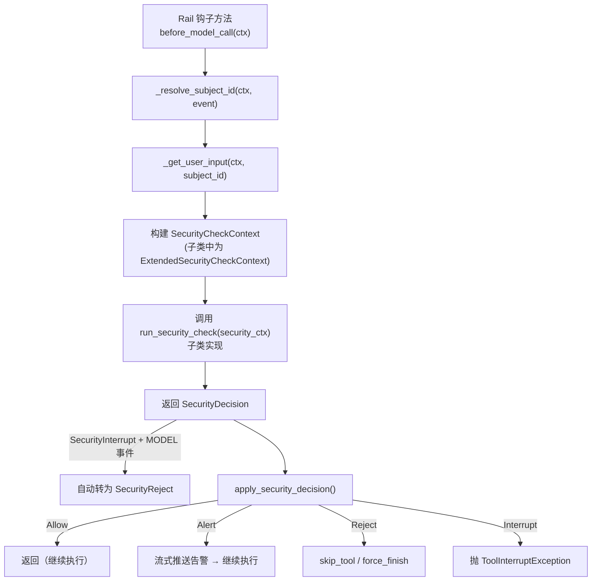
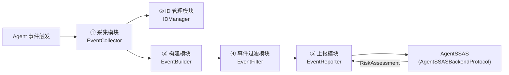
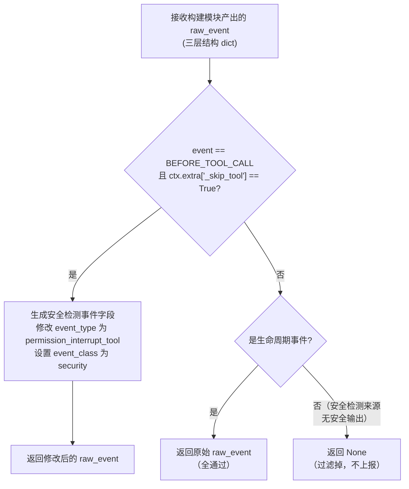
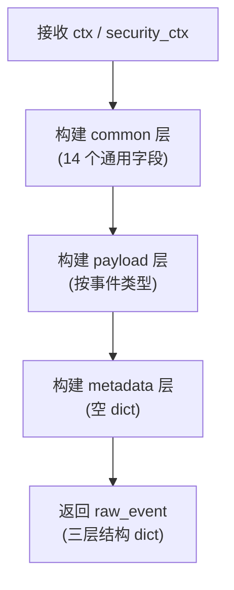

# AgentSSAS — AgentSSASClient 子系统功能设计文档

> **文档定位**：AgentSSASClient 子系统的功能设计文档。agent-core 的代码层面背景介绍全部在此文档中，不在整体架构文档中重复。
>
> **版本**：v3.1 · **子系统所在仓**：AgentSecurity/AgentSSAS（实现，子类扩展）+ jiuwenswarm（依赖声明与 Rail 注册）
>
> **核心原则**：agent-core 仓**零修改**。AgentSSASSecurityRail 继承 `BaseSecurityRail`，在子类中覆写 `_run_and_apply`、扩展 `SecurityCheckContext`、新增 `_resolve_*` 方法。依赖声明和 Rail 注册由 jiuwenswarm 仓负责。

---

## 一、子系统概述

### 1.1 子系统定位

AgentSSASClient 是 AgentSSAS 的事件采集与上报客户端，在 AgentSecurity/AgentSSAS 仓中实现（agent-core 仓零修改）。其核心类 `AgentSSASSecurityRail` 继承 agent-core 提供的 `BaseSecurityRail` 基类（位于 `openjiuwen/harness/rails/security/base_security_rail.py`），作为安全护栏体系的一员被 DeepAgent 的 Rail 挂载机制注册。

| 属性 | 值 |
|------|-----|
| 所在仓 | `AgentSecurity/AgentSSAS`（`AgentSSASSecurityRail` 实现类，子类扩展 `BaseSecurityRail`）；依赖声明与 Rail 注册在 `jiuwenswarm` 仓 |
| 基类 | `BaseSecurityRail`（继承 `AgentRail`，不经 `DeepAgentRail`，由 agent-core 提供，**零修改**） |
| priority | 80（低于 `PermissionInterruptRail` 的 90 和 `SafetyPromptRail` 的 85） |
| 职责 | 采集 Agent 行为事件 + 安全检测衍生事件，通过单一接口上报给 AgentSSAS |

### 1.2 依赖链

三个仓的依赖链如下：

```
jiuwenswarm → openjiuwen[claude,codex] (agent-core)
jiuwenswarm → agent-ssas (AgentSecurity/AgentSSAS)
```

**jiuwenswarm 在 `[project.dependencies]` 中直接声明 `"agent-ssas>=0.1.0,<0.2"`**（不是 optional-dependencies）。agent-core 仓**零修改**，不声明 agent-ssas 依赖。安装 jiuwenswarm 时默认安装 agent-ssas，agent-core 本身不感知 agent-ssas。jiuwenswarm 的 `interface_deep.py` 中通过 try/except 导入 AgentSSASSecurityRail，实现可选加载（未安装时 jiuwenswarm 正常运行）。可以通过配置关闭 SSAS（如 config.yaml 中 `ssas.enabled: false`）。

> **agent-ssas 自身依赖说明**：agent-ssas 包本身的 `pyproject.toml` 不需要声明依赖 openjiuwen（agent-core）。agent-ssas 的核心能力（接入适配 `access/`、数据预处理 `preprocessing/`、安全分析引擎等）不依赖 openjiuwen，可独立运行。只有 `agent_ssas/backend_client/openjiuwen/` 这个特定插桩目录下的代码（`AgentSSASSecurityRail`、`ExtendedSecurityCheckContext` 等）需要导入 `openjiuwen` 包中的基类（`BaseSecurityRail`、`SecurityCheckContext`），即只有该插桩运行时才需要 openjiuwen 可用。这一依赖关系在 jiuwenswarm 侧通过 try/except 导入实现可选加载，未安装 openjiuwen 时该插桩不激活，agent-ssas 的其他能力不受影响。

### 1.3 职责

AgentSSASSecurityRail 负责采集两大类事件，并通过单一接口 `report_event(event)` 上报给 AgentSSASCore 子系统：

- **生命周期事件**：Agent 运行时的 13 个生命周期事件（`AgentCallbackEvent` 全覆盖），没有安全语义，用于行为态势感知。
- **安全检测事件**：现有安全检查机制识别到异常后、准备做出 Reject 或 Interrupt 决策时产生的衍生事件，有明确的安全语义。

AgentSSASSecurityRail 还负责根据 AgentSSASCore 返回的 `RiskAssessment` 做决策映射：通过独立 YAML 策略文件（`decision_policies.yaml`）定义的策略模式，将 `risk_level` 映射为 `SecurityDecision`（Allow/Alert/Reject）。策略模式由 jiuwenswarm 的 `config.yaml` 中 `ssas.decision_policy` 选择（默认 `observe_only`，全部放行）。

事件消息格式（三层结构：common / payload / metadata）的完整定义见《AgentSSAS_01_整体架构设计文档》第四章。本文档后续章节引用该定义。

> **术语约定（raw_event）**：AgentSSASSecurityRail 传递给 AgentSSASCore 子系统的事件对象称为 **raw_event**，即上述三层结构 dict（common / payload / metadata）。本文件中出现的"事件消息 dict""三层结构事件消息 dict"均指 raw_event。`report_event(event)` 中的 `event` 参数即为 raw_event，AgentSSASCore 侧的 `AgentSSASBackendProtocol.report_event(raw_event)` 以此命名。

---

## 二、agent-core Rail 机制背景

本章为读者提供理解 AgentSSASSecurityRail 设计所需的背景知识。所有概念均来自 agent-core（`openjiuwen` 包）的 `develop` 分支源码。

### 2.1 Rail 继承体系与两套平行拦截机制

agent-core 有两套平行的拦截体系，理解它们的区别是设计 AgentSSASSecurityRail 的前提。

#### 2.1.1 完整继承树

```
AgentRail                          core, openjiuwen/core/single_agent/rail/base.py
│   priority=50
│   get_callbacks() 靠 _is_base_method 身份比较
│
├── DeepAgentRail                  openjiuwen/harness/rails/base.py
│       多 before/after_task_iteration 两个钩子
│
├── BaseInterruptRail              openjiuwen/harness/rails/interrupt/interrupt_base.py
│       priority=90
│       只覆写 before_tool_call
│       核心机制：resolve_interrupt -> InterruptDecision
│       │
│       └── ConfirmInterruptRail   openjiuwen/harness/rails/interrupt/confirm_rail.py
│               │
│               └── PermissionInterruptRail  openjiuwen/harness/rails/security/tool_security_rail.py
│                       priority=90
│                       覆写 before_tool_call（拦所有工具）
│                       覆写 resolve_interrupt（用 PermissionEngine）
│
└── BaseSecurityRail               openjiuwen/harness/rails/security/base_security_rail.py
        priority=90
        supported_events: Set[AgentCallbackEvent] = set()
        完全覆写 get_callbacks()，只按 supported_events 生成
        核心机制：run_security_check -> SecurityDecision
        │
        └── SafetyPromptRail (= SecurityRail)  prompt_security_rail.py
                priority=85
                supported_events={BEFORE_MODEL_CALL}
```

#### 2.1.2 两套体系对比

| | `BaseInterruptRail`（Interrupt 体系） | `BaseSecurityRail`（SecurityRail 体系） |
|---|---|---|
| 挂载点 | 只有 `before_tool_call` | `supported_events` 声明的任意事件 |
| 子类实现 | `resolve_interrupt(...) -> InterruptDecision` | `run_security_check(...) -> SecurityDecision` |
| 决策类型 | `ApproveResult` / `RejectResult` / `InterruptResult` | `SecurityAllow` / `SecurityReject` / `SecurityInterrupt` / `SecurityAlert` |
| 回调注册 | 继承 `AgentRail` 的 `_is_base_method` 检测 | **完全覆写 `get_callbacks()`**，只看 `supported_events` |
| priority | 90 | 90 |
| model 事件 | 不支持 | 支持（`SecurityInterrupt` 在 model 事件上静默降级为 `SecurityReject`） |

**关键纠正**：`PermissionInterruptRail` 位于 `security/` 目录下，但继承的是 `ConfirmInterruptRail → BaseInterruptRail`，属于 **Interrupt 体系**，不是 `BaseSecurityRail` 的子类。AgentSSASSecurityRail 继承的是 `BaseSecurityRail`，与 `PermissionInterruptRail` 属于不同体系。

#### 2.1.3 `get_callbacks()` 机制差异

- **AgentRail**：通过 `_is_base_method()` 做方法对象身份比较（`is`），子类不覆写的钩子不注册。
- **BaseSecurityRail**：**完全覆写 `get_callbacks()`**，不检查方法是否被覆写，只遍历 `supported_events` 集合。子类**必须声明 `supported_events`**，否则一个回调都不会注册。
- **DeepAgentRail**：合并标准回调与 `DEEP_EVENT_METHOD_MAP`（task iteration 钩子），用 `_is_deep_base` 检测。

#### 2.1.4 `PermissionInterruptRail` 的 deny 观察路径

`PermissionInterruptRail` 覆写了 `before_tool_call`，其 deny 决策通过 `_skip_tool()` 方法设置 `ctx.extra["_skip_tool"] = True`。AgentSSASSecurityRail 在 `priority=80`（低于 90）之后执行，可通过检查此标志被动观察 deny 事件。虽然两者属不同体系，但 `ctx.extra` 字典在同一 invoke 内的所有事件间共享，跨体系通信不受影响。

### 2.2 事件系统

#### 2.2.1 AgentCallbackEvent 枚举（共 13 个事件）

| 事件 | 值 | 触发时机 | inputs 类型 | 事件路由 |
|------|-----|---------|------------|---------|
| `BEFORE_INVOKE` | `before_invoke` | `agent.invoke()` 开始 | `InvokeInputs` | 外层 DeepAgent |
| `AFTER_INVOKE` | `after_invoke` | `agent.invoke()` 完成 | `InvokeInputs` | 外层 DeepAgent |
| `ON_USER_MESSAGE` | `on_user_message` | 用户输入写入会话前 | `UserMessageInputs` | 内层 ReActAgent |
| `BEFORE_TASK_ITERATION` | `before_task_iteration` | 外层任务迭代开始 | `TaskIterationInputs` | 外层 DeepAgent |
| `AFTER_TASK_ITERATION` | `after_task_iteration` | 外层任务迭代完成 | `TaskIterationInputs` | 外层 DeepAgent |
| `AFTER_REACT_ITERATION` | `after_react_iteration` | 一次 ReAct 迭代完成 | （继承当前 inputs） | 内层 ReActAgent |
| `BEFORE_MODEL_CALL` | `before_model_call` | LLM 调用前 | `ModelCallInputs` | 内层 ReActAgent |
| `AFTER_MODEL_CALL` | `after_model_call` | LLM 响应后 | `ModelCallInputs` | 内层 ReActAgent |
| `ON_MODEL_EXCEPTION` | `on_model_exception` | LLM 调用异常 | （继承当前 inputs） | 内层 ReActAgent |
| `BEFORE_TOOL_CALL` | `before_tool_call` | 工具执行前 | `ToolCallInputs` | 内层 ReActAgent |
| `AFTER_TOOL_CALL` | `after_tool_call` | 工具执行后 | `ToolCallInputs` | 内层 ReActAgent |
| `ON_TOOL_EXCEPTION` | `on_tool_exception` | 工具执行异常 | （继承当前 inputs） | 内层 ReActAgent |
| `BEFORE_STEERING_DRAIN` | `before_steering_drain` | steering 消费前 | `SteeringDrainInputs` | 内层 ReActAgent |

#### 2.2.2 事件路由机制

`DeepAgent` 持有两个 callback-manager 命名空间。Rail 注册时按事件类型路由到其中一个：

| 集合 | 路由到 | 成员 |
|------|--------|------|
| `_BRIDGE_EVENTS` | 内层 `ReActAgent` | 9 个：MODEL_CALL×2、TOOL_CALL×2、EXCEPTION×2、REACT_ITERATION、USER_MESSAGE、STEERING_DRAIN |
| `_OUTER_ONLY_EVENTS` | 外层 `DeepAgent` | 2 个：BEFORE_INVOKE、AFTER_INVOKE |
| `_DEEP_EVENTS` | 外层 `DeepAgent` | 2 个：TASK_ITERATION×2 |

三集合完全覆盖 13 个事件且互不相交。

#### 2.2.3 迭代层级关系

```
Session（会话）
└── Invoke（一次用户交互）
    └── Task Iteration（外层任务迭代，BEFORE/AFTER_TASK_ITERATION）
        └── ReAct Iteration（内层 ReAct 迭代）
            ├── LLM Call（BEFORE/AFTER_MODEL_CALL）
            └── Tool Call(s)（BEFORE/AFTER_TOOL_CALL，可并行）
```

- **Task Iteration** 是 DeepAgent（外层）的任务循环。`BEFORE/AFTER_TASK_ITERATION` 标记外层迭代的开始和结束。
- **ReAct Iteration** 是 ReActAgent（内层）的推理-行动循环。每次 ReAct 迭代 = 一次 LLM 调用 + 可能触发的工具调用。agent-core 只提供 `AFTER_REACT_ITERATION`，没有对应的 BEFORE 事件——因为 ReAct 迭代的开始就是 `BEFORE_MODEL_CALL`。

### 2.3 AgentCallbackContext 定义

所有 Rail 钩子方法接收 `AgentCallbackContext` 对象，它是访问 Agent 运行时状态的统一入口（源码位于 `openjiuwen/core/single_agent/rail/base.py`）：

```python
@dataclass
class AgentCallbackContext:
    agent: 'BaseAgent'                              # Agent 实例（唯一必填字段）
    event: Optional[AgentCallbackEvent] = None       # 当前事件
    inputs: EventInputs = field(default_factory=dict)  # 当前事件输入
    config: Any = None                               # 运行时配置
    session: Optional[Session] = None                # 会话对象
    context: Optional[ModelContext] = None           # 模型上下文
    extra: Dict[str, Any] = field(default_factory=dict)  # 跨 Rail 共享字典
    exception: Optional[Exception] = None            # 异常对象
    retry_attempt: int = 0                           # 重试计数
    invoke_start_time: float = 0.0                   # invoke 开始时间戳
```

`extra` 字典是跨 Rail 通信的唯一通道，在同一 agent 层内的多个事件间共享，**跨体系有效**。

> **ctx.extra 共享范围说明**（通过 agent-core 源码确认）：
>
> agent-core 中存在三个独立的 `AgentCallbackContext` 实例：
> - 外层 DeepAgent ctx（BEFORE/AFTER_INVOKE 事件）
> - 迭代层 TaskLoopExecutor ctx（BEFORE/AFTER_TASK_ITERATION 事件）
> - 内层 ReActAgent ctx（BEFORE/AFTER_MODEL_CALL、BEFORE/AFTER_TOOL_CALL 等事件）
>
> **`ctx.extra` 不跨层共享**（三个独立 dict 实例）。DeepAgent 调用 ReActAgent 时只传 inputs dict，不传 ctx 或 extra。但**同一层内共享**：内层 ReActAgent 的 ctx 贯穿整个 ReAct 循环，`_call_model` 和 `_execute_tool_call` 共用同一 ctx；工具调用 ctx 显式 `extra=ctx.extra`（`ability_manager.py` 中设置），共享同一 dict 引用。
>
> **对 ID 管理的影响**：
> - `interaction_seq` 需要跨层共享（外层 DeepAgent BEFORE_INVOKE 设置 → 内层 ReActAgent 读取），但 ctx.extra 不跨层 → 使用 session 级 LRU 池存储（见第六章 IDManager）
> - `llm_call_seq` 和 `tool_call_seq` 只在同一 interaction 内使用，内层 ReActAgent 的 ctx.extra 在内层事件间已共享 → 继续使用 ctx.extra，无需额外存储

AgentSSASSecurityRail 利用 `ctx.extra` 传递 `llm_call_seq`、`tool_call_seq` 等字段（内层共享），以及观察 `PermissionInterruptRail` 的 `_skip_tool` 标志。`interaction_seq` 使用 session 级 LRU 池存储（见第六章 IDManager）。

`inputs` 字段的类型标注为 `EventInputs`，根据当前 `event` 的不同，实际运行时类型为 `InvokeInputs`、`UserMessageInputs`、`TaskIterationInputs`、`ModelCallInputs`、`ToolCallInputs` 或 `SteeringDrainInputs` 之一。SSAS 代码中通过 `getattr(ctx.inputs, "field_name", default)` 安全访问各类型特有字段。

### 2.4 BaseSecurityRail 基类

`BaseSecurityRail` 是 agent-core 在 `openjiuwen/harness/rails/security/base_security_rail.py` 中提供的安全护栏基类。它继承 `AgentRail`（不经 `DeepAgentRail`），封装了安全检查的标准流程。

#### 2.4.1 核心机制



#### 2.4.2 SecurityCheckContext

当前 5 个字段（agent-core 原样，**不修改**）。SSAS 在子类中通过继承扩展为 `ExtendedSecurityCheckContext`（详见第九章），不改 agent-core 的原始定义：

```python
@dataclass
class SecurityCheckContext:
    callback_ctx: AgentCallbackContext
    event: AgentCallbackEvent
    user_input: Any | None = None
    auto_confirm_config: dict[str, Any] | None = None
    subject_id: str = ""
```

#### 2.4.3 SecurityDecision 决策类型

| 类型 | 说明 | 对执行的影响 |
|------|------|------------|
| `SecurityAllow` | 放行 | 继续执行 |
| `SecurityReject` | 拒绝 | MODEL 事件→force_finish；BEFORE_TOOL_CALL→skip_tool |
| `SecurityAlert` | 告警 | 流式推送告警消息后继续执行 |
| `SecurityInterrupt` | 中断 | 抛 `ToolInterruptException`（仅 TOOL 事件支持，MODEL 事件自动转为 Reject） |

#### 2.4.4 SecurityAlertLevel（4 个值）

```python
class SecurityAlertLevel(str, Enum):
    INFO = "info"
    WARNING = "warning"
    ERROR = "error"
    CRITICAL = "critical"
```

#### 2.4.5 辅助方法表

`BaseSecurityRail` 还提供以下辅助方法可供 `AgentSSASSecurityRail` 复用：

| 方法 | 用途 |
|------|------|
| `_resolve_subject_id(ctx, event)` | 解析安全检查的主体 ID（工具事件用 `tool_call.id`，其他事件用 `类名:event值`）。AgentSSASSecurityRail 子类覆写 `_run_and_apply` 时复用此方法 |
| `_get_user_input(ctx, subject_id)` | 从 `ctx.extra` 的 resume 用户输入中提取主体对应的输入。AgentSSASSecurityRail 子类覆写 `_run_and_apply` 时复用此方法 |
| `_get_auto_confirm_config(ctx)` | 从 session 状态中获取自动确认配置。AgentSSASSecurityRail 子类覆写 `_run_and_apply` 时复用此方法 |
| `_pop_last_user_message(ctx)` | 删除当前轮用户消息（BEFORE_MODEL_CALL 用） |
| `_pop_matching_messages(ctx, patterns)` | 删除历史匹配消息（AFTER_MODEL_CALL 清理用） |
| `_sanitize_matching_messages(ctx, patterns, replacement)` | 脱敏不阻断，替换匹配内容 |
| `_handle_interrupt_resume(security_ctx, auto_confirm_key)` | 通用 interrupt resume 模式 |
| `_extract_message_content(msg)` | 从消息对象提取字符串内容 |
| `_contains_any_pattern(text, patterns)` | 检查文本是否匹配任一正则 |

### 2.5 BaseSecurityRail 的工厂方法

`BaseSecurityRail` 为子类提供以下工厂方法，用于构造 `SecurityDecision` 子类实例：

```python
def allow(self, new_args=None) -> SecurityAllow: ...
def reject(self, message="", *, result=None, tool_result=None, tool_message=None) -> SecurityReject: ...
def interrupt(self, request, *, subject_id="") -> SecurityInterrupt: ...
def alert(self, message, level=SecurityAlertLevel.WARNING, alert_type="security",
          display_mode="popup") -> SecurityAlert: ...
```

此外，`BaseSecurityRail._run_and_apply(ctx, event)` 是安全检测事件的核心入口方法。SSAS 不修改此方法，而是在 `AgentSSASSecurityRail` 子类中覆写它以填充 ID 字段（详见第九章），agent-core 的原始 `_run_and_apply` 保持不变。

### 2.6 priority 机制说明

Rail 按 `priority` 降序执行，**数值越大越先执行**。AgentSSASSecurityRail 设为 80，低于以下安全 Rail：

| Rail | priority | 体系 |
|------|----------|------|
| `PermissionInterruptRail` | 90 | Interrupt 体系 |
| `BaseSecurityRail`（基类默认） | 90 | SecurityRail 体系 |
| `SafetyPromptRail` | 85 | SecurityRail 体系 |
| **`AgentSSASSecurityRail`** | **80** | SecurityRail 体系 |

AgentSSASSecurityRail 在其他安全 Rail 之后执行，因此能观察到前序 Rail 的决策结果（如 `PermissionInterruptRail` deny 后设置的 `ctx.extra["_skip_tool"]` 标志）。

---

## 三、内部模块架构设计

AgentSSASClient 子系统内部由五个模块组成，各模块职责独立、串联运行。

### 3.1 模块总览



| 模块 | 类名 | 职责 |
|------|------|------|
| ① 采集模块 | `EventCollector` | 接收事件的钩子调用，分发到后续模块 |
| ② ID 管理模块 | `IDManager` | 生成和管理 `interaction_seq`（组内整数自增序号）、`llm_call_seq`（整数自增序号）、`tool_call_seq`（整数自增序号）等标识字段。三个计数器均存储当前序号，初始值为 -1，BEFORE_xxx 时先自增再使用 |
| ③ 构建模块 | `EventBuilder` | 将 `AgentCallbackContext` 转换为 raw_event（三层结构 dict：common / payload / metadata） |
| ④ 事件过滤模块 | `EventFilter` | 针对事件类型和不同策略进行过滤，决定是否上报及是否生成安全检测事件字段 |
| ⑤ 上报模块 | `EventReporter` | 通过 `AgentSSASBackendProtocol.report_event(raw_event)` 将 raw_event 上报给 AgentSSAS，处理 fail-open |

### 3.2 模块间运行流程

每次事件触发时，模块间按以下流程串联：

1. **Agent 事件触发** → DeepAgent 按 priority 降序调用各 Rail 钩子。AgentSSASSecurityRail（priority=80）在 PermissionInterruptRail(90)、SafetyPromptRail(85) 之后执行。
2. **采集模块** 接收钩子调用，判断该事件走管线（6 个事件经 AgentSSASSecurityRail 子类覆写的 `_run_and_apply → run_security_check`）还是直接覆写钩子（7 个事件，为后续版本拓展）。
3. **ID 管理模块** 在 BEFORE_INVOKE 时将 session 级 LRU 池中该 session 的 `interaction_seq` 先自增（初始值 -1，自增后为 0）再使用作为 `interaction_seq`，后续所有事件从 LRU 池复用。在 BEFORE_MODEL_CALL 时将 `ctx.extra["llm_call_seq"]` 先自增再使用；AFTER_MODEL_CALL 复用。在 BEFORE_TOOL_CALL 时将 `ctx.extra["tool_call_seq"]` 先自增再使用；AFTER_TOOL_CALL 复用。BEFORE_TOOL_CALL/AFTER_TOOL_CALL 的 `llm_call_seq` 直接从 `ctx.extra["llm_call_seq"]` 读取当前值，即工具调用所属的大模型调用序号。三个计数器均存储当前序号，初始值为 -1。
4. **构建模块** 从 `AgentCallbackContext` 中提取通用字段和 payload 字段，组装成 raw_event（三层结构 dict：common / payload / metadata）。
5. **事件过滤模块** 针对事件类型和不同策略进行过滤。输入是构建模块产出的 raw_event，输出是过滤后的 raw_event（可能被修改了 `event_type`、`event_class` 和 `payload`）或 `None`（被过滤掉，不上报）。如 `ctx.extra["_skip_tool"]` 为 True 时，将 `event_type` 改为 `permission_interrupt_tool`、`event_class` 设置为 `security`，并生成安全检测事件字段。
6. **上报模块** 通过 `AgentSSASBackendProtocol.report_event(raw_event)` 将 raw_event 上报给 AgentSSAS，获取返回的 `RiskAssessment`，再通过 `_assessment_to_decision()` 映射为 `SecurityDecision`。异常时 fail-open 返回 `SecurityAllow()`。

---

## 四、采集模块（EventCollector）

### 4.1 职责

采集模块是 AgentSSASSecurityRail 的入口，负责接收 agent-core 的事件钩子调用，并将处理逻辑分发到后续模块。它区分走管线的事件和直接覆写钩子的事件。无论走哪条路径，采集模块最终产出的、用于上报给 AgentSSASCore 子系统的对象均为 **raw_event**（三层结构 dict，见 1.3 节术语约定）。

### 4.2 事件分类

13 个生命周期事件分为两组处理。**两类事件都通过 AgentSSASSecurityRail（继承 BaseSecurityRail）监听**，区别在于处理方式不同：

- **走管线的事件**（6 个）：经过 AgentSSASSecurityRail 子类覆写的 `_run_and_apply()` → `ExtendedSecurityCheckContext` 构建 → `run_security_check()` → `apply_security_decision()` 的完整决策应用流程。这些事件**支持决策**（AgentSSASCore 子系统可以返回 Reject/Alert/Interrupt 等决策并通过 `apply_security_decision()` 应用）。agent-core 的原始 `_run_and_apply()` 保持不变。
- **直接覆写钩子的事件**（7 个）：直接覆写 `AgentRail` 的钩子方法（如 `on_user_message`），**不走 `_run_and_apply → run_security_check` 管线**。这些事件仍然由 AgentSSASSecurityRail 自己的钩子监听（不是通过别的 Rail），只是不走决策应用流程。因此**不支持决策**——即使 AgentSSAS 返回了 Reject 等决策，也无法通过 `apply_security_decision()` 应用到 Agent 执行流。

| 事件 | event_type | 处理方式 | 支持决策 | 版本支持情况 |
|------|------------|---------|---------|------------|
| `BEFORE_INVOKE` | `invoke_start` | 走管线 | Yes | ✅ 0.1版本支持 |
| `AFTER_INVOKE` | `invoke_end` | 走管线 | Yes | ✅ 0.1版本支持 |
| `BEFORE_MODEL_CALL` | `llm_input` | 走管线 | Yes | ✅ 0.1版本支持 |
| `AFTER_MODEL_CALL` | `llm_output` | 走管线 | Yes | ✅ 0.1版本支持 |
| `BEFORE_TOOL_CALL` | `tool_input` | 走管线 | Yes | ✅ 0.1版本支持 |
| `AFTER_TOOL_CALL` | `tool_output` | 走管线 | Yes | ✅ 0.1版本支持 |
| `ON_USER_MESSAGE` | `user_message` | 直接覆写钩子 | No | ⚠️ 后续版本拓展 |
| `BEFORE_STEERING_DRAIN` | `steering_drain` | 直接覆写钩子 | No | ⚠️ 后续版本拓展 |
| `BEFORE_TASK_ITERATION` | `task_iteration_start` | 直接覆写钩子 | No | ⚠️ 后续版本拓展 |
| `AFTER_TASK_ITERATION` | `task_iteration_end` | 直接覆写钩子 | No | ⚠️ 后续版本拓展 |
| `AFTER_REACT_ITERATION` | `react_iteration_end` | 直接覆写钩子 | No | ⚠️ 后续版本拓展 |
| `ON_MODEL_EXCEPTION` | `model_exception` | 直接覆写钩子 | No | ⚠️ 后续版本拓展 |
| `ON_TOOL_EXCEPTION` | `tool_exception` | 直接覆写钩子 | No | ⚠️ 后续版本拓展 |

> **0.1版本仅实现通过安全护栏可以监听的事件（6 个走管线事件）**，其他 7 个直接覆写钩子的事件作为后续版本拓展项，后续版本补全。走管线的事件经过 `ExtendedSecurityCheckContext` 构建和 `apply_security_decision()` 应用决策的完整流程；直接覆写的事件由采集模块自己控制采集和上报逻辑，不走决策应用流程，因此不支持决策。

### 4.3 supported_events 声明

AgentSSASSecurityRail 继承 `BaseSecurityRail` 后，必须声明 `supported_events` 集合（否则一个回调都不会注册）。声明为走管线的 6 个事件：

```python
class AgentSSASSecurityRail(BaseSecurityRail):
    priority: int = 80
    supported_events: Set[AgentCallbackEvent] = _PIPELINE_EVENTS
```

`BaseSecurityRail.get_callbacks()` 根据 `supported_events` 生成回调映射，自动注册这 6 个事件的钩子（基类统一转发到 `_run_and_apply`，由 AgentSSASSecurityRail 子类覆写 `_run_and_apply` 来构建扩展上下文并填充 ID 字段，agent-core 的原始实现保持不变）。

直接覆写的 7 个事件通过覆写对应钩子方法，被 `AgentRail.get_callbacks()` 的 `_is_base_method` 检测到方法已被子类覆写而自动注册。0.1版本这 7 个事件尚未实现（后续版本拓展）。

### 4.4 异常事件说明

`ON_MODEL_EXCEPTION` 和 `ON_TOOL_EXCEPTION` 是 Agent 运行时自身的技术异常，不是安全检查的异常：

- `ON_MODEL_EXCEPTION`：LLM 调用异常（如 API 超时、网络错误、模型服务不可用等）
- `ON_TOOL_EXCEPTION`：工具执行异常（如工具函数报错、参数解析失败等）

这些异常事件属于生命周期事件，采集模块采集它们用于行为态势感知（如追踪 Agent 运行健康度、异常频率等），而非安全检测。虽然异常本身可能间接涉及安全问题，但安全语义需要 AgentSSASCore 侧的分析引擎来判断。这两个事件为后续版本拓展。

---

## 五、事件过滤模块（EventFilter）

### 5.1 职责

事件过滤模块是一个**通用的过滤模块**，针对事件类型和不同的策略进行过滤。它的输入是构建模块产出的 raw_event（三层结构 dict），输出是过滤后的 raw_event（可能被修改了 `event_type`、`event_class` 和 `payload`）或 `None`（被过滤掉，不上报）。

### 5.2 过滤策略

事件过滤模块按以下策略对事件进行过滤：

| 策略 | 适用场景 | 过滤行为 |
|------|---------|---------|
| 生命周期事件 | 13 个生命周期事件 | **全通过**（上报给 AgentSSAS，用于行为态势感知） |
| SafetyPromptRail 相关 | `BEFORE_MODEL_CALL` 事件中 SafetyPromptRail 的输出 | **不产生安全检测事件**（SafetyPromptRail 始终返回 Allow 且无安全检测输出；`BEFORE_MODEL_CALL` 本身作为生命周期事件仍通过，只是不会转化为安全检测事件） |
| PermissionInterruptRail | `BEFORE_TOOL_CALL` 事件中 PermissionInterruptRail 的 deny | 当 `ctx.extra["_skip_tool"]` 为 True 时**才生成安全检测事件**（修改 `event_type` 为 `permission_interrupt_tool`、`event_class` 为 `security`，并生成安全检测事件字段）；为 False 时作为生命周期事件通过 |
| 未来扩展 | 新的安全 Rail 或新的过滤规则 | 在此模块中扩展新的过滤策略 |

**过滤策略详解**：

1. **生命周期事件全通过**：所有 13 个生命周期事件作为行为态势感知数据，全部上报给 AgentSSAS。过滤模块对这些事件不做修改，直接返回原始 raw_event。

2. **SafetyPromptRail 不产生安全检测事件**：`SafetyPromptRail` 内部没有任何风险检测或分级机制，它只是在 `BEFORE_MODEL_CALL` 注入安全提示文本然后返回 `allow()`，始终返回 `SecurityAllow` 且不做检测。因此不会从 `SafetyPromptRail` 产生安全检测事件。`BEFORE_MODEL_CALL` 事件本身作为生命周期事件仍然上报（策略 1），只是不会转化为安全检测事件。

3. **PermissionInterruptRail 条件生成安全检测事件**：`PermissionInterruptRail` 在 deny 时设置 `ctx.extra["_skip_tool"] = True`。事件过滤模块在 `BEFORE_TOOL_CALL` 事件中检查此标志：
   - 为 True → 生成安全检测结果字段（`risk_source`、`risk_type`、`risk_level`、`decision`、`evidence`）合并到 payload 中，并将 `common.event_type` 改为 `permission_interrupt_tool`、`common.event_class` 设置为 `security`，返回修改后的 raw_event。
   - 为 False → 作为生命周期事件通过（策略 1），不生成安全检测事件字段。

4. **跨体系通信**：`ctx.extra` 字典在同一 invoke 内的所有事件间共享，跨体系通信不受影响。AgentSSASSecurityRail（SecurityRail 体系）可以读取 `PermissionInterruptRail`（Interrupt 体系）设置的 `_skip_tool` 标志。

### 5.3 过滤逻辑



事件过滤模块仅在 `BEFORE_TOOL_CALL` 事件中检查 `ctx.extra["_skip_tool"]` 标志（因为 `PermissionInterruptRail` 只覆写了 `before_tool_call`）。对于其他事件，直接作为生命周期事件通过。

> **设计说明**：事件过滤模块的设计是通用的、可扩展的。0.1版本实现了生命周期事件全通过、PermissionInterruptRail deny 检测两个策略。未来新增安全 Rail 或新的过滤规则时，只需在此模块中添加新的过滤策略，不影响其他模块。

---

## 六、ID 管理模块（IDManager）

### 6.1 职责

ID 管理模块负责生成和管理以下标识字段。所有由计数器生成的 ID 均为 **int 类型**（不是 UUID，也不是字符串）：

| 字段 | 生成时机 | 生成方式 | 复用规则 |
|------|---------|---------|---------|
| `interaction_seq` | BEFORE_INVOKE（初始值 -1，先自增再使用） | 组内整数自增序号（从 0 开始，初始值为 -1，BEFORE_INVOKE 时先自增再使用） | 同一 invoke 内所有事件复用 |
| `llm_call_seq` | BEFORE_MODEL_CALL（初始值 -1，先自增再使用）/ BEFORE_TOOL_CALL（tool_call 事件） | llm_call 事件：组内整数自增序号（从 0 开始，初始值为 -1，BEFORE_MODEL_CALL 时先自增再使用）；tool_call 事件：直接从 ctx.extra['llm_call_seq'] 读取当前值 | llm_call 事件中同一 LLM 调用的 AFTER_MODEL_CALL 复用；tool_call 事件中同一工具调用的 AFTER_TOOL_CALL 复用同一值 |
| `tool_call_seq` | BEFORE_TOOL_CALL（初始值 -1，先自增再使用） | 组内整数自增序号（从 0 开始，初始值为 -1，BEFORE_TOOL_CALL 时先自增再使用） | 同一工具调用的 AFTER_TOOL_CALL 复用 |
| `tool_call_id` | BEFORE_TOOL_CALL | LLM provider 返回的字符串（从 `tool_call.id` 读取） | 同一工具调用的 AFTER_TOOL_CALL 复用 |
| `subsession_id` | BEFORE_INVOKE | 从 `inputs.parent_session_id` 获取 | 子 Agent 场景使用 |

> **`llm_call_seq` 语义说明**：如果当前事件是 llm_call 事件（llm_input/llm_output），`llm_call_seq` 就是这次大模型调用的序号；如果当前事件是 tool_call 事件（tool_input/tool_output），`llm_call_seq` 就是这个工具调用所属的大模型调用的序号。一个字段在两种事件类型下承担不同语义，简化了字段命名。

三个计数器中：
- `interaction_seq` 使用 **session 级 LRU 池**存储（跨 DeepAgent/ReActAgent 层共享，因 ctx.extra 不跨层）
- `llm_call_seq` 和 `tool_call_seq` 继续使用 **ctx.extra**（内层 ReActAgent 的 ctx.extra 在内层事件间已共享）

> **LRU 池设计**：`IDManager` 维护 `session_id → interaction_seq` 的 `OrderedDict`，最大 100 个 session，池满时 LRU 淘汰最久未使用的。线程安全（`threading.Lock`），所有读-改-写操作在单次加锁内完成。池满淘汰后，被淘汰 session 的后续事件将重新从 -1 开始计数（id_manager.py 行为）；该局限已在规划中——后续版本将基于 `session_end` 事件实现精确生命周期管理。

ID 管理模块还需解析其余会话标识字段（`session_id`、`agent_id`、`trace_id`、`context_id`、`conversation_id`）。

### 6.2 interaction_seq 管理（session 级 LRU 池，跨层共享）

`interaction_seq` 为**组内整数自增序号**（int 类型）：

- **上层 ID 组**：`session_id + agent_id + conversation_id`。这三个 ID 确定后，唯一确定了一个 interaction 数组。
- **序号**：interaction 数组中的顺序序号就是 `interaction_seq`，从 0 开始增量递增，类型为 `int`。
- **生成时机**：BEFORE_INVOKE 时生成序号，后续所有事件复用。

> **为什么用 session 级 LRU 池而非 ctx.extra**：通过 agent-core 源码确认，DeepAgent 外层和 ReActAgent 内层各自创建独立的 `AgentCallbackContext` 实例，`ctx.extra` 不跨层共享。`interaction_seq` 在 BEFORE_INVOKE（外层 DeepAgent）时生成，但需要在内层 ReActAgent 事件（llm_input、tool_input 等）中读取。因此必须使用独立于 ctx.extra 的存储。

ID 管理模块在 session 级 LRU 池中维护 `interaction_seq`，存储当前序号，初始值为 -1，BEFORE_INVOKE 时先自增再使用（实现版本，id_manager.py）：

```python
def _ensure_interaction_seq(self, ctx: AgentCallbackContext, event: AgentCallbackEvent = None) -> int:
    """获取或生成 interaction_seq(session 级,BEFORE_INVOKE 时自增)。

    使用 session 级 LRU 池存储,跨 DeepAgent/ReActAgent 层共享。
    初始值为 -1,BEFORE_INVOKE 时先自增再使用。
    后续事件复用同一序号(从 LRU 池读取当前值)。
    """
    session_id = self._resolve_session_id(ctx)
    if event is not None and event != AgentCallbackEvent.BEFORE_INVOKE:
        # 非 BEFORE_INVOKE:从 LRU 池复用当前值
        return self._get_interaction_seq_from_pool(session_id)
    # BEFORE_INVOKE 或未指定事件:原子自增
    return self._increment_interaction_seq_in_pool(session_id)
```

LRU 池的两个内部方法：

- `_get_interaction_seq_from_pool(session_id)`：**只读复用**。从 LRU 池读取当前序号并更新 LRU 顺序（移到末尾表示最近使用）；session 不存在时创建初始值 -1（池满时先淘汰最久未使用的 session）。
- `_increment_interaction_seq_in_pool(session_id)`：**原子自增**。在单次加锁（`threading.Lock`）内完成读-改-写自增；池满 100（`_MAX_SESSIONS = 100`）时淘汰最久未使用的 session（`OrderedDict` 头部）。session_id 为空时使用 `"__no_session__"` 占位键。

逻辑说明（基于 LRU 池）：
- 池中每个 session 的初始值为 -1。
- 第一次 BEFORE_INVOKE：-1 自增为 0，使用 0。
- 后续事件（同一 invoke 内）：从 LRU 池读取当前值，复用 0。
- 第二次 BEFORE_INVOKE：0 自增为 1，使用 1。
- 依此类推。

> **计数器语义澄清**：LRU 池按 `session_id` 存储当前序号，初始值为 -1。BEFORE_INVOKE 时先自增再使用。

### 6.3 llm_call_seq 管理

`llm_call_seq` 为**整数自增序号**（int 类型），在不同事件类型下承担不同语义：

- **llm_call 事件**（llm_input/llm_output）：`llm_call_seq` 就是这次大模型调用的序号。
  - **生成时机**：BEFORE_MODEL_CALL 时先自增再使用（初始值 -1，自增后为 0）。
  - **复用规则**：AFTER_MODEL_CALL 复用同一个 `llm_call_seq`。
- **tool_call 事件**（tool_input/tool_output）：`llm_call_seq` 就是这个工具调用所属的大模型调用的序号。
  - **取值方式**：直接从 `ctx.extra["llm_call_seq"]` 读取当前值。
  - **语义**：工具调用由 LLM 响应触发，此字段记录触发的 LLM 调用。

- **存储位置**：`ctx.extra["llm_call_seq"]`（当前序号，初始值 -1，BEFORE_MODEL_CALL 时先自增再使用；AFTER_MODEL_CALL 及 tool_call 事件复用当前值）。

```python
def _ensure_llm_call_seq(self, ctx: AgentCallbackContext, event: AgentCallbackEvent) -> int:
    """获取或生成 llm_call_seq（整数自增序号）。

    初始值为 -1，BEFORE_MODEL_CALL 时先自增再使用，AFTER_MODEL_CALL 复用。
    tool_call 事件直接读取当前值。
    """
    if event == AgentCallbackEvent.BEFORE_MODEL_CALL:
        seq = ctx.extra.get("llm_call_seq", -1)
        seq += 1
        ctx.extra["llm_call_seq"] = seq
        return seq
    # AFTER_MODEL_CALL 及 tool_call 事件复用当前值
    return ctx.extra.get("llm_call_seq", -1)
```

逻辑说明：
- 初始值为 -1。
- 第一次 BEFORE_MODEL_CALL：-1 自增为 0，使用 0。
- AFTER_MODEL_CALL：从 `ctx.extra["llm_call_seq"]` 读取，复用 0。
- tool_call 事件：直接读取当前值。
- 第二次 BEFORE_MODEL_CALL：0 自增为 1，使用 1。
- 依此类推。

> **tool_call 事件取值**：tool_call 事件（tool_input/tool_output）的 `llm_call_seq` 不走计数器自增逻辑，而是直接从 `ctx.extra["llm_call_seq"]` 读取当前值，即工具调用所属的大模型调用序号。语义不变，字段名由原 `tool_call_parent_llm_call_seq` 简化为 `llm_call_seq`。

### 6.4 tool_call_seq 管理

`tool_call_seq` 用于区分同一个 LLM 调用触发的多次工具调用，为**整数自增序号**（int 类型）：

- **生成时机**：BEFORE_TOOL_CALL 时先自增再使用（初始值 -1，自增后为 0）。
- **复用规则**：AFTER_TOOL_CALL 复用同一个 `tool_call_seq`。
- **存储位置**：`ctx.extra["tool_call_seq"]`（当前序号，初始值 -1，BEFORE_TOOL_CALL 时先自增再使用；AFTER_TOOL_CALL 复用当前值）。

```python
def _ensure_tool_call_seq(self, ctx: AgentCallbackContext, event: AgentCallbackEvent) -> int:
    """获取或生成 tool_call_seq（整数自增序号）。

    初始值为 -1，BEFORE_TOOL_CALL 时先自增再使用，AFTER_TOOL_CALL 复用。
    """
    if event == AgentCallbackEvent.BEFORE_TOOL_CALL:
        seq = ctx.extra.get("tool_call_seq", -1)
        seq += 1
        ctx.extra["tool_call_seq"] = seq
        return seq
    # AFTER_TOOL_CALL 复用当前值
    return ctx.extra.get("tool_call_seq", -1)
```

逻辑说明：
- 初始值为 -1。
- 第一次 BEFORE_TOOL_CALL：-1 自增为 0，使用 0。
- AFTER_TOOL_CALL：从 `ctx.extra["tool_call_seq"]` 读取，复用 0。
- 第二次 BEFORE_TOOL_CALL：0 自增为 1，使用 1。
- 依此类推。

### 6.5 subsession_id 管理

`subsession_id` 用于子 Agent 场景：

- **子 Agent 场景**：子 Agent 的 `parent_session_id` 值写入 `subsession_id`，`session_id` 用子 Agent 自己的 `session_id`。
- **非子 Agent 场景**：为空字符串。
- **获取方式**：从 `inputs.parent_session_id` 获取（在 BEFORE_INVOKE 时）。

```python
def _resolve_subsession_id(self, ctx: AgentCallbackContext) -> str:
    """获取 subsession_id。

    子 Agent 场景下，子 Agent 的 parent_session_id 写入 subsession_id，
    session_id 用子 Agent 自己的 session_id。非子 Agent 场景为空字符串。
    """
    try:
        return getattr(ctx.inputs, "parent_session_id", "") or ""
    except Exception:
        return ""
```

### 6.6 会话标识字段解析

ID 管理模块通过 `_resolve_*` 方法解析其余会话标识字段。所有方法用 try/except 包裹，异常时记录 `logger.debug` 日志（含 `exc_info=True`）并返回空字符串，保证健壮性且便于排查 ID 丢失问题：

| 方法 | 解析字段 | 来源 |
|------|---------|------|
| `_resolve_session_id(ctx)` | `session_id` | `ctx.session.get_session_id()` |
| `_resolve_agent_id(ctx)` | `agent_id` | `ctx.agent.card.id` |
| `_resolve_trace_id(ctx)` | `trace_id` | `ctx.session._inner._tracer._trace_id` |
| `_resolve_context_id(ctx)` | `context_id` | `ctx.context.context_id()` |
| `_resolve_conversation_id(ctx, event)` | `conversation_id` | 优先从 `inputs.conversation_id` 获取，回退到 `ctx.extra["conversation_id"]` 缓存 |
| `_resolve_tool_name(ctx, event)` | `tool_name` | `ctx.inputs.tool_name`（仅 TOOL 事件） |
| `_resolve_tool_call_id(tool_call)` | `tool_call_id` | `tool_call.id`（LLM provider 返回的字符串，仅 TOOL 事件） |

> **`_resolve_trace_id` 实现风险**：依赖 agent-core 私有属性链（`ctx.session._inner._tracer._trace_id`），上游升级需回归验证（实现已做 try/except 兜底返回空串）。

### 6.7 context_id 可靠性

`context_id` 是模型对话上下文（ModelContext）的标识。ModelContext 在 invoke 开始后才创建。因此：

- **invoke 级/外层事件**（BEFORE/AFTER_INVOKE、ON_USER_MESSAGE、BEFORE_STEERING_DRAIN、BEFORE/AFTER_TASK_ITERATION）：ModelContext 可能尚未初始化，`context_id` 为空字符串。
- **invoke 内部事件**（BEFORE/AFTER_MODEL_CALL、BEFORE/AFTER_TOOL_CALL、ON_MODEL/TOOL_EXCEPTION、AFTER_REACT_ITERATION）：ModelContext 已创建，`context_id` 可靠。

其余会话标识字段（interaction_seq、session_id、agent_id、trace_id、conversation_id、llm_call_seq、tool_call_seq、subsession_id）在所有事件中均可可靠获取。

---

## 七、构建模块（EventBuilder）

### 7.1 职责

构建模块将 `AgentCallbackContext` 和 `ExtendedSecurityCheckContext` 中的数据转换为 **raw_event**（三层结构 dict：common / payload / metadata），即 AgentSSASSecurityRail 传递给 AgentSSASCore 子系统的事件对象（见 1.3 节术语约定）。事件消息格式的完整定义见《AgentSSAS_01_整体架构设计文档》第四章。

### 7.2 构建流程



#### common 层构建

从 ID 管理模块获取会话标识字段，共 14 个通用字段（`tool_call_id` 在 common 层）：

| 字段 | 来源 | 说明 |
|------|------|------|
| `source` | 固定值 | `"AgentSSASSecurityRail"`，标识事件上报者身份 |
| `event_type` | `IDManager._event_type_for(event)` | 事件类型标识 |
| `event_class` | `IDManager._event_class_for(event, event_type)` | 事件类别（`lifecycle` 生命周期事件 / `security` 安全检测事件） |
| `timestamp` | `time.time()` | 事件采集时间戳 |
| `interaction_seq` | `IDManager._ensure_interaction_seq(ctx, event)` | 组内整数自增序号（int） |
| `session_id` | `IDManager._resolve_session_id(ctx)` | 会话唯一标识 |
| `conversation_id` | `IDManager._resolve_conversation_id(ctx, event)` | 等于 session_id |
| `agent_id` | `IDManager._resolve_agent_id(ctx)` | Agent 身份标识 |
| `trace_id` | `IDManager._resolve_trace_id(ctx)` | 链路追踪 ID |
| `context_id` | `IDManager._resolve_context_id(ctx)` | 模型对话上下文标识 |
| `llm_call_seq` | `IDManager._ensure_llm_call_seq(ctx, event)` | llm_call 事件中为本次 LLM 调用序号（整数自增序号，int）；tool_call 事件中为该工具调用所属的大模型调用序号（从 `ctx.extra["llm_call_seq"]` 读取当前值） |
| `tool_call_seq` | `IDManager._ensure_tool_call_seq(ctx, event)` | 工具调用序号（整数自增序号，int） |
| `subsession_id` | `IDManager._resolve_subsession_id(ctx)` | 子 Agent 场景的父会话 ID |
| `tool_call_id` | `IDManager._resolve_tool_call_id(tool_call)` | LLM provider 返回的工具调用字符串标识（仅 TOOL 事件） |

> **字段说明**：`llm_call_seq` 在不同事件类型下承担不同语义（llm_call 事件中为本次 LLM 调用序号，tool_call 事件中为该工具调用所属的 LLM 调用序号）。

#### payload 层构建

按事件类型从 `ctx.inputs` 中提取四类字段：

| 字段类别 | 来源 | 适用事件 |
|---------|------|---------|
| 交互内容类 | `ctx.inputs` 的 content 子字段 | 9 个有交互内容的事件 |
| 工具信息类 | `ctx.inputs.tool_name`（`tool_call_id` 在 common 层） | BEFORE_TOOL_CALL、AFTER_TOOL_CALL、ON_TOOL_EXCEPTION |
| 异常信息类 | `str(ctx.exception)` | ON_MODEL_EXCEPTION、ON_TOOL_EXCEPTION |
| 安全检测结果类 | 事件过滤模块生成 | 安全检测事件（如 permission_interrupt_tool） |

交互内容类字段的详细映射见《AgentSSAS_01_整体架构设计文档》第 4.5 节。

#### metadata 层

默认为空 dict `{}`。供未来版本追加信息而不破坏现有格式。

### 7.3 走管线事件 vs 直接覆写事件的构建差异

- **走管线的事件**（6 个）：构建模块从 `ExtendedSecurityCheckContext` 中获取 ID 字段（已由 AgentSSASSecurityRail 子类覆写的 `_run_and_apply()` 填充）。
- **直接覆写的事件**（7 个，后续版本拓展）：构建模块从 `AgentCallbackContext` 中直接解析 ID 字段（调用 ID 管理模块的 `_resolve_*` 方法）。

---

## 八、上报模块（EventReporter）

### 8.1 职责

上报模块通过 `AgentSSASBackendProtocol.report_event(raw_event)` 将 raw_event（三层结构 dict，见 1.3 节术语约定）上报给 AgentSSAS，获取返回的 `RiskAssessment`，通过 `_assessment_to_decision()` 映射为 `SecurityDecision`，并处理 fail-open 逻辑。

### 8.2 上报流程

| 场景 | 调用方式 | 异常处理 |
|------|---------|---------|
| 走管线的事件 | `run_security_check()` 中调用 `await self._backend.report_event(raw_event)` 获取 `RiskAssessment`，再调用 `_assessment_to_decision()` 映射为 `SecurityDecision` | try/except 兜底返回 `self.allow()` |
| 直接覆写的事件（后续版本拓展） | `_safe_report()` 中调用 `await self._backend.report_event(raw_event)` | try/except 记录 warning 日志，不阻断 |

### 8.3 fail-open 实现

`run_security_check()` 和 `_safe_report()` 中通过 `try/except` 兜底返回 `self.allow()`，保证 AgentSSASCore 子系统自身运行故障（分析引擎故障、HTTP 调用超时等）时不阻断 Agent 业务执行。

> fail-open 仅针对 AgentSSASCore 子系统自身的运行故障。AgentSSAS 正常检测到风险时返回的 `SecurityReject`/`SecurityAlert`/`SecurityInterrupt` 等决策不属于 fail-open 范畴。完整定义见《AgentSSAS_01_整体架构设计文档》第 5.1 节。

### 8.4 RiskAssessment 到 SecurityDecision 的映射（策略表驱动）

`AgentSSASBackendProtocol.report_event()` 返回的是 `RiskAssessment`（而非 `SecurityDecision`）。上报模块内部有 `assessment_to_decision()` 方法，在 `run_security_check()` 中被调用，将 `report_event` 返回的 `RiskAssessment` 映射为 `SecurityDecision`。

映射逻辑由**独立 YAML 策略文件**（`decision_policies.yaml`）驱动，策略模式由 `AgentSSASConfig.decision_policy` 配置项选择（默认 `observe_only`）。

**策略模式定义**：

| 策略模式 | critical | high | medium | low | safe | 说明 |
|---------|----------|------|--------|-----|------|------|
| `observe_only`（默认） | allow | allow | allow | allow | allow | 仅态势感知，全部放行 |
| `active_protection` | reject | alert | alert | alert | allow | 按风险等级处理 |

**策略文件格式**（`decision_policies.yaml`）：

```yaml
policies:
  observe_only:
    critical: allow
    high: allow
    medium: allow
    low: allow
    safe: allow

  active_protection:
    critical: reject    # → SecurityReject
    high: alert         # → SecurityAlert(ERROR)
    medium: alert       # → SecurityAlert(WARNING)
    low: alert          # → SecurityAlert(INFO)
    safe: allow         # → SecurityAllow

default_policy: observe_only
```

**AlertLevel 映射**（action=alert 时，由 risk_level 决定告警级别）：

| risk_level | SecurityAlertLevel | 说明 |
|------------|-------------------|------|
| `critical` | `ERROR` | 高危告警 |
| `high` | `ERROR` | 高危告警 |
| `medium` | `WARNING` | 中危告警 |
| `low` | `INFO` | 低危提示 |

> AlertLevel 映射定义在 `decision_policies.yaml` 的 `alert_levels` 段中，由 `policy_loader.get_alert_level()` 加载。

> `RiskLevel` 继承 `str`，因此 `risk_level == "critical"` 等比较直接生效。`assessment_to_decision()` 在 `run_security_check()` 中被调用，紧接在 `await self._backend.report_event(filtered)` 获取 `RiskAssessment` 之后。

---

## 九、AgentSSASSecurityRail 子类扩展方案

agent-core 仓**零修改**。`BaseSecurityRail` 提供的 `SecurityCheckContext` 仅有 5 个字段，不含 ID 信息。SSAS 在 `AgentSecurity/AgentSSAS` 仓中通过子类扩展：定义 `ExtendedSecurityCheckContext`（继承 `SecurityCheckContext`）新增 ID 字段，在 `AgentSSASSecurityRail` 子类中覆写 `_run_and_apply` 方法自己构建扩展上下文，并新增 `_resolve_*` 方法解析 ID。agent-core 的原始 `SecurityCheckContext` 和 `_run_and_apply` 保持不变。

### 9.1 定义 ExtendedSecurityCheckContext（继承 SecurityCheckContext，新增 ID 字段，均有缺省值，向后兼容）

在 `AgentSecurity/AgentSSAS` 仓的 `agent_ssas/backend_client/openjiuwen/extended_context.py` 中定义扩展上下文。继承 agent-core 的 `SecurityCheckContext`，新增 11 个 ID 字段（均有缺省值，向后兼容）。agent-core 的原始 `SecurityCheckContext` 不修改。

**新增字段定义**（int 类型缺省值为 -1，str 类型缺省值为空字符串；-1 表示当前事件不具备此序号字段，首个有效值为 0，从 0 开始计数）：

| 字段名 | 类型 | 默认值 | 说明 |
|--------|------|--------|------|
| `interaction_seq` | `int` | `-1` | 组内整数自增序号，BEFORE_INVOKE 时先自增再使用 |
| `session_id` | `str` | `""` | 会话 ID |
| `agent_id` | `str` | `""` | Agent ID |
| `trace_id` | `str` | `""` | Trace ID |
| `context_id` | `str` | `""` | Context ID |
| `conversation_id` | `str` | `""` | 会话流 ID |
| `tool_call_id` | `str` | `""` | 工具调用 ID |
| `tool_name` | `str` | `""` | 工具名称 |
| `llm_call_seq` | `int` | `-1` | 大模型调用序号，BEFORE_MODEL_CALL 时先自增再使用 |
| `tool_call_seq` | `int` | `-1` | 工具调用序号，BEFORE_TOOL_CALL 时先自增再使用 |
| `subsession_id` | `str` | `""` | 子 Agent 场景的父会话 ID |

扩展原则：纯增量式继承，新字段有缺省值。agent-core 的原始 `SecurityCheckContext` 不做任何改动，现有子类（`SafetyPromptRail`、`PermissionInterruptRail`）无需任何改动。

### 9.2 在 AgentSSASSecurityRail 子类中覆写 `_run_and_apply` 方法

覆写基类的 `_run_and_apply`，自己构建 `ExtendedSecurityCheckContext`，调用 `run_security_check`，再调用基类的 `apply_security_decision`。agent-core 的原始 `_run_and_apply` 不修改。

**方法签名**：`async def _run_and_apply(self, ctx: AgentCallbackContext, event: AgentCallbackEvent) -> None`

**流程伪代码**：

```
1. ID 管理模块生成交互标识（int 类型自增序号）：
   - interaction_seq = _ensure_interaction_seq(ctx, event)
   - llm_call_seq     = _ensure_llm_call_seq(ctx, event)
   - tool_call_seq   = _ensure_tool_call_seq(ctx, event)
   - subsession_id   = _resolve_subsession_id(ctx)

2. 复用基类 BaseSecurityRail 提供的方法解析基础字段：
   - subject_id  = _resolve_subject_id(ctx, event)    # 基类提供
   - user_input  = _get_user_input(ctx, subject_id)   # 基类提供
   - auto_confirm_config = _get_auto_confirm_config(ctx)  # 基类提供

3. 构建 ExtendedSecurityCheckContext，填充基类字段 + 新增 ID 字段：
   - callback_ctx=ctx, event=event, user_input, auto_confirm_config, subject_id
   - interaction_seq, session_id, agent_id, trace_id, context_id
   - conversation_id, tool_call_id, tool_name, llm_call_seq, tool_call_seq, subsession_id

4. decision = await self.run_security_check(security_ctx)

5. MODEL 事件降级：若 decision 是 SecurityInterrupt 且 event ∈ _MODEL_EVENTS
   → 静默降级为 SecurityReject（message/result 透传）

6. ctx.extra["_interrupt_decision"] = decision
7. await self.apply_security_decision(security_ctx, decision)  # 基类提供
```

> **覆写说明**：基类 `_run_and_apply` 的原始实现负责 `_resolve_subject_id`、`_get_user_input`、`_get_auto_confirm_config`、`run_security_check`、`apply_security_decision` 以及 MODEL 事件上 `SecurityInterrupt` 到 `SecurityReject` 的降级。子类覆写时复用基类的这些方法（`_resolve_subject_id`、`_get_user_input`、`_get_auto_confirm_config`、`apply_security_decision` 均由 `BaseSecurityRail` 提供），只是在构建上下文时改用 `ExtendedSecurityCheckContext` 并填充 ID 字段。MODEL 事件降级逻辑也在子类中重新实现，保持与基类一致的行为。

### 9.3 新增的 `_resolve_*` 方法（在 AgentSSASSecurityRail 子类中）

所有方法用 try/except 包裹，异常时返回空字符串，保证健壮性。这些方法在 `AgentSSASSecurityRail` 子类中新增，不修改 agent-core：

| 方法签名 | 返回值说明 |
|---------|-----------|
| `_resolve_session_id(self, ctx) -> str` | `ctx.session.get_session_id()`，无 session 时返回 `""` |
| `_resolve_agent_id(self, ctx) -> str` | `ctx.agent.card.id`，无 agent/card 时返回 `""` |
| `_resolve_trace_id(self, ctx) -> str` | `ctx.session._inner._tracer._trace_id`，无 session 时返回 `""` |
| `_resolve_context_id(self, ctx) -> str` | `ctx.context.context_id()`，无 context 时返回 `""` |
| `_resolve_conversation_id(self, ctx, event) -> str` | 优先从 `ctx.inputs.conversation_id` 取，回退到 `ctx.extra` 缓存 |
| `_resolve_tool_name(self, ctx, event) -> str` | 仅 BEFORE/AFTER_TOOL_CALL 事件返回 `ctx.inputs.tool_name`，其余返回 `""` |
| `_resolve_tool_call_id(self, tool_call) -> str` | `tool_call.id`，无 tool_call 时返回 `""` |
| `_resolve_subsession_id(self, ctx) -> str` | `ctx.inputs.parent_session_id`（子 Agent 场景），非子 Agent 返回 `""` |

> `_resolve_tool_call_id` 注意：`BaseSecurityRail` 中已存在 `_resolve_tool_call_id` 方法（用于 `_resolve_subject_id`）。AgentSSASSecurityRail 子类中覆写此方法保持一致签名，接收 `Optional[ToolCall]` 参数，行为与基类一致，不影响基类的 `_resolve_subject_id` 调用。

---

## 十、AgentSSASSecurityRail 类实现

本章给出 `AgentSSASSecurityRail` 类的完整实现代码。按第十三章 13.2 节定义的分文件结构组织，本章给出按模块分文件的完整实现代码，共 9 个文件，均位于 `AgentSecurity/AgentSSAS/src/agent_ssas/backend_client/openjiuwen/` 目录下（目录内另含 `__init__.py` 包初始化文件，不计入）。

> **说明**：本章为完整实现，包含第九章讲解的分段代码（`_run_and_apply` 覆写、`_resolve_*` 方法等）。第九章按设计要点分段讲解，本章给出可直接使用的完整类代码。与第十三章 13.2 节定义的文件结构对齐，代码按模块拆分为 9 个文件：

| 小节 | 文件 | 模块 |
|------|------|------|
| 10.1 | `extended_context.py` | `ExtendedSecurityCheckContext`（继承 `SecurityCheckContext`，新增 ID 字段） |
| 10.2 | `id_manager.py` | `IDManager`（生成和管理 `interaction_seq`、`llm_call_seq`、`tool_call_seq` 等标识字段） |
| 10.3 | `event_builder.py` | `EventBuilder`（将 `AgentCallbackContext` 和 `ExtendedSecurityCheckContext` 中的数据转换为 `raw_event`） |
| 10.4 | `event_filter.py` | `EventFilter`（针对事件类型和不同策略进行过滤） |
| 10.5 | `event_reporter.py` | `EventReporter`（通过 `AgentSSASBackendProtocol.report_event(raw_event)` 上报，映射 `RiskAssessment` 为 `SecurityDecision`） |
| 10.6 | `agent_ssas_security_rail.py` | `AgentSSASSecurityRail`（继承 `BaseSecurityRail`，覆写 `_run_and_apply`，`run_security_check` 串联各模块） |
| 10.7 | `factory.py` | `create_agent_ssas_rail(config)` 工厂函数（创建后端 + 注入到 `AgentSSASSecurityRail`） |
| — | `policy_loader.py` | 策略加载器（`load_policies`/`get_policy`/`get_alert_level`，8.4 节引用，10.5 节 `EventReporter` 使用） |
| — | `decision_policies.yaml` | 决策策略定义文件（8.4 节，`policy_loader.py` 加载） |

### 10.1 extended_context.py

**文件路径**：`AgentSecurity/AgentSSAS/src/agent_ssas/backend_client/openjiuwen/extended_context.py`

扩展上下文定义。继承 agent-core 的 `SecurityCheckContext`，新增 11 个 ID 字段（均有缺省值，向后兼容）。agent-core 的原始 `SecurityCheckContext` 不修改。字段定义与第九章 9.1 节一致，此处不再重复。

### 10.2 id_manager.py

**文件路径**：`AgentSecurity/AgentSSAS/src/agent_ssas/backend_client/openjiuwen/id_manager.py`

ID 管理模块。生成和管理 `interaction_seq`、`llm_call_seq`、`tool_call_seq` 等标识字段，并解析 `session_id`、`agent_id`、`trace_id` 等 ID。从 `AgentSSASSecurityRail` 类中提取的 `_ensure_*`、`_resolve_*`、`_event_class_for` 方法设计为 `IDManager` 类，方法签名不变，`self` 改为 `IDManager` 实例，接收 `ctx` 参数。

> **`_resolve_tool_call_id` 说明**：`BaseSecurityRail` 中已存在 `_resolve_tool_call_id` 方法（用于 `_resolve_subject_id`）。AgentSSASSecurityRail 子类中覆写此方法保持一致签名。拆分时此方法放在 `id_manager.py` 中作为 `IDManager` 的方法，`agent_ssas_security_rail.py` 中的 `_run_and_apply` 通过 `IDManager` 实例调用。`_resolve_subject_id` 仍由基类 `BaseSecurityRail` 提供，走基类自身的 `_resolve_tool_call_id`，不受此处拆分影响。

**接口定义**：

| 方法签名 | 职责 |
|---------|------|
| `_ensure_interaction_seq(self, ctx, event=None) -> int` | 生成 `interaction_seq`（组内整数自增序号）。初始值 -1，BEFORE_INVOKE 时先自增再使用，后续事件从 session 级 LRU 池复用当前值 |
| `_ensure_llm_call_seq(self, ctx, event) -> int` | 生成 `llm_call_seq`（整数自增序号）。初始值 -1，BEFORE_MODEL_CALL 时先自增再使用，AFTER_MODEL_CALL 及 tool_call 事件复用当前值 |
| `_ensure_tool_call_seq(self, ctx, event) -> int` | 生成 `tool_call_seq`（整数自增序号）。初始值 -1，BEFORE_TOOL_CALL 时先自增再使用，AFTER_TOOL_CALL 复用当前值 |
| `_resolve_subsession_id(self, ctx) -> str` | 获取 `subsession_id`（子 Agent 场景的 `parent_session_id`），非子 Agent 返回 `""` |
| `_resolve_conversation_id(self, ctx, event) -> str` | 获取 `conversation_id`，优先从 `ctx.inputs` 取，回退到 `ctx.extra` 缓存 |
| `_resolve_session_id(self, ctx) -> str` | `ctx.session.get_session_id()`，无 session 返回 `""` |
| `_resolve_agent_id(self, ctx) -> str` | `ctx.agent.card.id`，无 agent/card 返回 `""` |
| `_resolve_trace_id(self, ctx) -> str` | `ctx.session._inner._tracer._trace_id`，无 session 返回 `""` |
| `_resolve_context_id(self, ctx) -> str` | `ctx.context.context_id()`，无 context 返回 `""` |
| `_resolve_tool_name(self, ctx, event) -> str` | 仅 BEFORE/AFTER_TOOL_CALL 返回 `ctx.inputs.tool_name`，其余返回 `""` |
| `_resolve_tool_call_id(self, tool_call) -> str` | `tool_call.id`，无 tool_call 返回 `""`。与基类签名一致 |
| `_event_class_for(self, event, event_type) -> str` | 根据 `event_type` 判断事件类别：`permission_interrupt_tool` → `"security"`，其余 → `"lifecycle"` |

> **计数器机制**：`interaction_seq` 存储当前序号于 session 级 LRU 池（跨层共享），初始值为 -1，BEFORE_INVOKE 时先自增再使用；`llm_call_seq`、`tool_call_seq` 存储当前序号于 `ctx.extra`（内层共享），初始值为 -1，BEFORE_xxx 时先自增再使用。所有 `_resolve_*` 方法用 try/except 包裹，异常时返回空字符串。

### 10.3 event_builder.py

**文件路径**：`AgentSecurity/AgentSSAS/src/agent_ssas/backend_client/openjiuwen/event_builder.py`

构建模块。将 `AgentCallbackContext` 和 `ExtendedSecurityCheckContext` 中的数据转换为 `raw_event`（三层结构 dict：common / payload / metadata），即传递给 AgentSSASCore 子系统的事件对象。从 `AgentSSASSecurityRail` 类中提取的 `_build_event_dict`、`_event_type_for`、`_extract_content` 方法设计为 `EventBuilder` 类，接收 `security_ctx` 返回 dict。

**接口定义**：

| 方法签名 | 职责 |
|---------|------|
| `__init__(self, id_manager: IDManager) -> None` | 持有 `IDManager` 引用，用于获取 `event_class` |
| `build_event_dict(self, security_ctx: ExtendedSecurityCheckContext) -> dict[str, Any]` | 构建 `raw_event`（三层结构 dict：common/payload/metadata），common 层含 14 个通用字段 |
| `_event_type_for(self, event: AgentCallbackEvent) -> str` | 将 `AgentCallbackEvent` 映射为 `event_type` 字符串 |
| `_extract_content(self, ctx: AgentCallbackContext, event: AgentCallbackEvent) -> dict[str, Any]` | 按事件类型从 `ctx.inputs` 提取交互内容字段 |

**`raw_event` 三层结构**：

| 层 | 字段 | 说明 |
|----|------|------|
| `common` | `source` | 固定 `"AgentSSASSecurityRail"` |
| | `event_type` | 由 `_event_type_for` 映射 |
| | `event_class` | `"lifecycle"` 或 `"security"`（由 `IDManager._event_class_for` 判定） |
| | `timestamp` | `time.time()` |
| | `interaction_seq` | 整数自增序号 |
| | `session_id`, `conversation_id`, `agent_id`, `trace_id`, `context_id` | 会话/Agent/Trace 标识 |
| | `llm_call_seq`, `tool_call_seq` | 整数自增序号 |
| | `subsession_id`, `tool_call_id` | 子会话 ID / 工具调用 ID |
| `payload` | `content` | 由 `_extract_content` 提取（非空时填充） |
| | `tool_name` | 工具名称（非空时填充） |
| | `exception` | 异常信息（`ctx.exception` 非空时填充） |
| `metadata` | — | 预留层，0.1 版本为空 dict |

**`AgentCallbackEvent` → `event_type` 映射表**：

| AgentCallbackEvent | event_type |
|--------------------|------------|
| `BEFORE_INVOKE` | `invoke_start` |
| `AFTER_INVOKE` | `invoke_end` |
| `ON_USER_MESSAGE` | `user_message` |
| `BEFORE_STEERING_DRAIN` | `steering_drain` |
| `BEFORE_TASK_ITERATION` | `task_iteration_start` |
| `AFTER_TASK_ITERATION` | `task_iteration_end` |
| `BEFORE_MODEL_CALL` | `llm_input` |
| `AFTER_MODEL_CALL` | `llm_output` |
| `ON_MODEL_EXCEPTION` | `model_exception` |
| `BEFORE_TOOL_CALL` | `tool_input` |
| `AFTER_TOOL_CALL` | `tool_output` |
| `ON_TOOL_EXCEPTION` | `tool_exception` |
| `AFTER_REACT_ITERATION` | `react_iteration_end` |

**`_extract_content` 按事件类型提取的字段**（表中仅覆盖 0.1 已实现的 6 个管线事件；ON_MODEL_EXCEPTION 等其余事件的 content 提取为后续版本拓展）：

| 事件类型 | 提取字段 |
|---------|---------|
| `BEFORE_INVOKE` | `query`, `parent_session_id`, `run_kind` |
| `AFTER_INVOKE` | `result` |
| `ON_USER_MESSAGE` | `parts`, `source` |
| `BEFORE_TASK_ITERATION` | `iteration`, `query`, `is_follow_up` |
| `AFTER_TASK_ITERATION` | `iteration`, `result` |
| `BEFORE_MODEL_CALL` | `messages`, `tools` |
| `AFTER_MODEL_CALL` | `response` |
| `BEFORE_TOOL_CALL` | `tool_args` |
| `AFTER_TOOL_CALL` | `tool_result` |

### 10.4 event_filter.py

**文件路径**：`AgentSecurity/AgentSSAS/src/agent_ssas/backend_client/openjiuwen/event_filter.py`

事件过滤模块。针对事件类型和不同策略进行过滤，输入是构建模块产出的 `raw_event`（三层结构 dict），输出是过滤后的 `raw_event`（可能被修改了 `event_type` 和 `event_class`）或 `None`（被过滤掉）。从 `AgentSSASSecurityRail` 类中提取的 `_filter_event`、`_build_risk_fields` 方法设计为 `EventFilter` 类。

**接口定义**：

| 方法签名 | 职责 |
|---------|------|
| `filter_event(self, event_dict: dict, security_ctx: ExtendedSecurityCheckContext) -> dict \| None` | 按事件类型和策略过滤，返回修改后的 dict 或 None（被过滤掉） |
| `_build_risk_fields(self, security_ctx: ExtendedSecurityCheckContext) -> dict` | 生成 PermissionInterruptRail deny 的安全检测事件字段 |

**过滤逻辑伪代码**：

```
if event == BEFORE_TOOL_CALL and ctx.extra["_skip_tool"] == True:
    # PermissionInterruptRail deny → 生成安全检测事件字段
    payload.update(_build_risk_fields(security_ctx))
    common.event_type = "permission_interrupt_tool"
    common.event_class = "security"
    return event_dict   # 修改后的安全检测事件

# 生命周期事件：全通过（含 BEFORE_MODEL_CALL，SafetyPromptRail 不产生安全检测事件）
return event_dict
```

**`_build_risk_fields` 返回的安全检测事件字段**：

| 字段 | 值 |
|------|-----|
| `risk_source` | `"PermissionInterruptRail"` |
| `risk_type` | `"tool_permission_denied"` |
| `risk_level` | `"high"` |
| `decision` | `"reject"` |
| `evidence.tool_name` | `security_ctx.tool_name` |
| `evidence.tool_call_id` | `security_ctx.tool_call_id` |
| `evidence.reason` | `"PermissionInterruptRail denied the tool call"` |

### 10.5 event_reporter.py

**文件路径**：`AgentSecurity/AgentSSAS/src/agent_ssas/backend_client/openjiuwen/event_reporter.py`

上报模块。通过 `AgentSSASBackendProtocol.report_event(raw_event)` 将 `raw_event` 上报给 AgentSSAS，获取返回的 `RiskAssessment`，再通过 `_assessment_to_decision()` 映射为 `SecurityDecision`。异常时 fail-open 返回 `SecurityAllow()`。从 `AgentSSASSecurityRail` 类中提取的 `_assessment_to_decision`、`_safe_report` 方法设计为 `EventReporter` 类，持有 `backend` 引用。

**接口定义**：

| 方法签名 | 职责 |
|---------|------|
| `__init__(self, backend: AgentSSASBackendProtocol) -> None` | 持有 `backend` 引用 |
| `async report(self, event_dict: dict) -> SecurityDecision` | 上报 `raw_event` 给 AgentSSAS，获取 `RiskAssessment` 并映射为 `SecurityDecision`；异常时 fail-open 返回 `SecurityAllow()` |
| `async safe_report(self, event_dict: dict) -> None` | 安全上报（fail-open，异常不阻断），供采集模块使用，不返回决策 |
| `assessment_to_decision(self, assessment) -> SecurityDecision` | 将 `RiskAssessment` 转换为 `SecurityDecision`（`RiskLevel` 继承 `str`，直接比较） |

**`assessment_to_decision` 决策映射表**：

| `risk_level` | 映射的 `SecurityDecision` | message 前缀 | level / alert_type |
|--------------|--------------------------|-------------|-------------------|
| `"critical"` | `SecurityReject` | `[AgentSSAS] 阻断: {risk_type}` | `result={"risk_assessment": ...}` |
| `"high"` | `SecurityAlert` | `[AgentSSAS] 高危告警: {risk_type}` | `ERROR` / `risk_type or "security"` |
| `"medium"` | `SecurityAlert` | `[AgentSSAS] 中危告警: {risk_type}` | `WARNING` / `risk_type or "security"` |
| `"low"` | `SecurityAlert` | `[AgentSSAS] 低危提示: {risk_type}` | `INFO` / `risk_type or "security"` |
| 其他 | `SecurityAllow` | — | — |

### 10.6 agent_ssas_security_rail.py

**文件路径**：`AgentSecurity/AgentSSAS/src/agent_ssas/backend_client/openjiuwen/agent_ssas_security_rail.py`

`AgentSSASSecurityRail` 实现类。继承 `BaseSecurityRail`（agent-core 提供，零修改），`priority=80`，`supported_events` 声明 6 个走管线事件。覆写 `_run_and_apply()`（不修改 agent-core 的原始方法，在子类中自行构建 `ExtendedSecurityCheckContext` 并填充 ID 字段，调用 `run_security_check` 和基类的 `apply_security_decision`）。`__init__` 中创建 `IDManager`、`EventBuilder`、`EventFilter`、`EventReporter` 实例。`run_security_check()` 串联 `EventBuilder.build_event_dict` → `EventFilter.filter_event` → `EventReporter.report`，fail-open 逻辑保留在 `EventReporter.report` 中。

**类级属性与常量**：

| 名称 | 类型 | 值 | 说明 |
|------|------|-----|------|
| `priority` | `int` | `80` | 低于 PermissionInterruptRail(90) 和 SafetyPromptRail(85) |
| `supported_events` | `Set[AgentCallbackEvent]` | `_PIPELINE_EVENTS` | 6 个走管线事件 |
| `_PIPELINE_EVENTS` | `Set` | `{BEFORE/AFTER_INVOKE, BEFORE/AFTER_MODEL_CALL, BEFORE/AFTER_TOOL_CALL}` | 走 `_run_and_apply()` → `run_security_check()` 管线的事件 |
| `_MODEL_EVENTS` | `Set` | `{BEFORE_MODEL_CALL, AFTER_MODEL_CALL}` | `SecurityInterrupt` 在这些事件上静默降级为 `SecurityReject` |

**接口定义**：

| 方法签名 | 职责 |
|---------|------|
| `__init__(self, backend: AgentSSASBackendProtocol) -> None` | 调用 `super().__init__()`，创建 `IDManager`、`EventBuilder`、`EventFilter`、`EventReporter` 实例 |
| `async _run_and_apply(self, ctx: AgentCallbackContext, event: AgentCallbackEvent) -> None` | 覆写基类方法，构建 `ExtendedSecurityCheckContext` 并填充 ID 字段，调用 `run_security_check` 和基类的 `apply_security_decision`（详见第九章 9.2 节） |
| `async run_security_check(self, security_ctx: ExtendedSecurityCheckContext) -> SecurityDecision` | 管线事件核心处理，串联构建→过滤→上报 |

**`run_security_check` 流程伪代码**：

```
1. event_dict = EventBuilder.build_event_dict(security_ctx)    # 构建 raw_event
2. filtered   = EventFilter.filter_event(event_dict, security_ctx)  # 过滤
   if filtered is None:
       return self.allow()                                      # 被过滤掉，返回 Allow
3. return await EventReporter.report(filtered)                 # 上报 + 决策映射
   # fail-open 逻辑在 EventReporter.report 中：异常时返回 SecurityAllow()
```

> **0.1 版本范围**：仅实现 6 个走管线的事件（支持决策）。7 个直接覆写钩子的事件（`on_user_message`、`before_steering_drain`、`before/after_task_iteration`、`after_react_iteration`、`on_model_exception`、`on_tool_exception`）为后续版本拓展，0.1 版本未实现。

### 10.7 factory.py

**文件路径**：`AgentSecurity/AgentSSAS/src/agent_ssas/backend_client/openjiuwen/factory.py`

工厂函数模块。提供 `create_agent_ssas_rail(config)` 工厂函数，按 `AgentSSASConfig` 创建 `AgentSSASSecurityRail` 实例。jiuwenswarm 仓的 `interface_deep.py` 通过 `from agent_ssas.backend_client.openjiuwen.factory import create_agent_ssas_rail` 导入此函数。

**函数签名**：`async def create_agent_ssas_rail(config: AgentSSASConfig) -> AgentSSASSecurityRail`

**调用流程**：

```
1. backend = await create_backend(config)    # 进程内模式或 HTTP 模式
2. rail    = AgentSSASSecurityRail(backend=backend)  # 注入后端
3. logger.info("[AgentSSAS] AgentSSASSecurityRail created, priority=%s, mode=%s", rail.priority, config.mode)
4. return rail
```

> **调用方式**：此函数为异步函数，独立集成方需 `await create_agent_ssas_rail(config)` 调用。`create_backend(config)` 根据配置模式返回 `AgentSSASBackend`（进程内模式，已初始化检测模块）或 `AgentSSASRemoteBackend`（HTTP 模式，0.1 版本已实现）。

> **两条 Rail 创建路径并存**：
>
> ① **标准 API 路径**——`await create_agent_ssas_rail(config)`（本节工厂函数，异步），适合独立集成方（可以异步上下文中等待初始化完成的调用方）。
>
> ② **jiuwenswarm 集成实际路径**——patch 在 `_build_ssas_rail` 同步静态方法内直接构造 backend + Rail（不走本节工厂函数）。原因：宿主 `_instantiate_rails` 为同步框架，无法 `await` 异步工厂。进程内模式下 `initialize()` 以 fire-and-forget 方式启动；AgentSSAS 侧已通过 `initialize` 幂等 + `report_event` 自动等待保证无害（初始化前到达的事件不会漏检测）。此路径详见 11.2 节集成代码。

---

## 十一、jiuwenswarm 集成

agent-core 仓**零修改**。依赖声明和 Rail 注册由 jiuwenswarm 仓负责。

### 11.1 依赖声明

依赖链如下：

```
jiuwenswarm → openjiuwen[claude,codex] (agent-core)
jiuwenswarm → agent-ssas (AgentSecurity/AgentSSAS)
```

**jiuwenswarm 在 `[project.dependencies]`（不是 optional-dependencies）中直接声明 `"agent-ssas>=0.1.0,<0.2"`**。安装 jiuwenswarm 时默认安装 agent-ssas。agent-core 不修改，不声明 agent-ssas 依赖，不感知 agent-ssas 的存在。

jiuwenswarm 的 `pyproject.toml`：

```toml
[project.dependencies]
# ... 其他依赖 ...
"openjiuwen[claude,codex]>=<agent-core 版本>"
"agent-ssas>=0.1.0,<0.2"
```

jiuwenswarm 代码中通过 try/except 导入 AgentSSASSecurityRail，实现可选加载（未安装时 jiuwenswarm 正常运行）：

```python
# AgentSSAS: 可选导入 AgentSSASSecurityRail
_SSAS_AVAILABLE = True
try:
    from agent_ssas.core.framework.config.settings import AgentSSASConfig
    from agent_ssas.backend_client.openjiuwen.factory import create_agent_ssas_rail
    from agent_ssas.backend_client.openjiuwen.agent_ssas_security_rail import AgentSSASSecurityRail
except ImportError as _ssas_import_exc:
    _SSAS_AVAILABLE = False
    AgentSSASSecurityRail = None  # type: ignore[assignment,misc]
    # 模块级 logger 尚未定义,此处必须内联获取,确保 fail-open 不因日志而崩溃
    logging.getLogger(__name__).warning(
        "[JiuWenSwarmDeepAdapter] AgentSSASSecurityRail not loaded: %s",
        _ssas_import_exc,
    )
```

| 安装方式 | 命令 | 行为 |
|---------|------|------|
| 默认安装 | `pip install jiuwenswarm` | 通过依赖链自动安装 agent-ssas，AgentSSASSecurityRail 默认激活 |
| 关闭 SSAS | config.yaml 中 `ssas.enabled: false` | agent-ssas 已安装但不激活，不注册 AgentSSASSecurityRail |
| 未安装 | agent-ssas 安装失败时 | jiuwenswarm 正常运行，日志输出 WARNING，agent-core 不受影响 |

### 11.2 自动注册

**DeepAgent 不做基于 `__subclasses__()` 的运行时自动扫描**。AgentSSASSecurityRail 需通过 `create_agent_ssas_rail(config)` 工厂函数显式创建后注册。

jiuwenswarm 的 `interface_deep.py` 中通过 try/except 导入 AgentSSASSecurityRail，并在 `_build_agent_rails` 中创建 AgentSSASSecurityRail 实例并加入 rails 列表（当 agent_ssas.core 可用时）。agent-core 仓不做任何修改：

```python
# jiuwenswarm 中的自动注册逻辑（interface_deep.py 的 _build_ssas_rail 静态方法）
@staticmethod
def _build_ssas_rail(config_base: dict[str, Any] | None = None) -> "AgentSSASSecurityRail | None":
    """Build AgentSSASSecurityRail (AgentSSAS)."""
    if not _SSAS_AVAILABLE:
        logger.info("[JiuWenSwarmDeepAdapter] AgentSSASSecurityRail not available (agent-ssas not installed)")
        return None
    try:
        config_base = config_base or get_config()
        ssas_cfg = config_base.get("ssas", {}) if isinstance(config_base, dict) else {}
        if ssas_cfg.get("enabled", False) is not True:
            logger.info("[JiuWenSwarmDeepAdapter] AgentSSASSecurityRail disabled by config")
            return None
        ssas_config = AgentSSASConfig.from_dict(ssas_cfg)
        # 同步创建 backend：INPROCESS 模式直接构造 + initialize
        from agent_ssas.core.framework.access_adapter.agent_backend import AgentSSASBackend
        from agent_ssas.core.framework.access_adapter.agent_remote_backend import AgentSSASRemoteBackend
        from agent_ssas.core.framework.config.settings import AgentSSASMode
        if ssas_config.mode == AgentSSASMode.HTTP:
            backend = AgentSSASRemoteBackend(ssas_config)
        else:
            backend = AgentSSASBackend(ssas_config)
            # initialize() 是 async，在同步上下文中用事件循环驱动
            import asyncio
            try:
                loop = asyncio.get_event_loop()
                if loop.is_running():
                    asyncio.ensure_future(backend.initialize())
                else:
                    loop.run_until_complete(backend.initialize())
            except RuntimeError:
                asyncio.run(backend.initialize())
        rail = AgentSSASSecurityRail(backend=backend, policy_name=ssas_config.decision_policy)
        logger.info("[JiuWenSwarmDeepAdapter] AgentSSASSecurityRail create success, mode=%s", ssas_config.mode)
        return rail
    except Exception as exc:
        logger.warning("[JiuWenSwarmDeepAdapter] AgentSSASSecurityRail create failed: %s", exc)
        return None

# 在 _build_agent_rails 中通过 _RailBuildInfo 注册：
_RailBuildInfo(
    "_ssas_rail",
    self._build_ssas_rail,
    {"config_base": config_base},
)
```

集成代码行为说明：

- `AgentSSASSecurityRail` 构造签名：`__init__(self, backend: AgentSSASBackendProtocol, policy_name: str = "observe_only")`（agent_ssas_security_rail.py），`policy_name` 由 jiuwenswarm 的 `ssas.decision_policy` 配置传入。
- `AgentSSASBackend.initialize()` 幂等，`report_event` 入口在初始化未完成时自动等待——patch 中 fire-and-forget 的 initialize 调用因此无害，初始化前到达的事件不会漏检测。
- `_build_ssas_rail` 为同步静态方法（宿主 `_instantiate_rails` 为同步框架），不经 `create_agent_ssas_rail` 工厂，而是直接构造 backend + Rail（两条创建路径并存的说明见 10.7 节）。

自动注册机制的工作原理：

1. jiuwenswarm 在 `interface_deep.py` 中检查 agent_ssas.core 是否可导入（`_SSAS_AVAILABLE` 标志）。
2. 检查配置中 `ssas.enabled` 是否为 True（无 ssas 段时默认 False，不激活）。
3. 如果可用且启用，通过 `_build_ssas_rail` 静态方法创建 AgentSSASSecurityRail 实例（内部直接构造 backend + 事件循环驱动异步初始化）。
4. 将 AgentSSASSecurityRail 实例加入 rails 列表，随 DeepAgentConfig 传入 DeepAgent。
5. DeepAgent 按 priority 降序排序后初始化。`AgentSSASSecurityRail` 的 priority=80，在 `PermissionInterruptRail`(90) 和 `SafetyPromptRail`(85) 之后执行。

> **关键说明**：DeepAgent 不做基于 `__subclasses__()` 的运行时自动扫描。Rail 的"发现"由 DeepAgentConfig 的 `config.rails` 列表或 `add_rail()` 方法显式入队。AgentSSASSecurityRail 通过 `_build_ssas_rail` 静态方法显式创建后注册。agent-core 仓**零修改**，所有依赖声明和 Rail 注册逻辑都在 jiuwenswarm 仓的 `interface_deep.py` 中实现。

### 11.3 无 AgentSecurity 时的行为

- jiuwenswarm 正常运行，所有现有功能不受影响
- agent-core 完全不感知 agent-ssas，正常运行不受影响
- AgentSSASSecurityRail 类不加载（jiuwenswarm 的 `interface_deep.py` 中 try/except 包裹，找不到 agent_ssas.core 包则跳过）
- 日志中输出一条 WARNING："[JiuWenSwarmDeepAdapter] AgentSSASSecurityRail not loaded: ..."（含具体 ImportError 信息）

### 11.4 有 AgentSecurity 时的行为

- 安装 agent-ssas 后（jiuwenswarm 默认依赖，默认安装），AgentSSASSecurityRail 自动激活
- jiuwenswarm 的 `interface_deep.py` 通过 `_build_ssas_rail` 静态方法直接构造 backend + `AgentSSASSecurityRail` 实例并加入 rails 列表（同步路径；标准异步路径 `await create_agent_ssas_rail(config)` 的取舍见 10.7 节"两条 Rail 创建路径并存"）
- 事件开始采集并上报给 AgentSSAS
- 可通过 config.yaml 中 `ssas.enabled: false` 关闭

---

## 十二、测试设计

AgentSSASClient 子系统的测试遵循 agent-core 的测试规范（level0/level1 分级 + 镜像源码路径），但测试代码位于 **AgentSecurity/AgentSSAS 仓**的 `tests/agent_ssas/backend_client/openjiuwen/` 下（因为 AgentSSASSecurityRail 的实现代码在该仓的 `agent_ssas/backend_client/openjiuwen/` 目录下，agent-core 仓零修改）：
- 测试文件镜像源码路径，如 `src/agent_ssas/backend_client/openjiuwen/agent_ssas_security_rail.py` 对应 `tests/agent_ssas/backend_client/openjiuwen/test_agent_ssas_security_rail.py`
- 使用 `level0`（冒烟/快乐路径，PR 门禁必须绿色）和 `level1`（功能分支/错误路径/边缘场景）分级标记
- 测试风格同时支持 `pytest` 和 `unittest.IsolatedAsyncioTestCase`

### 12.1 测试文件规划

```
AgentSecurity/AgentSSAS/tests/agent_ssas/backend_client/openjiuwen/
├── conftest.py                                    # 测试 fixtures
├── test_extended_context.py                       # ExtendedSecurityCheckContext 扩展验证
│                                                  # @pytest.mark.level0
├── test_agent_ssas_security_rail.py                     # AgentSSASSecurityRail 采集逻辑
│                                                  # @pytest.mark.level1
├── test_id_manager.py                             # ID 管理模块
│                                                  # @pytest.mark.level1
├── test_event_builder.py                          # 构建模块（三层结构）
│                                                  # @pytest.mark.level1
├── test_event_filter.py                           # 事件过滤模块（安全检测事件）
│                                                  # @pytest.mark.level1
└── test_event_reporter.py                         # 上报模块（fail-open）
                                                   # @pytest.mark.level1

AgentSecurity/AgentSSAS/tests/system_tests/
└── test_agent_ssas_permission_interrupt.py              # 端到端：PermissionInterruptRail deny
                                                   # → AgentSSASSecurityRail 安全检测事件
                                                   # 参考 agent-core 的 test_deep_agent_tool_permission_interrupt.py
```

### 12.2 测试用例设计

#### 12.2.1 ExtendedSecurityCheckContext 扩展验证（level0）

**测试文件**：`tests/agent_ssas/backend_client/openjiuwen/test_extended_context.py`

| 用例 | 级别 | 描述 |
|------|------|------|
| `test_default_values` | level0 | 仅用 `callback_ctx` 和 `event` 构造时，所有新增 ID 字段均有缺省值，不抛异常 |

**预期效果**：
- `ExtendedSecurityCheckContext` 仅用 `callback_ctx` 和 `event` 两个必填字段构造时，所有新增 ID 字段均有缺省值，不抛异常。
- 验证向后兼容：agent-core 的原始 `SecurityCheckContext` 未修改，现有子类（`SafetyPromptRail`、`PermissionInterruptRail`）不受影响。
- `interaction_seq`、`llm_call_seq`、`tool_call_seq` 缺省值为 -1（表示当前事件不具备此序号字段。首个有效值为 0，从 0 开始计数）。均为 int 类型，不是空字符串，不是 UUID。

#### 12.2.2 AgentSSASSecurityRail 采集逻辑（level1）

**测试文件**：`tests/agent_ssas/backend_client/openjiuwen/test_agent_ssas_security_rail.py`

| 用例 | 级别 | 描述 |
|------|------|------|
| `test_supported_events_declared` | level1 | `priority == 80`，`supported_events == _PIPELINE_EVENTS`（6 个事件） |

**预期效果**：
- `AgentSSASSecurityRail.priority == 80`，低于 `PermissionInterruptRail`(90) 和 `SafetyPromptRail`(85)。
- `supported_events` 包含 6 个走管线事件（BEFORE/AFTER_INVOKE、BEFORE/AFTER_MODEL_CALL、BEFORE/AFTER_TOOL_CALL）。
- 7 个直接覆写的事件不在 `supported_events` 中（通过覆写钩子方法注册，为后续版本拓展）。

#### 12.2.3 ID 管理模块（level1）

**测试文件**：`tests/agent_ssas/backend_client/openjiuwen/test_id_manager.py`

| 用例 | 级别 | 描述 |
|------|------|------|
| `test_interaction_seq_incremental_sequence` | level1 | BEFORE_INVOKE 生成整数自增序号（int 类型，从 0 开始递增），第二次为 1 |
| `test_interaction_seq_reused_within_invoke` | level1 | 同一 invoke 内后续事件复用 interaction_seq（从 session 级 LRU 池读取当前值） |
| `test_llm_call_seq_generated_on_before_model_call` | level1 | BEFORE_MODEL_CALL 生成（-1→0），AFTER_MODEL_CALL 复用，第二次 BEFORE 生成 1 |
| `test_tool_call_seq_generated_on_before_tool_call` | level1 | BEFORE_TOOL_CALL 生成（-1→0），AFTER_TOOL_CALL 复用，第二次 BEFORE 生成 1 |
| `test_llm_call_seq_for_tool_call_reads_from_extra` | level1 | tool_call 事件的 `llm_call_seq` 从 `ctx.extra` 读取当前值，不自增 |
| `test_subsession_id_empty_for_non_subagent` | level1 | 非子 Agent 场景 `subsession_id` 为空字符串 |
| `test_subsession_id_filled_for_subagent` | level1 | 子 Agent 场景 `subsession_id` 为 `parent_session_id` 值 |
| `test_resolve_session_id_empty_when_no_session` | level1 | 无 session 时 `session_id` 返回空字符串 |

**预期效果**：
- `interaction_seq` 是整数自增序号（int 类型，从 0 开始递增），不是字符串，不是 UUID。session 级 LRU 池按 `session_id` 存储当前序号，初始值为 -1，BEFORE_INVOKE 时先自增再使用，后续事件复用当前值。
- `llm_call_seq` 是整数自增序号（int 类型，从 0 开始递增）。计数器 `ctx.extra["llm_call_seq"]` 存储当前序号，初始值为 -1，BEFORE_MODEL_CALL 时先自增再使用，AFTER_MODEL_CALL 复用当前值。tool_call 事件（tool_input/tool_output）的 `llm_call_seq` 不走计数器自增逻辑，而是直接从 `ctx.extra["llm_call_seq"]` 读取当前值，即工具调用所属的大模型调用序号。
- `tool_call_seq` 是整数自增序号（int 类型，从 0 开始递增）。计数器 `ctx.extra["tool_call_seq"]` 存储当前序号，初始值为 -1，BEFORE_TOOL_CALL 时先自增再使用，AFTER_TOOL_CALL 复用当前值。
- `subsession_id` 在非子 Agent 场景为空字符串，子 Agent 场景为 `parent_session_id` 值。
- `session_id` 在无 session 时返回空字符串。

#### 12.2.4 构建模块（level1）

**测试文件**：`tests/agent_ssas/backend_client/openjiuwen/test_event_builder.py`

| 用例 | 级别 | 描述 |
|------|------|------|
| `test_event_dict_three_layer_structure` | level1 | 验证 raw_event 包含 common/payload/metadata 三层，`source == "AgentSSASSecurityRail"`，`event_type` 正确映射，`event_class == "lifecycle"` |
| `test_common_layer_has_14_fields` | level1 | 验证 common 层包含 14 个通用字段 |
| `test_event_type_mapping` | level1 | 验证 `BEFORE_INVOKE → "invoke_start"`、`BEFORE_TOOL_CALL → "tool_input"`、`AFTER_MODEL_CALL → "llm_output"` |
| `test_event_class_mapping` | level1 | 验证 `tool_input → "lifecycle"`、`permission_interrupt_tool → "security"` |

**预期效果**：
- raw_event（事件消息 dict）包含 `common`、`payload`、`metadata` 三个 key（三层结构正确）。
- `common.source == "AgentSSASSecurityRail"`，`common.event_type` 正确映射（如 BEFORE_INVOKE → `invoke_start`）。
- `common.event_class` 为 `"lifecycle"`（生命周期事件）或 `"security"`（安全检测事件）。
- common 层包含 14 个通用字段：`source, event_type, event_class, timestamp, interaction_seq, session_id, conversation_id, agent_id, trace_id, context_id, llm_call_seq, tool_call_seq, subsession_id, tool_call_id`。
- `interaction_seq`、`llm_call_seq`、`tool_call_seq` 均为 int 类型。

#### 12.2.5 事件过滤模块（level1）

**测试文件**：`tests/agent_ssas/backend_client/openjiuwen/test_event_filter.py`

| 用例 | 级别 | 描述 |
|------|------|------|
| `test_base_event_passes_through` | level1 | 生命周期事件（BEFORE_INVOKE）全通过，`event_type` 和 `event_class` 不修改 |
| `test_no_risk_when_skip_tool_false` | level1 | `_skip_tool` 为 False 时，BEFORE_TOOL_CALL 作为生命周期事件通过，不修改 |
| `test_risk_detected_when_skip_tool_true` | level1 | `_skip_tool` 为 True 时，`event_type` 改为 `permission_interrupt_tool`，`event_class` 改为 `security`，payload 含 `risk_source/risk_type/risk_level/decision` |
| `test_no_observation_for_non_tool_events` | level1 | 非 BEFORE_TOOL_CALL 事件不检查 `_skip_tool`，直接通过 |

**预期效果**：
- 生命周期事件全通过，`event_type` 和 `event_class` 不被修改（`event_class` 保持 `"lifecycle"`）。
- 当 `ctx.extra["_skip_tool"]` 为 True 且事件为 BEFORE_TOOL_CALL 时，事件过滤模块生成安全检测事件字段（`risk_source="PermissionInterruptRail"`, `risk_type="tool_permission_denied"`, `risk_level="high"`, `decision="reject"`），并将 `event_type` 修改为 `"permission_interrupt_tool"`，将 `event_class` 设置为 `"security"`。
- 当 `ctx.extra["_skip_tool"]` 为 False 时，BEFORE_TOOL_CALL 事件作为生命周期事件通过，不生成安全检测事件字段。
- 非 BEFORE_TOOL_CALL 事件不检查 `_skip_tool` 标志，直接通过。

#### 12.2.6 上报模块（level1）

**测试文件**：`tests/agent_ssas/backend_client/openjiuwen/test_event_reporter.py`

| 用例 | 级别 | 描述 |
|------|------|------|
| `test_fail_open_on_backend_exception` | level1 | 后端 `report_event` 抛异常时返回 `SecurityAllow`（fail-open） |

**预期效果**：
- 当 `AgentSSASBackendProtocol.report_event()` 抛出异常（如网络错误、引擎故障等）时，`EventReporter.report()` 通过 try/except 兜底返回 `SecurityAllow()`，不阻断 Agent 业务执行。
- fail-open 仅针对 AgentSSASCore 子系统自身的运行故障。AgentSSAS 正常检测到风险时返回的 `SecurityReject`/`SecurityAlert`/`SecurityInterrupt` 等决策不属于 fail-open 范畴。
- 异常时输出 warning 日志 `[AgentSSASSecurityRail] report_event failed, fail-open returning Allow`。

#### 12.2.7 端到端测试：PermissionInterruptRail deny → AgentSSASSecurityRail 安全检测事件（level1）

**测试文件**：`tests/system_tests/test_agent_ssas_permission_interrupt.py`

| 用例 | 级别 | 描述 |
|------|------|------|
| `test_ssas_permission_deny_generates_risk_event` | level1 | PermissionInterruptRail deny → `_skip_tool=True` → AgentSSASSecurityRail 生成安全检测事件。使用 MockLLMModel + permissions deny read_file，验证 Agent 正常完成 |

本测试参考 agent-core 中 permission_interrupt 的测试用例（位于 `tests/system_tests/harness/rail/test_deep_agent_tool_permission_interrupt.py`），使用相同的测试模式：

- 使用 `MockLLMModel` 注入原生 `tool_calls`
- 通过 `permissions` 配置触发 ASK/DENY
- 验证 interrupt → resume 流程

**预期效果**：
- **ctx.extra["_skip_tool"] 验证**：`PermissionInterruptRail` 在 deny 决策时设置 `ctx.extra["_skip_tool"] = True`，AgentSSASSecurityRail（priority=80，在 PermissionInterruptRail 之后执行）通过检查此标志被动观察到 deny 事件。
- **安全检测事件字段验证**：事件过滤模块在 `BEFORE_TOOL_CALL` 事件中检测到 `_skip_tool=True` 时，生成正确的安全检测事件字段：`risk_source="PermissionInterruptRail"`, `risk_type="tool_permission_denied"`, `risk_level="high"`, `decision="reject"`，合并到 payload 中。
- **event_type 和 event_class 修改验证**：事件过滤模块将 `common.event_type` 从 `"tool_input"` 修改为 `"permission_interrupt_tool"`，将 `common.event_class` 设置为 `"security"`。
- **raw_event 三层结构验证**：上报的 raw_event（事件消息 dict）包含 `common`、`payload`、`metadata` 三个 key。common 层包含 14 个通用字段（`source, event_type, event_class, timestamp, interaction_seq, session_id, conversation_id, agent_id, trace_id, context_id, llm_call_seq, tool_call_seq, subsession_id, tool_call_id`）。
- **interaction_seq 整数自增序号验证**：同一 invoke 内的所有事件 `interaction_seq` 一致（int 类型，从 0 开始递增）。session 级 LRU 池按 `session_id` 存储当前序号，初始值为 -1，BEFORE_INVOKE 时先自增再使用。
- **llm_call_seq 整数自增序号验证**：BEFORE_MODEL_CALL 生成 `llm_call_seq`（int 类型，从 0 开始递增），AFTER_MODEL_CALL 复用同一值。计数器 `ctx.extra["llm_call_seq"]` 存储当前序号，初始值为 -1，BEFORE_MODEL_CALL 时先自增再使用。
- **tool_call_seq 整数自增序号验证**：BEFORE_TOOL_CALL 生成 `tool_call_seq`（int 类型，从 0 开始递增），AFTER_TOOL_CALL 复用同一值。计数器 `ctx.extra["tool_call_seq"]` 存储当前序号，初始值为 -1，BEFORE_TOOL_CALL 时先自增再使用。
- **fail-open 验证**：当后端（AgentSSAS）不可用时，`EventReporter.report()` 通过 try/except 兜底返回 `SecurityAllow`，不阻断 Agent 业务执行。Agent 正常完成（answer 而非 interrupt）。

### 12.3 运行测试

```powershell
# 在 AgentSecurity/AgentSSAS 目录下运行 AgentSSASSecurityRail 相关测试
cd <WORKSPACE>/AgentSecurity/AgentSSAS
make test TESTFLAGS="tests/agent_ssas/backend_client/openjiuwen/"

# 仅运行 level0（CI 门禁）
pytest tests/agent_ssas/backend_client/openjiuwen/ -m level0

# 仅运行 level1
pytest tests/agent_ssas/backend_client/openjiuwen/ -m level1

# 运行端到端测试（参考 agent-core 的 permission_interrupt 测试模式）
pytest tests/system_tests/test_agent_ssas_permission_interrupt.py -v
```

---

## 十三、项目结构

AgentSSASClient 子系统的代码分布在三个仓中：agent-core 仓（提供基类，零修改）、AgentSecurity/AgentSSAS 仓（通过子类扩展实现）和 jiuwenswarm 仓（依赖声明与 Rail 注册）。

### 13.1 agent-core 仓——零修改

agent-core 仓不做任何修改。`BaseSecurityRail`、`SecurityCheckContext`、`_run_and_apply()` 等均保持原样。AgentSSASSecurityRail 通过继承 `BaseSecurityRail`，在子类中覆写 `_run_and_apply`、扩展 `SecurityCheckContext`（定义 `ExtendedSecurityCheckContext`）、新增 `_resolve_*` 方法来实现事件采集功能。所有扩展代码都在 AgentSecurity/AgentSSAS 仓中，不触碰 agent-core 的源码。

agent-core 不感知 agent-ssas，其 `pyproject.toml` 不声明 agent-ssas 依赖。

### 13.2 AgentSecurity/AgentSSAS 仓中的新增

AgentSecurity/AgentSSAS 仓中新增 AgentSSASSecurityRail 的实现类、扩展上下文、事件过滤模块、ID 管理模块、构建模块、上报模块、后端协议接口和配置。

**核心原则**：AgentSSASSecurityRail 的所有代码逻辑（包括对 `BaseSecurityRail` 的子类扩展——覆写 `_run_and_apply`、定义 `ExtendedSecurityCheckContext`、新增 `_resolve_*` 方法）都放在 AgentSecurity/AgentSSAS 仓中。agent-core 仓零修改。依赖声明和 Rail 注册由 jiuwenswarm 仓负责。

为支持未来对接除 openjiuwen 之外的其他智能体，AgentSSAS 仓中新增 `backend_client/` 目录，存放所有对接智能体运行时的插桩代码。`backend_client` 表示"后端客户端"，即对接各智能体运行时的客户端插桩代码。当前0.1版本在 `agent_ssas/backend_client/openjiuwen/` 下存放对接 openjiuwen (agent-core) 的插桩实现；未来对接其他智能体时，在 `backend_client/` 下新增对应的插桩目录。

```
AgentSecurity/
└── AgentSSAS/
    ├── pyproject.toml                                    # name="agent-ssas", 包定义
    └── src/
        ├── agent_ssas/core/                              # AgentSSASCore 子系统（框架代码，详见文档03）
        │   ├── framework/                                # 框架代码（9 大模块，详见文档03第十二章）
        │   ├── detection_modules/                        # 检测模块（详见文档03第十二章）
        │   ├── integration/                              # jiuwenswarm 集成（详见文档03第十二章）
        │   └── __init__.py
        └── backend_client/                               # AgentSSASClient 子系统（对接各智能体运行时的插桩代码）
            └── openjiuwen/                               # 对接 openjiuwen (agent-core) 的插桩
                ├── __init__.py
                ├── extended_context.py                   # ExtendedSecurityCheckContext（继承 SecurityCheckContext）
                ├── agent_ssas_security_rail.py                 # AgentSSASSecurityRail 实现类（继承 BaseSecurityRail）
                │                                         # 覆写 _run_and_apply（不修改 agent-core 的原始方法）
                ├── event_filter.py                       # 事件过滤模块（EventFilter）
                ├── id_manager.py                         # ID 管理模块（IDManager）
                ├── event_builder.py                      # 构建模块（EventBuilder）
                ├── event_reporter.py                     # 上报模块（EventReporter）
                ├── policy_loader.py                      # 策略加载（从 decision_policies.yaml 加载策略与 AlertLevel 映射，见 8.4 节）
                ├── decision_policies.yaml                # 决策策略定义（策略模式 + AlertLevel 映射）
                └── factory.py                            # 工厂函数 create_agent_ssas_rail(config)
```

测试目录分开存放：

```
AgentSecurity/
└── AgentSSAS/
    └── tests/
        ├── backend_client/
        │   └── openjiuwen/                                # AgentSSASSecurityRail 测试
        │       ├── conftest.py
        │       ├── test_extended_context.py              # ExtendedSecurityCheckContext 扩展验证
        │       ├── test_agent_ssas_security_rail.py
        │       ├── test_id_manager.py
        │       ├── test_event_builder.py
        │       ├── test_event_filter.py
        │       └── test_event_reporter.py
        ├── system_tests/
        │   └── test_agent_ssas_permission_interrupt.py         # 端到端测试
        └── ...                                           # AgentSSAS 测试
```

| 文件 | 职责 |
|------|------|
| `src/agent_ssas/backend_client/openjiuwen/extended_context.py` | `ExtendedSecurityCheckContext`，继承 agent-core 的 `SecurityCheckContext`，新增 `interaction_seq`、`llm_call_seq`、`tool_call_seq` 等 11 个 ID 字段（均有缺省值，向后兼容）。agent-core 的原始 `SecurityCheckContext` 不修改 |
| `src/agent_ssas/backend_client/openjiuwen/agent_ssas_security_rail.py` | AgentSSASSecurityRail 实现类，继承 `BaseSecurityRail`（agent-core 提供，零修改）。priority=80，`supported_events` 声明 6 个走管线事件。**覆写 `_run_and_apply()`**（不修改 agent-core 的原始方法，在子类中自行构建 `ExtendedSecurityCheckContext` 并填充 ID 字段，调用 `run_security_check` 和基类的 `apply_security_decision`）。包含 `run_security_check()` 核心处理方法，串联构建模块、事件过滤模块、上报模块 |
| `src/agent_ssas/backend_client/openjiuwen/event_filter.py` | 事件过滤模块（EventFilter）。针对事件类型和不同策略进行过滤，输入是构建模块产出的 raw_event（三层结构 dict），输出是过滤后的 raw_event（可能被修改了 `event_type` 和 `event_class`）或 `None`（被过滤掉）。0.1版本实现生命周期事件全通过、PermissionInterruptRail deny 检测两个策略 |
| `src/agent_ssas/backend_client/openjiuwen/id_manager.py` | ID 管理模块（IDManager）。生成和管理 `interaction_seq`（组内整数自增序号）、`llm_call_seq`（整数自增序号）、`tool_call_seq`（整数自增序号）等标识字段。三个计数器（`interaction_seq`、`llm_call_seq`、`tool_call_seq`）均存储当前序号，初始值为 -1，BEFORE_xxx 时先自增再使用 |
| `src/agent_ssas/backend_client/openjiuwen/event_builder.py` | 构建模块（EventBuilder）。将 `AgentCallbackContext` 和 `ExtendedSecurityCheckContext` 中的数据转换为 raw_event（三层结构 dict：common / payload / metadata），即传递给 AgentSSASCore 子系统的事件对象。common 层包含 14 个通用字段 |
| `src/agent_ssas/backend_client/openjiuwen/event_reporter.py` | 上报模块（EventReporter）。通过 `AgentSSASBackendProtocol.report_event(raw_event)` 将 raw_event 上报给 AgentSSAS，获取返回的 `RiskAssessment`，再通过 `_assessment_to_decision()` 映射为 `SecurityDecision`。异常时 fail-open 返回 `SecurityAllow()` |
| `src/agent_ssas/backend_client/openjiuwen/policy_loader.py` | 策略加载（8.4 节引用）。从独立 YAML 策略文件加载策略模式定义（`load_policies`/`get_policy`）与 AlertLevel 映射（`get_alert_level`），模块级缓存避免重复 I/O |
| `src/agent_ssas/backend_client/openjiuwen/decision_policies.yaml` | 决策策略定义。定义策略模式（`observe_only`/`active_protection` 的 risk_level → action 映射）、AlertLevel 映射（`alert_levels` 段）与默认策略（`default_policy`），格式见 8.4 节 |
| `src/agent_ssas/backend_client/openjiuwen/factory.py` | 工厂函数模块。提供 `create_agent_ssas_rail(config)` 工厂函数，按 `AgentSSASConfig` 创建 `AgentSSASSecurityRail` 实例。内部调用 `create_backend(config)` 创建后端，注入到 `AgentSSASSecurityRail` 构造函数。jiuwenswarm 仓的 `interface_deep.py` 通过 `from agent_ssas.backend_client.openjiuwen.factory import create_agent_ssas_rail` 导入此函数 |
| `src/agent_ssas/core/framework/access_adapter/protocol.py` | AgentSSASBackendProtocol 接口定义。跨仓接口契约，完整定义见《AgentSSAS_01_整体架构设计文档》第四章。进程内模式由 `AgentSSASBackend` 直接实现，HTTP 模式由 `AgentSSASRemoteBackend` 通过 HTTP 调用实现 |
| `src/agent_ssas/core/framework/config/settings.py` | AgentSSASConfig 配置类。从 `config.yaml` 的 `ssas` 段加载配置，环境变量覆盖（`SSAS_` 前缀），注入到各模块。包含 `enabled`、`mode`、`rail_priority` 等配置项 |

> **代码分布说明**：AgentSSASSecurityRail 的所有扩展代码（`ExtendedSecurityCheckContext` 定义、`_run_and_apply()` 覆写、`_resolve_*` 方法、ID 管理方法）都在 AgentSecurity/AgentSSAS 仓的 `agent_ssas/backend_client/openjiuwen/` 目录下实现。agent-core 仓**零修改**，`BaseSecurityRail`、`SecurityCheckContext`、`_run_and_apply()` 等均保持原样。依赖声明和 Rail 注册由 jiuwenswarm 仓负责（jiuwenswarm 在 `pyproject.toml` 中声明 agent-ssas 依赖，在 `interface_deep.py` 中通过 try/except 导入并注册 AgentSSASSecurityRail）。

> **导入隔离设计**：agent-ssas 包的 `__init__.py` 和核心模块（`framework/access_adapter/`、`framework/data_preprocessor/`、`framework/data_modeler/`、`framework/threat_analyzer/`、`framework/storage/`、`framework/presentation/`）**不直接导入** `agent_ssas/backend_client/openjiuwen/` 的代码。`agent_ssas/backend_client/openjiuwen/` 的代码只在被外部（如 jiuwenswarm）通过 try/except 显式导入时加载。如果 openjiuwen 未安装，`agent_ssas/backend_client/openjiuwen/` 的导入会失败（ImportError），但 agent-ssas 核心能力不受影响。这是有意设计的：agent-ssas 是通用子系统，`backend_client/` 下可以有多个智能体的插桩，只有对应的智能体运行时安装时才激活。

#### 13.2.1 代码归属设计要点

**1. 进程内调用和独立进程 HTTP 调用两种模式无影响**

AgentSSASSecurityRail 的代码无论哪种模式都在 `agent_ssas.core` 包中：
- **进程内模式**：jiuwenswarm 通过 `from agent_ssas.backend_client.openjiuwen.agent_ssas_security_rail import AgentSSASSecurityRail` 导入，AgentSSASSecurityRail 类被加载到进程内。jiuwenswarm 代码中通过 try/except 导入（在 `interface_deep.py` 中），安装了 agent-ssas 就能导入，未安装就跳过。agent-core 不感知 agent-ssas。
- **HTTP 模式**：jiuwenswarm 不需要 import AgentSSASSecurityRail，只通过 HTTP 调用 AgentSSAS 后端。但 AgentSSASSecurityRail 的代码仍在 `agent_ssas.core` 包中。

结论：两种模式不影响 AgentSSASSecurityRail 代码所在的包和目录。

**2. AgentSSASSecurityRail 可以自动发现加载**

jiuwenswarm 代码中通过 try/except 导入 `from agent_ssas.backend_client.openjiuwen.agent_ssas_security_rail import AgentSSASSecurityRail`（在 `interface_deep.py` 中）。安装了 agent-ssas 就能导入，未安装就跳过。**不依赖 `__subclasses__()` 扫描**，而是通过 `create_agent_ssas_rail(config)` 工厂函数显式创建后加入 rails 列表。agent-core 仓零修改。

结论：可以自动发现加载，加载机制见第十一章。

**3. AgentSSASSecurityRail 可以独立测试和验证**

AgentSSASSecurityRail 的测试在 AgentSecurity/AgentSSAS 仓中进行：
- **在 AgentSecurity/AgentSSAS 仓中独立测试**：在 `tests/agent_ssas/backend_client/openjiuwen/` 下进行。测试时安装 agent-core 包以导入真实的 `BaseSecurityRail` 基类（agent-core 仓零修改，基类原样可用）。AgentSSASSecurityRail 通过子类扩展实现，测试时直接测试子类的覆写方法和扩展上下文。
- **端到端测试**：在 `tests/system_tests/` 下进行，参考 agent-core 的 permission_interrupt 测试模式。

结论：可以独立测试和验证。

**4. 支持源码编译和安装包安装的多种形态**

- **源码编译**：editable install（`pip install -e .`），改源码立即生效，便于本地调试。
- **安装包安装**：`pip install agent-ssas`，从 PyPI 拉取发布版本。

结论：支持多种安装形态。

**5. 未来对接其他智能体的扩展性**

AgentSSASCore 子系统是通用子系统，可以对接除 openjiuwen 之外的其他智能体。其他智能体需要在自己的运行时中植入一个类似 AgentSSASSecurityRail 的事件采集层。因此 `backend_client/` 目录下按智能体分目录存放对接插桩代码：
- 当前0.1版本：`agent_ssas/backend_client/openjiuwen/` 存放对接 openjiuwen (agent-core) 的插桩实现。
- 未来扩展：在 `backend_client/` 下新增对应智能体的插桩目录（如 `backend_client/<其他智能体>/`）。

#### 13.2.2 独立构建与导入说明

- AgentSSASSecurityRail 独立测试时，在 `tests/agent_ssas/backend_client/openjiuwen/` 下进行。
- AgentSSAS 独立构建时，`backend_client/` 下的代码不启用（只有 jiuwenswarm 导入时才使用）。AgentSSASCore 子系统自身的接入适配（`access/`）、数据预处理（`preprocessing/`）等模块独立运行，不依赖 `backend_client/` 下的插桩代码。
- jiuwenswarm 导入 agent-ssas 时（在 `interface_deep.py` 中通过 try/except），`agent_ssas/backend_client/openjiuwen/` 下的 AgentSSASSecurityRail 才被加载并加入 rails 列表注册到 DeepAgent。agent-core 仓不感知 agent-ssas，不做任何修改。

### 13.3 jiuwenswarm 仓的修改

jiuwenswarm 仓负责 agent-ssas 的依赖声明与 AgentSSASSecurityRail 的注册。相对于 agent-core 的零修改，jiuwenswarm 仓需要修改以下内容。

#### 13.3.1 jiuwenswarm 仓修改文件目录树

```
jiuwenswarm/
├── pyproject.toml                                       # ① 新增 agent-ssas 依赖声明
└── server/
    └── runtime/
        └── agent_adapter/
            └── interface_deep.py                        # ② 新增 SSAS Rail 构建逻辑
                                                         #    try/except 导入 + _build_agent_rails 注册

# 可能涉及：
└── jiuwenswarm/resources/config.yaml                    # ③ 配置文件调整
                                                         #    新增 ssas 段（enabled 等配置项）
```

#### 13.3.2 修改项明细

**① `pyproject.toml`：新增 agent-ssas 依赖声明**

在 `[project.dependencies]` 中添加 agent-ssas 依赖（不是 optional-dependencies，默认安装）：

```toml
[project.dependencies]
# ... 其他依赖 ...
"openjiuwen[claude,codex]>=<agent-core 版本>"
"agent-ssas>=0.1.0,<0.2"        # 新增
```

开发阶段在 `[tool.uv.sources]` 中添加本地路径，指向 AgentSecurity/AgentSSAS 仓的源码（便于联调，发布前移除）：

```toml
[tool.uv.sources]
agent-ssas = { path = "../AgentSecurity/AgentSSAS", editable = true }
```

**② `jiuwenswarm/server/runtime/agent_adapter/interface_deep.py`：新增 SSAS Rail 构建逻辑**

在 `_build_agent_rails` 中新增 SSAS Rail 的构建逻辑：
- 顶层通过 `try/except` 导入 `AgentSSASSecurityRail`，设置 `_SSAS_AVAILABLE` 标志（未安装时跳过，不影响 jiuwenswarm 运行）。
- 通过 `_RailBuildInfo("_ssas_rail", self._build_ssas_rail, {"config_base": config_base})` 注册，当 `_SSAS_AVAILABLE` 为真且配置启用（`ssas_cfg.get("enabled", False) is not True` 检查）时，`_build_ssas_rail` 静态方法创建 `AgentSSASSecurityRail` 实例并加入 `rails` 列表。

> **两条创建路径说明**：此处走的是 jiuwenswarm 集成实际路径（`_build_ssas_rail` 同步静态方法内直接构造 backend + Rail），而非标准 API 路径 `await create_agent_ssas_rail(config)`（factory.py，异步，适合独立集成方）。原因：宿主 `_instantiate_rails` 为同步框架。两条路径并存的完整说明见 10.7 节。

```python
# jiuwenswarm/server/runtime/agent_adapter/interface_deep.py
# AgentSSAS: 可选导入 AgentSSASSecurityRail
_SSAS_AVAILABLE = True
try:
    from agent_ssas.core.framework.config.settings import AgentSSASConfig
    from agent_ssas.backend_client.openjiuwen.factory import create_agent_ssas_rail
    from agent_ssas.backend_client.openjiuwen.agent_ssas_security_rail import AgentSSASSecurityRail
except ImportError as _ssas_import_exc:
    _SSAS_AVAILABLE = False
    AgentSSASSecurityRail = None  # type: ignore[assignment,misc]
    # 模块级 logger 尚未定义,此处必须内联获取,确保 fail-open 不因日志而崩溃
    logging.getLogger(__name__).warning(
        "[JiuWenSwarmDeepAdapter] AgentSSASSecurityRail not loaded: %s",
        _ssas_import_exc,
    )


@staticmethod
def _build_ssas_rail(config_base: dict[str, Any] | None = None) -> "AgentSSASSecurityRail | None":
    """Build AgentSSASSecurityRail (AgentSSAS)."""
    if not _SSAS_AVAILABLE:
        logger.info("[JiuWenSwarmDeepAdapter] AgentSSASSecurityRail not available (agent-ssas not installed)")
        return None
    try:
        config_base = config_base or get_config()
        ssas_cfg = config_base.get("ssas", {}) if isinstance(config_base, dict) else {}
        if ssas_cfg.get("enabled", False) is not True:
            logger.info("[JiuWenSwarmDeepAdapter] AgentSSASSecurityRail disabled by config")
            return None
        ssas_config = AgentSSASConfig.from_dict(ssas_cfg)
        # 同步创建 backend: INPROCESS 模式直接构造 + initialize
        from agent_ssas.core.framework.access_adapter.agent_backend import AgentSSASBackend
        from agent_ssas.core.framework.access_adapter.agent_remote_backend import AgentSSASRemoteBackend
        from agent_ssas.core.framework.config.settings import AgentSSASMode
        if ssas_config.mode == AgentSSASMode.HTTP:
            backend = AgentSSASRemoteBackend(ssas_config)
        else:
            backend = AgentSSASBackend(ssas_config)
            # initialize() 是 async, 在同步上下文中用事件循环驱动
            import asyncio
            try:
                loop = asyncio.get_event_loop()
                if loop.is_running():
                    # 已在事件循环中, 创建 task 但不 await (fire-and-forget 初始化)
                    asyncio.ensure_future(backend.initialize())
                else:
                    loop.run_until_complete(backend.initialize())
            except RuntimeError:
                # 没有事件循环, 创建新的
                asyncio.run(backend.initialize())
        rail = AgentSSASSecurityRail(
            backend=backend,
            policy_name=ssas_config.decision_policy,
        )
        logger.info("[JiuWenSwarmDeepAdapter] AgentSSASSecurityRail create success, mode=%s, policy=%s", ssas_config.mode, ssas_config.decision_policy)
        return rail
    except Exception as exc:
        logger.warning("[JiuWenSwarmDeepAdapter] AgentSSASSecurityRail create failed: %s", exc)
        return None
```

**③ 可能需要的配置文件调整（如 `config.yaml` 的 `ssas` 段）**

若 jiuwenswarm 使用配置文件（如 `config.yaml`）驱动 DeepAgent 构建，需新增 `ssas` 段以承载开关与参数：

```yaml
ssas:
  enabled: true          # 是否启用 AgentSSASSecurityRail, 默认 true
  mode: inprocess        # 采集模式: inprocess (进程内) / http (远程)
  rail_priority: 80      # Rail 优先级, 默认 80
```

该段由 agent-ssas 的 `AgentSSASConfig`（`src/agent_ssas/core/framework/config/settings.py`）加载，`_build_agent_rails` 通过 `config.get("ssas", ...)` 读取。`AgentSSASConfig.enabled` 自身缺省 True（settings.py）；但 jiuwenswarm 集成层（patch 的 `_build_ssas_rail`）在 ssas 段缺失 `enabled` 键时不注册 Rail——集成层要求显式配置 `enabled`（补丁默认写入 true），保证可选安全组件对宿主零侵入。其余项使用 `AgentSSASConfig` 内置默认值。

#### 13.3.3 jiuwenswarm 仓修改职责说明

| 文件 | 修改内容 | 职责 |
|------|---------|------|
| `pyproject.toml` | `[project.dependencies]` 新增 `"agent-ssas>=0.1.0,<0.2"`；开发阶段在 `[tool.uv.sources]` 添加本地路径 | 依赖声明。安装 jiuwenswarm 时默认安装 agent-ssas |
| `server/runtime/agent_adapter/interface_deep.py` | 顶层 try/except 导入 `AgentSSASSecurityRail` 设置 `_SSAS_AVAILABLE`；`_build_agent_rails` 中通过 `_RailBuildInfo` 注册 `_build_ssas_rail` 同步静态方法，方法内直接构造 backend + `AgentSSASSecurityRail` 实例并加入 rails 列表（同步路径与标准异步路径 `await create_agent_ssas_rail(config)` 的取舍见 10.7 节"两条 Rail 创建路径并存"） | Rail 注册。从 `AgentSSASConfig` 读取配置，未安装或关闭时跳过。进程内模式下 `initialize()` 以 fire-and-forget 启动，`report_event` 入口自动等待保证无害 |
| `jiuwenswarm/resources/config.yaml` | 新增 `ssas` 段（`enabled`、`mode`、`rail_priority` 等，补丁默认写入 `enabled: true`） | 运行时配置。由 `AgentSSASConfig` 加载，注入到各模块 |

> **修改范围说明**：jiuwenswarm 仓的修改集中在依赖声明（`pyproject.toml`）和 Rail 注册（`interface_deep.py`）两处，均为新增逻辑，不改动 jiuwenswarm 现有功能。agent-core 仓零修改。
