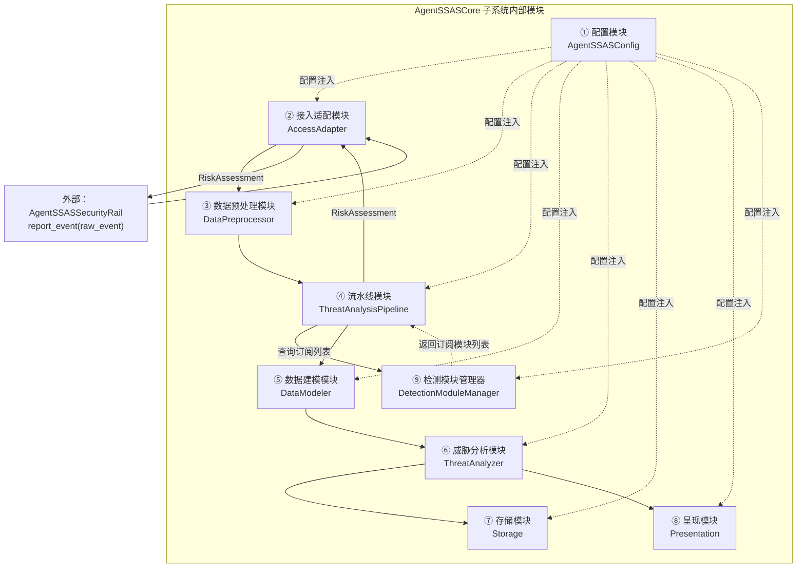
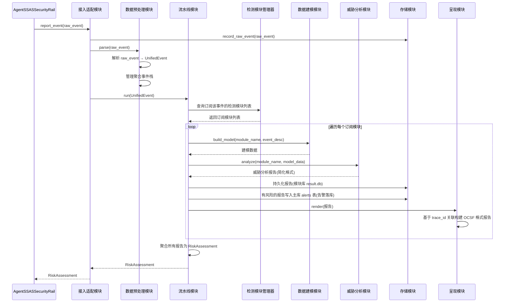
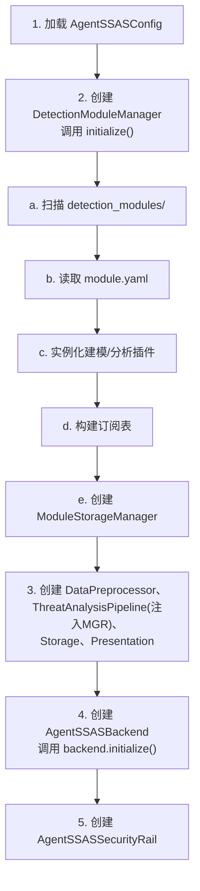
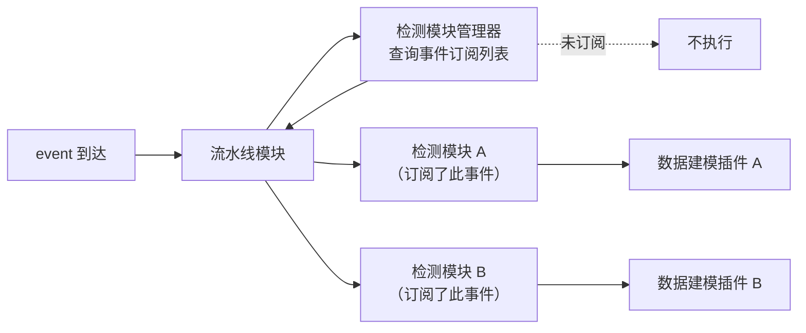
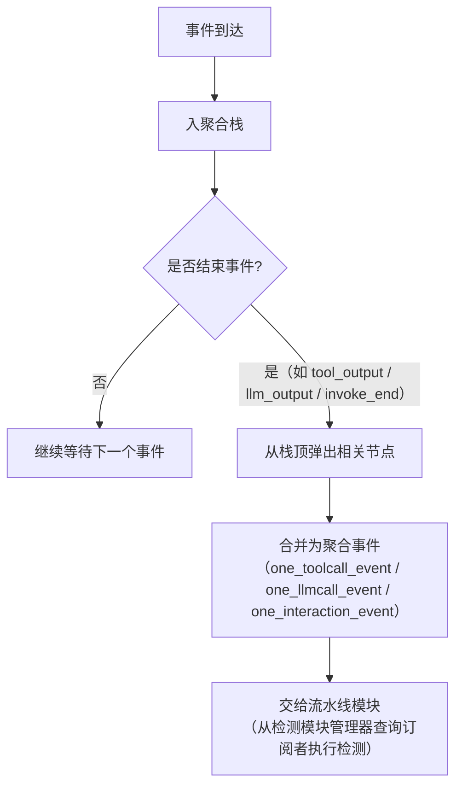
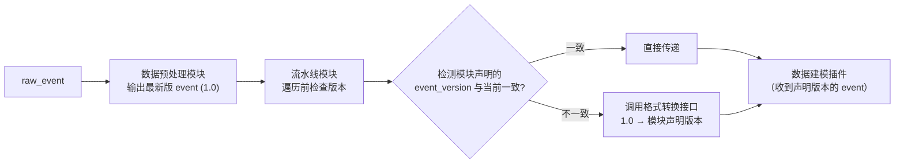
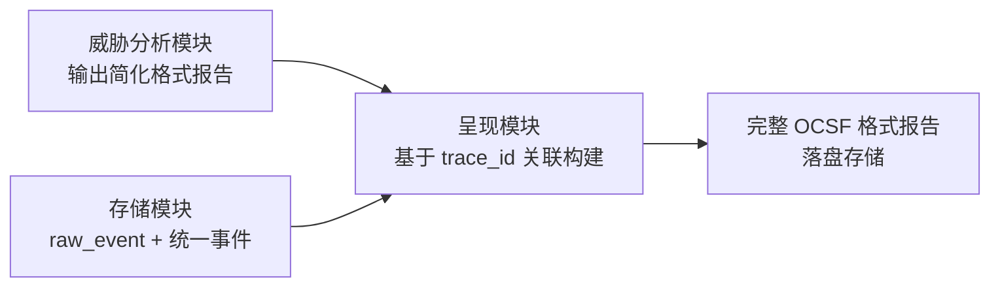

# AgentSSAS — AgentSSASCore 子系统功能设计文档

> **文档定位**：AgentSSASCore 子系统（威胁检测与呈现）的功能设计文档。
>
> **范围约定**：
> - 本文不重复 agent-core 的 Rail 机制背景（见文档 02 第二章）
> - 本文不重复跨仓接口的完整定义（见文档 01 第四章），但会说明 AgentSSASCore 侧如何实现该接口
> - 本文聚焦 `AgentSecurity/AgentSSAS/` 子目录内的实现设计

---

## 一、子系统概述

### 1.1 子系统定位

AgentSSAS 由两个子系统组成：**AgentSSAS = AgentSSASClient + AgentSSASCore**。其中 AgentSSASClient 是 agent-core 侧的事件采集与安全决策执行层（见文档 02），AgentSSASCore 子系统是威胁检测与呈现能力层。AgentSSASCore 子系统是一个通用子系统，位于 `AgentSecurity/AgentSSAS/` 子目录中，以独立 Python 包 `agent-ssas`（导入名 `agent_ssas.core.*`）的形式发布——它也可以对接 jiuwen 之外的智能体系统，只要上报方按 `AgentSSASBackendProtocol` 接口和三层结构事件格式上报即可。它接收 AgentSSASClient 上报的事件消息，执行数据预处理和威胁检测，输出安全决策，并呈现安全态势。

| 属性 | 值 |
|------|-----|
| 所在仓 | `AgentSecurity/AgentSSAS/`（`agent-ssas` 包实现） |
| PyPI 包名 | `agent-ssas` |
| 导入名 | `agent_ssas.core.*` |
| 依赖模型 | jiuwenswarm 直接依赖 `agent-ssas`（在 `[project.dependencies]` 中声明，默认安装、可配置关闭） |
| 职责 | 接收事件 → 预处理 → 建模 → 威胁分析 → 存储 → 呈现 → 返回风险评估 |
| 接口协议 | 实现 `AgentSSASBackendProtocol`（见文档 01 第四章） |
| 设计原则 | fail-open：自身运行故障时返回无风险 `RiskAssessment`，不阻断业务 |

### 1.2 职责

AgentSSASCore 子系统的核心职责：

1. **接收事件**：通过单一接口 `report_event(raw_event)` 接收 AgentSSASSecurityRail 上报的事件。事件消息为三层结构（common / payload / metadata），`common.source` 字段标识上报者身份，`common.event_type` 字段区分事件类型，`common.event_class` 字段区分事件大类（`lifecycle` 生命周期事件 / `security` 安全检测事件）。
2. **数据预处理**：将原始事件消息（raw_event）转换为引擎内部统一的 `UnifiedEvent`（event）数据结构，并管理聚合事件栈。
3. **威胁检测**：流水线模块从检测模块管理器查询订阅列表，遍历执行每个订阅模块的流水线（建模→分析→存储→呈现），由"数据建模 + 威胁分析"插件对执行检测，产出威胁分析报告。
4. **输出风险评估**：将威胁分析报告聚合为 `RiskAssessment`，返回给 AgentSSASSecurityRail。`RiskAssessment` → `SecurityDecision`（Allow / Alert / Reject）的映射在 AgentSSASSecurityRail 侧实现（见文档 02）。
5. **呈现态势**：通过日志、告警等多种形式呈现安全态势。
6. **fail-open**：AgentSSASCore 子系统自身运行故障时返回无风险 `RiskAssessment`（`risk_level=Safe`），不阻断业务。

### 1.3 与 AgentSSASSecurityRail 的接口关系

AgentSSAS 通过实现 `AgentSSASBackendProtocol` 协议与 AgentSSASSecurityRail 通信。该协议的完整定义见《AgentSSAS_01_整体架构设计文档》第四章。

两种运行模式下的实现：

- **进程内模式**：`AgentSSASBackend`（`agent_ssas/core/framework/access_adapter/agent_backend.py`）直接实现协议，内部持有威胁检测引擎，零网络延迟。
- **HTTP 服务模式**：`AgentSSASRemoteBackend`（`agent_ssas/core/framework/access_adapter/agent_remote_backend.py`）在 jiuwenswarm 进程内实现协议，通过 `httpx` 将 `report_event` 转发为 HTTP POST 调用；服务端 FastAPI 进程内的 `AgentSSASBackend` 再执行实际分析。

两种模式通过工厂函数 `create_backend(config)` 按 `AgentSSASConfig.mode` 选择。

### 1.4 依赖模型

三个仓的依赖链：

```
jiuwenswarm → openjiuwen[claude,codex] (agent-core)
jiuwenswarm → agent-ssas (AgentSecurity/AgentSSAS)
```

**jiuwenswarm 直接依赖 agent-ssas**（在 jiuwenswarm 的 `[project.dependencies]` 中声明，非 optional-dependencies）。因此：

- 用户安装 `jiuwenswarm` 时，`agent-ssas` 默认安装（因为是 jiuwenswarm 的直接依赖）
- 用户可通过 `config.yaml` 中 `ssas.enabled: false` 关闭 SSAS 功能
- jiuwenswarm 代码中通过 try/except 导入 agent_ssas.core，极端情况下 jiuwenswarm 仍能正常运行

**agent-ssas 包本身不需要在 pyproject.toml 中声明依赖 openjiuwen（agent-core）**。agent-ssas 作为一个通用子系统，其核心实现不绑定特定智能体框架。只有 `agent_ssas/backend_client/openjiuwen/` 这个特定插桩（对接 openjiuwen 智能体时的接入适配实现）才需要 openjiuwen 可用——该插桩通过 openjiuwen 的 `SecurityAllow`/`SecurityReject`/`SecurityAlert` 等类型与 AgentSSASSecurityRail 交互。`access_adapter/` 下的 `AgentSSASBackend` 不导入 openjiuwen 类型，`report_event` 返回 AgentSSAS 自定义的 `RiskAssessment` 而非 openjiuwen 的 `SecurityDecision`。如果用户对接其他智能体系统（不使用 openjiuwen），就不需要 openjiuwen，agent-ssas 的核心流水线（预处理→建模→分析→存储→呈现）仍可独立运行。

> **导入隔离设计**：agent-ssas 包的 `__init__.py` 和核心模块不直接导入 `agent_ssas/backend_client/openjiuwen/` 的代码。`agent_ssas/backend_client/openjiuwen/` 的代码只在被外部（如 jiuwenswarm）通过 try/except 显式导入时加载。如果 openjiuwen 未安装，`agent_ssas/backend_client/openjiuwen/` 的导入会失败（ImportError），但 agent-ssas 核心能力不受影响。这是有意设计的：agent-ssas 是通用子系统，`backend_client/` 下可以有多个智能体的插桩，只有对应的智能体运行时安装时才激活。

---

## 二、内部模块架构与插件化规格

AgentSSASCore 子系统内部由九个模块组成，各模块职责独立、协同运行。所有模块均支持插件化扩展。

### 2.1 模块总览



| 模块 | 核心类 | 职责 |
|------|--------|------|
| ① 配置模块 | `AgentSSASConfig` | 从 `config.yaml` 的 `ssas` 段加载配置，环境变量覆盖，注入到各模块 |
| ② 接入适配模块 | `AccessAdapter` | 实现 `AgentSSASBackendProtocol`，接收事件并返回风险评估 |
| ③ 数据预处理模块 | `DataPreprocessor` | 解析 raw_event → UnifiedEvent，管理聚合事件栈 |
| ④ 流水线模块 | `ThreatAnalysisPipeline` | 从 DetectionModuleManager 查询订阅列表，遍历执行每条流水线（建模→分析→存储→呈现），聚合报告为 RiskAssessment |
| ⑤ 数据建模模块 | `DataModeler` | 输入事件描述 json（基础事件或聚合事件），输出特定格式的建模数据 |
| ⑥ 威胁分析模块 | `ThreatAnalyzer` | 输入建模数据，输出威胁分析报告 |
| ⑦ 存储模块 | `Storage` | 持久化 raw_event（原始事件）、统一事件（预处理后事件，含基础事件和聚合事件）、告警记录、建模数据、分析结果、呈现输出 |
| ⑧ 呈现模块 | `Presentation` | 输入威胁分析报告（简化格式），基于 trace_id 关联构建 OCSF 格式报告并输出 |
| ⑨ 检测模块管理器 | `DetectionModuleManager` | 管理检测模块生命周期：扫描、加载、注册、订阅管理、存储管理 |

### 2.2 模块间运行流程



每次事件到达时的处理流程：

1. **AgentSSASSecurityRail** 通过 `report_event()` 将三层结构 raw_event（原始事件 dict）上报给接入适配模块。
2. **接入适配模块** 先将 raw_event 持久化到存储模块（`record_raw_event`）。
3. **接入适配模块** 将 raw_event 送入数据预处理模块（`parse`）。
4. **数据预处理模块** 解析 raw_event → UnifiedEvent（管理聚合事件栈）。
5. **接入适配模块** 将 UnifiedEvent 送入流水线模块（`run`）。
6. **流水线模块** 向检测模块管理器查询订阅该事件的检测模块列表。
7. **流水线模块** 遍历每个订阅模块：
   a. 数据建模模块 `build_model()` → 建模数据
   b. 威胁分析模块 `analyze()` → 威胁分析报告
   c. 存储模块 持久化报告（模块库 result.db）
   d. 有风险的报告由流水线统一写入主库 `alerts` 表（notify 后台任务与 auth 同步路径均覆盖；`alert_id` 格式为 `{event_id}_{module_name}`，告警记录含 `module_name`、`risk_score`、`confidence` 等字段）
   e. 呈现模块 `render(报告)` ← 呈现作为流水线的最后一步
8. **流水线模块** 聚合所有报告为 RiskAssessment。
9. **流水线模块** 将 RiskAssessment 返回给接入适配模块。
10. **接入适配模块** 通过 `report_event` 将 RiskAssessment 返回给 AgentSSASSecurityRail。`RiskAssessment` → `SecurityDecision` 的映射在 AgentSSASSecurityRail 侧实现（见文档 02）。

### 2.3 插件协议格式规格

AgentSSASCore 子系统的所有模块均支持插件化。每个模块定义了标准协议（Protocol），具体功能由实现该协议的插件完成。本节介绍各模块支持的插件协议格式；具体的插件实现见后续各模块章节。

| 模块 | 插件协议 | 协议定义位置 | 协议要点 |
|------|---------|------------|---------|
| 接入适配模块 | `AgentSSASBackendProtocol` | `agent_ssas/core/framework/access_adapter/protocol.py` | 跨仓接口契约。核心方法 `async def report_event(raw_event: dict) -> RiskAssessment`。完整定义见文档 01 第四章 |
| 数据预处理模块 | `EventParserProtocol` | `agent_ssas/core/framework/data_preprocessor/interfaces.py` | 核心方法 `async def parse(raw_event: dict) -> UnifiedEvent`。输入为 AgentSSASSecurityRail 上报的 raw_event（三层结构 dict），输出为引擎内部统一事件 `UnifiedEvent` |
| 数据建模模块 | `DataModelerPlugin` | `agent_ssas/core/framework/data_modeler/interfaces.py` | 核心方法 `async def build_model(event_desc: dict[str, Any]) -> Any`。输入为事件描述 json（基础事件或聚合事件），输出为特定格式的建模数据。属性 `name: str`、`model_type: str`（与威胁分析插件的 `expected_model_type` 匹配） |
| 威胁分析模块 | `ThreatAnalyzerPlugin` | `agent_ssas/core/framework/threat_analyzer/interfaces.py` | 核心方法 `async def analyze(model_data: Any) -> dict[str, Any]`。输入为建模数据，输出为威胁分析报告。属性 `name: str`、`expected_model_type: str`（与建模插件的 `model_type` 匹配） |
| 存储模块 | `StoragePlugin` | `agent_ssas/core/framework/storage/interfaces.py` | 核心方法 `async def record_event(event: dict) -> str`、`async def record_raw_event(raw_event: dict) -> str`、`async def create_alert(alert: dict) -> str`、`async def get_events(...) -> list[dict]`、`async def get_alerts(...) -> list[dict]` |
| 呈现模块 | `PresentationPlugin` | `agent_ssas/core/framework/presentation/interfaces.py` | 核心方法 `async def render(report: dict) -> None`。输入为威胁分析报告（简化格式），输出形式由插件自行决定（日志、文件、推送等） |

> **一个检测模块 = 1 个数据建模插件 + 1 个威胁分析插件**。检测模块的"建模+分析"插件对共同完成一个威胁检测方案。建模插件的 `model_type` 与分析插件的 `expected_model_type` 必须匹配，否则数据无法正确传递。

### 2.4 生态参与者

AgentSSASCore 子系统的插件化架构支持两类生态参与者：

**1. 安全生态参与者**

安全生态参与者可以将自己的威胁检测方案提交入 AgentSSAS。他们需要做的就是提供检测模块（建模插件 + 分析插件）：

- 编写一个数据建模插件，实现 `DataModelerPlugin` 协议
- 编写一个威胁分析插件，实现 `ThreatAnalyzerPlugin` 协议
- 通过 `module.yaml` 声明式配置注册检测模块
- 复用 AgentSSAS 已有的接入适配、数据预处理、存储、呈现模块

**2. 智能体生态参与者**

智能体生态参与者构建了智能体系统，需要使用 AgentSSAS 做威胁检测。他们会定义自己的接入适配、数据预处理、存储、呈现插件：

- 定义接入适配插件（如自定义的事件采集层适配器）
- 定义数据预处理插件（解析自定义的事件消息格式）
- 定义存储插件（如使用 PostgreSQL 或其他存储后端）
- 定义呈现插件（如自定义的告警推送渠道）
- 复用 AgentSSAS 已有的检测模块，或同时引入安全生态参与者提供的检测模块

---

## 三、配置模块（AgentSSASConfig）

### 3.1 职责

配置模块从 jiuwenswarm 的 `config.yaml` 的 `ssas` 段加载配置，环境变量覆盖（`SSAS_` 前缀），注入到各模块。配置定义文件位于 `agent_ssas/core/framework/config/settings.py`。

### 3.2 通用配置项

通用配置项是所有模块共有的配置，适用于所有插件：

| 字段分组 | 字段 | 类型 | 默认值 | 说明 |
|---------|------|------|--------|------|
| 全局开关 | `enabled` | bool | `True` | SSAS 总开关，设为 `False` 不加载 AgentSSASSecurityRail |
| 运行模式 | `mode` | AgentSSASMode | `INPROCESS` | `inprocess`（进程内库模式）或 `http`（独立 HTTP 服务模式） |
| HTTP 模式 | `http_endpoint` | str | `http://localhost:8443` | AgentSSASRemoteBackend 连接的服务端地址 |
| HTTP 模式 | `http_token` | str \| None | `None` | HTTP 模式客户端认证令牌 |
| HTTP 模式 | `http_host` | str | `0.0.0.0` | FastAPI 服务端监听地址 |
| HTTP 模式 | `http_port` | int | `8443` | FastAPI 服务端监听端口 |
| HTTP 模式 | `http_timeout` | float | `5.0` | HTTP 调用超时秒数，超时后 fail-open |
| 存储 | `ssas_home` | str \| None | `None` | 存储根目录，`None` 时按 `SSAS_HOME` → `JIUWENSWARM_DATA_DIR` → `JIUWENSWARM_HOME` → `~/.jiuwenswarm` 顺序解析 |
| 存储 | `storage_backend` | str | `sqlite` | 存储后端类型，0.1版本仅支持 `sqlite` |
| 存储 | `event_ttl_days` | int | `30` | 事件数据保留天数 |
| 存储 | `alert_ttl_days` | int | `90` | 告警数据保留天数 |
| Rail | `rail_priority` | int | `80` | AgentSSASSecurityRail 的执行优先级 |
| Rail | `enable_exception_hooks` | bool | `True` | 是否启用异常事件采集 |
| Rail | `risk_report_threshold` | str | `low` | 风险事件上报门限（0.1版本预留字段，未实现过滤逻辑） |
| Rail | `decision_policy` | str | `observe_only` | AgentSSASSecurityRail 决策策略模式名：`observe_only`（全部放行）| `active_protection`（按风险等级处理）。策略定义在 `decision_policies.yaml` 中 |
| auth 超时 | `auth_timeout` | float | `2.0` | auth 模式订阅者超时秒数，超时后按模块的 `auth_timeout_policy` 生成默认报告 |

### 3.3 各模块插件的专有配置项

每个插件可以定义自己的配置参数，通过 `module.yaml` 或 `config.yaml` 的 `ssas.modules.<module_name>` 段配置。

**接入适配模块插件配置**：

| 字段 | 类型 | 默认值 | 说明 |
|------|------|--------|------|
| `plugin_name` | str | `AgentSSASBackend` | 接入适配插件名，可选 `AgentSSASBackend` 或 `AgentSSASRemoteBackend` |

**数据预处理模块插件配置**：

| 字段 | 类型 | 默认值 | 说明 |
|------|------|--------|------|
| `plugin_name` | str | `AgentSSASPreprocessor` | 数据预处理插件名 |

**检测模块配置**（数据建模 + 威胁分析）：

每个检测模块通过 `module.yaml` 声明式配置注册，包含以下通用字段：

| 字段 | 类型 | 默认值 | 说明 |
|------|------|--------|------|
| `name` | str | — | 检测模块名（唯一标识） |
| `display_name` | str | — | 显示名 |
| `enabled` | bool | `True` | 模块开关 |
| `subscribed_events` | list[str] | `["*"]` | 订阅的事件类型列表，`*` 表示订阅所有事件。支持 `:auth` 后缀（如 `tool_input:auth`） |
| `auth_timeout_policy` | str | `allow` | auth 超时策略：`allow`（放行，返回无风险）/ `reject`（阻断，返回高风险）。当模块 auth 模式检测超时时按此策略生成默认报告 |

此外，每个检测模块的 `plugins` 段声明其建模插件和分析插件，各插件有自己的 `config` 参数。

**存储模块插件配置**：

| 字段 | 类型 | 默认值 | 说明 |
|------|------|--------|------|
| `plugin_name` | str | `SQLiteStore` | 存储插件名 |

**呈现模块插件配置**：

| 字段 | 类型 | 默认值 | 说明 |
|------|------|--------|------|
| `plugin_name` | str | `AgentSSASThreatLog` | 呈现插件名 |
| `output_dir` | str | `{ssas_home}/ssas/reports` | 报告输出目录 |

### 3.4 AgentSSASConfig 完整定义

**AgentSSASMode 枚举**：

| 值 | 说明 |
|------|------|
| `inprocess` | 进程内模式 |
| `http` | HTTP 服务模式 |

**AgentSSASConfig 字段定义**（`agent_ssas/core/framework/config/settings.py`）：

| 字段 | 类型 | 默认值 | 说明 |
|------|------|--------|------|
| `enabled` | bool | `True` | 全局开关 |
| `mode` | AgentSSASMode | `INPROCESS` | 运行模式 |
| `http_endpoint` | str | `"http://localhost:8443"` | HTTP 模式服务端地址 |
| `http_timeout` | float | `5.0` | HTTP 请求超时（秒） |
| `http_token` | str \| None | `None` | HTTP 认证 token |
| `http_host` | str | `"0.0.0.0"` | HTTP 服务监听地址 |
| `http_port` | int | `8443` | HTTP 服务监听端口 |
| `ssas_home` | str \| None | `None` | 存储根目录，None → 自动解析 `SSAS_HOME` / `JIUWENSWARM_DATA_DIR` / `JIUWENSWARM_HOME` / `~/.jiuwenswarm` |
| `storage_backend` | str | `"sqlite"` | 存储后端类型（预留字段，当前版本未生效，无消费代码；实际后端固定为 SQLiteStore） |
| `event_ttl_days` | int | `30` | 事件数据保留天数 |
| `alert_ttl_days` | int | `90` | 告警数据保留天数 |
| `rail_priority` | int | `80` | Rail 优先级（预留字段，当前版本未生效，无消费代码） |
| `enable_exception_hooks` | bool | `True` | 是否启用异常钩子（预留字段，当前版本未生效，无消费代码） |
| `risk_report_threshold` | str | `"low"` | 风险上报门限（0.1版本预留字段，未实现过滤逻辑，无消费代码） |
| `decision_policy` | str | `"observe_only"` | AgentSSASSecurityRail 决策策略模式名：`observe_only` / `active_protection`。策略定义在 `decision_policies.yaml` 中 |
| `auth_timeout` | float | `2.0` | auth 模式超时（秒），超时后按模块默认策略处理 |

**派生属性**：

| 属性 | 说明 |
|------|------|
| `storage_path` | 存储路径，从 `ssas_home` 推导为 `{ssas_home}/ssas`；`ssas_home` 为 None 时按环境变量优先级解析 |

### 3.5 配置生效机制

```
config.yaml[ssas] + 环境变量 → AgentSSASConfig
    → create_backend(config)  [async]
        ├→ AgentSSASBackend(config) / AgentSSASRemoteBackend(config)  [接入适配模块]
        │   └→ backend.initialize()  [初始化检测模块]
        └→ AgentSSASSecurityRail(backend, config.rail_priority)  [AgentSSASSecurityRail 侧]
```

配置同时影响 AgentSSASClient 子系统和 AgentSSASCore 子系统：
- **AgentSSASSecurityRail 侧**：读取 `rail_priority`、`enable_exception_hooks` 等 Rail 层配置。
- **AgentSSASCore 侧**：工厂函数 `create_backend(config)` 根据 `config.mode` 选择接入适配插件实现。检测模块开关、存储路径、风险门限等配置传入各模块。

### 3.6 初始化流程

**初始化入口**：`create_backend(config)` 工厂函数触发初始化。

**初始化流程**：

1. 加载 `AgentSSASConfig`（从 `config.yaml` 的 `ssas` 段 + 环境变量）
2. 创建 `DetectionModuleManager`，调用 `initialize()`：
   a. 扫描 `detection_modules/` 目录，发现所有检测模块
   b. 读取每个模块的 `module.yaml` 配置
   c. 动态导入并实例化建模插件和分析插件
   d. 根据 `subscribed_events` 构建订阅表（`event_type → 模块列表`）
   e. 为每个模块创建 `ModuleStorageManager`
3. 创建 `DataPreprocessor`、`ThreatAnalysisPipeline`（注入 `DetectionModuleManager`）、`Storage`、`Presentation`
4. 创建 `AgentSSASBackend`（注入上述模块），调用 `backend.initialize()` 触发 `DetectionModuleManager.initialize()`
5. 创建 `AgentSSASSecurityRail`（注入 backend）



> **初始化时机**：`create_backend(config)` 是异步函数，在进程内模式下会同步等待 `backend.initialize()` 完成后再返回 `AgentSSASBackend` 实例。HTTP 模式下客户端（`AgentSSASRemoteBackend`）不需要初始化检测模块（检测模块在服务端初始化）。

### 3.7 交互接口定义

各模块之间的数据流向和接口定义。术语约定：

- **raw_event**：从 AgentSSASSecurityRail 输入的三层结构原始事件消息 dict（common / payload / metadata 三层）。
- **event**：数据预处理模块输出的 `UnifiedEvent`，是引擎内部统一的、可供检测模块消费的事件结构。

| 接口调用方 | 被调用方 | 接口方法 | 输入 | 输出 |
|-----------|---------|---------|------|------|
| AgentSSASSecurityRail | 接入适配模块 | `report_event(raw_event)` | raw_event（原始事件 dict） | `RiskAssessment` |
| 接入适配模块 | 存储模块 | `record_raw_event(raw_event)` | raw_event（原始事件 dict） | `raw_event_id: str` |
| 接入适配模块 | 数据预处理模块 | `parse(raw_event)` | raw_event（原始事件 dict） | `list[UnifiedEvent]`（统一事件列表，含基础事件和聚合事件） |
| 数据预处理模块 | 存储模块 | `record_event(event)` | event（`UnifiedEvent` 序列化） | `event_id: str` |
| 接入适配模块 | 流水线模块 | `run(unified)` | UnifiedEvent | `RiskAssessment` |
| 流水线模块 | 检测模块管理器 | `get_subscribers_with_mode(event_type)` | 事件类型 | `list[tuple[str, str]]`（(module_name, mode) 列表） |
| 流水线模块 | 检测模块管理器 | `has_subscribers(event_type)` | 事件类型 | `bool`（基于引用计数判断是否有订阅者） |
| 流水线模块 | 检测模块管理器 | `get_module(module_name)` | 检测模块名 | `DetectionModule`（检测模块实例） |
| 流水线模块 | 检测模块管理器 | `get_storage(module_name)` | 检测模块名 | `ModuleStorageManager`（该模块的存储管理器） |
| 接入适配模块 | 检测模块管理器 | `initialize()` | 无 | `None`（初始化时扫描、加载、注册所有检测模块） |
| 流水线模块 | 数据建模模块 | `build_model(module_name, event_desc_json)` | 检测模块名 + 事件描述 json（来自 event 或聚合事件） | 建模数据（特定格式） |
| 数据建模模块 | 威胁分析模块 | `analyze(module_name, model_data)` | 检测模块名 + 建模数据 | 威胁分析报告（简化格式） |
| 流水线模块 | 存储模块 | `record_event(report)` | 威胁分析报告（持久化） | `event_id: str` |
| 流水线模块 | 存储模块（主库） | `create_alert(alert)` | 告警 dict（有风险的报告，notify 后台任务与 auth 同步路径均覆盖；`alert_id` 格式 `{event_id}_{module_name}`，含 `module_name`/`risk_score`/`confidence` 字段） | `alert_id: str` |
| 流水线模块 | 呈现模块 | `render(report)` | 威胁分析报告（简化格式） | `None`（呈现作为流水线内的最后一步） |
| 呈现模块 | 存储模块 | `record_output(output)` | 呈现输出（OCSF 格式报告） | `output_id: str` |
| 流水线模块 | （内部聚合） | `_aggregate_reports(reports)` | 威胁分析报告列表 | `RiskAssessment` |

---

## 四、接入适配模块（AccessAdapter）

### 4.1 职责

接入适配模块实现 `AgentSSASBackendProtocol` 协议，是 AgentSSAS 对外的入口。它接收 AgentSSASSecurityRail 上报的事件，返回 `RiskAssessment`。0.1版本支持进程内模式（`AgentSSASBackend`）和远程 HTTP 模式（`AgentSSASRemoteBackend`）。

### 4.2 AgentSSASBackendProtocol 接口

`AgentSSASBackendProtocol`（`agent_ssas/core/framework/access_adapter/protocol.py`）是跨仓接口契约，完整定义见《AgentSSAS_01_整体架构设计文档》第四章。

### 4.3 AgentSSASBackend（进程内模式）

`AgentSSASBackend`（`agent_ssas/core/framework/access_adapter/agent_backend.py`）直接实现 `AgentSSASBackendProtocol`，内部持有数据预处理模块、流水线模块、存储模块、检测模块管理器，零网络延迟。数据建模、威胁分析、呈现等模块由 `ThreatAnalysisPipeline` 统一调度。

**接口定义**（`agent_ssas/core/framework/access_adapter/agent_backend.py`）：

```python
class AgentSSASBackend:
    """进程内模式接入适配插件，直接持有引擎各模块实例，零网络延迟。"""

    def __init__(self, config: AgentSSASConfig): ...
    # 内部持有: _storage(SQLiteStore), _preprocessor(DataPreprocessor),
    #           _module_manager(DetectionModuleManager), _pipeline(ThreatAnalysisPipeline)

    async def initialize(self) -> None:
        """初始化，加载所有检测模块。"""

    async def report_event(self, raw_event: dict) -> RiskAssessment:
        """上报事件，返回 RiskAssessment。单一接口处理所有事件类型。"""
```

**`report_event` 流程伪代码**：

```
report_event(raw_event):
    await _ensure_initialized()                              # 初始化未完成时自动等待（防 fire-and-forget 竞态）
    persist raw_event → _storage.record_raw_event()          # 持久化原始事件
    try:
        events = _preprocessor.parse(raw_event)               # 解析 → UnifiedEvent 列表（含聚合事件）
        assessments = []
        for unified in events:
            persist unified → _storage.record_event()        # 统一事件持久化到主库 events 表
            assessment = _pipeline.run(unified)              # 流水线执行 → RiskAssessment（有风险的报告由流水线写入主库 alerts 表）
            assessments.append(assessment)
        return merge_assessments(assessments)                 # 取最高风险等级，合并 threats/actions/evidence
    except Exception:
        return RiskAssessment(risk_level=SAFE)                # fail-open：故障时返回无风险
```

**实现要点**：

1. `report_event` 是单一入口，处理所有 `event_type` 的事件，参数名为 `raw_event`。
2. 事件先持久化到 `SQLiteStore`，再送入数据预处理模块解析。
3. `DataPreprocessor.parse()` 负责解析 raw_event → `list[UnifiedEvent]`（含基础事件和聚合事件）。订阅管理由 `DetectionModuleManager` 负责，流水线模块通过 `ThreatAnalysisPipeline.run()` 从 `DetectionModuleManager` 查询订阅列表（含 notify/auth 模式），对 auth 模式的订阅模块同步等待结果，对 notify 模式的订阅模块异步执行 → 收集 auth 模式的报告 → 聚合为 `RiskAssessment`（聚合逻辑见 7.10 节）。接入适配模块遍历 `parse` 返回的事件列表逐个送入流水线，最后合并所有事件的 `RiskAssessment`（取最高风险等级）。
4. `initialize()` 在创建后调用，触发 `DetectionModuleManager.initialize()` 扫描、加载、注册所有检测模块（见初始化流程说明）。`initialize()` 幂等（重复调用安全，并发或重复调用只执行一次实际加载，其余调用等待同一初始化完成）；`report_event` 入口在初始化未完成时自动等待——支持宿主以 fire-and-forget 方式触发初始化（如 jiuwenswarm patch 的同步集成路径），在途初始化任务未完成前到达的事件会等待其完成再处理，避免订阅表为空导致漏检测。
5. `except Exception` 兜底返回无风险 `RiskAssessment`（`risk_level=Safe`），实现 fail-open。
6. `RiskAssessment` → `SecurityDecision` 的映射逻辑在 AgentSSASSecurityRail 侧实现（见文档 02），agent-ssas 不依赖 openjiuwen 类型。

### 4.4 AgentSSASRemoteBackend（HTTP 模式）

`AgentSSASRemoteBackend`（`agent_ssas/core/framework/access_adapter/agent_remote_backend.py`）在 jiuwenswarm 进程内实现 `AgentSSASBackendProtocol`，通过 `httpx.AsyncClient` 将 `report_event` 转发为 HTTP POST 调用到服务端。网络异常或超时时 fail-open 返回无风险 `RiskAssessment`（`risk_level=Safe`）。0.1版本已实现。

### 4.5 工厂函数

**函数签名**：

```python
async def create_backend(config: AgentSSASConfig) -> AgentSSASBackend:
    """创建 SSAS 后端，根据配置模式返回适配后的实例（实现 AgentSSASBackendProtocol）。"""
```

**模式分支**：

| `config.mode` | 返回实例 | 初始化行为 |
|---------------|---------|-----------|
| `INPROCESS` | `AgentSSASBackend(config)` | 创建后调用 `backend.initialize()` 加载检测模块 |
| `HTTP` | `AgentSSASRemoteBackend(config)` | 无需 initialize（转发到服务端进程） |
| 其他 | — | 抛出 `ValueError` |

### 4.6 RiskAssessment 与 SecurityDecision 的映射关系

`RiskAssessment` 是 AgentSSAS 对外（通过 `report_event`）返回的统一风险评估结果。`RiskAssessment` → `SecurityDecision`（Allow / Alert / Reject）的映射逻辑在 AgentSSASSecurityRail 侧实现（见文档 02），agent-ssas 包本身不依赖 openjiuwen 类型（`SecurityAllow`/`SecurityReject`/`SecurityAlert` 等），因此本文档不再展开映射表。

> `RiskAssessment.risk_level` 字段（`RiskLevel` 枚举，5 个值：safe/low/medium/high/critical）驱动 AgentSSASSecurityRail 侧的决策映射。映射规则与 `SecurityAlert` 级别等细节见文档 02。

---

## 五、数据预处理模块（DataPreprocessor）

### 5.1 职责

数据预处理模块将 AgentSSASSecurityRail 上报的 raw_event（原始事件 dict，三层结构：common / payload / metadata）转换为引擎内部统一的 `UnifiedEvent`（event）数据结构，并管理聚合事件栈。订阅列表管理已移交给检测模块管理器（DetectionModuleManager），数据预处理模块不再负责订阅查询和分发。聚合为 `RiskAssessment` 的职责已从数据预处理模块中解耦，移交给流水线模块（ThreatAnalysisPipeline，见第 5bis 章）。

### 5.2 按 source 选择格式解析器

数据预处理模块读取 raw_event 的 `common.source` 字段，选择对应的格式解析器：

| `common.source` 值 | 格式解析器 | 说明 |
|--------------------|------------|------|
| `"AgentSSASSecurityRail"` | `AgentSSASPreprocessor` | 解析 AgentSSASSecurityRail 上报的三层结构事件消息 |
| 未来扩展 | 对应的 Parser | 新增上报源时只需注册新的 Parser |

**接口定义**（`agent_ssas/core/framework/data_preprocessor/preprocessor.py`）：

```python
class DataPreprocessor:
    """数据预处理模块。

    按 common.source 选择格式解析器，将 raw_event 转换为 UnifiedEvent。
    管理聚合事件栈，当结束事件到达时触发聚合，返回事件列表。
    """

    _parsers: dict[str, Any] = {}  # source → parser 的注册表（类属性）

    @classmethod
    def register_parser(cls, source: str, parser: Any) -> None:
        """注册格式解析器。"""

    def __init__(self, config: AgentSSASConfig): ...
    # 内部持有: _config, _default_parser(AgentSSASPreprocessor), _aggregator(EventAggregator)

    async def parse(self, raw_event: dict) -> list[UnifiedEvent]:
        """解析 raw_event → UnifiedEvent 列表（基础事件 + 聚合事件）。"""
```

**`parse` 流程伪代码**：

```
parse(raw_event):
    source = raw_event["common"]["source"]
    parser = _parsers.get(source, _default_parser)   # 按选择解析器
    parsed_events = parser.parse(raw_event)          # 解析 → UnifiedEvent 列表（含派生事件）
    result = []
    for i, unified in enumerate(parsed_events):
        if i < len(parsed_events) - 1:
            result.append(unified)                   # 派生事件直接加入（不入聚合栈）
        else:
            result.extend(_aggregator.handle(unified))  # 基础事件：入聚合栈并处理聚合
    return result                                    # [派生事件(如有)] + [基础事件] + [聚合事件(如有)]
```

> **订阅管理说明**：DataPreprocessor 不持有订阅表。订阅列表的构建与查询由 `DetectionModuleManager` 负责（见 DetectionModuleManager 章节）。数据预处理模块仅负责解析 raw_event → UnifiedEvent 和管理聚合事件栈。

### 5.3 事件消息三层结构

AgentSSASSecurityRail 上报的原始事件消息（raw_event）为三层结构：

**common 层**（公共字段，所有 raw_event 共有）：

| 字段 | 类型 | 说明 |
|------|------|------|
| `source` | str | 上报者身份，如 `"AgentSSASSecurityRail"` |
| `event_type` | str | 事件类型，如 `invoke_start`、`llm_input`、`tool_output` 等 |
| `event_class` | str | 事件大类：`lifecycle`（生命周期事件）或 `security`（安全检测事件） |
| `timestamp` | float | 事件发生时间戳 |
| `interaction_seq` | int | 组内自增序号（int 类型，从 0 开始递增）；组由 session_id + agent_id + conversation_id 唯一确定 |
| `session_id` | str | 会话 ID |
| `conversation_id` | str | 对话 ID |
| `agent_id` | str | 智能体 ID |
| `trace_id` | str | 追踪 ID |
| `context_id` | str | 上下文 ID |
| `llm_call_seq` | int | 如果当前事件是 llm_call 事件，`llm_call_seq` 就是这次大模型调用的序号；如果当前事件是 tool_call 事件，`llm_call_seq` 就是这个工具调用所属的大模型调用的序号 |
| `tool_call_seq` | int | 工具调用自增序号（int 类型，从 0 开始递增）；非工具事件为 -1 |
| `subsession_id` | str | 子会话 ID（子 Agent 场景的父会话 ID） |
| `tool_call_id` | str | 工具调用唯一标识（LLM provider 返回的字符串）；非工具事件为空字符串 |

> `interaction_seq` 与 `llm_call_seq` 均为组内/会话内自增序号（int 类型，从 0 开始递增），**不是 UUID**。

**payload 层**（事件内容，因事件类型而异）：包含 `content`、`tool_name`、`exception` 等字段，以及安全检测事件的 `risk_source`、`risk_type`、`risk_level`、`decision`、`evidence` 等字段。

**metadata 层**（元数据）：附加信息。

### 5.4 UnifiedEvent 数据模型

参考 `system_design.md` 章节 5.2 的统一数据格式设计（Trace → Session → Interaction → EventNode → DataNode 的层次结构），AgentSSASCore 子系统设计了适配实时事件流场景的 `UnifiedEvent`。

与离线分析不同，AgentSSASCore 子系统处理的是实时事件流，因此 `UnifiedEvent` 采用"增量构建"策略：每个事件到达时创建对应的 `EventNode`，并通过 `interaction_seq`、`session_id`、`trace_id` 关联到已有的 `Interaction`、`Session`、`Trace` 结构。随着事件不断到达，这些结构逐步构建完整。

`UnifiedEvent` 的完整格式由三部分组成：`event_node`（当前事件对应的 EventNode）、`trace`（当前事件所属的 Trace 增量构建中）、`event_id`（事件唯一标识）。其中 `EventNode` 承载当前事件的全部字段，是检测模块消费的核心结构。`UnifiedEvent` 序列化为事件描述 json 后，其字段格式与 5.8.3 节的聚合事件格式对齐（两者共用 `aux_ids` 子结构、共用 action_name/input_content/output_content 等内容字段），便于检测模块以统一视角处理基础事件和聚合事件。

```python
# agent_ssas/core/framework/core_types/event.py
from dataclasses import dataclass, field
from typing import Any

# 当前 event 格式版本号（见 5.11 节 event 格式版本号管理）
CURRENT_EVENT_VERSION = "1.0"

@dataclass
class DataNode:
    """数据节点：记录事件中产生的数据。"""
    data_id: str                    # 数据唯一标识
    content: str                    # 数据内容
    source_node_id: str            # 产生此数据的节点 node_id
    tags: list[str] = field(default_factory=list)  # 数据标签列表

@dataclass
class EventNode:
    """事件节点：统一节点结构，对应一个基础事件（由单个 raw_event 转换而来）。

    所有 seq 字段（interaction_seq、llm_call_seq、tool_call_seq）缺省值为 -1，
    表示当前事件不具备此序号字段。首个有效值为 0（int 类型自增序号）。
    """
    node_id: str                    # 节点唯一标识
    node_type: str                  # 节点类型：session / interaction / llm_call / tool_call
    parent_node_id: str = ""        # 父节点 node_id
    next_node_id: str = ""          # 同级下一个节点 node_id（控制流顺序）
    session_id: str = ""            # 所属会话 ID
    interaction_seq: int = -1       # 所属交互 ID（int 类型自增序号；session 为 -1）
    agent_id: str = ""              # 智能体 ID（用于报告呈现时的资源关联）

    # 通用内容字段（所有类型节点共用）
    input_content: str = ""         # 节点的输入内容
    output_content: str = ""        # 节点的输出内容
    action_name: str = ""           # 节点执行的动作名称
    # - tool_call 类型：action_name = tool_name，input_content = args，output_content = tool_output
    # - interaction 类型（invoke 节点）：action_name = "invoke_start"（开始端）或 "invoke_end"（结束端），input_content = query，output_content = result
    # - interaction 类型（自动生成的 user_input 节点，见 5.10 节）：action_name = "user_query"，event_type = "user_input"，input_content/output_content = ""
    # - session 类型：action_name = "session_start"（开始端）或 "session_end"（结束端），input_content = ""，output_content = ""
    # - llm_call 类型：action_name = "llm_call"，input_content = prompt，output_content = response

    # 数据关联字段
    input_data_ids: list[str] = field(default_factory=list)   # 输入数据 ID 列表
    output_data_ids: list[str] = field(default_factory=list)  # 输出数据 ID 列表

    # raw_event 溯源字段
    event_type: str = ""            # 对应 raw_event 的 common.event_type 字段
    event_class: str = ""           # 事件大类：lifecycle / security
    source: str = ""                # 对应 raw_event 的 common.source 字段
    timestamp: float = 0.0          # 对应 raw_event 的 common.timestamp 字段

    # LLM/工具调用序号字段（int 类型自增序号）
    # 缺省值为 -1，表示当前事件不具备此序号字段。首个有效值为 0
    llm_call_seq: int = -1          # llm_call 事件时为本次大模型调用的序号；tool_call 事件时为所属大模型调用的序号
    tool_call_seq: int = -1         # 工具调用自增序号；非工具事件为 -1
    tool_call_id: str = ""          # 上报端工具调用 ID（LLM provider 返回）；保留供溯源，不作为关联键（跨输入/输出事件的显式关联用 tool_call_seq，node_id 生成也仅用 seq，见 5.7 节）

    # 安全检测事件字段（仅 event_class="security" 的事件有值）
    is_risk_event: bool = False     # 是否为安全检测事件（等价于 event_class == "security"）
    risk_source: str = ""           # 安全检测事件的风险来源 Rail 名
    risk_type: str = ""             # 风险类型
    risk_level: str = ""            # 风险等级
    risk_assessment: dict | None = None  # 风险事件携带的检测结果（decision、evidence 等）

@dataclass
class Interaction:
    """交互结构：对应一个 interaction 的完整生命周期。"""
    interaction_seq: int            # 交互唯一标识（int 类型组内自增序号）
    session_id: str                # 所属会话 ID
    interaction_node_id: str       # interaction 节点的 node_id
    tool_call_node_ids: list[str] = field(default_factory=list)  # tool_call 节点 node_id 列表（有序）
    llm_call_node_ids: list[str] = field(default_factory=list)   # llm_call 节点 node_id 列表（有序）

@dataclass
class Session:
    """会话结构：对应一个 session 的完整生命周期。"""
    session_id: str                 # 会话唯一标识
    session_node_id: str           # session 节点的 node_id
    interactions: list[Interaction] = field(default_factory=list)  # 交互列表

@dataclass
class Trace:
    """追踪结构：顶层结构，包含全局索引。"""
    trace_id: str                   # 追踪唯一标识
    source_info: dict[str, str] = field(default_factory=dict)  # 来源信息
    sessions: list[Session] = field(default_factory=list)       # 会话列表
    all_nodes: dict[str, EventNode] = field(default_factory=dict)   # node_id → EventNode 全局索引
    all_data: dict[str, DataNode] = field(default_factory=dict)     # data_id → DataNode 全局索引

@dataclass
class UnifiedEvent:
    """引擎统一事件格式，所有检测模块的共同输入。

    适配实时事件流场景：每个事件到达时创建对应的 EventNode，
    并通过 interaction_seq、session_id、trace_id 关联到已有结构。
    event_version 字段标识当前 event 格式版本号，用于版本兼容管理（见 5.11 节）。
    """
    event_node: EventNode           # 当前事件对应的 EventNode
    trace: Trace                    # 当前事件所属的 Trace（增量构建中）
    event_id: str                   # 事件唯一标识（UUID）
    event_version: str = CURRENT_EVENT_VERSION  # event 格式版本号，如 "1.0"

    def to_event_desc(self) -> dict:
        """转换为事件描述 json，供数据建模插件消费。

        输出格式与 5.8.3 节聚合事件格式对齐：都包含 aux_ids 子结构、
        action_name/input_content/output_content 内容字段，便于检测模块统一处理。
        """
        return {
            "event_version": self.event_version,
            "event_node": self._node_to_dict(self.event_node),
            "aux_ids": self._build_aux_ids(self.event_node, self.trace),
            "trace": self._trace_to_dict(self.trace),
            "event_id": self.event_id,
        }

    @staticmethod
    def _build_aux_ids(node: EventNode, trace: Trace) -> dict:
        """构建辅助 ID 子结构，集中存放用于呈现与溯源的关联 ID。

        这些 ID 字段（interaction_seq、session_id、agent_id、trace_id 等）
        代表了事件之间的关联关系，在分析过程中也有参考价值；但在聚合事件中，
        关联关系已通过聚合结构体现，因此这些 ID 字段在聚合场景下主要用于呈现和溯源。
        """
        return {
            "interaction_seq": node.interaction_seq,
            "session_id": node.session_id,
            "agent_id": node.agent_id,
            "trace_id": trace.trace_id,
            "llm_call_seq": node.llm_call_seq,
            "tool_call_seq": node.tool_call_seq,
            "tool_call_id": node.tool_call_id,
        }

    @staticmethod
    def _node_to_dict(node: EventNode) -> dict:
        return {
            "node_id": node.node_id,
            "node_type": node.node_type,
            "parent_node_id": node.parent_node_id,
            "next_node_id": node.next_node_id,
            "session_id": node.session_id,
            "interaction_seq": node.interaction_seq,
            "agent_id": node.agent_id,
            "input_content": node.input_content,
            "output_content": node.output_content,
            "action_name": node.action_name,
            "input_data_ids": node.input_data_ids,
            "output_data_ids": node.output_data_ids,
            "event_type": node.event_type,
            "event_class": node.event_class,
            "source": node.source,
            "timestamp": node.timestamp,
            "llm_call_seq": node.llm_call_seq,
            "tool_call_seq": node.tool_call_seq,
            "tool_call_id": node.tool_call_id,
            "is_risk_event": node.is_risk_event,
            "risk_source": node.risk_source,
            "risk_type": node.risk_type,
            "risk_level": node.risk_level,
        }

    @staticmethod
    def _trace_to_dict(trace: Trace) -> dict:
        return {
            "trace_id": trace.trace_id,
            "source_info": trace.source_info,
        }
```

**UnifiedEvent 完整格式字段清单**：

`UnifiedEvent` 通过 `to_event_desc()` 序列化后的事件描述 json 包含以下字段：

| 层级 | 字段 | 类型 | 说明 |
|------|------|------|------|
| 顶层 | `event_version` | str | event 格式版本号，如 `"1.0"`（见 5.11 节） |
| 顶层 | `event_node` | dict | 当前事件对应的 EventNode 序列化 |
| 顶层 | `aux_ids` | dict | 辅助 ID 子结构，集中存放关联 ID（interaction_seq、session_id、agent_id、trace_id、llm_call_seq、tool_call_seq） |
| 顶层 | `trace` | dict | 当前事件所属 Trace 的来源信息 |
| 顶层 | `event_id` | str | 事件唯一标识（UUID） |

`event_node` 子结构的字段见上文 `_node_to_dict` 方法输出。

### 5.4.1 node_type 枚举定义

`node_type` 标识控制流图中的节点角色，共 4 种取值：

| node_type | 来源 | 说明 |
|---|---|---|
| `session` | session_start / session_end 共享 / 自动生成 | 会话节点（session 开始/结束事件共享同一节点） |
| `interaction` | invoke_start / invoke_end 共享 / 自动生成 | 交互节点（invoke 开始/结束事件共享同一节点） |
| `llm_call` | llm_input / llm_output 共享 | LLM 调用节点（llm 开始/结束事件共享同一节点） |
| `tool_call` | tool_input / tool_output / permission_interrupt_tool 共享 | 工具调用节点（tool 开始/结束事件共享同一节点） |

> **对称设计**：所有"开始+结束事件对"共享同一个 node_type 和同一个 node_id。后到的结束事件覆盖先到的开始事件（`trace.all_nodes` 中同一 node_id 的节点被更新）。`action_name` 保持各自动作名不变（如 invoke_start 的 action_name 为 `"invoke_start"`，invoke_end 的为 `"invoke_end"`）。

> **聚合事件 node_type**：聚合事件转 UnifiedEvent 后，node_type 复用基础事件 node_type——`one_toolcall_event` → `tool_call`、`one_llmcall_event` → `llm_call`、`one_interaction_event` → `interaction`。

### 5.5 node_id 生成规则

采用分层命名规则，确保全局唯一且可读（与 system_design.md 对齐）：

| 节点类型 | node_id 格式 | 示例 |
|----------|-------------|------|
| session | `{session_id}_session` | `agentA1-session1_session` |
| interaction | `{session_id}_{interaction_seq}_interaction` | `agentA1-session1_0_interaction` |
| tool_call | `{session_id}_{interaction_seq}_toolcall_{seq}` | `agentA1-session1_0_toolcall_0` |
| llm_call | `{session_id}_{interaction_seq}_llmcall_{seq}` | `agentA1-session1_0_llmcall_0` |

> `interaction_seq`、`seq` 均为 int 类型自增序号（从 0 开始），在 node_id 中以十进制字符串形式拼接。

### 5.6 parent_node_id 与 next_node_id 规则

**parent_node_id（层级归属）**：

| 节点类型 | parent_node_id |
|----------|---------------|
| session | 空（顶层节点） |
| interaction | session 的 node_id |
| tool_call | interaction 的 node_id |
| llm_call | interaction 的 node_id |

**next_node_id（控制流顺序）**：

同一交互内的控制流顺序为：`interaction → llm_call_1 → tool_call_1 → tool_call_2 → ... → interaction`

跨交互的链接：`interaction_0 的 next_node_id = interaction_1 的 node_id`

跨会话的链接：`session_1 的 session 节点 next_node_id = session_2 的 session 节点 node_id`

### 5.7 字段保留与丢弃说明

数据预处理模块将 AgentSSASSecurityRail 传递过来的事件消息转换为 `UnifiedEvent` 时，有些字段暂时用不上会被丢弃。

**common 层字段保留与丢弃**：

| 字段 | 保留/丢弃 | 说明 |
|------|----------|------|
| `source` | 保留 | 存入 `EventNode.source` |
| `event_type` | 保留 | 存入 `EventNode.event_type`，用于事件订阅匹配 |
| `event_class` | 保留 | 存入 `EventNode.event_class`，区分生命周期事件（`lifecycle`）与安全检测事件（`security`） |
| `timestamp` | 保留 | 存入 `EventNode.timestamp` |
| `interaction_seq` | 保留 | 存入 `EventNode.interaction_seq`（int 类型），作为交互关联键 |
| `session_id` | 保留 | 存入 `EventNode.session_id`，作为会话关联键 |
| `conversation_id` | 丢弃 | `conversation_id` 等于 `session_id`（见文档01 第 4.2 节），通过 session_id 即可覆盖，丢弃避免冗余 |
| `agent_id` | 保留 | 存入 `EventNode.agent_id`，用于报告呈现时的资源关联 |
| `trace_id` | 保留 | 用于关联 Trace 结构 |
| `context_id` | 丢弃 | 0.1版本不使用上下文级别聚合 |
| `llm_call_seq` | 保留 | 存入 `EventNode.llm_call_seq`（int 类型），用于 LLM 调用关联 |
| `tool_call_seq` | 保留 | 存入 `EventNode.tool_call_seq`（int 类型），用于工具调用顺序关联 |
| `subsession_id` | 丢弃 | 0.1版本不使用子会话级别聚合 |
| `tool_call_id` | 保留 | 存入 `EventNode.tool_call_id`（上报端工具调用 ID，LLM provider 原样透传字符串）。保留供溯源，不作为关联键；跨输入/输出事件的显式关联用 `tool_call_seq`（node_id 生成也仅用 seq），与文档 01 第 4.5.2 节一致 |

**payload 层字段保留与丢弃**：

| 字段 | 保留/丢弃 | 说明 |
|------|----------|------|
| `content` | 保留 | 存入 `EventNode.input_content` / `output_content` |
| `tool_name` | 保留 | 存入 `EventNode.action_name`（tool_call 类型） |
| `exception` | 保留 | 存入 `EventNode.output_content`（异常事件） |
| `risk_source` | 保留 | 存入 `EventNode.risk_source` |
| `risk_type` | 保留 | 存入 `EventNode.risk_type` |
| `risk_level` | 保留 | 存入 `EventNode.risk_level` |
| `decision` | 保留 | 存入 `EventNode.risk_assessment["decision"]`（与 evidence 同入 risk_assessment，见 7.4 节） |
| `evidence` | 保留 | 存入 `EventNode.risk_assessment["evidence"]` |

**metadata 层**：整体丢弃，0.1版本不使用元数据。

> **信息裁剪原则**：AgentSSASSecurityRail 在采集阶段采集所有可获得的完整数据，不在采集侧做裁剪。裁剪工作在 AgentSSASCore 侧的数据预处理步骤中根据实际需求进行——AgentSSAS 可按检测模块的需要，从 raw_event 中选取相关字段、过滤无关内容、做脱敏处理。

### 5.8 事件订阅与聚合事件机制

检测模块管理器（DetectionModuleManager）维护一个**事件清单**，供检测模块独立订阅。发生订阅范围内的事件，流水线模块（ThreatAnalysisPipeline）从检测模块管理器查询订阅列表，遍历执行每个订阅模块的流水线（建模→分析→存储→呈现）。数据预处理模块仅负责解析 raw_event → UnifiedEvent 和管理聚合事件栈，不参与订阅查询和分发。

#### 5.8.1 事件订阅机制

检测模块管理器为事件清单中的每一类事件维护一个已订阅检测模块列表。event 到达时流水线模块向检测模块管理器查询这个列表，遍历执行每个订阅模块的流水线。



检测模块通过 `module.yaml` 中的 `subscribed_events` 字段声明订阅的事件类型：

```yaml
# 订阅所有事件
subscribed_events: ["*"]

# 订阅特定事件
subscribed_events:
  - "tool_input"
  - "tool_output"
  - "one_toolcall_event"

# 订阅聚合事件
subscribed_events:
  - "one_interaction_event"
```

**事件订阅状态管理**：

检测模块管理器为每一类事件维护一个订阅状态字段，标识当前事件类型是否有人订阅、有多少人订阅。采用引用计数管理，确保退订后状态一致：

- **订阅计数**：每个事件类型维护一个 `subscriber_count: int` 字段。检测模块订阅时 +1，退订时 -1，计数归零表示该事件类型无订阅者。
- **未订阅直接返回**：如果某个事件类型没有被订阅（订阅列表为空、订阅计数为 0），流水线模块从检测模块管理器查询得到空列表后，无需做任何遍历工作可以直接返回无风险 `RiskAssessment`，避免无效的遍历开销。
- **退订一致性**：支持检测模块运行时退订。退订时递减引用计数，并从订阅列表移除该模块；引用计数归零后，该事件类型标记为"无订阅者"，后续事件直接返回。
- **聚合事件与基础事件的订阅联动**：聚合事件类型关联多个基础事件类型。例如订阅了 `one_toolcall_event` 聚合事件，相当于其依赖的基础事件 `tool_input` 和 `tool_output` 都"有人使用"——数据预处理模块必须持续接收并缓存这些基础事件以完成聚合，不能直接返回。因此聚合事件的订阅会将其依赖的基础事件类型的订阅计数一并提升。

**聚合事件与基础事件类型的关联关系**：

3 种聚合事件类型各自关联的基础事件类型及触发条件如下表所示：

| 聚合事件类型 | 关联的基础事件类型 | 触发聚合条件 |
|------------|------------------|------------|
| `one_toolcall_event` | `tool_input`（BEFORE_TOOL_CALL）+ `tool_output`（AFTER_TOOL_CALL） | 当收到 `tool_output` 时触发聚合 |
| `one_llmcall_event` | `llm_input`（BEFORE_MODEL_CALL）+ `llm_output`（AFTER_MODEL_CALL）+ 所有可能的 `tool_input`/`tool_output`（同一 `llm_call_seq` 内的工具调用） | 当收到 `llm_output` 时触发聚合 |
| `one_interaction_event` | `invoke_start`（BEFORE_INVOKE）+ `invoke_end`（AFTER_INVOKE）+ 其间所有的 `llm_input`/`llm_output`/`tool_input`/`tool_output` | 当收到 `invoke_end` 时触发聚合 |

> 说明：聚合事件的触发条件均为收到对应的"结束事件"。在结束事件到达前，数据预处理模块需持续缓存关联的基础事件（提升其订阅计数）；结束事件到达后，从聚合栈弹出相关节点，合并为聚合事件并分发给订阅者。

**订阅模式（notify / auth）**：

检测模块订阅事件时，通过后缀语法区分订阅模式：`tool_input`（默认 notify 模式）、`tool_input:auth`（auth 模式）。两种模式影响 `report_event` 的同步/异步行为：

- **notify 模式**（默认）：异步检测。检测模块不需同步等待结果，`report_event` 不需要等待该模块的检测结果即可返回。适用于事后审计、日志记录等场景。检测仍在后台异步执行（建模→分析→存储→呈现完整流程），威胁日志正常生成，存储正常持久化，只是不影响 `report_event` 返回的 `RiskAssessment`。
- **auth 模式**：同步检测。检测模块需要同步等待结果，`report_event` 必须同步等待该模块的检测结果完成后才能返回。适用于需要在工具执行前做出阻断决策的场景（如工具输入内容的安全检查）。

`report_event` 的返回行为由订阅模式决定：

- 如果某个事件的所有订阅者都是 notify 模式，`report_event` 可以直接返回无风险 `RiskAssessment`（`risk_level=Safe`），检测在后台异步进行。
- 如果有任一订阅者是 auth 模式，`report_event` 必须同步等待所有 auth 模式的检测完成，再聚合为 `RiskAssessment` 返回。

**聚合事件订阅的展开规则**：

聚合事件订阅按其关联的基础事件展开为带模式的子订阅：

- `one_toolcall_event:auth` = `tool_input:notify` + `tool_output:auth`（聚合结果的 auth 模式应用到结束事件 `tool_output` 上，起始事件 `tool_input` 为 notify）
- `one_toolcall_event`（默认 notify）= `tool_input:notify` + `tool_output:notify`

> 聚合事件的 auth 模式语义：聚合事件以"结束事件"触发聚合，auth 模式作用在结束事件上——即 `report_event` 在结束事件到达时需要同步等待聚合检测完成。起始事件始终为 notify（仅缓存，不触发检测）。

`module.yaml` 语法示例：

```yaml
subscribed_events:
  - "tool_input"                  # 默认 notify 模式
  - "tool_output:auth"            # auth 模式
  - "one_toolcall_event:auth"     # auth 模式订阅聚合事件
```

#### 5.8.2 基础事件清单

基础事件是统一事件的一类，与聚合事件并列（两者都属于统一事件）。每个基础事件对应一个原始事件（raw_event），由数据预处理模块转换生成（统一事件的完整格式见 5.4 节）。基础事件的 `event_type` 与对应 raw_event 的 `common.event_type` 取值一致。

> 数据预处理模块还会自动生成 `session_start` / `session_end` 节点（见 5.10 节），这些不是基础事件类型，而是保证 Trace 结构完整性的辅助节点。

以下列出 0.1 版本支持的基础事件清单及其字段格式。

**0.1 版本支持的基础事件**：

| event_type | event_class | 说明 |
|---------|---------|------|
| `invoke_start` | `lifecycle` | Agent 调用开始 |
| `invoke_end` | `lifecycle` | Agent 调用结束 |
| `llm_input` | `lifecycle` | LLM 调用前 |
| `llm_output` | `lifecycle` | LLM 调用后 |
| `tool_input` | `lifecycle` | 工具调用前 |
| `tool_output` | `lifecycle` | 工具调用后 |
| `permission_interrupt_tool` | `security` | 工具权限拦截（安全检测事件） |

> 后续版本将扩展更多基础事件类型（如 `user_message`、`task_iteration_start/end`、`model_exception`、`tool_exception` 等）。新增基础事件时，只需 agent-core 侧按相同三层结构上报，AgentSSASCore 侧的格式解析和事件订阅机制无需改动即可支持。

**基础事件字段格式清单**：

基础事件即 `UnifiedEvent.to_event_desc()` 输出格式，字段结构见 5.4 节（顶层含 `event_version`、`event_node`、`aux_ids`、`trace`、`event_id`）。其中 `event_node` 承载当前事件的全部字段，是检测模块消费的核心结构。不同 `event_type` 的基础事件，其 `event_node` 的内容字段（`input_content` / `output_content` / `action_name`）取值不同，详见下表。

> 注意：raw_event 的 payload 字段命名（如 `tool_args` / `tool_result`、`messages` / `response` 等）由文档 01 定义，AgentSSASCore 子系统不改其命名；数据预处理模块在生成基础事件时，会按 5.7 节的字段保留与映射规则，将 payload 内容统一映射到 `EventNode` 的 `input_content` / `output_content` / `action_name` 字段上，便于检测模块以统一视角处理基础事件和聚合事件。

**基础事件内容字段按 event_type 的映射清单**（`event_node` 子结构中的 `input_content` / `output_content` / `action_name`）：

| event_type | `action_name` | `input_content` | `output_content` | 说明 |
|------|---------------|-----------------|------------------|------|
| `invoke_start` | `"invoke_start"` | `query` | `""` | 用户输入、父会话 ID（子 Agent）、运行类型等在 trace/aux_ids 中关联 |
| `invoke_end` | `"invoke_end"` | `""` | `result` | invoke 最终输出 |
| `llm_input` | `"llm_call"` | `messages`（LLM 消息列表） | `""` | LLM 消息列表、可用工具列表 |
| `llm_output` | `"llm_call"` | `""` | `response`（LLM 返回的响应） | LLM 返回的响应 |
| `tool_input` | `tool_name` | `tool_args` | `""` | 工具调用参数 |
| `tool_output` | `tool_name` | `""` | `tool_result` | 工具执行结果 |
| `permission_interrupt_tool` | `tool_name` | `tool_args` | `""` | 被拒绝的工具调用参数；risk_* 字段另存 |

**基础事件工具信息字段**（仅工具类基础事件：`tool_input` / `tool_output` / `permission_interrupt_tool`）：

| 字段 | 类型 | 说明 |
|------|------|------|
| `action_name` | str | 被调用的工具名称（即 `tool_name`，映射到 `action_name`） |
| `input_content` | str | 工具调用参数（即 `tool_args`，映射到 `input_content`） |
| `output_content` | str | 工具执行结果（即 `tool_result`，映射到 `output_content`） |

**基础事件安全检测结果字段**（仅安全检测基础事件：`permission_interrupt_tool` 等，`event_class="security"`）：

| 字段 | 类型 | 说明 |
|------|------|------|
| `risk_source` | str | 产生此安全检测事件的 Rail 名称 |
| `risk_type` | str | 风险类型 |
| `risk_level` | str | 风险等级：low/medium/high/critical |
| `risk_assessment` | dict \| None | 原 Rail 的决策（reject/interrupt）与关键证据信息 |

> 基础事件（`UnifiedEvent`）的 `event_node` 还包含 `node_id`、`node_type`、`parent_node_id`、`next_node_id`、`session_id`、`interaction_seq`、`agent_id`、`event_type`、`event_class`、`source`、`timestamp`、`llm_call_seq`、`tool_call_seq`、`is_risk_event` 等字段，完整字段见 5.4 节 `_node_to_dict` 方法输出。

**基础事件 JSON 示例**：

以下为基础事件（`UnifiedEvent.to_event_desc()` 输出格式）的 JSON 示例，与 5.8.3 节聚合事件风格统一，包含 `event_version`、`event_node`、`aux_ids`、`trace`、`event_id` 字段。

**1. invoke_start 事件示例**：

> invoke_start 事件的 node_type 为 `interaction`。收到 invoke_start 时还会触发 5.10 节自动 node 生成，产生一个 `session` 节点（node_id 为 `session-001_session`）。下方示例展示的是 invoke_start 事件本身对应的 interaction 节点。

```json
{
  "event_version": "1.0",
  "event_node": {
    "node_id": "session-001_0_interaction",
    "node_type": "interaction",
    "parent_node_id": "session-001_session",
    "next_node_id": "",
    "session_id": "session-001",
    "interaction_seq": 0,
    "agent_id": "deep-agent-1",
    "input_content": "请帮我列出当前目录下的文件",
    "output_content": "",
    "action_name": "invoke_start",
    "input_data_ids": [],
    "output_data_ids": [],
    "event_type": "invoke_start",
    "event_class": "lifecycle",
    "source": "AgentSSASSecurityRail",
    "timestamp": 1715000000.0,
    "llm_call_seq": -1,
    "tool_call_seq": -1,
    "is_risk_event": false,
    "risk_source": "",
    "risk_type": "",
    "risk_level": ""
  },
  "aux_ids": {
    "interaction_seq": 0,
    "session_id": "session-001",
    "agent_id": "deep-agent-1",
    "trace_id": "trace-001",
    "llm_call_seq": -1,
    "tool_call_seq": -1
  },
  "trace": {
    "trace_id": "trace-001",
    "source_info": {}
  },
  "event_id": "evt-aaaaaaaa-bbbb-cccc-dddd-eeeeeeee0001"
}
```

**2. llm_input 事件示例**：

```json
{
  "event_version": "1.0",
  "event_node": {
    "node_id": "session-001_0_llmcall_0",
    "node_type": "llm_call",
    "parent_node_id": "session-001_0_user_input",
    "next_node_id": "session-001_0_toolcall_0",
    "session_id": "session-001",
    "interaction_seq": 0,
    "agent_id": "deep-agent-1",
    "input_content": "[{\"role\": \"user\", \"content\": \"请帮我列出当前目录的文件\"}]",
    "output_content": "",
    "action_name": "llm_call",
    "input_data_ids": [],
    "output_data_ids": [],
    "event_type": "llm_input",
    "event_class": "lifecycle",
    "source": "AgentSSASSecurityRail",
    "timestamp": 1715000000.5,
    "llm_call_seq": 0,
    "tool_call_seq": -1,
    "is_risk_event": false,
    "risk_source": "",
    "risk_type": "",
    "risk_level": ""
  },
  "aux_ids": {
    "interaction_seq": 0,
    "session_id": "session-001",
    "agent_id": "deep-agent-1",
    "trace_id": "trace-001",
    "llm_call_seq": 0,
    "tool_call_seq": -1
  },
  "trace": {
    "trace_id": "trace-001",
    "source_info": {}
  },
  "event_id": "evt-aaaaaaaa-bbbb-cccc-dddd-eeeeeeee0002"
}
```

**3. tool_input 事件示例**：

```json
{
  "event_version": "1.0",
  "event_node": {
    "node_id": "session-001_0_toolcall_0",
    "node_type": "tool_call",
    "parent_node_id": "session-001_0_user_input",
    "next_node_id": "",
    "session_id": "session-001",
    "interaction_seq": 0,
    "agent_id": "deep-agent-1",
    "input_content": "{\"command\": \"ls\"}",
    "output_content": "",
    "action_name": "bash",
    "input_data_ids": [],
    "output_data_ids": [],
    "event_type": "tool_input",
    "event_class": "lifecycle",
    "source": "AgentSSASSecurityRail",
    "timestamp": 1715000001.0,
    "llm_call_seq": 0,
    "tool_call_seq": 0,
    "is_risk_event": false,
    "risk_source": "",
    "risk_type": "",
    "risk_level": ""
  },
  "aux_ids": {
    "interaction_seq": 0,
    "session_id": "session-001",
    "agent_id": "deep-agent-1",
    "trace_id": "trace-001",
    "llm_call_seq": 0,
    "tool_call_seq": 0
  },
  "trace": {
    "trace_id": "trace-001",
    "source_info": {}
  },
  "event_id": "evt-aaaaaaaa-bbbb-cccc-dddd-eeeeeeee0003"
}
```

**4. permission_interrupt_tool 事件示例**（安全检测事件）：

```json
{
  "event_version": "1.0",
  "event_node": {
    "node_id": "session-001_0_toolcall_1",
    "node_type": "tool_call",
    "parent_node_id": "session-001_0_user_input",
    "next_node_id": "",
    "session_id": "session-001",
    "interaction_seq": 0,
    "agent_id": "deep-agent-1",
    "input_content": "{\"command\": \"rm -rf /\"}",
    "output_content": "",
    "action_name": "bash",
    "input_data_ids": [],
    "output_data_ids": [],
    "event_type": "permission_interrupt_tool",
    "event_class": "security",
    "source": "AgentSSASSecurityRail",
    "timestamp": 1715000002.0,
    "llm_call_seq": 0,
    "tool_call_seq": 1,
    "is_risk_event": true,
    "risk_source": "PermissionInterruptRail",
    "risk_type": "tool_permission_denied",
    "risk_level": "critical"
  },
  "aux_ids": {
    "interaction_seq": 0,
    "session_id": "session-001",
    "agent_id": "deep-agent-1",
    "trace_id": "trace-001",
    "llm_call_seq": 0,
    "tool_call_seq": 1
  },
  "trace": {
    "trace_id": "trace-001",
    "source_info": {}
  },
  "event_id": "evt-aaaaaaaa-bbbb-cccc-dddd-eeeeeeee0004"
}
```

#### 5.8.3 聚合事件清单

除了基础事件，数据预处理模块还维护**聚合事件**。聚合事件的字段格式与基础事件不同——聚合事件不是三层结构，而是多层 JSON，包含配对/汇总的节点信息。聚合事件格式与 5.4 节 `UnifiedEvent.to_event_desc()` 输出格式对齐：都包含 `aux_ids` 子结构、`action_name`/`input_content`/`output_content` 等内容字段，便于检测模块以统一视角处理基础事件和聚合事件。

> **aux_ids 子字段说明（关联关系 vs 呈现用途）**：聚合事件中的 `interaction_seq`、`session_id`、`agent_id`、`trace_id`、`llm_call_seq`、`tool_call_seq` 等 ID 字段代表了事件之间的关联关系，在分析过程中也有参考价值，不是纯呈现用的。但是在聚合事件中，这些关联关系已经通过聚合结构本身体现了（例如 `one_interaction_event` 的层级聚合已表达了 interaction/session/agent 的归属），因此这些 ID 字段在聚合场景下主要用于呈现和溯源，集中放在 `aux_ids` 子字段中，分析过程中检测模块主要消费节点内容字段。

**one_toolcall_event**：一次完整的工具调用，合并了输入内容（`input_content`，即工具输入 args）、输出内容（`output_content`，即工具输出 result）、动作名（`tool_name`）、时间戳和耗时，不拆分 before/after 两个子节点。

字段说明：

| 字段 | 类型 | 说明 |
|------|------|------|
| `event_type` | str | `"one_toolcall_event"` |
| `event_version` | str | event 格式版本号（见 5.11 节） |
| `aux_ids` | dict | 辅助 ID 子结构（`interaction_seq`、`session_id`、`agent_id`、`trace_id`、`llm_call_seq`、`tool_call_seq`） |
| `node_id` | str | 节点唯一标识（格式：`{session_id}_{interaction_seq}_toolcall_{seq}`） |
| `tool_name` | str | 工具名称（对应 `action_name`） |
| `input_content` | str | 工具输入参数（原 `tool_args`） |
| `output_content` | str | 工具执行结果（原 `tool_result`） |
| `start_time` | float | 开始时间戳 |
| `end_time` | float | 结束时间戳 |
| `duration` | float | 耗时（秒） |

JSON 示例：

```json
{
  "event_type": "one_toolcall_event",
  "event_version": "1.0",
  "aux_ids": {
    "interaction_seq": 0,
    "session_id": "session-001",
    "agent_id": "deep-agent-1",
    "trace_id": "trace-001",
    "llm_call_seq": 0,
    "tool_call_seq": 0
  },
  "node_id": "session-001_0_toolcall_0",
  "tool_name": "bash",
  "input_content": "{\"command\": \"ls\"}",
  "output_content": "file1.txt\nfile2.txt",
  "start_time": 1715000000.0,
  "end_time": 1715000001.0,
  "duration": 1.0
}
```

> 字段对齐说明：全层级统一使用 `input_content` / `output_content` 作为输入/输出内容字段名，与 `UnifiedEvent` 的 `input_content` / `output_content` 字段完全对齐。toolcall 层级的 `input_content` 即工具输入 args（原 `tool_args`），`output_content` 即工具输出 result（原 `tool_result`）。`tool_name` 对应 `UnifiedEvent` 的 `action_name`。在 `one_interaction_event` 内嵌的 `tool_calls` 元素中，元素就是无序号的 one_toolcall_event 内容（不含 `event_type`/`event_version`/`aux_ids` 顶层字段，序号由外层聚合结构隐含）。

**one_llmcall_event**：一次完整的 LLM 调用，包含模型输入内容（`input_content`，即模型输入 messages）、输出内容（`output_content`，即模型输出 response），以及一个工具调用序列字段 `tool_calls`。`tool_calls` 序列中的每个元素就是无序号的 one_toolcall_event 的内容。

字段说明：

| 字段 | 类型 | 说明 |
|------|------|------|
| `event_type` | str | `"one_llmcall_event"` |
| `event_version` | str | event 格式版本号（见 5.11 节） |
| `aux_ids` | dict | 辅助 ID 子结构（`interaction_seq`、`session_id`、`agent_id`、`trace_id`、`llm_call_seq`） |
| `node_id` | str | 节点唯一标识（格式：`{session_id}_{interaction_seq}_llmcall_{seq}`） |
| `input_content` | str | 模型输入内容（messages） |
| `output_content` | str | 模型输出内容（response） |
| `start_time` | float | 开始时间戳 |
| `end_time` | float | 结束时间戳 |
| `duration` | float | 耗时（秒） |
| `tool_calls` | list[dict] | 工具调用序列，每个元素为无序号的 one_toolcall_event 内容（不含 `event_type`/`event_version`/`aux_ids` 顶层字段，序号由外层聚合结构隐含） |

JSON 示例：

```json
{
  "event_type": "one_llmcall_event",
  "event_version": "1.0",
  "aux_ids": {
    "interaction_seq": 0,
    "session_id": "session-001",
    "agent_id": "deep-agent-1",
    "trace_id": "trace-001",
    "llm_call_seq": 0
  },
  "node_id": "session-001_0_llmcall_0",
  "input_content": "...",
  "output_content": "...",
  "start_time": 1715000000.0,
  "end_time": 1715000002.0,
  "duration": 2.0,
  "tool_calls": [
    {
      "node_id": "session-001_0_toolcall_0",
      "tool_name": "bash",
      "input_content": "{\"command\": \"ls\"}",
      "output_content": "file1.txt\nfile2.txt",
      "start_time": 1715000000.0,
      "end_time": 1715000001.0,
      "duration": 1.0
    }
  ]
}
```

**one_interaction_event**：一个 interaction 的完整生命周期，包含用户输入内容（`input_content`，即用户输入）、用户输出内容（`output_content`，即 Agent 输出），以及一个 `llm_calls` 序列字段（无 user_input_node / user_output_node 子节点）。

字段说明：

| 字段 | 类型 | 说明 |
|------|------|------|
| `event_type` | str | `"one_interaction_event"` |
| `event_version` | str | event 格式版本号（见 5.11 节） |
| `aux_ids` | dict | 辅助 ID 子结构（`interaction_seq`、`session_id`、`agent_id`、`trace_id`） |
| `input_content` | str | 用户输入内容 |
| `output_content` | str | Agent 输出内容 |
| `start_time` | float | 开始时间戳 |
| `end_time` | float | 结束时间戳 |
| `duration` | float | 耗时（秒） |
| `llm_calls` | list[dict] | LLM 调用序列，每个元素为无序号的 one_llmcall_event 内容（不含 `event_type`/`event_version`/`aux_ids` 顶层字段，序号由外层聚合结构隐含） |

JSON 示例：

```json
{
  "event_type": "one_interaction_event",
  "event_version": "1.0",
  "aux_ids": {
    "interaction_seq": 0,
    "session_id": "session-001",
    "agent_id": "deep-agent-1",
    "trace_id": "trace-001"
  },
  "input_content": "请帮我列出当前目录的文件",
  "output_content": "当前目录包含以下文件：...",
  "start_time": 1715000000.0,
  "end_time": 1715000010.0,
  "duration": 10.0,
  "llm_calls": [
    {
      "node_id": "session-001_0_llmcall_0",
      "input_content": "...",
      "output_content": "...",
      "start_time": 1715000000.0,
      "end_time": 1715000002.0,
      "duration": 2.0,
      "tool_calls": [
        {
          "node_id": "session-001_0_toolcall_0",
          "tool_name": "bash",
          "input_content": "{\"command\": \"ls\"}",
          "output_content": "file1.txt\nfile2.txt",
          "start_time": 1715000000.0,
          "end_time": 1715000001.0,
          "duration": 1.0
        }
      ]
    }
  ]
}
```

**聚合事件字段命名统一说明**：三个层级的聚合事件统一使用 `input_content` / `output_content` 作为输入/输出内容字段名，便于检测模块以统一视角处理：

| 聚合事件层级 | `input_content` 含义 | `output_content` 含义 |
|------------|--------------------|---------------------|
| interaction 层级 | 用户输入内容 | Agent 输出内容 |
| llmcall 层级 | 模型输入 messages | 模型输出 response |
| toolcall 层级 | 工具输入 args | 工具输出 result |

**事件聚合的实现方式（栈结构）**：

聚合事件的生成类似于一个栈结构的工作过程。数据预处理模块维护一个聚合栈，基础事件按到达顺序入栈；当遇到结束事件（如 `tool_output` 结束一次工具调用、`llm_output` 结束一次 LLM 调用、`invoke_end` 结束一次 interaction）时，从栈顶向下弹出相关节点，合并为对应的聚合事件后交给流水线模块处理（流水线模块再从检测模块管理器查询订阅者执行检测）。整体流程：



- 事件不断入栈，直到结束事件发生。
- 结束事件触发后，相关节点全部弹出并合并为聚合事件。
- 弹出的节点不保留在栈中，避免重复聚合。
- 聚合事件以多层 JSON 格式输出，由流水线模块从检测模块管理器查询订阅者后执行检测。

### 5.9 AgentSSASPreprocessor 解析逻辑

`AgentSSASPreprocessor` 将三层结构的 raw_event（原始事件 dict）解析为 `UnifiedEvent`（引擎内部统一事件）：

- 从 `common` 层提取 `source`、`event_type`、`event_class`、`timestamp`、各 ID 字段（`interaction_seq`、`llm_call_seq`、`tool_call_seq` 等均为 int 类型；`tool_call_id` 为 str，从本层提取）
- 根据 `event_type` 通过 `_EVENT_TYPE_TO_NODE_TYPE` 映射表确定 `node_type`（见 5.4.1 节），生成 `node_id`
- 从 `payload` 层提取 `content`、`tool_name`、`exception`
- 从 `payload` 层提取安全检测结果字段（`risk_source`、`risk_type`、`risk_level`），如果 `event_class == "security"` 则标记 `is_risk_event = True`，并将 `decision`、`evidence` 存入 `risk_assessment`（见 5.7 节）
- 生成 `event_id`（UUID）
- 维护 `Trace`、`Session`、`Interaction` 的增量构建（根据 `session_id`、`interaction_seq` 关联）
- 处理无 `session` 事件的情况（见 5.10 节）
- 设置 `parent_node_id` 和 `next_node_id`（根据节点类型规则）
- 缺失字段填充默认值

#### 5.9.1 LRU 缓存与并发安全

`AgentSSASPreprocessor` 在长期运行时需要持续缓存 Session / Interaction 结构以支持增量构建，为防止内存无限增长并保证并发安全，采用以下机制：

**LRU 缓存**：

- `_sessions` 使用 `OrderedDict` 实现 LRU（最近最少使用）缓存，上限 100 个 session（`_MAX_CACHED_SESSIONS`）。
- 每次访问已存在的 session 时调用 `move_to_end` 将其移到末尾（标记为最近使用）。
- 新 session 加入时若已达上限，从头部淘汰最久未使用的 session，并通过 `_evict_session_cache` 方法清理该 session 对应的 `_interactions` 和 `_last_node_id` 条目，防止残留引用导致内存泄漏。

**并发安全**：

- `parse` 方法添加 `asyncio.Lock` 保护，防止 `report_event` 并发调用时对 `_sessions`、`_interactions`、`_last_node_id` 等共享状态的竞态。
- `parse` 拆分为校验入口 `parse`（校验 raw_event 类型和 common 层）和锁内执行 `_parse_locked`（实际解析逻辑），校验失败时不获取锁直接抛出异常，减少锁持有时间。

### 5.10 无 session 事件时的自动 node 生成

原始输入的事件中，可能没有提供 `session_start` 和 `session_end` 事件（例如某些上报源不产生会话边界事件）。数据预处理模块采用以下策略保证 Trace/Session 结构的完整性：

- **收到第一个事件时**：如果当前 `session_id` 对应的 `Session` 尚不存在，数据预处理模块自动生成一个 `session` 节点（`node_id = {session_id}_session`，`node_type = "session"`，`action_name = "session_start"`），并创建对应的 `Session` 结构。
- **收到第一个某 interaction 的事件时**：如果当前 `interaction_seq` 对应的 `Interaction` 尚不存在，自动生成一个 `interaction` 节点（`node_id = {session_id}_{interaction_seq}_interaction`，`node_type = "interaction"`，`action_name = "user_query"`），并创建对应的 `Interaction` 结构。
- **Session 结束时**：如果未收到 `session_end` 事件，在引擎关闭或 session 超时清理时自动补全 session 节点。

自动生成的节点字段：
- `node_type`：`session` / `interaction`
- `input_content` / `output_content`：空字符串
- `event_type`：对应类型（`session_start` / `user_input`），`event_class` 为 `lifecycle`
- `source`：`"AgentSSASSecurityRail"`（自动生成标记）
- `timestamp`：生成时的 `time.time()`

> 此机制确保数据预处理模块输出的 `UnifiedEvent` 始终关联到完整的 `Trace → Session → Interaction → EventNode` 层次结构，即使 raw_event 流缺少边界事件。

### 5.11 event 格式版本号管理

AgentSSASCore 子系统的 event 格式（`UnifiedEvent` 及聚合事件）会随系统演进持续演进。为兼顾历史检测模块，引入 event 格式版本号管理机制：

**版本号定义**：

- `UnifiedEvent` 数据模型有一个 `event_version` 字段（如 `"1.0"`），标识当前 event 格式版本。
- 每个检测模块在 `module.yaml` 中通过 `event_version` 字段声明其适配的 event 版本号（如 `event_version: "1.0"`）。
- 主干数据预处理模块始终输出**最新版本**的 event 格式（`CURRENT_EVENT_VERSION`，当前为 `"1.0"`）。

**版本兼容与转换**：

- 格式版本转换器为预留机制（当前单一 event_version=1.0，无实际转换）。如果检测模块声明的 `event_version` 与当前主干输出的版本不一致，将 event 传递给该检测模块的数据建模插件前，自动调用格式转换接口将 event 转换为该检测模块支持的版本。
- AgentSSAS 系统兼容前几个版本的 event 格式，并提供相应的转换接口（转换器注册表 `event_version_converters: dict[tuple[str, str], Callable]`，key 为 `(from_version, to_version)`）。
- `module.yaml` 的 `event_version` 字段由数据预处理模块校验；转换对检测模块透明：检测模块始终收到其声明版本的 event。



**版本号管理规则**：

- 版本号采用语义化版本（主版本.次版本），如 `"1.0"`、`"1.1"`、`"2.0"`。
- 主版本号变更表示不兼容的格式重构，必须提供转换接口。
- 次版本号变更表示向后兼容的字段新增，旧检测模块通常无需转换即可工作（缺省字段由插件自行处理默认值）。
- 当一个版本号彻底退役（无检测模块声明使用）后，可移除对应的转换接口。

---

## 五bis、流水线模块（ThreatAnalysisPipeline）

### 5bis.1 职责

流水线模块从检测模块管理器（DetectionModuleManager）查询订阅列表（含 notify/auth 模式），遍历执行每条流水线（建模→分析→存储→呈现），聚合报告为 `RiskAssessment` 返回给接入适配模块。聚合为 `RiskAssessment` 的职责从数据预处理模块中解耦，由流水线模块统一承担。流水线同时负责将有风险的报告统一写入主库 `alerts` 表（notify 后台任务与 auth 同步路径均覆盖），供告警查询与态势呈现使用；接入适配模块不再直接写告警。

**告警落库机制**（`_write_alerts`）：

- 遍历报告列表，筛选有风险（`has_risk=True` 且 `risk_level` 高于 `safe`）的报告，逐条写入主库存储的 `alerts` 表；告警落库失败仅记录日志，不影响检测与聚合流程（与 fail-open 策略一致）。
- `alert_id` 采用 `{event_id}_{module_name}` 格式，保证同一事件的多个模块告警互相独立且可追溯。
- 告警记录包含 `module_name`、`risk_score`、`confidence`、`detected_threats`、`recommended_actions`、`evidence` 及事件的关联字段（`interaction_seq`、`session_id`、`trace_id`、`timestamp` 等）。
- 主库存储实例为 `None` 时不写告警（兼容独立测试场景）。

**notify/auth 订阅模式行为**：

- **notify 模式**：异步检测。流水线通过 `asyncio.create_task` 后台执行，不等待结果。`report_event` 直接返回无风险 `RiskAssessment`（`risk_level=Safe`），检测在后台异步进行。适用于事后审计、日志记录等场景。后台 task 引用保存在 `_background_tasks` 集合中,防止被 GC 回收；task 完成后通过 `add_done_callback` 自动从集合中移除。
- **auth 模式**：同步检测。流水线通过 `asyncio.wait_for` 同步等待该模块的检测结果，超时时间为 `AgentSSASConfig.auth_timeout`（默认 2 秒）。`report_event` 必须同步等待所有 auth 模式的检测完成（或超时后按默认策略返回），再聚合为 `RiskAssessment` 返回。适用于需要在工具执行前做出阻断决策的场景（如安全检测事件）。
- **auth 超时处理**：如果 auth 订阅者超过 `auth_timeout` 未返回，按该模块的 `auth_timeout_policy`（默认 `allow`）生成默认报告：`allow` 返回无风险报告（`risk_level=Safe`），`reject` 返回高风险报告（`risk_level=High`）。AgentSSASCore 子系统不因检测模块超时而阻断 jiuwenswarm 业务。
- **混合模式**：如果同一事件既有 notify 又有 auth 订阅者，notify 订阅者后台异步执行，auth 订阅者同步等待（含超时），`report_event` 返回 auth 订阅者的聚合结果。

### 5bis.2 聚合策略

流水线模块收集所有订阅检测模块输出的威胁分析报告后，按以下策略聚合为单个 `RiskAssessment`（聚合策略详细说明见 7.10 节）：

1. **取最高风险等级**：遍历所有检测模块的报告，取 `risk_level` 最高的作为 `RiskAssessment.risk_level`（等级顺序：safe < low < medium < high < critical）。
2. **合并威胁列表**：将所有报告的 `detected_threats` 列表合并去重。
3. **合并建议动作**：将所有报告的 `recommended_actions` 列表合并去重。
4. **合并证据**：以检测模块名为 key 合并各报告的 `evidence`。
5. **取最高风险评分**：取所有报告中 `risk_score` 的最大值。
6. **取最高风险等级报告的置信度**：取风险等级最高的那份报告的 `confidence` 作为 `RiskAssessment.confidence`。

### 5bis.3 接口定义与流程

**接口定义**（`agent_ssas/core/framework/analysis_pipeline/pipeline.py`）：

```python
class ThreatAnalysisPipeline:
    """威胁分析流水线模块。

    从 DetectionModuleManager 查询订阅列表（含 notify/auth 模式），
    遍历执行每条流水线（建模→分析→存储→呈现），聚合报告为 RiskAssessment。
    有风险的报告统一写入主库 alerts 表（notify/auth 模式均覆盖）。
    """

    def __init__(self, config: AgentSSASConfig, module_manager: DetectionModuleManager,
                 storage: Any | None = None): ...
    # 内部持有: _config, _module_manager, _storage(主库 SQLiteStore,告警落库用),
    #           _presentation(AgentSSASThreatLog)
    #           _background_tasks(set[asyncio.Task]) 保存 notify 模式后台 task 引用, 防止被 GC 回收

    async def run(self, unified: UnifiedEvent) -> RiskAssessment:
        """执行事件的全流水线，返回聚合后的 RiskAssessment。"""
```

**`run` 流程伪代码**：

```
run(unified):
    event_type = unified.event_node.event_type
    subs = _module_manager.get_subscribers_with_mode(event_type)
    if not subs:
        return RiskAssessment()                          # 无订阅者 → 无风险

    # 分离 auth 和 notify 订阅者
    auth_modules   = [name for name, mode in subs if mode == "auth"]
    notify_modules = [name for name, mode in subs if mode == "notify"]

    event_desc = unified.to_event_desc()

    # notify 模式：后台异步执行（不等待结果），完成后统一告警落库
    if notify_modules:
        task = create_task(_run_notify_pipeline(notify_modules, event_desc, unified))
        _background_tasks.add(task)                          # 保存引用, 防止被 GC 回收
        task.add_done_callback(_background_tasks.discard)   # 完成后自动从集合移除

    # auth 模式：同步等待结果（含超时控制），有风险的报告统一写入主库 alerts 表
    if auth_modules:
        reports = _run_auth_subs_pipeline(auth_modules, event_desc)
        await _write_alerts(reports, unified)                # 告警落库（alert_id = {event_id}_{module_name}）
        return _aggregate_reports(reports)                # 聚合策略见 7.10 节

    # 全 notify：返回无风险结果（检测在后台异步进行）
    return RiskAssessment()


# auth 模式执行（含超时控制）
_run_auth_subs_pipeline(module_names, event_desc):
    reports = []
    for module_name in module_names:
        try:
            report = await wait_for(_run_module_pipeline(module_name, event_desc),
                                    timeout=_config.auth_timeout)
            if report: reports.append(report)
        except TimeoutError:
            report = _make_timeout_report(module_name, event_desc)   # 按模块 auth_timeout_policy 生成默认报告
            if report: reports.append(report)
    return reports
```

---

## 五ter、检测模块管理器（DetectionModuleManager）

### 5ter.1 职责

检测模块管理器（DetectionModuleManager）管理检测模块的完整生命周期：扫描、加载、注册、订阅管理、存储管理。初始化时扫描 `detection_modules/` 目录，读取每个模块的 `module.yaml` 配置，动态导入并实例化建模插件和分析插件，根据 `subscribed_events` 构建订阅表（含 notify/auth 模式解析和聚合事件展开），并为每个模块创建独立的 `ModuleStorageManager`。流水线执行时提供订阅查询接口，供流水线模块查询"哪些模块以何种模式订阅了该事件"。

**DetectionModuleManager 的能力**：

| 能力 | 说明 |
|------|------|
| 扫描 | 遍历 `detection_modules/` 目录，发现所有检测模块 |
| 加载 | 读取每个模块的 `module.yaml` 配置 |
| 注册 | 动态导入并实例化建模插件、分析插件 |
| 订阅管理 | 根据 `subscribed_events` 构建并维护订阅表（含 notify/auth 模式解析、聚合事件展开、引用计数） |
| 存储管理 | 为每个模块创建独立的 `ModuleStorageManager` |
| 查询 | 提供 `get_subscribers_with_mode`（含模式）、`has_subscribers`（基于引用计数）、`get_subscribers`（兼容方法）接口 |
| 生命周期 | 模块的启用/禁用（后续版本支持热加载） |

### 5ter.2 接口定义与订阅机制

**常量定义**：

| 常量 | 值 | 说明 |
|------|-----|------|
| `MODE_NOTIFY` | `"notify"` | 异步通知模式。流水线后台异步执行检测（建模→分析→存储→呈现完整流程），`report_event` 不等待结果直接返回无风险 `RiskAssessment(Safe)` |
| `MODE_AUTH` | `"auth"` | 同步授权模式。流水线同步等待检测结果，聚合为 `RiskAssessment` 返回 |

**聚合事件展开映射**：

| 聚合事件类型 | 展开为基础事件（有序） | auth 模式作用事件 |
|-------------|----------------------|-------------------|
| `one_toolcall_event` | `[tool_input, tool_output]` | `tool_output` |
| `one_llmcall_event` | `[llm_input, llm_output, tool_input, tool_output]` | `llm_output` |
| `one_interaction_event` | `[invoke_start, invoke_end, llm_input, llm_output, tool_input, tool_output]` | `invoke_end` |

**Subscription 数据结构**：

| 字段 | 类型 | 默认值 | 说明 |
|------|------|--------|------|
| `module_name` | str | — | 检测模块名 |
| `event_type` | str | — | 基础事件类型（聚合事件展开后的基础事件） |
| `mode` | str | `MODE_NOTIFY` | 订阅模式，`"notify"` 或 `"auth"` |

**接口定义**（`agent_ssas/core/framework/module_manager/manager.py`）：

```python
class DetectionModuleManager:
    """检测模块管理器。

    管理检测模块的完整生命周期：扫描、加载、注册、订阅管理、存储管理。
    订阅表结构：
    - _subscriptions: event_type → list[Subscription]
    - _subscriber_counts: event_type → int（引用计数，含聚合展开的基础事件）
    """

    def __init__(self, config: AgentSSASConfig): ...
    # 内部持有: _modules, _subscriptions, _subscriber_counts, _storages

    async def initialize(self) -> None:
        """初始化：扫描 detection_modules/ 目录，加载、注册所有检测模块。"""

    def get_subscribers_with_mode(self, event_type: str) -> list[tuple[str, str]]:
        """查询订阅了指定事件类型的模块列表（含模式），返回 [(module_name, mode), ...]，去重保序。"""

    def get_subscribers(self, event_type: str) -> list[str]:
        """兼容方法，返回模块名列表（不含模式）。"""

    def has_subscribers(self, event_type: str) -> bool:
        """基于引用计数判断是否有订阅者。"""

    def get_module(self, module_name: str) -> DetectionModule:
        """获取检测模块实例。"""

    def get_storage(self, module_name: str) -> ModuleStorageManager:
        """获取检测模块的存储管理器。"""
```

**订阅注册机制说明**：

事件规格字符串解析规则（`_register_subscription`）：

| 事件规格 | 解析结果 |
|---------|---------|
| `tool_input` | 基础事件，notify 模式 |
| `tool_input:auth` | 基础事件，auth 模式 |
| `one_toolcall_event` | 聚合事件展开：`tool_input:notify` + `tool_output:notify` |
| `one_toolcall_event:auth` | 聚合事件展开：`tool_input:notify` + `tool_output:auth`（auth 作用于结束事件） |
| `*` | 通配符，notify 模式 |

**聚合事件展开规则**：当事件类型属于 `_AGGREGATE_EVENT_MAP` 时，展开为有序的基础事件列表，auth 模式仅作用于结束事件（`_AGGREGATE_END_EVENT`），其余为 notify 模式。每条订阅记录添加到 `_subscriptions` 表并递增 `_subscriber_counts` 引用计数。

**通配符查询规则**：`get_subscribers_with_mode` 先查直接订阅者，再查 `*` 通配符订阅者（模式始终为 notify），去重保序后返回。

### 5ter.3 与其他模块的关系

- **接入适配模块**：在初始化时调用 `DetectionModuleManager.initialize()`，触发检测模块的扫描与加载。
- **流水线模块**：执行时调用 `get_subscribers_with_mode(event_type)` 查询订阅列表（含模式），根据模式区分 auth（同步等待）和 notify（异步执行）；调用 `get_module(module_name)` 获取检测模块实例，调用 `get_storage(module_name)` 获取该模块的存储管理器。
- **数据预处理模块**：不与检测模块管理器直接交互。订阅管理完全由检测模块管理器承担，数据预处理模块仅负责解析和聚合事件栈。
- **存储模块**：检测模块管理器为每个模块创建独立的 `ModuleStorageManager`（见 8.6 节），各模块的建模数据、分析结果、告警记录存储在各自独立的子目录下。

---

## 六、数据建模模块（DataModeler）

### 6.1 职责

数据建模模块输入一个事件描述 json（基础事件或聚合事件），输出一个特定格式的建模数据。它是检测模块的"建模插件"部分，与威胁分析模块的"分析插件"配对组成一个完整的检测模块。

> **重要约定**：数据建模模块和威胁分析模块是扁平化的独立模块。一个检测模块 = 1 个数据建模插件 + 1 个威胁分析插件。

### 6.2 插件接口定义

```python
# agent_ssas/core/framework/data_modeler/interfaces.py
from typing import Protocol, Any

class DataModelerPlugin(Protocol):
    """数据建模插件接口。

    输入一个事件描述 json（基础事件或聚合事件），输出一个特定格式的建模数据。
    """
    name: str
    model_type: str  # 建模数据类型标识，与威胁分析插件的 expected_model_type 匹配

    async def build_model(self, event_desc: dict[str, Any]) -> Any: ...
```

### 6.3 BlankDataModeler（空白插件）

当前 0.1版本的默认数据建模插件，直接透传事件描述，不做任何处理。用于测试流水线是否跑通。

### 6.4 数据建模模块驱动器

**接口定义**（`agent_ssas/core/framework/data_modeler/modeler.py`）：

```python
class DataModeler:
    """数据建模模块驱动器，持有各检测模块的数据建模插件，按订阅关系分发事件。"""

    def __init__(self, config: AgentSSASConfig): ...
    # 内部持有: _modelers: dict[str, DataModelerPlugin]（module_name → plugin）

    def register_modeler(self, module_name: str, plugin: DataModelerPlugin) -> None:
        """注册建模插件。"""

    async def build_model(self, module_name: str, event_desc: dict) -> Any:
        """为指定检测模块构建建模数据。"""
```

### 6.5 建模数据示例

不同检测模块的数据建模插件输出的建模数据格式各不相同，由插件自行定义。以下是几个示例：

**控制流模型**（工具调用链检测）：

```python
{
    "model_type": "control_flow_tree",
    "interaction_seq": "...",
    "nodes": [
        {"node_id": "...", "node_type": "tool_call", "action_name": "bash", ...},
        ...
    ],
    "edges": [
        {"from": "node_id_1", "to": "node_id_2"},
        ...
    ]
}
```

**数据流模型**（隐私数据泄露检测）：

```python
{
    "model_type": "data_flow_graph",
    "interaction_seq": "...",
    "data_nodes": [
        {"data_id": "...", "content": "...", "source_node_id": "...", "tags": ["privacy"]},
        ...
    ],
    "flows": [
        {"from_node_id": "...", "to_node_id": "...", "data_id": "..."},
        ...
    ]
}
```

---

## 七、威胁分析模块（ThreatAnalyzer）

### 7.1 职责

威胁分析模块输入一个特定格式的建模数据，输出一个特定格式的威胁分析报告。它是检测模块的"分析插件"部分，与数据建模模块的"建模插件"配对组成一个完整的检测模块。

### 7.2 插件接口定义

```python
# agent_ssas/core/framework/threat_analyzer/interfaces.py
from typing import Protocol, Any

class ThreatAnalyzerPlugin(Protocol):
    """威胁分析插件接口。

    输入一个特定格式的建模数据，输出一个特定格式的威胁分析报告。
    """
    name: str
    expected_model_type: str  # 与建模插件的 model_type 匹配

    async def analyze(self, model_data: Any) -> dict[str, Any]: ...
```

### 7.3 BlankThreatAnalyzer（空白插件）

当前 0.1版本的默认威胁分析插件，直接返回无风险报告，不做任何检测。用于测试流水线是否跑通。

### 7.4 SecurityRailAnalyzer（安全护栏分析插件）

`SecurityRailAnalyzer` 是安全护栏检测模块的分析插件，用于识别并上报所有安全检查类的事件（`event_class="security"`）。安全护栏已经做了检测，此处只做上报和呈现，不做额外检测。

该插件在 `analyze` 入口先判断来的事件类型是不是预期的事件类型：检查 `model_data` 中的 `event_class` 是否等于 `"security"`，如果不是则跳过（直接返回无风险报告），避免对生命周期事件误报。

**接口定义**：

```python
class SecurityRailAnalyzer:
    """安全护栏分析插件。识别 event_class="security" 的事件并上报。"""
    name = "SecurityRailAnalyzer"
    expected_model_type = "blank"

    async def analyze(self, model_data: Any) -> dict[str, Any]:
        """将安全检测结果作为威胁分析报告输出（简化格式）。"""
```

**`analyze` 逻辑伪代码**：

```
analyze(model_data):
    if not isinstance(model_data, dict):
        return empty_report()                        # 非预期格式 → 无风险

    # 安全场可能在 event_node 子字典中，也可能在顶层，兼容两种位置
    event_node = model_data.get("event_node", {})
    event_class = event_node.get("event_class") or model_data.get("event_class", "")
    if event_class != "security":
        return empty_report()                        # 非安全检测事件 → 跳过，避免误报

    # security 事件的 payload 中 risk_source/risk_type/risk_level/decision/evidence
    # 已由数据预处理模块存入 EventNode 对应字段（is_risk_event/risk_source/risk_type/
    # risk_level/risk_assessment，见 5.7 节），从 event_node 的 risk_* 字段读取
    risk_level = event_node.get("risk_level")   default "medium"
    risk_type  = event_node.get("risk_type")    default ""
    risk_source = event_node.get("risk_source") default ""
    # decision 优先从 risk_assessment 中获取（risk_assessment = {"decision": ..., "evidence": ...}）
    decision = event_node.get("risk_assessment", {}).get("decision", "")   default ""

    return {
        has_risk:          True,
        risk_level:        risk_level,
        risk_type:         risk_type,
        risk_score:        level_to_score(risk_level),
        confidence:        1.0,
        detected_threats: [risk_type],
        evidence:          {"risk_source": risk_source, "decision": decision},
        module_name:       "security_rail_detection",
    }
```

### 7.5 威胁分析报告格式（简化格式）

所有威胁分析插件输出的威胁分析报告采用**统一简化格式**。该格式只包含检测核心字段，不包含完整的 OCSF 格式字段。完整的 OCSF 格式报告由呈现模块基于 `trace_id` 关联构建（见 7.6 节）。

```python
# 威胁分析报告格式（简化格式）
{
    "has_risk": bool,              # 是否有风险
    "risk_level": str,             # safe / low / medium / high / critical
    "risk_type": str,              # 威胁类型，如 "prompt_injection:role_override"
    "risk_score": float,           # 0-100
    "confidence": float,           # 0-1
    "detected_threats": list[str], # 检测到的威胁列表
    "recommended_actions": list[str],  # 建议动作，如 ["alert", "block", "sanitize"]
    "evidence": dict,              # 命中的规则、模型输出等证据
    "analytic_name": str,          # 检测策略/用例名，映射到 OCSF finding_info.analytic.name
    "description": str,            # 人类可读的威胁描述
    "module_name": str,            # 产生此报告的检测模块名
    "analyzer_name": str,          # 分析插件名
    # 标识 ID 子字段（用于呈现模块关联构建完整报告，非分析过程核心字段）
    "aux_ids": {
        "interaction_seq": int,    # 关联的交互 ID（int 类型）
        "session_id": str,        # 关联的会话 ID
        "agent_id": str,          # 关联的智能体 ID
        "trace_id": str,          # 关联的追踪 ID
        "event_ids": list[str],   # 关联的事件 ID 列表
    },
    "timestamp": float,            # 报告生成时间
}
```

> 注意：`detected_threats` 和 `recommended_actions` 在 OCSF 构建时会合并到 `finding_info.evidence` 中（见 9.3.11 节），聚合时仍保留在简化格式报告中用于多模块聚合。

### 7.6 威胁分析报告与 OCSF 格式关系

威胁分析模块输出的是**简化格式**的报告，不直接符合 OCSF（Open Cybersecurity Schema Framework）安全检测类事件格式。完整 OCSF 格式报告的构建分工如下：

- **威胁分析模块**：输出简化格式报告，只包含检测核心字段（risk_level、risk_type、evidence 等）和 `aux_ids` 标识子字段。降低分析插件的实现复杂度。
- **呈现模块**：基于 `trace_id` 关联同一 trace 下的多个简化报告、raw_event、统一事件（含基础事件和聚合事件），构建完整的 OCSF 安全检测类事件格式报告，并落盘存储。



这样设计的理由：
1. 分析插件只需关注检测逻辑，不关心 OCSF 格式的字段拼装。
2. OCSF 格式需要跨事件关联（如同一 trace 下的多个 finding），这天然是呈现模块的职责。
3. 呈现模块可以从存储模块读取同一 `trace_id` 的所有事件和报告，构建完整的 OCSF 事件。

### 7.7 分析类型

威胁分析插件可以采用多种分析类型：

| 类型 | 特点 | 适用场景 | 资源消耗 |
|------|------|---------|---------|
| 规则和算法类 | 正则匹配、模式匹配、阈值判断 | 提示注入检测、敏感数据识别、输出验证 | 低 |
| 小模型类 | 轻量分类器、异常检测模型 | 行为异常检测、工具误用分类 | 中 |
| 大模型类 | LLM 推理、多步推理链 | 复杂攻击链推理、语义级意图分析 | 高 |
| 知识库类 | 攻击模式库、CVE 库、IOC 库匹配 | 供应链风险检测、已知攻击模式识别 | 中 |

一个分析插件可以组合多种类型（如规则初筛 + LLM 精判）。

> 后续版本 AgentSSAS 框架会提供通用的分析工具和组件供威胁分析插件使用（如正则匹配引擎、模式匹配引擎、阈值判断器、LLM 推理封装、语义级意图分析、攻击模式库等），降低检测模块的实现成本。当前版本各检测模块需自行实现这些能力。通用组件将放置在 `detection_modules/common/components/` 目录下，其他检测模块可在 `module.yaml` 中声明引用。

### 7.8 威胁分析模块驱动器

**接口定义**（`agent_ssas/core/framework/threat_analyzer/analyzer.py`）：

```python
class ThreatAnalyzer:
    """威胁分析模块驱动器，持有各检测模块的威胁分析插件，按 model_type 匹配执行分析。"""

    def __init__(self, config: AgentSSASConfig): ...
    # 内部持有: _analyzers: dict[str, ThreatAnalyzerPlugin]（module_name → plugin）

    def register_analyzer(self, module_name: str, plugin: ThreatAnalyzerPlugin) -> None:
        """注册分析插件。"""

    async def analyze(self, module_name: str, model_data: Any) -> dict[str, Any]:
        """执行指定检测模块的威胁分析。无对应插件时返回无风险报告。"""
```

### 7.9 RiskLevel 枚举

```python
# agent_ssas/core/framework/core_types/assessment.py
class RiskLevel(str, enum.Enum):
    """五级风险分类，贯穿检测、决策、上报全流程。"""
    SAFE = "safe"
    LOW = "low"
    MEDIUM = "medium"
    HIGH = "high"
    CRITICAL = "critical"
```

### 7.10 RiskAssessment 聚合

**用途澄清**：`RiskAssessment` 是**多个检测模块对同一事件的检测结果聚合**——不是单个检测模块内的聚合。每次事件到达时，由 **ThreatAnalysisPipeline（流水线模块）** 执行聚合：流水线模块将所有已订阅该事件的检测模块各自输出的威胁分析报告（简化格式）聚合为单个 `RiskAssessment`，由接入适配模块通过 `report_event` 返回给 AgentSSASSecurityRail。`RiskAssessment` → `SecurityDecision` 的映射在 AgentSSASSecurityRail 侧实现（见文档 02）。

> 每个检测模块对每个事件输出自己的威胁分析报告。`RiskAssessment` 将这些报告按聚合策略合并为一个结果，用于决策映射。聚合由 ThreatAnalysisPipeline 执行（见 5bis 章）。

**RiskAssessment 字段定义**（`agent_ssas/core/framework/core_types/assessment.py`）：

| 字段 | 类型 | 默认值 | 说明 |
|------|------|--------|------|
| `has_risk` | bool | `False` | 是否有风险 |
| `risk_level` | RiskLevel | `SAFE` | 风险等级（safe/low/medium/high/critical） |
| `risk_type` | str | `""` | 威胁类型 |
| `risk_score` | float | `0.0` | 风险评分（0-100） |
| `confidence` | float | `0.0` | 置信度（0-1） |
| `detected_threats` | list[str] | `[]` | 检测到的威胁列表 |
| `recommended_actions` | list[str] | `["log"]` | 建议动作列表 |
| `details` | dict[str, Any] | `{}` | 详情 |
| `evidence` | dict[str, Any] | `{}` | 证据（以检测模块名为 key） |

> `RiskAssessment` 提供 `to_dict()` 方法序列化为 dict。

**聚合策略**（多检测模块报告合并）：

1. **取最高风险等级**：遍历所有检测模块的报告，取 `risk_level` 最高的作为 `RiskAssessment.risk_level`（等级顺序：safe < low < medium < high < critical）。
2. **合并 `detected_threats`**：将所有报告的 `detected_threats` 列表合并去重。
3. **合并 `recommended_actions`**：将所有报告的 `recommended_actions` 列表合并去重。
4. **合并 `evidence`**：以检测模块名为 key 合并各报告的 `evidence`。
5. **`risk_score` 取最高**：取所有报告中 `risk_score` 的最大值。
6. **`confidence` 取最高风险等级报告的 `confidence`**。

---

## 八、存储模块（Storage）

### 8.1 职责

存储模块负责以下数据的持久化：

| 数据类别 | 是否存储 | 存储位置 | 说明 |
|---------|---------|---------|------|
| raw_event（原始事件） | ✅ 存储 | `ssas_core.db` | 接入适配模块收到 raw_event 后立即持久化（`record_raw_event` 写入 raw_events 表），用于审计溯源 |
| event（统一事件） | ✅ 存储 | `ssas_core.db` | 数据预处理模块输出 `UnifiedEvent`（统一事件，含基础事件和聚合事件）后持久化，供检测模块和呈现模块查询 |
| 建模数据 | ✅ 存储 | `modules/<name>/process.db` | 各检测模块的建模插件输出的中间数据 |
| 分析结果 | ✅ 存储 | `modules/<name>/result.db` | 各检测模块的分析插件输出的威胁分析报告（简化格式） |
| 告警记录 | ✅ 存储 | `ssas_core.db`（alerts 表） | 有风险的报告由 ThreatAnalysisPipeline 统一写入主库 alerts 表（notify 后台任务与 auth 同步路径均覆盖；alert_id 格式 `{event_id}_{module_name}`，含 module_name/risk_score/confidence 字段），接入适配模块不再直接写告警 |
| 呈现输出 | ✅ 存储 | `reports/` 目录（文本形式） | 呈现模块输出的 OCSF 格式报告，以文本文件形式落盘 |

存储后端支持 SQLite（0.1版本）和文本形式（呈现输出）。遵循 jiuwenswarm 的 `JIUWENSWARM_HOME` 环境变量约定。

### 8.2 数据建模插件和威胁分析插件如何使用存储模块

每个检测模块通过 `ModuleStorageManager` 获得独立的存储管理：

- **数据建模插件**：可将建模数据持久化到 `process.db`（如控制流树、数据流图的中间结果），用于增量构建和后续查询。
- **威胁分析插件**：可将分析结果（简化格式报告）持久化到 `result.db`，并从 `process.db` 读取历史建模数据用于对比分析。
- **跨模块查询**：检测模块可通过核心库 `ssas_core.db` 查询其他模块的 event 数据（如获取同一 trace 下的相关事件），实现跨模块关联分析。

### 8.3 存储目录结构

```
${JIUWENSWARM_HOME}/ssas/
├── ssas_core.db                             # 核心库（行为事件、跨模块告警）
├── ssas_core.db-wal                         # SQLite WAL 日志
├── modules/
│   ├── test_detection/
│   │   ├── process.db                       # 过程数据（建模数据、中间结果）
│   │   ├── result.db                        # 结果数据（告警、审计）
│   │   └── config/                          # 配置数据（规则、基线）
│   ├── security_rail_detection/
│   │   ├── process.db
│   │   ├── result.db
│   │   └── config/
│   ├── agent_moss/
│   │   ├── process.db
│   │   ├── result.db
│   │   └── config/
│   └── toolcall_chain_anomaly/   # （规划中，当前版本不存在）
│       ├── process.db
│       ├── result.db
│       └── config/
└── reports/
    └── threat_log/                          # 呈现模块输出目录
```

### 8.4 数据分类与生命周期

| 数据类别 | 内容 | 存储位置 | TTL 默认 |
|---------|------|---------|---------|
| 过程数据 | 事件记录、会话状态、行为基线、建模数据、检测中间结果 | `modules/<name>/process.db` | 按 `event_ttl_days`（默认 30 天） |
| 结果数据 | 告警记录、审计轨迹、威胁分析报告、确认操作 | `modules/<name>/result.db` | 按 `alert_ttl_days`（默认 90 天） |
| 配置数据 | 检测规则、基线配置、阈值参数 | `modules/<name>/config/*.yaml` | 手动更新 |
| 核心数据 | 统一事件（`events` 表）、原始事件审计溯源（`raw_events` 表） | `ssas_core.db` | 按 `event_ttl_days`（默认 30 天） |
| 核心数据 | 跨模块关联告警（`alerts` 表） | `ssas_core.db` | 按 `alert_ttl_days`（默认 90 天） |

**TTL 清理机制**：

- 清理由 `SQLiteStore.cleanup_expired(table, ttl_days)` 执行：按 `timestamp` 列（Unix 秒）与 `cutoff = now - ttl_days * 86400` 比较，删除过期行。`table` 限定白名单（`events` / `alerts` / `raw_events`）防 SQL 注入；`ttl_days <= 0` 视为禁用清理（直接返回 0）。
- 触发时机：`AgentSSASBackend.initialize()` 启动时执行一次 + 每累计 100 次事件上报后台触发一次（后台任务执行，不阻塞上报路径）。
- 模块库（process.db / result.db）经 `ModuleStorageManager.cleanup(event_ttl_days, alert_ttl_days)` → `DetectionModuleManager.cleanup_all` 统一清理：process.db 三表按 `event_ttl_days`，result.db 三表按 `alert_ttl_days`。

### 8.5 SQLite 使用策略

| 考量 | 决策 | 理由 |
|------|------|------|
| 使用 SQLite | 是（0.1版本） | jiuwenswarm 和 agent-core 都用 SQLite，技术栈一致 |
| WAL 模式 | 启用 | `PRAGMA journal_mode=WAL`，减少写阻塞，支持并发读 |
| 连接池 | 每模块独立连接 | 避免跨模块锁竞争 |
| 过程与结果分库 | 分库 | 不同的 TTL 和读写特征，独立清理互不影响 |
| 迁移路径 | 预留 SQLAlchemy | 后续可平滑迁移到 PostgreSQL |

### 8.6 ModuleStorageManager

`ModuleStorageManager`（`agent_ssas/core/framework/storage/module_store.py`）为每个检测模块提供独立的存储管理。

**接口定义**：

```python
class ModuleStorageManager:
    """为每个检测模块提供独立的存储管理。

    每个模块获得自己的子目录，包含 process.db、result.db 和 config/ 目录。
    遵循 jiuwenswarm 的 JIUWENSWARM_HOME 约定。
    """

    def __init__(self, module_name: str, ssas_home: Path | None = None): ...
    # ssas_home 为 None 时按 SSAS_HOME / JIUWENSWARM_DATA_DIR / JIUWENSWARM_HOME / ~/.jiuwenswarm 优先级解析
    # 模块目录: {ssas_home}/ssas/modules/{module_name}/
    #   ├── process.db   ← _process_store (SQLiteStore)
    #   ├── result.db    ← _result_store (SQLiteStore)
    #   └── config/      ← _config_dir

    @property
    def process_store(self) -> SQLiteStore: """过程数据存储。"""

    @property
    def result_store(self) -> SQLiteStore: """结果数据存储。"""

    @property
    def config_dir(self) -> Path: """模块配置目录。"""
```

### 8.7 SQLiteStore

`SQLiteStore`（`agent_ssas/core/framework/storage/sqlite_store.py`）是底层持久化引擎。每个 `process.db` 和 `result.db` 对应一个独立的 `SQLiteStore` 实例，拥有独立的数据库连接和异步锁。

**接口定义**：

```python
class SQLiteStore:
    """SQLite 持久化存储，支持异步读写。

    每个 SQLiteStore 实例对应一个 .db 文件，拥有独立的连接和异步锁。
    使用 WAL 模式以支持并发读,并设置 synchronous=NORMAL 提升写入性能。
    """

    def __init__(self, db_path: str | Path) -> None: ...
    # 内部持有: _db_path, _lock(asyncio.Lock)；构造时调用 _init_db()

    async def record_event(self, event: dict) -> str:
        """异步写入一条事件记录，返回 event_id。"""

    async def record_raw_event(self, raw_event: dict) -> str:
        """异步持久化 raw_event（原始事件），返回 raw_event_id。

        写入 raw_events 表（审计溯源表）。raw_event 为三层结构（common / payload / metadata），
        从 common 层提取关联 ID 字段（event_type、event_class、interaction_seq、session_id、
        agent_id、trace_id、timestamp）存入独立列，完整 raw_event dict 以 JSON 字符串存入
        data 字段。raw_event_id 优先取顶层字段，其次取 common.raw_event_id，否则生成 UUID。
        """

    async def create_alert(self, alert: dict) -> str:
        """异步写入一条告警记录，返回 alert_id。"""

    async def get_events(self, session_id: str = "", limit: int = 100) -> list[dict]:
        """查询事件记录，支持按 session_id 过滤。"""

    async def get_events_by_trace_id(self, trace_id: str) -> list[dict]:
        """按 trace_id 查询事件记录（events 表 + raw_events 表合并，升序返回），
        每条记录带 "_source" 字段标识来源（"event" / "raw_event"），供呈现模块关联构建。"""

    async def get_alerts(self, acknowledged: bool | None = None, limit: int = 50) -> list[dict]:
        """查询告警记录，支持按确认状态过滤。"""

    async def cleanup_expired(self, table: str, ttl_days: int) -> int:
        """清理表中超过 TTL 的过期数据，返回删除的行数。table 限定白名单
        （events/alerts/raw_events），ttl_days <= 0 禁用清理（见 8.4 节 TTL 机制）。"""

    async def close(self) -> None:
        """关闭数据库连接。"""
```

**表结构说明**：

每个库文件包含三张表：`events`（统一事件）、`alerts`（告警）、`raw_events`（原始事件审计溯源表）。报告（威胁分析报告）与事件共用 `events` 表，通过 `data` JSON 内容字段区分——报告的 data 中包含 `module_name`、`risk_level` 等报告专有字段。每张表均含 `timestamp_text` 可读时间列（本地时区 `YYYY-MM-DD HH:MM:SS.mmm` 格式，便于直接查看）；对旧库自动执行 `timestamp_text` 列迁移并回填历史数据（`timestamp` 有效但 `timestamp_text` 为 NULL 的行）。

**建表 DDL**（初始化时执行 `PRAGMA journal_mode=WAL` 和 `PRAGMA synchronous=NORMAL`）：

> WAL 模式下额外设置 `synchronous=NORMAL` 可大幅提升写入性能,仅在断电时可能丢失最后几条事务,对安全事件审计场景可接受。

```sql
CREATE TABLE IF NOT EXISTS events (
    id INTEGER PRIMARY KEY AUTOINCREMENT,
    event_id TEXT UNIQUE,
    event_type TEXT,
    event_class TEXT,
    interaction_seq INTEGER,
    session_id TEXT,
    agent_id TEXT,
    trace_id TEXT,
    timestamp REAL,
    timestamp_text TEXT,
    data TEXT
);

CREATE TABLE IF NOT EXISTS alerts (
    id INTEGER PRIMARY KEY AUTOINCREMENT,
    alert_id TEXT UNIQUE,
    interaction_seq INTEGER,
    session_id TEXT,
    trace_id TEXT,
    risk_level TEXT,
    risk_type TEXT,
    timestamp REAL,
    timestamp_text TEXT,
    acknowledged INTEGER DEFAULT 0,
    data TEXT
);

CREATE TABLE IF NOT EXISTS raw_events (
    id INTEGER PRIMARY KEY AUTOINCREMENT,
    raw_event_id TEXT UNIQUE,
    event_type TEXT,
    event_class TEXT,
    interaction_seq INTEGER,
    session_id TEXT,
    agent_id TEXT,
    trace_id TEXT,
    timestamp REAL,
    timestamp_text TEXT,
    data TEXT
);

-- trace_id 索引（加速按 trace_id 关联查询）
CREATE INDEX IF NOT EXISTS idx_events_trace_id ON events (trace_id);
CREATE INDEX IF NOT EXISTS idx_raw_events_trace_id ON raw_events (trace_id);
```

> `SQLiteStore` 的 `data` 字段以 JSON 字符串存储完整的事件/告警 dict，查询时反序列化。这种设计使得表结构稳定，即使事件字段变化也不需要修改表结构。

---

## 九、呈现模块（Presentation）

呈现模块位于 `agent_ssas/core/framework/presentation/` 目录，输入威胁分析报告（简化格式），基于 OCSF（Open Cybersecurity Schema Framework）1.8.0+ 的 Detection Finding 事件类（class_uid=2004）和 ai_operation profile 构建完整的威胁告警报告，并输出落盘。0.1版本支持 `AgentSSASThreatLog` 插件。

### 9.1 插件接口定义

```python
# agent_ssas/core/framework/presentation/interfaces.py
from typing import Protocol

class PresentationPlugin(Protocol):
    """呈现插件接口。

    输入威胁分析报告（简化格式），构建完整 OCSF 格式报告并输出。
    """
    name: str

    async def render(self, report: dict) -> None: ...
```

### 9.2 AgentSSASThreatLog

`AgentSSASThreatLog`（`agent_ssas/core/framework/presentation/threat_log.py`）接收简化格式的威胁分析报告，结合报告中的 `aux_ids`、`event_node` 等信息，构建完整的 OCSF Detection Finding 格式报告，落盘存储为 JSON 文件。

**接口定义**：

```python
class AgentSSASThreatLog:
    """威胁日志呈现插件。输入简化格式报告，构建 OCSF Detection Finding 格式报告并落盘。"""
    name = "AgentSSASThreatLog"

    def __init__(self, config: AgentSSASConfig): ...
    # 输出目录: {config.storage_path}/reports/threat_log/

    async def render(self, report: dict) -> None:
        """构建 OCSF 格式报告并落盘。"""
```

**`render` 流程**：

1. 调用 `_to_ocsf(report)` 构建完整 OCSF Detection Finding 事件（字段映射规则见 9.3 节）
2. 从 `report["aux_ids"]` 提取 `trace_id`，从 `report` 提取 `module_name`
3. 落盘文件名：`threat_{trace_id}_{module_name}_{YYYYMMDD_HHMMSS_mmm}.json`（本地时区可读时间，冒号替换为下划线保证 Windows 文件名合法，毫秒保留避免同秒覆盖；trace_id 为空时用 `notrace` 占位，module_name 缺省为 `unknown`）

### 9.3 OCSF 扩展格式设计

AgentSSASCore 子系统基于 OCSF 1.8.0+ 的 Detection Finding 事件类（class_uid=2004）和 ai_operation profile，通过官方扩展机制构建威胁告警报告。扩展格式分为三部分：框架固定字段、检测模块固定格式字段、检测模块自定义字段。

#### 9.3.1 三级威胁发现者

| 级别 | OCSF 字段 | 示例 | 说明 |
|------|-----------|------|------|
| 第一级 | `metadata.product.name` | `"AgentSSAS"` | 产出系统 |
| 第二级 | `metadata.product.feature.name` | `"security_rail_detection"` | 检测模块名 |
| 第三级 | `finding_info.analytic.name` | `"Tool Permission Denied"` | 检测策略/用例名 |

#### 9.3.2 字段归属划分

| 归属 | 说明 |
|------|------|
| **框架固定** | 从事件数据（aux_ids、event_node）和配置自动构建，检测模块不需要关心 |
| **检测模块固定格式** | 检测模块通过 report dict 必须提供，框架映射到 OCSF 对应字段 |
| **检测模块自定义** | 顶层 `evidences` 数组（OCSF 标准 Evidence Artifacts），`evidence.data` 承载检测模块自定义 dict（含 `detected_threats`、`recommended_actions` 和检测模块特有信息），框架透传 |

#### 9.3.3 框架固定字段

| OCSF 字段 | 数据来源 | 类型 | 说明 |
|-----------|---------|------|------|
| `activity_id` | 固定 1 (Create) | int | 检测发现创建 |
| `activity_name` | 固定 `"Create"` | str | 遵循 OCSF 标准 |
| `category_uid` | 固定 2 | int | Findings |
| `category_name` | 固定 `"Findings"` | str | |
| `class_uid` | 固定 2004 | int | Detection Finding |
| `class_name` | 固定 `"Detection Finding"` | str | |
| `severity_id` | 检测模块 risk_level 映射 | int | 1=Info, 2=Low, 3=Medium, 4=High, 5=Critical |
| `status` | 固定 `"New"` | str | OCSF Detection Finding 标准 finding 生命周期状态，表示新创建的检测发现 |
| `status_id` | 固定 1 | int | 1=New（OCSF Detection Finding 的 status 为 finding 生命周期状态） |
| `time` | 报告生成时间（毫秒时间戳） | int | 事件自身 `timestamp` 为 Unix 浮点秒，OCSF `time` 为毫秒整数（×1000 换算） |
| `trace_id` | aux_ids.trace_id | str | 链路追踪 ID，用于关联智能体的其他呈现和日志系统 |
| `evidences` | 顶层 Evidence Artifacts 数组 | list[dict] | OCSF 标准 Evidence Artifacts，承载检测模块自定义证据，详见 9.3.11 节 |

#### 9.3.4 metadata（框架固定，第一级发现者）

| OCSF 字段 | 数据来源 | 类型 | 说明 |
|-----------|---------|------|------|
| `metadata.product.name` | 固定 `"AgentSSAS"` | str | 产出系统（第一级发现者） |
| `metadata.product.vendor_name` | 固定 `"AgentSSAS"` | str | |
| `metadata.product.feature.name` | `module_name` | str | 第二级发现者：检测模块名 |
| `metadata.version` | 固定 `"1.0"` | str | |
| `metadata.profiles` | 固定 `["ai_operation"]` | list[str] | 声明使用 ai_operation profile |

#### 9.3.5 actor（框架固定）

| OCSF 字段 | 数据来源 | 类型 | 说明 |
|-----------|---------|------|------|
| `actor.name` | aux_ids.agent_id | str | Agent 标识 |
| `actor.type_id` | 固定 4 (Application) | int | Agent 触发的行为 |
| `actor.type` | 固定 `"Application"` | str | |

#### 9.3.6 ai_agent（框架固定，来自 ai_operation profile）

| OCSF 字段 | 数据来源 | 类型 | 说明 |
|-----------|---------|------|------|
| `ai_agent.uid` | aux_ids.agent_id | str | Agent 稳定标识 |
| `ai_agent.name` | aux_ids.agent_id | str | Agent 可读名 |
| `ai_agent.type_id` | 固定 1 (Native) | int | openjiuwen 框架 |
| `ai_agent.type` | 固定 `"Native"` | str | |
| `ai_agent.instance_uid` | aux_ids.session_id | str | 会话 ID，用于关联会话级上下文 |

#### 9.3.7 message_context（框架固定，来自 ai_operation profile）

`message_context` 承载 AI 模型的输入输出上下文。`prompt_text` 保存 AI 模型的输入（用户原始输入或 LLM prompt），`response_text` 保存 AI 模型的输出（Agent 响应或 LLM response）。**工具的输入输出不在 message_context 中**，而是在 `ai_operation` 中承载（见 9.3.8 节）。

| OCSF 字段 | 数据来源 | 类型 | 说明 |
|-----------|---------|------|------|
| `message_context.ai_role_id` | event_type 映射 | int | invoke_start/invoke_end=1(User), llm_input/llm_output=2(Assistant), tool_input/tool_output/permission_interrupt_tool=3(Tool) |
| `message_context.ai_role` | ai_role_id 字符串 | str | |
| `message_context.prompt_text` | event_node.input_content（按 event_type 填充） | str | 见下方填充规则 |
| `message_context.response_text` | event_node.output_content（按 event_type 填充） | str | 见下方填充规则 |
| `message_context.application.name` | 固定 `"JiuwenSwarm"` | str | 发起方应用 |
| `message_context.service.name` | event_node.risk_source 或 event_node.source | str | 处理方服务 |

**prompt_text / response_text 按 event_type 语义填充规则**：

| event_type | prompt_text | response_text | 说明 |
|------------|-------------|---------------|------|
| `invoke_start` | event_node.input_content（query） | `""` | 用户输入 |
| `invoke_end` | `""` | event_node.output_content（result） | Agent 输出 |
| `llm_input` | event_node.input_content（messages） | `""` | 模型输入 |
| `llm_output` | `""` | event_node.output_content（response） | 模型输出 |
| `tool_input` / `tool_output` / `permission_interrupt_tool` | `""` | `""` | 工具输入输出在 ai_operation 中 |

> 注：工具类事件（tool_input/tool_output/permission_interrupt_tool）的 `prompt_text` 和 `response_text` 均为空字符串，因为工具的输入输出参数和结果通过 `ai_operation.interactions[].llm_calls[].tool_calls[].input/output` 承载（见 9.3.8 节），避免与 message_context 冗余。

#### 9.3.8 ai_operation（框架固定，自定义扩展对象）

`ai_operation` 对象由框架从 event_desc 构建，承载智能体行为的完整调用序列，不依赖检测模块。层次关系：`interaction → llm_call → tool_call → action`。

| OCSF 字段 | 数据来源 | 类型 | 说明 |
|-----------|---------|------|------|
| `ai_operation.interactions[].seq` | aux_ids.interaction_seq | int | 交互序号（从 0 开始） |
| `ai_operation.interactions[].input` | event_node.input_content（invoke_start 时填充） | str | 用户输入 |
| `ai_operation.interactions[].output` | event_node.output_content（invoke_end 时填充） | str | Agent 输出 |
| `ai_operation.interactions[].llm_calls[].seq` | aux_ids.llm_call_seq | int | LLM 调用序号 |
| `ai_operation.interactions[].llm_calls[].input` | event_node.input_content（llm_call 级别，无 tool_call 时） | str | 模型输入 |
| `ai_operation.interactions[].llm_calls[].output` | event_node.output_content（llm_call 级别，无 tool_call 时） | str | 模型输出 |
| `ai_operation.interactions[].llm_calls[].tool_calls[].seq` | aux_ids.tool_call_seq | int | 工具调用序号 |
| `ai_operation.interactions[].llm_calls[].tool_calls[].name` | event_node.action_name | str | 工具名 |
| `ai_operation.interactions[].llm_calls[].tool_calls[].input` | event_node.input_content（tool_call 级别） | str | 工具输入参数 |
| `ai_operation.interactions[].llm_calls[].tool_calls[].output` | event_node.output_content（tool_call 级别） | str | 工具执行结果 |
| `ai_operation.interactions[].llm_calls[].tool_calls[].actions[]` | 预留（0.1版本为空数组） | list | 工具内部动作序列 |

**层次结构包含条件**：

| 层级 | 包含条件 | 说明 |
|------|---------|------|
| `interactions[].input` | event_type == `invoke_start` | 仅用户输入事件填充 interaction 级 input |
| `interactions[].output` | event_type == `invoke_end` | 仅用户输出事件填充 interaction 级 output |
| `interactions[].llm_calls[]` | `llm_call_seq != -1` **或** `tool_call_seq != -1` | LLM 调用序号有效，或工具调用序号有效时均创建 |
| `llm_calls[].input/output` | `llm_call_seq != -1` 且 `tool_call_seq == -1` | 仅当有 LLM 调用但无工具调用时填充 llm 内容 |
| `llm_calls[].tool_calls[]` | `tool_call_seq != -1` | 工具调用序号有效时创建并承载工具数据 |

> 注：当事件具备 `tool_call_seq` 但缺少 `llm_call_seq`（如安全检测事件 `permission_interrupt_tool` 在 LLM 调用前被拒绝，`llm_call_seq=-1` 但 `tool_call_seq=0`）时，仍需创建 `llm_call` 层承载 `tool_call`，避免工具数据丢失。此时 `llm_call.seq` 为 -1，`llm_call.input/output` 为空，但 `tool_calls` 数组正常承载工具的 name/input/output。

**构建规则**：

| 事件类型 | interactions 内容 |
|---------|-------------------|
| 基础事件（tool_input 等） | 1 个 interaction，包含当前事件对应的 llm_call 和 tool_call |
| one_toolcall_event | 1 个 interaction，1 个 llm_call 下 1 个 tool_call |
| one_llmcall_event | 1 个 interaction，1 个 llm_call 及其所有 tool_calls |
| one_interaction_event | 1 个 interaction，包含所有 llm_calls 和 tool_calls |
| 跨 interaction 检测（未来） | 多个 interaction |

#### 9.3.9 finding_info（检测模块固定格式字段）

`finding_info` 承载检测发现的核心信息，只保留 OCSF 标准字段。其中 `analytic` 为 OCSF 标准对象，承载第三级发现者（检测策略名）。`detected_threats` 和 `recommended_actions` 通过顶层 `evidences` 数组承载（见 9.3.12 节）。第二级发现者（检测模块名）通过 `metadata.product.feature.name` 承载。

| OCSF 字段 | report 字段 | 类型 | 说明 |
|-----------|------------|------|------|
| `finding_info.uid` | 框架生成 UUID | str | 检测发现的唯一标识 |
| `finding_info.desc` | `description` | str | 威胁描述 |
| `finding_info.created_time` | 报告生成时间（毫秒） | int | Unix 毫秒时间戳 |
| `finding_info.created_time_dt` | ISO 8601 字符串（与 created_time 毫秒时间戳同一时刻） | str | 如 `"2024-05-06T12:53:21.000Z"` |
| `finding_info.confidence_id` | `confidence` 映射 | int | 置信度 ID：0=Unknown, 1=Low, 2=Medium, 3=High |
| `finding_info.confidence` | `confidence` 映射 | str | 置信度字符串：`"Unknown"`/`"Low"`/`"Medium"`/`"High"` |
| `finding_info.confidence_score` | `confidence` 换算 | int | 置信度分值（0-100），由 `confidence`（0-1）×100 换算，与 `confidence_id`/`confidence` 同源 |
| `finding_info.types` | `risk_type` | list[str] | 风险类型（OCSF 标准字段） |
| `finding_info.analytic.type_id` | `analytic_type_id`（module.yaml 声明） | int | 分析类型 ID：1=Rule, 2=Behavior |
| `finding_info.analytic.type` | `analytic_type_id` 映射 | str | 分析类型：`"Rule"`/`"Behavior"` |
| `finding_info.analytic.name` | `analytic_name` | str | 第三级发现者：检测策略/用例名 |

> 注：`finding_info` 只保留 OCSF 标准字段。检测模块自定义证据通过顶层 `evidences` 数组承载（见 9.3.12 节），检测模块名通过 `metadata.product.feature.name` 承载（见 9.3.4 节）。

**confidence 到 confidence_id 映射规则**：

| confidence 值 | confidence_id | confidence 字符串 |
|--------------|---------------|-------------------|
| >= 0.9 | 3 | High |
| >= 0.7 | 2 | Medium |
| > 0 | 1 | Low |
| == 0 | 0 | Unknown |

**analytic_type_id 说明**：

检测模块在 `module.yaml` 中声明 `analytic_type_id` 字段，表示该模块的分析类型。流水线模块从 `module.config` 读取 `analytic_type_id` 并注入到 report 中，供 OCSF 构建时生成 `finding_info.analytic` 对象。

| analytic_type_id | analytic.type | 适用场景 |
|------------------|--------------|---------|
| 1 | Rule | 规则类分析（test_detection、security_rail_detection） |
| 2 | Behavior | 行为类分析（agent_moss） |

#### 9.3.10 ai_model（框架固定，0.1 版本不输出）

`ai_model` 承载智能体使用的 AI 模型信息。0.1 版本不输出此字段（为空），后续版本可从 `raw_event` 中获取模型信息并填充。

| OCSF 字段 | 数据来源 | 类型 | 说明 |
|-----------|---------|------|------|
| `ai_model.name` | raw_event（后续版本） | str | 模型名称 |
| `ai_model.version` | raw_event（后续版本） | str | 模型版本 |

#### 9.3.11 evidences（顶层 Evidence Artifacts 数组）

`evidences` 是 OCSF 标准的 Evidence Artifacts 数组，承载检测模块自定义证据。每个 evidence 项为 dict，包含 `uid`、`name`、`data` 三个字段。`data` 中合并 `detected_threats`、`recommended_actions` 和检测模块自定义 `evidence` dict（浅合并，后者覆盖前者同名 key）。不包含 `ai_agent`（顶层已有，避免冗余）。

| evidence 子字段 | 来源 | 类型 | 说明 |
|----------------|------|------|------|
| `evidence.uid` | 框架生成 UUID | str | 证据项唯一标识 |
| `evidence.name` | 固定 `"detection_evidence"` | str | 证据项名称 |
| `evidence.data.detected_threats` | report.detected_threats | list[str] | 检测到的威胁列表 |
| `evidence.data.recommended_actions` | report.recommended_actions | list[str] | 建议动作 |
| `evidence.data.*` | report.evidence | dict | 检测模块自定义证据（浅合并，覆盖同名字段） |

**合并规则**：

- `detected_threats` 为非空时写入 `data.detected_threats`
- `recommended_actions` 为非空时写入 `data.recommended_actions`
- 检测模块自定义 `evidence` 必须是 dict 类型，否则忽略；其所有键值对浅合并到 `data`（覆盖同名字段）

> 注：自定义证据通过顶层 `evidences` 数组承载。

### 9.4 各检测模块的 evidence 设计

> `evidences[0].data` 同时合并 `detected_threats` 和 `recommended_actions`，各检测模块的自定义 evidence 字段如下。合并后 `data` 包含 `detected_threats`、`recommended_actions` 及模块自定义字段。

#### 9.4.1 test_detection（测试检测模块）

空白插件，evidence 为空 dict（合并后 `data` 仍包含 `detected_threats: []` 和 `recommended_actions: ["log"]`）。

```json
"evidences": [
    {
        "uid": "<uuid>",
        "name": "detection_evidence",
        "data": {
            "detected_threats": [],
            "recommended_actions": ["log"]
        }
    }
]
```

#### 9.4.2 security_rail_detection（安全护栏检测模块）

安全护栏已经做了检测，此处只做上报和呈现。`data` 包含风险来源和决策信息，加上合并的 `detected_threats` 和 `recommended_actions`。

```json
"evidences": [
    {
        "uid": "<uuid>",
        "name": "detection_evidence",
        "data": {
            "detected_threats": ["tool_permission_denied"],
            "recommended_actions": ["log", "alert"],
            "risk_source": "PermissionInterruptRail",
            "decision": "reject"
        }
    }
]
```

#### 9.4.3 agent_moss（AgentMoss 检测模块）

基于生命周期事件分析，输出威胁检测结果。`data` 包含匹配的模式和风险标签。

```json
"evidences": [
    {
        "uid": "<uuid>",
        "name": "detection_evidence",
        "data": {
            "detected_threats": [],
            "recommended_actions": ["log"],
            "matched_patterns": ["remote_code_execution_chain"],
            "risk_tags": ["privilege_escalation"]
        }
    }
]
```

#### 9.4.4 toolcall_chain_anomaly（后续版本拓展）

基于工具调用事件构建控制流模型和数据流模型，`data` 包含匹配的威胁模式。

```json
"evidences": [
    {
        "uid": "<uuid>",
        "name": "detection_evidence",
        "data": {
            "detected_threats": ["data_exfiltration_chain"],
            "recommended_actions": ["block", "alert"],
            "matched_patterns": ["data_exfiltration_chain"],
            "risk_tags": ["data_exfiltration"],
            "flow_analysis": {
                "source_data_ids": ["d1"],
                "sink_tool": "curl"
            }
        }
    }
]
```

### 9.5 OCSF 报告完整示例

**安全护栏检测（单次 tool_call 检测）**：

```json
{
    "activity_id": 1,
    "activity_name": "Create",
    "category_uid": 2,
    "category_name": "Findings",
    "class_uid": 2004,
    "class_name": "Detection Finding",
    "severity_id": 4,
    "status": "New",
    "status_id": 1,
    "time": 1715000001000,
    "trace_id": "trace-001",
    "actor": {
        "name": "deep-agent-1",
        "type_id": 4,
        "type": "Application"
    },
    "metadata": {
        "product": {
            "name": "AgentSSAS",
            "vendor_name": "AgentSSAS",
            "feature": {"name": "security_rail_detection"}
        },
        "version": "1.0",
        "profiles": ["ai_operation"]
    },
    "finding_info": {
        "uid": "550e8400-e29b-41d4-a716-446655440000",
        "desc": "PermissionInterruptRail denied the tool call to rm",
        "created_time": 1715000001000,
        "created_time_dt": "2024-05-06T12:53:21.000Z",
        "confidence_id": 3,
        "confidence": "High",
        "confidence_score": 100,
        "types": ["tool_permission_denied"],
        "analytic": {
            "type_id": 1,
            "type": "Rule",
            "name": "Tool Permission Denied"
        }
    },
    "evidences": [
        {
            "uid": "660f9511-f020-4d7b-b827-778a55441111",
            "name": "detection_evidence",
            "data": {
                "detected_threats": ["tool_permission_denied"],
                "recommended_actions": ["log", "alert"],
                "risk_source": "PermissionInterruptRail",
                "decision": "reject"
            }
        }
    ],
    "ai_agent": {
        "uid": "deep-agent-1",
        "name": "deep-agent-1",
        "type_id": 1,
        "type": "Native",
        "instance_uid": "session-001"
    },
    "message_context": {
        "ai_role_id": 3,
        "ai_role": "Tool",
        "prompt_text": "",
        "response_text": "",
        "application": {"name": "JiuwenSwarm"},
        "service": {"name": "PermissionInterruptRail"}
    },
    "ai_operation": {
        "interactions": [
            {
                "seq": 0,
                "input": "",
                "output": "",
                "llm_calls": [
                    {
                        "seq": -1,
                        "input": "",
                        "output": "",
                        "tool_calls": [
                            {
                                "seq": 0,
                                "name": "bash",
                                "input": "{\"command\": \"rm -rf /\"}",
                                "output": "",
                                "actions": []
                            }
                        ]
                    }
                ]
            }
        ]
    }
}
```

---

## 十、检测模块规划

当前 0.1版本预计有四个检测模块，每个检测模块由"1 个数据建模插件 + 1 个威胁分析插件"组成。

### 10.1 检测模块规格定义

一个检测模块通过 `module.yaml` 声明式配置注册。配置文件位于 `agent_ssas/core/detection_modules/<module_name>/module.yaml`。

**定义一个检测模块需要以下配置**：

| 字段 | 类型 | 默认值 | 说明 |
|------|------|--------|------|
| `name` | str | — | 检测模块名（唯一标识） |
| `display_name` | str | — | 显示名 |
| `enabled` | bool | `True` | 模块开关 |
| `event_version` | str | `CURRENT_EVENT_VERSION` | 该检测模块适配的 event 格式版本号（如 `"1.0"`）。数据预处理模块据此判断是否需要调用格式转换接口（见 5.11 节） |
| `subscribed_events` | list[str] | `["*"]` | 订阅的事件类型列表，`*` 表示订阅所有事件。支持基础事件类型和聚合事件类型 |
| `analytic_type_id` | int | — | 分析类型 ID，用于 OCSF `finding_info.analytic.type_id`：1=Rule, 2=Behavior |
| `plugins` | list | — | 插件列表（必须包含 1 个建模插件 + 1 个分析插件） |

**每个插件声明包含**：

| 字段 | 类型 | 说明 |
|------|------|------|
| `type` | str | `data_modeling` 或 `threat_analysis` |
| `name` | str | 插件类名 |
| `model_type` / `expected_model_type` | str | 建模数据类型标识（建模插件用 `model_type`，分析插件用 `expected_model_type`，两者必须匹配） |
| `config` | dict | 插件专有配置参数 |

**检测模块的工作机制**：

1. **事件订阅**：检测模块管理器（DetectionModuleManager）在初始化时根据 `subscribed_events` 构建订阅表；事件到达时，流水线模块从检测模块管理器查询订阅该事件的检测模块列表，遍历执行每个订阅模块的流水线。
2. **版本对齐**：若该检测模块声明的 `event_version` 与当前主干版本不一致，流水线模块在遍历前自动调用格式转换接口将 event 转换为模块支持的版本（见 5.11 节）。
3. **数据建模**：建模插件接收事件描述 json（基础事件或聚合事件），输出特定格式的建模数据（`model_type` 标识）。
4. **威胁分析**：分析插件接收建模数据（`expected_model_type` 与 `model_type` 匹配），输出威胁分析报告（简化格式）。
5. **结果聚合**：流水线模块将多个检测模块的报告聚合为 `RiskAssessment`（见 7.10 节），由接入适配模块通过 `report_event` 返回。

**module.yaml 示例**：

```yaml
name: my_detection_module
display_name: "我的检测模块"
enabled: true
event_version: "1.0"
subscribed_events:
  - "tool_input"
  - "tool_output"
  - "one_toolcall_event"
analytic_type_id: 1

plugins:
  - type: data_modeling
    name: MyDataModeler
    model_type: my_model

  - type: threat_analysis
    name: MyThreatAnalyzer
    expected_model_type: my_model
    config:
      risk_threshold: medium
```

### 10.2 模块总览

| 模块 | 目录名 | 检测方向 | 建模插件 | 分析插件 | 版本支持 |
|------|--------|---------|---------|---------|---------|
| 测试检测模块 | `test_detection` | 空白插件，把所有事件上报 | `BlankDataModeler` | `BlankThreatAnalyzer` | 1.0 |
| 安全护栏检测模块 | `security_rail_detection` | 把安全护栏上报的安全检测事件上报 | `BlankDataModeler` | `SecurityRailAnalyzer` | 1.0 |
| AgentMoss 检测模块 | `agent_moss` | 基于生命周期事件分析，输出威胁检测结果 | `AgentMossModeler` | `AgentMossAnalyzer` | 1.0 |
| 工具调用链异常检测模块 | `toolcall_chain_anomaly` | 基于生命周期事件信息，输出威胁检测结果 | `ToolcallChainModeler` | `ToolcallChainAnalyzer` | ⚠️ 后续版本拓展 |

### 10.3 各检测模块说明

#### 10.3.1 测试检测模块（test_detection）

**定位**：空白插件，把所有事件上报。用于验证 AgentSSAS 流水线是否跑通。

**默认状态**：默认禁用（`enabled: false`），避免生产环境全量事件落盘；测试时可通过模块 `module.yaml` 或 jiuwenswarm 配置中的 `ssas.modules.test_detection.enabled` 开启。

**事件订阅**：订阅所有事件（`subscribed_events: ["*"]`）。

**建模插件**：`BlankDataModeler`，不处理通过所有事件，直接将事件描述 json 作为建模数据传递。

**分析插件**：`BlankThreatAnalyzer`，不做任何检测，直接返回"无风险"的威胁分析报告。

```yaml
# detection_modules/test_detection/module.yaml
name: test_detection
display_name: "测试检测模块"
enabled: false
event_version: "1.0"
subscribed_events: ["*"]
analytic_type_id: 1

plugins:
  - type: data_modeling
    name: BlankDataModeler
    model_type: blank

  - type: threat_analysis
    name: BlankThreatAnalyzer
    expected_model_type: blank
```

#### 10.3.2 安全护栏检测模块（security_rail_detection）

**定位**：识别所有安全检查类的事件（`event_class="security"`），按格式上报。安全护栏已经做了检测，此处只做上报和呈现。

**事件订阅**：订阅安全检测事件（notify 模式，后台异步检测，不参与决策阻断；如需同步阻断决策可在订阅事件后加 `:auth` 后缀并配置 `auth_timeout_policy`，见 5.8 节订阅模式说明）。

**建模插件**：`BlankDataModeler`，直接将事件描述 json 作为建模数据传递，不做额外处理。

**分析插件**：`SecurityRailAnalyzer`（见 7.4 节），直接将安全检测结果作为威胁分析报告输出。

```yaml
# detection_modules/security_rail_detection/module.yaml
name: security_rail_detection
display_name: "安全护栏检测模块"
enabled: true
event_version: "1.0"
subscribed_events:
  - "permission_interrupt_tool"    # notify 模式（默认），后台异步检测，不参与决策阻断
  # 其他安全检测事件类型（0.1版本仅 permission_interrupt_tool 已实现）
analytic_type_id: 1

plugins:
  - type: data_modeling
    name: BlankDataModeler
    model_type: blank

  - type: threat_analysis
    name: SecurityRailAnalyzer
    expected_model_type: blank
```

#### 10.3.3 AgentMoss 检测模块（agent_moss）

**定位**：基于生命周期事件分析，输出威胁检测结果。

**事件订阅**：订阅 6 个生命周期基础事件（`invoke_start` / `llm_input` / `llm_output` / `tool_input` / `tool_output` / `invoke_end`），均为 notify 模式。

**建模插件**：`AgentMossModeler`，基于生命周期事件构建 Agent 行为模型，包括行为基线、模式特征等。

**分析插件**：`AgentMossAnalyzer`，基于行为模型执行多维度威胁分析，输出威胁检测结果。可组合规则分析、小模型分析、LLM 分析等。0.1 版本启用规则、行为链、PDG 三种确定性分析（`analysis_methods: [rule, behavior_chain, pdg]`），小模型/LLM 分析为后续版本拓展。运行参数（`policy` 段的阈值与分析开关等）详见 `detection_modules/agent_moss/module.yaml` 及模块 README。

```yaml
# detection_modules/agent_moss/module.yaml
name: agent_moss
display_name: "AgentMoss 行为链与 PDG 检测模块"
enabled: true
event_version: "1.0"
subscribed_events:
  - "invoke_start"
  - "llm_input"
  - "llm_output"
  - "tool_input"
  - "tool_output"
  - "invoke_end"
analytic_type_id: 2

plugins:
  - type: data_modeling
    name: AgentMossModeler
    model_type: agent_behavior_model

  - type: threat_analysis
    name: AgentMossAnalyzer
    expected_model_type: agent_behavior_model
    config:
      analysis_methods: [rule, behavior_chain, pdg]
      risk_threshold: low
      # policy 段（ask/block 阈值、各分析开关等）的完整默认值
      # 见 detection_modules/agent_moss/module.yaml
```

#### 10.3.4 工具调用链异常检测模块（toolcall_chain_anomaly）（后续版本拓展）

⚠️ 本模块为后续版本拓展，0.1版本不实现。

**定位**：基于生命周期事件信息，输出威胁检测结果。参考 `system_design.md` 的工具调用链异常检测设计。

**事件订阅**：订阅工具调用相关事件，包括 `one_toolcall_event` 和 `one_interaction_event` 聚合事件。

**建模插件**：`ToolcallChainModeler`，基于工具调用事件构建控制流模型和数据流模型（参考 `system_design.md` 的 `unified_format` 设计）。

**分析插件**：`ToolcallChainAnalyzer`，基于控制流模型和数据流模型，结合威胁模式库执行工具调用链异常检测。核心洞察：威胁模式不仅是控制流上的标签序列，更是数据流上的关联路径。

```yaml
# detection_modules/toolcall_chain_anomaly/module.yaml
name: toolcall_chain_anomaly
display_name: "工具调用链异常检测模块"
enabled: true
event_version: "1.0"
subscribed_events:
  - "one_toolcall_event"
  - "one_interaction_event"
analytic_type_id: 1

plugins:
  - type: data_modeling
    name: ToolcallChainModeler
    model_type: toolcall_chain_model

  - type: threat_analysis
    name: ToolcallChainAnalyzer
    expected_model_type: toolcall_chain_model
    config:
      threat_patterns_file: config/threat_patterns.json
      risk_threshold: medium
```

---

## 十一、HTTP API 规范（HTTP 模式）

HTTP 服务模式下，所有接口都基于单一 `report_event` 设计。FastAPI 服务端（`agent_ssas/core/framework/access_adapter/http_server.py`）暴露以下端点。0.1版本已实现 HTTP 模式：

| 方法 | 路径 | 请求体 | 响应 | 版本支持 | 说明 |
|------|------|-------|------|---------|------|
| **POST** | `/api/v1/events` | `{raw_event: dict}` | `{assessment: RiskAssessment}` | ✅ 0.1 实现 | **核心端点**：上报事件，对应 `report_event`，返回风险评估 |
| GET | `/health` | — | `{"status": "ok"}` | ✅ 0.1 实现 | 健康检查端点（免认证，运维用） |
| GET | `/api/v1/events` | `?session_id=&limit=` | `{events: list[dict]}` | ⚠️ 后续版本拓展 | 查询事件列表（审计用） |
| GET | `/api/v1/alerts` | `?acknowledged=&limit=` | `{alerts: list[dict]}` | ⚠️ 后续版本拓展 | 查询告警列表（审计用） |
| PATCH | `/api/v1/alerts/{alert_id}/ack` | — | `{status: "ok"}` | ⚠️ 后续版本拓展 | 确认告警 |
| WS | `/ws/alerts` | — | `{alert: dict}` | ⚠️ 后续版本拓展 | 实时告警推送（见文档 01） |

> **0.1 版本实现范围**：仅实现 `POST /api/v1/events` 与 `GET /health` 两个端点，满足事件上报、安全决策返回与健康检查的需求。查询、告警确认、WebSocket 推送等端点为后续版本拓展（与文档 01 第四章一致）。

**接口设计要点**：

- **核心单一接口**：`POST /api/v1/events` 是 `report_event` 的 HTTP 映射，是唯一的"事件上报 + 风险评估返回"通道。
- **事件类型由字段区分**：请求体中的 `raw_event.common.event_type` 字段区分生命周期事件（`event_class="lifecycle"`）和安全检测事件（`event_class="security"`）。
- **认证**：当 `AgentSSASConfig.http_token` 不为 `None` 时，启用 Bearer token 认证中间件，未携带有效 `Authorization: Bearer <token>` 头的请求返回 401；`/health` 端点免认证。
- **查询端点为辅助**：GET/PATCH/WS 端点是审计、告警确认、实时推送的辅助端点，不参与 `report_event` 的决策返回路径。

---

## 十二、项目结构

`agent_ssas/core/` 与 `backend_client/` 同为 `src/` 下的平级目录。`agent_ssas/core/` 是 AgentSSASCore 子系统，`backend_client/` 是 AgentSSASClient 子系统（详见文档02第十三章）。以下是 `agent_ssas/core/` 目录下的完整结构：

```
agent_ssas/core/
├── framework/                  # 框架代码
│   ├── access_adapter/        # 接入适配模块
│   │   ├── protocol.py
│   │   ├── agent_backend.py
│   │   ├── agent_remote_backend.py
│   │   ├── http_server.py
│   │   └── adapter.py
│   ├── data_preprocessor/     # 数据预处理模块
│   │   ├── preprocessor.py
│   │   ├── interfaces.py
│   │   ├── agent_preprocessor.py
│   │   ├── event_aggregator.py
│   │   └── subscription.py
│   ├── module_manager/        # 检测模块管理器
│   │   └── manager.py
│   ├── analysis_pipeline/     # 流水线模块
│   │   └── pipeline.py
│   ├── data_modeler/          # 数据建模模块（框架预置组件）
│   │   ├── modeler.py
│   │   ├── interfaces.py
│   │   └── plugins/
│   │       └── blank_data_modeler.py
│   ├── threat_analyzer/       # 威胁分析模块（框架预置组件）
│   │   ├── analyzer.py
│   │   ├── interfaces.py
│   │   └── plugins/
│   │       └── blank_threat_analyzer.py
│   ├── storage/               # 存储模块
│   │   ├── interfaces.py
│   │   ├── module_store.py
│   │   ├── sqlite_store.py
│   │   └── memory_store.py
│   ├── presentation/          # 呈现模块
│   │   ├── interfaces.py
│   │   ├── threat_log.py
│   │   └── ocsf.py
│   ├── config/                # 配置管理
│   │   └── settings.py
│   ├── core_types/            # 核心数据模型
│   │   ├── event.py           # UnifiedEvent / EventNode / Trace 等统一事件模型
│   │   └── assessment.py      # RiskAssessment / RiskLevel 风险评估模型
│   └── utils/                # 公共能力
│       ├── __init__.py
│       └── id_utils.py
├── modes/                     # 运行模式入口
│   └── http/
│       └── server.py          # HTTP 服务启动入口（python -m agent_ssas.core.modes.http.server）
├── detection_modules/         # 检测模块（可扩展）
│   ├── common/               # 通用组件目录（非检测模块，DetectionModuleManager 跳过）
│   │   ├── __init__.py
│   │   └── components/       # 通用组件，供其他模块使用
│   ├── test_detection/
│   │   └── module.yaml
│   ├── security_rail_detection/
│   │   ├── module.yaml
│   │   └── security_rail_analyzer.py
│   ├── agent_moss/
│   │   ├── module.yaml
│   │   ├── agent_moss_modeler.py
│   │   └── agent_moss_analyzer.py
│   └── toolcall_chain_anomaly/   # （规划中，当前版本不存在）
│       ├── module.yaml
│       ├── toolcall_chain_modeler.py
│       └── toolcall_chain_analyzer.py
├── integration/              # jiuwenswarm 集成
│   └── register.py
└── __init__.py
```

> **目录职责说明**：
> - `framework/`：框架代码，包含所有框架模块（接入适配、数据预处理、检测模块管理器、流水线、数据建模、威胁分析、存储、呈现、配置、公共能力）。框架模块统一放在 `framework/` 目录下，与 `detection_modules/` 并列。
> - `framework/access_adapter/`：接入适配模块，包含进程内模式、HTTP 远程模式、HTTP 服务端。HTTP 服务模式作为接入适配的一种插件，放在此目录下。
> - `framework/data_preprocessor/`：数据预处理模块，包含解析器、聚合事件生成器。负责将 raw_event 转换为 UnifiedEvent 并管理聚合事件栈。订阅管理已移交 `framework/module_manager/`。
> - `framework/module_manager/`：检测模块管理器（DetectionModuleManager），管理检测模块的完整生命周期：扫描、加载、注册、订阅管理、存储管理。
> - `framework/analysis_pipeline/`：流水线模块（ThreatAnalysisPipeline），从检测模块管理器查询订阅列表，协调各检测模块的建模+分析+存储+呈现，收集报告并聚合为 RiskAssessment。
> - `framework/data_modeler/`：数据建模模块，包含驱动器和框架预置插件实现（如 `BlankDataModeler`）。`plugins/` 目录下只放框架预置组件。
> - `framework/threat_analyzer/`：威胁分析模块，包含驱动器和框架预置插件实现（如 `BlankThreatAnalyzer`）。`plugins/` 目录下只放框架预置组件。
> - `detection_modules/`：检测模块配置与专属插件代码，每个检测模块一个子目录，包含 `module.yaml` 和该模块专属的建模/分析插件代码。检测模块自定义的组件（如 `SecurityRailAnalyzer`、`AgentMossModeler` 等）放在各自模块目录下，而非 `framework/data_modeler/plugins/` 或 `framework/threat_analyzer/plugins/` 下。`common/` 子目录是通用组件目录（非检测模块），放置通用数据建模组件和威胁检测组件供其他模块使用，不包含 `module.yaml`，`DetectionModuleManager` 初始化时跳过此目录。
> - `framework/presentation/`：呈现模块，包含 OCSF 格式构建逻辑。
> - `framework/storage/`：多模块存储层，包含 SQLite 插件和内存存储插件。
> - `framework/config/`：配置管理（AgentSSASConfig）。
> - `framework/core_types/`：核心数据模型，包含统一事件模型（UnifiedEvent / EventNode / Trace 等，见 5.4 节）和风险评估模型（RiskAssessment / RiskLevel，见 7.9-7.10 节）。
> - `framework/utils/`：公共能力（如 ID 生成工具等）。
> - `modes/http/`：HTTP 服务模式启动入口（`python -m agent_ssas.core.modes.http.server`，通过 uvicorn 启动 FastAPI 应用，见第十一章）。
> - `integration/`：jiuwenswarm 集成代码。
> - `backend_client/` 与 `agent_ssas/core/` 同为 `src/` 下的平级目录，属于 AgentSSASClient 子系统（对接智能体运行时的插桩代码），其目录结构详见文档02第十三章。`agent_ssas/core/` 不直接导入 `backend_client/` 下的代码，导入隔离设计见文档02。

> **导入路径约定**：所有框架模块的导入路径统一为 `from agent_ssas.core.framework.<module>.*`。例如 `from agent_ssas.core.framework.access_adapter import AgentSSASBackend`、`from agent_ssas.core.framework.module_manager import DetectionModuleManager`、`from agent_ssas.core.framework.analysis_pipeline import ThreatAnalysisPipeline`。`detection_modules/` 下的模块导入保持 `from agent_ssas.core.detection_modules.xxx`。

> **插件代码归属约定**：`framework/data_modeler/plugins/` 和 `framework/threat_analyzer/plugins/` 目录下只放框架预置的组件（如 `BlankDataModeler`、`BlankThreatAnalyzer`）。检测模块专属的建模插件和分析插件放在 `detection_modules/<module_name>/` 下各模块自己的目录中。例如 `security_rail_detection` 的分析插件 `SecurityRailAnalyzer` 放在 `detection_modules/security_rail_detection/security_rail_analyzer.py`，而非 `framework/threat_analyzer/plugins/` 下——因为它属于检测模块专属组件，不是框架预置组件。

---

## 十三、测试设计

AgentSSASCore 子系统的测试采用融合体系，结合 jiuwenswarm 和 agent-core 两套测试规范的优势：
- 使用 `unit`/`integration`/`system` 三级分层标记（与 jiuwenswarm 一致）
- 同时支持 `level0`/`level1` 用于 CI 门禁（与 agent-core 一致）
- 测试文件命名：`test_*.py`，测试类命名：`Test*`，测试函数命名：`test_*`
- 异步测试使用 `pytest-asyncio` 配合 `asyncio-mode=auto`

### 13.1 测试目录规划

测试目录在 `tests` 下加一级 `agent_ssas/core` 目录，与 `src` 的包结构保持一致。根 `conftest.py` 和 `fixtures/` 保持不动，所有针对源码包的测试统一收敛到 `tests/agent_ssas/core/` 下，按 framework / detection_modules / integration 三个子域组织。

```
AgentSecurity/AgentSSAS/tests/
├── conftest.py
├── fixtures/
│   ├── event_factory.py
│   └── __init__.py
└── agent_ssas/core/
    ├── framework/
    │   ├── conftest.py
    │   ├── test_config.py
    │   ├── test_storage.py
    │   ├── test_models.py
    │   ├── test_preprocessor.py
    │   ├── test_module_manager.py
    │   ├── test_pipeline.py
    │   ├── test_subscription.py
    │   ├── test_threat_log.py
    │   ├── test_lru_pool.py
    │   └── test_agent_backend.py
    ├── detection_modules/
    │   ├── test_test_detection.py
    │   ├── test_security_rail_detection.py
    │   └── test_agent_moss.py
    └── integration/
        ├── test_pipeline_integration.py
        ├── test_end_to_end.py
        ├── test_func_verify.py
        ├── test_verify_phase3.py
        ├── test_e2e_inprocess.py
        ├── test_e2e_http.py
        ├── test_http_server.py
        ├── test_remote_backend.py
        ├── test_patch_failopen.py
        ├── test_agent_ssas_disabled.py
        └── test_perf.py
```

### 13.2 pytest 配置

```ini
# AgentSecurity/AgentSSAS/tests/pytest.ini 或 pyproject.toml [tool.pytest.ini_options]
[pytest]
testpaths = tests
python_files = test_*.py
python_classes = Test*
python_functions = test_*
asyncio_mode = auto
markers =
    unit: 快速确定性单元测试
    integration: 集成测试
    system: 系统测试（需真实环境，CI 跳过）
    level0: 冒烟/快乐路径，PR 门禁必须绿色
    level1: 功能分支/错误路径/边缘场景
    slow: 耗时较长的测试
addopts = -v --strict-markers --tb=short
```

### 13.3 测试用例设计

> **新增测试覆盖说明**：0.1 版本在既有用例基础上补充了以下测试——HTTP token 401 认证 5 用例（`test_http_server.py`）、敏感路径 3、持久化 3、特权账户 1、混淆执行 1（`test_agent_moss.py`）、`timestamp_text` 可读时间列 2（`test_storage.py`）、TTL 清理 3（`test_storage.py`）、告警落库 5（`test_pipeline.py` + `test_agent_backend.py`）、`initialize` 幂等/自动等待 3（`test_agent_backend.py`）。安全维度五项（token 认证、破坏性 shell、敏感路径、数据外泄、持久化）测试已全部覆盖。

#### 13.3.1 配置模块（unit + level0）

```python
# tests/framework/config/test_config.py
import pytest
from agent_ssas.core.framework.config import AgentSSASConfig, AgentSSASMode

class TestAgentSSASConfig:
    """AgentSSASConfig 加载与字段默认值。"""

    @staticmethod
    @pytest.mark.unit
    @pytest.mark.level0
    def test_default_values():
        c = AgentSSASConfig()
        assert c.enabled is True
        assert c.mode == AgentSSASMode.INPROCESS
        assert c.rail_priority == 80
        assert c.event_ttl_days == 30
        assert c.alert_ttl_days == 90

    @staticmethod
    @pytest.mark.unit
    @pytest.mark.level0
    def test_disabled():
        c = AgentSSASConfig(enabled=False)
        assert c.enabled is False
```

#### 13.3.2 数据预处理模块（unit + level0）

```python
# tests/framework/data_preprocessor/test_preprocessor.py
import pytest
from agent_ssas.core.framework.data_preprocessor import DataPreprocessor

class TestDataPreprocessor:
    """数据预处理模块：按 source 选择格式解析器。"""

    @staticmethod
    @pytest.mark.unit
    @pytest.mark.level0
    async def test_parse_ssas_rail_event():
        """验证 source='AgentSSASSecurityRail' 的事件被正确解析为 UnifiedEvent。"""
        preprocessor = DataPreprocessor(AgentSSASConfig())
        raw_event = {
            "common": {
                "source": "AgentSSASSecurityRail",
                "event_type": "tool_input",
                "event_class": "lifecycle",
                "timestamp": 1715000000.0,
                "interaction_seq": 0,
                "session_id": "test-session",
                "conversation_id": "test-session",
                "agent_id": "test-agent",
                "trace_id": "test-trace",
                "context_id": "test-ctx",
                "llm_call_seq": 0,
                "tool_call_seq": 0,
                "subsession_id": "",
                "tool_call_id": "call-001",
            },
            "payload": {
                "tool_name": "bash",
                "tool_call_id": "call-001",
                "content": {"tool_args": {"command": "ls"}},
            },
            "metadata": {}
        }
        events = await preprocessor.parse(raw_event)
        # parse 返回 UnifiedEvent 列表（末位为当前事件，首位可能是自动生成的派生事件）
        unified = events[-1]
        assert unified.event_node.event_type == "tool_input"
        assert unified.event_node.event_class == "lifecycle"
        assert unified.event_node.source == "AgentSSASSecurityRail"
        assert unified.event_node.session_id == "test-session"
        assert unified.event_node.interaction_seq == 0
        assert unified.event_node.action_name == "bash"
        assert unified.event_node.is_risk_event is False

    @staticmethod
    @pytest.mark.unit
    @pytest.mark.level1
    async def test_parse_risk_event():
        """验证安全检测事件被正确标记为 is_risk_event=True。"""
        preprocessor = DataPreprocessor(AgentSSASConfig())
        raw_event = {
            "common": {
                "source": "AgentSSASSecurityRail",
                "event_type": "permission_interrupt_tool",
                "event_class": "security",
                "timestamp": 1715000000.0,
                "interaction_seq": 0,
                "session_id": "test-session",
                "conversation_id": "test-session",
                "agent_id": "test-agent",
                "trace_id": "test-trace",
                "context_id": "test-ctx",
                "llm_call_seq": 0,
                "tool_call_seq": 0,
                "subsession_id": "",
                "tool_call_id": "call-001",
            },
            "payload": {
                "tool_name": "bash",
                "tool_call_id": "call-001",
                "risk_source": "PermissionInterruptRail",
                "risk_type": "tool_permission_denied",
                "risk_level": "high",
                "decision": "reject",
                "evidence": {"reason": "denied"},
            },
            "metadata": {}
        }
        events = await preprocessor.parse(raw_event)
        unified = events[-1]
        assert unified.event_node.is_risk_event is True
        assert unified.event_node.risk_source == "PermissionInterruptRail"
        assert unified.event_node.risk_type == "tool_permission_denied"
```

#### 13.3.3 事件订阅与聚合（unit + level1）

```python
# tests/framework/module_manager/test_event_subscription.py
import pytest
from agent_ssas.core.framework.module_manager import DetectionModuleManager

class TestEventSubscription:
    """事件订阅与分发机制。"""

    @staticmethod
    @pytest.mark.unit
    @pytest.mark.level1
    async def test_event_dispatched_to_subscribed_module():
        """验证事件被分发给已订阅的检测模块。"""
        module_manager = DetectionModuleManager(AgentSSASConfig())
        # 验证事件分发逻辑（订阅查询由 DetectionModuleManager 负责）
        ...

    @staticmethod
    @pytest.mark.unit
    @pytest.mark.level1
    async def test_wildcard_subscription():
        """验证通配订阅（*）接收所有事件。"""
        module_manager = DetectionModuleManager(AgentSSASConfig())
        # 验证通配订阅逻辑
        ...
```

#### 13.3.4 接入适配模块（unit + level0）

```python
# tests/framework/access_adapter/test_agent_backend.py
import pytest
from unittest.mock import AsyncMock, MagicMock
from agent_ssas.core.framework.access_adapter.agent_backend import AgentSSASBackend
from agent_ssas.core.framework.core_types.assessment import RiskAssessment, RiskLevel

class TestAgentSSASBackend:
    """AgentSSASBackend 进程内模式。"""

    @staticmethod
    @pytest.mark.unit
    @pytest.mark.level0
    async def test_report_event_returns_assessment():
        """report_event 返回 RiskAssessment。"""
        config = MagicMock()
        backend = AgentSSASBackend(config)
        # DataPreprocessor.parse() 返回 UnifiedEvent 列表
        backend._preprocessor = MagicMock()
        backend._preprocessor.parse = AsyncMock(return_value=[MagicMock()])
        # ThreatAnalysisPipeline.run() 返回 RiskAssessment
        backend._pipeline = MagicMock()
        backend._pipeline.run = AsyncMock(return_value=RiskAssessment(
            has_risk=False, risk_level=RiskLevel.SAFE
        ))
        backend._pipeline._background_tasks = set()
        backend._storage = MagicMock()
        backend._storage.record_raw_event = AsyncMock()
        assessment = await backend.report_event({"common": {}, "payload": {}, "metadata": {}})
        assert assessment is not None
        assert isinstance(assessment, RiskAssessment)

    @staticmethod
    @pytest.mark.unit
    @pytest.mark.level1
    async def test_fail_open_on_exception():
        """引擎异常时 fail-open 返回无风险 RiskAssessment。"""
        config = MagicMock()
        backend = AgentSSASBackend(config)
        backend._preprocessor = MagicMock()
        backend._preprocessor.parse = AsyncMock(side_effect=RuntimeError("engine failed"))
        backend._pipeline = MagicMock()
        backend._pipeline.run = AsyncMock(return_value=RiskAssessment(
            has_risk=False, risk_level=RiskLevel.SAFE
        ))
        backend._storage = MagicMock()
        backend._storage.record_raw_event = AsyncMock()
        assessment = await backend.report_event({"common": {}, "payload": {}, "metadata": {}})
        assert isinstance(assessment, RiskAssessment)
        assert assessment.risk_level == RiskLevel.SAFE
```

#### 13.3.5 RiskAssessment → SecurityDecision 映射（unit + level0）

> 此测试文件测试的是 AgentSSASSecurityRail 侧的 `RiskAssessment` → `SecurityDecision` 映射逻辑，该映射逻辑在 AgentSSASSecurityRail 侧实现（见文档 02）。此处仅保留测试框架说明，完整测试见文档 02。Rail 侧 `_resolve_trace_id` 等实现见文档 02 第六章。

```python
# tests/framework/access_adapter/test_assessment_to_decision.py
# 注意：RiskAssessment → SecurityDecision 的映射逻辑在 AgentSSASSecurityRail 侧实现（见文档 02）。
# 此测试文件验证 AgentSSASSecurityRail 侧的映射行为，依赖 openjiuwen 类型。
# 完整实现见文档 02。
```

#### 13.3.6 存储模块（unit + level0）

```python
# tests/framework/storage/test_storage.py
import pytest
import asyncio
from agent_ssas.core.framework.storage.sqlite_store import SQLiteStore

class TestSQLiteStore:
    """SQLiteStore 读写。"""

    @staticmethod
    @pytest.mark.unit
    @pytest.mark.level0
    async def test_record_and_get_events():
        s = SQLiteStore(':memory:')
        await s.record_event({
            'event_id': 'test1',
            'event_type': 'invoke_start',
            'event_class': 'lifecycle',
            'interaction_seq': 0,
            'session_id': 's1',
            'agent_id': 'a1',
            'trace_id': 't1',
            'timestamp': 1715000000.0,
        })
        events = await s.get_events(limit=10)
        assert len(events) == 1
        assert events[0]['event_id'] == 'test1'

    @staticmethod
    @pytest.mark.unit
    @pytest.mark.level0
    async def test_filter_by_session_id():
        s = SQLiteStore(':memory:')
        await s.record_event({
            'event_id': 'test1', 'event_type': 'invoke_start', 'event_class': 'lifecycle',
            'interaction_seq': 0, 'session_id': 's1', 'agent_id': 'a1', 'trace_id': 't1', 'timestamp': 0,
        })
        await s.record_event({
            'event_id': 'test2', 'event_type': 'invoke_end', 'event_class': 'lifecycle',
            'interaction_seq': 1, 'session_id': 's2', 'agent_id': 'a1', 'trace_id': 't2', 'timestamp': 0,
        })
        events = await s.get_events(session_id='s1')
        assert len(events) == 1
        assert events[0]['session_id'] == 's1'
```

#### 13.3.7 检测模块（unit + level1）

```python
# tests/detection_modules/test_detection/test_test_detection.py
import pytest
from agent_ssas.core.framework.data_modeler.plugins.blank_data_modeler import BlankDataModeler
from agent_ssas.core.framework.threat_analyzer.plugins.blank_threat_analyzer import BlankThreatAnalyzer

class TestTestDetection:
    """测试检测模块（空白插件）。"""

    @staticmethod
    @pytest.mark.unit
    @pytest.mark.level1
    async def test_blank_modeler_passes_through():
        modeler = BlankDataModeler()
        event_desc = {"event_type": "tool_input", "content": "test"}
        model = await modeler.build_model(event_desc)
        assert model == event_desc

    @staticmethod
    @pytest.mark.unit
    @pytest.mark.level1
    async def test_blank_analyzer_returns_safe():
        analyzer = BlankThreatAnalyzer()
        report = await analyzer.analyze({})
        assert report["has_risk"] is False
        assert report["risk_level"] == "safe"
```

### 13.4 运行测试

```powershell
# 在 AgentSecurity/AgentSSAS 目录下运行测试
cd <WORKSPACE>/AgentSecurity/AgentSSAS

# 运行所有测试
pytest tests/

# 仅运行单元测试
pytest tests/framework/ -m unit

# 仅运行 CI 门禁测试（level0）
pytest tests/ -m level0

# 运行特定测试
pytest tests/framework/config/test_config.py::TestAgentSSASConfig::test_default_values

# 生成覆盖率报告
pytest tests/ --cov=agent_ssas.core --cov-report=html
```
