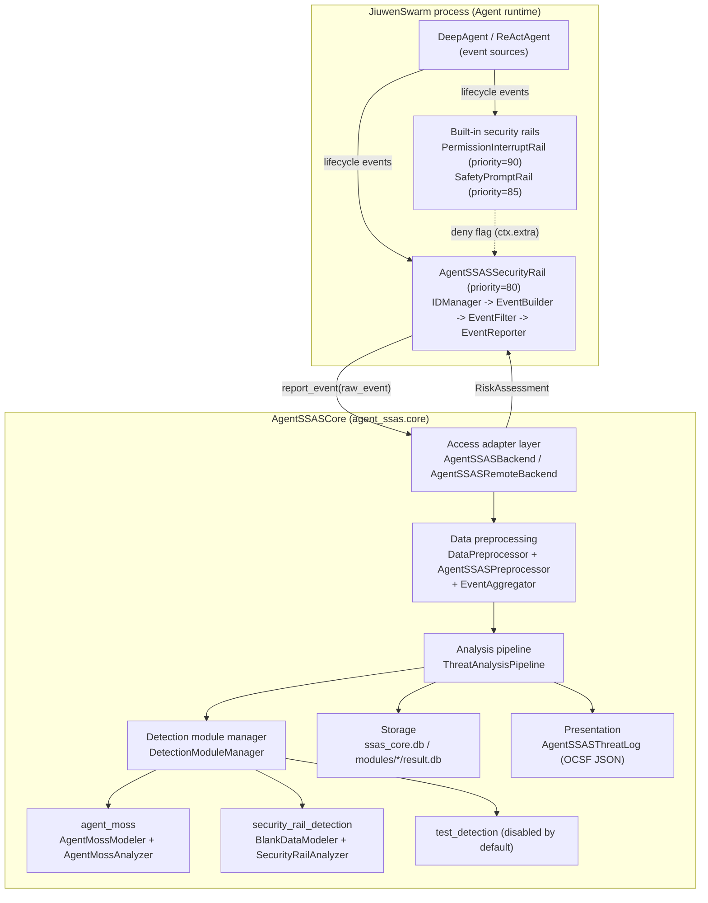
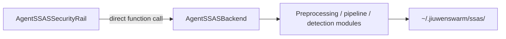
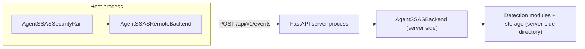

# Architecture Principles

This article explains the overall architecture of AgentSSAS, the responsibility boundary between the two subsystems, the data flow of the two runtime modes, and the motivations behind several key design decisions. The goal is to answer "why it is designed this way", not "how to use it".

## The Big Picture

AgentSSAS consists of two subsystems: AgentSSASClient, responsible for **event collection**, and AgentSSASCore, responsible for **threat detection**. The former (core class `AgentSSASSecurityRail`) is instrumented in-process as a Rail inside JiuwenSwarm (the openJiuwen agent runtime); the latter is a general-purpose analysis engine.



Data flows in one direction: the Agent runtime produces events; AgentSSASSecurityRail collects them and assembles them into raw_events; they enter AgentSSASCore through the access adapter layer and are passed down stage by stage along "preprocessing -> analysis pipeline -> detection modules"; detection results are finally persisted as storage records and threat logs. The only reverse data flow is `RiskAssessment` - the risk assessment conclusion that AgentSSASCore returns to AgentSSASSecurityRail.

## The Two Subsystems: Responsibilities and Boundaries

### Why split into two subsystems

The essential motivation for the split is to **decouple "collection" from "detection"**:

- **Collection must stay close to the runtime.** Event IDs (such as `interaction_seq` and `tool_call_seq`) must be maintained inside JiuwenSwarm's callback context (`AgentCallbackContext`); once you leave that process, accurate event ordering is no longer obtainable. So the collection layer must run inside the Agent process, as a Rail.
- **Detection should be independent of the runtime.** The threat detection engine (behavior modeling, rule analysis, PDG graph) is pure computational logic, unrelated to any specific agent framework. If detection code were entangled with collection code, every extension of detection capability would require changes on the runtime side, plus re-verification of the impact on the main flow.

The boundary is therefore drawn at a single interface, `AgentSSASBackendProtocol.report_event(raw_event) -> RiskAssessment` (`src/agent_ssas/core/framework/access_adapter/protocol.py`):

- AgentSSASSecurityRail does only three things: maintain event sequence numbers, assemble the three-layer raw_event, and call the backend to report.
- AgentSSASCore does only one thing: consume raw_events and produce RiskAssessment.
- The only shared data contract between the two sides is the raw_event format and the RiskAssessment format; nothing else is visible across the boundary.

### Why AgentSSASCore does not depend on jiuwenswarm

The dependencies of the `agent-ssas` package's `pyproject.toml` contain only `pyyaml` (fastapi/httpx for HTTP mode are optional-dependencies). This is not an oversight but deliberate layering:

- AgentSSASCore's input is a "three-layer dict", not jiuwenswarm types. It can connect to any reporting source capable of assembling this format (`DataPreprocessor` selects a parser by `common.source`, an extension point reserved for multiple reporting sources).
- Detection modules, the pipeline, storage, and presentation all operate on the engine's internal data structures (`UnifiedEvent`, `EventNode`), independent of openjiuwen's type system.

Seen from the other direction, **the dependency is one-way**: jiuwenswarm depends on agent-ssas (and is responsible for the try/except import and Rail registration), while agent-ssas depends on neither openjiuwen nor jiuwenswarm. This brings an immediate benefit: AgentSSASCore can be developed and tested independently of JiuwenSwarm (driven by synthetic events), and it can serve other agent frameworks in the future.

### The exception: instrumentation code

The only exception is the `agent_ssas/backend_client/openjiuwen/` directory. This code (the `AgentSSASSecurityRail` subclass, `ExtendedSecurityCheckContext`, `IDManager`, etc.) does import `openjiuwen` types (`BaseSecurityRail`, `SecurityDecision`, etc.), because it must run inside the jiuwenswarm process as a Rail. But since agent-ssas declares no dependency on openjiuwen, this instrumentation is loaded only when the jiuwenswarm runtime (which depends on both) is present; when integrating with other agents, this directory is never imported, and the agent-ssas core works as usual.

One-sentence summary: **the agent-ssas package does not depend on openjiuwen; only the AgentSSASSecurityRail instrumentation code runs inside the jiuwenswarm process**.

## The Two Runtime Modes: Two Implementations of the Same Protocol

`AgentSSASConfig.mode` decides what happens behind `report_event`, but AgentSSASSecurityRail is completely unaware of it - all it holds is an `AgentSSASBackendProtocol`.

### inprocess (in-process mode, default)



`AgentSSASBackend` directly holds the instances of the preprocessor, pipeline, module manager, and storage; `report_event` is just an ordinary async method call, with zero network latency, and detection shares the same event loop as the Agent runtime. Storage lands in the local `~/.jiuwenswarm/ssas/` (the root directory is resolved in the order `SSAS_HOME -> JIUWENSWARM_DATA_DIR -> JIUWENSWARM_HOME -> ~/.jiuwenswarm`).

### http (HTTP service mode)



`AgentSSASRemoteBackend` translates `report_event` into a single HTTP POST (httpx async client). The server side is an independently running FastAPI process that is internally also a `AgentSSASBackend`. The data flow differs in only two ways:

1. **Cross-process boundary**: event serialization travels over the network, adding one HTTP round-trip of latency; detection modules are initialized on the server side, and the host-side `initialize()` is a no-op.
2. **Storage location**: data lands in the server-side directory. Multiple Agents can share the same SSAS service, achieving centralized security situational awareness.

The reason both modes are transparent to the Rail is that the interface contract specifies only inputs and outputs (raw_event in, RiskAssessment out), not the transport. This is the design payoff of "one interface + Protocol structural typing": swapping the implementation requires no change to the caller.

## Key Design Decisions

### 1. fail-open: a security component must not itself become a point of failure

SSAS is a "companion" security system - its positioning is situational awareness, not a gatekeeper on the critical path. Therefore every layer in the chain has a fail-open fallback:

| Failure point | Fallback behavior | Code location |
|--------|---------|---------|
| Event reporting failure (Rail side) | Catch the exception and return `SecurityAllow()` | `EventReporter.report` in `event_reporter.py` |
| HTTP network exception/timeout | Return `RiskAssessment(risk_level=SAFE)` | `agent_remote_backend.py` |
| Internal engine exception (preprocessing failure, invalid event, etc.) | `report_event` wraps everything in try/except and returns a no-risk result | `report_event` in `agent_backend.py` |
| Modeling/analysis exception in a single detection module | Skip that module; other modules are unaffected | `_run_module_pipeline` in `pipeline.py` |
| Storage/presentation failure | Log and continue; detection and the return value are unaffected | `pipeline.py`, `agent_backend.py` |
| auth-mode detection timeout | Generate a default report according to the module's `auth_timeout_policy` | `_make_timeout_report` in `pipeline.py` |

Design trade-off: fail-open means that when SSAS itself fails, threats "slip through undetected", but it guarantees that **a failure of the security awareness system never drags down the business**. This is in the same spirit as the observe_only default policy (see below): first make "seeing" solid, then talk about "blocking". Real interception decisions remain the responsibility of jiuwenswarm's existing security rails.

### 2. observe_only by default: avoiding double blocking

Upon receiving a `RiskAssessment`, AgentSSASSecurityRail maps it to an agent-core `SecurityDecision` according to the policy table in `decision_policies.yaml`:

- **observe_only (default)**: all risk levels map to `allow`. SSAS only observes; it does not intervene.
- **active_protection**: `critical -> reject`, `high/medium/low -> alert`, `safe -> allow`.

The motivation for the observe_only default: jiuwenswarm already has security mechanisms such as PermissionInterruptRail (priority=90) performing actual blocking. If SSAS also blocked by default, the same tool call could be intercepted by two systems in succession, producing duplicate alerts or even contradictory decisions. Letting SSAS default to the observer's seat, joining the decision path only after the user explicitly configures `ssas.decision_policy: active_protection`, is the more prudent, incremental path.

### 3. priority=80: running after the other security rails

Rails execute in descending priority order - the larger the value, the earlier the execution. AgentSSASSecurityRail is set to 80, below PermissionInterruptRail (90) and SafetyPromptRail (85).

This ordering is not arbitrary. A Rail that runs later can observe the decision side effects of earlier Rails: when PermissionInterruptRail rejects a tool call, it sets a flag in `ctx.extra["_skip_tool"]`; when AgentSSASSecurityRail subsequently executes and reads this flag, it rewrites the event's `event_type` to `permission_interrupt_tool`, sets `event_class` to `security`, and assembles the event as a "security-detection-derived event" for reporting. In other words, **other Rails' blocking decisions become secondary analysis input for SSAS** - suspicious behavior intercepted by the built-in Rails is recorded by SSAS, correlated with behavioral-chain context, and folded into the long-term picture.

### 4. No trimming on the collection side; on-demand processing on the consumer side

AgentSSASSecurityRail collects all obtainable data (full message lists, tool arguments, results) and does no trimming on the collection side; trimming is deferred to the AgentSSASCore side. The rationale: collection-side code runs inside the Agent process, where iteration is expensive (the impact on the main flow must be considered), whereas the analysis side iterates fast and can be tested independently. Better to over-collect than to miss.

### 5. A plugin-based engine: a module is a "modeling + analysis" plugin pair

AgentSSASCore adopts a "framework + plugins" architecture. Each detection module is declared by a `module.yaml` and contains exactly one pair of plugins:

- **data_modeling plugin** (`DataModelerPlugin` protocol): takes an event description as input, outputs modeling data, and identifies the data type with `model_type`;
- **threat_analysis plugin** (`ThreatAnalyzerPlugin` protocol): takes modeling data as input (requiring `expected_model_type` to match the former), outputs a threat analysis report.

Three modules are built in:

| Module | Subscribed events | Modeling plugin | Analysis plugin | Default state |
|------|---------|---------|---------|---------|
| `agent_moss` | 6 lifecycle events | AgentMossModeler | AgentMossAnalyzer | enabled |
| `security_rail_detection` | `permission_interrupt_tool` | BlankDataModeler | SecurityRailAnalyzer | enabled |
| `test_detection` | `*` (all events) | BlankDataModeler | BlankThreatAnalyzer | disabled |

The module manager scans the `detection_modules/` directory at initialization, dynamically imports the plugins, and builds the subscription table according to `subscribed_events`. Adding a new detection capability = adding one directory + one plugin pair, with zero changes to framework code. `test_detection` is disabled by default (it can be enabled via `ssas.modules.test_detection.enabled: true`); it exercises the full chain with blank plugins and serves as the framework's self-check tool.

## Storage Layout

All artifacts are concentrated under the storage root directory (default `~/.jiuwenswarm/ssas/`):

```
<ssas_home>/ssas/
├── ssas_core.db                    # core database: raw_events / events / alerts tables (alerts land here)
├── modules/
│   └── <module_name>/
│       ├── process.db              # module process data
│       └── result.db               # module threat analysis reports (including no-risk ones)
└── reports/
    └── threat_log/
        └── threat_{trace_id}_{module_name}_{YYYYMMDD_HHMMSS_mmm}.json   # OCSF Detection Finding format
```

The three kinds of storage serve three kinds of consumers: `ssas_core.db` is for event replay and query, `result.db` is for module-level result analysis, and the OCSF JSON is for standardized log pipelines (OCSF is an open cybersecurity schema, convenient for integration with external SIEMs).

Risky detection reports are written by the ThreatAnalysisPipeline into the alerts table of the core `ssas_core.db` (covering both the notify background task and the auth synchronous path). The `alert_id` format is `{event_id}_{module_name}`; the alert record carries a `module_name` field, making the detection module that raised the alert traceable. Each module's `result.db` holds all of that module's threat analysis reports (including no-risk ones).

## Summary

AgentSSAS's architecture can be summarized as four main threads: **decoupling collection from detection** (a single Protocol interface draws the boundary), **decoupling the engine from the framework** (agent-ssas does not depend on openjiuwen), **decoupling transport from protocol** (inprocess/http behind one interface), and **decoupling security from business** (fail-open + observe_only by default). Once you understand these four decouplings, the rest of the design is essentially a corollary of them.

## Further Reading

- [Event Model](./event-model.md): the design semantics of the three-layer structure and the 14 correlation fields
- [Detection Pipeline Principles](./detection-pipeline.md): the complete journey of one `report_event`
- [Overall Architecture Design Document](../../../design/AgentSSAS_01_整体架构设计文档.md): the complete definition of the cross-repository interface contract and the implementation plan
- [AgentSSASCore Functional Design Document](../../../design/AgentSSAS_03_AgentSSASCore功能设计文档.md): specifications of the engine's internal modules
- [AgentSSASClient Functional Design Document](../../../design/AgentSSAS_02_AgentSSASClient功能设计文档.md): collection-side module design and background on the agent-core Rail mechanism
- [In-process Quick Start Example](../../../examples/inprocess_quickstart/)
- [HTTP Service Mode Example](../../../examples/http_server_demo/)
