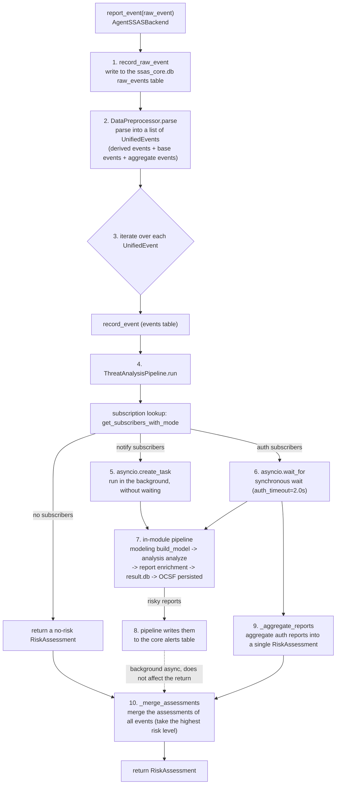

# Detection Pipeline Principles

This article follows the complete journey of one `report_event` call - from AgentSSASSecurityRail submitting a raw_event, through the return of the `RiskAssessment`, to the threat log landing on disk. All steps and aggregation strategies follow the actual source implementation (`agent_backend.py`, `pipeline.py`, `preprocessor.py`, and `manager.py` under `src/agent_ssas/core/framework/`).

## The full picture

## Step-by-step breakdown

### Step 1: raw_event persistence

The first thing `report_event` does is write the raw_event, as is, into the raw_events table of `ssas_core.db`. Putting this before all processing is deliberate: **raw events are a non-renewable resource**. Any later stage (parsing, aggregation, detection) may fail or evolve, but as long as the raw_event is on disk, replay and audit remain possible after the fact. A persistence failure is only logged; it does not block the subsequent flow.

### Step 2: data preprocessing - one raw_event becomes a list of UnifiedEvents

`DataPreprocessor.parse` chooses a parser by `common.source` (default `AgentSSASPreprocessor`) and returns a **list**, not a single event. There are three reasons:

1. **Derived events**: the first time a session is seen, a `session_start` is generated automatically; the first time an interaction is entered and the first event is not `invoke_start`, a `user_input` is generated automatically. They complete the behavior-graph structure.
2. **Base events**: the UnifiedEvent parsed from the raw_event itself.
3. **Aggregate events**: after a base event enters the aggregation stack, if it is a closing event (`tool_output` / `llm_output` / `invoke_end`), the aggregator pops the related events off the stack and merges them into `one_toolcall_event` / `one_llmcall_event` / `one_interaction_event`. For example, when `tool_output` arrives, the `tool_input` with the same `tool_call_seq` is popped off the stack, and the two events are merged into one "tool call event" with complete input and output.

The point of aggregation is to **give detection modules two observation granularities**: subscribe to `tool_input` to watch the trigger moment of each call, or subscribe to `one_toolcall_event` to see each call's complete input and output. The module manager expands aggregate-event subscriptions into base-event subscriptions (see Step 4), and the base events kept in the stack guarantee that both kinds of subscriptions receive data.

### Step 3: events enter the pipeline one by one

The access adapter layer iterates over the list of UnifiedEvents and, for each event in turn:

- writes it to the `ssas_core.db` events table (failure does not block);
- calls `ThreatAnalysisPipeline.run(unified)` to obtain a `RiskAssessment`.

Alert writing does not happen at this layer - risky reports are written by the pipeline into the core alerts table (see Step 4), which covers both the notify background task and the auth synchronous path.

Note that this layer introduces **the second of the two aggregation layers** (inter-event merging): after the events produced by one raw_event have each run through the pipeline, `_merge_assessments` merges the multiple `RiskAssessment` objects into one to return to the caller (see "Aggregation strategies in detail" below).

### Step 4: subscription lookup and dispatch

The pipeline takes `event_type` from the event and calls `module_manager.get_subscribers_with_mode(event_type)` to query the subscription table. The rules for building the subscription table:

- each entry in `module.yaml`'s `subscribed_events` has the form `event_type[:mode]`, e.g. `"tool_input"` (notify mode) or `"tool_input:auth"` (auth mode);
- **aggregate-event subscriptions are expanded**: subscribing to `one_toolcall_event` registers subscriptions to `tool_input` (notify) and `tool_output` (inheriting the declared mode) - auth mode applies to the closing event, while the opening event is always notify;
- the wildcard `"*"` subscribes to all events (mode is always notify); `test_detection` uses it to implement a full-event self-check;
- a module keeps only one subscription per event (deduplicated, order preserved).

When there are no subscribers, a no-risk `RiskAssessment` is returned directly, avoiding fruitless traversal.

### Step 5: the in-module pipeline - modeling, analysis, storage, presentation

For every subscribing module (notify or auth alike), the same in-module pipeline runs (`_run_module_pipeline`):

1. **Data modeling**: `module.modeler.build_model(event_desc)`. event_desc is a serialized description of the UnifiedEvent (containing `event_node`, `aux_ids`, `trace`, and `event_id`). The modeling plugin converts it into its own domain's data model; for example, `AgentMossModeler` maps SSAS events into AgentMoss runtime events. On a modeling exception, the module is skipped (None is returned).
2. **Threat analysis**: `module.analyzer.analyze(model_data)`. The analysis plugin consumes the modeling data and outputs a threat analysis report dict. Plugins are paired via `model_type` / `expected_model_type` (for agent_moss, both sides are `"agent_behavior_model"`). On an analysis exception, the module is likewise skipped.
3. **Report enrichment**: the pipeline injects `aux_ids`, `event_node`, `module_name` (when the plugin does not provide it), `recommended_actions` (an empty list by default), and `analytic_type_id` (declared at the top level of module.yaml, for OCSF construction) into the report. These injections ensure that reports produced even by "minimally implemented analysis plugins" can be correctly traced and presented.
4. **Storage**: the report is written to the module's `modules/<name>/result.db`. Failure is only logged - storage is the archive of results, not a precondition of detection.
5. **Presentation**: `AgentSSASThreatLog.render(report)` builds the complete OCSF Detection Finding report and persists it as `<storage_path>/reports/threat_log/threat_{trace_id}_{module_name}_{YYYYMMDD_HHMMSS_mmm}.json` (local-timezone human-readable time, with milliseconds to guard against same-second overwriting). Failure likewise does not block.

Exceptions at every step inside a module are caught locally: **any failure of a single module affects only that module**, never the other modules, and never the main flow's return.

### Alert persistence: written to the core database by the pipeline

Risky reports (`has_risk` true and the risk level above safe) are written by `ThreatAnalysisPipeline._write_alerts` into the alerts table of the core `ssas_core.db`:

- **Both paths are covered**: after the notify subscribers' background task completes, and on the auth subscribers' synchronous path before aggregation. With only notify subscribers, `report_event` still returns a no-risk result immediately (never blocking the Agent); alerts are persisted in the background.
- **The alert_id format** is `{event_id}_{module_name}`, so multiple modules' alerts for the same event never overwrite each other; the alert record carries a `module_name` field, making the detection module that raised the alert traceable.
- A persistence failure is only logged; it does not affect detection or aggregation (consistent with the fail-open policy).

## notify and auth: the execution semantics of the two subscription modes

The subscription mode decides when a module's detection runs and how `report_event` returns:

| Dimension | notify mode | auth mode |
|------|------------|-----------|
| Execution | `asyncio.create_task`, asynchronous in the background | `await asyncio.wait_for(..., timeout=auth_timeout)`, synchronous wait |
| Does report_event wait | No; returns immediately | Waits for all auth modules to finish (or time out) |
| Return-value semantics | With only notify subscribers, returns a no-risk RiskAssessment (detection results are for after-the-fact audit only) | A RiskAssessment aggregated from the auth reports; participates in the caller's decision |
| Typical use | Situational awareness, behavior modeling, logging | Giving block/allow opinions before a tool executes |
| Timeout fallback | Not applicable | Generates a default report per `auth_timeout_policy` |

Several source-level details deserve attention:

- **Lifecycle management of notify tasks**: references to background tasks are kept in a `_background_tasks` set to prevent garbage collection; tasks remove themselves automatically via `add_done_callback` on completion. This is a classic asyncio pitfall - a task that is created without holding a reference can be cancelled mid-flight by the GC.
- **auth timeout fallback** (`AgentSSASConfig.auth_timeout` defaults to 2.0 seconds): a timed-out auth module produces a default report according to its module.yaml's `auth_timeout_policy` - `allow` (default) yields a no-risk report (`risk_level=safe`, `recommended_actions=["log"]`); `reject` yields a high-risk report (`risk_level=high`, `risk_score=75.0`, `recommended_actions=["block"]`). In other words, **a timeout is itself modeled as a detection result**, not as an exception.
- **Mixed subscriptions**: when the same event has both notify and auth subscribers, the notify subscribers run in the background while the auth subscribers are awaited synchronously; the return value reflects only the auth side.
- **All built-in modules are currently notify mode** (neither agent_moss's nor security_rail_detection's module.yaml carries an `:auth` suffix), so at this stage `report_event` in practice always returns a no-risk result immediately, with all detection completed in the background. auth is the execution channel reserved for future "detection modules that participate in decisions".

## Aggregation strategies in detail

Aggregation happens at two layers, both governed by the implementations in `pipeline.py` and `agent_backend.py`.

### Layer 1: intra-event aggregation (`_aggregate_reports`, pipeline.py)

The auth-module reports for the same event are aggregated into a single RiskAssessment, field by field:

| Field | Aggregation rule |
|------|---------|
| `risk_level` | Take the highest level across all reports (safe < low < medium < high < critical); unrecognized level strings fall back to safe |
| `has_risk` | True if any report has `has_risk=True`; also forced to True when the aggregated highest level is above safe |
| `risk_type` | Take the value from the **highest-risk-level report** (the first one when several reports share the same level) |
| `risk_score` | Take the maximum value across all reports |
| `confidence` | Take the confidence of the highest-risk-level report |
| `detected_threats` | Merge the threat lists of all reports; deduplicate, preserving order |
| `recommended_actions` | Merge the recommended actions of all reports; deduplicate, preserving order; defaults to `["log"]` when empty |
| `evidence` | Collect each report's non-empty evidence keyed by module name |
| `details` | Not populated by the 0.1 aggregation logic; remains the default empty dict |

"Take the highest level" is the common orientation in security aggregation: when multiple modules disagree, it is better to overestimate the risk. `risk_type` and `confidence` follow the highest-level report instead of being synthesized separately, because these two fields are meaningful only when bound to a concrete report.

### Layer 2: inter-event merging (`_merge_assessments`, agent_backend.py)

After the multiple UnifiedEvents produced by one raw_event (base events + derived events + aggregate events) have each run through the pipeline, their RiskAssessments are merged once more: the assessment with the highest risk level serves as the base (`risk_level`, `risk_type`, `risk_score`, and `confidence` are taken from it); `detected_threats` and `recommended_actions` are merged, deduplicated, and order-preserved; `evidence` is merged directly. With a single event, it is returned as is; an empty list returns no risk.

The two layers each govern one segment: the first merges "multiple modules' judgments of the same event" into one conclusion; the second merges the conclusions of "the multiple events produced by one report" into the final return value. The caller (AgentSSASSecurityRail) sees only this one final RiskAssessment.

## Where the results go

A pipeline run, successful or not, sends its results to four destinations:

1. **Back to the caller**: the RiskAssessment is returned to AgentSSASSecurityRail through the access adapter layer, which maps it to a SecurityDecision according to `decision_policies.yaml` (observe_only allows everything by default; under active_protection, critical -> reject, high/medium/low -> alert, safe -> allow). The motivation for this mapping is described in [Architecture Principles](./architecture.md).
2. **Module result databases**: each module's threat analysis reports are written to `~/.jiuwenswarm/ssas/modules/<module>/result.db` for module-level result queries and statistics.
3. **OCSF threat log**: the presentation plugin builds the simplified report into a complete OCSF Detection Finding JSON, persisted under `reports/threat_log/`. The file name contains the trace_id, the module name, and the local-timezone human-readable time (with milliseconds), which naturally avoids overwriting. OCSF is a standardized schema, convenient for integration with external security-analysis pipelines.
4. **Alerts table**: risky reports (not just the event-level aggregated assessment) are written by the ThreatAnalysisPipeline into the `ssas_core.db` alerts table, covering both the notify background task and the auth synchronous path. The `alert_id` format is `{event_id}_{module_name}`; the record carries a `module_name` field for tracing the source module, reserving data for a future real-time alert endpoint.

## Where fail-open sits in the pipeline

Every possible failure point in the pipeline has a local fallback (quoted from source comments and the implementation):

- raw_event persistence failure -> log and continue;
- single-event persistence failure -> log and continue;
- modeling/analysis failure -> skip the module;
- storage/presentation failure -> return the already-produced report;
- `report_event` overall exception (e.g. an invalid raw_event, or preprocessing raising ValueError) -> return a no-risk RiskAssessment (`risk_level=SAFE`).

This means **the pipeline never throws an exception at the caller** - the worst case is "no risk detected", not "business blocked".

## Further Reading

- [Architecture Principles](./architecture.md): the two subsystems, the two runtime modes, and the key design decisions
- [Event Model](./event-model.md): the semantics of the raw_event three-layer structure and the correlation fields
- [AgentSSASCore Functional Design Document](../../../design/AgentSSAS_03_AgentSSASCore功能设计文档.md): the complete specifications of the pipeline module (Chapter 5 bis), the aggregation strategies (Section 7.10), and the detection module manager (Chapter 5 ter)
- [Overall Architecture Design Document](../../../design/AgentSSAS_01_整体架构设计文档.md): the RiskAssessment field definitions and the fail-open principle
- [In-process Quick Start Example](../../../examples/inprocess_quickstart/)
