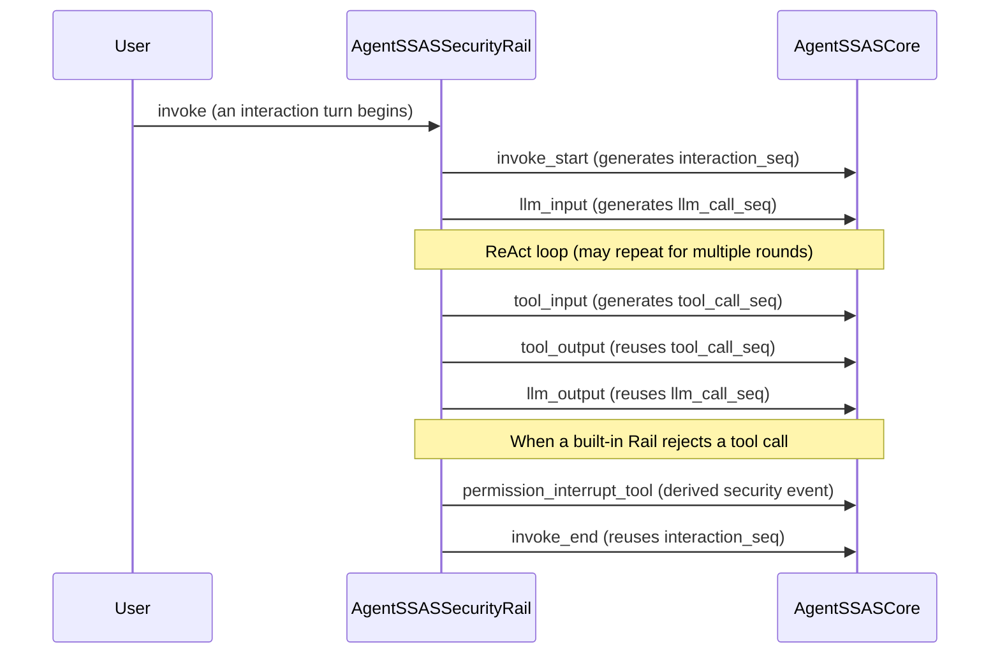

# Event Model

Events are first-class citizens in AgentSSAS: everything on the collection side exists to turn the Agent runtime's behavior into structured events, and all analysis on the detection side is built on the correlations among these events. This article explains the design of the event model - what the three-layer structure is, how the 14 correlation fields support event-stream reconstruction, how 7 events form one complete interaction, and how AgentMoss consumes these events one by one to incrementally build behavioral models.

## Why a three-layer structure

Every raw_event reported by AgentSSASSecurityRail is a three-layer dict:

```json
{
    "common":   { "source": "AgentSSASSecurityRail", "event_type": "tool_input", "event_class": "lifecycle", "...": "..." },
    "payload":  { "content": {"tool_args": {"command": "ls -la"}}, "tool_name": "bash", "tool_call_id": "call_abc123" },
    "metadata": { }
}
```

Each layer has its own job, and the reason for the layering is that **the three kinds of information change at completely different rhythms**:

| Layer | Contents | Consumers | Rate of change |
|----|------|--------|---------|
| **common** | Event identity and correlation fields: who reported it, what type it is, when it happened, which interaction/call it belongs to | The preprocessor's routing and correlation logic; provenance in detection modules | Highly stable; the core of the cross-repository contract |
| **payload** | Event business data: content fields that vary by `event_type` | Consumed on demand by detection modules | Extends with event types |
| **metadata** | Free-form KV extension fields; an empty dict by default | Future versions appending information | Fully open |

The key insight: **before a detection module can answer "is this behavior dangerous?", it must first be able to answer "where did this behavior take place, whom does it belong to, and which behaviors sit next to it"**. The former depends on payload, the latter on common. Peeling the correlation fields out of the business content and placing them in common means:

1. The preprocessor (`AgentSSASPreprocessor`) can classify events, generate node_ids, and attach structure by looking only at the common layer, without understanding any event type's business fields;
2. The `common.source` field lets the engine choose a parser by reporting source - this is the extension point for "AgentSSASCore connecting to other agent frameworks in the future";
3. payload can extend freely with event types (adding a new event type only requires defining new content fields) without polluting the correlation logic.

## The 14 correlation fields of common: a coordinate system for event-stream reconstruction

The common layer has 14 fields in total, which can be understood in three groups: the **identity group** (source, event_type, event_class, timestamp), the **hierarchical ID group** (session_id, conversation_id, agent_id, trace_id, context_id, interaction_seq), and the **call-sequence group** (llm_call_seq, tool_call_seq, tool_call_id, subsession_id).

### Hierarchical IDs: four levels of coordinates from session to tool call

These fields form a hierarchical correlation model used to restore discrete events into complete behavioral chains:

```
trace_id (trace identifier; spans the entire task)
└── session_id (session; conversation_id is its alias in agent-core)
    ├── agent_id (Agent identity; distinguishes multiple agents in the same session)
    └── interaction_seq (interaction turn; per-group auto-increment sequence, starting at 0)
        ├── llm_call_seq (LLM call sequence within the turn, starting at 0)
        │   ├── tool_call_seq (tool call sequence within that LLM call, starting at 0)
        │   │   └── tool_call_id (raw call ID passed through by the LLM provider; provenance only)
        │   └── ... (one invoke in a ReAct loop may involve multiple LLM calls)
        └── ...
```

The semantic essentials of the three sequence groups:

- **interaction_seq**: the interaction turn number. The agent-core framework provides no invoke-level ID, so SSAS uses `session_id + agent_id + conversation_id` to identify a "group" and auto-increments within it. At BEFORE_INVOKE it increments first and is then used (initial value -1, so the first event is 0); all subsequent events within the same invoke reuse it.
- **llm_call_seq**: distinguishes multiple LLM calls within the same interaction (the ReAct loop). At BEFORE_MODEL_CALL it increments first and is then used; AFTER_MODEL_CALL reuses it. **In tool events, llm_call_seq means "which LLM call this tool call belongs to"** - this one field is enough to reconstruct the link of "which model output triggered the tool call".
- **tool_call_seq**: the tool call sequence number maintained by SSAS itself. At BEFORE_TOOL_CALL it increments first and is then used; AFTER_TOOL_CALL reuses it. **The only reason it exists is that tool_call_id is unreliable** (see below).

### tool_call_id and tool_call_seq: why two tool identifiers

`tool_call_id` is a string passed through verbatim by the LLM provider (OpenAI's `call_xxx`, Anthropic's `toolu_xxx`). Its problems: the format is decided by the external provider, differs across providers, and **it can be an empty string**. A possibly-empty string cannot serve as a correlation key.

So SSAS's strategy is dual-track: the common layer keeps both the raw `tool_call_id` (for manual provenance and cross-checking against external logs) and the self-maintained `tool_call_seq` (an int, guaranteed non-empty and monotonic). The `tool_input` and `tool_output` of the same tool call are paired via their identical `tool_call_seq` - this is also the basis on which the aggregator merges the two events into "one complete tool call".

### subsession_id and context_id: two special fields

- **subsession_id**: in the sub-Agent scenario, a sub-Agent event's `subsession_id` carries the parent session's `parent_session_id`, while its `session_id` is its own. Together, the two IDs restore the hierarchy of "which parent session a sub-Agent belongs to". In non-sub-Agent scenarios it is an empty string.
- **context_id**: the model conversation context identifier. ModelContext is created only after an invoke starts, so the context_id of invoke-level events can be an empty string; it is reliable only for events inside an invoke (model calls, tool calls). The event model makes no correlation commitment for it.

### A complexity deliberately kept low

Note that all these sequence numbers are **plain int auto-increments** - no UUIDs, no timestamps. The reason: event correlation needs "unique and ordered within the group"; an auto-increment sequence provides both and additionally encodes ordering information for free (`tool_call_seq=3` is necessarily later than `tool_call_seq=2`). Timestamps do exist (common.timestamp), but they are used only for display and duration statistics, not for correlation - clocks can be skewed or run backwards; sequence numbers cannot.

## The 7 events: the shape of one complete interaction

Version 0.1 of SSAS collects 6 lifecycle events + 1 security-detection-derived event:



Described in BNF style:

```
interaction := invoke_start
               ( llm_input ( tool_input tool_output )* llm_output )*
               invoke_end
```

- The 6 lifecycle events come from agent-core's 6 pipeline events (BEFORE/AFTER_INVOKE, BEFORE/AFTER_MODEL_CALL, BEFORE/AFTER_TOOL_CALL) and carry **no security semantics** of their own - they are merely behavioral traces;
- `permission_interrupt_tool` is a **security-detection-derived event** (`event_class="security"`): when PermissionInterruptRail rules a tool call as DENY, AgentSSASSecurityRail observes the deny flag, rewrites what was originally a `tool_input` into `permission_interrupt_tool`, and reports it. Its payload carries both the original behavior information (tool_args, tool_name) and the security check result (risk_source, risk_type, risk_level, decision, evidence).

The positioning of the derived event deserves emphasis: **other Rails' blocking decisions are secondary analysis input for SSAS**. After subscribing to this event, the `security_rail_detection` module does not re-detect (the rail has already checked); instead, it normalizes the event into a threat report and folds it into presentation and storage - effectively attaching complete behavioral-chain context (which interaction, which LLM call, what happened before and after) to every interception made by the existing security mechanism.

## Event-stream reconstruction: from raw_event to behavior graph

The value of the event model is cashed in on the consumer side. `AgentSSASPreprocessor` consumes raw_events one by one and incrementally builds the `Trace -> Session -> Interaction -> EventNode` hierarchy:

1. **node_id generation** (deterministic; derivable back from the sequence numbers):
   - interaction node: `{session_id}_{interaction_seq}_interaction`
   - llm_call node: `{session_id}_{interaction_seq}_llmcall_{llm_call_seq}`
   - tool_call node: `{session_id}_{interaction_seq}_toolcall_{tool_call_seq}`
2. **Parent-child attachment**: a tool_call/llm_call node's `parent_node_id` points to the interaction node it belongs to, and the interaction points to the session node. Note that `llm_input` and `llm_output` map to the **same** llm_call node (identical node_id); the input side fills `input_content`, and the output side fills `output_content`.
3. **Input/output content normalization**: different event types use different content field names (query/messages/tool_args/response/tool_result); the preprocessor uniformly extracts them into two generic fields, `input_content` / `output_content`, and sets `action_name` by event type (the tool name for tool events, `llm_call` for LLM events). Detection modules can therefore process all events from a unified view.
4. **Derived events**: the first time a session is seen, a `session_start` node is generated automatically; the first time an interaction is entered and the first event is not `invoke_start`, a `user_input` node is generated automatically. This guarantees structural integrity - even if the collection side loses the first event, the behavior graph remains connected.
5. **Aggregate events**: the preprocessor maintains an aggregation stack; when a closing event arrives, the scattered base events are merged into aggregate events (`tool_output` triggers `one_toolcall_event`, `llm_output` triggers `one_llmcall_event`, `invoke_end` triggers `one_interaction_event`). Aggregate events carry the full set of correlation IDs in an `aux_ids` substructure, so that "subscribing to one complete tool call" and "subscribing to a single event" travel the same path in the pipeline.

One important engineering detail in this design: the session cache is managed with LRU (at most 100 sessions); during long-running operation, the incremental structures of old sessions are evicted, preventing unbounded memory growth. Event-stream reconstruction is "best-effort online reconstruction", not full persistence followed by offline replay.

## How AgentMoss consumes events incrementally

The `agent_moss` module is the event model's most important consumer. It subscribes to all 6 lifecycle events (all in notify mode), maps the events into AgentMoss engine runtime events, and then runs three-way analysis (rule / behavior_chain / pdg):

### Event mapping

```
invoke_start  -> chat_request
llm_input     -> model_call
llm_output    -> model_output
invoke_end    -> model_output
tool_input    -> tool_call
tool_output   -> tool_result
```

The mapping is done by `event_adapter.py`, and it is **deliberately structural**: it translates only the lifecycle semantics and the explicit correlation IDs of events, never inferring dependencies from natural-language content. Each modeling pass produces two parts: `agentmoss_event` (a runtime event the engine can consume) and `correlation` (a complete snapshot of the SSAS correlation IDs, for report provenance).

### Maintaining bounded history per session

AgentMoss's behavior chains and PDG rules are **stateful** - judging "is this tool call abnormal?" requires knowing what happened before. The analyzer maintains history per session:

- The history key is `session:{session_id}` (falling back to `request:{trace_id}` when missing, and further to `uncorrelated:{event_id}` - this last fallback ensures that **when correlation fields are missing, events from different Agents are never mixed into the same history**);
- When analyzing each event, predecessors that precede the current event in time are first filtered out of the history; after evaluation, the current event is appended to the history;
- The history cap is `max_history_events=200` (configured in module.yaml, with a code-enforced lower bound of 5); after appending, it is truncated to keep the most recent 200 entries - **bounded** so that memory stays under control, and long sessions keep only a recent sliding window;
- Each event record also stores `prev_event_ids` (the event_ids of the most recent 5 predecessors) as explicit ordering evidence for behavior chains.

### The conservative principle for dependency evidence

This is the event model's most critical constraint on the detection side: AgentMoss treats **only the following** as evidence of PDG data dependencies:

- exact fingerprints (exact matches of sensitive values such as API keys and private keys in content);
- resource identifiers (exact matches of sensitive resource paths such as `.env` and `.ssh/id_rsa`);
- tool call IDs (explicit pairing of tool_calls);
- explicit event ordering (timestamps and event_id ordering within the same history).

**Implicit semantic flows that cannot be proven are never promoted to PDG data dependencies**. For example, semantic-level inference such as "a model output mentions a file name, and the same file name then shows up in tool arguments" is rejected by the engine - because "similarity" at the content level may be pure coincidence, and solidifying coincidence into dependency edges produces false positives. Prefer false negatives (conservative) over false positives (noise); this is dictated by the positioning of a situational-awareness system.

## Summary

The event model's design can be boiled down to one sentence: **use a stable correlation coordinate system (the 14 fields of common) to carry volatile business content (payload)**. The sequence fields guarantee that the event stream can be reconstructed online and incrementally into a behavior graph; the three-layer structure guarantees the stability of the contract and the extensibility of the content; the security-detection-derived event brings "other security components' decisions" into the same coordinate system, so that SSAS's situational awareness covers both dimensions: "behavioral traces" and "interception records".

## Further Reading

- [Architecture Principles](./architecture.md): how the two subsystems cooperate around the event model
- [Detection Pipeline Principles](./detection-pipeline.md): the complete processing journey of an event after it enters the engine
- [Overall Architecture Design Document, Chapter 4: Cross-Repository Interface Design](../../../design/AgentSSAS_01_整体架构设计文档.md): the complete specification of the raw_event three-layer structure, the 14 fields, and the payload definitions
- [AgentSSASClient Functional Design Document](../../../design/AgentSSAS_02_AgentSSASClient功能设计文档.md): the sequence-number generation implementation of the ID management module (IDManager)
- [AgentSSASCore Functional Design Document](../../../design/AgentSSAS_03_AgentSSASCore功能设计文档.md): specifications of the UnifiedEvent data model and the aggregate-event mechanism
