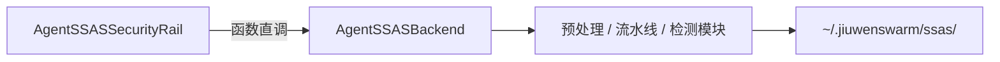
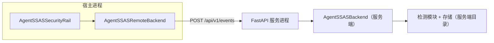

# 架构原理

本文解释 AgentSSAS 的总体架构、双子系统的职责边界、双运行模式的数据流，以及若干关键设计决策背后的动机。目标是回答"为什么这样设计"，而不是"怎么用"。

## 一张图看整体

AgentSSAS 由两个子系统组成：负责**事件采集**的 AgentSSASClient 与负责**威胁检测**的 AgentSSASCore。前者（核心类 `AgentSSASSecurityRail`）以 Rail 形式插桩在 JiuwenSwarm（openJiuwen 智能体运行时）进程内，后者是一个通用的分析引擎。

```mermaid
graph TB
    subgraph JiuwenSwarm["JiuwenSwarm 进程（Agent 运行时）"]
        A["DeepAgent / ReActAgent<br/>（事件源）"]
        PR["内置安全 Rail<br/>PermissionInterruptRail (priority=90)<br/>SafetyPromptRail (priority=85)"]
        R["AgentSSASSecurityRail (priority=80)<br/>IDManager → EventBuilder → EventFilter → EventReporter"]
    end

    subgraph AgentSSASCore["AgentSSASCore（agent_ssas.core）"]
        BE["接入适配层<br/>AgentSSASBackend / AgentSSASRemoteBackend"]
        DP["数据预处理<br/>DataPreprocessor + AgentSSASPreprocessor<br/>+ EventAggregator"]
        PL["分析流水线<br/>ThreatAnalysisPipeline"]
        MM["检测模块管理器<br/>DetectionModuleManager"]
        M1["agent_moss<br/>AgentMossModeler + AgentMossAnalyzer"]
        M2["security_rail_detection<br/>BlankDataModeler + SecurityRailAnalyzer"]
        M3["test_detection（默认 disabled）"]
        ST["存储<br/>ssas_core.db / modules/*/result.db"]
        PT["呈现<br/>AgentSSASThreatLog（OCSF JSON）"]
    end

    A -->|"生命周期事件"| PR
    A -->|"生命周期事件"| R
    PR -.->|"deny 标志（ctx.extra）"| R
    R -->|"report_event(raw_event)"| BE
    BE -->|"RiskAssessment"| R
    BE --> DP
    DP --> PL
    PL --> MM
    MM --> M1
    MM --> M2
    MM --> M3
    PL --> ST
    PL --> PT
```



数据单向流动：Agent 运行时产生事件，AgentSSASSecurityRail 采集并组装为 raw_event，经接入适配层进入 AgentSSASCore，沿"预处理 → 分析流水线 → 检测模块"逐级传递，检测结果最终落盘为存储记录与威胁日志。唯一的反向数据流是 `RiskAssessment`——它是 AgentSSASCore 返回给 AgentSSASSecurityRail 的风险评估结论。

## 双子系统：职责与边界

### 为什么要拆成两个子系统

拆分的本质动机是**把"采集"与"检测"解耦**：

- **采集必须贴近运行时**。事件 ID（如 `interaction_seq`、`tool_call_seq`）必须在 JiuwenSwarm 的回调上下文（`AgentCallbackContext`）中维护，离开这个进程就拿不到准确的事件顺序了。所以采集层必须以 Rail 形式运行在 Agent 进程内。
- **检测应该独立于运行时**。威胁检测引擎（行为建模、规则分析、PDG 图）是纯计算逻辑，与具体的智能体框架无关。如果检测代码和采集代码纠缠在一起，每次扩展检测能力都要改动运行时侧代码，还要重新验证对主流程的影响。

因此边界被划在 `AgentSSASBackendProtocol.report_event(raw_event) -> RiskAssessment` 这一个接口上（`src/agent_ssas/core/framework/access_adapter/protocol.py`）：

- AgentSSASSecurityRail 只做三件事：维护事件序号、组装三层结构的 raw_event、调用后端上报。
- AgentSSASCore 只做一件事：消费 raw_event，产出 RiskAssessment。
- 两侧唯一的共享数据契约是 raw_event 格式与 RiskAssessment 格式，其余互不感知。

### 为什么 AgentSSASCore 不依赖 jiuwenswarm

`agent-ssas` 包的 `pyproject.toml` 中依赖只有 `pyyaml`（HTTP 模式的 fastapi/httpx 是 optional-dependencies）。这不是疏忽，而是刻意的分层：

- AgentSSASCore 的输入是"三层结构的 dict"，而不是 jiuwenswarm 的类型。它完全可以对接任何能组装出这种格式的上报源（`DataPreprocessor` 按 `common.source` 选择解析器，就是为多上报源预留的扩展点）。
- 检测模块、流水线、存储、呈现全部工作在引擎内部数据结构（`UnifiedEvent`、`EventNode`）上，与 openjiuwen 的类型体系无关。

反方向看，**依赖是单向的**：jiuwenswarm 依赖 agent-ssas（并负责 try/except 导入与 Rail 注册），agent-ssas 不依赖 openjiuwen 和 jiuwenswarm。这带来一个直接好处——AgentSSASCore 可以脱离 JiuwenSwarm 独立开发与测试（用虚拟事件驱动），也可以在未来服务其他智能体框架。

### 插桩代码的例外

唯一的例外是 `agent_ssas/backend_client/openjiuwen/` 目录。这部分代码（`AgentSSASSecurityRail` 子类、`ExtendedSecurityCheckContext`、`IDManager` 等）确实 import 了 `openjiuwen` 的类型（`BaseSecurityRail`、`SecurityDecision` 等），因为它必须以 Rail 的身份运行在 jiuwenswarm 进程内。但由于 agent-ssas 不声明对 openjiuwen 的依赖，这段插桩只有在 jiuwenswarm 运行时（它同时依赖两者）才会被加载；对接其他智能体时，这目录不会被导入，agent-ssas 核心照常工作。

一句话总结：**agent-ssas 包不依赖 openjiuwen，只有 AgentSSASSecurityRail 插桩代码运行在 jiuwenswarm 进程内**。

## 双运行模式：同一协议的两种实现

AgentSSASConfig.mode 决定 `report_event` 背后发生什么，但 AgentSSASSecurityRail 完全无感知——它持有的只是一个 `AgentSSASBackendProtocol`。

### inprocess（进程内模式，默认）



`AgentSSASBackend` 直接持有预处理、流水线、模块管理器、存储的实例，`report_event` 就是一次普通的 async 方法调用，零网络延迟，检测与 Agent 运行时共享同一事件循环。存储落在本地 `~/.jiuwenswarm/ssas/`（按 `SSAS_HOME → JIUWENSWARM_DATA_DIR → JIUWENSWARM_HOME → ~/.jiuwenswarm` 顺序解析根目录）。

### http（HTTP 服务模式）



`AgentSSASRemoteBackend` 把 `report_event` 翻译为一次 HTTP POST（httpx 异步客户端），服务端是独立运行的 FastAPI 进程，内部同样是 `AgentSSASBackend`。数据流的差异只有两点：

1. **跨进程边界**：事件序列化走网络，多一次 HTTP 往返延迟；检测模块在服务端初始化，宿主侧 `initialize()` 是空实现。
2. **存储位置**：数据落在服务端目录，多个 Agent 可以共享同一个 SSAS 服务，实现集中式安全态势感知。

两种模式对 Rail 透明的原因在于接口契约只约定了输入输出（raw_event 进、RiskAssessment 出），没有约定传输方式。这也是"单一接口 + Protocol 结构化类型"的设计收益：换实现不需要改调用方。

## 关键设计决策

### 1. fail-open：安全组件自身不能成为故障点

SSAS 是"伴随式"安全系统——它的定位是态势感知，而不是关键路径上的守门员。因此整个链路上每一层都有 fail-open 兜底：

| 故障点 | 兜底行为 | 代码位置 |
|--------|---------|---------|
| 事件上报失败（Rail 侧） | 捕获异常，返回 `SecurityAllow()` | `event_reporter.py` 的 `EventReporter.report` |
| HTTP 网络异常/超时 | 返回 `RiskAssessment(risk_level=SAFE)` | `agent_remote_backend.py` |
| 引擎内部异常（预处理失败、非法事件等） | `report_event` 整体 try/except，返回无风险 | `agent_backend.py` 的 `report_event` |
| 单个检测模块建模/分析异常 | 跳过该模块，不影响其他模块 | `pipeline.py` 的 `_run_module_pipeline` |
| 存储/呈现失败 | 记录日志继续，不影响检测与返回 | `pipeline.py`、`agent_backend.py` |
| auth 模式检测超时 | 按模块 `auth_timeout_policy` 生成默认报告 | `pipeline.py` 的 `_make_timeout_report` |

设计权衡：fail-open 意味着 SSAS 故障时威胁会"漏检"，但保证了**安全感知系统的故障不会拖垮业务**。这与 observe_only 默认策略（见下）一脉相承——先把"看得见"做稳，再谈"拦得住"。真正的拦截决策仍由 jiuwenswarm 已有的安全 Rail 负责。

### 2. observe_only 默认：避免二次阻断

AgentSSASSecurityRail 收到 `RiskAssessment` 后按 `decision_policies.yaml` 的策略表映射为 agent-core 的 `SecurityDecision`：

- **observe_only（默认）**：所有风险等级全部映射为 `allow`。SSAS 只感知、不干预。
- **active_protection**：`critical → reject`，`high/medium/low → alert`，`safe → allow`。

默认选择 observe_only 的动机：jiuwenswarm 已经有 PermissionInterruptRail（priority=90）等安全机制在做实际阻断。如果 SSAS 默认也参与阻断，同一个工具调用可能被两套系统先后拦截，产生重复告警甚至相互矛盾的决策。让 SSAS 默认退到观察者位置，等用户显式配置 `ssas.decision_policy: active_protection` 再介入决策，是更稳妥的渐进路径。

### 3. priority=80：排在其他安全 Rail 之后

Rail 按 priority 降序执行，数值越大越先执行。AgentSSASSecurityRail 设为 80，低于 PermissionInterruptRail（90）和 SafetyPromptRail（85）。

这个排序不是随便选的。排在后面的 Rail 能观察到前面 Rail 的决策副作用——PermissionInterruptRail 拒绝某次工具调用时会在 `ctx.extra["_skip_tool"]` 设置标志，AgentSSASSecurityRail 随后执行时读到这个标志，就把该事件的 `event_type` 改写为 `permission_interrupt_tool`、`event_class` 置为 `security`，组装成"安全检测衍生事件"上报。换言之，**其他 Rail 的阻断决策成为 SSAS 的二次分析输入**——被内置 Rail 拦下的可疑行为，会被 SSAS 记录并与行为链上下文关联，纳入长期态势。

### 4. 采集侧不裁剪，消费侧按需处理

AgentSSASSecurityRail 采集所有可获得的数据（完整消息列表、工具参数、结果），不在采集侧做裁剪；裁剪放到 AgentSSASCore 侧。理由是采集侧代码运行在 Agent 进程内、迭代成本高（要考虑对主流程的影响），而分析侧迭代快、可独立测试。宁可多采，不可漏采。

### 5. 插件化引擎：模块即"建模 + 分析"插件对

AgentSSASCore 采用"框架 + 插件"架构。每个检测模块由一个 `module.yaml` 声明，包含恰好一对插件：

- **data_modeling 插件**（`DataModelerPlugin` 协议）：输入事件描述，输出建模数据，用 `model_type` 标识数据类型；
- **threat_analysis 插件**（`ThreatAnalyzerPlugin` 协议）：输入建模数据（要求 `expected_model_type` 与前者匹配），输出威胁分析报告。

内置 3 个模块：

| 模块 | 订阅事件 | 建模插件 | 分析插件 | 默认状态 |
|------|---------|---------|---------|---------|
| `agent_moss` | 6 个生命周期事件 | AgentMossModeler | AgentMossAnalyzer | enabled |
| `security_rail_detection` | `permission_interrupt_tool` | BlankDataModeler | SecurityRailAnalyzer | enabled |
| `test_detection` | `*`（全部事件） | BlankDataModeler | BlankThreatAnalyzer | disabled |

模块管理器在初始化时扫描 `detection_modules/` 目录、动态导入插件、按 `subscribed_events` 构建订阅表。新增一种检测能力 = 新增一个目录 + 一对插件，框架代码零改动。`test_detection` 默认 disabled（可通过 `ssas.modules.test_detection.enabled: true` 打开），它用空白插件打通全链路，是框架的自检工具。

## 存储布局

所有产物集中在存储根目录（默认 `~/.jiuwenswarm/ssas/`）：

```
<ssas_home>/ssas/
├── ssas_core.db                    # 核心库：raw_events / events / alerts 表（告警统一落此库）
├── modules/
│   └── <module_name>/
│       ├── process.db              # 模块过程数据
│       └── result.db               # 模块威胁分析报告（含无风险报告）
└── reports/
    └── threat_log/
        └── threat_{trace_id}_{module_name}_{YYYYMMDD_HHMMSS_mmm}.json   # OCSF Detection Finding 格式
```

三类存储对应三种消费者：`ssas_core.db` 面向事件回放与查询，`result.db` 面向模块级结果分析，OCSF JSON 面向标准化日志管道（OCSF 是开放网络安全 schema，方便与外部 SIEM 对接）。

有风险的检测报告由 ThreatAnalysisPipeline 统一写入主库 `ssas_core.db` 的 alerts 表（notify 后台任务与 auth 同步路径均覆盖）。`alert_id` 格式为 `{event_id}_{module_name}`，告警记录含 `module_name` 字段，可追溯产生告警的检测模块。各模块的 `result.db` 则保存该模块的全部威胁分析报告（含无风险报告）。

## 小结

AgentSSAS 的架构可以概括为四条主线：**采集与检测解耦**（单一 Protocol 接口划界）、**引擎与框架解耦**（agent-ssas 不依赖 openjiuwen）、**传输与协议解耦**（inprocess/http 同一接口）、**安全与业务解耦**（fail-open + observe_only 默认）。理解了这四个"解耦"，其余设计基本都是它们的推论。

## 延伸阅读

- [事件模型](./event-model.md)：三层结构与 14 个关联字段的设计语义
- [检测流水线原理](./detection-pipeline.md)：一次 `report_event` 的完整旅程
- [整体架构设计文档](../../../design/AgentSSAS_01_整体架构设计文档.md)：跨仓接口契约与实施规划的完整定义
- [AgentSSASCore 功能设计文档](../../../design/AgentSSAS_03_AgentSSASCore功能设计文档.md)：引擎内部模块规格
- [AgentSSASClient 功能设计文档](../../../design/AgentSSAS_02_AgentSSASClient功能设计文档.md)：采集侧模块设计与 agent-core Rail 机制背景
- [进程内快速开始示例](../../../examples/inprocess_quickstart/)
- [HTTP 服务模式示例](../../../examples/http_server_demo/)
