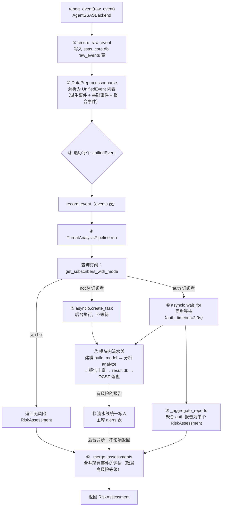

# 检测流水线原理

本文跟踪一次 `report_event` 调用的完整旅程——从 AgentSSASSecurityRail 提交 raw_event 开始，到 `RiskAssessment` 返回、威胁日志落盘为止。所有步骤与聚合策略均以源码实际实现为准（`src/agent_ssas/core/framework/` 下的 `agent_backend.py`、`pipeline.py`、`preprocessor.py`、`manager.py`）。

## 全景图

## 逐步分解

### 第 1 步：raw_event 持久化

`report_event` 的第一件事是把 raw_event 原样写入 `ssas_core.db` 的 raw_events 表。这一步放在所有处理之前，是刻意为之：**原始事件是不可再生资源**，后续任何环节（解析、聚合、检测）都可能失败或演化，但只要 raw_event 落了盘，就能事后回放与审计。持久化失败只记日志、不阻断后续流程。

### 第 2 步：数据预处理——一个 raw_event 变成一串 UnifiedEvent

`DataPreprocessor.parse` 按 `common.source` 选择解析器（默认 `AgentSSASPreprocessor`），返回的是一个**列表**而非单个事件。原因有三：

1. **派生事件**：首次遇到某 session 自动生成 `session_start`；首次进入某 interaction 且首事件不是 `invoke_start` 时自动生成 `user_input`。它们补全行为图结构。
2. **基础事件**：raw_event 本身解析出的 UnifiedEvent。
3. **聚合事件**：基础事件入聚合栈后，若它是结束事件（`tool_output` / `llm_output` / `invoke_end`），聚合器从栈中弹出相关事件合并为 `one_toolcall_event` / `one_llmcall_event` / `one_interaction_event`。例如 `tool_output` 到达时，栈中同 `tool_call_seq` 的 `tool_input` 被弹出，两次事件合并为一次带完整输入输出的"工具调用事件"。

聚合的意义是**给检测模块两种观察粒度**：订阅 `tool_input` 看每次调用的触发瞬间，订阅 `one_toolcall_event` 看每次调用的完整输入输出。模块管理器会把聚合事件订阅展开为基础事件订阅（见第 4 步），栈中留下的基础事件保证两种订阅都能收到数据。

### 第 3 步：逐事件进入流水线

接入适配层遍历 UnifiedEvent 列表，对每个事件依次执行：

- 写入 `ssas_core.db` events 表（失败不阻断）；
- 调用 `ThreatAnalysisPipeline.run(unified)` 得到一个 `RiskAssessment`。

告警写入不发生在这一层——有风险的报告由流水线统一写入主库 alerts 表（见第 4 步），从而同时覆盖 notify 后台任务与 auth 同步路径。

注意这一层引入了**两层聚合中的第二层**（事件间聚合）：一个 raw_event 产出的事件列表各自跑完流水线后，`_merge_assessments` 把多个 `RiskAssessment` 合并成一个返回给调用方（详见下文"聚合策略"）。

### 第 4 步：订阅查询与分发

流水线从事件中取出 `event_type`，调用 `module_manager.get_subscribers_with_mode(event_type)` 查询订阅表。订阅表的构建规则：

- `module.yaml` 的 `subscribed_events` 中每项是 `event_type[:mode]` 形式，如 `"tool_input"`（notify 模式）或 `"tool_input:auth"`（auth 模式）；
- **聚合事件订阅会展开**：订阅 `one_toolcall_event` 会注册对 `tool_input`（notify）和 `tool_output`（继承声明的模式）的订阅——auth 模式作用在结束事件上，起始事件始终 notify；
- 通配符 `"*"` 订阅所有事件（模式恒为 notify），`test_detection` 用它实现全事件自检；
- 同一模块对同一事件只保留一条订阅（去重保序）。

无订阅者时直接返回无风险 `RiskAssessment`，避免无效遍历。

### 第 5 步：模块内流水线——建模、分析、存储、呈现

对每个订阅模块（无论 notify 还是 auth），执行的是同一条模块内流水线（`_run_module_pipeline`）：

1. **数据建模**：`module.modeler.build_model(event_desc)`。event_desc 是 UnifiedEvent 序列化的事件描述（含 `event_node`、`aux_ids`、`trace`、`event_id`）。建模插件把它转换为自己领域的数据模型，如 `AgentMossModeler` 把 SSAS 事件映射为 AgentMoss 运行时事件。建模异常则跳过该模块（返回 None）。
2. **威胁分析**：`module.analyzer.analyze(model_data)`。分析插件消费建模数据，输出威胁分析报告 dict。插件间通过 `model_type` / `expected_model_type` 配对（如 agent_moss 的两侧都是 `"agent_behavior_model"`）。分析异常同样跳过该模块。
3. **报告丰富**：流水线向报告注入 `aux_ids`、`event_node`、`module_name`（插件未提供时）、`recommended_actions`（默认空列表）、`analytic_type_id`（module.yaml 顶层声明，供 OCSF 构建使用）。这些注入让"最小实现的分析插件"产出的报告也能正确溯源和呈现。
4. **存储**：报告写入该模块的 `modules/<name>/result.db`。失败只记日志——存储是结果留档，不是检测的前置条件。
5. **呈现**：`AgentSSASThreatLog.render(report)` 构建完整的 OCSF Detection Finding 格式报告，落盘为 `<storage_path>/reports/threat_log/threat_{trace_id}_{module_name}_{YYYYMMDD_HHMMSS_mmm}.json`（本地时区可读时间，含毫秒防同秒覆盖）。失败同样不阻断。

模块内每一步的异常都被局部捕获：**单个模块的任何故障只影响它自己**，不会波及其他模块，更不会影响主流程返回。

### 告警落库：由流水线统一写入主库

有风险的报告（`has_risk` 为真且风险等级高于 safe）由 `ThreatAnalysisPipeline._write_alerts` 统一写入主库 `ssas_core.db` 的 alerts 表：

- **两条路径均覆盖**：notify 订阅者的后台任务完成后写入；auth 订阅者的同步路径在聚合前写入。全 notify 订阅下 `report_event` 仍立即返回无风险结果（不阻塞 Agent），告警在后台落库。
- **alert_id 格式**为 `{event_id}_{module_name}`，同一事件的多个模块告警互不覆盖；告警记录含 `module_name` 字段，可追溯产生告警的检测模块。
- 告警落库失败仅记日志，不影响检测与聚合流程（与 fail-open 策略一致）。

## notify 与 auth：两种订阅模式的执行语义

订阅模式决定模块的检测时机与 `report_event` 的返回行为：

| 维度 | notify 模式 | auth 模式 |
|------|------------|-----------|
| 执行方式 | `asyncio.create_task` 后台异步 | `await asyncio.wait_for(..., timeout=auth_timeout)` 同步等待 |
| report_event 是否等待 | 不等待，立即返回 | 等待所有 auth 模块完成（或超时） |
| 返回值语义 | 全 notify 时返回无风险 RiskAssessment（检测结果仅供事后审计） | 聚合 auth 报告后的 RiskAssessment，参与调用方决策 |
| 典型用途 | 态势感知、行为建模、日志 | 在工具执行前给出阻断/放行意见 |
| 超时兜底 | 不适用 | 按 `auth_timeout_policy` 生成默认报告 |

几个源码层面的细节值得注意：

- **notify 任务的生命周期管理**：后台 task 的引用被保存在 `_background_tasks` 集合中防止被垃圾回收，task 完成后通过 `add_done_callback` 自动移除。这是 asyncio 的一个经典陷阱——只 create 不持引用的 task 可能被 GC 中途取消。
- **auth 超时兜底**（`AgentSSASConfig.auth_timeout` 默认 2.0 秒）：超时的 auth 模块按其 module.yaml 的 `auth_timeout_policy` 生成默认报告——`allow`（默认）产出无风险报告（`risk_level=safe`，`recommended_actions=["log"]`），`reject` 产出高风险报告（`risk_level=high`，`risk_score=75.0`，`recommended_actions=["block"]`）。也就是说**超时本身也被建模为一种检测结果**，而不是异常。
- **混合订阅**：同一事件既有 notify 又有 auth 订阅者时，notify 者后台跑、auth 者同步等，返回值只反映 auth 侧。
- **当前内置模块全部是 notify 模式**（agent_moss、security_rail_detection 的 module.yaml 均无 `:auth` 后缀），所以现阶段 `report_event` 实际总是立即返回无风险结果，检测全部在后台完成。auth 是为未来"参与决策的检测模块"预留的执行通道。

## 聚合策略详解

聚合发生在两个层面，均以 `pipeline.py` 与 `agent_backend.py` 的实现为准。

### 第一层：事件内聚合（`_aggregate_reports`，pipeline.py）

同一事件的多个 auth 模块报告聚合为单个 RiskAssessment，逐字段规则如下：

| 字段 | 聚合规则 |
|------|---------|
| `risk_level` | 取所有报告中的最高等级（safe < low < medium < high < critical）；无法识别的等级字符串回退为 safe |
| `has_risk` | 任一报告 `has_risk=True` 即为 True；且聚合后最高等级高于 safe 也强制为 True |
| `risk_type` | 取**最高风险等级报告**的值（多个报告同级时取第一个） |
| `risk_score` | 取所有报告中的最大数值 |
| `confidence` | 取最高风险等级报告的置信度 |
| `detected_threats` | 所有报告的威胁列表合并，去重保序 |
| `recommended_actions` | 所有报告的建议动作合并，去重保序；为空时默认 `["log"]` |
| `evidence` | 以模块名为 key 收录各报告的非空证据 |
| `details` | 0.1 版本聚合逻辑不填充，保持默认空 dict |

"取最高等级"是安全聚合的常见取向：多模块意见不一致时，宁可高估风险。`risk_type` 与 `confidence` 跟随最高等级报告而非另行合成，是因为这两个字段只有和具体报告绑定才有解释意义。

### 第二层：事件间合并（`_merge_assessments`，agent_backend.py）

一个 raw_event 产出的多个 UnifiedEvent（基础事件 + 派生事件 + 聚合事件）各自跑完流水线后，各事件的 RiskAssessment 再合并一次：以最高风险等级的评估为基础（`risk_level`、`risk_type`、`risk_score`、`confidence` 取自它），`detected_threats`、`recommended_actions` 合并去重保序，`evidence` 直接合并。仅有一个事件时原样返回，空列表返回无风险。

两层聚合各管一段：第一层把"多个模块对同一事件的判断"合成一个结论，第二层把"一次上报产生的多个事件"的结论合成最终返回值。调用方（AgentSSASSecurityRail）只看到最终这一个 RiskAssessment。

## 结果去向

一次成功（或失败）的流水线运行，结果有四条去向：

1. **返回调用方**：RiskAssessment 经接入适配层返回 AgentSSASSecurityRail，由其按 `decision_policies.yaml` 映射为 SecurityDecision（observe_only 默认全部放行；active_protection 下 critical → reject、high/medium/low → alert、safe → allow）。这一映射的动机见[架构原理](./architecture.md)。
2. **模块结果库**：每个模块的威胁分析报告写入 `~/.jiuwenswarm/ssas/modules/<module>/result.db`，供模块级的结果查询与统计。
3. **OCSF 威胁日志**：呈现插件把简化报告构建为完整的 OCSF Detection Finding JSON，落盘到 `reports/threat_log/`。文件名含 trace_id、模块名与本地时区可读时间（含毫秒），天然避免覆盖。OCSF 是标准化 schema，方便对接外部安全分析管道。
4. **告警表**：有风险的报告（而非仅事件级聚合评估）由 ThreatAnalysisPipeline 统一写入 `ssas_core.db` 的 alerts 表，notify 后台任务与 auth 同步路径均覆盖。`alert_id` 格式为 `{event_id}_{module_name}`，记录含 `module_name` 字段可追溯来源模块，为未来的实时告警端点预留数据。

## fail-open 在流水线中的位置

流水线的每个可能故障点都有局部兜底（引用自源码注释与实现）：

- raw_event 持久化失败 → 记日志继续；
- 单事件持久化失败 → 记日志继续；
- 建模/分析失败 → 跳过该模块；
- 存储/呈现失败 → 返回已产出的报告；
- `report_event` 整体异常（如 raw_event 非法、预处理抛 ValueError）→ 返回无风险 RiskAssessment（`risk_level=SAFE`）。

这意味着**流水线永远不会向调用方抛异常**——最坏情况是"没检测出风险"，而不是"阻断业务"。

## 延伸阅读

- [架构原理](./architecture.md)：双子系统、双运行模式与关键设计决策
- [事件模型](./event-model.md)：raw_event 三层结构与关联字段的语义
- [AgentSSASCore 功能设计文档](../../../design/AgentSSAS_03_AgentSSASCore功能设计文档.md)：流水线模块（五bis 章）、聚合策略（7.10 节）与检测模块管理器（五ter 章）的完整规格
- [整体架构设计文档](../../../design/AgentSSAS_01_整体架构设计文档.md)：RiskAssessment 字段定义与 fail-open 原则
- [进程内快速开始示例](../../../examples/inprocess_quickstart/)
