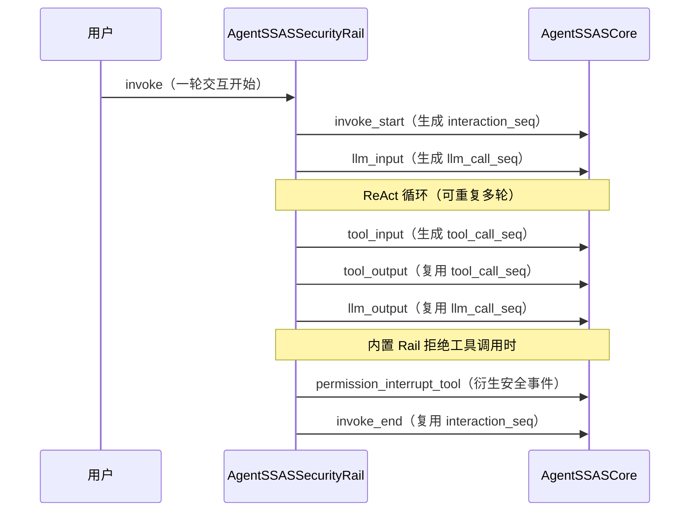

# 事件模型

事件是 AgentSSAS 的一等公民：采集侧的一切工作都是为了把 Agent 运行时的行为变成一条条结构化事件，检测侧的一切分析都建立在这些事件的关联关系之上。本文解释事件模型的设计——三层结构是什么、14 个关联字段如何支撑事件流重建、7 个事件如何构成一次完整交互，以及 AgentMoss 如何逐条消费这些事件增量构建行为模型。

## 为什么是三层结构

AgentSSASSecurityRail 上报的每个 raw_event 都是一个三层 dict：

```json
{
    "common":   { "source": "AgentSSASSecurityRail", "event_type": "tool_input", "event_class": "lifecycle", "...": "..." },
    "payload":  { "content": {"tool_args": {"command": "ls -la"}}, "tool_name": "bash", "tool_call_id": "call_abc123" },
    "metadata": { }
}
```

三层各司其职，分层的原因在于**三类信息的变更节奏完全不同**：

| 层 | 内容 | 谁消费 | 变更节奏 |
|----|------|--------|---------|
| **common** | 事件身份与关联字段：谁报的、什么类型、何时发生、属于哪次交互/调用 | 预处理器的路由与关联逻辑、检测模块的溯源 | 高度稳定，是跨仓契约的核心 |
| **payload** | 事件业务数据：按 `event_type` 变化的内容字段 | 各检测模块按需取用 | 随事件类型扩展 |
| **metadata** | 自由 KV 扩展字段，默认空 dict | 未来版本追加信息 | 完全开放 |

关键洞察是：**检测模块要回答"这次行为危险吗"，前提是先能回答"这次行为发生在哪、属于谁、跟哪些行为相邻"**。前者靠 payload，后者靠 common。把关联字段从业务内容中剥离出来放进 common，意味着：

1. 预处理器（`AgentSSASPreprocessor`）可以只看 common 层就完成事件分类、node_id 生成和结构挂接，不需要理解每种事件的业务字段；
2. `common.source` 字段让引擎可以按上报源选择解析器——这是"AgentSSASCore 未来对接其他智能体框架"的扩展点；
3. payload 可以随事件类型自由扩展（新增事件类型只需定义新的 content 字段），不会污染关联逻辑。

## common 的 14 个关联字段：一张事件流重建的坐标系

common 层共 14 个字段，可以分成三组理解：**身份组**（source、event_type、event_class、timestamp）、**层级 ID 组**（session_id、conversation_id、agent_id、trace_id、context_id、interaction_seq）、**调用序号组**（llm_call_seq、tool_call_seq、tool_call_id、subsession_id）。

### 层级 ID：从会话到工具调用的四级坐标

这些字段构成一个分层关联模型，用于把离散事件还原成完整行为链路：

```
trace_id（链路追踪，贯穿整个任务）
└── session_id（会话；conversation_id 是它在 agent-core 中的别名）
    ├── agent_id（Agent 身份，区分同一会话中的多个智能体）
    └── interaction_seq（交互轮次，组内自增序号，从 0 开始）
        ├── llm_call_seq（轮内 LLM 调用序号，从 0 开始）
        │   ├── tool_call_seq（该 LLM 调用内的工具调用序号，从 0 开始）
        │   │   └── tool_call_id（LLM provider 透传的原始调用 ID，仅溯源用）
        │   └── ...（ReAct 循环中一次 invoke 可能有多次 LLM 调用）
        └── ...
```

三组序号的语义要点：

- **interaction_seq**：交互轮次序号。agent-core 框架不提供 invoke 级别的 ID，SSAS 用 `session_id + agent_id + conversation_id` 确定一个"组"，组内自增。BEFORE_INVOKE 时先自增再使用（初始值 -1，首个事件为 0），同一次 invoke 内的后续事件全部复用。
- **llm_call_seq**：区分同一交互内的多次 LLM 调用（ReAct 循环）。BEFORE_MODEL_CALL 时先自增再使用，AFTER_MODEL_CALL 复用。**工具事件中的 llm_call_seq 是"该工具调用属于哪次 LLM 调用"**——这一个字段就足以还原"工具调用是哪次模型输出触发"的链路。
- **tool_call_seq**：SSAS 自维护的工具调用序号，BEFORE_TOOL_CALL 时先自增再使用，AFTER_TOOL_CALL 复用。**它存在的唯一原因是 tool_call_id 不可靠**（见下）。

### tool_call_id 与 tool_call_seq：为什么需要两个工具标识

`tool_call_id` 是 LLM provider 原样透传的字符串（OpenAI 的 `call_xxx`、Anthropic 的 `toolu_xxx`）。它的问题是：格式由外部 provider 决定、不同 provider 格式不同、**可能为空字符串**。一个可能为空的字符串不能作为关联键。

所以 SSAS 的策略是双轨并行：common 层同时保留原始 `tool_call_id`（供人工溯源、与外部日志对照）和自维护的 `tool_call_seq`（int，保证非空、单调）。同一工具调用的 `tool_input` 与 `tool_output` 通过相同的 `tool_call_seq` 配对——这也是聚合器把两次事件合并为"一次完整工具调用"的依据。

### subsession_id 与 context_id：两个特殊字段

- **subsession_id**：子 Agent 场景下，子 Agent 事件的 `subsession_id` 填父会话的 `parent_session_id`，`session_id` 用自己的。两个 ID 配合可还原"子 Agent 属于哪个父会话"的层级关系。非子 Agent 场景为空字符串。
- **context_id**：模型对话上下文标识。ModelContext 在 invoke 开始后才创建，所以 invoke 级事件的 context_id 可能为空字符串，invoke 内部事件（模型调用、工具调用）才可靠。事件模型不对它做关联承诺。

### 一个被刻意压低的复杂度

注意这些序号全是**简单的 int 自增**，没有用 UUID 或时间戳。原因是：事件关联需要的是"组内唯一且有序"，自增序号同时提供这两者，还天然编码了顺序信息（`tool_call_seq=3` 一定晚于 `tool_call_seq=2`）。时间戳存在（common.timestamp），但只用于展示和耗时统计，不参与关联——时钟可能回拨、乱序，序号不会。

## 7 个事件：一次完整交互的形状

0.1 版本 SSAS 采集 6 个生命周期事件 + 1 个安全检测衍生事件：



用 BNF 风格描述：

```
interaction := invoke_start
               ( llm_input ( tool_input tool_output )* llm_output )*
               invoke_end
```

- 6 个生命周期事件来自 agent-core 的 6 个管线事件（BEFORE/AFTER_INVOKE、BEFORE/AFTER_MODEL_CALL、BEFORE/AFTER_TOOL_CALL），本身**没有安全语义**——它们只是行为痕迹；
- `permission_interrupt_tool` 是**安全检测衍生事件**（`event_class="security"`）：当 PermissionInterruptRail 把某次工具调用裁决为 DENY 时，AgentSSASSecurityRail 观察到 deny 标志，将原本的 `tool_input` 改写为 `permission_interrupt_tool` 上报。它的 payload 同时携带原始行为信息（tool_args、tool_name）和安全检查结果（risk_source、risk_type、risk_level、decision、evidence）。

衍生事件的定位值得强调：**其他 Rail 的阻断决策，是 SSAS 的二次分析输入**。`security_rail_detection` 模块订阅这个事件后并不重新检测（护栏已经检过了），而是把它规范化为威胁报告纳入呈现与存储——相当于给已有安全机制的每次拦截补上完整的行为链上下文（哪次交互、哪次 LLM 调用、前后发生了什么）。

## 事件流重建：从 raw_event 到行为图

事件模型的价值要靠消费侧兑现。`AgentSSASPreprocessor` 逐条消费 raw_event，增量构建 `Trace → Session → Interaction → EventNode` 层次结构：

1. **node_id 生成**（确定性，可从序号反推）：
   - interaction 节点：`{session_id}_{interaction_seq}_interaction`
   - llm_call 节点：`{session_id}_{interaction_seq}_llmcall_{llm_call_seq}`
   - tool_call 节点：`{session_id}_{interaction_seq}_toolcall_{tool_call_seq}`
2. **父子挂接**：tool_call/llm_call 节点的 `parent_node_id` 指向所属 interaction 节点，interaction 指向 session 节点。注意 `llm_input` 和 `llm_output` 映射到**同一个** llm_call 节点（node_id 相同），input 端填 `input_content`，output 端填 `output_content`。
3. **输入/输出内容归一**：不同事件类型的 content 字段名不同（query/messages/tool_args/response/tool_result），预处理器统一抽取为 `input_content` / `output_content` 两个通用字段，并按事件类型设定 `action_name`（工具事件为工具名，llm 事件为 `llm_call`）。检测模块因此可以用统一视角处理所有事件。
4. **派生事件**：首次遇到某 session 时自动生成 `session_start` 节点；首次进入某 interaction 且首事件不是 `invoke_start` 时自动生成 `user_input` 节点。这保证结构完整性——即使采集侧丢了首事件，行为图仍是连通的。
5. **聚合事件**：预处理器维护聚合栈，结束事件到达时把散碎的基础事件合并为聚合事件（`tool_output` 触发 `one_toolcall_event`，`llm_output` 触发 `one_llmcall_event`，`invoke_end` 触发 `one_interaction_event`）。聚合事件以 `aux_ids` 子结构携带全套关联 ID，让"订阅一次完整工具调用"与"订阅单条事件"在流水线里走同一条路。

这个设计里有个重要的工程细节：session 缓存用 LRU 管理（最多 100 个 session），长期运行时旧会话的增量结构会被淘汰，防止内存无限增长。事件流重建是"尽力而为的在线重建"，不是全量持久化后离线重放。

## AgentMoss 如何增量消费事件

`agent_moss` 模块是事件模型最重要的消费者，它订阅全部 6 个生命周期事件（均为 notify 模式），把事件映射为 AgentMoss 引擎的运行时事件后做三路分析（rule / behavior_chain / pdg）：

### 事件映射

```
invoke_start  → chat_request
llm_input     → model_call
llm_output    → model_output
invoke_end    → model_output
tool_input    → tool_call
tool_output   → tool_result
```

映射由 `event_adapter.py` 完成，它是**刻意结构化**的：只翻译事件的生命周期语义和显式关联 ID，不从自然语言内容推断依赖关系。每次建模产出两部分：`agentmoss_event`（引擎可消费的运行时事件）和 `correlation`（SSAS 关联 ID 的完整快照，供报告溯源）。

### 按会话维护有界历史

AgentMoss 的行为链和 PDG 规则是**有状态的**——判断"这个工具调用是否异常"需要知道之前发生过什么。分析器按 session 维护历史：

- 历史键为 `session:{session_id}`（缺失时回退到 `request:{trace_id}`，再缺失则 `uncorrelated:{event_id}`——最后这道兜底确保**关联字段缺失时绝不把不同 Agent 的事件混进同一个历史**）；
- 每条事件分析时，先从历史中筛出时间上早于当前事件的前驱，评估后把当前事件追加进历史；
- 历史上限 `max_history_events=200`（module.yaml 配置，代码强制下限 5），追加后截断保留最近 200 条——**有界**是为了内存可控，长期会话只保留最近的滑窗；
- 每条事件记录还会保存 `prev_event_ids`（最近 5 个前驱的 event_id），作为行为链的显式顺序证据。

### 依赖证据的保守原则

这是事件模型在检测侧最关键的落地约束：AgentMoss **只把以下内容作为 PDG 数据依赖的证据**：

- 精确指纹（内容中的 API key、私钥等敏感值的精确匹配）；
- 资源标识（`.env`、`.ssh/id_rsa` 等敏感资源路径的精确匹配）；
- 工具调用 ID（tool_call 的显式配对）;
- 显式事件顺序（同一历史内的时间戳与 event_id 排序）。

**无法证明的隐式语义流不会提升为 PDG 数据依赖**。例如"模型输出里提到某个文件名、随后工具参数里出现同一个文件名"这种语义层面的推断，引擎拒绝采信——因为内容层面的"相似"可能纯属巧合，把巧合固化为依赖边会产生误报。宁可漏报（保守），不可误报（干扰），这是态势感知系统的定位决定的。

## 小结

事件模型的设计可以归结为一句话：**用一个稳定的关联坐标系（common 的 14 个字段）承载易变的业务内容（payload）**。序号字段保证了事件流可以在线、增量地重建为行为图；三层结构保证了契约的稳定与内容的可扩展；安全检测衍生事件把"其他安全组件的决策"也纳入同一坐标系，让 SSAS 的态势感知覆盖"行为痕迹"与"拦截记录"两个维度。

## 延伸阅读

- [架构原理](./architecture.md)：双子系统如何围绕事件模型协作
- [检测流水线原理](./detection-pipeline.md)：事件进入引擎后的完整处理旅程
- [整体架构设计文档 第四章：跨仓接口设计](../../../design/AgentSSAS_01_整体架构设计文档.md)：raw_event 三层结构、14 字段与 payload 定义的完整规格
- [AgentSSASClient 功能设计文档](../../../design/AgentSSAS_02_AgentSSASClient功能设计文档.md)：ID 管理模块（IDManager）的序号生成实现
- [AgentSSASCore 功能设计文档](../../../design/AgentSSAS_03_AgentSSASCore功能设计文档.md)：UnifiedEvent 数据模型与聚合事件机制规格
