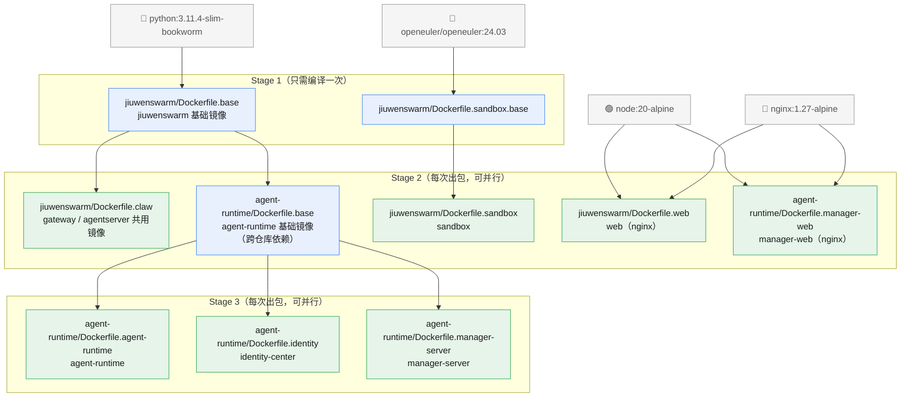

# 流水线镜像编译依赖关系

本文档说明各模块镜像的 Dockerfile 位置、基础镜像（BASE_IMAGE）来源，以及流水线中的编译顺序约束。

> 变更记录：web 与 manager-web 已改为 **Node 构建阶段 + nginx 运行阶段** 的两阶段镜像，
> 不再依赖 claw / agent-runtime 基础镜像（此前 web 基于 claw 镜像、manager-web 基于
> agent-runtime 基础镜像）。

## 一、依赖图



> 纯文本版（无 Mermaid 渲染环境时）：

```
外部基础镜像
├── python:3.11.4-slim-bookworm
│   └── jiuwenswarm/docker/Dockerfile.base ............ [jiuwenswarm 基础镜像]  ← Stage 1
│       ├── jiuwenswarm/docker/Dockerfile.claw ........ [gateway/agentserver 共用] ← Stage 2
│       └── agent-runtime/docker/Dockerfile.base ..... [agent-runtime 基础镜像] ← Stage 2（跨仓库依赖！）
│           ├── agent-runtime/docker/Dockerfile.agent-runtime  ← Stage 3
│           ├── agent-runtime/docker/Dockerfile.identity       ← Stage 3
│           └── agent-runtime/docker/Dockerfile.manager-server ← Stage 3
├── openeuler/openeuler:24.03
│   └── jiuwenswarm/docker/Dockerfile.sandbox.base     ← Stage 1
│       └── jiuwenswarm/docker/Dockerfile.sandbox ...... [sandbox] ← Stage 2
├── node:20-alpine ─┐
└── nginx:1.27-alpine┤
    ├── jiuwenswarm/docker/Dockerfile.web ............ [web，nginx 启动]  ← Stage 2（不依赖 Stage 1 产物）
    └── agent-runtime/docker/Dockerfile.manager-web .. [manager-web，nginx 启动] ← Stage 2（同上）
```

## 二、模块与 Dockerfile 对应关系

| 模块 | Dockerfile | 产物镜像用途 |
|---|---|---|
| agent-runtime | `agent-runtime/docker/Dockerfile.agent-runtime` | Agent 运行时（含 config_sync，接收 agentserver 模板下发） |
| identity-center | `agent-runtime/docker/Dockerfile.identity` | 身份认证服务 |
| manager-server | `agent-runtime/docker/Dockerfile.manager-server` | Manager 业务服务 |
| manager-web | `agent-runtime/docker/Dockerfile.manager-web` | Manager 管理端前端（**nginx 启动**，监听 5273） |
| gateway / agentserver | `jiuwenswarm/docker/Dockerfile.claw` | **同一个镜像**，两者共用；差异只在部署侧（deploy 模板的 command / securityContext） |
| web | `jiuwenswarm/docker/Dockerfile.web` | 用户面 Web（**nginx 启动**，监听 5173） |
| sandbox | `jiuwenswarm/docker/Dockerfile.sandbox` | 沙箱 |

## 三、关键点

1. **跨仓库基础镜像引用**：`agent-runtime/docker/Dockerfile.base` 以 jiuwenswarm 基础镜像（`jiuwenswarm/docker/Dockerfile.base` 的产物）作为 BASE_IMAGE。该基础镜像属于 Stage 1，只需构建一次并推送到镜像仓库，后续出包按 tag 直接引用即可；仅当后期需要升级（如系统依赖变更）时，才需要触发 Stage 1 镜像重新构建。
2. **gateway 与 agentserver 共用一个镜像**（`Dockerfile.claw` 产物），不再单独编译：
   - 旧的 `jiuwenswarm/docker/Dockerfile.gateway`、`Dockerfile.agentserver` 已废弃；
   - 启动入口为镜像内置的 `docker/start.sh`：按容器环境变量 `ROLE` 分流（`gateway` → jiuwenswarm-gateway，`agentserver` → jiuwenswarm-agentserver，未设置/其他 → 退出），ROLE 分别由 `gateway.template.env` / `agentserver.template.env` 注入。
3. **web / manager-web 均为「Node 构建 + nginx 运行」两阶段镜像，不依赖任何 Stage 1/2 产物**：
   - Stage 1（构建器）：`node:20-alpine` 内 `npm install && npm run build` 产出前端 dist；
     - web 构建源：`jiuwenswarm/channels/web/frontend`；
     - manager-web 构建源：`agent-runtime/applications/manager/manager_web`；
   - Stage 2（运行时）：`nginx:1.27-alpine`，nginx 官方镜像 entrypoint 在启动时对
     `/etc/nginx/templates/default.conf.template` 做 envsubst 渲染生效：
     - web：`jiuwenswarm/docker/web.nginx.conf.template`，语义对齐
       `jiuwenswarm/channels/web/app_web.py`（/api 分流到 Gateway Web HTTP /
       WebChannel、/ws WebSocket 升级、sub_filter 注入 index.html 运行时配置、
       SPA 子路径刷新的相对资源剥前缀兼容等）；
     - manager-web：`agent-runtime/docker/manager-web.nginx.conf.template`；
   - web 另挂载 `docker/web-optional-upstreams.sh`（`/docker-entrypoint.d/40-*`），
     按环境变量生成 `/idp`、`/manager-api` 可选自定义上游 location 片段；
   - **前端源码或 nginx 模板任一变更都需重新编译对应镜像**。
4. 所有业务 Dockerfile 均通过 `ARG` 接收上游镜像：
   - `jiuwenswarm/docker/Dockerfile.claw`、`Dockerfile.sandbox`、
     `agent-runtime/docker/Dockerfile.base`：`ARG BASE_IMAGE`（完整镜像引用，`FROM ${BASE_IMAGE}`）；
   - `agent-runtime/docker/Dockerfile.{agent-runtime,identity,manager-server}`：
     `ARG BASE_IMAGE` + `ARG IMAGE_VERSION` 两段式（`FROM ${BASE_IMAGE}:${IMAGE_VERSION}`）；
   - web / manager-web：无上游镜像参数，直接以 `node:20-alpine`、`nginx:1.27-alpine` 为外部基础镜像；
   - `Dockerfile.base`、`Dockerfile.sandbox.base`（Stage 1）固定 FROM 外部公共镜像，无上游参数。

## 四、编译顺序（流水线 Stage 划分）

| Stage | 内容 | 前置依赖 | 编译频率 |
|---|---|---|---|
| 1 | jiuwenswarm 基础镜像（`Dockerfile.base`）、sandbox.base（`Dockerfile.sandbox.base`） | 无（外部镜像） | **只需编译一次**，基础镜像内容变更时才重编 |
| 2 | claw（gateway/agentserver）、agent-runtime 基础镜像、sandbox、web、manager-web | claw / agent-runtime 基础镜像 / sandbox 依赖 Stage 1；**web、manager-web 无前置**（外部 node/nginx 镜像），可与 Stage 1 并行 | 每次出包 |
| 3 | agent-runtime、identity-center、manager-server | Stage 2 | 每次出包 |

> Stage 1 产物是稳定的基础镜像，流水线中可直接复用已有镜像（按 tag 判断是否存在，存在则跳过）；Stage 2、3 每次出包都要重新编译。web / manager-web 编排在 Stage 2 出包，且不依赖任何 Stage 1/2 产物，流水线中可最先并行启动以缩短总时长。

## 五、构建参数与国内镜像源推荐

构建期通过 `--build-arg` 传入的加速参数及其国内源推荐（amd64 / arm64 地址相同）：

**PIP_EXTRA_ARGS**（pip/uv 的索引地址，所有 Python 镜像共用；默认值 `-i https://mirrors.aliyun.com/pypi/simple/`）：

| 源 | 地址 | 说明 |
|---|---|---|
| 华为云 ⭐ | `https://repo.huaweicloud.com/repository/pypi/simple/` | 同云首选（流水线在华为云 CCE 上，内网直连） |
| 阿里云 | `https://mirrors.aliyun.com/pypi/simple/` | 最常用、稳定 |

**NPM_REGISTRY**（npm 源，web / manager-web 构建用；默认值 `https://registry.npmmirror.com`）：

| 源 | 地址 | 说明 |
|---|---|---|
| 华为云 | `https://repo.huaweicloud.com/repository/npm/` | 同云首选（流水线在华为云 CCE 上，内网直连） |
| npmmirror ⭐ | `https://registry.npmmirror.com` | 最常用、稳定 |

**VITE_PRODUCT_NAME**（仅 manager-web；产品名注入前端构建，默认值 `JiuwenSwarm`）：

| 取值 | 说明 |
|---|---|
| 按产品命名 | 需要与部署侧管理面展示名一致，变更即影响构建产物指纹，须重新出包 |


用法示例（华为云同云优化）：

```bash
docker build -f docker/Dockerfile.claw \
  --build-arg BASE_IMAGE=... \
  --build-arg PIP_EXTRA_ARGS="-i https://repo.huaweicloud.com/repository/pypi/simple/" \
  -t jiuwenclaw-core-arm64:0.1.0 .
```

> 注：NPM_REGISTRY 未显式传参时使用 Dockerfile 内默认值 npmmirror；PIP_EXTRA_ARGS 未传参时使用阿里云。同云优先级高于默认值，建议流水线按执行环境显式传入。
