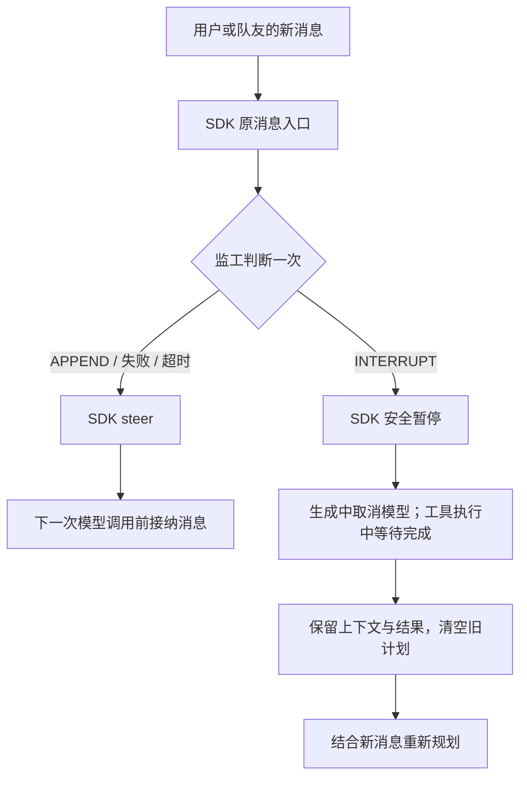

# A2A 双工监工

执行 Agent 继续处理任务。队友消息或用户补充输入到达时，监工判断一次：补充当前任务（APPEND），或打断并重新规划（INTERRUPT）。默认关闭。

例如当前计划使用 Kafka，但用户要求 Redis。监工可根据纠正消息暂停执行，清空旧计划，保留原需求和已完成结果，再重新规划。



监工请求期间，执行 Agent 继续运行；该消息的投递调用等待判断返回。消息排序和已读确认沿用 SDK。状态哈希只用于诊断，不再用于拒绝判断：等待期间接纳新消息导致哈希变化，原 INTERRUPT 仍可执行。运行状态、消息去重和用户暂停 / 停止保护仍有效。

## 配置

在“设置 → 智能体 → A2A 双工监工”中选择模式与后端。模式变更后重启团队。

设置页只显示当前监工摘要。点击编辑修改模型、地址和密钥；后端、超时及厂商参数位于“高级设置”。清除配置会关闭监工并清除共享密钥。

```yaml
duplex_router:
  mode: active
  backend: sdk
  model_name: fast-model
  timeout_seconds: 2.0
```

| 后端 | 模型与接口 |
| --- | --- |
| `sdk` | `model_name` 为当前团队模型池中的名称，沿用 SDK 模型配置 |
| `jev` | 默认 `jev-1.13.0`；支持 `systemone` / `decisions`；typed-choice 概率达到阈值才打断 |
| `mindshub` | 默认 `mindshub_air`；使用 chat completions，返回 APPEND / INTERRUPT |
| `clef` | 选择 `clef` / `clef-flash`；使用 Cloudflare Workers AI；需账号 ID 和 Token |

外部接口使用 `DUPLEX_ROUTER_API_KEY`，Clef 账号使用 `CLOUDFLARE_ACCOUNT_ID`；设置页沿用现有密钥保存流程。各后端的地址保存在 `duplex_router.<backend>.api_base`，切换后端后再修改地址。Jev / Clef 的 `interrupt_threshold` 默认 0.9，范围为大于 0.5 且不超过 1；MindsHub 不使用概率阈值。

`timeout_seconds` 限制一次判断的等待时间。失败、超时和非法响应均回到 SDK steer，不重试。内部打断保留已接纳消息及完整工具结果；已完成的外部工具效果不会回滚。用户显式暂停或停止优先，不会被内部恢复覆盖。

## 接入与验证

`duplex_shadow.py` 保留安装入口名，但仅处理当前消息，不运行后台影子任务。`duplex_native.py` 对接 SDK supervisor 的暂停和恢复；`common/duplex_router.py` 限时调用并检查结果。各厂商模块负责请求协议。接入使用 SDK 私有 hooks，升级 SDK 时需验证这些接口。

Leader 提示词同时补充全局停工规则：用户要求全部暂停时，广播暂停请求并核对成员确认；只有用户明确恢复后才重新规划。广播成功不等于执行已经停止，Leader 必须区分已发送、部分确认和全员确认。此规则不是后端强制停机。

保留核心回归测试，覆盖请求协议、阈值、错误降级、设置保存，以及真实 SDK + SQLite + 本地 HTTP 下的打断、上下文和工具结果保留、去重、生命周期与已读确认。Leader 提示词测试检查配置加载与 SDK 提示词接入。测试不依赖外部数据集，也不代表厂商线上模型能力或性能收益。

```bash
python -m pytest --no-cov -q tests/unit_tests/common/test_duplex_choice.py tests/unit_tests/common/test_duplex_jev.py tests/unit_tests/common/test_duplex_mindshub.py tests/unit_tests/common/test_duplex_settings.py tests/unit_tests/agentserver/test_duplex_shadow.py tests/integration_tests/test_duplex_e2e.py
```
