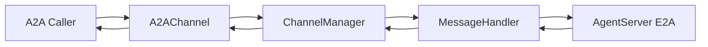

# A2A Integration Guide

This page explains the Gateway-side **A2A ingress service**: its management surface, configuration, mapping to internal `Message`/E2A, and end-to-end verification. For outbound A2A (agent calling external services), see section 7.

> **Runtime owner**: `jiuwenswarm/gateway/a2a_manager/manager.py` (`A2AManager`). **Protocol adapter**: `jiuwenswarm/gateway/channel_manager/protocol/a2a/a2a_connect.py` (`A2AChannel` + `a2a-sdk`). **Entrypoint process**: `python -m jiuwenswarm.gateway.app_gateway`. In case of mismatch, source code is the source of truth.

---

## 0. Document Location and Source of Truth

| Location | Role |
|------|------|
| **docs/en/A2A.md** (this page) | Integration and dev debugging: modules, config, mapping, verification |
| `jiuwenswarm/gateway/a2a_manager/` | Ingress config, persistence, lifecycle state machine, and management snapshots |
| `jiuwenswarm/gateway/channel_manager/protocol/a2a/a2a_connect.py` | A2A HTTP service, `AgentCard`, request/response to `Message` conversion |
| `jiuwenswarm/gateway/app_gateway.py` | Assembles `A2AManager`, registers management APIs, and starts/stops it with Gateway |
| `jiuwenswarm/gateway/message_handler/message_handler.py` | Gateway↔AgentServer E2A exchange and internal `Message` orchestration |
| `jiuwenswarm/gateway/channel_manager/channel_manager.py` | Channel registration and `robot_messages` → `Channel.send` dispatch |
| [E2A-protocol.md](E2A-protocol.md) | Inner protocol between Gateway and AgentServer |

---

## 1. Responsibility Boundary

- **Inbound (this page)**: external A2A client → `A2AChannel` → `ChannelManager` → `MessageHandler` → E2A → AgentServer; responses return through the same path, emitted as `TaskStatusUpdateEvent` / `TaskArtifactUpdateEvent` (streaming) or aggregated result (non-streaming).
- **Outbound**: Agent-side access to external A2A services (for example via A2A MCP Hub style tooling) belongs to the AgentServer adapter layer (see section 7), not `A2AChannel`.

---

## 2. Comparison with Web / ACP Channels

| Item | Web | ACP | A2A (current) |
|------|-----|-----|-------------|
| Bindings | `WEB_HOST` / `WEB_PORT` / `WEB_PATH` | `ACP_GATEWAY_*` | `A2A_SERVER_*` |
| Config source | Env + CLI (`--host`, etc.) | Env only | `.env` configuration + Web management API |
| `.env` loading | `app_gateway` calls `load_dotenv(get_env_file())`, i.e. `~/.jiuwenswarm/config/.env` | same | same |

---

## 3. Environment Variables (Gateway)

Set these in `~/.jiuwenswarm/config/.env` or process environment (read by `app_gateway.py`):

Before enabling A2A, make sure the optional dependency is installed:

```bash
pip install "jiuwenswarm[a2a]"
# or (repo/dev environment)
uv sync --extra a2a
```

| Variable | Default | Notes |
|------|------|------|
| `A2A_SERVER_ENABLED` | disabled when unset | `1` / `true` / `yes` / `on` enable it |
| `A2A_SERVER_HOST` | `127.0.0.1` | HTTP bind address; `0.0.0.0` is common for external access |
| `A2A_SERVER_PORT` | `19100` | avoid conflicts with Web/ACP ports |
| `A2A_SERVER_PATH` | `/a2a` | JSON-RPC entry path |
| `A2A_SERVER_PROTOCOL_VERSION` | `1.0.0` | written into `AgentCard.AgentInterface.protocol_version` |
| `A2A_SERVER_CARD_PATH` | `/.well-known/agent-card.json` | Agent Card path |
| `A2A_SERVER_EXTENDED_CARD_PATH` | `/agent/authenticatedExtendedCard` | Extended Card path |
| `A2A_SERVER_APP_NAME` | `JiuwenSwarm Gateway A2A Server` | Agent Card `name` |
| `A2A_SERVER_APP_DESCRIPTION` | `A2A ingress for JiuwenSwarm Gateway` | Agent Card `description` |
| `A2A_SERVER_APP_VERSION` | `0.1.0` | Agent Card `version` |
| `A2A_SERVER_EXPOSE_REASONING` | `true` (enabled by default) | when enabled, reasoning (thinking) content is emitted as working-state `TaskStatusUpdateEvent` (see §6.2); set to `false`/`0`/`no`/`off` to drop it |
| `A2A_SERVER_AUTH_TYPE` | `none` | `none` / `bearer` / `api_key` |
| `A2A_SERVER_API_KEY_HEADER` | `X-API-Key` | Dedicated API key request header |
| `A2A_SERVER_CARD_AUTH_REQUIRED` | `false` | Require authentication for the public Agent Card |
| `A2A_SERVER_API_KEY` | empty | Security credential; uses the model API Key storage encryption mechanism |

AgentServer connectivity still follows existing gateway config (for example `AGENT_SERVER_URL`) and is independent from the A2A listening endpoint.

While Gateway is running, use **More Settings → A2A Dispatch Center** in the Web UI to inspect status, save configuration, enable, disable, or reload ingress without restarting Gateway. This page currently manages inbound listening only; it does not provide external-agent discovery, outbound calls, or automatic dispatch.

When `A2A_SERVER_ENABLED=true` but `jiuwenswarm[a2a]` (or `uv sync --extra a2a`) is not installed, Gateway startup remains non-blocking; A2A channel startup failure is reported in logs with actionable install hints.

---

## 4. External Endpoints

- **JSON-RPC**: `http://{A2A_SERVER_HOST}:{A2A_SERVER_PORT}{A2A_SERVER_PATH}`
- **Agent Card**: `http://{host}:{port}/.well-known/agent-card.json` (path defined by `A2AChannelConfig.card_path`, default `/.well-known/agent-card.json`)

`AgentCard` is built in `A2AChannel.start()`: `supported_interfaces[0].url` points to the JSON-RPC endpoint above; `capabilities.streaming` and skills are defined in code.

### 4.1 Management API

Gateway Web HTTP listens on `WEB_PORT + 2` by default (`19002`). Its ingress management endpoints are:

| HTTP | Path | Purpose |
|------|------|---------|
| `GET` | `/api/v1/a2a/ingress` | Read desired config, effective listener, and runtime state |
| `GET` | `/api/v1/a2a/ingress/history` | Read ingress request history; query `limit` accepts the latest 1–200 records |
| `PATCH` | `/api/v1/a2a/ingress` | Save config; include `apply: true` to apply it immediately |
| `POST` | `/api/v1/a2a/ingress:enable` | Persist enabled state and start listening |
| `POST` | `/api/v1/a2a/ingress:disable` | Persist disabled state and stop listening |
| `POST` | `/api/v1/a2a/ingress:reload` | Rebuild the listener from persisted config |

Snapshots use `desired_*` for persisted targets and `effective_*` for the actual listener. Failures include stable error codes and display-safe summaries. Binding to `0.0.0.0` produces an exposure warning in the UI.

### 4.2 Security credentials

Under **Ingress → Security**, select Bearer Token or API Key and enter or generate a random credential. Credentials require 16–512 printable ASCII characters without spaces. Saved credentials are masked by default; use the eye icon to view or copy them, including after refreshing the page. Storage follows model API Key behavior: encrypted when a crypto provider is configured, otherwise stored as supplied. The editor retrieves credentials on demand through a dedicated WebSocket request; ordinary snapshots, HTTP GET responses, and error responses omit credentials; public Agent Cards contain neither credentials nor digests, and ingress authentication uses only a runtime digest.

- Bearer callers send `Authorization: Bearer <credential>`.
- API Key callers use the configured dedicated header, defaulting to `X-API-Key: <credential>`.
- With authentication enabled, all JSON-RPC operations (including streams, queries, and cancellation) and the extended Card require credentials. **Allow anonymous access to service information** is enabled by default; disabling it also requires authentication to view the public Agent Card. Cards advertise the authentication scheme without credentials.
- Blank input preserves the saved credential; a new value replaces it. To clear it, select **No authentication**, then check **Clear saved credential**. The default authentication method is none.
- **Save** persists and applies changes immediately, restarting a running ingress service with the new credential. **Cancel** discards unsaved edits and restores the saved configuration and credential.

This is a shared service credential, without caller identities, per-task access isolation, or OAuth login. Use an HTTPS reverse proxy to protect credentials in transit for remote deployments.

---

## 5. Data Flow (Overview)



Inbound A2A `message.parts` are mapped into internal `Message.params.query` and optional `files`; no dedicated `params["a2a"]` extension object is written. Outbound internal `Message.payload` is mapped to A2A `Part` list (including multimodal parts and textified tool events).

---

## 6. Field Mapping Summary

### 6.1 Request (A2A → `Message`)

| A2A / context | Internal |
|--------------|------|
| `task_id` or generated value | `Message.id` (used to correlate replies) |
| `context_id` | `Message.session_id` |
| `parts[].text` | merged into `params.query` |
| non-text parts (`url` / `data` / `raw`) | `params.files[]` (includes web-compatible redundant keys) |
| metadata | `Message.metadata` |

### 6.2 Response (`Message` → A2A)

| Internal | A2A |
|------|-----|
| `payload.content`, tool-related events, etc. | `Part(text=...)`, etc., written into the `response` artifact |
| `payload.files[]` | `Part` url / data / raw fields |
| reasoning content (`chat.reasoning`, or `chat.delta` with `source_chunk_type == "llm_reasoning"`) | see below |

**Separating reasoning from the answer**: reasoning content never enters the `response` artifact. By default (`A2A_SERVER_EXPOSE_REASONING` enabled) it is emitted as working-state `TaskStatusUpdateEvent`s whose `status.message.parts[].metadata` carries `{"jiuwen_thought": true}` (mirroring Google ADK's `adk_thought` convention), so callers can structurally render or ignore it. Set to `false`/`0`/`no`/`off` to drop it.

---

## 7. Outbound A2A (Agent Side)

- This repository currently does not include a dedicated A2A MCP Hub registration module. If/when that capability is restored, follow the actual wiring code and environment variable definitions.

---

## 8. End-to-End Verification

[`demo/a2a_ingress_e2e.py`](../../demo/a2a_ingress_e2e.py) at the repository root uses a live Gateway, AgentServer, and the official `a2a-sdk` to verify hot enable/disable, reload onto a different port, Agent Card updates, `SendMessage`, and `SendStreamingMessage`. Start the complete backend, then run from the repository root:

```powershell
.\.venv\Scripts\python.exe .\demo\a2a_ingress_e2e.py `
  --jsonl .\demo\a2a_ingress_e2e_result.jsonl
```

The script restores the pre-run A2A configuration on exit. See [`demo/README.md`](../../demo/README.md) for multi-instance ports, overrides, and JSONL evidence details.

---

## 9. Known Extension Points

- Authentication, rate limit, timeout, and observability metrics are better enforced by gateway or upstream proxy, while keeping `A2AChannel` focused on protocol/message mapping.
- If `jiuwenswarm/resources/.env.template` does not include A2A/ACP keys, append them manually in local `.env` (consistent with section 2).
