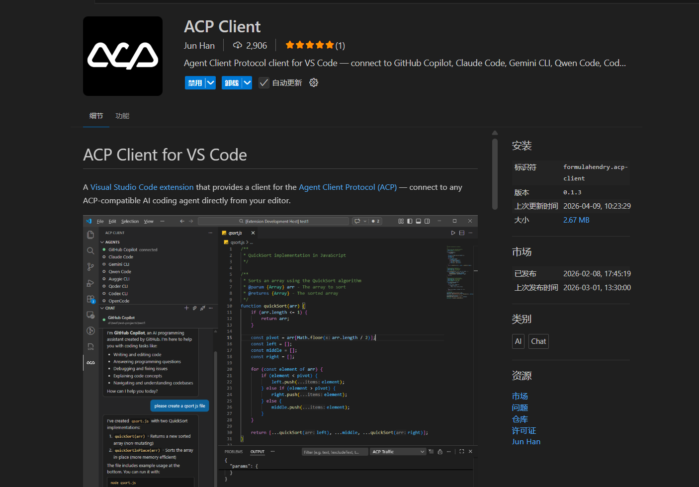
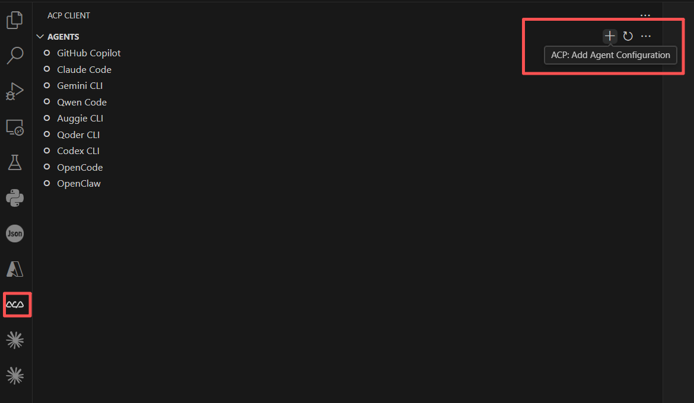

# Quick Start

JiuwenSwarm speaks the [Agent Client Protocol (ACP)](https://agentclientprotocol.com/) and can be used from any ACP-capable editor: VS Code, Zed, Neovim, and others.
Pre-installation Preparation
- Environment Dependencies:
  - Complete the installation of JiuwenSwarm
  - Configure the model in the web UI: Settings → Configuration → Model Configuration

**Note: Users may complete installation and configuration based on their actual needs using the following methods.**

# VS Code ACP Client Setup (Source Code)

For users who cloned the repository.

1. Install the ACP Client extension from the marketplace. Search for `formulahendry.acp-client` and install it.



2. In the extension, click the `+` button (`ACP: Add Agent Configuration`).



3. For `Name`, enter: `jiuwenswarm`.
4. For `Command`:
   - Windows: enter the absolute path to `<repo>/scripts/run_gateway_acp.cmd`
   - Linux / macOS: enter the absolute path to `<repo>/scripts/run_gateway_acp.sh`
5. Leave `Config / Arguments` empty.
6. Start the main process in the terminal first: `python -m jiuwenswarm.app`
7. Connect to `jiuwenswarm` in the extension, then chat in the window.

> Note: The scripts use the `.venv` under the project root by default.

# VS Code ACP Client Setup (pip install / Wheel)

For users who installed JiuwenSwarm via `pip install jiuwenswarm`.

1. Install the ACP Client extension from the marketplace. Search for `formulahendry.acp-client` and install it.
2. In the extension, click the `+` button (`ACP: Add Agent Configuration`).
3. For `Name`, enter: `jiuwenswarm`.
4. For `Command`, enter: `jiuwenswarm-acp`
5. Leave `Config / Arguments` empty.
6. Start the main process in the terminal first: `python -m jiuwenswarm.app`
7. Connect to `jiuwenswarm` in the extension, then chat in the window.

> Note: `jiuwenswarm-acp` is a command-line entry point auto-generated by pip install, just like `jiuwenswarm-init` and `jiuwenswarm-start`. Make sure VS Code is running in the same virtual environment where jiuwenswarm is installed. If not, provide the full path instead, e.g. `C:\path\to\venv\Scripts\jiuwenswarm-acp.exe` on Windows, or `/path/to/venv/bin/jiuwenswarm-acp` on Linux/macOS.

# Zed Setup

Zed has built-in ACP support (External Agents).

1. Start the main process first: `python -m jiuwenswarm.app`
2. Add the agent to Zed's `settings.json` (or via Agent Settings → External Agents → Add Custom Agent):

```json
{
  "agent_servers": {
    "JiuwenSwarm": {
      "type": "custom",
      "command": "jiuwenswarm-acp",
      "args": []
    }
  }
}
```

3. Open the Agent Panel and start a new thread with `JiuwenSwarm`.

> If `jiuwenswarm-acp` is not on Zed's PATH, use the full path to the entry point instead (see the note above). To debug the connection, run `dev: open acp logs` from the Command Palette.

# Neovim Setup (CodeCompanion.nvim)

[CodeCompanion.nvim](https://codecompanion.olimorris.dev/) supports ACP agents. Register `jiuwenswarm-acp` as a custom ACP adapter:

```lua
require("codecompanion").setup({
  adapters = {
    acp = {
      jiuwenswarm = function()
        return require("codecompanion.adapters").extend("claude_code", {
          name = "jiuwenswarm",
          formatted_name = "JiuwenSwarm",
          commands = {
            default = { "jiuwenswarm-acp" },
          },
          defaults = {},
          env = {},
        })
      end,
    },
  },
  interactions = {
    chat = { adapter = "jiuwenswarm" },
  },
})
```

Start the main process first (`python -m jiuwenswarm.app`), then open a CodeCompanion chat. Check the plugin documentation for the config keys of your installed version (older releases use `strategies` instead of `interactions`).