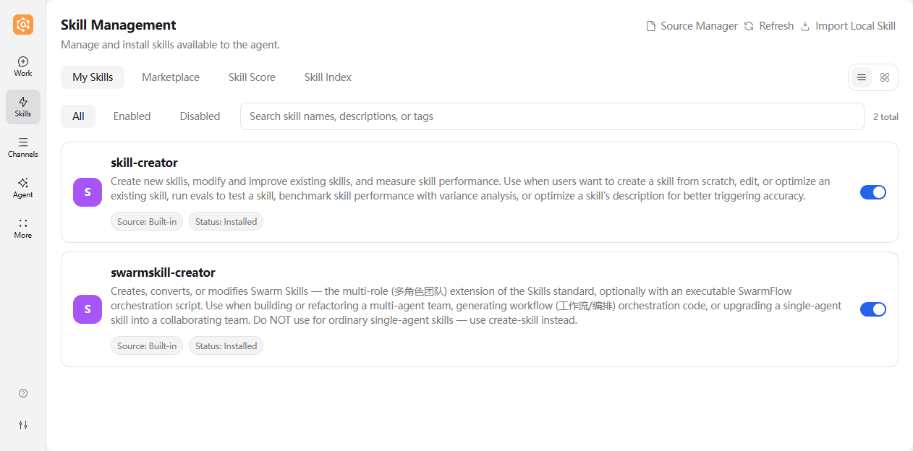
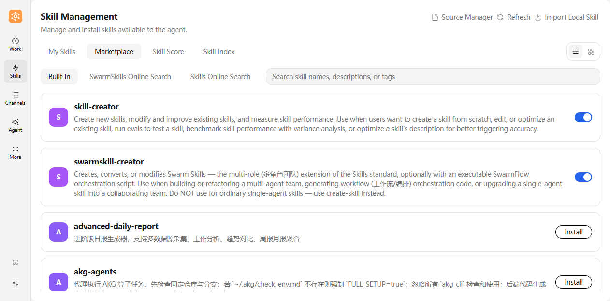
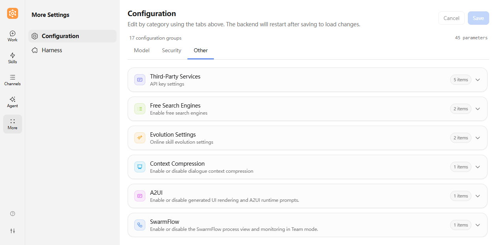
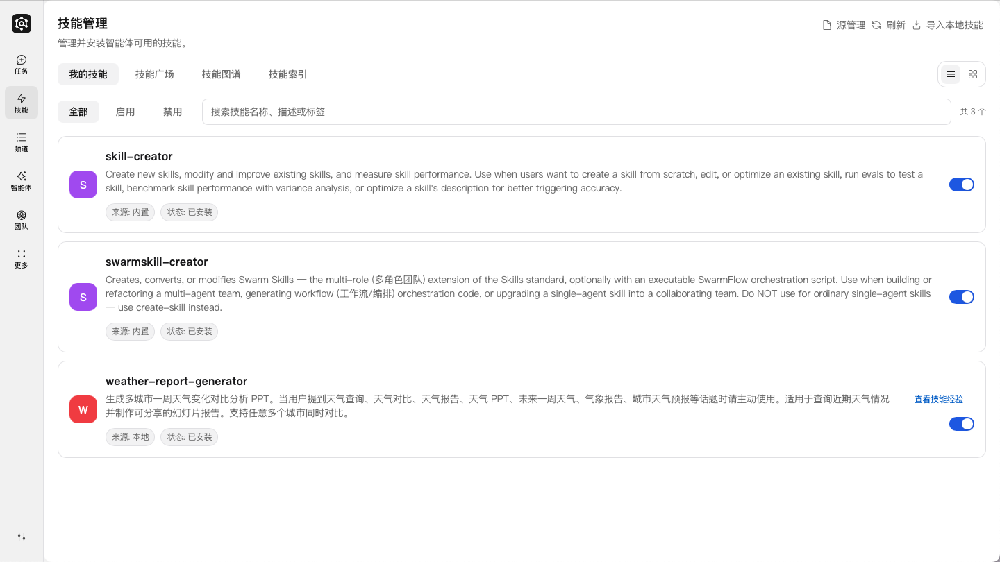
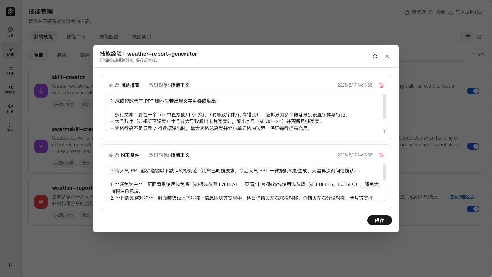

# Skills

---

## Concepts

### What is a skill?

**Definition:**

A Skill is a module that extends JiuwenSwarm with specific capabilities. You can think of it as an **installable, manageable, reusable capability package**.

Like apps on a phone extend device capabilities, skills extend the agent’s capability boundaries.


### Skill directory and `SKILL.md` (typical layout)

Each skill is usually a folder that contains at least **`SKILL.md`** (definition: purpose, steps, constraints); optionally `references/` (reference docs), `scripts/` (helpers), and more. This section stays conceptual—see [How to customize skills](#how-to-customize-skills) for folder layout and **YAML frontmatter** details.

**Why skills are needed:**

| Scenario | Without skills | With skills |
|------|-----------|----------|
| Create a GitCode PR | You manually call multiple APIs, manage branches, and write commit messages | One sentence like “open a PR” can trigger a full automated flow |
| Build a PPT | You manually guide content, structure, and export step-by-step | After loading a PPT skill, generate a full deck directly |
| Handle PR review comments | You manually read comments, edit code, and reply one by one | The skill can fetch comments, patch changes, and reply on the platform |


**How skills relate to agent and chat:**

```text
┌───────────────────────────────────────────────────────┐
│                     Agent                              │
│                                                       │
│   Base capabilities: chat, file ops, web search, code │
│                                                       │
│   ┌───────────────────────────────────────────────┐   │
│   │               Skills layer                     │   │
│   │                                               │   │
│   │   ┌───────────┐ ┌───────────┐ ┌─────────────┐ │   │
│   │   │ gitcode-pr│ │pptx-craft ││gitcode-pr-fix│ │   │
│   │   │  Git ops  │ │ PPT build │ │PR review fix│ │   │
│   │   └───────────┘ └───────────┘ └─────────────┘ │   │
│   │                                               │   │
│   │   Installable / removable / extendable         │   │
│   └───────────────────────────────────────────────┘   │
│                                                       │
└───────────────────────────────────────────────────────┘

User request → agent identifies need → load matched skill → execute workflow → return result
```

**Skill sources:**

JiuwenSwarm supports multiple sources:

| Source | Description                                                                     | Characteristics |
|------|---------------------------------------------------------------------------------|------|
| **Built-in skills** | Core skills shipped with the product; installed under **Skill Marketplace → Built-in** | Matches the product release |
| **SkillNet** | A general AI skill management and connection platform (open-source skill registry) | Anonymous usage allowed; configuring a GitHub token improves API quota and stability |
| **ClawHub** | Skill “app store” in the JiuwenSwarm ecosystem (enterprise skill registry) | Requires a CLI token; https://clawhub.ai/skills |
| **SwarmSkills** | Team/cluster skill registry, searched under **Skill Marketplace → SwarmSkills online search** | No extra configuration needed |
| **Local import** | User-authored skill files                                                       | Fully customizable; ideal for development/debug |

> **Security notice:** Skills may involve file modification, command execution, or external service calls. Always check source and description first; prefer trusted sources.

---

## Operation Guide

### Skill installation

Whether skills come from built-in packages, SkillNet, ClawHub, or a local folder, **installation and activation are done in the web UI under Skills**. The Skills page has four top tabs: **My Skills**, **Skill Marketplace**, **Skill Graph**, and **Skill Index**. Online installation happens in **Skill Marketplace**, while installed skills are managed under **My Skills**. The sections below list prerequisites and paths by source.

#### Built-in skills

Built-in skills are skill resources packaged with JiuwenSwarm.

1. **Install**

   Left sidebar → **Skills** → **Skill Marketplace** → **Built-in**, find the target skill and click **Install**.  
   

#### Install from SkillNet

SkillNet is based on GitHub-hosted skill repositories.

**Prerequisites:**
- GitHub token is recommended to improve API quota and stability.
- Token path: GitHub → Settings → Developer settings → Personal access tokens → Generate new token.

**Steps:**

1. **(Optional) Configure GitHub token**

   Open left sidebar → **Configuration** → **Other** → **Third-party service configuration**, then fill in `github_token` (optional; improves GitHub API quota and stability).
   

   Or set it in `~/.jiuwenswarm/config/.env`:

   ```dotenv
   GITHUB_TOKEN=ghp_your_token_here
   ```

   (The Configuration page writes to this same `.env`; the token is read from the `GITHUB_TOKEN` environment variable.)

2. **Install**

   Install from the web UI:  
   Left sidebar → **Skills** → **Skill Marketplace** → **Skills online search**, click **Source management** in the top-right, choose **SkillNet**, then type a keyword in the search box and click **Install** to the right of the target skill.
   

3. **Confirm success**

   After installation, confirm the new skill appears in **Skills** → **My Skills**.

#### Install from ClawHub

ClawHub URL: https://clawhub.ai/skills

**Prerequisites:**
- First-time use requires ClawHub token configuration.
- Create the token from your account settings on ClawHub.

**Steps:**

1. **Get ClawHub token**

   Visit https://clawhub.ai/skills, sign in, open **Settings** in the top-right corner, and create a token.

2. **Configure token in the web UI and complete installation**

   Left sidebar → **Skills** → **Source management** in the top-right → choose **ClawHub**.  
   On first use, fill in the CLI token obtained from the ClawHub platform and save it:
   

   Once configured, go to **Skill Marketplace** → **Skills online search**, search for the target skill, and click **Install**:
   

#### Import local skills

Best for:
- self-developed skills under debugging
- skill bundles shared by others
- customizations of existing skills

**Steps:**

1. **Prepare skill files**

   Make sure folder includes `SKILL.md`:

   ```text
   my-skill/
   ├── SKILL.md          # required
   ├── references/       # optional
   └── scripts/          # optional
   ```

2. **Local import (web UI)**

   Left sidebar → **Skills** → **Import local skill** in the top-right, enter the server-side local skill path (a `SKILL.md` file or a skill directory) in the dialog, then confirm.

   > **Requirements**: the source must be an **absolute path** or a `~/...` path; `~` is expanded against the JiuwenClaw service process user's home directory on the server, not the browser user's local machine. Other relative paths are rejected. The resolved source must not be under a system/sensitive directory (e.g. `/etc`, `~/.ssh`, `C:\Windows`) or contain symbolic links. Operators may tighten the built-in blacklist via the `IMPORT_LOCAL_FORBIDDEN_DIRS` env var (comma-separated absolute paths). The `SKILL.md` must start with a `---` YAML frontmatter block containing both `name` and `description` — bare `.md` files or directories without a valid `SKILL.md` frontmatter are not importable.
   

3. **Manual copy (optional)**

   Copy skill folder into:

   ```text
   ~/.jiuwenswarm/agent/workspace/skills/
   ```

   > **Path note**: `~` represents the user home directory. On Windows, the actual path is `C:\Users\<username>\.jiuwenswarm\agent\workspace\skills\`; on Linux/macOS, it's `/home/<username>/.jiuwenswarm/agent/workspace/skills/`. In container deployment mode, the path may vary depending on mount configuration.

   > **Agent Team mode shares this same library**: teams and team members keep no `skills/` directory and no copies of their own, only a visibility declaration stating which skills of this library they may see (by default, all of them). Installing a skill once therefore makes it available to single agents and team members alike. See the "Team Skills" section of [Agent Team](AgentTeam.md) for how to narrow a member's visibility.

4. **Verify**

   After installation, confirm the new skill appears in **Skills** → **My Skills**.

---

### Skill management page

The Skills management page is the main place to manage and browse all skills. Open it from **Skills** in the left sidebar. The page has four top tabs, with **Source management**, **Refresh**, and **Import local skill** in the top-right.

| Tab | Function |
|--------|------|
| **My Skills** | Browse and search installed skills, filter by "All / Enabled / Disabled", toggle skills on/off, and open details |
| **Skill Marketplace** | Install new skills; contains three sub-pages: **Built-in**, **SwarmSkills online search**, and **Skills online search** (SkillNet / ClawHub) |
| **Skill Graph** | Visualize capability relationships among installed skills; see [Symphony](symphony.md) |
| **Skill Index** | Build a local skill retrieval index and find matching skills by task need; see [Symphony](symphony.md) |


#### What the page shows

In the **My Skills** list, each entry shows:

| Field | Description |
|--------|-------------|
| **Skill name** | Unique id, e.g. `gitcode-pr`, `weather` |
| **Description** | Short description of what the skill does |
| **Source** | Where the skill came from, e.g. `local`, `built-in`, `skillnet`, `clawhub` |
| **Status** | Current state, e.g. installed / not installed |
| **Enable toggle** | Controls whether the skill can be loaded in chat |

#### View skill experience

In the list, use **View skill experience** to browse evolution entries for that skill, one record at a time.



**Each entry typically includes:**
- **Type**: the content category, such as usage instructions, examples, or troubleshooting
- **Improvement target**: the Skill area the experience improves, such as the description, body, or scripts
- **Created at**: when the experience record was generated
- **Experience content**: the concrete improvement guidance



> **How to see data:** When a skill already has saved evolution experience, **View skill experience** becomes available in the skill list. If there is no data yet, that skill has no saved evolution records. After enabling **Skill self-evolution**, use `/evolve <skill_name> [user_intent]` to start a review immediately. The system also judges whether failures, corrections, and other task evidence justify suggesting evolution. Experience is saved only after the review and approval workflow is complete. See [Configuration](Configuration.md) and [Skill self-evolution](SkillSelfEvolution.md).

> **Why it helps:** Skill experience reflects self-evolution and improvements from real use, so you can judge ongoing usefulness and maintainers get actionable input.

#### Skill graph and skill index

The **Skill Graph** and **Skill Index** tabs are part of Symphony. The skill index helps the agent find candidate skills from a large installed-skill set, while the skill graph uses `can_feed` relationships to show whether skills can connect. For multi-skill orchestration, graph building, graph reading, and chat usage, see [Symphony: Skill Orchestration and Dispatch](symphony.md).

---

### Source management

**Source management** selects the online skill source used by **Skill Marketplace → Skills online search** and completes the related credential configuration.

Path: left sidebar → **Skills** → **Source management** in the top-right.

| Action | Description |
|------|------|
| **Choose SkillNet** | Skills online search retrieves from SkillNet (open-source skill registry); the dialog includes network and GitHub API rate-limit tips—if it fails frequently, go to the configuration page and fill in `github_token` |
| **Choose ClawHub** | Skills online search retrieves from ClawHub (enterprise skill registry); on first use, fill in and save the CLI token in the dialog |

> **Tip:** Built-in skills (Skill Marketplace → Built-in) and SwarmSkills online search do not depend on source management and can be used directly. Switching the source does not affect already installed skills.

---

### Post-install management

After installing skills, you can inspect, verify, and uninstall.

#### View installed skills

**Method 1: Web UI**

Left sidebar → **Skills** → **My Skills** to browse installed skills, where you can filter by "All / Enabled / Disabled" or search by name, description, and tags (same layout as the “skill list and search” screenshot above; no duplicate figure here).

**Method 2: Chat**

```text
List my installed skills.
```

The agent lists installed skill names, sources, versions, and related info.

**Method 3: File path**

```text
~/.jiuwenswarm/agent/workspace/skills/
```

Each subfolder is one skill.

> **Path note**: `~` represents the user home directory. On Windows, the actual path is `C:\Users\<username>\.jiuwenswarm\agent\workspace\skills\`; on Linux/macOS, it's `/home/<username>/.jiuwenswarm/agent/workspace/skills/`. In container deployment mode, the path may vary depending on mount configuration.

#### View skill details

There are two common ways: **in chat** or **open the detail page from the Skills UI**.

**Method 1: In chat**

Ask the agent to show a skill’s details, for example:

```text
Show details for gitcode-pr skill.
```

The agent summarizes key fields in the conversation.

**Method 2: From the web UI**

Path: left sidebar → **Skills** → **My Skills** → **click the target skill** to open its detail page.


Details include:
- **Source / version / author**: where the skill came from (local / built-in / skillnet / clawhub, etc.) and version info
- **Description**: what the skill does
- **Enable toggle and uninstall button**: in the top-right of the detail page
- **Allowed tools**: the tools the skill may call (shows "Unrestricted" when not declared)
- **Content preview**: the full `SKILL.md` definition

#### Uninstall skill

The uninstall entry is on the **skill detail page**:

1. In the **My Skills** list, click the target skill to open its detail page.
2. Click the **Uninstall** button in the top-right of the detail page and confirm.
   

After uninstall:
- Skill files are removed from the `skills` directory
- Chat no longer auto-loads the skill
- Past execution results are unaffected

#### Verify whether a skill is active

**Checks:**
1. Confirm skill appears in installed list.
2. Try prompt likely to trigger it.
3. Check `logs` for load records.

**Common states:**

| State | Meaning | Suggestion |
|------|------|----------|
| Installed and active | Works normally | No action |
| Installed but not loaded | Runtime may need restart | Restart and retry |
| Install failed | Token/network/source issue | Check error and config |
| Outdated version | Features may be limited | Update to latest |

---

## Usage Guide

### How to use skills in chat

Installed skills can be triggered automatically or manually.

#### Auto trigger

Agent detects intent and loads matching skill.

**Example:**

```text
User: Help me open a PR on GitCode.
Agent: [Auto-loads gitcode-pr]
       Sure, I will create the PR...
```

#### Explicit trigger

User names the skill directly.

**Example:**

```text
User: Use pptx-craft to create a product introduction PPT.
Agent: [Loads pptx-craft]
       Sure, I will create the PPT...
```

### How to write prompts that trigger skills more reliably

**Recommended prompts:**

| Recommended prompt | Why |
|-------------|------|
| "Open a GitCode PR for me" | Platform + action clearly stated |
| "Use pptx-craft for a tech sharing PPT" | Skill name + task type |
| "Do deep research on AI industry trends" | Matches deep-research patterns |
| "Handle review comments on PR #123" | PR review task maps to review-fix skill |

**Not recommended:**

| Prompt | Issue |
|---------------|------|
| "Fix that thing for me" | Too vague |
| "Make a doc" | Type not specified |
| "Submit code" | Platform not specified |

### Key fields in skill details

Before using a skill, check:

| Field | Why it matters |
|--------|------------|
| **Source** | Trust evaluation |
| **Description** | Usage fit |
| **Allowed tools** | What operations it can perform |
| **Version** | Whether it is up to date |

**Example query:**

```text
Show gitcode-pr details and SKILL.md content.
```

### Multi-skill tasks: Skill Symphony

When a task needs several skills to work together, such as "recognize text from an image, translate it, write copy, and send an email," Skill Symphony can first produce a skill chain and then wait for confirmation before execution. For setup, prompt examples, and how to read the orchestration result, see [Symphony: Skill Orchestration and Dispatch](symphony.md).

---

## Practical examples

### Example 1: Weather query (SkillNet)

**Scenario:**  
The user wants a quick weather summary and short-term forecast for a city.

**Skill acquisition (reproducible, from SkillNet):**
1. Open left sidebar → **Skills** → **Skill Marketplace** → **Skills online search** (choose SkillNet in **Source management** in the top-right).  
2. Search for `weather` in the search box.  
3. Click install, then confirm `weather` appears in your **My Skills** list.  
4. If search rate is limited, fill in `github_token` under **Configuration → Other → Third-party service configuration** and retry.  

**Prerequisites (for stable reproduction):**
- `weather` skill is installed (using the SkillNet steps above)
- Network can reach public weather services (such as wttr.in / Open-Meteo)

**User input (example):**

```text
Please use the weather skill to check today's weather
and the next three days for Beijing.
```

**Execution flow (expected):**
1. The agent detects and loads `weather`
2. It requests real-time and forecast weather data
3. It summarizes readable output (temperature, condition, wind/precipitation)

**Expected output (example):**

```text
Beijing weather:
- Today: Cloudy, 16~28°C
- Tomorrow: Sunny, 18~30°C
- Day after tomorrow: Light rain, 19~26°C
(includes feels-like temperature and precipitation probability)
```

**Why this case is stably reproducible:**
- Fixed skill source (SkillNet)
- Simple and explicit input template (city + time range)
- No extra business account or complex local setup required

---

### Example 2: PDF processing (SkillNet)

**Scenario:**  
You need to process PDF files quickly (for example merge files, split pages, or extract text) and get directly usable outputs.

**Skill acquisition (reproducible, from SkillNet):**
1. Open left sidebar → **Skills** → **Skill Marketplace** → **Skills online search** (choose SkillNet in **Source management** in the top-right).  
2. Search for `pdf` in the search box.  
3. Click install and confirm it appears in your **My Skills** list.  
4. If search is limited, fill in `github_token` on the configuration page first, then install.  

**Prerequisites (for stable reproduction):**
- `pdf` skill is installed (using SkillNet steps above)
- Prepare 2 accessible PDF files (for example `a.pdf` and `b.pdf`)

**User input (example):**

```text
Please use the pdf skill to merge `a.pdf` and `b.pdf` into `merged.pdf`,
and also provide a text summary for the first two pages.
```

**Execution flow (expected):**
1. The agent detects and loads `pdf`
2. It locates input PDF files and performs merge
3. It extracts/summarizes text from specified pages
4. It returns output file path and summary

**Expected output (example):**

```text
Done:
1) Merged file generated: `merged.pdf`
2) Extracted text summary from pages 1-2:
- Page 1: ...
- Page 2: ...
```

---

## Advanced and Troubleshooting

### Common issues and precautions

#### Common issues

**Issue 1: Installation fails**

| Possible cause | Resolution |
|----------|----------|
| Missing/invalid token | Check `github_token` / ClawHub CLI token config |
| Network issue | Check connection and retry |
| Online source unreachable | Verify the runtime can reach GitHub (SkillNet) or the ClawHub service |
| Skill not found | Verify skill name |

**Issue 2: Skill not visible after install**

| Possible cause | Resolution |
|----------|----------|
| Service not restarted | Restart JiuwenSwarm |
| Wrong install path | Verify skill file path |
| Missing SKILL.md | Ensure skill folder has SKILL.md |

**Issue 3: Skill visible but not triggered**

| Possible cause | Resolution |
|----------|----------|
| Prompt mismatch | Use clearer prompts |
| Skill not enabled | Check status |
| Tool permission limits | Check permission config |

**Issue 4: Output does not match expectation**

| Possible cause | Resolution |
|----------|----------|
| Skill version outdated | Update skill |
| Input incomplete | Provide required parameters |
| Skill config mismatch | Read `SKILL.md` usage details |

**Issue 5: Token / permission / source trust**

| Issue type | Resolution |
|----------|----------|
| Invalid GitHub token | Regenerate token with proper permissions |
| Expired ClawHub token | Refresh token from platform |
| Untrusted source | Inspect source and details before use |

#### Precautions

1. **Prefer trusted sources**
   - SkillNet and built-in catalogs are relatively centralized—still read descriptions before installing
   - For online sources such as ClawHub, verify author and source trust

2. **Read documentation first**
   - Check `SKILL.md` before running a skill
   - Confirm scenario fit

3. **Token handling for external services**
   - GitCode-related skills require `GITCODE_TOKEN`
   - Other skills may require platform-specific tokens

4. **Check operation scope for file/command skills**
   - Review allowed tools
   - Confirm no sensitive files are unintentionally affected

---

### How to customize skills

As an advanced topic, you can create or modify skills.

#### Build a new skill

**Basic folder layout:**

```text
my-custom-skill/
├── SKILL.md              # Skill definition (required)
├── references/           # Reference docs (optional)
│   └── api-reference.md
└── scripts/              # Helper scripts (optional)
    └── helper.py
```

**Core `SKILL.md` content:**

You can let JiuwenSwarm help you generate it. **`YAML frontmatter` between the first `---` and second `---` declares metadata**; Markdown after the second `---` is the **skill body**—the instructions the Agent follows. Example:

```markdown
---
name: my-custom-skill
version: 1.0.0
author: your-name
description: Demo skill that shows how to write a custom Agent skill
tags: [demo, tools]
allowed_tools: [webSearch, readFile]
---

# My custom skill

When this skill is selected, follow the instructions below.

## When to use
- …

## Steps
1. …
2. …
```

**Frontmatter field reference**

| Field | Required? | Description |
|-------|-------------|-------------|
| `name` | Strongly recommended | Unique skill id; prefer `kebab-case`; if omitted, some setups infer from folder name |
| `description` | Strongly recommended | One-line purpose; pipeline validation usually requires it; avoid `<` and `>` |
| `version` / `author` | Optional | Version and author |
| `tags` | Optional | YAML list or comma-separated string |
| `allowed_tools` | Optional | Related tool names (comma-separated string also allowed); **actual invocation depends on agent tool config and permissions** |

**Screenshots:** Loading a custom skill folder into the product matches the **Import local skill** screenshot under [Import local skills](#import-local-skills); generic install UI matches [Built-in skills](#built-in-skills).

#### Modify an existing skill

1. **Modify an existing skill through JiuwenSwarm**

   Talk to JiuwenSwarm directly, for example: "Help me optimize the xxx skill and add xxx capability."

### Example: Optimize the weather skill by adding UV index display

### Before optimization
The output only includes basic items such as temperature, wind speed, precipitation probability, and clothing advice.

### Through chat with JiuwenSwarm: "Optimize the weather skill and add UV intensity display", the skill is updated

### After optimization
When you call it again, the output includes not only temperature and wind speed, but also UV intensity.

---

## Split Server / Client Deployment: Skill Sync API

This section is for **deployment operators and client SDK integrators**. When the Server and the Client are deployed separately, each side keeps its own skill library (`~/.jiuwenswarm/agent/workspace/skills/`). Three HTTP endpoints synchronize them:

| Endpoint | Method | Path | Request | Response |
|---|---|---|---|---|
| Diff | POST | `/skill-sync/diff` | JSON | JSON |
| Package | POST | `/skill-sync/package` | JSON (batch) | zip binary stream |
| Apply | POST | `/skill-sync/apply` | multipart (batch) | JSON |

**Enabling** (off by default; see Section 14 of the [Configuration doc](Configuration.md)): set `skill_sync.enabled: true` plus a non-empty `skill_sync.token` in the main config, or inject the environment variable `JIUWENSKILL_SYNC_TOKEN`. All three endpoints require `Authorization: Bearer <token>`.

### Sync flow

```
Client                                          Server
  │ 1. Scan local skills/ into SkillDigest[]       │
  │ ──── POST /skill-sync/diff ─────────────────► │ 2. Scan server skills/
  │ ◄────────── diff result (grouped) ───────────  │ 3. Compare via state machine
  │ 4. Pick skills to pull                          │
  │ ──── POST /skill-sync/package ──────────────► │ 5. Build zip (excludes derived artifacts)
  │ ◄────────── zip stream + X-Package-Sha256 ────  │ 6. Verify sha256, extract
  │ 7. Zip client-only / newer skills               │
  │ ──── POST /skill-sync/apply ────────────────► │ 8. Verify + install
  │ ◄────────── install result (JSON) ──────────   │ 9. On landed skills, notify
  │                                              │    AgentServer to rebuild agent
  │                                              │    (skills.sync.reload)
```

### Client report unit: SkillDigest

Fields of each entry in the `client_skills` array of a `diff` request:

| Field | Required | Description |
|---|---|---|
| `name` | Yes | Identity key = skill directory name |
| `category` | No | Normalized category: `builtin` / `local` / `marketplace` / `online` / `project` / `unknown` |
| `source` | No | Raw source string (e.g. marketplace repo name); entries with `mcp` are excluded from sync (availability depends on local MCP connections) |
| `skill_type` | No | `skill` / `skillpack` / `swarm_skill` / `multimodal_skill` |
| `version` | No | Only the `current_version` from `.archive/versions/index.json`; empty string when absent (SKILL.md frontmatter is **not** consulted) |
| `content_checksum` | Yes | Content checksum (algorithm below) |
| `description` / `updated_at` / `builtin` | No | Display only |

**`content_checksum` algorithm** (both ends must use the same version): sort files by relative path, then accumulate sha256 over `relative path + \0 + file bytes + \0` per file; excludes `.archive/`, `__pycache__/`, `*.pyc`, and symlinks. The current algorithm version is **v2** and is declared via the `checksum_algo_version` request field (integer). A mismatch returns `SKILL_SYNC_CHECKSUM_ALGO_MISMATCH` (400); the comparison result is then untrustworthy and the client must upgrade its SDK before retrying. The server-side truth lives in `archive_store.CHECKSUM_ALGO_VERSION`.

### diff state machine and response

| Status | Condition | Action |
|---|---|---|
| `server_only` | present on server only | client pulls via package |
| `client_only` | present on client only | client pushes via apply |
| `in_sync` | identical content_checksum | nothing to do |
| `version_mismatch` | checksums differ, versions comparable | pull/push by version order |
| `content_mismatch` | checksums differ, versions not comparable | **divergence**; manual decision, no auto-merge |

The response is grouped by `category` (server-side category wins); each group carries a `summary` count and `items` with both sides' digests (category drift stays visible).

### package: batch download

Request: `{"skills": [{"name": "weather"}, {"name": "ppt", "version": "1.9.0"}], "include_archive": false}`

- Omitted `version` packs current content; a specified version is read from the `.archive/versions/content/` history copy;
- `include_archive: true` includes the `.archive/` version store — **backup/migration only**; such a package cannot be applied directly (root-level `.archive` is rejected);
- Any missing skill/version fails the whole batch with 404 (fail-fast; the detail names `name@version`);
- Batch quotas: 100 skills / 5000 files / 100MB uncompressed / 50MB response zip;
- The `X-Package-Sha256` response header covers the entire body; the client should retry on mismatch.

Zip layout (top-level directories are skills, compatible with single-skill import):

```
skills_sync_xxx.zip
├── weather/           ← SKILL.md, scripts/, ...
└── ppt-creation/
```

### apply: batch upload

Multipart form fields:

| Field | Required | Description |
|---|---|---|
| `file` | Yes | zip package (each top-level directory = one skill; the directory name must match the SKILL.md `name`) |
| `sha256` | Yes | 64-char hex sha256 of `file`; a mismatch returns 400 without writing to disk |
| `overwrite` | No | Default `false`; overwrite same-name skills |
| `mode` | No | `strict` (default; any precheck failure rejects the whole batch and installs nothing) / `best_effort` (skip failures, continue with the rest) |

The `origin` provenance marker is fixed server-side to `sync_client`; client-supplied form values are ignored.

**v1 boundaries**: skillpack skills **cannot be pushed back** (visible in diff, packable, rejected by apply); MCP-bundled skills are excluded from sync; builtin skills cannot be overwritten via apply (403). Install semantics: a fresh install reports `version: null` (frontmatter version is not trusted); an overwrite preserves the server's existing `current_version`. Re-applying the same package: strict returns 409, best_effort records `skipped` — idempotent, no side effects.

**Install-failure and rollback semantics**: per-item failures during the install stage (strict / best_effort) are **not reported via an error status** — the HTTP response stays 200 with `success: false` and details in `failed[]` (strict rejects the whole batch with 400/409 only at the precheck stage, installing nothing; once the precheck passes, an install-stage failure **does not roll back** — landed skills are listed in `applied[]`). A 500 `SKILL_SYNC_INSTALL_FAILED` is returned only for server-side exceptions (IO / runtime errors).

> **Client SDK push rule**: never push a skill whose server-side digest in the diff response carries `builtin: true` (the server's builtin directory has a same-named skill) — apply always returns 403 for such entries, so pushing can never succeed. Builtin skills sync downward only (clients pull updates from the server); when builtin content diverges across ends, it converges via a server-side upgrade, never by pushing back from the client.
>
> Likewise, a server-side digest carrying `name_mismatch: true` (directory name differs from the SKILL.md `name`, e.g. the `skill-creator-normal` directory declaring `name: skill-creator`) **cannot be pushed back** — apply requires the directory name to match the frontmatter `name` and always returns 400 for such entries; they are pull-only, and client SDKs must skip pushing them.

**Taking effect after install (server-side agent rebuild)**: apply lands skills on disk inside the web server process, while the AgentServer that owns the agent instances is a separate process. Whenever any skill actually lands (`applied` non-empty), the web process sends a `skills.sync.reload` notification over the AgentServer's internal WebSocket; the AgentServer then rebuilds its agent instance and refreshes skill listings, so **running sessions can use the new skills immediately**. The notification is best-effort: a failure (e.g. AgentServer not running) is only logged and never affects the apply response — the skills are already on disk and become effective on the next event that rebuilds the agent. No notification is sent when nothing lands (all `skipped` / install failures).

**WebSocket methods**: only `skills.sync.reload` is registered on the WebSocket side (the inter-process notification sent by the web process after an HTTP apply lands skills — not an external API). `skills.sync.diff` / `package` / `apply` **have no WS route** — invoking them over WS would bypass the token auth, and the binary `zip_bytes` cannot cross JSON serialization anyway; external callers must use the authenticated HTTP `/skill-sync/*` endpoints.

### Error codes

| Code | HTTP | Scenario |
|---|---|---|
| `SKILL_SYNC_DISABLED` | 503 | API not enabled / no token configured |
| `SKILL_SYNC_UNAUTHORIZED` | 401 | Missing or wrong Bearer token |
| `SKILL_SYNC_INVALID_PAYLOAD` | 400 | Malformed payload / duplicate names / directory name mismatch with frontmatter name |
| `SKILL_SYNC_CHECKSUM_MISMATCH` | 400 | apply upload sha256 mismatch |
| `SKILL_SYNC_CHECKSUM_ALGO_MISMATCH` | 400 | diff `checksum_algo_version` differs from server; client must upgrade |
| `SKILL_SYNC_EMPTY_PACKAGE` | 400 | package `skills` empty / apply zip has no valid skill directories |
| `SKILL_SYNC_FILE_TOO_LARGE` | 413 | apply upload over 60MB (prechecked before reading the body; higher than the 50MB package limit to leave headroom for multipart overhead) |
| `SKILL_SYNC_PACKAGE_TOO_LARGE` | 400 | package batch quota exceeded |
| `SKILL_SYNC_INSTALL_FAILED` | 500 | apply server-side exception (IO / runtime error); **per-item install failures do not use this code** (200 + `success=false` + `failed[]`, see "Install-failure and rollback semantics") |
| `SKILL_NOT_FOUND` / `SKILL_VERSION_NOT_FOUND` | 404 | package references a missing skill / version |
| `SKILL_ALREADY_EXISTS` | 409 | apply name conflict (whole batch in strict mode) |
| `SKILL_OPERATION_UNSUPPORTED` | 400 | apply contains a skillpack |
| `SKILL_BUILTIN_READ_ONLY` | 403 | builtin skill cannot be overwritten |

Other package-validation errors (`SKILL_INVALID_PACKAGE` / `SKILL_UNSAFE_PATH` / `SKILL_INVALID_METADATA` / `SKILL_RESERVED_PATH`, etc.) keep their existing semantics, all mapped to 400.
