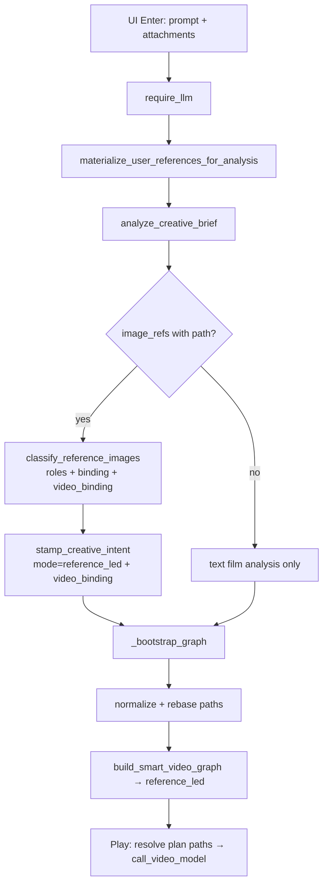
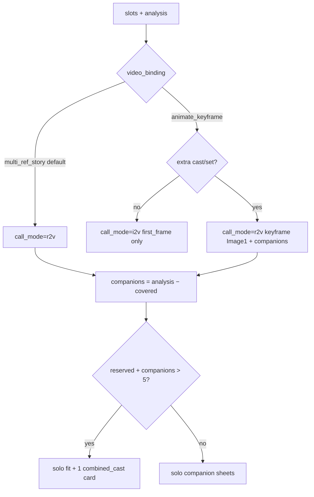

# Reference-Led Designer Pipeline — Full Specification (Reproduce Anywhere)

**Branch:** `0.2.8.beta1-referenceModeFix`  
**Repo root:** `jiuwenswarm/`  
**Primary modules:**

| Module | Path |
|---|---|
| Topology / plan | `jiuwenswarm/server/runtime/designer/pipeline/reference_led.py` |
| Uploads / classify | `jiuwenswarm/server/runtime/designer/user_references.py` |
| Enter bootstrap | `jiuwenswarm/server/runtime/gateway_adapter/designer_adapter.py` |
| Graph router | `jiuwenswarm/server/runtime/designer/smart_graph.py` |
| Scenario tests | `tests/unit_tests/test_reference_led_scenarios.py` |

This document is the reproduce guide after:

1. Use-as-is defaults for all roles  
2. Base64 materialize-before-classify  
3. Companion cast/set under authority style  
4. **`video_binding`** drives I2V vs R2V (not `still_motion_source` alone)  
5. Always pack uploads + generated refs for multi-ref stories  
6. Wan ≤5 cap with optional **combined secondary cast** card  

---

## 1. User-facing contract

| Intent | Behavior |
|---|---|
| Still bound **verbatim** (default) | Handler card (`n_ref_*`). Pixels never image-gen’d. |
| Still bound **condition** | May regenerate (`identity_sheet` / `medium_change` / scene plate). |
| Uncovered analysis cast/set | Companion sheets/plates under film `style_lock`. |
| **`video_binding=multi_ref_story`** (default) | **R2V**. Advertise / act / dinner / celebrate / product story. All plan refs sent. |
| **`video_binding=animate_keyframe`** | True “animate this picture/painting” only. Solo → **I2V**. Extra cast/set → **R2V** with keyframe as Image 1 + companions packed. |
| Wan cap ≤5 | Prefer product / keyframe / uploads; fold leftover non-lead companions into one `combined_cast` card before silent drop. |
| No phrase regex | Mode from LLM JSON `video_binding` — never slogan keyword banks for I2V. |

---

## 2. End-to-end bootstrap (Enter)



### Critical Enter rules

1. Materialize base64 **before** classify/stamp.  
2. Classify returns `video_binding` per read (same value on each); stamp copies onto `creative_intent`.  
3. Default `video_binding` is `multi_ref_story` when omitted.  
4. Fail closed if reads exist but stamp was lost.  
5. Max 5 image attachments (`MAX_REFS_BY_KIND`).  

---

## 3. Roles vs video_binding

| Field | Meaning |
|---|---|
| `roles` | What the still *is*: `character_identity`, `scene_source`, `product_hero`, `still_motion_source`, `style_source` |
| `binding` | `verbatim` (default) or `condition` (restyle) |
| `video_binding` | How clips call video: `multi_ref_story` \| `animate_keyframe` |

**Never:** `still_motion_source ∈ roles` ⇒ I2V.  
**Only:** `video_binding=animate_keyframe` (+ motion slot) selects keyframe path.

Classify prompt: story verbs (advertise / act / dinner / film) → `multi_ref_story` + character/scene/product roles. Add `still_motion_source` only with `animate_keyframe` when the still is the frame to animate.

---

## 4. `_job_plan` decision graph



### Coverage

- Character / motion still covers reconciled `character_id` (id / name / match_terms).  
- Scene still covers `setting_id`.  
- Pure animate_keyframe + sole analysis character covers that subject (no redundant sheet).  
- Companions never invented beyond analysis.  

### Cap partition

`reserved = products + verbatim uploads + locked scenes + (1 if keyframe) + condition sheets + (1 if plate)`.  
Remaining budget: on-screen companion solos; overflow → one `combined_cast` sheet (`character_ids[]`).

---

## 5. Graph nodes

| Node | When | Notes |
|---|---|---|
| `n_ref_*` | Every upload | force_handler; card role when verbatim |
| `n_character_*` condition | Character `binding=condition` | identity_sheet from upload |
| `n_character_*` companion | Uncovered cast | `companion_cast=True` |
| `n_character_*` combined | Cap overflow | `combined_cast=True`, multi names |
| `n_restyle_01` | animate_keyframe + motion condition | medium_change → first frame / Image 1 |
| `n_scene_*` | Uncovered sets when plates needed | Under style_lock |
| `n_clip_*` | Always | `reference_image_plan` + Image-N labels |

---

## 6. Call-time packing (`video_generation_overrides`)

| `reference_call_mode` | Packing |
|---|---|
| `r2v` | `_paths_from_plan` then **merge** edge fallback (never `planned or fallback`) |
| `i2v` | `first_frame` + any resolved companion paths (not hard-null) |

Empty-path plan entries resolve via `graph.nodes[].output_ref` / `user_reference_path`.

---

## 7. Clip prompt (Image N)

`compose_reference_clip_prompt` labels every plan entry:

`Image 1 is the person (n_ref_01). Image 2 is Mom and Dad (n_character_1). …`

Scene jobs also note that the place is the last reference when a scene is attached.

---

## 8. Mode examples

| User command | video_binding | Clip mode | Wan refs |
|---|---|---|---|
| Advertise product in my photo | multi_ref_story | R2V | Product + cast/set |
| Make her act with family | multi_ref_story | R2V | Her + family (+ plate) |
| Dinner story in my scene | multi_ref_story | R2V | Room + cast (not I2V) |
| Animate my picture | animate_keyframe | I2V | First frame |
| Animate this photo with family | animate_keyframe | R2V | Keyframe Image 1 + family |

---

## 9. Reproduce checklist

```bash
cd jiuwenswarm
git checkout 0.2.8.beta1-referenceModeFix
.venv/Scripts/python.exe -m pytest tests/unit_tests/test_reference_led_scenarios.py tests/unit_tests/designer/test_user_references.py -q --no-cov
```

Expect **~40066** passed (40 kinds × 1000 + Fix / packing tests + user_references).

Manual smoke: attach still → story with cast → graph `reference_led.v1`, clips `r2v`, prompt lists Image N, companions resolve into `reference_images`.

---

## 10. Files of record

| Doc | Purpose |
|---|---|
| This file | Full pipeline |
| `reference-mode-test-report.md` | 40k suite report |
| `reference-mode-test-catalog.md` | Kind catalog (may lag; see report) |
| `reference-mode-verbatim-companions-multistill-plan.md` | Prior WI plan |

---

## 11. Residuals

1. Wan/MiniMax remain generative — topology cannot freeze video pixels.  
2. Provider hard cap remains 5; combined cast is a packing tradeoff.  
3. Pure I2V + multi-ref coexistence depends on backend; multi-cast keyframe uses R2V upgrade.  
4. Classify calibration for `video_binding` needs golden JSON evals over time.  
