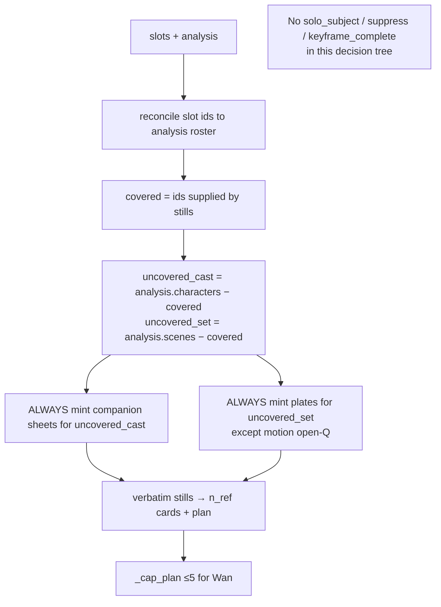
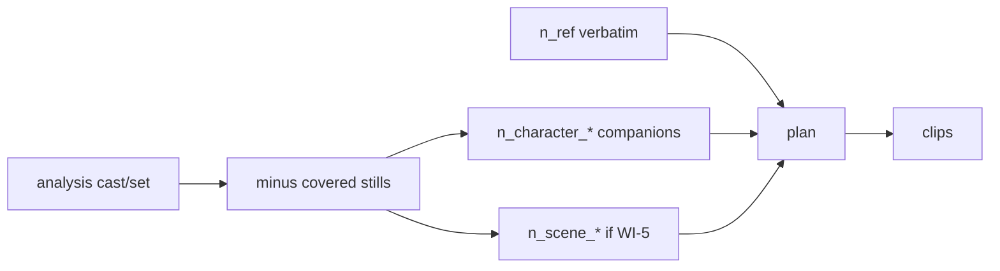

# Implementation Plan: Verbatim + Companions Always + Multi-Still (≤5)

**Status:** PLAN ONLY — do not implement until you approve  
**Branch:** `0.2.8.beta1-referenceModeFix` (`jiuwenswarm/`)  
**Builds on (do not rewrite):** `reference-mode-full-pipeline.md`, `reference-mode-as-is-pipeline.md`, `reference-mode-test-catalog.md`  
**Primary code:**  
`jiuwenswarm/jiuwenswarm/server/runtime/designer/pipeline/reference_led.py`  
`jiuwenswarm/jiuwenswarm/server/runtime/designer/user_references.py`  
`jiuwenswarm/jiuwenswarm/server/runtime/gateway_adapter/designer_adapter.py`

**Design choice (user-approved direction):**  
Do **not** “override bad `solo_subject`.” **Remove** `solo_subject` / `suppress_companions` / `keyframe_complete` as topology gates entirely. Storyboard/analysis uncovered cast/set is the only source of truth for companions. True solo = analysis has no uncovered people/places.

---

## 1. Goals / non-goals

### Goals

1. **Verbatim stays verbatim** — `binding=verbatim` subjects never get an image-gen LLM pass; `n_ref_*` fills the matching card immediately (`reference_card_role` + `output_ref`); those pixels ride `reference_image_plan` / I2V first frame into clips.
2. **Companions always when storyboard needs them** — every `analysis.characters` / `analysis.scenes` entry **not covered** by a still must mint a companion sheet/plate under film `style_lock` and feed clip nodes. No LLM flag may cancel this.
3. **Multi-still ≤5** — user may attach up to **5** image stills (any mix of character / scene / product / motion / style); each covered id stays verbatim (or condition if restyle); only uncovered cast/set is generated.
4. **True solo still works** — when analysis cast/set is fully covered by stills (or analysis lists no extras), companions are empty **because uncovered is empty**, not because a suppress flag said so.

### Non-goals

- Patching around suppress with “if uncovered then ignore flags” (rejected — that is the override approach).
- Keeping classify suppress trio as a second topology authority.
- Inventing cast/set **beyond** `analysis.characters` / `analysis.scenes`.
- Phrase/regex banks for bindings.
- Implementing this plan until you explicitly say so.

---

## 2. Current vs desired behavior

### Table

| Topic | Current (code) | Desired (clean redesign) |
|---|---|---|
| Verbatim still | `n_ref_*` `force_handler` + card role; no sheet for that id | **Keep** |
| Companions | `companions = [] if suppress else uncovered` (`1100`) | Always `companions = analysis.characters − covered` |
| Suppress flags | Absolute wipe via `_suppress_companions` (`879–888`) | **Delete as topology input** — stop reading them in `_job_plan`; stop stamping them onto intent for graph shape; stop asking classify for them (or ignore if present for backward compat) |
| Scene plates | `needs_set = scene OR (product ∧ scenes ∧ ¬motion)` | Uncovered `analysis.scenes` → always mint plates (incl. character-led jobs) |
| Motion + plates | Motion forces `plates=False` | Cast companions yes; set plates: open Q (default: no plates on pure I2V unless you decide otherwise) |
| Image attach cap | `MAX_REFS_BY_KIND[image] = 3` | **5** |
| Slot ↔ analysis id | Free-form classify ids | Reconcile to analysis `id`/`name`/`match_terms` |
| Wan plan cap | `_cap_plan` cap 5 | Keep 5; prefer user uploads when truncating |

### Mermaid — current (broken)

```mermaid
flowchart TD
  A[slots + analysis] --> B{_suppress_companions?<br/>solo_subject / suppress / keyframe}
  B -->|yes| C[companions=[] — family dies]
  B -->|no| D[companions = uncovered]
  D --> E[build]
  C --> E
```

### Mermaid — desired (clean)



**True solo:** `uncovered_cast` and `uncovered_set` are empty → no companion nodes. That is enough.

---

## 3. Root causes blocking the desired behavior

| # | Issue | Evidence | Effect |
|---|---|---|---|
| R1 | Suppress trio is a second topology authority | `_suppress_companions` `879–888`; `_job_plan` `1082`, `1100`, `1130` | Family brief + `solo_subject:true` → zero companions |
| R2 | Stamp / carry copy suppress into intent | `173–179`, `821–824` | Bad classify row poisons job |
| R3 | Classify prompt asks for suppress trio | `user_references.py:259–263` | LLM invents “solo” on “exactly as she is … with family” |
| R4 | Image hard-cap = 3 | `user_references.py:50` | Multi-still ≤5 blocked |
| R5 | Id drift (`xiaoyue` vs `char_1`/`小月`) | cover only id/name norm `891–923` | Duplicate lead sheet or wrong coverage after companions return |
| R6 | Classify never sees analysis roster | Enter analyze→classify | Free-form ids |
| R7 | Narrow `needs_set` | `1125–1128` | No storyboard rooms on character-led jobs |
| R8 | Tests encode suppress + no plates | motion_cast suppress; family asserts no scenes | Must rewrite with clean policy |
| R9 | Plan cap vs 5 stills + companions | `_cap_plan` `1227–1236` | Silent drop |

---

## 4. Ordered implementation work items

### WI-1 — Remove suppress from topology (P0) — **replace, don’t override**

**What to change**

1. **Delete or gut `_suppress_companions`** as a decision used by `_job_plan`.  
2. In `_job_plan`, always:
   ```text
   companions = _companion_characters(analysis, covered_chars)
   plate_scenes = _companion_scenes(analysis, covered_settings)  # after WI-5 policy
   ```
   No `if suppress: companions = []`.  
3. Stop OR-aggregating suppress flags in `stamp_creative_intent` / `_carry_intent_fields` for topology (either drop fields or leave them unused/debug-only).  
4. Remove motion/family tests that expect suppress to wipe companions when analysis still has uncovered cast.

**Not in this WI:** “if uncovered then force suppress=false” — that is the rejected override pattern.

**Files**  
- `reference_led.py` — `_suppress_companions`, `_job_plan`, stamp/carry  
- `test_reference_led_scenarios.py` — motion_cast suppress branch, dedicated suppress tests  

**Graph impact**



**Acceptance**  
- `solo_subject:true` in intent + 4 analysis chars + 1 verbatim still → still **3** companions (flags ignored because unused).  
- 1 analysis char matching covered still → **0** companions.  
- No code path where a flag empties companions while uncovered ≠ ∅.

---

### WI-2 — Stop asking classify for suppress trio (P0, cleanup)

**What to change**

1. Remove `suppress_companions` / `solo_subject` / `keyframe_complete` from classify system schema and guidance (`user_references.py`).  
2. Classify keeps: roles, binding, set_lock, style_authority, medium/look/palette, character_id, setting_id, rationale.  
3. Pass analysis cast/set roster into classify so `character_id`/`setting_id` can match analysis ids (supports WI-3).  
4. If old sessions still carry suppress fields in JSON, ignore them (WI-1).

**Files**  
- `user_references.py` — `classify_reference_images`  
- `designer_adapter.py` — pass analysis into classify payload  

**Acceptance**  
- Classifier contract / unit fixtures no longer require suppress fields.  
- Family briefs do not depend on LLM “solo” judgment for topology.

---

### WI-3 — `character_id` / `setting_id` reconciliation (P0)

**What to change**  
Resolve slot keys against analysis roster (id → name → match_terms → single-candidate fallback). Persist canonical analysis id on the slot so the lead still covers `char_1`, not a floating `xiaoyue`.

**Files**  
- `reference_led.py` — `_reconcile_slot_ids`  
- Tests for `xiaoyue` ↔ `char_1`/`小月`

**Acceptance**  
- Lead covered; companions = others only; no duplicate sheet for Xiaoyue.

---

### WI-4 — Raise image attach limit to 5 (P1)

**What to change**  
`MAX_REFS_BY_KIND[KIND_IMAGE] = 5`. Update “at most 3 image” tests/errors.

**Files**  
- `user_references.py` + unit tests  

**Acceptance**  
- 5 images OK; 6th errors. Mixed roles stamp `n_ref_01`…`n_ref_05`.

---

### WI-5 — Scene companions from storyboard (P1)

**What to change**  
```text
plate_scenes = uncovered analysis.scenes
```
(for non-motion jobs; motion plates = open Q). Remove “pure character never invents set.” Never invent beyond analysis; never replace locked/verbatim scene upload.

**Files**  
- `reference_led.py` — `_job_plan` needs_set / motion plates  
- Flip family tests that assert zero scene nodes  

**Acceptance**  
- Character still + analysis dining/kitchen, no scene upload → companion plates.  
- Scene still covering `set_1` + two analysis sets → plate only for uncovered.

---

### WI-6 — `_cap_plan` when multi-still + companions (P1)

**Priority when >5 Wan refs:** product → user verbatim uploads → on-screen companions → other companions/plates; keep one scene last when possible.

**Acceptance**  
- 5 character stills → plan all uploads.  
- 2 uploads + 3 companions + plate → ≤5, uploads kept.

---

### WI-7 — Docs / catalog sync (P2)

Update full-pipeline + test-catalog to state: **no suppress topology**; companions = analysis − covered only. Remove override language from older drafts.

---

## 5. Multi-still (≤5) design

| Still role | Covers | Card / plan |
|---|---|---|
| character verbatim | reconciled character id | handler card; path on plan |
| character condition | same id + self sheet | regen sheet on plan |
| scene verbatim / set_lock | reconciled setting id | scene card; path on plan |
| scene condition | setting + plate | plate on plan |
| product | product slot | product card; first on plan |
| motion | optional character id; I2V first frame | motion card |
| style | style_lock only | no cast/set cover |

Mix of up to 5 images supported after WI-4. Companions only for holes in analysis.

---

## 6. Suppress-flag policy — **removed from topology**

| Old idea | New rule |
|---|---|
| Override bad `solo_subject` when uncovered ≠ ∅ | **Not used** |
| Honor suppress when uncovered empty | **Unnecessary** — uncovered empty already means no companions |
| Classify emits suppress trio | **Stop asking**; ignore if present |

Sole rule: **`companions/plates = analysis entries not covered by stills`.**

---

## 7. `character_id` / `setting_id` matching rules

1. Exact norm id  
2. Exact norm name  
3. `match_terms`  
4. Single analysis candidate for that role  
5. Else leave uncovered (generate companion rather than wrongly mark lead covered)

Write canonical id back onto the slot.

---

## 8. Scene companions when storyboard has settings but no scene still

Always plate uncovered `analysis.scenes` (WI-5). Style from film `style_lock` / authority still. Empty `analysis.scenes` → no invented default room.

---

## 9. Test matrix additions (plan only)

| ID | Setup | Expect |
|---|---|---|
| T1 | 1 verbatim char, 4 analysis chars, stale `solo_subject=true` in intent | 3 companions; lead not regenerated; flags irrelevant |
| T2 | 1 verbatim char, 1 matching analysis char | 0 companions |
| T3 | `character_id=xiaoyue` vs `char_1`/`小月` + parents | lead covered; companions = parents |
| T4 | 5 images normalize; 6th fails | OK |
| T5 | Mixed 5 stills + larger analysis | companions only for uncovered |
| T6 | Character still + 2 analysis scenes | ≥1 plate |
| T7 | Scene still covers set_1 of two | plate for set_2 only |
| T8 | Plan overflow | uploads retained under cap |
| T9 | Motion + family analysis | cast companions minted; no suppress branch |
| T10 | Classify schema has no suppress fields | fixtures updated |

**Remove / rewrite:** parametric `motion_cast` “suppress every 5th → empty companions” and any test that treats suppress as a topology kill switch while uncovered cast remains.

---

## 10. Risks / open questions for you

1. **Motion + uncovered settings:** mint plates on I2V graphs, or frame-only? Default proposal: **cast companions yes; set plates no**.  
2. **5 uploads vs Wan cap 5:** companions may not reach the video model — UI cards only, or lower attach max?  
3. **Unresolved character_id:** match_terms then leave uncovered (default).  
4. **Storyboard later adds cast** after graph build — re-expand? Out of scope unless you want it.  
5. **Backward compat:** old graphs with suppress fields in metadata — ignore (yes).

---

## 11. Explicit: DO NOT implement until approved

This file is the plan only. No production code or tests should change until you say which WIs to implement (recommended start: WI-1 → WI-2 → WI-3, then WI-4…WI-7).
