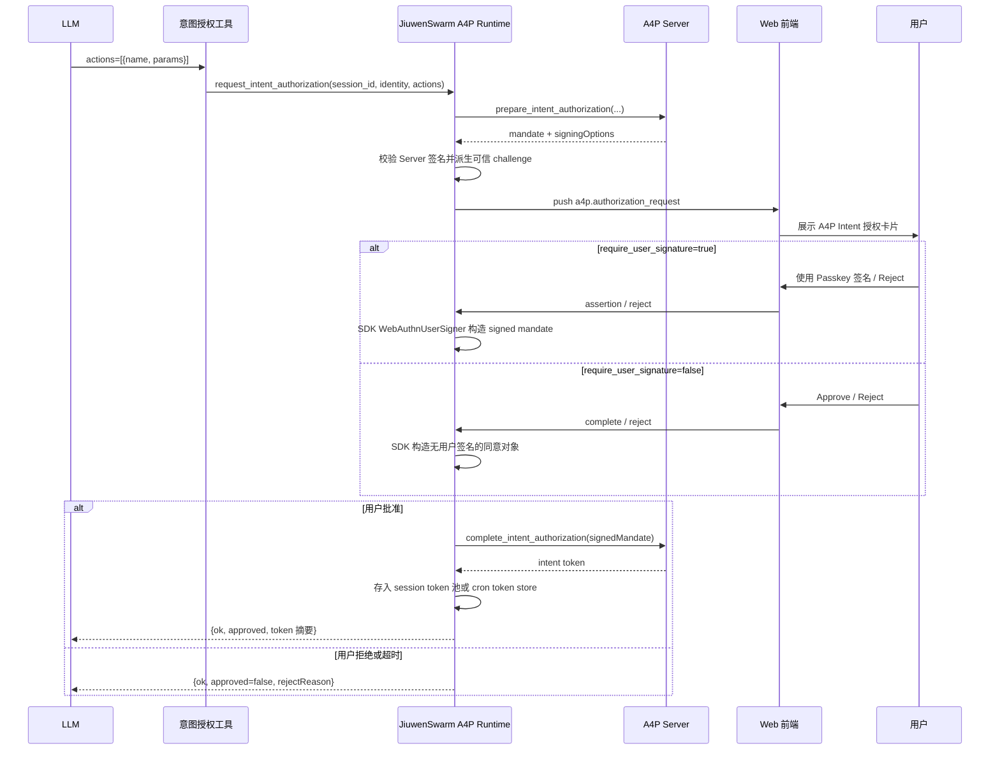
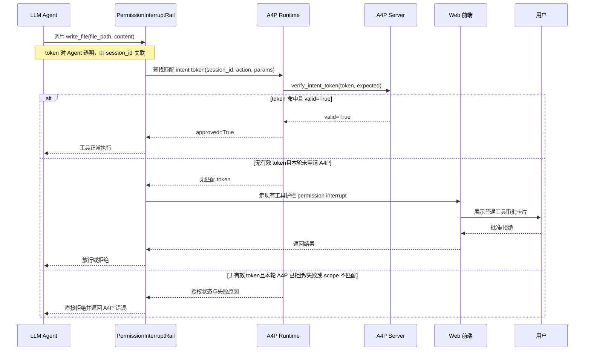
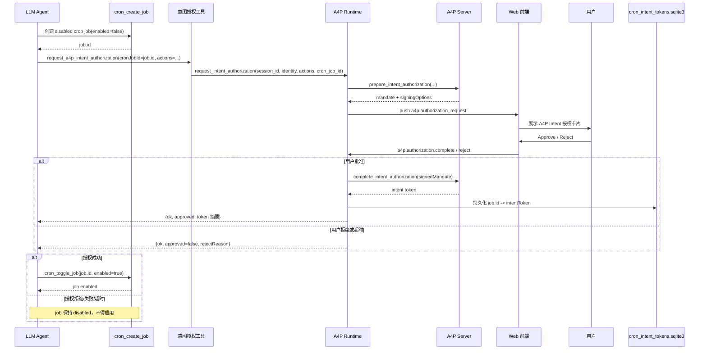
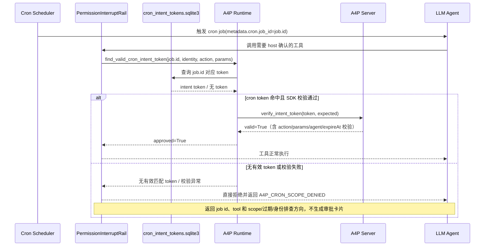
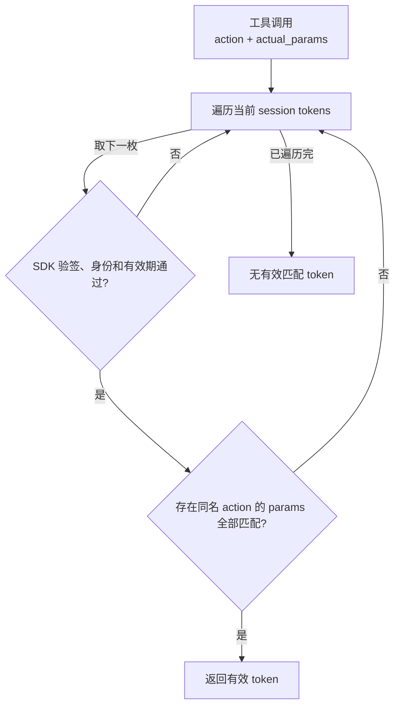

# 工具护栏与 A4P SDK 对接方案

## 1. 概述

本方案引入 A4P SDK （OpenJiuwen Agent Protocol仓库），在 JiuwenSwarm 中实现动态的预授权。当 Agent 执行跨多个工具的复杂任务时，或用户不在场 Agent 执行定时任务时，A4P SDK 可为工具调用提供意图授权与 token 校验能力。

当前依赖固定为 Agent Protocol 仓库的 `agent-protocol-V0.2.0` tag（`A4P` 子目录）。

A4P 的核心增量价值：
1. 当 Agent 执行跨多个工具的复杂任务时，可以申请 A4P 意图授权，用户一次批准明确 scope 后，后续匹配的工具调用可以通过可验证的 intent token 自动放行，避免连续重复审批，影响用户体验。
2. 当用户不在场 Agent 执行定时任务时，可以预先申请 A4P 意图授权，在定时任务执行过程中可自动放行匹配的工具调用，无需将该工具持久化设为allow，引入安全风险。

A4P 的核心流程：
- **Intent 授权**：Agent 调用 `request_a4p_intent_authorization` 申请覆盖一组 action/params 的 intent token。
- **工具护栏校验**：进入权限确认回调后，交互式 Web 调用查当前 session 的 A4P intent token；cron 执行时按 `cron.job_id` 查本地绑定的 A4P intent token；命中并通过 SDK 校验则放行。Web 下未申请 A4P 时，未命中 token 回退现有工具护栏审批。该回调并不是所有工具调用的必经入口，权限层的适用边界见 4.2。

**通道隔离**：A4P 仅介入 Web 通道和 Cron 定时任务通道的权限校验；ACP/TUI/CLI 行为不变。

---

## 2. 关键流程

### 2.1 Intent 授权申请流程



说明：
- 默认 `require_user_signature=false`，后端使用 SDK 的本地用户同意对象完成 mandate。开启签名模式后，用户在浏览器中通过 Passkey 确认授权，认证器对可信 challenge 签名，浏览器将生成的 WebAuthn assertion 连同 `requestId` 提交给 JiuwenSwarm 后端。后端根据 `requestId` 找到对应的待授权 mandate，使用 SDK 的 `WebAuthnUserSigner` 和 `sign_user_mandate_with_signer()` 将 assertion 组装进 `signedMandate`，再交给 A4P Server 验证用户签名并签发 intent token。
- Runtime 使用 SDK `verify_local_user_authorization_request()` 校验 Server-signed mandate，并重新派生可信 WebAuthn challenge 后才推送前端。
- token 由 A4P Server 签发并验证，绑定内部固定 `userId`、当前执行上下文解析出的 `agentId`、action scope、params scope 和有效期；`agentId` 优先取 metadata，其次取当前 Agent 标识，并非固定常量。
- `params` 解释为安全关键字段的子集约束；JiuwenSwarm 校验关键字段后，在调用 SDK 时统一补充协议字段 `allowExtraParams: true`。因此真实工具调用可携带未列入 scope 的普通参数，但 scope 中列出的字段必须匹配；授权工具返回给 Agent 的 token 摘要会隐藏该内部字段。
- session token 存入当前 AgentServer 进程的内存池，重启或关闭 A4P 后不保留；cron token 则按已存在的 `cronJobId` 持久化。Agent 后续调用工具时不需要手动携带 token。

### 2.2 工具调用时序

以下时序以权限层已要求 host 确认为前提，省略之前的权限规则和智能权限决策。



### 2.3 Cron 定时任务授权流程

cron 通道的授权分两个阶段：创建 job 时申请并绑定 intent token（在场），未来触发时按 `cron.job_id` 查 token 校验（无人值守）。

#### 阶段一：创建 cron job 并申请 intent 授权



#### 阶段二：cron 触发时校验 intent token



说明：
- 阶段一先以 `enabled=false` 创建 job；授权工具拒绝绑定 enabled job。Runtime 拿到 token 后通过 SQLite store 原子写入 `a4p/cron_intent_tokens.sqlite3`（以 `cronJobId` 为键），Agent 仅在授权工具返回 `ok=true` 后调用 `cron_toggle_job(..., enabled=true)`。授权拒绝、失败或超时时 job 保持 disabled。
- 授权工具会先确认 `cronJobId` 对应的 job 存在且已禁用，再由 Runtime 把 job id、名称、任务内容、schedule 和持久化属性放入 `uiContext.authorizationTarget`；授权卡片通过“定时任务”区块展示 job id、任务内容、schedule 和时区。
- `cronJobId` 来自 `cron_create_job` 返回的 `job.id`，用于本地绑定和授权展示，不注入被授权工具的参数；A4P token 的校验约束为 action/params scope、agent/user 身份和有效期，不包含本地 job 归属校验。
- 阶段二与 2.2 基本一致，差异仅在于 Runtime 通过 `find_valid_cron_intent_token()` 按 `metadata.cron.job_id` 查 token，而非按 `session_id` 查 session token 池。
- 每次 cron 模型调用前，`RuntimePromptRail` 按 `metadata.cron.job_id` 自动注入该 job 的授权 actions、params 和有效期；不向 Agent 暴露原始 token 或 SDK 内部协议字段。Prompt 明确要求只执行 scope 内调用，并提示 scope 外、过期或身份不匹配的调用无法完成 cron 场景下的交互式审批，因而可能失败。
- A4P 启用时，进入权限 host 确认回调的 cron 调用遇到 scope miss、缺失 job id 或校验失败，采用 fail-closed：直接向 Agent 返回 `A4P_CRON_SCOPE_DENIED`，不回落 session token，也不创建普通 permission interrupt。该限制不覆盖此前已由权限层直接处理的调用（见 4.2）。Agent 可根据反馈调整后续步骤或报告失败。
- 删除 cron job 时同步删除对应 token；cron token 默认有效 30 天，可由授权工具传入的 `validitySeconds` 覆盖。

### 2.4 Token 匹配规则



授权在进入 SDK 前统一使用子集匹配语义，实际调用中未列入 `params` 的普通字段不会导致失败。

SDK 要求约束 key 均存在：字符串按区分大小写的 `fnmatchcase` glob 匹配，约束值 `*` 可匹配任意值，其他值按相等比较。同名 action 中任意一项完整匹配即可，不会因第一项不匹配就终止查找。Shell 命令在申请和校验时都会移除包裹安全绝对路径字面量的引号；glob 不理解 Shell 语法或路径目录边界，窄范围约束仍需按第 5 节申请规则表达。

---

## 3. 配置与开关

`config.yaml::a4p` 当前包含配置字段：

```yaml
a4p:
  enabled: false
  require_user_signature: false
```

| 字段 | 默认 | 说明 |
|---|---|---|
| `enabled` | `false` | A4P intent 授权开关 |
| `require_user_signature` | `false` | 是否要求用户使用 Passkey 对 intent mandate 签名 |

有效期和审批等待超时使用代码默认值：授权工具的 `validitySeconds` 为可选参数，未传入时，session token 有效期为 `3600` 秒（1 小时），cron token 有效期为 `2592000` 秒（30 天）；显式传入时采用该有效期。等待用户批准/拒绝的超时固定为 `300` 秒（5 分钟）。授权工具仅要求 `actions` 必填；绑定定时任务时还需提供 `cronJobId`。

JiuwenSwarm Web 当前按单用户个人助理处理，因此 A4P SDK 所需的 `userId` 由 runtime 内部使用固定常量填充。

### 3.1 Passkey 注册

签名模式使用固定 WebAuthn 配置：

- `rp_id=localhost`
- `expected_origin=http://localhost:5173`
- credential store：JiuwenSwarm 配置目录下的 `a4p/webauthn_credentials.json`
- 内部用户：`jiuwenswarm-local-user`

用户应先在 Web“设置 → 实验功能 → A4P”中注册 Passkey，再开启 `require_user_signature`。浏览器或平台认证器持有私钥，JiuwenSwarm 只持久化 SDK credential store 中的公钥记录，支持注册和查看多个 credential。

`enabled` 只控制 A4P 工具授权介入和授权申请。关闭时仍允许通过 Web 设置查看、注册 Passkey，以便预先准备凭据；`a4p.webauthn.credentials.get`、`a4p.webauthn.registration.options` 和 `a4p.webauthn.registration.verify` 三个管理 RPC 仍会初始化 runtime，并要求交互式 Web route 和满足 WebAuthn 环境要求。凭据查询返回 `enabled=false` 表示授权功能关闭，不表示 Passkey 管理被禁用。

普通 A4P 授权（`require_user_signature=false`）不受 Passkey 的 localhost 环境限制影响。仅浏览设置且未开启签名模式时不显示环境错误；尝试开启或注册时检查环境，不满足则说明原因且不保存开启配置、不发起注册。签名模式已开启但访问地址不支持时显示不可用提示，允许手动关闭，不自动降级。状态尚未加载或加载失败时，开启和注册提示稍后刷新重试。

当前固定 origin 只支持通过 `http://localhost:5173` 打开的 Web 页面。`127.0.0.1`、其他端口及远程 origin 均不能注册或使用该 Passkey。

---

## 4. 代码对接点

### 4.1 Runtime

`A4PRuntime` 实现 intent 授权与 token 校验：

- 使用内嵌的 `A4PServer`，不使用 A4P SDK 的本地 `A4PHTTPServer`。
- 始终为 `A4PServer` 配置 SDK `WebAuthnSignatureMethod` 和 `JsonFileCredentialStore`；`require_user_signature` 只控制 mandate 是否要求用户签名。
- A4P 配置变化时终止旧 runtime 的 pending 授权并重建 runtime；无签名/签名模式切换会保留已签发的 session token，cron token 继续从持久化 store 读取。
- `request_intent_authorization()` 显式调用 `server.prepare_intent_authorization()` 生成 mandate 和 `signingOptions`，在 Web 用户批准后以 `signedMandate` 调用 `server.complete_intent_authorization()` 签发 token。
- `dispatch_a4p_request()` 将批准/拒绝 RPC 分发给 `runtime.authorizer.complete()` / `reject()`（`WebAuthorizerBroker`）；pending 绑定逻辑路由 `session_id + app_id + agent_ref`，`ws_id` 仅用于当前连接投递。
- `runtime.authorizer.pending_for_route()` 按逻辑路由返回尚未结束的授权请求，供 Web 重连或切回 session 后恢复卡片。
- session token 在查找、导出和导入时过滤过期项并删除空会话条目；session/cron 共用与 SDK 一致的过期判断（UTC 秒格式，当前时间严格晚于 expireAt 才过期），过期、缺失或非法 expireAt 的新 token 不入库。闲置 session 不做定时扫描或主动释放。
- `find_valid_intent_token()` 通过 SDK `verify_intent_token()` 校验 session token。
- `a4p/cron_intent_tokens.sqlite3` 持久化保存 `cronJobId -> token` 绑定，并通过 SQLite 事务支持 Gateway 与 AgentServer 跨进程安全更新。
- JiuwenSwarm 的 `SQLiteCronIntentTokenStore` 保存 cron job 与 token 的宿主归属。
- `find_valid_cron_intent_token()` 只按当前 `cron.job_id` 查对应 token，再通过 SDK 原生语义校验 action、params、agent 和 expireAt。
- 删除 cron job 时同步清理对应的持久化 token。

### 4.2 权限护栏

A4P 接入 `interrupt_helpers.py` 构建的 `ToolPermissionHost.request_permission_confirmation` 回调。基础 `PermissionInterruptRail` 先处理场景规则、权限 `allow` / `deny` 和已有自动确认；只有仍需确认时才进入该回调。启用智能权限模式时，外层 `AutoPermissionInterruptRail` 还会先执行自身的确定性规则和 reviewer 流程；这些分支可能直接放行、拒绝或要求人工确认，只有实际转入基础 rail 的 host 回调时才使用 A4P。

该回调内，除静默 `skills.rebuild` 和授权申请工具自身的直接放行特例外，A4P 的执行顺序如下：

1. 如果 A4P 未启用，直接走现有权限确认逻辑。
2. 仅 `__cron__` 或具有有效 AuthorizerRoute 的交互式 Web 上下文进入 A4P 分支；如果 metadata 存在 `cron.job_id`，先从 `a4p/cron_intent_tokens.sqlite3` 查该 job id 对应 token。
3. cron token 命中且 SDK 校验通过，则返回 `PermissionConfirmResponse(approved=True)`。
4. `__cron__` 通道的 job id/token 缺失、过期、scope 不匹配或校验异常时直接返回 `A4P_CRON_SCOPE_DENIED`，不生成普通审批；交互式 Web 若未命中 cron token，则继续检查 session token。
5. 普通 Web round 解析统一 Host 执行上下文中的 `session_id`、`agentId`、工具名和参数，查当前 session 的有效 intent token。
6. session token 命中则返回 `PermissionConfirmResponse(approved=True)`。
7. 当前 round 未申请 A4P 时，token 未命中返回 `"interrupt"`，交给现有工具护栏 ask。
8. 未命中有效 session token，且当前 round 已申请 A4P，但授权被拒绝、超时、内部失败、验签失败或实际调用不匹配已批准 scope 时，直接拒绝并返回 `A4P_AUTHORIZATION_UNAVAILABLE` 或 `A4P_SCOPE_DENIED`。先前已批准且仍匹配的 token 优先于本轮失败状态。

工具、权限 host 和 prompt 可见性使用同一个 session 级 `AuthorizationExecutionContextStore`。上下文在取得输出 lease 并开始 round 时激活，结束、取消或初始化失败时释放。


### 4.3 Web / API

新增的 Web RPC：

| RPC | 说明 |
|---|---|
| `a4p.authorization.complete` | 用户批准当前 intent mandate |
| `a4p.authorization.reject` | 用户拒绝当前 intent mandate |
| `a4p.authorization.pending` | 查询当前逻辑会话尚未完成的授权，用于重连恢复 |
| `a4p.webauthn.credentials.get` | 查看签名模式、固定 RP/origin、credential store 状态和脱敏 credential 摘要 |
| `a4p.webauthn.registration.options` | 为内部固定用户生成 SDK WebAuthn 注册 options |
| `a4p.webauthn.registration.verify` | 验证浏览器 registration credential 并持久化公钥 |

Web 保留 A4P intent 授权卡片。无签名模式批准时只回传 JiuwenSwarm 本地 `requestId`；签名模式额外回传浏览器 assertion。`requestId` 取自 `mandateId`，仅用于关联 Web 卡片与等待中的请求，不属于 A4P SDK 的 complete 协议。Gateway 从当前 WebSocket 的 RoutingKey 构造调用方路由，不信任前端提交的 user、origin、app 或 agent 字段；AgentServer 仅允许相同 `session_id + app_id + agent_ref` 完成或拒绝 pending，同一逻辑会话重连后可通过 pending RPC 恢复。卡片从 `mandate.intent`、`mandate.validTime` 和 `uiContext` 结构化渲染授权操作、有效时间、授权原因及 cron 任务信息，不解析 `displayText`；未知工具显示原始工具名和完整 `params`。“完整授权对象”保留原始 `mandate`、`signingOptions` 和 `uiContext`。`displayText` 仍由服务端通过 A4P SDK 的 `intent_display_text_renderer` 生成并保留在 mandate 中，供协议兼容、审计和通用 Authorizer 回退使用。有效时间统一转换为北京时间显示。cron 授权卡片通过“定时任务”区块展示绑定的 job id、任务内容、schedule 和时区，并说明令牌的持久化行为；设置页同时提供签名开关、固定 RP/origin、credential store 状态及 Passkey 注册与列表。

---

## 5. Agent 引导

Agent 仍通过 `request_a4p_intent_authorization` 主动申请 intent token。该工具和完整的申请规则只在 A4P 启用、具有有效 AuthorizerRoute 的顶层交互式 Web round 中暴露；cron、TUI、ACP、后台 goal 和 team member/subagent 均不注入 A4P 申请 prompt，Team leader 统一负责申请。误调用会立即返回 Web 会话错误而不会等待授权超时：

| 机制 | 说明 |
|---|---|
| ToolCard description | 描述工具用途、Web 分阶段授权及 session/cron token 存储方式 |
| ToolCard input schema | 描述 action 安全关键字段、shell 精确命令和文件路径约束；输入由 `_ACTION_SCOPE_POLICY` 及相关校验处理 |
| RuntimePromptRail 动态段 | 描述何时授权、范围约束、规划与动态参数、Web 分阶段授权和 cron 生命周期 |

建议 Agent 申请规则：
- 当前 Web prompt 要求：涉及支持的受保护工具时，在第一个受保护调用前申请 A4P 授权，通过这些工具执行只读操作也不例外。实现仍保留本轮未申请 A4P 时的普通审批回退（见 4.2）。
- 可以先使用受保护列表之外的工具读取 Skill、定位文件和发现参数。
- 后续受保护调用依赖前一阶段的动态结果时，可先授权并执行范围已明确的阶段；只有后续调用不在已批准范围内时才申请新 token。运行时值变为已知本身不要求重新授权。不同阶段的 session token 会共存，已签名 token 不会被修改或扩展。
- 不使用 `<KEY>`、`<URL>` 等占位符猜测动态值；每个受保护调用执行前都必须命中某个已批准 token。
- Cron 不采用分阶段 token：先明确完整未来 scope，动态参数的构成方式和允许范围可预先表达时，无需提前取得运行时值；严格执行“`cron_create_job(enabled=false)` → 对完整未来 scope 申请 A4P intent 授权 → 授权成功后 `cron_toggle_job(enabled=true)`”；失败时不得启用。仅创建定时任务时，不要求先试运行任务。
- `actions[].name` 使用真实工具名，例如 `write_file`、`edit_file`、`bash`。
- `actions[].params` 必填且不能为空，只填写必须匹配的安全关键字段；真实调用中的其他普通参数由系统自动允许。
- `bash`、`mcp_exec_command` 必须约束 `command`，`create_terminal` 必须约束 `cmd`，`write_file`、`edit_file` 必须约束 `file_path`，`acp_chat` 必须约束目标 `agent`。参数名必须与真实工具 schema 完全一致；未登记安全关键字段策略的工具不签发 intent token。提交不支持的 action 会把本轮申请记为失败，因此不能保证随后自动回落普通审批（见 4.2）。
- shell 默认分别授权完整精确命令；只有单个动态参数无法提前确定，且通配不会覆盖空白、Shell 运算符、重定向或额外参数时，才使用窄范围通配。文件路径使用具体文件名或固定目录下的文件名 glob，不以目录路径代替文件范围，不使用裸 `*`。这些通配与占位符限制包含 prompt/schema 对 Agent 的要求，当前输入校验并未完整强制检查 Shell 通配和未解析占位符。
- 不要为了减少 action 数量合并计划中独立执行的 shell 步骤；创建目录和最终 `ls` 验证应分别授权、分别调用。
- cron 授权的 `validitySeconds` 应覆盖用户要求的任务持续时间；省略时默认有效 30 天。

---


## 6. 设计取舍

- 无签名的 operation authorization 与普通工具 ask 本质重复，在JiuwenSwarm 中暂不采用。
- Passkey/WebAuthn 是可选的 signed A4P mode；默认无签名，用户显式开启后 mandate 必须通过已注册 Passkey 签名。
- A4P token 由 session / cronJobId 级自动匹配附带，Agent 无需手动传 token。
- JiuwenSwarm 隐藏 SDK 的 `allowExtraParams` 协议细节，并通过 action scope policy 负责 Agent 输入校验；SDK 继续负责 token 签发及 action、params、agent 和有效期验证。
