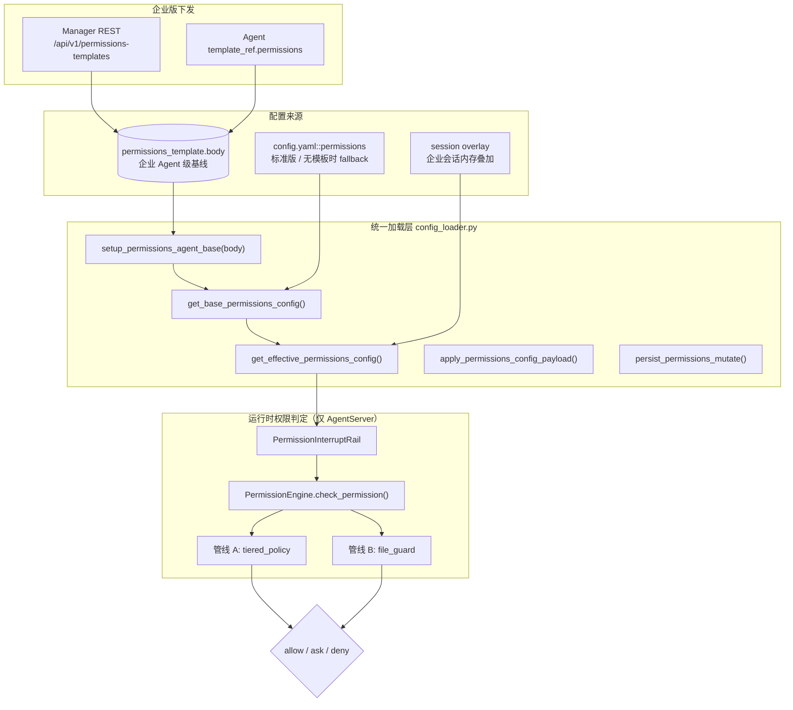
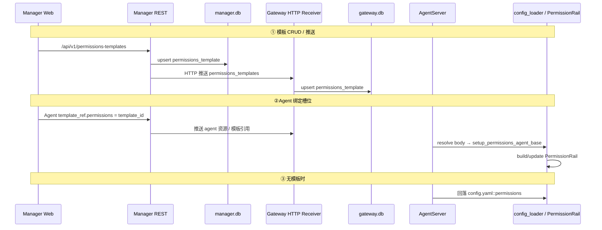
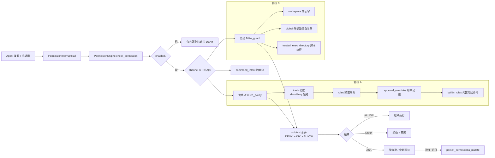
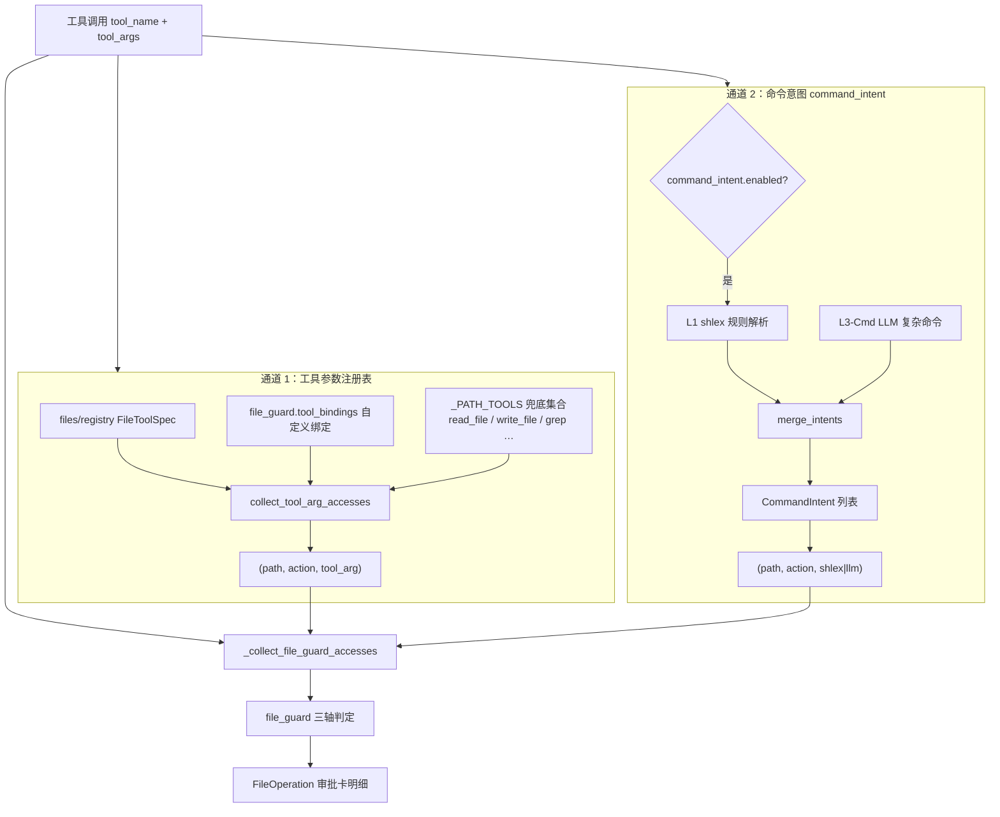
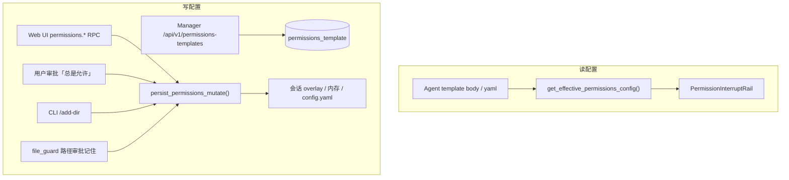

# Permissions 配置架构

本文档描述 JiuWenSwarm **工具权限（permissions）配置**的整体架构：标准版 yaml、企业版 `permissions_template`、生效粒度、运行时判定框架。

> 相关文档：[工具权限与安全防护](./工具权限与安全防护.md)  
> Manager ↔ Gateway 模板接口：[Gateway中和Manager交互的接口文档.md](./Gateway中和Manager交互的接口文档.md) §8

> **迁移说明（2026-09）**：实例级表 / 应用配置 API `permissions_config` 已废弃。  
> 企业策略改为 `permissions_template`，经 Agent `template_ref.permissions` 绑定到具体 Agent。  
> Gateway yaml 段仍可能以 store 名 `permissions_config` 映射 `config.yaml::/permissions`（个人版读写），勿与已删的实例级 DB 表混淆。

---

## 一、整体架构



---

## 二、两种部署模式


| 模式 | 判定条件 | 读取来源 | 写入目标 |
| --- | --- | --- | --- |
| **标准版 / 单机** | `JIUWENSWARM_EDITION` 非 `enterprise` | `config.yaml::permissions` | 写回 `config.yaml` |
| **企业版** | `JIUWENSWARM_EDITION=enterprise` | Agent 模板 `permissions` 槽位 body 优先；无模板回落 yaml；可叠加会话 overlay | 改策略写 `permissions_template`；会话 overlay 仅内存；base persist 不再写实例表 |


**核心入口**：`jiuwenswarm/agents/harness/common/rails/permissions/config_loader.py`


| 函数 | 职责 |
| --- | --- |
| `setup_permissions_agent_base()` | 绑定当前 Task 的 Agent 级模板 body |
| `resolve_permissions_body_from_enterprise()` | 从企业配置 `permissions` 槽位取首个启用模板 body |
| `get_base_permissions_config()` | Agent base 优先，否则 yaml（**不再读实例级 permissions_config 表**） |
| `get_effective_permissions_config()` | 企业版：base + 会话 overlay；其他：yaml/base |
| `apply_permissions_config_payload()` | 刷新进程缓存（显式 body 或 yaml fallback） |
| `reload_permissions_from_gateway_db()` | 冷启动：仅刷新为 yaml fallback（模板在请求路径注入） |
| `persist_permissions_mutate()` | 标准版写 yaml；企业 session 写 overlay；企业 base 仅内存 |
| `clear_permissions_config_cache()` | 清进程缓存 |


---

## 三、生效粒度


| 层级 | 粒度 | 说明 |
| --- | --- | --- |
| **企业配置存储** | `permissions_template` 行 | Manager / Gateway 模板表；经 Agent `template_ref.permissions` 引用 |
| **标准配置存储** | 进程 yaml | `config.yaml::permissions`（Gateway store 名仍可能叫 `permissions_config`） |
| **Agent 基线** | 每个 Agent 实例 | `interface_deep` 解析模板 body → `setup_permissions_agent_base` / `_agent_permissions_body` |
| **会话 overlay** | 企业版 `session_id` | 内存叠加，不写实例表 |
| **实际拦截** | 仅 AgentServer | `PermissionInterruptRail` → `check_permission()` |


### 请求级叠加


| 机制 | 匹配维度 | 作用 |
| --- | --- | --- |
| `owner_scopes` | `channel_id` + `principal_user_id` | 与基线取交集，`ask` 可降级为 `deny` |
| `channel_id` 白名单 | `PERMISSION_ENABLED_CHANNELS` | 部分 channel 可跳过权限检查 |
| `session_id` | 单次会话 | 企业 overlay / 审批归因 |


---

## 四、配置存储结构

`permissions` 段在 **YAML** 与 **模板 `body` JSON** 中结构一致：

```yaml
permissions:
  enabled: true              # 总开关
  defaults: ask              # 未在 tools 中列出的工具默认策略
  tools: {...}                 # 整工具档位 allow / ask / deny
  rules: [...]                 # 预置 Shell 命令白/黑名单
  approval_overrides: []       # 用户「总是允许」动态规则
  owner_scopes: {}             # 数字分身 owner 作用域
  deny_guidance_message: ""
  command_intent:              # 命令意图抽取（L1 shlex + L3 LLM）
    enabled: true
    timeout_seconds: 15
    extra_body: {...}
  file_guard:                  # 文件路径三轴
    workspace:
      rw_enabled: true
    global: {}
    trusted_exec_directory: []
    tool_bindings: {}
  external_directory: {...}    # 旧键，加载时自动迁移到 file_guard.global
```

### 企业表 `permissions_template`（替代已废弃的 `permissions_config`）


| 字段 | 说明 |
| --- | --- |
| `template_id` | 模板唯一 ID |
| `template_name` / `description` | 展示信息 |
| `enabled` | 是否启用 |
| `body` | 完整 permissions 段 |
| `data` | 扩展元数据 |


接口细节见 [Gateway中和Manager交互的接口文档.md](./Gateway中和Manager交互的接口文档.md) §8。  
实例级 `permissions_config` 表与 `/api/v1/instances/{id}/permissions` **已移除**。

---

## 五、企业版配置同步链路



### Manager / Gateway 职责


| 职责 | Manager | Gateway | AgentServer |
| --- | --- | --- | --- |
| `permissions_template` CRUD / 推送 | ✅ | 收 HTTP 写 GDB | — |
| Agent `template_ref.permissions` 绑定 | ✅ | 存 Agent 资源 | 解析 body 注入 Task |
| 工具调用前校验 | — | ❌ | ✅ |
| 标准版 yaml 读写 | — | store `/permissions` | `persist` 写 yaml |


Bootstrap **不再**单独 push 实例级 permissions；模板随 `sync_referenced_templates_to_gateway` 与 Agent 资源下发。

---

## 六、运行时判定框架




### 三种权限级别


| 级别      | 行为        |
| ------- | --------- |
| `allow` | 直接执行      |
| `ask`   | 弹出审批，用户决定 |
| `deny`  | 拒绝执行      |


### 管线 A：tiered_policy

- **工具档位**（`tools.<name>`）：显式 `allow` / `deny` 直接短路
- **Shell 命令规则**（`rules` / `approval_overrides`）：仅匹配 Shell 工具（`bash`、`mcp_exec_command`、`create_terminal`）的命令文本
- **匹配优先级**：`approval_overrides` → `rules` → `builtin_rules`
- **整命令 deny 扫描**在子命令 allow 匹配之前执行

### 管线 B：file_guard

- **read / write**：workspace 内默认放行（`rw_enabled`）+ `global` 最长前缀白名单
- **exec**：`trusted_exec_directory` 白名单
- 按路径逐条判定，多条访问取 **strictest**（DENY > ASK > ALLOW）

#### 管线 B 的路径来源（两条通道）

`PermissionEngine._collect_file_guard_accesses()` 合并两条独立通道，统一转成 `(Path, action, source)` 三元组后交给 `FileGuardChecker.evaluate_accesses()`：




| 通道            | 适用工具                                                                                | 路径从哪来                                       | `source` 标记            |
| ------------- | ----------------------------------------------------------------------------------- | ------------------------------------------- | ---------------------- |
| **通道 1：工具参数** | 路径类工具（`read_file`、`write_file`、`search_replace`、`grep` 等）及 `tool_bindings` 注册的自定义工具 | 直接读 `tool_args` 里的 `path` / `file_path` 等字段 | `tool_arg`             |
| **通道 2：命令意图** | Shell 类（`bash`、`mcp_exec_command`、`create_terminal`）与代码类（`run_python` 等）            | 从 `command` / `code` 字符串解析隐含的文件读写/执行        | `shlex`（L1）或 `llm`（L3） |


> **分工**：`read_file({path})` 只走通道 1；`bash({command: "cat /etc/hosts"})` 主要走通道 2。Shell 命令的**白名单匹配**（`rules` / `approval_overrides`）属于管线 A，与 `CommandIntent` 无关。

#### CommandIntent 是什么？

`CommandIntent` 是通道 2 的**中间数据结构**（定义于 `command_intent.py`），表示「这条命令会对哪些路径做哪一种原子文件操作」。**本模块只做抽取，不做权限判定**；判定由 `file_guard` 完成。


| 字段           | 类型                | 含义               |
| ------------ | ----------------- | ---------------- |
| `summary`    | `str`             | 给用户看的中文摘要（审批卡文案） |
| `action`     | `read`            | `write`          |
| `paths`      | `tuple[str, ...]` | 规范化绝对路径（POSIX）   |
| `executable` | `str              | None`            |
| `source`     | `shlex`           | `llm`            |


启用条件：`permissions.command_intent.enabled = true`（默认 `true`），且在 `PermissionEngine.check_permission()` 内对 Shell/代码工具调用 `collect_command_intents()`。

**L1 vs L3：**


| 层级     | 方式                                                             | 何时用                                                  |
| ------ | -------------------------------------------------------------- | ---------------------------------------------------- |
| **L1** | `shlex` + 启发式（`cp`/`mv`/`rm`、重定向 `>`/`>>`/`<`、`python x.py` 等） | 始终先跑；简单命令足够                                          |
| **L3** | LLM 静态分析命令字符串（不读磁盘）                                            | 管道、子 shell、`bash -c`、`find -exec`、cmd `if/for` 等复杂结构 |


#### CommandIntent 示例

**示例 1：`bash` + 简单读文件（仅 L1）**

命令：

```bash
cat README.md
```

抽取结果（示意）：

```python
CommandIntent(
    summary="读取 /workspace/README.md",
    action="read",
    paths=("/workspace/README.md",),
    executable="cat",
    source="shlex",
)
```

若路径在 workspace 外且未配置 `file_guard.global` → 管线 B 产出 ASK，审批卡显示 `summary`。

**示例 2：`bash` + 重定向写文件（L1，多条 Intent）**

命令：

```bash
cat /etc/hosts > /tmp/out.txt
```

抽取结果（示意，拆成两条）：

```python
[
    CommandIntent(
        summary="读取 /etc/hosts",
        action="read",
        paths=("/etc/hosts",),
        executable="cat",
        source="shlex",
    ),
    CommandIntent(
        summary="写入 /tmp/out.txt",
        action="write",
        paths=("/tmp/out.txt",),
        executable="cat",
        source="shlex",
    ),
]
```

**示例 3：`bash` + 执行脚本（L1，`exec` 轴）**

命令：

```bash
python scripts/deploy.py
```

```python
CommandIntent(
    summary="通过 python 执行 /workspace/scripts/deploy.py",
    action="exec",
    paths=("/workspace/scripts/deploy.py",),
    executable="python",
    source="shlex",
)
```

`exec` 走 `file_guard.trusted_exec_directory` 白名单，不在白名单则 ASK。

**示例 4：复杂管道（L1 + L3）**

命令：

```bash
find . -name "*.log" -exec rm {} \;
```

- L1 可能抽不全 → L3 闸门打开 → LLM 返回 JSON `intents` 数组
- 典型结果：多条 `action="write"`（删除即写轴语义）的 Intent，`source="llm"`

**示例 5：路径类工具（不走 CommandIntent）**

工具调用：

```json
{ "tool": "write_file", "args": { "path": "/tmp/a.txt", "content": "..." } }
```

- 通道 1 直接得到 `("/tmp/a.txt", "write", "tool_arg")`
- `collect_command_intents()` 对非 Shell 工具返回 `[]`，**不产生** `CommandIntent`

#### 从 CommandIntent 到审批卡

合并后的访问列表经 `file_guard._check_one()` 判定；需要审批的路径会落成 `FileOperation`（与 `CommandIntent` 字段对应，供 UI 渲染）：

```python
FileOperation(
    action="read",           # 来自 CommandIntent.action
    path="/etc/hosts",       # 来自 CommandIntent.paths
    source="shlex",          # 来自 CommandIntent.source
    prompt="是否允许读取 /etc/hosts？",
)
```

用户选「总是允许」后，路径类写入 `file_guard.global`；`exec` 写入 `trusted_exec_directory`（见 `persist_file_operations_allow`）。

---

## 七、模块与功能对照


| 模块 | 路径 | 功能 |
| --- | --- | --- |
| **配置加载器** | `jiuwenswarm/agents/harness/common/rails/permissions/config_loader.py` | Agent 模板 base / yaml fallback；会话 overlay；持久化 |
| **权限 Rail 构建** | `jiuwenswarm/agents/harness/common/rails/interrupt/interrupt_helpers.py` | `build_permission_rail`；企业模板注入 |
| **Agent 适配** | `jiuwenswarm/server/runtime/agent_adapter/interface_deep.py` | 解析 `template_ref.permissions` → Task 绑定 |
| **RPC 入口** | `jiuwenswarm/agents/harness/common/rails/permissions/permissions_config_rpc.py` | Web/Agent `permissions.*` 方法 |
| **审批持久化** | `jiuwenswarm/agents/harness/common/rails/permissions/permissions_persist.py` | 「总是允许」等写回 |
| **yaml 段仓库** | `jiuwenswarm/gateway/config/permissions/` | store 名 `permissions_config` → `/permissions`（非实例表） |
| **Manager 模板** | `manager_server/core/template/permissions_template.py` | `permissions_template` CRUD / 推送 |
| **Gateway Receiver** | `packages/jiuwenclaw-ee/.../core/template/permissions_template.py` | HTTP 收模板写 GDB |
| **权限校验进程** | — | 仅 AgentServer：`PermissionInterruptRail` → 判定引擎 |


---

## 八、permissions 各字段运行时作用


| 字段                                  | 作用                        | 匹配对象                      |
| ----------------------------------- | ------------------------- | ------------------------- |
| `enabled`                           | 总开关；关闭后大多放行，内置危险命令仍 DENY  | —                         |
| `defaults`                          | 未在 `tools` 中列出的工具默认策略     | 工具名                       |
| `tools`                             | 整工具档位；`allow`/`deny` 直接短路 | 工具名                       |
| `rules`                             | 管理员预置 Shell 白/黑名单         | Shell 命令文本                |
| `approval_overrides`                | 用户审批「总是允许」后动态追加           | Shell 命令文本（优先级高于 `rules`） |
| `command_intent`                    | 是否启用 L1+L3 从命令抽路径         | Shell / 代码工具              |
| `file_guard.workspace`              | 工作区内读写是否默认放行              | 文件路径                      |
| `file_guard.global`                 | 工作区外路径白名单（最长前缀）           | 文件路径                      |
| `file_guard.trusted_exec_directory` | 允许脚本执行的目录                 | exec 路径                   |
| `owner_scopes`                      | 数字分身 owner 维度权限           | 分身场景                      |


### Shell 工具 vs 非 Shell 工具


| 类型      | 工具名                                         | 「总是允许」持久化目标                                 |
| ------- | ------------------------------------------- | ------------------------------------------- |
| Shell   | `bash`、`mcp_exec_command`、`create_terminal` | `approval_overrides`（按命令 pattern）           |
| 非 Shell | `write_file`、`todo_create` 等                | `tools.<name>: allow` 或 `file_guard.global` |


---

## 九、读写入口汇总




---

## 十、进程栈（企业版）

```
Manager REST ──HTTP──► Gateway Receiver ──► gateway.db
                              │
                              │ WS / Runtime
                              ▼
                         AgentServer
                              │
                    template_ref.permissions
                              ▼
                    PermissionInterruptRail
```

企业模板接口见接口文档 §8；标准版仅 `config.yaml::permissions`。

---

## 十一、一句话总结

**企业版**：策略存在 `permissions_template`，经 Agent `template_ref.permissions` 绑定到具体 Agent，请求路径注入 `PERMISSIONS_AGENT_BASE`（可叠加会话 overlay）。**标准版 / 单机**：只读写 `config.yaml::permissions`。**执行层**仅在 AgentServer 由 PermissionRail / 引擎做 allow/ask/deny。实例级 `permissions_config` 表与对应 REST/WS 推送已废弃并移除。