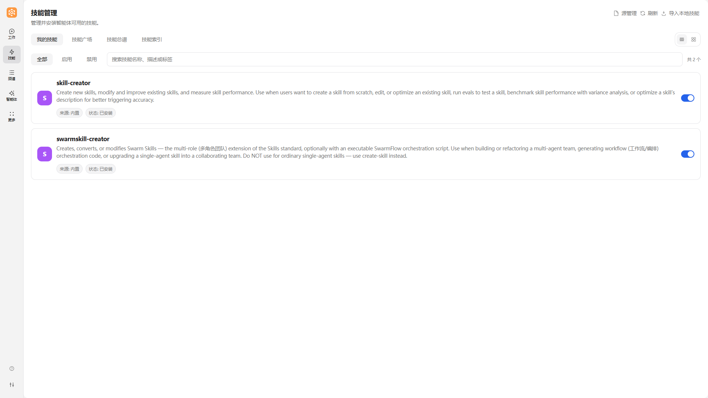
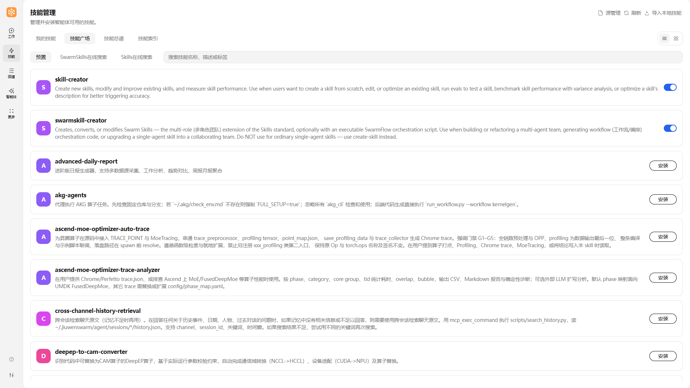
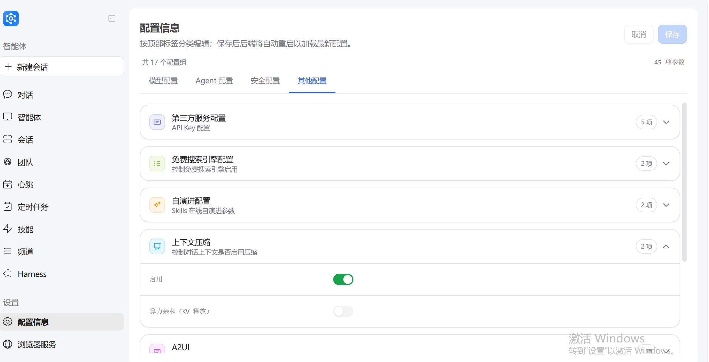
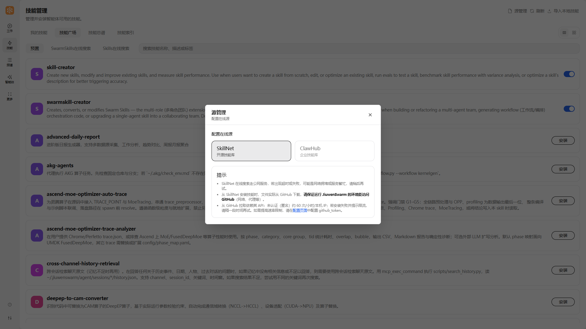
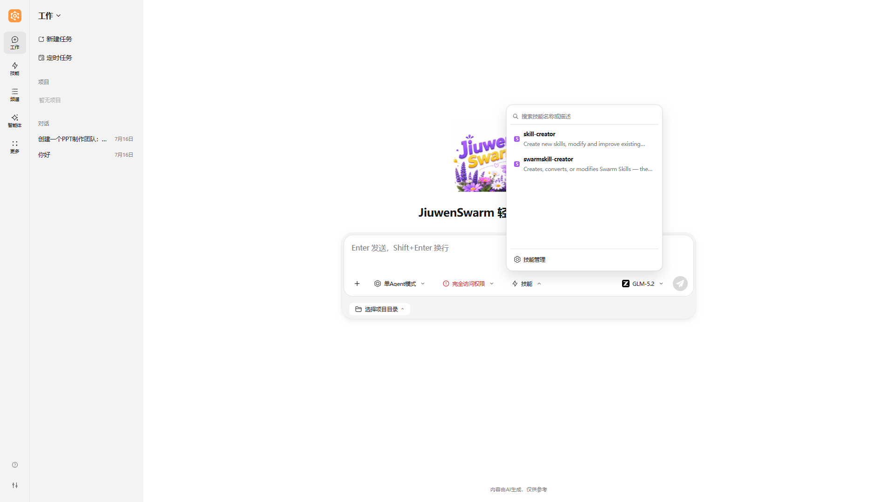

# 技能
---

## 概念科普

### 技能是什么

**定义：**

技能（Skill）是给 JiuwenSwarm 补充特定能力的模块，可理解为**可安装、可管理、可复用的能力包**。

就像手机上的 App 扩展了手机的功能，技能扩展了智能体的能力边界。


### 技能目录与 SKILL.md（常见结构）

每个技能通常是一个文件夹，至少包含 **`SKILL.md`**（技能定义，说明用途、步骤与约束）；可选包含 `references/`（参考文档）、`scripts/`（辅助脚本）等。**正文科普仍以概念为主**，自定义技能的目录示例与 **YAML frontmatter** 写法见下文 [如何自定义技能](#如何自定义技能)。

**为什么需要技能：**

| 场景 | 没有技能时 | 有技能后 |
|------|-----------|----------|
| 创建 GitCode PR | 需要手动调用多个 API、处理分支、写提交信息 | 一句话"帮我提个 PR"，技能自动完成全流程 |
| 制作 PPT | 需要逐步指导内容、格式、导出 | 加载 PPT 技能后，直接生成完整演示文稿 |
| 处理 PR 检视意见 | 需要逐条读取评论、修改代码、回复讨论 | 技能自动获取意见、修改代码、回复平台 |


**技能与智能体、对话的关系：**

```
┌───────────────────────────────────────────────────────┐
│                     智能体 (Agent)                     │
│                                                       │
│   基础能力：对话、文件操作、网络搜索、代码执行            │
│                                                       │
│   ┌───────────────────────────────────────────────┐   │
│   │               技能层 (Skills)                  │   │
│   │                                               │   │
│   │   ┌───────────┐ ┌───────────┐ ┌─────────────┐ │   │
│   │   │ gitcode-pr│ │pptx-craft ││gitcode-pr-fix│ │   │
│   │   │  Git操作   │ │  PPT制作  │ │处理PR检视意见│ │   │
│   │   └───────────┘ └───────────┘ └─────────────┘ │   │
│   │                                               │   │
│   │   可安装、可卸载、可扩展                        │   │
│   └───────────────────────────────────────────────┘   │
│                                                       │
└───────────────────────────────────────────────────────┘

用户对话 → 智能体识别需求 → 加载对应技能 → 执行专业流程 → 返回结果
```

**技能来源：**

JiuwenSwarm 支持多种技能来源：

| 来源 | 说明                       | 特点 |
|------|--------------------------|------|
| **内置技能** | 系统内置的核心技能，在「技能广场 → 预置」中安装    | 与产品版本一致|
| **SkillNet** | 一个通用的 AI 技能管理与连接平台（开源技能库）       | 可匿名使用；配置 GitHub Token 可提升 API 限额与稳定性 |
| **ClawHub** | JiuwenSwarm 框架下的技能“应用商店”（企业技能库） | 需配置 CLI Token；访问 https://clawhub.ai/skills |
| **SwarmSkills** | 团队/集群技能库，在「技能广场 → SwarmSkills在线搜索」中检索 | 无需额外配置 |
| **本地导入** | 用户自建技能文件                 | 完全自定义，适合开发调试 |

> **安全提示**：技能可能涉及文件修改、命令执行、外部服务访问。安装和使用前请先查看来源与说明，优先选择可信来源的技能。

---

## 操作指导

### 技能安装

无论从内置包、SkillNet、ClawHub 还是本地目录获取技能，**安装与启用均在前端「技能」页面完成**。技能页面顶部分为 **我的技能**、**技能广场**、**技能图谱**、**技能索引** 四个标签页：在线安装在 **技能广场** 中进行，已安装技能在 **我的技能** 中管理。下面按来源说明前置条件与操作路径。

#### 内置技能

内置技能指打包在 JiuwenSwarm 中的技能资源。

1. **安装**

   操作路径：左侧导航栏 → **技能** → **技能广场** → **预置**，找到目标技能后点击 **安装**。  
   

#### 从 SkillNet 安装技能

SkillNet 是基于 GitHub 的技能仓库网络。

**前置条件：**
- 建议配置 GitHub Token（用于提升 GitHub API 限额与稳定性）
- Token 获取方式：GitHub → Settings → Developer settings → Personal access tokens → Generate new token

**安装步骤：**

1. **（可选）配置 GitHub Token**

   打开左侧导航栏 → **配置信息** → **其他配置** → **第三方服务配置**，填写 `github_token`（可选；用于提升 GitHub API 限额与稳定性）。
   

   或在 `~/.jiuwenswarm/config/.env` 中配置：

   ```dotenv
   GITHUB_TOKEN=ghp_your_token_here
   ```

   （配置页面填写后也是写入同一个 `.env`；token 最终从环境变量 `GITHUB_TOKEN` 读取。）

2. **安装**

   在前端完成安装：
   操作路径：左侧导航栏 → **技能** → **技能广场** → **Skills在线搜索**，点击右上角 **源管理**，选择 **SkillNet**，然后在搜索框输入关键词搜索，并点击目标技能右侧的 **安装**。
   

3. **确认安装成功**

   安装完成后，在 **技能** → **我的技能** 列表中确认新技能已出现。

#### 从 ClawHub 安装技能

ClawHub 访问地址：https://clawhub.ai/skills

**前置条件：**
- 首次使用需要配置 ClawHub Token
- Token 从 ClawHub 平台个人设置中创建

**安装步骤：**

1. **获取 ClawHub Token**

   访问 https://clawhub.ai/skills，登录后进入右上角 **Settings**，创建 Token。

2. **在前端配置 Token 并完成安装**

   操作路径：左侧导航栏 → **技能** → 右上角 **源管理** → 选择 **ClawHub**。  
   首次使用时在弹窗中填写从 ClawHub 平台获取的 CLI Token 并保存：
   

   配置完成后，进入 **技能广场** → **Skills在线搜索**，搜索目标技能名称，点击 **安装**：
   

#### 导入本地技能

本地技能适合以下场景：
- 自己开发的技能，正在调试
- 从他人处获取的技能文件包
- 需要修改定制已有技能

**安装步骤：**

1. **准备技能文件**

   确保技能目录包含 `SKILL.md` 文件，结构如下：
   ```
   my-skill/
   ├── SKILL.md          # 技能定义文件（必需）
   ├── references/       # 参考文档（可选）
   └── scripts/          # 辅助脚本（可选）
   ```

2. **本地导入（前端）**

   操作路径：左侧导航栏 → **技能** → 右上角 **导入本地技能**，在弹窗中输入服务端本地 skill 路径（`SKILL.md` 文件或技能目录），点击确定。

   > **导入要求**：源路径必须是**绝对路径**或 `~/...` 路径；`~` 按服务端 JiuwenClaw 进程用户的 home 目录展开，并非浏览器所在电脑的用户目录，其他相对路径会被拒绝。解析后的源不能位于系统/敏感目录下（如 `/etc`、`~/.ssh`、`C:\Windows`），也不能包含符号链接；如需进一步收紧，可通过 `IMPORT_LOCAL_FORBIDDEN_DIRS` 环境变量追加黑名单目录（逗号分隔的绝对路径）。`SKILL.md` 必须以 `---` YAML frontmatter 开头且同时包含 `name` 与 `description`——不含合法 frontmatter 的裸 `.md` 文件或目录无法导入。
   

3. **手动放置到技能目录（可选）**

   将技能文件夹复制到：
   ```
   ~/.jiuwenswarm/agent/workspace/skills/
   ```

   > **路径说明**：`~` 代表用户主目录。Windows 系统下实际路径为 `C:\Users\<用户名>\.jiuwenswarm\agent\workspace\skills\`；Linux/macOS 系统下为 `/home/<用户名>/.jiuwenswarm/agent/workspace/skills/`。容器部署模式下，路径可能因挂载配置而有所不同。

   > **集群（Agent Team）模式共用这个技能库**：团队和团队成员都没有自己的 `skills/` 目录，也没有副本，只有一份可见性声明，用来说明各自能看见库里的哪些技能（默认全部可见）。因此技能只需安装一次，单智能体和团队成员都能用。收窄团队成员可见范围的方法见 [Agent Team](AgentTeam.md) 的「Team Skills」小节。

4. **确认生效**

   安装完成后，在 **技能** → **我的技能** 列表中确认新技能已出现。

---

### 技能管理页面

技能管理页面是管理和查看所有技能的核心界面，可通过左侧导航栏的"技能"入口进入。页面顶部分为四个标签页，右上角提供 **源管理**、**刷新**、**导入本地技能** 入口。

| 标签页 | 功能 |
|--------|------|
| **我的技能** | 浏览、检索已安装技能，支持按"全部 / 启用 / 禁用"筛选，可启停技能、进入详情 |
| **技能广场** | 安装新技能，含 **预置**（内置技能）、**SwarmSkills在线搜索**、**Skills在线搜索**（SkillNet / ClawHub）三个子页 |
| **技能图谱** | 可视化展示已安装技能之间的能力关系图谱，详见 [Symphony](symphony-技能编排与分发.md) |
| **技能索引** | 构建本地技能检索索引，可按任务需求检索匹配的技能，详见 [Symphony](symphony-技能编排与分发.md) |


#### 页面展示内容

在「我的技能」列表中，每个技能会展示以下关键信息：

| 展示项 | 说明 |
|--------|------|
| **技能名称** | 技能的唯一标识名称，如 `gitcode-pr`、`weather` |
| **描述** | 技能的功能描述，简要说明该技能能完成什么任务 |
| **来源** | 技能的获取来源，如 `本地`、`内置`、`skillnet`、`clawhub` |
| **状态** | 技能的当前状态，如"已安装"、"未安装" |
| **启用开关** | 控制该技能是否可在对话中被加载使用 |

#### 查看技能经验

在技能列表中，点击某个技能的 **查看技能经验**，可逐条查看该技能产生的演进经验。


**每条经验通常包含：**
- **类型**：经验所属的内容类别，如使用说明、使用示例或问题排查
- **改进对象**：经验将改进的 Skill 区域，如技能简介、技能正文或技能脚本
- **生成时间**：经验记录生成的时间
- **经验内容**：具体的改进说明


> **如何能看到数据：** 当某个技能已经保存演进经验时，技能列表中的 **查看技能经验** 会变为可用，点击即可查看。若暂时没有数据，说明该技能还没有已保存的演进记录。开启 **Skill 自演进** 后，可以通过 `/evolve <skill_name> [user_intent]` 主动发起审查；系统也会根据任务中的失败、纠错等证据判断是否建议演进。只有审查和审批流程完成后，经验才会保存。详见[配置信息](配置信息.md)与 [Skill 自演进](Skill自演进.md)。

> **用途说明**：技能经验反映自演进与真实使用中的改进沉淀，便于判断技能是否持续可用，也为技能维护者提供依据。


#### 技能图谱与技能索引

技能页中的 **技能图谱** 和 **技能索引** 属于 Symphony 能力：技能索引用来在大量已安装技能中逐步找到候选技能，技能图谱用 `can_feed` 关系展示技能之间是否能够衔接。多技能任务的编排、图谱读取、构建和对话使用方式，详见 [Symphony：技能检索、编排与分发](symphony-技能编排与分发.md)。

---

### 源管理

**源管理** 用于选择「技能广场 → Skills在线搜索」所使用的在线技能源，并完成相应凭据配置。

操作路径：左侧导航栏 → **技能** → 右上角 **源管理**。

| 操作 | 说明 |
|------|------|
| **选择 SkillNet** | Skills在线搜索将从 SkillNet（开源技能库）检索；弹窗内附网络与 GitHub API 限流提示，如频繁失败可前往配置页面填写 `github_token` |
| **选择 ClawHub** | Skills在线搜索将从 ClawHub（企业技能库）检索；首次使用需在弹窗内填写并保存 CLI Token |



> **提示**：内置技能（技能广场 → 预置）与 SwarmSkills 在线搜索不依赖源管理，可直接使用。切换源后，已安装的技能不受影响。

---

### 安装后管理

安装技能后，需要进行查看、验证、卸载等管理操作。

#### 查看已安装技能

**方法一：前端查看**

左侧导航栏 → **技能** → **我的技能**，即可浏览已安装技能，并可按"全部 / 启用 / 禁用"筛选或按名称、描述、标签搜索（界面布局与上文「技能列表与检索」示意图一致，此处不再重复插图）。

**方法二：通过对话**

```
帮我查看已安装的技能列表
```

智能体会列出所有已安装技能的名称、来源、版本等信息。

**方法三：查看技能目录**

直接打开文件夹：
```
~/.jiuwenswarm/agent/workspace/skills/
```

每个子文件夹对应一个技能。

> **路径说明**：`~` 代表用户主目录。Windows 系统下实际路径为 `C:\Users\<用户名>\.jiuwenswarm\agent\workspace\skills\`；Linux/macOS 系统下为 `/home/<用户名>/.jiuwenswarm/agent/workspace/skills/`。容器部署模式下，路径可能因挂载配置而有所不同。

#### 查看技能详情

查看技能详情有两种常见方式：**通过对话展示**，或**从前端技能页点进详情**。

**方式一：通过对话**

在对话中请求展示某个技能的详情，例如：

```
帮我查看 gitcode-pr 技能的详情
```

智能体会在对话里汇总并展示该技能的关键信息（可与下图类似）。


**方式二：从前端进入**

操作路径：左侧导航栏 → **技能** → **我的技能** → **点击目标技能**，进入技能详情页查看完整内容。


详情包括：
- **来源 / 版本 / 作者**：技能的获取来源（本地 / 内置 / skillnet / clawhub 等）与版本信息
- **说明**：技能用途描述
- **启用开关与卸载按钮**：位于详情页右上角
- **允许工具**：该技能可调用的工具列表（未声明时显示"无限制"）
- **内容预览**：SKILL.md 技能定义文件全文

#### 卸载技能

卸载入口位于**技能详情页**：

1. 在 **我的技能** 列表中点击目标技能，进入技能详情页。
2. 点击详情页右上角的 **卸载** 按钮，确认后完成卸载。
   

卸载后：
- 技能文件从 skills 目录移除
- 对话中不再自动加载该技能
- 已执行的任务结果不受影响

#### 判断技能是否生效

**检查方法：**

1. **查看技能列表**：确认技能出现在已安装列表中
2. **尝试调用**：用相关需求测试技能是否被触发
3. **查看日志**：检查 logs 目录，确认技能加载记录

**常见状态：**

| 状态 | 说明 | 处理建议 |
|------|------|----------|
| 已安装且生效 | 正常可用 | 无需处理 |
| 已安装但未加载 | 可能需要重启服务 | 重启后重试 |
| 安装失败 | Token/网络/源问题 | 查看错误信息，检查配置 |
| 版本过旧 | 功能可能受限 | 更新到最新版本 |

---

## 使用教程

### 如何在对话中使用技能

安装完成后，技能会在对话中自动或手动触发。

#### 自动触发

智能体根据用户需求自动识别并加载合适技能。

**示例：**

```
用户：帮我往 GitCode 提一个 PR
智能体：[自动加载 gitcode-pr 技能] 
        好的，我来帮你创建 PR...
```

#### 手动指定

用户可以明确指定使用某个技能。

**示例：**

```
用户：请使用 pptx-craft 技能帮我做一个产品介绍 PPT
智能体：[加载 pptx-craft 技能]
        好的，我来制作 PPT...
```

### 如何描述需求更容易调用技能

**推荐写法：**

| 推荐 Prompt | 说明 |
|-------------|------|
| "帮我在 GitCode 提一个 PR" | 明确平台和操作，触发 gitcode-pr |
| "用 pptx-craft 做一个技术分享 PPT" | 明确技能名和任务类型 |
| "帮我深度研究一下 AI 行业趋势" | 任务关键词匹配 deep-research 技能 |
| "处理一下 PR #123 的检视意见" | PR 相关任务触发 review-fix 技能 |

**不推荐写法：**

| 不推荐 Prompt | 问题 |
|---------------|------|
| "帮我弄一下那个东西" | 太模糊，无法识别技能 |
| "做个文档" | 未明确类型，可能不触发特定技能 |
| "提交代码" | 未明确平台，可能不触发 GitCode 技能 |

### 技能详情中值得关注的信息

在使用技能前，建议先查看技能详情：

| 信息项 | 为什么重要 |
|--------|------------|
| **来源** | 判断技能可信度 |
| **说明** | 了解技能适用场景 |
| **允许工具** | 知晓技能可执行的操作范围（如文件修改、命令执行） |
| **版本** | 确认是否为最新版本 |

**查看方式：**

```
请展示 gitcode-pr 技能的详情和 SKILL.md 内容
```

### 多技能任务：Symphony 技能编排

如果任务需要多个技能配合，例如“先识别图片文字，再翻译，再写文案，最后发送邮件”，可以使用 Symphony 的技能编排生成技能链，再确认是否继续执行。完整准备步骤、推荐提问方式和编排结果解读，详见 [Symphony：技能检索、编排与分发](symphony-技能编排与分发.md)。

---

## 案例实践

### 案例 1：天气查询（SkillNet）

**场景：**
用户希望快速获取某个城市的天气与近期预报。

**Skill 获取方式（可复现，来自 SkillNet）：**
1. 左侧导航栏进入 **技能** → **技能广场** → **Skills在线搜索**（右上角 **源管理** 中选择 SkillNet）。  
2. 在搜索框中搜索 `weather`。  
3. 点击安装，并在 **我的技能** 列表中确认 `weather` 已出现。  
4. 如搜索频率受限，可在 **配置信息 → 其他配置 → 第三方服务配置** 中填写 `github_token` 后重试。  

**前置条件（确保稳定复现）：**
- 已安装 `weather` 技能（按上面 SkillNet 步骤）
- 网络可访问公共天气服务（如 wttr.in / Open-Meteo）

**用户输入（示例）：**
```
请使用 weather 技能，查询北京今天和未来三天的天气。
```

**执行过程（预期）：**
1. 智能体识别并加载 `weather` 技能
2. 请求天气接口获取实时与预报数据
3. 汇总为可读结果（温度、天气、风力/降水等）

**结果展示（示例）：**
```
北京天气：
- 今日：多云，16~28°C
- 明日：晴，18~30°C
- 后天：小雨，19~26°C
（含体感温度与降水概率）
```

**该案例可稳定复现的关键：**
- Skill 来源固定（SkillNet）
- 输入模板简单明确（城市 + 时间范围）
- 无需额外业务账号或复杂本地环境

---

### 案例 2：PDF 文档处理（SkillNet）

**场景：**
你需要快速处理 PDF（如合并多个 PDF、拆分页面、提取文本），并得到可直接使用的结果文件。

**Skill 获取方式（可复现，来自 SkillNet）：**
1. 左侧导航栏进入 **技能** → **技能广场** → **Skills在线搜索**（右上角 **源管理** 中选择 SkillNet）。  
2. 在搜索框中搜索 `pdf`。  
3. 点击安装，并在 **我的技能** 列表中确认安装成功。  
4. 如搜索受限，先在配置页填写 `github_token`，再安装。  

**前置条件（确保稳定复现）：**
- 已安装 `pdf` 技能（按上面 SkillNet 步骤）
- 准备 2 个可访问的 PDF 文件（例如 `a.pdf`、`b.pdf`）

**用户输入（示例）：**
```
请使用 pdf 技能，把 `a.pdf` 和 `b.pdf` 合并为 `merged.pdf`，
并额外输出前两页的文本摘要。
```

**执行过程（预期）：**
1. 智能体识别并加载 `pdf` 技能
2. 定位输入 PDF 文件并执行合并
3. 对指定页面执行文本提取/摘要
4. 返回输出文件路径与摘要结果

**结果展示（示例）：**
```
处理完成：
1) 已生成合并文件：merged.pdf
2) 已提取第 1-2 页文本摘要：
- 第 1 页：……
- 第 2 页：……
```

---

## 进阶与排查

### 常见问题与注意事项

#### 常见问题

**问题 1：安装失败**

| 可能原因 | 解决方案 |
|----------|----------|
| Token 未配置或无效 | 检查 `github_token` / ClawHub CLI Token 配置 |
| 网络连接问题 | 检查网络，尝试重新安装 |
| 在线源不可达 | 确认运行环境可访问 GitHub（SkillNet）或 ClawHub 服务 |
| 技能不存在 | 确认技能名称正确 |

**问题 2：技能安装后看不到**

| 可能原因 | 解决方案 |
|----------|----------|
| 未重启服务 | 重启 JiuwenSwarm 服务 |
| 安装路径错误 | 确认技能文件在正确目录 |
| SKILL.md 缺失 | 确认技能包含 SKILL.md 文件 |

**问题 3：能看到技能但调用不到**

| 可能原因 | 解决方案 |
|----------|----------|
| 需求描述不匹配 | 使用更明确的 prompt |
| 技能未启用 | 检查技能状态 |
| 技能工具权限受限 | 检查配置中的工具权限 |

**问题 4：结果不符合预期**

| 可能原因 | 解决方案 |
|----------|----------|
| 技能版本过旧 | 更新到最新版本 |
| 输入信息不完整 | 补充必要参数 |
| 技能配置问题 | 查看 SKILL.md 了解正确用法 |

**问题 5：Token / 权限 / 来源问题**

| 问题类型 | 解决方案 |
|----------|----------|
| GitHub Token 无效 | 重新生成 Token，确保有 repo 权限 |
| ClawHub Token 过期 | 从平台重新获取 |
| 来源不可信 | 查看技能详情，确认来源可信 |

#### 注意事项

1. **优先安装可信来源技能**
   - SkillNet、内置等资源相对集中，仍建议先看说明再安装
   - ClawHub 等在线源技能需确认来源与作者可信

2. **使用前先看说明**
   - 查看 SKILL.md 了解技能用途
   - 确认技能适用场景

3. **涉及外部服务时关注密钥配置**
   - GitCode 技能需配置 GITCODE_TOKEN
   - 其他平台技能按说明配置相应 Token

4. **涉及文件或命令操作时先确认作用范围**
   - 查看技能的"允许工具"列表
   - 确认操作不会影响重要文件

---

### 如何自定义技能

作为进阶内容，用户可以从零开发或修改已有技能。

#### 从零开发技能

**技能基本结构：**

```
my-custom-skill/
├── SKILL.md              # 技能定义文件（必需）
├── references/           # 参考文档（可选）
│   └── api-reference.md
└── scripts/              # 辅助脚本（可选）
    └── helper.py
```

**SKILL.md 核心内容：**

你可以通过 JiuwenSwarm 帮助你生成；**推荐使用 `YAML frontmatter`（置于首个 `---` 与第二个 `---` 之间）声明元数据**，其后的 Markdown 为**技能正文**，即 Agent 执行时的操作说明。完整示例如下：

```markdown
---
name: my-custom-skill
version: 1.0.0
author: your-name
description: 这个技能用于演示如何编写自定义 Agent 技能
tags: [demo, tools]
allowed_tools: [webSearch, readFile]
---

# 我的自定义技能

当本技能被选用时，请按以下说明协助用户。

## 适用场景
- …

## 执行步骤
1. …
2. …
```

**frontmatter 关键字段说明：**

| 字段 | 必填性 | 说明 |
|------|--------|------|
| `name` | 强烈建议 | 技能唯一标识，宜 `kebab-case`；未写时部分场景会用目录名推断 |
| `description` | 强烈建议 | 一句话用途说明；流水线校验通常要求存在，且不宜含 `<`、`>` |
| `version` / `author` | 可选 | 版本号、作者 |
| `tags` | 可选 | 列表或逗号分隔字符串 |
| `allowed_tools` | 可选 | 与本技能相关的工具名列表（亦支持逗号分隔）；**实际能否调用以 Agent 工具配置与权限为准** |

**界面配图：** 将自定义技能文件夹载入产品时，操作界面可参考上文 [导入本地技能](#导入本地技能) 中的「导入本地技能」截图；技能安装入口的通用 UI 可参考 [内置技能](#内置技能) 小节的安装示意图。

#### 基于已有技能修改

1. **通过JiuwenSwarm修改已有skill**

通过与JiuwenSwarm进行对话，输入帮我优化xxx skill，新增 xxx 功能

### 示例：优化weather skill，新增紫外线展示

### 优化前
输出结果只包含气温、风速、降水概率、穿衣建议等基础项

### 通过与JiuwenSwarm对话："优化一下weather skill， 添加展示紫外线强度"，对skill完成优化

### 优化后
再次调用，输出结果不仅包含气温、风速等基础项，还带上了紫外线强度

---

## Server / Client 分离部署：技能同步接口

本节面向**部署运维与 client SDK 接入方**。Server 与 Client 分离部署时，两边技能库（`~/.jiuwenswarm/agent/workspace/skills/`）各自独立，可通过三个 HTTP 接口同步：

| 接口 | 方法 | 路径 | 请求格式 | 响应格式 |
|---|---|---|---|---|
| 差异对比 | POST | `/skill-sync/diff` | JSON | JSON |
| 打包下载 | POST | `/skill-sync/package` | JSON（批量） | zip 二进制流 |
| 上传应用 | POST | `/skill-sync/apply` | multipart（批量） | JSON |

**启用配置**（默认关闭，见 [配置说明](配置信息.md) 第 14 节）：主配置 `skill_sync.enabled: true` + `skill_sync.token`（非空），或环境变量 `JIUWENSKILL_SYNC_TOKEN` 注入。三接口统一校验 `Authorization: Bearer <token>`。

### 同步流程

```
Client                                          Server
  │ ① 扫描本地 skills/ 生成清单（SkillDigest[]）     │
  │ ──── POST /skill-sync/diff ─────────────────► │ ② 扫描 server skills/
  │ ◄────────── diff 结果（按分类分组）─────────────  │ ③ 按状态机对比
  │ ④ 按 diff 选出需拉取的技能                        │
  │ ──── POST /skill-sync/package ──────────────► │ ⑤ 打 zip（排除派生产物）
  │ ◄────────── zip 流 + X-Package-Sha256 ────────  │ ⑥ 校验 sha256 后解压落盘
  │ ⑦ 选出 client 独有/更新的技能打 zip               │
  │ ──── POST /skill-sync/apply ────────────────► │ ⑧ 校验 + 安装
  │ ◄────────── 安装结果（JSON）──────────────────   │ ⑨ 有落盘时通知 AgentServer
  │                                              │    重建 agent（skills.sync.reload）
```

### Client 上报单元：SkillDigest

`diff` 请求的 `client_skills` 数组中，每个条目字段如下：

| 字段 | 必填 | 说明 |
|---|---|---|
| `name` | 是 | 身份键 = 技能目录名 |
| `category` | 否 | 归一化分类：`builtin` / `local` / `marketplace` / `online` / `project` / `unknown` |
| `source` | 否 | 原始来源串（如 marketplace 仓库名）；**`mcp` 的条目不参与同步**（可用性依赖本机 MCP 连接） |
| `skill_type` | 否 | `skill` / `skillpack` / `swarm_skill` / `multimodal_skill` |
| `version` | 否 | 仅取技能目录 `.archive/versions/index.json` 的 `current_version`；缺失为空串（**不读 SKILL.md frontmatter**） |
| `content_checksum` | 是 | 内容校验和（算法见下） |
| `description` / `updated_at` / `builtin` | 否 | 展示用 |

**`content_checksum` 算法**（两端必须同版本）：对技能目录内文件按相对路径排序，逐文件以 `相对路径 + \0 + 文件内容 + \0` 累积 sha256；排除 `.archive/`、`__pycache__/`、`*.pyc`、符号链接。当前算法版本为 **v2**，请求字段 `checksum_algo_version`（整数）声明；**与 server 不一致时返回 `SKILL_SYNC_CHECKSUM_ALGO_MISMATCH`（400）**，此时比对结果不可信，client 应升级 SDK 后重试。server 侧算法真值为 `archive_store.CHECKSUM_ALGO_VERSION`。

### diff 状态机与响应

| 状态 | 判定条件 | 同步动作 |
|---|---|---|
| `server_only` | server 有、client 无 | client 调 package 拉取 |
| `client_only` | client 有、server 无 | client 调 apply 推送 |
| `in_sync` | content_checksum 相同 | 无需动作 |
| `version_mismatch` | checksum 不同且双方 version 可判定方向 | 按版本高低拉/推 |
| `content_mismatch` | checksum 不同且版本不可判定 | **同名分叉**，人工决策，接口不自动合并 |

响应按 `category` 分组（归 server 侧 category），每组含 `summary` 计数与 `items`（server/client 双侧 digest，类别漂移对用户可见）。

### package：批量打包下载

请求 `{"skills": [{"name": "weather"}, {"name": "ppt", "version": "1.9.0"}], "include_archive": false}`：

- `version` 缺省取当前内容；指定版本从 `.archive/versions/content/` 取历史副本；
- `include_archive: true` 携带 `.archive/` 版本库，**仅用于备份/迁移**，此包不可直接 apply（根级 `.archive` 被拒）；
- 任一技能/版本不存在**整单 404**（fail-fast，detail 指明 `name@version`）；
- 批量配额：100 技能 / 5000 文件 / 解压内容 100MB / 响应 zip 50MB；
- 响应头 `X-Package-Sha256` 覆盖整个 body，client 校验不一致应重试。

zip 结构（根下一级目录即技能，与单技能导入格式兼容）：

```
skills_sync_xxx.zip
├── weather/           ← SKILL.md、scripts/…
└── ppt-creation/
```

### apply：批量上传应用

multipart 表单字段：

| 字段 | 必填 | 说明 |
|---|---|---|
| `file` | 是 | zip 包（根下每个一级目录 = 一个技能，目录名须与 SKILL.md `name` 一致） |
| `sha256` | 是 | file 内容的 64 位十六进制 sha256，不符直接 400 不落盘 |
| `overwrite` | 否 | 默认 `false`；同名冲突是否覆盖 |
| `mode` | 否 | `strict`（默认，任一预检失败整单拒绝且不安装任何条目）/ `best_effort`（失败项跳过，其余继续） |

`origin` 溯源标记由服务端固定写为 `sync_client`，不接受客户端表单传入。

**v1 边界**：skillpack 类型**不可回推**（diff 可见、package 可打、apply 拒绝）；MCP 捆绑技能不参与同步；builtin 技能不可被 apply 覆盖（403）。安装语义：新装 `version` 为 `null`（不读包内 frontmatter version）；覆盖保留 server 端原 `current_version`。同包重复 apply：strict 返回 409，best_effort 落 `skipped`，幂等无副作用。

**安装失败与回滚语义**：strict / best_effort 安装阶段的**逐条失败不以错误码返回**——HTTP 仍为 200，`success: false`，失败明细见 `failed[]`（strict 模式整批任一预检失败才返回 400/409 且不安装任何条目；预检通过后进入安装，安装阶段失败**不回滚**，已装项见 `applied[]`）。仅服务端异常（IO / 运行时错误）才返回 500 `SKILL_SYNC_INSTALL_FAILED`。

> **client SDK 推送规则**：diff 响应中 server 侧 digest 带 `builtin: true` 的技能（server 内置目录存在同名技能），**client 不得推送**——apply 对这类条目恒返 403，推送会永远失败。builtin 技能只做下行同步（client 从 server 拉取更新）；两端 builtin 内容分叉时由 server 侧升级收敛，client 不回推。
>
> 同理，server 侧 digest 带 `name_mismatch: true` 的技能（目录名与 SKILL.md `name` 不一致，如 `skill-creator-normal` 目录写 `name: skill-creator`）**不可回推**——apply 要求目录名与 frontmatter `name` 一致，此类条目恒返 400；仅下行拉取可用，client SDK 应跳过推送。

**落盘后生效（server 端 agent 重建）**：apply 在 web server 进程执行落盘，而持有 agent 实例的 AgentServer 是独立进程。有技能实际落盘（`applied` 非空）时，web 进程会经 AgentServer 内部 WebSocket 发送 `skills.sync.reload` 通知，AgentServer 收到后重建 agent 实例并刷新技能列表，**运行中的会话立即可用新技能**。该通知为尽力而为：失败（如 AgentServer 未启动）只记录日志、不影响 apply 的返回结果——技能已落盘，生效由下一次任意触发 agent 重建的事件兜底。全部 `skipped` / 安装失败（无任何落盘）时不发通知。

**WS 方法说明**：WS 侧仅注册 `skills.sync.reload`（web 进程 HTTP apply 落盘后的进程间通知，非外部接口）。`skills.sync.diff` / `package` / `apply` **不提供 WS 路由**——经 WS 调用会绕过 token 鉴权，且 `zip_bytes` 二进制无法过 JSON 序列化；外部统一走带鉴权的 HTTP `/skill-sync/*`。

### 错误码

| code | HTTP | 场景 |
|---|---|---|
| `SKILL_SYNC_DISABLED` | 503 | 接口未启用 / 未配置 token |
| `SKILL_SYNC_UNAUTHORIZED` | 401 | 缺失或错误 Bearer token |
| `SKILL_SYNC_INVALID_PAYLOAD` | 400 | 请求结构非法 / 同名重复 / 目录名与 frontmatter name 不一致 |
| `SKILL_SYNC_CHECKSUM_MISMATCH` | 400 | apply 上传 sha256 不符 |
| `SKILL_SYNC_CHECKSUM_ALGO_MISMATCH` | 400 | diff 的 `checksum_algo_version` 与 server 不一致，client 须升级 |
| `SKILL_SYNC_EMPTY_PACKAGE` | 400 | package `skills` 为空 / apply 包内无有效技能目录 |
| `SKILL_SYNC_FILE_TOO_LARGE` | 413 | apply 上传超过 60MB（读 body 前预检；高于打包上限 50MB，为 multipart 开销留余量） |
| `SKILL_SYNC_PACKAGE_TOO_LARGE` | 400 | package 超批量配额 |
| `SKILL_SYNC_INSTALL_FAILED` | 500 | apply 服务端异常（IO / 运行时错误）；**逐条安装失败不走此码**（200 + `success=false` + `failed[]`，见「安装失败与回滚语义」） |
| `SKILL_NOT_FOUND` / `SKILL_VERSION_NOT_FOUND` | 404 | package 指定技能 / 版本不存在 |
| `SKILL_ALREADY_EXISTS` | 409 | apply 同名冲突（strict 整单） |
| `SKILL_OPERATION_UNSUPPORTED` | 400 | apply 包含 skillpack |
| `SKILL_BUILTIN_READ_ONLY` | 403 | builtin 技能不可覆盖 |

其余包校验错误（`SKILL_INVALID_PACKAGE` / `SKILL_UNSAFE_PATH` / `SKILL_INVALID_METADATA` / `SKILL_RESERVED_PATH` 等）沿用既有语义，均映射 400。

---

## 返回导航

- [返回文档首页](../README.md)
- [返回项目首页](../../README_CN.md)
