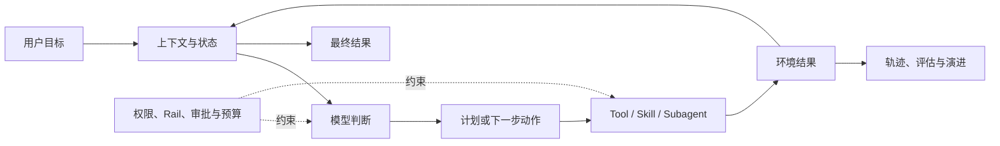
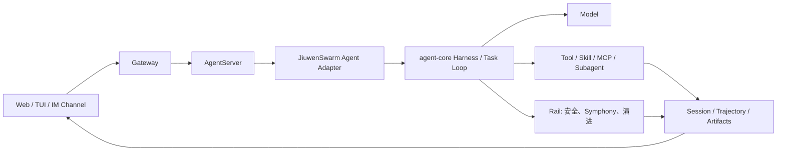
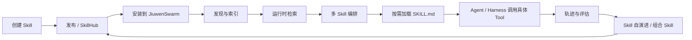
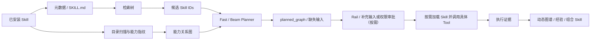

# 新同学架构导览：Agent、Skill 与 Symphony

> **目标**：帮助第一次参与 JiuwenSwarm 和 agent-core 开发的同学建立用于读代码、定位问题和判断改动边界的心智模型。
>
> **代码快照**：本文的仓库边界和 GitHub/GitCode 对比基于 2026-09-21 的明确 commit。动态分支会继续变化；排查具体问题时必须记录实际 commit，不能只写“最新 develop”。

---

## 1. 先记住五个结论

1. **JiuwenSwarm 是面向用户的 Agent 产品，agent-core 是可复用的 Agent SDK 和运行时底座。** 前者依赖后者，依赖方向不是双向的。
2. **Agent 不等于模型。** 一个可工作的 Agent 至少还需要任务循环、上下文、工具与 Skill、状态与记忆、权限与 Rail、工作区以及中断恢复机制。
3. **Skill 不是 Tool 的别名。** Tool 是可按结构化参数执行的原子动作；Skill 是告诉 Agent 如何完成一类任务的能力资产，可以组织多个 Tool、文件和步骤。
4. **Symphony 的产品主线确实是 Skill 检索与编排。** 检索回答“选谁”，编排回答“怎么连接”；真正执行 Skill 仍由 JiuwenSwarm 的 Agent/Harness 负责。
5. **代码能从 GitHub 阅读，不代表开发环境一定不访问 GitCode。** 当前 JiuwenSwarm 的 `pyproject.toml` 和 `uv.lock` 仍将 agent-core 固定到 GitCode URL，GitHub-only 环境要额外处理依赖源。

## 2. Agent 时代需要什么心智模型

传统聊天应用的核心链路是“输入 -> 模型 -> 文本输出”。Agent 系统多了一层持续做决定和产生外部副作用的执行循环：



因此，理解一个 Agent 特性时，不应只问“Prompt 写了什么”，还要同时看：

- 输入如何进入上下文，是否发生截断、压缩或按需披露；
- 模型能看到哪些 Tool 和 Skill，它们在什么时机被注册；
- Tool 调用前后有哪些 Rail、权限、超时和审批；
- 中断、补充输入、重试和恢复时，状态保存在哪里；
- 结果和副作用是否幂等，失败后会不会留下半完成状态；
- 执行轨迹如何记录，后续如何评估、复现和改进。

### 2.1 常见概念不要混用

| 概念 | 可以把它理解成 | 主要职责 | 不负责什么 |
| --- | --- | --- | --- |
| Model | 推理引擎 | 根据上下文决定下一步 | 自己不会访问文件、网络或业务系统 |
| Tool | 带参数契约的动作 | 执行查询、写文件、调用 API 等原子操作 | 不天然包含完整任务方法论 |
| Skill | 可复用的任务能力资产 | 告诉 Agent 在某类任务中如何选择工具、组织步骤和验收结果 | 不一定是独立可执行函数 |
| MCP | 外部能力接入协议 | 用标准协议向 Agent 暴露 Tool、Resource 或服务 | 不等同于某个具体业务系统的接入实现 |
| Connector | 外部系统适配实现 | 把特定服务、账号或 API 转换为 Agent 可用能力；可以基于 MCP，也可以直接调用 API | 本身不是通用协议，也不替代 Agent 的决策循环 |
| Agent | 带状态的执行主体 | 循环决策、调用能力、处理中断并交付结果 | 不等同于一次模型请求 |
| Agent Team | 多个 Agent 的协作结构 | 角色分工、任务委派、消息与结果汇聚 | 不等同于多调用几个 Tool |
| Memory | 跨轮次或跨会话信息 | 保存用户事实、项目知识和历史经验 | 不应无边界地塞进当前上下文 |
| Rail | 生命周期控制与治理钩子 | 在模型、Tool、会话等阶段实施约束、观测和演进 | 不承担具体业务能力 |
| Trajectory | 可追溯、可用于回放或复现的执行证据 | 记录模型、Tool、Skill、错误和状态变化 | 不保证在缺少版本快照或外部状态变化后仍能完全复现 |

### 2.2 固定 Workflow 与 Agent 编排的区别

- **Workflow** 通常事先定义节点和边，适合流程稳定、输入输出契约明确的场景。
- **Agent** 在运行时根据上下文选择下一步，适合开放任务和不确定环境。
- **Symphony 编排** 位于两者之间：它根据当前任务和已安装 Skill 生成一张建议执行图，但后续仍由 Agent 根据输入、权限和运行结果继续决策。

## 3. openJiuwen 仓库分层

[openJiuwen GitHub 组织](https://github.com/openJiuwen-ai) 将生态划分为 DeepAgents、Agent Framework、分布式 Runtime、协议、记忆和 SkillHub 等层。新同学不需要一开始读完所有仓库，先理解下面几层即可。

| 层 | 代表仓库 | 主要回答的问题 |
| --- | --- | --- |
| 产品 / DeepAgent | [`jiuwenswarm`](https://github.com/openJiuwen-ai/jiuwenswarm) | 用户如何接入、配置和使用 Agent；多 Agent、Skill、频道和 UI 如何组合成产品 |
| Agent SDK / Harness | [`agent-core`](https://github.com/openJiuwen-ai/agent-core) | Agent、Tool、Workflow、Session、Harness、Team、评估与演进如何实现 |
| Skill 托管与分发 | [`skillhub`](https://github.com/openJiuwen-ai/skillhub) | Skill 如何发布、搜索、安装、共享和版本管理 |
| 长期记忆 | [`agent-memory`](https://github.com/openJiuwen-ai/agent-memory) | 跨会话知识和记忆如何抽取、检索与持久化 |
| 互操作协议 | [`agent-protocol`](https://github.com/openJiuwen-ai/agent-protocol) | MCP、A2A、注册发现等跨系统协议如何实现 |
| 服务化运行 | [`agent-runtime`](https://github.com/openJiuwen-ai/agent-runtime) | Agent 如何部署、隔离、扩缩容和管理生命周期 |

本项目中最常见的关系是：

```text
jiuwenswarm（产品与 Host）
    └── 依赖 openjiuwen Python 包
            └── 来自 agent-core（SDK、Harness、Symphony 核心）
```

## 4. 一次用户请求如何穿过系统

理解目录结构最有效的方法不是背文件树，而是追一条真实请求。



对应的主要代码入口：

| 阶段 | JiuwenSwarm | agent-core |
| --- | --- | --- |
| 用户接入 | `jiuwenswarm/channels/` | 可选协议与 Tool 基础类型 |
| 消息路由 | `jiuwenswarm/gateway/` | Session、消息等公共契约 |
| 产品 Runtime | `jiuwenswarm/server/` | `openjiuwen/core/` |
| Agent 接入 | `jiuwenswarm/server/runtime/agent_adapter/` | `openjiuwen/harness/` |
| Tool / Skill | `jiuwenswarm/agents/harness/common/tools/`、`jiuwenswarm/server/runtime/skill/` | `openjiuwen/core/foundation/tool/`、`openjiuwen/core/single_agent/skills/`、`openjiuwen/harness/tools/skills/` |
| 生命周期治理 | `jiuwenswarm/agents/harness/common/rails/` | `openjiuwen/harness/rails/` |
| 多 Agent | `jiuwenswarm/agents/swarm/` | `openjiuwen/agent_teams/` |
| 演进与评估 | JiuwenSwarm 产品 Adapter | `openjiuwen/agent_evolving/`、`openjiuwen/symphony/` |

排查问题时先确定失败发生在哪一层。例如：

- UI 没展示，不代表 core 没返回；先查 Web 事件和 Adapter。
- Tool 没注册，不代表 Tool 实现有问题；先查配置快照和 Agent 初始化。
- Skill 被检索到但没有执行，不代表检索错误；还要看编排、输入检查、权限和执行 Rail。
- 磁盘文件正确，不代表当前会话已经加载；还要看 Session 冻结的快照和版本。

## 5. Skill 的完整生命周期

“Skill 检索、分发、编排”经常被放在一起说，但它们属于不同阶段。



| 阶段 | 负责组件 | 核心结果 |
| --- | --- | --- |
| 创建 | 开发者、Skill creator、模板 | `SKILL.md`、脚本、资源和元数据 |
| 托管与分发 | SkillHub、JiuwenSwarm Skill 管理 | 可搜索、可安装、可升级的 Skill 版本 |
| 发现 | JiuwenSwarm Skill Manager、Symphony discovery | 当前运行环境真正可用的 Skill 清单 |
| 检索 | Symphony retrieval | 与当前任务相关的候选 Skill IDs |
| 编排 | Symphony orchestration | 多 Skill 的 `planned_graph` 和缺失输入 |
| 加载 | `skill_tool` | 安全读取选中 Skill 的 `SKILL.md` 和资源，将说明返回给模型 |
| 执行 | Agent/Harness、具体 Tool 或脚本 | 按 Skill 说明产生实际 Tool 调用、文件和业务副作用 |
| 观测 | Trajectory、Symphony observation | 真实执行图、成功失败和证据 |
| 演进 | Skill evolution、Symphony flow | 单 Skill 经验或可安装的组合 Skill/Skill Pack |

### 5.1 “分发”有两种含义

- **资产分发**：把 Skill 发布到 SkillHub，再下载安装到运行环境。
- **运行时分发 / dispatch**：面对一个任务，从本地已安装能力中选择合适 Skill，必要时交给 Agent 或 Team 执行。

讨论需求时必须说明是哪一种，否则很容易把 SkillHub、Symphony 和 Agent Team 的职责混在一起。

### 5.2 为什么不能把所有 Skill 都塞给模型

Skill 数量增加后，完整注入会占用上下文并分散模型注意力。因此当前实现采用渐进披露：

- 候选较少时，可以给当前会话一份完整但精简的能力快照；
- 候选较多时，使用分类索引和 `skill_index` 按需浏览或搜索；
- 只有准备执行某个 Skill 时，才读取该 Skill 的详细 `SKILL.md`；
- 编排只接收收敛后的候选 ID，不应把整个目录再次塞给模型。

这既是检索设计，也是 Agent 的上下文工程。

## 6. Symphony：检索用树，编排用图

### 6.1 给小白的一句话

Symphony 是 Agent 的“能力调度参谋”：先从大量已安装 Skill 中找到合适候选，再判断这些 Skill 的输入输出能否连接，生成一条可解释的执行路线。

它主要回答两个问题：

- **Skill 检索：选谁？**
- **Skill 编排：怎么配合？**

它不直接替代 Skill 执行器。

### 6.2 主链路



- **树**适合从大规模候选中逐层缩小范围。
- **图**适合表达 `A` 的输出能否作为 `B` 的输入，即 `can_feed` 关系。
- **Planner** 根据任务、候选能力、已有输入和图关系生成本次任务的执行图。
- **动态图谱与 Flow** 从真实轨迹中积累证据，但静态相关性和真实成功率不能混为一谈。

当前 JiuwenSwarm 面向 Agent 的主要检索入口是 `skill_index`；编排工具是：

- `symphony_read_graph`
- `symphony_refresh_graph`
- `symphony_compose_graph`

### 6.3 Symphony 不只有检索和编排

从 agent-core 的领域模型看，Symphony 还包括：

- discovery：发现显式传入的能力资产；
- fingerprint：提取语义画像、输入输出和标签；
- evaluation：评估能力质量和执行效果；
- observation：接收带版本快照的真实执行证据；
- experience：从轨迹中构建可检索经验；
- flow：从成功组合中沉淀 Recipe、评审并生成组合 Skill/Skill Pack。

因此，“检索 + 编排”适合作为用户侧简介；研发侧应理解成“能力资产发现、选择、组合、观测和演进”的闭环。

## 7. 为什么 Symphony 分在两个仓库

### 7.1 agent-core：通用领域实现

核心目录是 `agent-core/openjiuwen/symphony/`：

```text
openjiuwen/symphony/
├── discovery/              # 能力发现；directory_toolkit 提供 skill_index
├── agent/                  # 索引构建、状态、取消及兼容检索 Toolkit
├── shared/fingerprint/     # 能力指纹和 IO 归一化
├── retrieval/              # 检索树构建与查询
├── orchestration/          # 关系图、Fast/Beam Planner、执行图
├── observation/            # 动态图谱观测契约
├── flow/                   # 经验 Recipe、评审、组合能力打包
├── experience/             # 轨迹经验库
├── evaluation/             # 能力和轨迹评估
├── interfaces/ + models/   # 公共契约
├── graph_engine.py
└── runtime.py
```

`openjiuwen/harness/rails/evolution/symphony_*.py` 负责在 Harness 生命周期中捕获 Skill 执行窗口及其底层 Tool、Subagent 轨迹，形成可提交给 Symphony 的证据；当前动态图谱的候选关系边以 Skill ↔ Skill 为主。

agent-core 只接受调用方显式注入的能力、模型、配置和产物目录。它不读取 JiuwenSwarm 的内部配置，不决定 Skill 安装位置，也不负责产品 UI。

### 7.2 JiuwenSwarm：产品 Host 与 Adapter

主要目录是 `jiuwenswarm/jiuwenswarm/symphony/`：

- `adapter.py`：把 JiuwenSwarm 配置、Skill 和模型映射为 agent-core 契约；
- `build.py`：协调扫描、指纹、图谱构建、进度和 checkpoint；
- `service.py`：提供图谱状态、刷新、规划、经验候选和安装等产品门面；
- `skill_retrieval/runtime.py`：将实时已安装 Skill 和索引目录绑定到 core Toolkit；
- `evolution/`、`experience.py`：连接会话轨迹、组合能力通知和产品安装流程；
- `graph_state.py`、`graph_storage.py`：处理产品侧状态和落盘位置。

外围接入包括：

- `jiuwenswarm/agents/harness/common/tools/skill_retrieval_toolkits.py`
- `jiuwenswarm/agents/harness/common/tools/symphony_toolkits.py`
- `jiuwenswarm/agents/harness/common/rails/symphony/`
- `jiuwenswarm/server/runtime/skill/skill_manager.py`
- `jiuwenswarm/server/runtime/agent_adapter/`
- `jiuwenswarm/channels/web/frontend/src/components/SkillGraphPanel/`

### 7.3 两个仓库的真实关系

```text
JiuwenSwarm 配置 / 已安装 Skill / 会话模型 / UI
                         |
                      Adapter
                         v
              openjiuwen.symphony
                         |
                 领域结果与产物
                         v
      JiuwenSwarm Tool / Rail / RPC / UI / Skill 执行
```

- 依赖方向是 `jiuwenswarm -> agent-core`。
- agent-core 的 Symphony 代码不 import JiuwenSwarm。
- JiuwenSwarm 不是另一套 Symphony 引擎，而是产品 Adapter 和生命周期接入。
- 通用算法、公开契约和跨产品能力应进入 agent-core；产品配置、UI、安装和会话行为应留在 JiuwenSwarm。

这套边界是逐步迁移形成的：编排、experience、fingerprint、evaluation 和 retrieval 的通用实现曾主要位于 JiuwenSwarm，之后迁入 agent-core；JiuwenSwarm 清理重复代码后保留薄 Adapter。

### 7.4 修改代码时放在哪里

| 需求 | 优先仓库 |
| --- | --- |
| 修改检索算法、分类树、图协议、Planner、Fingerprint | agent-core |
| 修改公开 Capability/Symphony 契约 | agent-core，并同步做消费方兼容验证 |
| 修改 JiuwenSwarm 的配置、默认路径、模型选择、UI 或 RPC | jiuwenswarm |
| 修改已安装 Skill 的扫描、禁用和安装行为 | 通常在 jiuwenswarm Adapter/Skill Manager；通用扫描协议在 agent-core |
| 修改 Skill 的真正执行过程 | JiuwenSwarm Agent/Harness 接入或 agent-core Harness，不应塞进 Symphony Planner |
| 修改执行证据、动态图谱、组合 Skill | 先判断是通用协议还是产品安装行为，通常需要跨 repo 修改 |

跨 repo 特性不能只跑 core 单测。至少要验证：

1. agent-core 提供方契约；
2. JiuwenSwarm 真实 Adapter 和产品入口；
3. 最终 wheel/桌面包中的跨进程和 UI 可见结果。

## 8. GitHub 与 GitCode 的实际差异

### 8.1 2026-09-21 快照与同步窗口

截至 2026-09-21 23:04（UTC+8），比较对象均为 `develop`：

| Repo | GitCode HEAD | GitHub HEAD | 当前关系 |
| --- | --- | --- | --- |
| jiuwenswarm | `02b37f47f`，21:27:14 | `02b37f47f`，21:27:14 | commit 和代码树一致，ahead/behind 为 `0/0` |
| agent-core | `e23806c10`，16:52:58 | `e23806c10`，16:52:58 | commit 和代码树一致，ahead/behind 为 `0/0` |

因此，**本次最终复查时两个仓库没有代码差异**。但同一天较早的两次观测记录到了临时同步窗口：

- JiuwenSwarm：GitCode 一度停在 `e0d1affee`（15:56:05），GitHub 已到 `af73f666d`（17:03:50），GitHub 快进领先 5 commits；首尾提交时间跨度约 1 小时 8 分。该窗口的代码差异为 26 个文件，增加 1233 行、删除 52 行，主要涉及桌面端关闭行为、认证和 Session 修复，没有 Symphony 路径差异。
- agent-core：GitCode 一度停在 `92eb535ba`（2026-09-20 14:54:08），GitHub 已到 `e23806c10`（2026-09-21 16:52:58），GitHub 快进领先 1 commit；提交时间跨度约 26 小时。该窗口涉及 22 个文件，增加 1183 行、删除 92 行，其中 Symphony/Harness 相关源码为 15 个文件、增加 563 行、删除 46 行。
- 随后的复查中 GitCode 已追平 GitHub，说明这里看到的是**镜像同步延迟**，不是长期分叉。

这里的“约 1 小时 8 分”和“约 26 小时”只是领先提交的时间跨度，不是镜像耗时。由于没有持续记录同一 commit 首次出现在两端的准确时刻，本次证据只能说明当时存在落后窗口、19:57 前已经追平，且 23:04 再次复查时仍保持同步；无法据此推导同步 SLA。开发时仍应记录两边实际 commit，而不是假设实时同步。

### 8.2 新同学能否只使用 GitHub

**读代码和跟踪 develop 可以。** 本次最终复查时两边 `develop` 完全一致；即使处于今天观察到的临时同步窗口，GitHub 也没有落后。

**直接搭建 JiuwenSwarm 开发环境仍有风险。** GitHub 版 JiuwenSwarm 的以下位置仍指向 GitCode：

- `pyproject.toml` 中的 `openjiuwen` 依赖；
- `[tool.uv.sources]` 中的 agent-core URL；
- `uv.lock` 中锁定的 agent-core source；
- 部分 AutoHarness 默认 repo URL、安装文档和贡献链接。

JiuwenSwarm 当前固定的 agent-core commit 是：

```text
b6db2733bb9119f3b2e137969baca18d69b9f4c6
```

该 commit 已确认可以直接从 GitHub fetch，因此问题主要是 URL，而不是 GitHub 缺少对应代码。

还要注意，JiuwenSwarm 的固定版本 `b6db2733b` 与本次用于阅读架构的 agent-core GitHub `develop`（`e23806c10`）已经分叉：以前者和后者比较时，两侧分别有 7 和 8 个独有提交，共同祖先为 `782fda5a`。因此，“阅读两个仓库最新 develop”不等于“验证 JiuwenSwarm 当前固定依赖的真实组合”；联调最新 core 时必须显式 override，并完成 JiuwenSwarm 消费方回归。

短期个人环境可以在确认所需仓库和分支都已镜像后，通过 Git URL rewrite 将 openJiuwen 的 GitCode 地址映射到 GitHub：

```bash
git config --global \
  url."https://github.com/openJiuwen-ai/".insteadOf \
  "https://gitcode.com/openJiuwen/"
```

验证完成后如不再需要，可以删除该规则：

```bash
git config --global --unset-all \
  url."https://github.com/openJiuwen-ai/".insteadOf
```

注意：这是全局 Git 配置，会影响所有 `openJiuwen` GitCode URL。某些 GitCode 专有分支或尚未镜像的仓库可能在 GitHub 不存在，因此它只能作为临时 workaround，不应替代项目级修复。

更稳妥的项目方案是：

1. 将 GitHub 作为公开依赖源，或提供可配置的 mirror/source；
2. CI 增加“只允许访问 GitHub”的 clean install；
3. 文档和脚本同时提供 GitHub 链接；
4. 发布包尽量依赖正式版本，而不是依赖某个代码托管站点的裸 commit。

### 8.3 复查镜像差异的方法

不要只比较页面上的最后更新时间，应验证提交关系和代码树：

```bash
# 假设 GitCode remote 名为 upstream
git fetch upstream +develop:refs/remotes/upstream/develop
git fetch https://github.com/openJiuwen-ai/<repo>.git \
  develop:refs/remotes/github/develop

# 左侧是 GitCode 独有提交数，右侧是 GitHub 独有提交数
git rev-list --left-right --count \
  upstream/develop...github/develop

# 用退出码判断祖先关系；普通 merge-base 只打印共同祖先，不能证明快进
git merge-base --is-ancestor upstream/develop github/develop
git merge-base --is-ancestor github/develop upstream/develop

# 比较最终代码，而不只比较 commit 数
git diff --shortstat \
  upstream/develop..github/develop
```

第一条 `--is-ancestor` 成功而第二条失败，表示 GitHub 快进领先；反之表示 GitCode 快进领先；两条都失败表示已经分叉。两个平台若会重写或同步 commit，commit 数仍可能夸大差异，最终还要看 tree diff 和关键目录 diff。

## 9. 新同学第一周建议阅读顺序

### 9.1 第一层：必须先懂

1. [智能体与工作区](智能体.md)：Agent 的基本组成和工作目录。
2. [技能系统](技能.md)：Skill 的安装、挂载和使用边界。
3. [Harness](Harness.md)：Agent 执行循环、Tool、Rail 和状态如何组合。
4. [工具权限与安全防护](工具权限与安全防护.md)：外部副作用如何被约束。
5. [上下文压缩](上下文压缩.md)：为什么上下文是稀缺资源。

### 9.2 第二层：按功能深入

- Skill 选择与组合：[Symphony：技能编排与智能分发](Symphony-技能编排与分发.md)
- 单 Skill 持续改进：[Skill 自演进](Skill自演进.md)
- 多 Agent 协作：[Agent Team](AgentTeam.md) 和 [分布式 Team](分布式Team.md)
- 状态与知识：[记忆系统](记忆.md)、[自动记忆](自动记忆.md)、[经验记忆](经验记忆.md)
- 外部能力接入：[MCP 配置](MCP配置.md)、[A2A](A2A.md)、[E2A](E2A-protocol.md)

### 9.3 第三层：用一条真实任务读代码

建议选择一个“检索两个 Skill、编排、执行并返回文件”的任务，依次记录：

1. Channel 收到的请求和 session ID；
2. Agent Adapter 构造的配置、模型和 Tool 列表；
3. Harness 的 invoke、model call 和 tool call；
4. `skill_index` 返回的候选；
5. `symphony_compose_graph` 返回的 `planned_graph`；
6. `skill_tool` 实际加载了哪个 Skill 的说明和资源；
7. Agent 随后调用了哪些具体 Tool 或脚本，以及产生了哪些副作用；
8. 中断、审批、错误和最终产物如何进入轨迹；
9. UI 展示读取的是哪一个事件和持久化版本。

读通这一条链路，比先阅读所有目录更容易建立整体理解。

## 10. Agent 时代最值得优先掌握的工程问题

### 10.1 P0：所有 Agent 开发者都应掌握

1. **上下文工程**：上下文不是日志仓库。要理解快照、渐进披露、压缩、缓存和版本一致性。
2. **副作用与安全**：Tool 可能发送消息、修改文件和调用生产系统。权限、审批、沙箱、幂等和 request ID 是主流程，不是附加功能。
3. **中断与恢复**：Agent 经常等待用户输入或外部任务。暂停、取消、超时、恢复和重复请求必须有明确语义。
4. **可观测与评估**：只看最终回答无法定位 Agent 失败。需要轨迹、Tool 参数、版本快照、错误归因和可复现 evaluation case。
5. **状态分层**：当前上下文、Session 状态、长期 Memory、Artifact 和外部系统状态必须分开管理。
6. **能力资产版本化**：Skill、Tool schema、Prompt、模型、检索索引和图谱都可能变化；执行证据必须能指回当时的版本。

### 10.2 P1：复杂 Agent 系统需要掌握

1. **多 Agent 协作**：任务拆分、角色边界、消息拓扑、共享工作区和失败汇聚。
2. **能力发现与编排**：检索相关性不等于可执行性，语义相关不等于输入输出可衔接。
3. **经验与演进**：偶发模型噪声不能直接变成长期规则；经验要有证据、评估、审核和回滚。
4. **协议与生态**：MCP、A2A、E2A 解决的是不同边界，不能用一个“Agent 协议”笼统代替。
5. **交付形态**：源码进程、CLI、wheel、EXE/DMG 和分布式部署的启动、路径、状态通知可能不同。

### 10.3 P2：按职责选读

- 前端和频道适配；
- 桌面打包与自动更新；
- 分布式 Runtime 和资源调度；
- 特定模型 Provider、Embedding 和存储后端；
- Benchmark、RL 和离线优化。

这种分层能避免新同学一开始被大量功能名淹没，同时不会漏掉 Agent 系统真正决定可靠性的关键机制。

## 11. 文档维护建议

当前文档体系已经覆盖大量功能，但面向研发 onboarding 仍建议持续做以下调整：

1. **把“用户使用文档”和“研发架构文档”分开。** 用户文档说明如何开启功能；研发文档说明调用链、状态、契约和代码归属。
2. **为跨 repo 文档记录 commit 矩阵。** 至少写明 JiuwenSwarm commit、agent-core pin、运行形态和产物来源。
3. **减少容易过时的工具名复制。** 工具列表应尽量由公开 ToolCard 或测试生成；本次已清理主要入口中的历史命名，后续应通过检查避免再次漂移。
4. **以真实入口画链路。** 不只展示 core 类图，还要覆盖 Channel、Gateway、Agent Adapter、Harness、UI 和持久化产物。
5. **增加失败路径。** 每个主流程至少说明缺配置、索引过期、模型失败、中断恢复、权限拒绝和重复请求。
6. **让架构结论可验证。** 文档中的路径、命令和接口应由 CI 或 smoke check 定期验证。
7. **建立 GitHub-only 门禁。** 公开仓库既然面向 GitHub 用户，安装、文档链接、默认 repo URL 和依赖解析都应能在不访问 GitCode 时完成。

## 12. 相关文档

- [开发者指南](developer_guide.md)
- [Symphony：技能编排与智能分发](Symphony-技能编排与分发.md)
- [技能系统](技能.md)
- [Harness](Harness.md)
- [Agent Team](AgentTeam.md)
- [Skill 自演进](Skill自演进.md)
- [工具权限与安全防护](工具权限与安全防护.md)

---

## 返回导航

- [返回文档首页](../README.md)
- [返回项目首页](../../README_CN.md)
