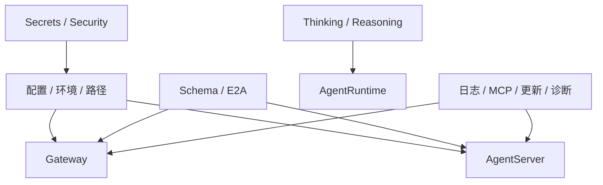
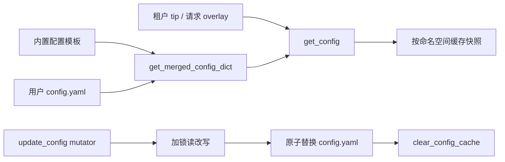
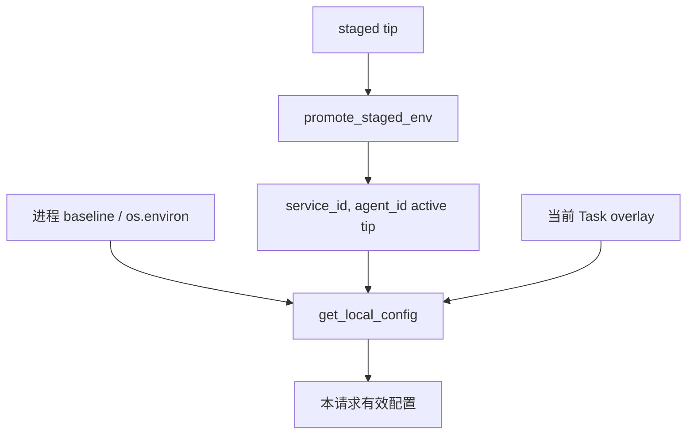
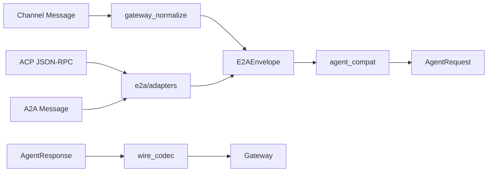
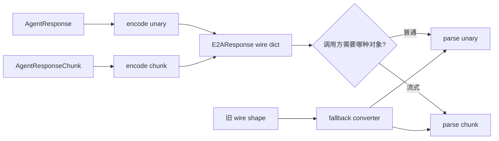
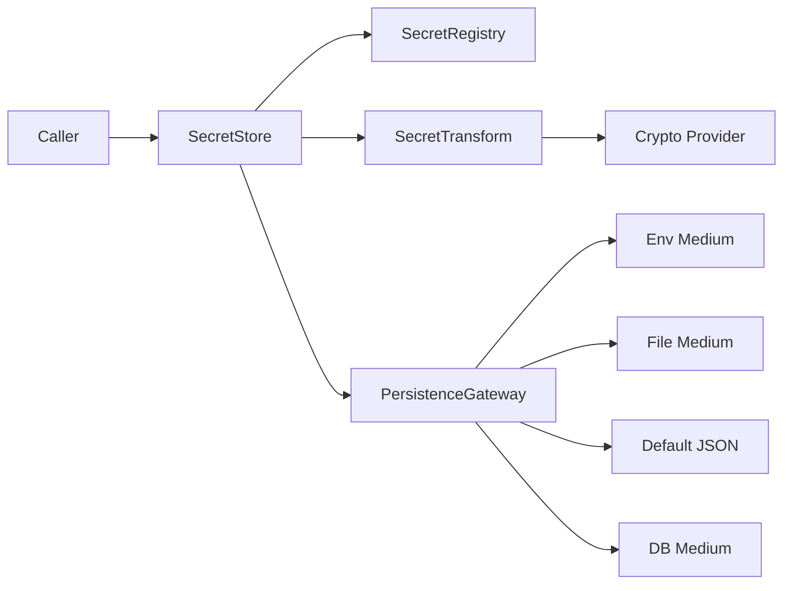
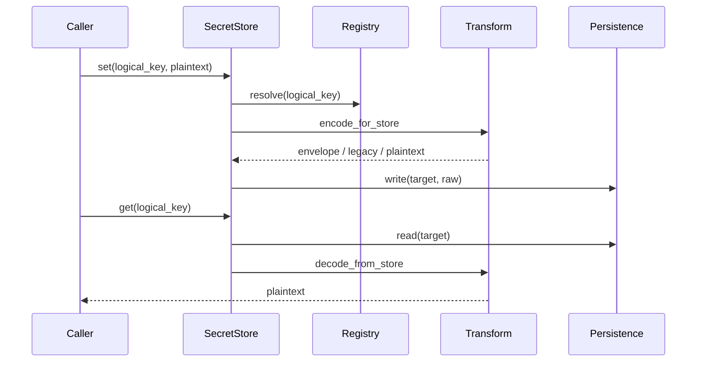
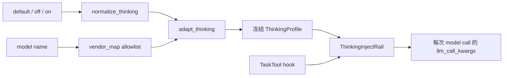

# JiuWenSwarm Common 模块讲解

## 1. 文档范围与代码基线

本文档讲解 `jiuwenswarm/common/**/*.py`，覆盖 `common` 根目录及 `e2a/`、`schema/`、`secrets/`、`security/`、`thinking/` 中的全部 Python 文件，不展开这些公共能力在 Gateway、AgentServer 和 CLI 中的具体业务调用。

代码基线：

- 分支：`dev-stable`
- 提交：`dc3a5e8519bdf3babdf91719ee48faa95d614c8a`
- 提交时间：`2026-09-05 17:32:09 +0800`
- 提交说明：`!6057 merge skill_acceleration_exec_0904 into dev-stable`
- Python 文件数：79

目录按职责概括如下：

```text
jiuwenswarm/common/
├── *.py                    # 配置、路径、诊断、MCP、更新等共享基础设施
├── e2a/                    # E2A 信封、wire codec、ACP/A2A 适配
│   └── acp/                # ACP 初始化、会话更新与工具更新
├── schema/                 # Agent、Message、AskUser 等跨模块数据契约
├── secrets/                # 逻辑密钥、加密转换和多介质持久化
│   ├── persistence/
│   └── providers/
├── security/               # 通用加密接口与 WebSocket Origin 校验
└── thinking/               # Thinking 语义、厂商映射及运行时注入
```

## 2. 模块总体作用

`common` 是 Gateway、AgentServer、CLI 和实例管理共同依赖的基础层。它不组织完整业务请求，而是统一配置、工作区路径、环境隔离、协议模型、安全规则、密钥存储、模型 Thinking 参数和升级机制，防止不同进程各自实现不一致的规则。

### 2.1 职责分组

| 模块组 | 文件范围 | 解决的问题 |
|---|---|---|
| 配置与环境 | `config.py`、`local_env_config.py`、`utils.py` | 配置从哪里读取、如何按租户隔离、数据目录在哪里 |
| 请求与运行辅助 | `request_*`、`hooks_config.py`、`stage_timer.py`、`tool_*` | 请求上下文、Hook、计时和工具归属如何保持一致 |
| 网络与集成 | `http_proxy_config.py`、`mcp_config.py`、`ws_*` | 代理、MCP、WebSocket 限制和诊断 |
| 模型参数 | `reasoning_*`、`thinking/`、`openrouter_attribution.py` | 统一语义如何映射到厂商请求字段 |
| 协议与模型 | `e2a/`、`schema/` | Gateway、AgentServer、ACP、A2A 之间传什么数据 |
| 密钥与安全 | `secrets/`、`security/` | 敏感值如何定位、加密、存储和校验来源 |
| 运维与生命周期 | `cleanup.py`、`debug_dump.py`、`updater*`、`upgrade_executor.py` | 运行数据清理、故障诊断和升级重启 |

### 2.2 依赖方向



`config.py`、`local_env_config.py` 和 `utils.py` 是基础设施中心；`e2a/` 与 `schema/` 定义跨进程协议；`secrets/` 和 `security/` 管理敏感信息与握手安全；`thinking/`、`reasoning_config.py` 和 `reasoning_injector.py` 处理模型厂商差异。

公共层的正常依赖方向是“具体服务依赖 common”。其中部分公共文件会读取配置或路径，但不会反向创建完整 Gateway/AgentServer。`mcp_call_timeout_patch.py`、`openjiuwen_rail_compat.py` 等兼容模块虽然会接触第三方 SDK，也只在调用方显式安装时修改运行时行为。

### 2.3 状态与副作用

| 类型 | 代表模块 | 状态或副作用 |
|---|---|---|
| 纯模型/转换 | `schema/`、`e2a/models.py`、`chat_final.py` | 只转换传入对象 |
| 进程内上下文 | `local_env_config.py`、`request_ext.py` | ContextVar、命名空间缓存和 staged/active 状态 |
| 文件持久化 | `config.py`、`utils.py`、`secrets/persistence/*` | YAML、JSON、`.env`、工作区目录 |
| 网络访问 | `http_proxy_config.py`、`version_source.py`、`mcp_config.py` | HTTP 请求、连通性探测、MCP 会话 |
| 运行时补丁 | `mcp_call_timeout_patch.py`、`openjiuwen_rail_compat.py` | 幂等包装 openJiuwen 入口 |
| 后台任务/进程 | `cleanup.py`、`updater.py`、`updater_restart_helper.py` | 清理循环、下载任务、升级与重启 |

理解这一区分很重要：并非所有 `common` 文件都是无状态函数。例如配置、请求环境、SecretStore 和更新器都有缓存或持久化语义，调用方应使用公开入口完成清理或热更新。

## 3. 基础配置与运行工具

### 3.1 本组文件分工

这一组共有 38 个 Python 文件，跨度从路径函数到升级器。可按调用频率和副作用进一步理解：

| 子类 | 代表文件 | 特点 |
|---|---|---|
| 高频基础 | `config.py`、`utils.py`、`local_env_config.py` | 多进程共同依赖，包含缓存和文件读写 |
| 请求级工具 | `request_ext.py`、`request_identity.py`、`stage_timer.py` | 作用域局限于当前请求或当前任务 |
| 外部集成 | `mcp_config.py`、`http_proxy_config.py` | 访问外部服务，需要连接或超时策略 |
| 兼容与展示 | `chat_final.py`、`tool_display.py`、`openjiuwen_*` | 规范协议语义或适配 SDK 差异 |
| 运维 | `cleanup.py`、`debug_dump.py`、`updater*` | 低频执行，但会操作文件、任务或进程 |

### `__init__.py`

这是 `common` 包的边界文件，本身不执行初始化。公共能力按配置、协议、数据模型、密钥、安全和 Thinking 等模块分别导入。

当前文件为空，因此 `import jiuwenswarm.common` 不会读取 `config.yaml`、创建工作区或安装 SDK 补丁。调用方必须从具体模块显式导入，这避免基础包导入产生跨进程副作用。

### `chat_final.py`

该文件统一补齐 `chat.final` 的结束语义。`annotate_chat_final()` 给最终 payload 标注结束模式，`ensure_final_mode_inplace()` 保证原对象中存在该字段；模型只有 reasoning 而没有正文时，`fill_reasoning_only_empty_final_content()` 使用 `reasoning_only_empty_reply_fallback_text()` 生成可展示文本。

结束模式包含 `patch_segment`、`replace_turn` 和 `append`，用于告诉前端最终正文应覆盖、修补还是追加已有流式内容。补文函数只处理存在 reasoning、最终 content 为空且此前没有可见流式正文的场景，不会覆盖模型已经给出的内容，并按中英文返回兜底提示。

### `cleanup.py`

该文件周期清理用户工作区中的过期运行数据。`cleanup_old_sessions()` 按保留天数删除旧会话，`cleanup_orphan_file_ops()` 清理失去会话归属的文件操作日志，`run_cleanup()` 汇总一次执行；`cleanup_loop()` 和 `start_background_cleanup()` 把该过程接入后台周期任务。

默认保留期为 30 天，后台循环首次延迟 10 分钟，之后每 24 小时执行一次，避免服务刚启动就在热路径上扫描磁盘。删除由线程执行以免阻塞事件循环；清理结果按会话和孤立记录分类统计，单项失败记录日志但不应终止长期循环。

### `coding_memory_paths.py`

该文件统一生成项目级 Coding Memory 路径。`resolve_coding_memory_project_name()` 生成稳定目录名，`resolve_project_coding_memory_dir()` 返回宿主机目录，`resolve_project_coding_memory_workspace_path()` 返回 Agent 工作区视角下的路径，避免两种路径语义混用。

没有项目目录时统一使用 `default`。有项目时由规范化项目路径得到稳定名称，使同一项目跨会话复用记忆；宿主机路径用于真实文件 I/O，workspace 路径用于传给运行在 Agent 工作区语义下的工具，两者不能互换。

### `config.py`

这是 JiuWenSwarm 的主配置服务。`get_merged_config_dict()` 合并内置模板与用户 override，`resolve_env_vars()` 解析环境变量占位符，`get_config()` 按环境命名空间缓存最终快照；热更新通过 `clear_config_cache()` 使对应缓存失效。

配置写入统一经过 `update_config()` 的跨进程互斥读改写，并由 `load_yaml_round_trip()`、`dump_yaml_round_trip()` 保留 YAML 注释与格式。文件后半部分按领域提供模型、权限、MCP、团队、记忆、A2UI、沙箱和更新器等配置的查询及局部更新，使调用方无需自行操作 YAML 树。

读取链路不仅合并模板与用户 override，还会按当前 `(service_id, agent_id)` 环境命名空间和请求 overlay 形成缓存键，并通过文件时间戳识别磁盘变化。读取失败有有限重试；写入采用锁、round-trip YAML 和原子替换，随后使相关缓存失效。



文件后半部分的大量 `get_*`、`update_*` API 是刻意设置的领域边界：权限规则、模型列表、Team、MCP、沙箱或记忆配置应通过这些入口校验和迁移，而不应由 handler 直接修改 YAML 字典。

### `context_keys.py`

该文件集中定义 runtime callback/context 字典使用的共享键。Adapter、Rail 和工具通过这些常量传递请求标识、会话和元数据，文件本身没有执行函数。

当前基线定义 `JIUWENSWARM_CHANNEL_CONTEXT_KEY="__jiuwenswarm_channel__"`。集中常量可以防止生产者和消费者分别硬编码不同字符串；该键属于内部上下文协议，不应直接作为面向客户端的 wire 字段。

### `cron_team_completion.py`

该文件是 Gateway 与 AgentServer 共用的 Cron 团队轮次归约器。`new_cron_team_round_state()` 创建状态，`apply_cron_team_round_event()` 将团队任务、成员和工作流事件归入状态；`cron_team_round_should_end()` 结合开放任务、活跃成员、结果文本和委派宽限事件判断本轮是否结束。

归约状态会跟踪开放任务、活跃成员、leader 最终文本、harness/workflow 完成情况和单人 harness 的延迟结束条件。对“leader 暂无总结”等占位文本单独识别，避免仅收到模板化 final 就过早判定 Cron 轮次完成。

```text
事件流 → apply_cron_team_round_event → 聚合轮次状态
                                   → open tasks?
                                   → active members?
                                   → meaningful result?
                                   → delegation grace drained?
                                   → should_end
```

### `debug_dump.py`

该文件用于诊断协程停顿和死锁。`dump_async_state()` 把线程栈、asyncio task 及其等待的锁、事件和队列写入诊断文件，`install_async_dump_handler()` 注册触发入口；内部 `_collect_async_objects()`、`_write_tasks()` 与 `_write_waiting_primitives()` 分别收集和格式化运行状态。

dump 同时覆盖线程和 asyncio 两个层面：线程栈用于发现同步阻塞，Task 栈用于看协程停在哪里，等待原语与 Queue 状态用于判断锁竞争、事件未置位或生产消费停滞。安装函数面向不同服务名生成诊断文件；采集失败返回 `None` 或记录错误，不应让排障工具反过来终止服务。

### `file_transfer_config.py`

该文件定义 Gateway 与 AgentServer 分片传输的共享配置。`FileTransferConfig` 保存开关、分片大小、超时和目录，并通过 `from_dict()`、`to_dict()` 转换；`get_file_transfer_config()` 合并并缓存配置，`resolve_file_transfer_enabled()` 判断功能是否生效，`clear_file_transfer_config_cache()` 供热更新清理缓存。

配置对象是两端协议的共同契约：分片大小影响发送与接收，最大文件大小决定 start 阶段能否接受，`transfer_timeout` 控制传输进度过期，`cleanup_interval` 与 `cleanup_age` 控制清理频率和文件保留时间，`max_concurrent_transfers` 限制并发数。解析时对缺失值使用默认配置，调用方不应各自读取 YAML，以免 Gateway 与 AgentServer 对同一文件得出不同分片规则。

### `file_transfer_types.py`

该文件定义分片传输两端共用的数据结构。`FileTransferStartParams` 表示开始请求，`TransferProgress` 保存进度；`safe_filename()` 去除路径和危险字符，`guess_mime_type()` 根据文件名推断内容类型。

`TransferProgress` 保存 transfer id、文件名、期望大小、分片总数、hash、MIME、session、开始时间和已接收分片，是接收状态机的内存载体。`safe_filename()` 只保留安全的文件名部分，阻止上游名称把接收文件写到目标目录之外；MIME 推断只是元数据辅助，不替代内容安全校验。

### `git_safe_directory.py`

该文件把 Git dubious ownership 错误转换成可操作提示。`is_dubious_ownership_error()` 识别错误文本，`safe_directory_value()` 生成适合配置的目录值，`safe_directory_hint()` 组织用户可执行的 `safe.directory` 提示。

模块只识别并解释 Git 的仓库所有权保护，不会自动修改用户的全局 Git 配置。调用方可以把 hint 展示给用户，由用户确认正确路径后自行执行，避免服务在未知目录上扩大信任范围。

### `hooks_config.py`

该文件定义 `config.yaml` 中 hooks 段的数据模型与匹配逻辑。`HookType`、`HookEvent` 区分 command、prompt 以及 Rail/Gateway 生命周期事件；`HookMatcher.matches()` 按工具名或事件条件筛选 Hook，`HooksConfig.match()` 返回本次事件应执行的配置，`load_hooks_config()` 从配置快照构造完整对象。

Command Hook 和 Prompt Hook 分别保存外部命令与提示词配置，Matcher 支持单项匹配并把不同事件域统一成查询接口。`is_rail_event()`、`is_gateway_event()` 让调用方先判断执行位置，防止本应在 Gateway 触发的 Hook 被 Agent Rail 重复执行。加载阶段负责把松散配置转换为结构化对象，实际命令或 prompt 执行不在本文件中。

### `http_proxy_config.py`

该文件为出站 HTTP 请求提供支持请求级 overlay 的代理解析。`read_proxy_url()` 和 `read_no_proxy_list()` 读取代理设置，`should_bypass_proxy()` 处理域名及 IP 规则，`resolve_requests_proxies()`、`resolve_httpx_proxy()` 分别适配 requests 和 httpx。`requests_request()` 及其 GET、POST 包装器统一注入代理与 TLS verify。

读取顺序会结合 `local_env_config` 与进程环境，使租户/请求 overlay 可以覆盖全局代理。`NO_PROXY` 兼容逗号列表、域名后缀和 IP 规则；命中目标时不注入代理。TLS verify 可解析为布尔开关，最终既可以是布尔值也可以是 CA bundle 路径，所有 requests 包装器使用同一结果。

### `kv_cache_affinity_config.py`

该文件只处理昇腾 KV Cache 亲和的配置规则。`select_default_model_entry()` 和 `default_model_provider_from_entries()` 定位默认模型，`is_affinity_enabled()` 判断开关，`validate_affinity_invariant()` 检查提供商组合，`normalize_affinity_request()` 规范前端更新参数；实际缓存操作位于 server runtime。

模块把“配置是否合法”与“运行时怎样建立/释放 KV Cache”分开。它围绕 `AscendAffinity` provider 和已知 KVC 配置键检查默认模型不变量，并能在前端提交时规范开关与 provider；校验结果返回布尔值及具体问题，便于配置接口给出可解释错误。

### `local_env_config.py`

该文件管理按 `(service_id, agent_id)` 隔离的进程内环境变量 tip bag。`resolve_env_ns()` 确定命名空间，active 与 staged 两层由 `effective_tip()` 合并；`stage_env_overrides()` 暂存热更新，`promote_staged_env()` 在合适时机提升为 active。

`bind_agent_env_ns()` 和 `bind_task_env_overlay()` 使用 ContextVar 限定当前异步任务，`get_local_config()` 按 overlay、tip、进程环境的顺序读取。`seal_env_mapping()` 与 `materialize_env_mapping()` 在长期密文存储和短期明文使用形态间转换。兼容函数还负责将旧 `JIUWENCLAW_*` 键规范为 `JIUWENSWARM_*`。



active 表示已生效配置，staged 表示等待安全切换的热更新。`promote_staged_env()`、`replace_active_env()`、removal API 都会同步使解析后的主配置缓存失效。`seal_env_mapping()` 用 SecretStore 把敏感字段转成长期密文，`materialize_env_mapping()` 只在使用点恢复明文，防止明文 tip 被长期保存。

进程 baseline、默认命名空间和任务 overlay 的分层还用于子进程环境导出。ContextVar token 必须由对应 reset 函数恢复，否则同一 worker 后续请求可能继承错误租户环境。

### `log_preview.py`

该文件为单行日志生成有界文本预览。`preview_text()` 根据 `_preview_user_content_enabled()` 的结果决定是否显示用户内容，并在规范空白和截断长度后返回安全片段。

默认最大长度为 200 个字符。关闭用户内容预览时函数返回脱敏占位而不是原文；开启时也会把换行等空白压成单行并执行长度截断，既保留排障线索，也避免 query 或模型输出把日志文件迅速放大。

### `mcp_call_timeout_patch.py`

该文件为 openjiuwen 的 MCP HTTP 客户端安装单次调用超时。`apply_mcp_call_timeout_patch()` 检查当前 SDK 结构并幂等包装调用入口，使服务已连接但某次调用长期无响应时可以退出等待。

默认单次调用上限为 30 秒，显式 timeout 或 client 配置可覆盖默认值。包装器只针对当前 SDK 中实际存在的方法，使用标记防止重复安装；版本结构不匹配时记录诊断并安全跳过，不影响其他 MCP transport。

### `mcp_config.py`

该文件把 `config.yaml` 和请求级 MCP 描述转换为运行时工具。基础路径由 `extract_enabled_mcp_server_entries()`、`build_mcp_server_config()` 与 `build_enabled_mcp_server_configs()` 完成，`preflight_mcp_server_reachable()` 对 HTTP 服务进行轻量探测。

OfficeClaw 路径还维护请求级连接、工具 schema 缓存和 allowlist。`acquire_request_scoped_mcp_session()` 复用 worker，`list_office_claw_mcp_tools()` 合并相同的并发发现，`ensure_request_scoped_office_claw_tool_allowed()` 阻止工具脱离当前请求作用域调用；请求结束后由 `release_request_scoped_mcp_sessions()` 回收连接。

基础 MCP 配置先过滤 enabled server，再把 stdio、SSE/HTTP、headers、timeout 等字段转换为 openJiuwen 可识别结构；HTTP 类型可通过 `preflight_mcp_server_reachable()` 在真正装载前做轻量可达性检查。OfficeClaw 的连接和工具列表按请求作用域管理，既能复用同一请求中的 worker，又不会把某租户的 allowlist 泄漏给另一个请求。

### `model_config_validation.py`

该文件保存模型配置的共享校验。`is_placeholder_api_base()` 识别 `example.*` 等示例地址，防止初始化或热更新把占位 URL 当成真实模型服务。

该函数只判断 API base 是否明显是模板/示例值，不发起网络请求，也不验证凭据。配置入口可在较早阶段给出明确提示，避免把连接失败误诊为模型服务故障。

### `openjiuwen_logging.py`

该文件把 openjiuwen 日志引导到当前 Agent 工作区。`bootstrap_openjiuwen_logging()` 创建 `agent/.logs/openjiuwen` 并配置 SDK 日志，`_pin_openjiuwen_log_path()` 固定解析后的路径，避免工作目录变化导致日志位置漂移。

Bootstrap 必须发生在大量 openJiuwen 模块导入之前，因为 SDK 可能在导入或首次创建对象时初始化 handler。若存在用户日志 YAML，函数优先按配置装载；否则保留 JiuWenSwarm 的默认日志路径和回退行为。

### `openjiuwen_rail_compat.py`

该文件兼容较旧版本的 openjiuwen evolution Rail。`filter_unsupported_kwargs()` 根据目标构造函数签名过滤新参数，`_wrap_init_for_extra_kwargs()` 生成包装器，`install_evolution_rail_kwargs_compat()` 检测 SDK 后幂等安装。

兼容层只删除目标 SDK 构造函数不接受的关键字，不改变已支持参数的值，也不重写 Rail 主逻辑。包装函数保留原始初始化入口，安装标记防止多次 import 重复套娃；当新 SDK 已原生支持参数时基本成为无操作。

### `openrouter_attribution.py`

该文件为 OpenRouter 请求注入来源标识。`is_openrouter_provider()` 判断模型提供商，`inject_attribution_headers()` 合并 OpenRouter 所需 header，`inject_attribution_to_config()` 将结果写入模型配置副本。

注入采用合并而不是覆盖：用户已有自定义 headers 会被保留，JiuWenSwarm 只补充 attribution 所需键。只对识别为 OpenRouter 的 provider/API 配置生效，其他模型厂商不会收到这些专用 header。

### `reasoning_config.py`

该文件把模型提供商、API Base 和用户 reasoning 等级归一化为内部目标。`resolve_reasoning_provider_kind()` 区分 OpenAI、DeepSeek、DashScope 等参数风格，`normalize_reasoning_level()` 规范等级，`resolve_reasoning_target()` 输出后续注入器需要的提供商类型与级别。

该层负责“识别该用哪种风格”，不直接修改请求。它结合 provider 名、模型名和 API base 判断官方 DeepSeek、DashScope/Bailian 或 OpenAI 兼容目标，并把空值、别名和无效等级归一化，供 injector 做确定性分支。

### `reasoning_injector.py`

该文件把统一 reasoning 设置转换为具体模型请求字段。`inject_deepseek_official_payload()` 与 `inject_dashscope_bailian_payload()` 处理不同厂商格式，`inject_reasoning_params()` 选择注入方式；`build_reasoning_model_request_kwargs()` 在运行时配置副本上生成最终参数，避免修改共享配置。

```text
统一 reasoning level
  → reasoning_config 识别 provider kind
  → reasoning_injector 选择厂商 payload 结构
  → 复制 model request kwargs
  → 注入 thinking/reasoning 字段
```

DeepSeek 官方与 DashScope 的字段位置和开关表示不同，集中注入可防止 Adapter 到处判断厂商。未识别或无需 reasoning 的模型保持原请求参数。

### `request_ext.py`

该文件将 Web 握手 query/header 中的请求级扩展编码进 `Message.metadata["ext"]`。`register_forward_header()` 管理允许透传的 header，`build_ext_from_source()` 构造扩展对象，`encode_internal_header()` 与 `decode_internal_header()` 用于内部链路。

`set_current()`、`lift_from_metadata()` 和 `reset_ext()` 使用 ContextVar 管理本轮扩展，`attach_to_metadata()` 在消息继续转发时重新附加，从而避免并发请求互相读取扩展字段。

允许透传的 header 由注册表控制，并不是把客户端全部 header 原样带入内部链路。内部 header 通过编码/解码传递结构化 ext；`lift_from_metadata()` 返回 ContextVar token，pipeline 必须在 `finally` 中调用 `reset_ext()`，形成严格的请求级作用域。

### `request_identity.py`

该文件统一解析 Web 传输层的租户与路由身份。`normalize_routing_identity()` 规范 service、agent、workspace 等字段，`apply_routing_metadata()` 写入消息 metadata，`web_routing_identity()` 从请求来源读取身份，`merge_routing_into_params()` 把结果并入 Agent 参数。

规范化阶段处理空字符串、别名和字段来源，使 HTTP、WebSocket 与渠道消息产生同样的 routing 结构。写入 metadata 用于跨 Gateway/AgentServer 传输，合并 params 则为仍读取历史参数位置的 handler 保持兼容；身份解析本身不做权限决策。

### `stage_timer.py`

该文件提供热路径的轻量阶段计时。`StageTimer.mark()` 记录相邻步骤耗时，`total_ms` 返回总耗时，`render()` 生成单行日志文本，用于比较请求初始化和 Agent 执行各阶段。

计时器使用连续阶段标记，不引入外部 tracing 依赖，适合在启动和请求初始化等高频路径使用。调用方自行决定阶段名称，`render()` 只负责稳定输出各段及总耗时，不负责上报指标或设置告警阈值。

### `tool_display.py`

该文件把内部工具名和参数转换为面向用户的调用名称。`inject_call_goal_schema()` 为工具 schema 增加调用目标，`extract_call_goal()` 读取目标，`build_tool_display_name()` 结合工具类型、路径和收件人等参数生成简短文本。

工具 schema 中的 call goal 用来解释“为什么调用”，display name 用来解释“正在调用什么”。文件、终端、浏览器和消息类工具可从 path、URL、recipient 等参数生成更有意义的标题；无法识别时回退到人类可读的工具名，而不改变真正的 tool id。

### `tool_ownership.py`

该文件统一工具实例在进程级 AbilityManager 中的注册归属。`mark_stateless()` 标记可安全共享的工具，`qualify_tool_id()` 生成带作用域标识；`ensure_tool_registered()`、`register_tool()` 和 `unregister_tool()` 防止同名工具被错误覆盖或由非拥有者注销。

有状态工具通常需要附加 Agent/session 等作用域，从而在全局 AbilityManager 中得到唯一 id；明确标记为 stateless 的工具才可跨作用域复用。注册表同时记录 owner，注销时校验所有权，避免一个 Agent 清理同名工具时把另一个仍在使用的实例移除。

### `updater.py`

该文件提供更新检查与下载服务。`UpdaterService.check()` 从版本源取得最新版本并比较，`start_download()` 在后台准备安装包，`start_upgrade()` 把任务交给升级执行器；`UpdateStatus` 保存阶段、版本、进度和错误。`get_access_token()` 读取访问凭据，但状态响应不会包含明文。

更新器把“查询版本”“下载产物”“执行安装”拆成状态机，后台任务更新同一个 `UpdateStatus`，客户端轮询即可看到阶段、百分比和错误。版本源和 executor 根据安装环境选择，访问 token 只用于请求 header；序列化状态时主动排除敏感凭据。

### `updater_restart_helper.py`

该文件在主进程退出后执行升级和重启。`main()` 读取父进程、端口和启动参数，先通过 `_wait_for_port_release()` 等待旧服务释放监听，再启动新进程，并用 `_wait_for_port()` 验证服务重新可达。`_background_flags()` 生成平台对应的后台启动参数。

独立 helper 解决“正在运行的进程无法可靠替换自身文件”的问题。它先等待父进程结束和端口释放，再执行升级/启动命令；重启验证失败会保留可诊断退出码。Windows 和 Unix 的后台进程标志在这里统一，不让主更新器复制平台分支。

### `upgrade_executor.py`

该文件封装不同安装形态的升级执行。`UpgradeExecutor` 提供下载和安装骨架，`DesktopExecutor` 处理桌面安装包，`PipExecutor` 判断 editable、uv 或普通 pip 环境并构造命令；`create_executor()` 根据安装模式选择实现。

抽象基类负责公共状态、下载和文件校验，具体 executor 只决定产物选择与安装命令。Editable 开发环境不会被当作普通已安装包盲目覆盖；uv 与 pip 使用各自可用的解释器/包管理器路径，桌面版则选择平台安装资产。

### `utils.py`

这是通用基础设施集合，重点包括工作区路径、配置模板、日志和异步缓存。`merge_template_with_override()` 与 `fill_template_defaults()` 支持两种配置合并，`prepare_workspace()`、`init_user_workspace()` 以及一组 `get_*_dir()` 函数统一默认、租户、Agent、Session 和 Skill 路径。

日志由配置解析与 `SafeRotatingFileHandler` 共同管理，组件 filter 负责拆分日志文件。文件还提供 `TrackCopyDiff`、共享 Skill 路径解析、Cron 存储路径、租户标识校验和异步 LRU 缓存等跨模块能力。

路径函数以 `get_user_home()`、`get_user_workspace_dir()` 为根，继续派生 config、logs、agent workspace、sessions、skills、extensions、cron 等目录；多租户调用必须通过统一校验和路径构造，不能把 service/agent id 直接拼到文件系统路径。

`prepare_workspace()` 和 `init_user_workspace()` 负责模板复制及旧目录迁移，`TrackCopyDiff` 记录模板升级时新增、覆盖和保留的内容。异步 LRU 用于减少重复 I/O 或初始化，但仍提供清理入口；因此 `utils.py` 虽名为通用工具，实际也是工作区布局和日志行为的权威定义。

### `version.py`

该文件定义当前包版本常量，供 CLI、更新器和服务能力响应读取，不包含运行逻辑。

版本值是展示当前安装版本与比较远端 release 的共同输入。该模块保持无副作用，导入它不会发起更新检查；真正的版本规范化和预发布比较由 `version_source.py` 完成。

### `version_source.py`

该文件统一从 GitHub Releases、GitCode Releases 和 PyPI 查询版本。`VersionSource` 清理版本号、比较预发布版本并从返回数据中选择最新发布；`GitHubReleasesSource`、`GitCodeReleasesSource` 与 `PyPIVersionSource` 实现各自 API 和鉴权。`ReleaseInfo`、`ReleaseAsset` 保存标准化版本及平台产物。

基类集中处理 `v` 前缀、预发布后缀、draft/prerelease 过滤和版本排序，具体来源只负责请求及响应解析。PyPI 可在 JSON 不可用时解析 simple index，GitHub/GitCode 构造各自鉴权 header；所有出站请求复用公共 HTTP/代理逻辑，返回统一的 release/asset 模型供更新器选择。

### `work_mode.py`

该文件定义工作模式的共享基础规则。`normalize_work_mode()` 把外部值规范为支持的模式，`is_default_project_id()` 识别默认项目别名，`resolve_default_project_id()` 按工作模式返回默认项目标识；需要 session/channel 上下文的逻辑位于 server runtime。

这里处理的是不依赖会话状态的纯规则：非法或空模式回退到给定默认值，不同 Web 工作模式映射到各自默认 project id。文件不读取 session metadata，也不创建项目目录，避免公共枚举规则依赖 AgentServer 生命周期。

### `ws_diagnostics.py`

该文件生成 WebSocket 异常诊断文本。`describe_ws_exception()` 提取关闭码与原因，`describe_ws_peer()` 描述对端地址，`format_ws_diagnostics()` 合并连接阶段、异常和 peer，使 Gateway 与 AgentServer 使用一致日志格式。

辅助函数会把异常、close frame 和 remote address 规范为可 JSON/日志输出的基础值，缺失属性时安全降级。最终格式保持单行，便于关联 request id、连接阶段和关闭原因；它只生成诊断信息，不判断是否重连或发送错误帧。

### `ws_limits.py`

该文件定义 Gateway 与 AgentServer 共同遵守的 WebSocket payload 大小常量，避免两端使用不同上限。文件本身不包含函数。

| 常量 | 大小 | 用途 |
|---|---:|---|
| `AGENT_WS_MAX_MESSAGE_BYTES` | 8 MiB | AgentServer 接收入站 WS 消息上限 |
| `AGENT_WS_SEND_BUDGET_BYTES` | 6 MiB | AgentServer 单个响应 wire 的发送预算 |
| `WEB_WS_MAX_MESSAGE_BYTES` | 100 MiB | Web/Gateway 侧允许的消息上限 |

发送预算小于入站上限，给 E2A 包装和错误降级保留空间。这里只定义跨端契约；具体超限错误帧由 AgentServer 的 `ws_send.py` 构造。

## 4. E2A 协议与 ACP 适配

E2A 是 Gateway、AgentServer 与外部协议之间的统一信封。请求进入时先规范为 `E2AEnvelope`，响应统一表示为 `E2AResponse`；ACP 与 A2A 的字段差异集中在适配器和 ACP 子包中。

| 层次 | 文件 | 职责 |
|---|---|---|
| 数据模型 | `models.py`、`constants.py` | 定义信封、响应、来源和协议判别值 |
| Gateway 归一化 | `gateway_normalize.py` | Channel/legacy Agent 数据与 E2A 互转 |
| Agent 兼容 | `agent_compat.py` | E2A 请求转现有 `AgentRequest` |
| Wire | `wire_codec.py` | Agent 响应/分片与 E2A wire 互转 |
| 外部协议 | `adapters.py` | ACP JSON-RPC、A2A 与 E2A 互转 |
| ACP 表现层 | `acp/*` | 初始化响应、session update、tool update |



### `e2a/__init__.py`

这是 E2A 协议包的公共门面。它重新导出请求与响应模型、外部协议适配器、wire codec 和常量，使 Gateway 与 AgentServer 从同一入口使用统一信封。

包入口只做符号聚合，不保存协议状态。需要内部迁移或兼容细节的代码仍从具体模块导入；普通调用方优先使用这里公开的模型与转换函数，减少对文件布局的耦合。

### `e2a/acp/__init__.py`

这是 ACP 兼容层的导出入口，汇总初始化/prompt 结果，以及会话更新构造函数与状态协议。

它当前只从 `protocol.py` 导出 initialize、prompt result，从 `session_updates.py` 导出状态协议、session/final/usage update；工具更新构造器仍需从 `acp_tool_updates.py` 直接导入。该入口不负责维护连接或 JSON-RPC request id，连接生命周期和反向 RPC owner 位于 Gateway/AgentServer 传输层。

### `e2a/acp/acp_tool_updates.py`

该文件把 Agent 的工具调用、工具结果、todo 和 reasoning 事件转换为 ACP SessionUpdate。`build_acp_tool_descriptor()` 生成工具描述，`build_acp_tool_call_update()` 与 `build_acp_tool_result_update()` 分别转换调用和结果，`build_acp_todo_update()` 处理 todo 状态。

内部辅助函数会规范新旧 arguments 结构、推断工具类型、提取 URL 和文件位置，并为终端、浏览器、文件等工具生成可读标题与 content block，使 ACP 客户端不需要理解 JiuWenSwarm 的原始 chunk。

工具调用 id 会从新旧字段中统一解析，arguments 被规范成字典；工具类型和标题根据工具名以及 path、URL、query 等参数推断。结果转换同时提取终端 id、文件 location 和结构化内容块，并根据输出或错误状态生成 ACP 状态，列表型工具还采用更适合摘要展示的处理。

### `e2a/acp/protocol.py`

该文件构造 ACP JSON-RPC 方法的标准结果。`build_acp_initialize_result()` 返回协议与服务能力，`build_acp_session_new_result()`、`build_acp_session_list_result()` 生成会话响应，`build_acp_prompt_result()` 封装 prompt 请求的结束结果。

这些函数只生成 JSON 兼容字典，不发送响应。Initialize 结果声明 Agent 能力，session new/list 统一客户端需要的会话字段，prompt result 根据结束原因和输出形成终态；JSON-RPC 外层 id 与 error 包装由更外层 adapter/handler 负责。

### `e2a/acp/session_updates.py`

该文件将流式文本、思考、工具和用量事件整理为 ACP session update。`AcpSessionUpdateState` 保存 assistant/thought 消息 ID 与累计文本，保证多块增量属于同一条客户端消息。

`build_acp_session_update()` 根据事件类型生成更新，`build_acp_final_text_update()` 在流结束时补齐最终正文，`build_acp_usage_update()` 转换 token 用量。内部 `_build_incremental_text_update()` 只发送新增文本，避免前端重复拼接完整内容。

状态对象还维护 tool-call cache，使后续工具结果能够关联先前调用描述。Assistant 正文与 thought 使用不同 message id 和累计缓冲；当新的消息段开始时重置对应 id。最终文本函数比较已发送内容，只补未发送尾部，避免 stream delta 与 chat.final 同时出现时重复显示。

### `e2a/adapters.py`

该文件连接 E2A 与外部协议。`envelope_from_acp_jsonrpc()`、`envelope_from_a2a_send_message()` 把 ACP 或 A2A 请求转换成统一信封，并在 provenance 中记录来源和转换器。

返回方向由 `e2a_response_to_acp_jsonrpc_response()` 和 `e2a_response_to_a2a_stream_payload()` 完成。AgentServer 需要发起 ACP 工具交互时，`envelope_to_acp_jsonrpc_call()` 生成调用，客户端结果再由 `build_acp_tool_response_message()` 转回 E2A 消息。

| 方向 | 转换 |
|---|---|
| ACP → 内部 | JSON-RPC method/params → `E2AEnvelope` |
| A2A → 内部 | send message → `E2AEnvelope` |
| 内部 → ACP | `E2AResponse` → JSON-RPC response/session update |
| 内部 → A2A | `E2AResponse` → task/message/stream payload |
| AgentServer → ACP 工具 | E2A output request → JSON-RPC call |
| ACP 工具结果 → 内部 | JSON-RPC result/error → E2A message |

Provenance 会记录源协议与转换器，使经过多次适配的数据仍可追踪原始来源。

### `e2a/agent_compat.py`

该文件把 `E2AEnvelope` 转换为现有 `AgentRequest`，用于 AgentServer 尚未完全原生消费 E2A 的兼容阶段。`e2a_to_agent_request()` 映射身份、参数、附件和时间戳，`_e2a_timestamp_to_float()` 处理 E2A 时间格式。

转换会保留 request/channel/session、service/agent/workspace、stream 标记和 metadata，并把 E2A 文件引用合并到现有 Agent 参数形态。ISO 时间戳解析失败时使用安全默认，未知 method 则由调用层转成协议错误，而不是在这里猜测请求类型。

### `e2a/constants.py`

该文件集中定义 E2A 响应状态、内部 metadata 键、server-push 标记、ACP 方法名和 SessionUpdate 判别常量。协议转换与 wire 编解码共享这些常量，文件本身不执行流程。

响应状态至少区分 `succeeded`、`failed` 和 `in_progress`；response kind 区分普通完成/分片/错误、ACP session update/prompt/error/output request、A2A task/message/stream，以及 Cron、计划审批和扩展事件。文件还保存文件传输/下载事件及 checksum 不匹配、分片缺失、超时、大小超限等错误码，避免各端使用不同字符串。

### `e2a/gateway_normalize.py`

该文件是 Gateway 侧的规范化入口。`message_to_e2a()` 把渠道 `Message` 转为 `E2AEnvelope`，`message_to_e2a_or_fallback()` 在转换失败时调用 `build_fallback_e2a()` 构造仍可追踪的兜底信封；`e2a_from_agent_fields()` 兼容接近 AgentRequest 的字段输入。

返回方向中，`e2a_response_from_agent_response()` 与 `e2a_response_from_agent_chunk()` 生成统一响应，`e2a_response_to_agent_response()`、`e2a_response_to_agent_chunk()` 再为旧调用方恢复业务对象。`channel_context_for_channel_reply()` 补充渠道回复所需上下文。

兼容失败时 `build_fallback_e2a()` 在内部 channel context 中保留受限大小的 legacy 请求及 `normalize_failed` 标记。legacy JSON 最大约 512 KB，超限时会缩减而不是把任意大对象塞入信封。AgentServer 的 `wire_parse.py` 能识别该标记并回到旧解析路径，实现有记录、可回退的渐进迁移。

### `e2a/models.py`

该文件定义 E2A 请求信封、响应和子结构。`E2AEnvelope` 保存请求身份、参数、文件、鉴权与来源，`E2AResponse` 保存状态、序号、正文和流式信息；二者通过 `to_dict()`、`from_dict()` 转换，并由 `ensure_timestamp()` 补齐时间。

`E2AProvenance` 记录原始协议、转换器及时间，`E2AFileRef` 与 `E2AAuth` 表示附件和鉴权，`IdentityOrigin` 区分身份来源。`merge_params_to_acp_prompt()` 把通用参数并入 ACP prompt。

模型层还负责兼容旧 binding 字段、归一化可选字符串、从新旧字段解析 service/agent/workspace 身份，并把历史 payload 合并进 params。`to_dict()` 只输出 JSON 兼容值，`from_dict()` 集中处理迁移，避免适配器在多个入口重复兼容逻辑。

协议版本当前为 `1.0`。请求与响应分别关注入站命令和出站状态，不能因字段相似而互换；两者的 `ensure_timestamp()` 都会在缺失时补 UTC ISO 时间，使跨进程日志和 provenance 使用同一时间格式。

### `e2a/wire_codec.py`

该文件统一 AgentServer 与 Gateway 之间的 E2A wire 编解码。`encode_agent_response_for_wire()` 与 `encode_agent_chunk_for_wire()` 生成新协议帧，`parse_agent_server_wire_unary()` 和 `parse_agent_server_wire_chunk()` 读取响应并兼容旧格式。

`is_e2a_response_wire_dict()` 识别新帧，`_fallback_wire_unary_from_legacy()` 与 `_fallback_wire_chunk_from_legacy()` 转换历史结构。入站 JSON 无法解析时，`encode_json_parse_error_wire()` 生成可由传输层直接发送的错误帧。



Codec 会递归把 dataclass、枚举等内容转为 JSON 安全值，并保留 response id、sequence、stream 和 legacy metadata。它只处理字典/对象，不执行 `json.dumps` 或网络发送，实际字节预算由传输层负责。

## 5. 公共数据模型 `schema`

Schema 层描述跨模块传递的数据和归一化规则，不负责网络发送或状态持久化。Gateway、handler 与 Adapter 通过这些模型共享字段语义。

| 文件 | 模型类别 | 主要使用位置 |
|---|---|---|
| `agent.py` | Agent 请求、普通响应、流式分片、权限上下文 | AgentServer pipeline、handler、adapter |
| `message.py` | Gateway Message、请求方法、事件与模式枚举 | Channel、Gateway、E2A 归一化 |
| `ask_user.py` | 人工提问回答及工具 schema | Rail、工具、交互恢复 |
| `chat_send.py` | `chat.send` 参数 TypedDict | HTTP/WS handler 与 Agent runtime |
| `swarmflow_reply.py` | 工作流人工回复 TypedDict | Team workflow resume |
| `event_base.py` | Hook callback 事件命名 | 扩展和 Rail |

### `schema/__init__.py`

这是公共数据模型的精简导出入口，当前只公开 `Message`、`AgentRequest`、`AgentResponse` 和 `AgentResponseChunk`。

入口本身不做验证或序列化，只稳定最常用的消息和 Agent 请求响应导入路径。AskUser、Hook event、chat send 和 swarmflow reply 等模型没有加入 `__all__`，调用方应从具体 schema 文件导入。

### `schema/agent.py`

该文件定义 AgentServer 的核心请求响应对象。`AgentRequest` 承载 query、mode、channel、session、身份和附件，`AgentResponse` 表示单次结果，`AgentResponseChunk` 表示流式结果。

`PermissionContext` 保存权限检查使用的 scene 与 owner scope，并通过 `to_dict()`、`from_dict()` 在传输和运行时对象之间转换。

`AgentRequest` 是网络解析后的业务输入，包含 request/channel/session、路由身份、方法、params、stream、timestamp 和 metadata；`AgentResponse` 表达单次成功或失败结果；`AgentResponseChunk` 额外具有完成标记，配合外层 sequence 形成流。三者都是传输无关对象，E2A wire 由 `wire_codec.py` 另行生成。

`PermissionContext.owner_scope_key` 把权限 owner 稳定成可比较键，序列化方法使它能随 metadata 跨层传递，而权限判定本身仍位于权限 Rail/engine。

### `schema/ask_user.py`

该文件定义 Adapter、Rail 和工具共用的 AskUser 回答契约。`AskUserAnswer` 表示单题结果，`AskUserResponse` 表示完整提交；二者可以转为字典或可读文本。

`ask_user_response_schema()` 提供工具 schema，`normalize_ask_user_response()` 兼容不同输入形状，`parse_ask_user_response()` 校验并构造对象，`decode_user_input()` 从用户输入中解出结构化回答。

单题答案既可以保存机器值，也能通过 `readable_value()` 生成人类可读文本；多题响应保留原始请求以便恢复上下文。Normalize 阶段接受历史包装形态，Parse 阶段对缺失或不合法输入抛出 `AskUserResponseError`，两步分离让兼容和严格校验各有明确边界。

### `schema/chat_send.py`

该文件定义 `chat.send` 参数契约。`ChatSendParams` 统一列出文本、模式、项目、附件和请求选项等可选字段，使 handler 和 Adapter 使用一致的字段名称与静态类型。

当前实现是 `TypedDict(total=False)`，描述允许出现的键及静态类型，但运行时不会自动执行构造校验。真正的默认值、模式规范化和权限检查仍由 handler/runtime 完成；该文件的价值是让各层对字段名称保持一致。

### `schema/event_base.py`

该文件提供与 openjiuwen callback event 对齐的最小事件基类。`build_event_name()` 与 `parse_event_name()` 在命名空间和事件名之间转换；`HookEventBase.__init_subclass__()` 为子类建立稳定事件名，`get_event()` 返回该标识。

默认 scope 为 `_framework`。子类定义时即可得到固定 scoped event，发布者和订阅者无需手工重复拼接；解析函数把完整名称拆回 scope 与本地事件名。模块只定义命名契约，不持有 callback registry。

### `schema/message.py`

该文件定义 Gateway 与 AgentServer 共用的消息模型。`ReqMethod` 枚举请求方法，`EventType` 枚举响应事件，`Mode.from_raw()` 将外部模式转换为运行模式，`Message` 保存载荷、身份与 metadata。

`ReqMethod` 是 `dispatch.py` 和 HTTP 路由表的共同键；`EventType` 约束 Gateway/前端能识别的事件名。`Mode.from_raw()` 接受枚举或外部字符串并提供默认回退，`to_runtime_mode()` 转为运行时使用的值。`Message` 位于渠道消息和 E2A 之间，不等同于 AgentServer 的 `AgentRequest`。

### `schema/swarmflow_reply.py`

该文件定义 `chat.swarmflow_reply` 参数契约。`SwarmflowReplyParams` 保存工作流标识和用户回复，使团队工作流可以从人工等待点继续执行。

与 `ChatSendParams` 一样，它是 `total=False` 的 TypedDict，统一 workflow、agent/correlation 标识及 reply 字段名称，不直接查找工作流或唤醒任务。实际定位 waiting-human 节点和恢复执行由 Team handler/runtime 完成。

## 6. 密钥管理 `secrets`

密钥子系统按四层组织：`SecretStore` 提供业务入口，Registry 决定逻辑键存到哪里，Transform 负责明文与密文转换，Persistence Gateway 调用具体介质。

| 层 | 主要对象 | 只负责 |
|---|---|---|
| Facade | `SecretStore` | 面向逻辑键组织一次 get/set/delete |
| Registry | `SecretRegistry` | 逻辑键 → 存储位置与格式 |
| Transform | `SecretTransform` | 明文 ↔ envelope/legacy 密文 |
| Persistence | `PersistenceGateway` 与 medium adapter | 读取、写入、删除原始字符串 |
| Provider | AES-GCM、DEK、自定义 `CryptoProvider` | 加密算法实现 |



### `secrets/__init__.py`

这是统一密钥存储的公共入口，对外导出 `SecretStore`。调用方通常不需要直接依赖注册表、转换器或持久化介质。

包入口保持最小化，避免普通调用方绕过 Facade 直接把明文写入 medium。需要自定义 Registry 或测试 adapter 时才从内部模块导入具体类型。

### `secrets/envelope.py`

该文件定义内置密文封装格式 `ENC:v1:<algorithm>:<wrap_b64>:<payload_b64>`。`build_envelope()` 将算法名、包装密钥和密文组合成存储字符串，`parse_envelope()` 校验前缀与版本并拆出字段。

Envelope 只描述编码容器，不实现密码学。`wrap_b64` 在 AES 主密钥模式中可以是占位 `-`，在 DEK 模式中保存被 KEK 包装的数据密钥；`payload_b64` 保存 nonce 与密文。无法识别的前缀或结构返回 `None`，让 Transform 继续按历史明文/自定义密文路径处理。

### `secrets/legacy.py`

该文件保留旧环境变量敏感键判断。`is_legacy_sensitive_key()` 复用 `local_env_config` 中的敏感名称规则，供已有明文配置迁移和兼容读取。

它不维护第二份敏感键列表，只把逻辑键转换得到的 legacy 名交给公共判断。这样 SecretStore 的兼容加解密和旧环境配置使用同一敏感性标准。

### `secrets/persistence/__init__.py`

这是密钥持久化适配层的导出入口，公开环境变量、结构化文件、默认 JSON 文件适配器与统一 `PersistenceGateway`。

该入口只聚合 adapter，不选择实际存储位置。`DbMediumAdapter` 当前没有从包入口导出，需要时从 `persistence.db` 直接引用；位置选择来自 `SecretRegistry`，因此导入 persistence 包不会读写 `.env`、YAML 或数据库。

### `secrets/persistence/_dotted.py`

该文件提供 YAML 和 JSON 嵌套结构中的点分路径操作。`get_dotted()` 读取嵌套值，`set_dotted()` 创建或更新路径，`delete_dotted()` 删除目标并清理空节点，供不同文件介质共用。

例如字段 `models.default.api_key` 会被逐段遍历。Set 在中间节点缺失时创建字典；Delete 删除叶子后向上移除空字典，避免配置中残留无意义空壳。纯文本介质没有嵌套结构，不使用这些函数。

### `secrets/persistence/db.py`

该文件定义企业数据库密钥介质的接口占位。`DbMediumAdapter.read_raw()`、`write_raw()` 和 `delete_raw()` 明确 Persistence Gateway 需要的契约，当前基准版本尚未接入具体数据库实现。

三个方法当前都会抛出 `NotImplementedError`，错误中包含目标 path 和接入提示。因此 Registry 可以提前表达 `medium=db`，但在未注入实现的社区/本地路径中不能被当作可用存储后端。

### `secrets/persistence/default_file.py`

该文件实现逻辑密钥的默认 JSON 文件后端。`DefaultFileStorageBackend.read()`、`write()` 和 `delete()` 操作键值；`_load()` 读取整个映射，`_save()` 保存更新结果。

文件不存在、损坏或顶层不是对象时读取为空映射并记录告警；空字符串写入等价于删除键。保存使用同目录 `.tmp` 和 `os.replace()` 原子替换，并以 UTF-8、可读缩进写出，避免进程中断留下半个 JSON。

### `secrets/persistence/env.py`

该文件把单个环境变量或 `.env` 项作为密钥介质。`EnvMediumAdapter.read_raw()`、`write_raw()` 与 `delete_raw()` 实现统一接口；`_read_env_var()` 和 `_unquote_env_value()` 兼容文件值，`_persist_env_updates()` 在保留其他键的前提下更新 `.env`。

读取既支持真实进程环境，也支持指定 `.env` 中的持久化值；带引号值会先去除外层引号。更新逻辑按键替换/追加目标行并保留无关配置，删除使用空值语义，同时同步当前进程可见环境，避免刚写入后同进程仍读到旧值。

### `secrets/persistence/file.py`

该文件支持以 YAML、JSON 或纯文本文件保存密钥。`FileMediumAdapter` 根据注册位置和点分路径读取、写入或删除原始值，`_load_file()` 与 `_save_file()` 负责按格式解析及持久化。

YAML/JSON 使用 `_dotted.py` 访问嵌套字段；text 文件把整个文件视为一个值。路径由 Registry 相对于 config dir 或 workspace dir 解析，adapter 不接受业务调用方临时拼出的任意绝对位置。保存时创建父目录，并按格式选择安全序列化。

### `secrets/persistence/gateway.py`

该文件位于 `SecretStore` 与具体介质之间。`PersistenceGateway.read()`、`write()` 和 `delete()` 先从 `SecretRegistry` 解析位置，再由 `_read_location()`、`_write_location()`、`_delete_location()` 选择 env、file、default file 或 DB adapter。

Gateway 操作的是未经 Transform 处理的“原始存储字符串”，不知道它是明文、envelope 还是自定义密文。Registry 返回默认位置时走 DefaultFileStorageBackend；明确 location 则按 medium 分派。分层使增加新介质不需要修改加密算法。

### `secrets/providers/__init__.py`

该文件实现内置加密算法。`BuiltinAlgorithm` 定义统一协议，`Aes256GcmAlgorithm` 使用配置密钥加解密，`DekAlgorithm` 使用公私钥包装一次性数据密钥。`from_sources()` 和 `from_private_key_b64()` 从配置来源构造提供器。

`Aes256GcmAlgorithm` 要求 32 字节主密钥，可从环境变量或 master-key 文件读取；可识别的 Base64 直接解码，其他长度通过 SHA-256 派生为 32 字节。每次加密生成 12 字节随机 nonce，envelope 的 wrap 部分使用 `-`。

`DekAlgorithm` 每次生成随机 32 字节 DEK 加密正文，再使用临时 X25519 密钥与配置私钥对应公钥协商 KEK，通过 AES-GCM 包装 DEK。wrap 中保存临时公钥、nonce 和被包装 DEK，payload 中保存正文 nonce 与密文；解密端用私钥完成相反过程。

### `secrets/registry.py`

该文件读取 `secret_registry.yaml`，把逻辑密钥映射到存储位置。`SecretRegistry.resolve()` 返回 `StorageLocation` 或默认位置，`resolve_file_absolute()` 将文件介质解析到配置目录或工作区。

`_load_merged_entries()` 合并内置与用户注册表，`_parse_entry()` 验证单项，`derive_legacy_name()` 支持旧键迁移，`infer_format_from_path()` 根据扩展名确定 YAML、JSON 或文本格式。

`StorageLocation` 描述 medium、path、field、format 等定位信息，`DefaultLocation` 表示未注册逻辑键应进入默认 JSON。文件路径只能在配置目录或工作区语义下解析；用户 registry 覆盖同名内置条目。`reload()` 重新读取合并表，使配置修改无需重建所有业务调用方。

### `secrets/store.py`

这是密钥子系统的 Facade。`SecretStore.build_default()` 组装 Registry、PersistenceGateway 和 Transform，`get()` 从介质读取并解密，`set()` 加密后写入，`delete()` 删除对应位置；`get_instance()` 提供进程级默认实例。

加密能力通过 `configure_aes256gcm()`、`configure_dek()` 和 `register_custom_crypto()` 注入。业务代码只操作逻辑键，不需要知道其保存在 `.env`、YAML、JSON 还是其他介质。

一次 `set()` 的完整顺序是：Registry 解析位置并推导 legacy 名，Transform 按指定算法生成存储字符串，PersistenceGateway 写入对应介质；`get()` 则先读原始值再解密。`get_instance()` 提供进程级默认对象，`reset_for_tests()` 允许测试替换或清空单例。



### `secrets/transform.py`

该文件只负责明文与存储字符串之间的转换。`encode_for_store()` 根据配置算法加密并构造 envelope，`decode_from_store()` 识别 envelope 后选择提供器解密；未封装的历史值可按兼容规则返回。`register_custom_crypto()` 与两个 configure 方法维护可用算法。

显式指定但未配置的内置算法在写入时抛出错误，避免声称已加密却落成明文。读取未知算法、内置解密失败或自定义解密失败时会记录告警并返回原存储值，保证旧配置仍可被上层识别和迁移；空字符串始终保持为空。

## 7. 安全基础 `security`

`security` 保留两个低层边界：一个是供旧扩展注入的通用加密协议，另一个是 WebSocket 握手来源校验。具体 SecretStore 分层位于 `secrets/`，二者不要混为同一套存储实现。

### `security/__init__.py`

这是公共安全能力的包边界，目前具体实现位于加密提供器和 WebSocket Origin 校验文件。

当前入口文件不重导出符号，也不自动配置 crypto provider 或开启 Origin 检查。调用方从 `base_crypto.py`、`ws_origin.py` 显式选择所需能力。

### `security/base_crypto.py`

该文件定义旧安全接口使用的 `CryptoProvider` 协议，通过 `set_crypto_provider()` 与 `get_crypto_provider()` 管理进程级提供器。Provider 只规定 `encrypt()`、`decrypt()`，具体算法由调用方注入。

该 provider 主要服务于 legacy 敏感值兼容，可由 `SecretTransform.register_custom_crypto()` 接入新 SecretStore。全局槽位允许扩展在启动后注册实现；未配置时 getter 返回 `None`，调用方不得假定一定存在加密能力。

### `security/ws_origin.py`

该文件统一校验浏览器 WebSocket 握手的 Origin。`is_origin_check_enabled()` 读取开关，`get_allowed_origin_hosts()` 得到允许主机，`is_allowed_browser_origin()` 完成判断。

`extract_handshake_request()` 与 `get_header_value()` 兼容不同 WebSocket 库提供的握手对象；校验失败时，`forbidden_origin_response()` 生成拒绝握手所需的 HTTP 响应。

检查只有在 `JIUWENSWARM_ENABLE_ORIGIN_CHECK` 严格等于 `1` 时启用。允许主机从 `JIUWENSWARM_WS_ALLOWED_ORIGIN_HOSTS` 的逗号列表读取并转小写；无 Origin 的非浏览器连接只有 allowlist 包含 `none` 才通过。企业版当前直接允许所有连接，普通版则用 `urlsplit(origin).hostname` 做精确主机匹配，不按完整 URL 字符串比较。

拒绝响应兼容 legacy websockets 的 `(status, headers, body)` 三元组和新版 `Response` 对象，状态均为 403。这个文件只判断 Origin，不替代身份认证、租户鉴权或 TLS。

## 8. Thinking 参数适配

Thinking 子系统把统一语义开关转换为不同模型厂商的请求参数，再通过 Rail 和 TaskTool Hook 应用到主 Agent 与子智能体。



### `thinking/__init__.py`

这是 Thinking 控制的精简公共入口，导出语义值、`ThinkingProfile`、规范化函数、参数适配器和 `ThinkingInjectRail`。

包入口让主 Agent 组装和 TaskTool 子智能体使用同一套语义。Vendor map 与 `register_thinking_hook()` 没有在这里重导出，需从各自模块显式导入；包导入本身不会安装 Hook。

### `thinking/adapter.py`

该文件把 `default|off|on` 等语义设置转换成冻结的厂商参数。`adapt_thinking()` 结合 `_resolve_model_name()` 得到的模型身份和 vendor map 生成 kwargs，使后续 Rail 可以直接应用。

模型名可来自显式参数、字符串模型、`model_config.model_name/model` 或 `model_client_config.model_name`。`default` 返回未注入 profile；非法值、未支持模型和适配异常不会抛到业务层，而是返回带 `degraded=True` 及 `reason` 的空 profile，便于日志解释为什么没有生效。

### `thinking/rail.py`

该文件通过 `ThinkingInjectRail` 在每次模型调用前注入已冻结的 Thinking 参数。`before_model_call()` 复制当前调用配置后合并参数，不修改共享模型配置，也不会让一个请求的设置泄漏到另一个请求。

Rail 优先级为 15，较早介入 model-call 生命周期。Profile 在 subagent spawn/fork 时解析一次，后续每轮调用都 thaw 出独立可变副本写入 `ctx.extra["llm_call_kwargs"]`，既保持参数稳定以利于 KV cache，又防止下游修改冻结 profile。成功注入日志只记录一次，并使用 digest 而非完整参数刷屏。

### `thinking/register_hook.py`

该文件把子智能体 Thinking 适配注册到 openjiuwen 的 TaskTool 核心 Hook。`register_thinking_hook()` 幂等安装 `_on_subagent_thinking()`，子智能体创建时根据模型和语义配置获得对应参数。

只有 profile 的 `injected=True` 时才给 subagent 添加 `ThinkingInjectRail`；default、非法或不支持的模型保持原配置。Hook 从 subagent card 提取 role/agent id 用于日志，缺少 `add_rail` 时安全跳过。旧版 openJiuwen 没有 thinking hook 时只记录升级提示，不阻断 AgentServer 启动。

### `thinking/types.py`

该文件定义 Thinking 的语义类型和不可变参数。`normalize_thinking()` 规范用户输入，`freeze_llm_call_kwargs()` 递归冻结调用参数，`thaw_llm_call_kwargs()` 在真正调用前恢复独立副本，`kwargs_digest()` 为缓存与比较生成稳定摘要；`ThinkingProfile` 保存最终配置。

允许值集合为 `""`、`default`、`off`、`on`，空值归入默认语义。Freeze 会把嵌套 dict/list/set 转为不可变结构，Thaw 反向生成新容器；`ThinkingProfile.empty()` 统一构造未注入或降级状态，避免调用方用空字典猜测原因。

### `thinking/vendor_map.py`

该文件维护模型系列到 Thinking 参数风格的匹配表。`match_vendor_style()` 根据模型名选择风格，`style_to_kwargs()` 把开关转换为实际请求字段，不包含 provider、API 地址、Skill 或 Agent 角色判断。

当前匹配实际只看模型名，并采用窄 allowlist：GLM-5/5.1/5.2 与 DeepSeek-V3.2 映射到 `extra_body.thinking.type=enabled|disabled`。正则有明确边界，不会误匹配 GLM-4、GLM-50、DeepSeek Chat 或 V3.1。`extra_body.enable_thinking` 风格仅为前向兼容/测试保留，当前 allowlist 不会选中。

## 9. 模块之间的联系

配置读取通常从 `config.get_config()` 开始：它合并模板与用户 override，并通过 `local_env_config.py` 读取当前租户或请求 overlay。`utils.py` 决定工作区路径，日志、MCP、代理、更新器和文件传输再基于同一配置运行。

跨进程数据以 `schema/` 中的对象表达，经 `e2a/` 规范为统一信封和 wire。密钥值由 `SecretStore` 通过 Registry、Transform 与 Persistence Gateway 读取，配置层只持有逻辑引用或密文。模型调用前，reasoning 与 Thinking 模块把用户语义转换为厂商参数；请求结束后，协议和日志组件使用相同的数据模型记录结果。

### 9.1 请求与配置链路

```text
进程环境 / 租户 tip / Task overlay
  → local_env_config.py
  → config.py 合并模板与用户配置
  → Gateway / AgentServer 取得请求级有效配置
  ├── request_identity.py：路由和租户身份
  ├── request_ext.py：请求扩展 ContextVar
  ├── mcp_config.py：请求级工具连接和 allowlist
  └── reasoning/thinking：模型调用参数
```

### 9.2 跨进程协议链路

```text
Channel Message / ACP JSON-RPC / A2A message
  → E2AEnvelope
  → AgentRequest
  → Agent runtime
  → AgentResponse / AgentResponseChunk
  → E2AResponse wire
  → Gateway / ACP / A2A 客户端
```

`schema` 定义进程内对象，`e2a` 定义跨边界信封及兼容转换，`ws_limits` 定义双方共同遵守的大小常量；它们分别解决“对象长什么样”“如何跨协议传输”和“单帧最大多大”，职责没有重复。

### 9.3 敏感配置链路

```text
业务逻辑键
  → SecretRegistry 定位 medium/path/field
  → PersistenceGateway 读取原始值
  → SecretTransform 解 envelope 或 legacy 密文
  → 请求作用域内短期明文
```

长期配置和进程内 tip 尽量保存密文，只有使用点 materialize。`security.base_crypto` 提供旧扩展接口，`secrets.providers` 提供内置 AES/DEK 算法，两者通过 Transform 汇合，而不是由配置调用方自行判断密文格式。

### 9.4 设计要点总结

- `common` 是跨 Gateway、AgentServer、CLI 的规则中心，不应反向承载完整业务流程。
- `config.py`、`local_env_config.py` 和 `utils.py` 都具有状态或文件副作用，热更新必须同时处理缓存和作用域。
- `schema` 是进程内数据契约，`e2a` 是协议边界与滚动升级兼容层。
- SecretStore 把逻辑键、加密转换和存储介质拆开，业务调用方不接触明文落盘细节。
- Reasoning 与 Thinking 是两套相关但不同的适配路径：前者按 provider/API 目标注入，后者按窄模型 allowlist 冻结并重放开关参数。
- 简单常量或空包入口保持简洁；流程图只用于配置、协议、Secret 和 Thinking 等确有多阶段协作的部分。
