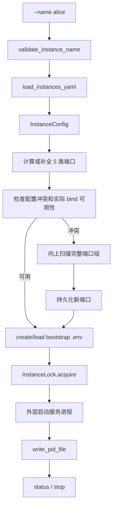
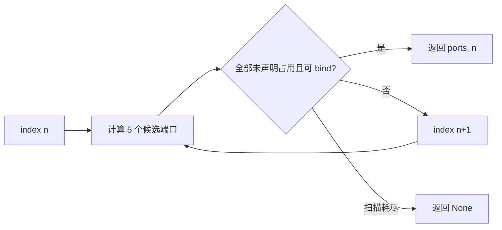
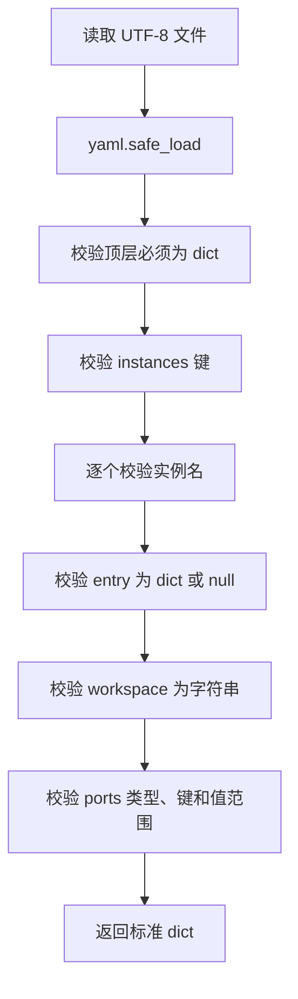

# JiuWenSwarm Instance Manager 模块讲解

## 1. 文档范围与代码基线

本文档讲解 `jiuwenswarm/instance_manager/**/*.py`，即多实例配置、端口、启动锁、PID、状态和 bootstrap 环境管理，不展开真正启动服务的 `init_workspace.py` 与 `start_services.py`。

代码基线：

- 分支：`dev-stable`
- 提交：`dc3a5e8519bdf3babdf91719ee48faa95d614c8a`
- 提交时间：`2026-09-05 17:32:09 +0800`
- 提交说明：`!6057 merge skill_acceleration_exec_0904 into dev-stable`
- Python 文件数：6

目录结构如下：

```text
jiuwenswarm/instance_manager/
├── __init__.py
├── bootstrap.py
├── config.py
├── lock.py
├── status.py
└── yaml.py
```

## 2. 整体模块说明

### 2.1 Instance Manager 解决什么问题

同一用户可以同时运行默认实例和多个命名实例。它们必须隔离工作区、端口、环境变量和进程状态，否则一个实例可能覆盖另一个实例的配置，或在启动时占用同一端口。

`instance_manager` 不直接创建 Gateway、AgentServer 或 Web 进程，而是向外层启动命令提供以下基础能力：

| 能力 | 文件 | 结果 |
|---|---|---|
| 实例模型、名称和端口规则 | `config.py` | `InstanceConfig`、端口组及冲突结果 |
| 实例清单持久化 | `yaml.py` | 经过校验的 `instances.yaml` |
| 启动期环境 | `bootstrap.py` | 每个命名实例工作区中的 `.env` |
| 并发启动保护和 PID | `lock.py` | `.instance.lock`、`.instance.pid` |
| 查询和停止 | `status.py` | `InstanceStatus`、进程终止结果 |
| 公共导出 | `__init__.py` | 向后兼容的统一 API 门面 |

### 2.2 默认实例与命名实例

| 内容 | 默认实例 | 命名实例 |
|---|---|---|
| 索引 | 0 | 按 `instances.yaml` 声明顺序，从 1 开始 |
| 默认工作区 | `~/.jiuwenswarm` | `~/.jiuwenswarm-instances/<name>` |
| 清单登记 | 不需要 | `~/.jiuwenswarm/instances.yaml` |
| 启动环境 | 主配置目录中的 `.env` | 实例工作区根目录 `.env` |
| 状态来源 | PID；不足时可检查主端口 | 实例 PID 文件 |
| 自动端口 | 基础端口 | 基础端口 + 索引 × 1000 |

命名实例也可以在 `instances.yaml` 中显式指定其他工作区或单个端口。未指定的端口仍按实例索引自动补全。

### 2.3 持久化布局

```text
<user-home>/
├── .jiuwenswarm/
│   ├── instances.yaml
│   └── ...默认实例数据
└── .jiuwenswarm-instances/
    └── alice/
        ├── .env
        ├── .instance.lock
        ├── .instance.pid
        └── ...实例工作区数据
```

用户根目录可通过 `JIUWENSWARM_HOME` 等公共路径逻辑调整；文档中的 `~` 表示默认位置。

### 2.4 从配置到启动的协作流程



“端口回退”和“环境加载”必须连在一起：如果只修改父进程中的端口，Gateway 和 AgentServer 子进程仍可能从 `.env` 读到旧值。

## 3. `jiuwenswarm/instance_manager/__init__.py`

### 文件说明

该文件是多实例包的公共门面。它不实现算法，而是从其余五个模块重新导出数据类、常量、名称校验、端口管理、YAML、锁、PID、状态、停止和 bootstrap API。

导出内容可分为：

| 类别 | 代表名称 |
|---|---|
| 数据模型 | `InstanceConfig`、`InstanceStatus`、`InstancesYamlError` |
| 常量 | `BASE_PORTS`、`PORT_TYPES`、`PID_FILENAME`、`LOCK_FILENAME` |
| 配置与端口 | `validate_instance_name()`、`calculate_instance_ports()`、`find_available_ports()` |
| YAML | `load_instances_yaml()`、`update_instances_yaml()`、`get_instance_index()` |
| 锁和 PID | `InstanceLock`、`write_pid_file()`、`is_process_alive()` |
| 状态与控制 | `list_all_instances()`、`stop_instance_process()` |
| Bootstrap | `create_bootstrap_env()`、`load_instance_bootstrap_by_name()` |

`__all__` 明确列出公共 API，主要用于保持历史调用方式 `from jiuwenswarm.instance_manager import ...` 不因内部拆分而失效。

## 4. `jiuwenswarm/instance_manager/bootstrap.py`

### 4.1 文件定位

该文件生成并加载实例启动期 `.env`。这些变量决定工作区和监听端口，必须在导入依赖环境变量的业务模块之前进入进程，因此 bootstrap 与完整的 `config.yaml` 加载分开。

### 4.2 Bootstrap 文件内容

`create_bootstrap_env(config)` 写入：

| 配置项 | 环境变量 |
|---|---|
| 实例工作区 | `JIUWENSWARM_DATA_DIR` |
| 实例名 | `JIUWENSWARM_INSTANCE` |
| AgentServer | `AGENT_SERVER_PORT` |
| Web | `WEB_PORT` |
| Gateway | `GATEWAY_PORT` |
| 前端开发服务 | `FRONTEND_PORT` |
| Agent HTTP API | `AGENT_HTTP_PORT` |

函数只写 `InstanceConfig.ports` 中存在的端口，并返回实际 `.env` 路径。`create_bootstrap_env_for_name()` 是兼容入口：先从 YAML 声明顺序取得索引，再计算默认端口并构造 `InstanceConfig`。

### 4.3 早期降级创建

`_create_basic_bootstrap_env()` 用于参数解析很早、常规模块尚不适合完整导入的阶段。它直接读取 `instances.yaml` 的名字顺序，失败时回退到索引 1，然后用基础端口算法生成 `.env`。

该早期版本有意减少依赖，只写 AgentServer、Web、Gateway 和 Frontend 四个端口；标准 `create_bootstrap_env()` 还会写当前基线新增的 `AGENT_HTTP_PORT`。正常流程应优先使用标准配置对象生成文件。

### 4.4 按名称加载

`load_instance_bootstrap_by_name(name)` 依次执行：

```text
校验名称
  → 从 instances.yaml 读取 InstanceConfig
  → 检查 workspace 存在
  → 缺少 .env 时创建
  → load_dotenv(..., override=True)
  → 返回 .env 路径
```

非法名称、清单中不存在或工作区缺失时返回 `None` 并输出可操作提示，调用它的 CLI 通常据此以状态码 1 退出。

## 5. `jiuwenswarm/instance_manager/config.py`

### 5.1 数据模型与名称规则

`InstancesYamlError` 为清单读取/校验错误统一添加 `[instances.yaml]` 前缀。`InstanceConfig` 保存名称、解析后的绝对工作区和端口，并提供 PID、bootstrap 文件路径；`InstanceStatus` 保存运行状态、PID、启动时间及端口快照。

实例名规则如下：

| 规则 | 内容 |
|---|---|
| 长度 | 1～64 个字符 |
| 字符 | 字母、数字、下划线、连字符 |
| 前缀 | 不能以点开头 |
| 保留名 | `default`、`config`、`tmp`、`jiuwenswarm`、`all` |

`validate_instance_name()` 返回具体错误文本或 `None`，`is_valid_instance_name()` 提供布尔包装。

### 5.2 基础端口和计算公式

| 端口类型 | 基础端口 | 子进程环境变量 |
|---|---:|---|
| `agent_server` | 18092 | `AGENT_SERVER_PORT` |
| `web` | 19000 | `WEB_PORT` |
| `gateway` | 19001 | `GATEWAY_PORT` |
| `frontend` | 5173 | `FRONTEND_PORT` |
| `http_api` | 8766 | `AGENT_HTTP_PORT` |

自动端口公式为：

```text
effective_base_port + instance_index × 1000
```

基础端口本身还可由 `JIUWENSWARM_AGENT_SERVER_PORT`、`JIUWENSWARM_WEB_PORT` 等环境变量覆盖。覆盖值不是整数时忽略并回到代码默认值，避免环境变量拼写错误直接阻断启动。

### 5.3 为什么使用 bind 探测

`is_port_available()` 尝试 `bind()+listen()` 后立即关闭，不使用 connect 探测。原因是已经处于 LISTENING、但不再正常 accept 的僵住 socket 仍会阻止真实服务绑定；connect 超时却可能把它误判为空闲。

探测不设置 `SO_REUSEADDR`，与真实服务的占用语义保持一致。在 `127.0.0.1`、`0.0.0.0`、空 host 或 `localhost` 场景还额外检查 `::1`，防止 Windows 上 Vite 只监听 IPv6 时被 IPv4 检查漏掉。

### 5.4 冲突与端口组回退

`check_port_conflicts()` 同时检查：

- 端口是否已被其他实例配置占用；
- 当前机器是否还能实际绑定。

`collect_all_ports(exclude_name)` 汇总默认实例和其他命名实例的 5 类端口。`find_available_ports()` 从指定索引向上扫描，只有一个候选索引的整组端口全部可用、且不在排除列表时才返回。



`scan_range=0` 明确表示不扫描，直接返回 `None`，不会暗中至少尝试一次。

### 5.5 回退端口持久化

`_upsert_env_ports()` 只替换或追加 5 个端口环境变量，保留 `.env` 中其他 API key、模型配置和注释行。默认实例通过该文件持久化；命名实例则更新 `instances.yaml` 后重新生成 bootstrap `.env`。

`_format_url_hint()` 根据最终 Gateway 端口生成 TUI/CLI 连接提示，避免自动回退后用户仍按旧端口连接。

## 6. `jiuwenswarm/instance_manager/lock.py`

### 6.1 启动锁

`InstanceLock` 保护同一实例的启动临界区，锁文件位于 `<workspace>/.instance.lock`。不同实例工作区不同，因此可以并行启动；同一实例的两个启动命令则互斥。

| 平台 | 实现 | 重试方式 |
|---|---|---|
| Unix | `fcntl.flock(LOCK_EX | LOCK_NB)` | 每 0.1 秒重试到 timeout |
| Windows | `open(path, "x")` 排他创建 | 文件存在时检查陈旧锁，再重试 |

锁文件写入当前 PID 和时间戳，便于排障。Windows 锁超过 `STALE_LOCK_TIMEOUT=30` 秒视为陈旧并尝试删除；Unix 的真实所有权由内核 flock 管理，不依赖文件是否留在目录中。

`acquire()` 返回是否成功，`release()` 释放平台锁并在 Windows 删除文件。上下文管理器接口可简化调用，但 `__enter__()` 本身不检查 acquire 的布尔结果，因此需要超时判断的启动代码应显式调用 `acquire()`。

### 6.2 PID 文件

PID 文件为 `<workspace>/.instance.pid`，结构如下：

```json
{
  "pid": 12345,
  "started_at": 1780000000.0,
  "name": "alice"
}
```

`write_pid_file()` 先写 `.tmp` 再重命名，减少中途退出留下半个 JSON 的风险；Windows 替换前先删除旧文件。`read_pid_file()` 对不存在、非对象或损坏 JSON 返回 `None`；`delete_pid_file()` 返回是否真的删除。

### 6.3 进程存活判断

`is_process_alive()` 在 Windows 调用 `tasklist` 并过滤无任务提示，在 Unix 使用 `os.kill(pid, 0)`。非法或非正 PID 直接视为未运行。

`check_instance_running(workspace)` 是只接收工作区的兼容入口：读取 `.instance.pid`、校验 PID 类型，再调用平台存活检查。PID 文件存在不等于进程仍然存在。

## 7. `jiuwenswarm/instance_manager/status.py`

### 7.1 状态来源

命名实例的 `get_instance_status(config)` 以 PID 文件为入口，只有 PID 合法且进程存活时才设置 `running=True`，否则隐藏无效 PID 和启动时间。

默认实例可能由旧入口启动而没有 PID 文件，所以 `get_default_instance_status()` 采用两级判断：

```text
有效 PID 文件 + 进程存活
  → running
否则检查 agent_server / gateway / frontend 主端口
  → 任一端口被占用则视为 running，并尝试反查 PID
```

端口占用只能说明默认实例“可能正在运行”，因此 PID 反查失败时状态仍可为 running、PID 为 `None`。

### 7.2 PID 反查

`_find_pid_by_port()` 在 Windows 解析 `netstat -ano -p tcp` 的 LISTENING 行，在 Unix 调用 `lsof -i :<port> -t`。命令失败、超时或输出无法解析时返回 `None`，状态查询不会因此崩溃。

### 7.3 配置装载和列表

| 函数 | 作用 |
|---|---|
| `get_instance_config(name)` | 读取一个命名实例，补全默认工作区和未配置端口 |
| `load_all_instance_configs()` | 按 YAML 顺序为所有命名实例建立配置 |
| `list_all_instances()` | 可选加入默认实例，再附加所有命名实例状态 |
| `format_status_line()` | 输出 name、state、pid、workspace 和端口列 |

实例索引来自 YAML 的声明顺序，因此调整条目顺序会改变未显式配置端口的自动计算结果；正常写入会把完整端口组持久化，降低这种隐式变化。

### 7.4 停止进程

`stop_process_by_pid()` 是直接 PID 入口；`stop_instance_process()` 先读取实例 PID 文件，并在进程已死、PID 无效或停止完成后清理文件。

Windows 使用 `taskkill /PID <pid> /T /F` 终止进程树；Unix 先发 SIGTERM，等待 2 秒后仍存活再发 SIGKILL。随后最多按 timeout 轮询进程退出。

当前函数在执行完终止流程后返回 `True`，日志和后续状态查询用于确认实际结果；调用方不应把返回值理解为额外的强一致进程证明。

## 8. `jiuwenswarm/instance_manager/yaml.py`

### 8.1 路径与格式

该文件统一生成：

```text
instances.yaml:          <user-home>/.jiuwenswarm/instances.yaml
命名实例根目录:          <user-home>/.jiuwenswarm-instances/
某实例默认工作区:        <user-home>/.jiuwenswarm-instances/<name>/
```

一个最小清单只需要：

```yaml
instances:
  alice:
```

`workspace` 和各端口都可省略，由其他模块按默认路径及声明顺序补全。

### 8.2 读取与分层校验



端口键只允许 `PORT_TYPES` 中的 5 类，值必须是 1～65535 的整数。文件不存在或为空时返回 `{"instances": {}}`；语法、结构或字段错误抛出带路径和修复建议的 `InstancesYamlError`。

### 8.3 原子保存与更新

`save_instances_yaml()` 在目标文件同目录创建临时文件，写完后使用 `os.replace()`。同目录保证 POSIX 原子替换和 Windows 同卷重命名，读取方不会看到半写 YAML；失败时清理临时文件。

原子替换只保证文件不损坏，并不能独立防止两个并发 read-modify-write 互相覆盖。`InstanceLock` 能防止同一实例重复启动；不同名称实例同时修改共享 `instances.yaml` 时，仍需要外层调用流程协调更新顺序。

`update_instances_yaml()` 读取并校验现有内容，为新条目按末尾索引生成完整端口组，或覆盖同名条目，再原子保存。该函数依赖调用方先完成新名称校验；它只保证载入的旧内容有效。`create_instances_yaml_template()` 仅在文件不存在时写入带说明的空模板。

`get_instance_index()` 返回现有条目的 1-based 位置；新名称返回“当前数量 + 1”，索引 0 始终留给默认实例。

## 9. 文件协作关系

```text
init_workspace / start_services
  → instance_manager.__init__ 公共门面
      ├── yaml.py：清单和工作区位置
      ├── config.py：配置对象、名称和端口组
      ├── bootstrap.py：子进程早期环境
      ├── lock.py：同实例启动互斥和 PID
      └── status.py：查询、列表和停止
```

最重要的共享标识是 `InstanceConfig`：YAML 层产生它，bootstrap 用它写环境，lock 用它定位锁/PID，status 用它读取进程状态。端口常量和环境变量映射集中在 `config.py`，避免服务启动、状态显示和 `.env` 各自维护不同端口表。

## 10. 设计要点总结

- 默认实例索引为 0，命名实例按 `instances.yaml` 声明顺序从 1 开始。
- 当前端口组包含 AgentServer、Web、Gateway、Frontend 和 HTTP API 共 5 类。
- 端口可用性使用真实 `bind()+listen()` 语义，并兼顾 IPv6 localhost。
- 端口回退按完整组扫描，结果必须同步持久化，保证父子进程读取一致。
- Unix 和 Windows 使用不同锁机制；PID 文件只记录状态，不能替代存活检查。
- YAML 与 PID 写入采用临时文件替换，但并发 read-modify-write 仍依赖实例锁。
- 包本身不启动业务进程，只为外层 CLI 提供可靠的多实例基础设施。
