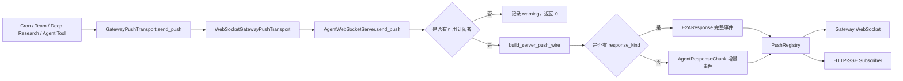

# JiuWenSwarm Server Gateway Push 模块讲解

## 1. 文档范围与代码基线

本文档讲解 `jiuwenswarm/server/gateway_push/**/*.py`，并结合它直接依赖或被依赖的 `server/agent_ws_server.py`、`server/transports/push_registry.py` 说明一条主动推送如何真正到达 Gateway、WebSocket 或 HTTP-SSE 订阅者。

代码基线：

- 分支：`dev-stable`
- 提交：`dc3a5e8519bdf3babdf91719ee48faa95d614c8a`
- 提交日期：2026-09-05
- 提交说明：`!6057 merge skill_acceleration_exec_0904 into dev-stable`
- Python 文件数：3

涉及的文件如下：

```text
jiuwenswarm/server/gateway_push/
├── __init__.py
├── transport.py
└── wire.py
```

## 2. 模块总体作用

### 2.1 它解决什么问题

普通请求采用“客户端发起、AgentServer 响应”的方向，但 Cron 到点提醒、Agent 工具生成文件、Deep Research 进度、Team 远端成员事件等消息并不一定对应一条正在等待的请求。这些业务需要由 AgentServer 主动向外发送消息。

`gateway_push` 为这些调用方提供一个很窄的接口：业务代码只准备消息字典并调用 `send_push()`，不需要持有 WebSocket 对象，也不需要自行构造 E2A wire 帧。

该目录可以分为两层：

| 层次 | 文件 | 职责 |
|---|---|---|
| 调用抽象 | `transport.py` | 定义业务侧推送接口，并把默认实现接到进程内 `AgentWebSocketServer` |
| 协议编码 | `wire.py` | 把业务消息转换为 WebSocket 与 HTTP-SSE 共用的 E2A wire 字典 |
| 包出口 | `__init__.py` | 汇总并稳定导出上述接口 |

### 2.2 完整推送链路



`WebSocketGatewayPushTransport` 的名字描述的是它接入 AgentServer 的方式，不代表最终接收者只能是 WebSocket。消息进入 `AgentWebSocketServer.send_push()` 后会交给 `PushRegistry`；注册表中既可以有 Gateway WebSocket，也可以有 `GET /api/v1/events/stream` 建立的 HTTP-SSE 订阅者。

### 2.3 与 `transports/push_registry.py` 的边界

这两个模块名称相近，但位于推送链路的两端。

| 对比项 | `server/gateway_push` | `server/transports/push_registry.py` |
|---|---|---|
| 角色 | 推送发起端 | 推送接收端注册表 |
| 面向对象 | Cron、工具、Team、Adapter 等业务调用方 | WebSocket 与 HTTP-SSE 连接 |
| 主要问题 | “怎样发起一条推送、怎样编码” | “当前有哪些订阅者、这条消息该发给谁” |
| 核心入口 | `GatewayPushTransport.send_push()` | `PushRegistry.push()` / `push_reverse_rpc()` |
| 是否负责连接筛选 | 否 | 是，支持 `session_id` 和 `channel_id` 过滤 |
| 是否负责 wire 编码 | `wire.py` 负责 | 否，接收已经编码好的 wire 字典 |

因此，`gateway_push` 不是 `PushRegistry` 的替代实现。前者把业务消息送进服务端推送管线，后者才负责扇出、慢订阅者处理和实际送达数量统计。

### 2.4 `send_push` 消息约定

三个文件没有为消息定义独立的数据类，而是共同使用 `dict[str, Any]`。`wire.py` 实际读取的字段如下：

| 字段 | 是否必需 | 用途 |
|---|---|---|
| `request_id` | 建议提供 | 同时作为 `request_id` 和 `response_id`；缺失时编码为空字符串 |
| `channel_id` | 建议提供 | 写入 wire 的 `channel`，也是订阅者过滤依据之一 |
| `session_id` | 可选 | 标识目标会话；非空时写入 wire，可用于精确订阅过滤 |
| `response_kind` | 可选 | 非空时选择完整 `E2AResponse` 路径 |
| `body` | 完整事件路径使用 | `response_kind` 非空时作为响应主体 |
| `payload` | 增量路径使用 | `response_kind` 为空时作为 `AgentResponseChunk.payload` |
| `is_complete` | 可选 | 增量路径的完成标记，默认 `False` |
| `metadata` | 可选 | 附加元数据；增量路径会过滤 E2A 内部保留键 |

业务调用方通常只需要在“完整事件”和“普通增量”两种形态中选择一种，不应同时依赖 `body` 与 `payload`。

## 3. `jiuwenswarm/server/gateway_push/__init__.py`

### 文件说明

该文件是包的公共出口，没有业务状态和运行逻辑。它从 `transport.py` 导出 `GatewayPushTransport`、`WebSocketGatewayPushTransport`，从 `wire.py` 导出 `build_server_push_wire()`，并通过 `__all__` 明确公开这三个名称。

调用方因此可以写：

```text
from jiuwenswarm.server.gateway_push import WebSocketGatewayPushTransport
```

而不需要依赖包内文件布局。当前 `dev-stable` 中，Cron 工具、Deep Research 工具、Team 远端成员和部分 Adapter 辅助逻辑都使用了这个稳定出口。

### 与其他文件的关系

```text
gateway_push/__init__.py
├── transport.GatewayPushTransport
├── transport.WebSocketGatewayPushTransport
└── wire.build_server_push_wire
```

它只负责 API 聚合；修改导出名称会直接影响上述跨目录调用方。

## 4. `jiuwenswarm/server/gateway_push/transport.py`

### 文件说明

`transport.py` 把“业务要发出一条 server push”抽象成可替换的异步接口。文件只有一个协议和一个默认实现，刻意不包含 wire 字段拼装、订阅者选择和错误重试。

### `GatewayPushTransport` 协议

`GatewayPushTransport` 使用 `Protocol` 与 `@runtime_checkable` 定义结构化接口：只要对象提供兼容的异步 `send_push(msg)` 方法，就可以被 Cron 等调用方接受，并不要求继承某个基类。

这一设计主要有两个作用：

- 业务模块依赖“能发送推送”这一能力，而不是依赖 `AgentWebSocketServer` 的具体类型。
- 测试可以注入记录消息的假 transport，不必真的启动 WebSocket 服务端。

协议返回 `None`。这表示业务侧默认把它当作发送动作，而不是送达确认接口；需要判断送达人数的代码会直接调用 `AgentWebSocketServer.send_push()`，后者返回成功接收的订阅者数量。

### `WebSocketGatewayPushTransport` 默认实现

默认实现的执行过程非常短：

```text
业务消息 dict
  → 在 send_push() 内导入 AgentWebSocketServer
  → AgentWebSocketServer.get_instance()
  → server.send_push(msg)
```

`AgentWebSocketServer` 在方法体内延迟导入，而不是在模块顶层导入。这样可以避免 `agent_ws_server.py` 导入 `gateway_push.wire`、`gateway_push.transport` 又反向导入服务端类所形成的初始化期循环依赖。

默认实现也不缓存服务端实例。每次调用都通过 `get_instance()` 取得当前进程单例，使 transport 自身保持无状态。

### 与服务端推送的衔接

`AgentWebSocketServer.send_push()` 在接到消息后负责以下步骤：

1. 取得进程级 `PushRegistry`。
2. 普通推送检查订阅者数量；ACP 反向 RPC 检查专用 owner 是否就绪。
3. 调用 `build_server_push_wire()` 编码。
4. 普通消息调用 `registry.push()` 扇出；ACP 输出请求调用 `push_reverse_rpc()` 点对点投递。
5. 返回成功投递数；没有订阅者、编码失败、过滤后无人匹配或所有 sink 失败时返回 `0`。

`WebSocketGatewayPushTransport.send_push()` 当前不向上返回这个数量，因此使用该抽象的调用方只负责发起推送。

## 5. `jiuwenswarm/server/gateway_push/wire.py`

### 文件说明

`wire.py` 是主动推送的协议边界。它把业务层的松散字典统一编码为 E2A wire 字典，保证 WebSocket 和 HTTP-SSE 收到相同的数据形状。

文件只公开 `build_server_push_wire()`。常量 `_CONVERTER` 会写入完整事件的 provenance，表明该帧由本函数转换而来。

### 两条编码路径

函数首先读取并去除 `response_kind` 两端空白，然后选择不同的数据模型：

| 条件 | 中间对象 | 典型用途 | 完成语义 |
|---|---|---|---|
| `response_kind` 非空 | `E2AResponse` | ACP 输出请求等具有明确响应种类的完整事件 | 固定 `sequence=0`、`is_final=True`、`status=succeeded`、`is_stream=False` |
| `response_kind` 为空 | `AgentResponseChunk` | 进度、文件、提醒等普通主动增量 | `is_complete` 取自调用方，默认 `False` |

完整事件路径会直接填充：

- `request_id` 与 `response_id`
- 当前 UTC 时间
- `channel`、`session_id` 与 `body`
- `identity_origin=AGENT`
- `source_protocol=e2a`、转换器名称和 `kind=server_push` provenance

增量路径先构造 `AgentResponseChunk`，再调用公共 `encode_agent_chunk_for_wire()`。这样它与普通聊天流式响应共享相同的 chunk 编码规则，而不是维护第二套协议实现。

### server-push 标记

两条路径最终都会在 `metadata` 中设置 `E2A_WIRE_SERVER_PUSH_KEY=True`。下游可以据此区分主动推送和普通请求响应，不需要仅凭 `request_id` 或事件类型猜测消息来源。

```text
完整事件：业务 metadata → E2AResponse.to_dict → 加 server-push 标记
普通增量：AgentResponseChunk → 公共 codec → 合并安全 metadata → 加 server-push 标记
```

### 元数据保护

增量路径合并调用方 `metadata` 时，会逐个跳过 `E2A_WIRE_INTERNAL_METADATA_KEYS`。这些保留键由编码器和传输协议控制，外部业务字段不能覆盖它们。

完整 `E2AResponse` 路径则把 metadata 交给模型的 `to_dict()` 处理，并在转换后单独加入 server-push 标记。两条路径都由服务端最终确定主动推送标识。

### 会话字段处理

完整事件路径直接把 `session_id` 传给 `E2AResponse`。增量路径只在该值非空且去除空白后仍有内容时覆盖 wire 的 `session_id`。这避免把 `None` 或纯空白值写成一个看似有效的过滤键。

## 6. 主要调用方

当前 `dev-stable` 中，使用本模块的代表性调用方如下：

| 调用方 | 推送内容或场景 |
|---|---|
| `agents/harness/common/tools/cron/cron_tools.py` | 定时任务到点后的业务消息 |
| `agents/harness/common/tools/deepresearch/*` | Deep Research 进度或结果事件 |
| `agents/harness/team/remote_member_bootstrap.py` | Team 远端成员事件 |
| `server/runtime/agent_adapter/evolution_helpers.py` | 演进流程中的状态通知 |
| `server/runtime/agent_adapter/interface_deep.py` | Deep Adapter 内部主动事件 |
| `server/runtime/agent_adapter/team_helpers.py` | Team 执行过程中的主动消息 |

另外，`handlers/_default.py` 和 `handlers/commands.py` 通过 `ctx.services.send_push()` 调用服务端能力，未直接依赖 transport 类。例如计划模式退出和上下文压缩事件会沿同一套 `AgentWebSocketServer.send_push()`、wire 编码和注册表扇出链路发送。

## 7. 文件之间的完整联系

| 上游文件或模块 | 下游文件或模块 | 联系 |
|---|---|---|
| Cron、Team、Deep Research、Adapter | `transport.GatewayPushTransport` | 只依赖统一的主动推送能力 |
| `WebSocketGatewayPushTransport` | `AgentWebSocketServer.get_instance()` | 取得当前进程内服务端单例 |
| `AgentWebSocketServer.send_push()` | `wire.build_server_push_wire()` | 把业务消息转换为 E2A wire 帧 |
| `wire.py` | `common.e2a.models` / `wire_codec` | 分别构造完整响应和增量响应 |
| `AgentWebSocketServer.send_push()` | `transports.PushRegistry` | 根据消息类型执行普通扇出或反向 RPC 投递 |
| `PushRegistry` | `ResponseSink` | 向匹配的 WebSocket 或 HTTP-SSE 订阅者发送已经编码的帧 |

整个模块可以归纳为：

```text
业务模块
  → 用 GatewayPushTransport 隐藏服务端实现
  → 用 WebSocketGatewayPushTransport 接入进程内 AgentWebSocketServer
  → 用 build_server_push_wire 统一 E2A 数据形状
  → 用 PushRegistry 选择并驱动实际订阅连接
```

三个文件本身都不维护订阅列表，也不负责重试或连接生命周期；它们专注于“发起”和“编码”，把“投递给谁”留给传输注册表。
