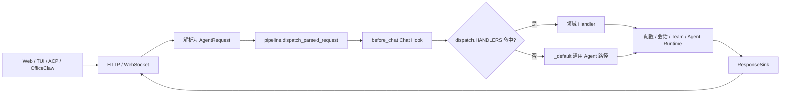
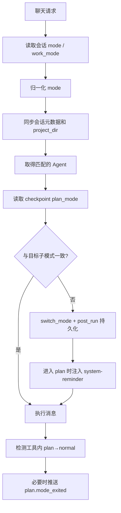
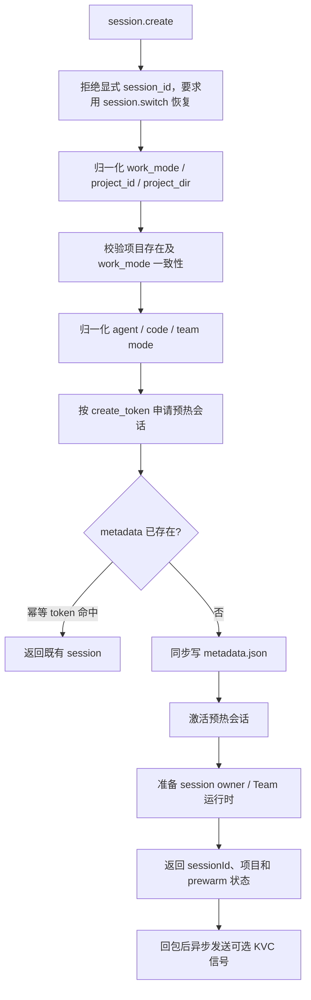
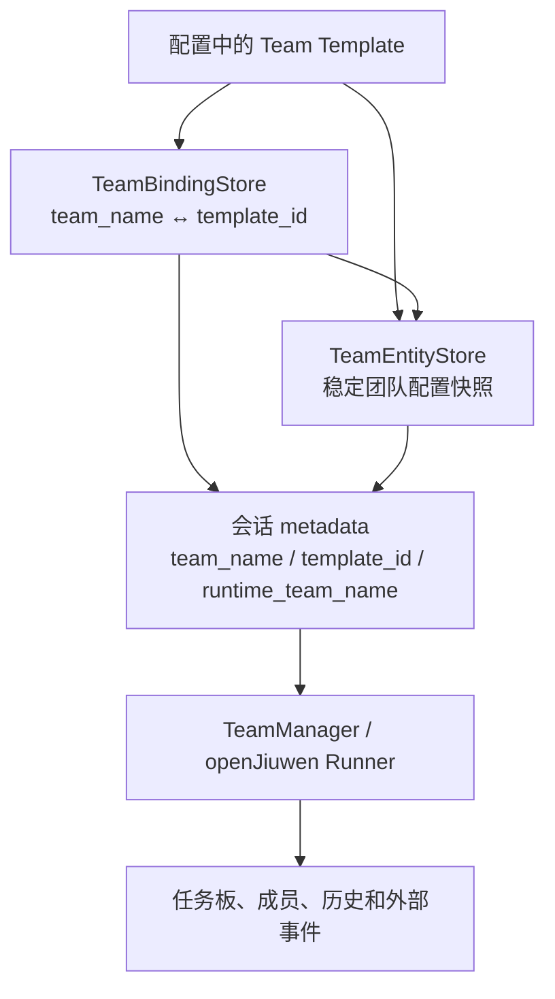

# JiuWenSwarm Server Handlers 模块讲解

## 1. 文档范围与代码基线

本文档讲解 `jiuwenswarm/server/handlers/**/*.py`。为说明 handler 的入口和输出边界，文档还会引用 `server/pipeline.py`、`server/dispatch.py`、`server/context.py` 与 `server/transports/sink.py`，但不展开这些外围模块的全部实现。

代码基线：

- 分支：`dev-stable`
- 提交：`dc3a5e8519bdf3babdf91719ee48faa95d614c8a`
- 提交日期：2026-09-05
- 提交说明：`!6057 merge skill_acceleration_exec_0904 into dev-stable`
- Python 文件数：16

涉及的文件如下：

```text
jiuwenswarm/server/handlers/
├── __init__.py
├── _default.py
├── _shared.py
├── agents.py
├── bootstrap.py
├── chat.py
├── commands.py
├── extensions.py
├── file_transfer.py
├── mcp.py
├── ops.py
├── permissions.py
├── sandbox.py
├── schedule.py
├── session.py
└── team.py
```

## 2. 模块总体作用

### 2.1 Handler 层处在什么位置

`handlers` 是 AgentServer 的业务处理层。HTTP、WebSocket 和 SSE 接入代码先把外部载荷解析为 `AgentRequest`，然后进入同一条请求流水线；handler 只面向结构化请求、服务端协作者和统一响应出口，不直接处理 socket 或 HTTP response。



处理器按业务域拆分，而不是按网络协议拆分。主要分组如下：

| 模块组 | 文件 | 主要职责 |
|---|---|---|
| 通用入口与共享逻辑 | `_default.py`、`_shared.py` | 普通 Agent 调用、模式解析、项目定位、租户判断、会话元数据同步 |
| 连接与聊天 | `bootstrap.py`、`chat.py`、`session.py` | 握手、创建/切换/分叉/删除会话、中断、历史和回退 |
| Agent 与 Team | `agents.py`、`team.py` | Agent 定义管理，Team 模板、绑定、运行快照和生命周期 |
| 功能配置 | `commands.py`、`extensions.py`、`mcp.py`、`permissions.py`、`sandbox.py` | 命令、Rail/Hook、MCP、权限和沙箱配置 |
| 调度与运维 | `schedule.py`、`ops.py` | 定时任务、议题监控、热更新、缓存和预热 |
| 数据传输 | `file_transfer.py` | Gateway 到 AgentServer 的分片文件上传 |
| 包边界 | `__init__.py` | 统一公开各领域模块 |

### 2.2 两种分发路径

`dispatch.py` 中的 `HANDLERS` 是专用方法注册表。会话管理、团队、命令、权限等已登记方法命中后，直接调用对应领域函数。未命中的请求进入 `_default.py`，由 Agent 或租户池处理；`chat.send`、`chat.resume`、`chat.user_answer` 以及 Skills、Plugins 等运行时 RPC 属于这条路径。

```text
AgentRequest
  → HANDLERS.get(req_method)
      ├── 命中：handle_xxx(ctx)
      │          例如 session.list、team.snapshot、command.mcp
      └── 未命中：_handle_unary / _handle_stream
                 例如 chat.send、skills.list、plugins.*
```

`HandlerSpec` 还能为一个函数附加固定参数。`schedule.*` 与 `issue.*` 都调用 `handle_schedule_request()`，但分发表会传入不同 `action`；`agents.enable` 与 `agents.disable` 共用 `handle_agents_set_enabled()`；`history.get` 则根据 `request.is_stream` 选择普通或流式实现。

### 2.3 Handler 的统一输入与输出

领域函数的基本签名为：

```text
async def handle_xxx(ctx: RequestContext) -> None
```

`RequestContext` 提供四类信息：

| 成员 | 含义 |
|---|---|
| `ctx.request` | 已解析的 `AgentRequest`，包含方法、参数、会话、渠道和元数据 |
| `ctx.sink` | 统一响应出口，可以是 `WSSink`、`UnaryHTTPSink` 或 `SSESink` |
| `ctx.connection_id` | 稳定连接标识，用于 ACP 能力缓存和会话切换串行化 |
| `ctx.services` | AgentManager、租户池、调度器、沙箱 runner 等经过白名单限制的服务端能力 |

大多数 handler 构造 `AgentResponse` 后调用 `send_unary()` 或先编码再调用 `send_wire()`。流式历史和默认聊天路径使用 `AgentResponseChunk`。具体写 WebSocket、进入 SSE 队列或保存 HTTP 返回对象的差异由 sink 实现负责。

这种边界带来两个直接结果：

- 同一个 handler 可以同时服务 WebSocket 和 HTTP/SSE。
- 单元测试可以提供假 sink 与假 services，不需要创建真实连接。

### 2.4 状态分布

Handlers 自身大多不持有业务数据，而是协调以下状态来源：

| 状态 | 主要保存位置 | 相关 handler |
|---|---|---|
| Agent 实例与 Adapter | `AgentManager` / `TenantAgentPool` | `_default.py`、`agents.py`、`ops.py` |
| 会话元数据与历史 | 会话目录、`metadata.json`、`history.json` | `bootstrap.py`、`session.py`、`_shared.py` |
| 模型上下文与 checkpoint | openJiuwen DeepAgent / Runner checkpointer | `_default.py`、`session.py`、`bootstrap.py` |
| Team 定义与绑定 | Team template、binding store、entity store、会话元数据 | `team.py`、`chat.py` |
| 扩展与权限配置 | `config.yaml`、RailManager、权限服务 | `extensions.py`、`permissions.py` |
| MCP 与沙箱配置 | `config.yaml`、运行中 Adapter | `mcp.py`、`sandbox.py` |
| 调度任务 | `AutoHarnessService` | `schedule.py` |

因此，修改类请求经常需要同时完成“磁盘写入”和“让运行时立即看到新配置”。文档后续会分别说明哪些路径热更新、哪些路径重建 Agent，以及哪些操作只影响持久化数据。

## 3. `jiuwenswarm/server/handlers/__init__.py`

### 文件说明

该文件定义 `handlers` 包的公开边界。它导入 `agents`、`bootstrap`、`chat`、`commands`、`extensions`、`file_transfer`、`mcp`、`ops`、`permissions`、`sandbox`、`schedule`、`session` 和 `team`，并通过 `__all__` 统一导出。

`_default.py` 与 `_shared.py` 没有进入 `__all__`：前者由 `pipeline.py` 直接调用，后者是各领域共享的内部实现，不属于面向外部的业务域模块。

文件内的说明还规定了一个重要导入边界：

```text
agent_ws_server → dispatch → handlers.*
```

业务 handler 不应在模块顶层反向导入 `agent_ws_server`。确实需要服务端状态时，应通过 `ctx.services`；只有必须延迟取得全局启动能力的少数位置才在函数体内导入，避免初始化期循环依赖。

## 4. `jiuwenswarm/server/handlers/_default.py`

### 文件说明

`_default.py` 是分发表未命中时的通用 Agent 执行路径，也是普通聊天进入运行时的主入口。它不像领域 handler 那样只处理一种方法，而是根据请求是否流式、是否多租户、是否无状态以及当前工作模式，选择合适的 Agent 和执行方式。

两条顶层路径为：

| 路径 | 运行函数 | 输出方式 |
|---|---|---|
| 非流式 | `_handle_unary()` → `_handle_unary_impl()` | 调用 `process_message()`，发送一个最终响应 |
| 流式 | `_handle_stream()` → `_handle_stream_impl()` | 消费 `process_message_stream()`，逐块写入 sink |

两者都会绑定请求 trace 上下文；真实聊天轮次还会调用 `AgentManager.begin_foreground_chat()` 与 `end_foreground_chat()`，让后台预热和前台请求正确协调。

### 请求分流

默认路径并不把所有未登记方法都交给同一个重型 Agent。源码按以下顺序区分：

| 请求类别 | 处理方式 | 原因 |
|---|---|---|
| OfficeClaw 或带非默认 `agent_id/service_id` | 进入 `TenantAgentPool` | 隔离租户配置、工作区和 AgentManager |
| Skills、SkillDev、Plugins、Symphony 无状态 RPC | 复用轻量 fallback Agent | 不创建 Adapter，不触发模式切换 |
| Skills evolution archive/rollback | 通过 AgentManager | 需要绑定正确的 skill_path 根目录 |
| `command.goal` 的只读 `get` | 使用真实 Agent，但不写会话元数据 | 查询不能凭空创建或刷新会话状态 |
| 普通聊天和其他 Agent RPC | 准备模式、项目与 Agent 后执行 | 需要稳定的会话和 Adapter 路由 |

无状态 fallback 按 `channel_id` 缓存。这样同一渠道中的安装与状态查询能命中同一个 SkillManager，同时避免每个请求都重建 Agent Adapter。

### Code 模式同步

`_prepare_code_mode_chat_turn()` 先从请求或会话元数据恢复 `work_mode`，再调用 `_apply_resolved_mode_to_request()` 得到主模式与子模式。项目目录经过 `_sync_chat_request_metadata()` 锁定后，才用于 `AgentManager.get_agent()` 的实例选择。

`_ensure_code_mode_state()` 负责让请求中的 `code.plan` / `code.normal` 与 checkpoint 内的 `plan_mode` 一致。同步按 session 加锁，避免同一会话的并发请求同时修改计划状态。



代码还会阻止已经完成的计划因旧客户端状态再次进入 plan；显式 `/plan` 请求不受该保护影响。权限确认、AskUser 等中断恢复请求会跳过普通模式切换，避免在恢复工具调用时误改状态。

### 流式心跳与取消登记

流式执行会把当前 task 和一个 stop event 登记到 `ctx.services.session_stream_tasks[session_id]`，`chat.py` 的中断 handler 据此找到可以找到并取消同一会话的活动流。

当 Agent 超过 10 秒没有真实 chunk 时，后台心跳协程发送 `event_type=keepalive`、`sequence=-1` 的分片。真实 chunk 到达会重置计时；结束、取消或连接关闭时，心跳任务与 session task 登记都会在 `finally` 中清理。

每个业务 chunk 都补充请求侧 `agent_ref`，但不会覆盖 Team 运行时已经设置的值。sink 返回 `False` 表示原始帧因发送预算等原因未能原样送出，默认路径会停止继续发送后续 chunk。

### 与其他模块的关系

```text
pipeline.py
  → _default._handle_unary / _handle_stream
      ├── _shared：模式、项目、租户和元数据
      ├── AgentManager / TenantAgentPool
      ├── JiuWenSwarm.process_message(_stream)
      └── ResponseSink
```

## 5. `jiuwenswarm/server/handlers/_shared.py`

### 文件说明

`_shared.py` 集中保存多个领域共同需要、但不应放进 `AgentWebSocketServer` 的请求准备逻辑。它是 handler 之间的公共下层，主要覆盖模式与项目解析、多租户工作区、会话元数据、连接引导前置条件、统一错误 wire 和少量跨域锁。

### 模式归一化

`resolve_agent_request_mode()` 返回三项：Manager 使用的主模式、Adapter 子模式和写回请求/元数据的规范值。

| 输入示例 | 主模式 | 子模式 | 规范值 |
|---|---|---|---|
| 空值、`agent`、历史 `agent.plan` / `agent.fast` | `agent` | 无 | `agent` |
| `code`、`code.normal` | `code` | `normal` | `code.normal` |
| `code.plan` | `code` | `plan` | `code.plan` |
| `team` | `team` | 无 | `team` |
| `team.plan` | `code` | `team` | `team.plan` |
| `code.team` | `code` | `team` | `code.team` |

旧的裸 `plan` / `fast` 默认并入 `agent`；若 `work_mode=code`，则归一到 `code.normal`。这种统一入口避免 `_default.py`、`schedule.py` 和 `extensions.py` 各自解释模式字符串。

### 项目与租户定位

`resolve_request_project_dir()` 按以下优先级寻找稳定项目目录：

```text
params.project_dir
  → metadata.project_dir
  → params.workspace_dir
  → params.cwd
  → metadata.cwd
  → params.trusted_dirs[0]
```

`_uses_tenant_pool()` 在 OfficeClaw 渠道或请求带有非默认 `agent_id/service_id` 时返回真。租户请求通过 `TenantAgentPool.extract_ids()` 推导 workspace key，`_sessions_dir_for_request()` 和 `_agent_workspace_dir_for_request()` 再解析到租户专属目录。

`_effective_config_for_request()` 对 OfficeClaw 使用租户 catalog 中的配置快照和环境 overlay；普通 Gateway 请求仍读取本地磁盘配置。Team 模板和其他配置型 handler 由此保持个人版与企业多租户的隔离。

### 会话元数据同步

`_sync_chat_request_metadata()` 把本轮请求中的规范 mode、模型、项目、Cron 和时间信息交给 session metadata 存储层。几个字段采用不同更新规则：

| 字段 | 更新规则 |
|---|---|
| `project_dir` / `project_id` | 首次锁定；后续不一致值不会替换既有绑定 |
| `model` | 只有请求显式携带非空 `model_name` 时覆盖 |
| `mode` | 只有请求显式携带非空 mode 时覆盖 |
| `last_user_message_at` | 只在 `chat.send`、`chat.resume`、`chat.user_answer` 刷新 |
| `work_mode` / `cron_id` | 随规范化后的请求一并同步 |

只读 RPC 因此不会把旧会话置顶，也不会用进程默认模型覆盖用户在会话中选择的模型。

### 连接引导前置条件

`bootstrap_preconditions()` 是 `initialize`、`session.create`、`session.fork` 和 `acp.tool_response` 共用的异步上下文管理器。它显式完成两件原先由默认调用位置附带提供的能力：

1. 绑定请求身份与 W3C trace 上下文。
2. 等待 Deep interface 与持久化 checkpointer 就绪。

结束时无论 handler 成功还是异常都会恢复 trace 绑定。它不会调用前台聊天计数，因为这些引导方法不属于真实聊天轮次。

### 共享锁与错误编码

`_session_mode_sync_locks` 和 `_session_team_binding_locks` 都使用弱引用字典按 session 保存锁，分别串行化模式切换和 Team 自动绑定，又不会让一次性会话永久占用进程内存。

`send_error_wire()` 只负责把错误信息和可选 code 编码为 E2A wire 字典，不直接发送；调用方仍通过自己的 `ctx.sink` 输出。

## 6. `jiuwenswarm/server/handlers/agents.py`

### 文件说明

`agents.py` 把 `AgentConfigService` 的 Agent 定义管理能力暴露为 E2A 方法。Agent 定义由 YAML frontmatter 和 Markdown 正文保存；handler 负责参数整理、调用服务、同步 `config.yaml` 中的启用状态，并通知运行中的 AgentManager 重新加载。

协议入口如下：

| 方法 | Handler | 主要结果 |
|---|---|---|
| `agents.list` | `handle_agents_list()` | 返回用户、项目和内置 Agent 摘要 |
| `agents.get` | `handle_agents_get()` | 返回指定 Agent 详情 |
| `agents.create` | `handle_agents_create()` | 创建定义，默认尝试用 LLM 生成提示词，并自动启用 |
| `agents.update` | `handle_agents_update()` | 更新定义；只有显式 `generate=true` 才重新生成提示词 |
| `agents.delete` | `handle_agents_delete()` | 删除定义并从配置中移除 |
| `agents.enable/disable` | `handle_agents_set_enabled()` | 修改启用状态；内置 Agent 不允许变更 |
| `agents.tools_list` | `handle_agents_tools_list()` | 返回定义 Agent 时可选的工具目录 |

### 创建与更新流程

创建时，handler 从请求中分离 `workspace_dir` 与 `generate`，再只把数据类已声明字段传给 `CreateAgentParams`。如果名称和描述齐全且允许生成，`_generate_agent_with_llm()` 要求模型返回 `whenToUse` 和 `systemPrompt` 的 JSON；解析失败会回退到请求中原有模板值，不会阻止创建。

```text
请求参数
  → 可选 LLM 生成 whenToUse / systemPrompt
  → AgentConfigService 写入 Agent 定义
  → config.yaml 标记 enabled
  → AgentManager.reload_agents_config
  → 返回 agent + generated + applied + reload_error
```

创建、更新和删除把“文件操作成功”与“运行时是否应用成功”分开表示。定义写入成功后，即使热加载失败，响应仍保留业务结果，并通过 `applied=false` 和 `reload_error` 告知调用方当前进程尚未应用。

### 与其他模块的关系

`_resolve_model()` 来自 `_shared.py`，用于生成 Agent 提示词；具体存储规则由 `runtime/agent_config_service.py` 实现；运行时刷新通过 `ctx.services.agent_manager` 完成。本文件不直接构造 Adapter。

## 7. `jiuwenswarm/server/handlers/bootstrap.py`

### 文件说明

`bootstrap.py` 处理客户端首次握手、会话创建与分叉，以及 ACP 反向工具调用结果。四个入口都使用 `_shared.bootstrap_preconditions()`，因此在处理前会绑定 trace 并等待 checkpointer 就绪。

| 方法 | Handler | 作用 |
|---|---|---|
| `initialize` | `handle_initialize()` | 协商协议版本和客户端能力 |
| `session.create` | `handle_session_create()` | 归一化项目与模式，申请预热会话并写入元数据 |
| `session.fork` | `handle_session_fork()` | 复制文件历史、内存上下文和 DeepAgentState |
| `acp.tool_response` | `handle_acp_tool_response()` | 完成等待中的 ACP JSON-RPC 输出请求 |

### 初始化握手

`handle_initialize()` 从 `clientCapabilities` 和 `protocolVersion` 生成 `extra_config`，调用 `AgentManager.initialize()`。ACP 渠道还会按 `connection_id` 保存客户端能力，供后续请求补入元数据。Manager 没有返回能力时，使用 `ACP_DEFAULT_CAPABILITIES`。

### 会话创建

`handle_session_create()` 并不是简单生成一个 ID。它会协调项目、工作模式、预热池、元数据和 Team owner：



真实项目以项目记录中的 `work_mode` 为准；请求显式指定且不一致时返回 `BAD_REQUEST`。仅传路径而没有合法项目绑定也由项目存储层拒绝。`create_token` 是必需字段，用于让会话创建与预热认领具备幂等语义。

Team 运行时的 owner 准备必须在确认响应前完成，避免首条 `chat.send` 与会话切换竞态；非关键 KVC 信号在响应发出后作为后台任务执行，失败只记录日志。

### 会话分叉

`handle_session_fork()` 依次复制三类状态：

1. 通过 `fork_session()` 复制 `history.json` 并写目标元数据。
2. 若当前渠道已有 Agent，复制 DeepAgent 的内存会话上下文。
3. 复制任务计划、plan mode 等 `DeepAgentState`。

目标 ID 为空时由 AgentManager 创建；目标已存在、源不存在和普通参数错误分别映射为 `ALREADY_EXISTS`、`NOT_FOUND` 或 `BAD_REQUEST`。

### ACP 工具响应

`handle_acp_tool_response()` 用 `jsonrpc_id` 在 ACP output manager 中完成等待项。未知或迟到的响应不会当作协议错误：返回 `accepted=false`、`ignored=true`，让重复或过期回包可以安全结束。

## 8. `jiuwenswarm/server/handlers/chat.py`

### 文件说明

`chat.py` 负责聊天中断与 Team 模式首条消息的自动绑定。普通 `chat.send` 的模型执行不在本文件，而在 `_default.py`；这里处理的是必须绕开普通 Agent 创建流程的控制操作。

### 中断入口

`handle_chat_cancel_dispatch()` 先根据 intent 决定是否取消已登记的流式 task，再调用 `_handle_cancel()` 把中断送到真正持有运行状态的对象。

| intent | 是否取消流式 task | Team 模式处理 |
|---|---|---|
| `cancel` | 是 | `TeamManager.cancel_session_runtime()` |
| `supplement` | 是 | 非 Team 继续交给 Agent 中断逻辑 |
| `pause` | 否 | `TeamManager.pause_session_runtime()` |
| `resume` | 否 | 返回提示，后续直接发送消息继续 |

取消请求默认不会创建新 Agent。原因是目标 Agent 可能仍在初始化、尚未进入缓存；此时创建第二个 Agent 既不能终止原任务，还会增加阻塞。没有找到已有实例时，handler 按“当前没有可取消任务”返回成功结果。

### 如何定位真正的运行实例

中断的路由顺序如下：

```text
Team 参数
  → 直接操作 TeamManager

租户请求
  → TenantAgentPool
  → 在租户 AgentManager 中按 session adapter 归属查找 Agent

普通请求
  → 按 mode + project_dir 查缓存
  → 再查该 channel 的任意已有 Agent
  → 默认不创建新实例
```

租户取消不能只按 mode/project 缓存键查找，因为 cancel 请求可能不带 `project_dir`。`_find_tenant_pool_agent_owning_session()` 会遍历缓存 Agent 的 session adapter，按 `session_id` 找到真正持有任务的实例。

客户端断线触发的内部 cancel 还会调用 `cleanup_session_runtime()`，清理连接级运行状态并移除 `_plan_exited_sessions` 标记；持久化历史仍保留在磁盘。

### Team 首次自动绑定

`_ensure_auto_team_binding_for_chat()` 只处理 `chat.send`。它从请求或会话元数据判断是否为 Team 模式：

- 元数据已有 `team_name` 时，把名称和模板 ID 补回请求。
- 尚未绑定且查询文本非空时，根据描述生成 Team 绑定并更新会话元数据。
- 整个创建过程按 session 加锁，避免两条首消息并发创建两个团队。

该函数在真正执行聊天前运行，但不会消费用户查询；同一条消息随后仍进入 `_default.py` 的 Team 执行路径。

## 9. `jiuwenswarm/server/handlers/commands.py`

### 文件说明

`commands.py` 汇总聊天界面的通用命令。它既有会调用 Agent 的上下文操作，也有读取配置或组装提示词的轻量 RPC。分发表中的命令及当前实现如下：

| 方法 | 主要行为 |
|---|---|
| `command.workflows` | 从活动 Team handler 或 checkpoint 查询工作流列表、详情和人工提示 |
| `command.add_dir` | 把目录持久化为 CLI trusted directory |
| `command.chrome` | 当前仅返回成功空对象，没有执行浏览器控制 |
| `command.compact` | 压缩完整上下文并记录压缩历史 |
| `command.compact_partial` | 按 turn 与方向压缩部分上下文 |
| `command.context` | 返回当前上下文统计 |
| `command.recap` | 只读生成会话回顾，不修改历史 |
| `command.btw` | 使用隔离的纯文本 LLM 查询回答旁问，不写主历史、不用工具 |
| `command.diff` | 并发读取会话 turn diff 与当前 Git diff |
| `command.simplify` | 返回代码精简审查提示词，由前端作为消息继续发送给 Agent |
| `command.model` | 查看或切换模型环境，并刷新配置缓存与 Agent |
| `command.resume` | 当前为 mock 响应，不执行真实会话恢复 |
| `command.session` | 当前返回示例 URL 与二维码文本，属于占位实现 |
| `command.status` | 返回 overview、usage 或 config 状态 |

文档必须区分“协议入口已存在”和“完整能力已实现”。`command.chrome`、`command.resume`、`command.session` 在当前基线中仍是空或 mock 结果，不能描述为已经完成真实浏览器控制、远程恢复或会话分享。

### 上下文类命令

`compact`、`compact_partial`、`context`、`recap` 和 `btw` 都根据 mode、channel 和 project directory 取得匹配 Agent。完整压缩成功后会主动推送 `context.compressed`，并把摘要写入会话历史；部分压缩还会与 `session.rewind` 的 compact 模式配合维护边界记录。

`recap` 和 `btw` 明确是只读操作。前者生成当前会话回顾，后者结合最近上下文回答一个独立问题，但不将问答加入主对话，也不开放工具调用。

### 工作流与差异查询

`command.workflows` 优先读取活动 Team runtime 的 workflow snapshot；运行时已停止时，从 checkpoint 恢复历史 workflow。`action=list` 返回摘要，`get` 返回单项详情，`get_human_prompt` 按 `agent_id` 或 `correlation_id` 提取等待人工输入的提示。输出通过 `wire_truncate.py` 控制大小。

`command.diff` 使用 `asyncio.gather()` 并行读取会话保存的 turn diff 和当前项目 Git diff，同时考虑 session 的额外 history roots。

### 模型与状态

`command.model` 的 `switch_model` 分支会拒绝指向示例域名的 `API_BASE`，把 `env_updates` 写入当前进程环境，清除模型与 embedding 配置缓存，并请求 AgentManager 热加载。日志使用 `mask_sensitive()` 隐藏密钥。

`command.status` 有三种视图：

| action | 内容 |
|---|---|
| `overview` | 版本、会话、cwd、模型供应商、API 地址、MCP 摘要、配置来源和 memory warning |
| `usage` | 会话数、消息数、模式分布、活跃天数与最长会话时长 |
| `config` | 主配置路径和环境覆盖来源 |

## 10. `jiuwenswarm/server/handlers/extensions.py`

### 文件说明

`extensions.py` 管理三类扩展数据：Rail 扩展、Hook 配置摘要和 Auto Harness package。它既处理文件/配置变化，也负责让活动 Agent 看见变化。

### Rail 与 Hook

| 方法 | 行为 |
|---|---|
| `extensions.list` | 按 `RuntimeScopeKey` 读取当前作用域的 Rail 扩展 |
| `extensions.import` | 校验目录后导入扩展文件夹 |
| `extensions.delete` | 删除指定 Rail 扩展 |
| `extensions.toggle` | 修改启用状态并调用 `hot_reload_rail()` |
| `hooks.list` | 从 `config.yaml` 加载 Hook 配置并返回事件摘要 |

切换 Rail 前，handler 会尽量取得已有 Agent 的实际实例并交给 RailManager，随后先更新配置，再按 enabled 状态注册或注销 Rail。列表、导入和删除本身由 `rail_manager` 负责具体文件规则。

### Harness package 生命周期

| 方法 | 行为 |
|---|---|
| `harness.packages.get` | 返回已知 package 信息 |
| `harness.packages.scan` | 扫描 runtime extensions 并保存结果 |
| `harness.packages.activate` | 取得目标模式 Agent 后激活 package |
| `harness.packages.deactivate` | 停用 package 并刷新运行时 |
| `harness.packages.delete` | 删除非 native package |

扫描与读取使用 `asyncio.to_thread()` 执行同步服务操作，避免阻塞事件循环。激活、停用和删除需要当前模式的 Agent 实例，并把 AgentManager 传给 `AutoHarnessService` 处理运行时变化。

缺少 `package_id` 返回 `BAD_REQUEST`；`native` package 禁止删除。`_harness_error_code()` 将“已激活/已存在”“不存在”和 native 相关校验分别转换为稳定错误码。

## 11. `jiuwenswarm/server/handlers/file_transfer.py`

### 文件说明

`file_transfer.py` 是 Gateway 向 AgentServer 发送分片文件的业务入口。三个协议方法共用 `handle_file_transfer()`，具体状态机由进程级 `FileTransferManager` 实现。

| 阶段 | 方法 | 关键参数 | Manager 调用 |
|---|---|---|---|
| 开始 | `file.transfer.start` | `transfer_id`、文件名、大小、SHA-256、分片数、分片大小、MIME、session | `handle_transfer_start()` |
| 分片 | `file.transfer.chunk` | `transfer_id`、`chunk_index`、`base64_data` | `handle_transfer_chunk()` |
| 完成 | `file.transfer.complete` | `transfer_id`、SHA-256 | `handle_transfer_complete()` |

```text
Gateway
  → start：登记元数据与预期分片
  → chunk：按索引提交 base64 数据
  → complete：校验并完成组装
  → AgentServer 返回每阶段 accepted/success 状态
```

`event_type` 优先取请求参数，缺失时回退到 `ReqMethod.value`。Manager 未启用时直接返回“distributed mode required”；未知事件类型返回 `accepted=false`。最终响应的 `ok` 由 result 中的 `success` 或 `accepted` 决定。

该文件不决定文件落盘目录、分片顺序或哈希校验细节，这些属于 `server/file_transfer_manager.py`。

## 12. `jiuwenswarm/server/handlers/mcp.py`

### 文件说明

`mcp.py` 实现 `/mcp` 控制面，负责 MCP Server 的查询、增删改、启停和工具枚举。配置变更写入 JiuWenSwarm 配置后，会按需刷新 AgentManager，使新 MCP 工具对后续请求生效。

企业版中，本地 `/mcp` 的所有 action 都会返回 `MCP_FORBIDDEN`。企业 MCP 由管理端模板下发，避免本地配置与租户实际生效配置分叉。

### 配置归一化

`_normalize_mcp_payload()` 支持以下传输：

| transport | 必需字段 | 可选字段 |
|---|---|---|
| `stdio` | `name`、`command` | `args`、`cwd`、`env`、`enabled` |
| `sse` / `http` / `streamable-http` | `name`、`url` | `headers`、`timeout_s`、`enabled` |

更新时先读取旧条目再合并参数，因此调用方可以只提交需要修改的字段。`_mask_sensitive_fields()` 递归遮蔽 key 或 value 中表现为 API key、token、authorization、secret 的内容，列表、详情和日志不会直接暴露这些值。

### Action 分发

| action | 行为 |
|---|---|
| `list` | 返回全部 MCP 条目，敏感字段已遮蔽 |
| `show` | 指定 name 时返回详情和工具数；未指定时只列启用项 |
| `add` | 归一化配置，可选预检查，新增或覆盖条目 |
| `update` | 必须存在旧条目，合并后写回 |
| `enable` / `disable` | 切换启用状态；状态未变化时跳过 reload |
| `remove` / `delete` | 删除条目并刷新运行时 |
| `list_tools` | 优先读活动 ToolMgr，未命中时建立临时连接查询 |

KeyError、ValueError 和其他异常分别映射为 `MCP_NOT_FOUND`、`MCP_BAD_REQUEST` 和 `MCP_INTERNAL`。

### 预检查与工具查询

对于带本地脚本路径的 stdio 配置，新增前会做静态检查：命令是否在 PATH 中、看起来像文件路径的参数是否存在。使用 npx 等可能需要下载包的命令不会被强制启动预检查。

网络型 MCP 的 `_pre_check_mcp_server()` 创建临时客户端，连接最多等待 15 秒，断开最多等待 5 秒。`_fetch_mcp_tools_from_config()` 也使用临时连接取得工具 card，并转换为 id、name、description、parameters 与 server_name。

配置发生实际变化后才 reload；配置完全相同的 `add` 或已经处于目标状态的 enable/disable 不做无效刷新。写盘成功但刷新失败时，响应通过 `applied=false` 与 error 反映运行时状态。

## 13. `jiuwenswarm/server/handlers/ops.py`

### 文件说明

`ops.py` 处理不属于聊天内容的运行维护请求。它们通常由 Gateway、配置管理端或后台任务调用。

| 方法 | Handler 行为 |
|---|---|
| `proactive.tick` | 调用 ProactiveEngine，遵守 cooldown 和每日限制 |
| `browser.runtime_restart` | 重置活动浏览器 runtime，并重启本地 runtime server |
| `config.cache_clear` | 清除模型配置与 embedding 配置数据库缓存 |
| `agent.reload_config` | 按 scope 热更新默认或租户 Agent，并刷新 ProactiveEngine |
| `sync.agents_configs` | 批量校验并同步租户 Agent 配置 |
| `agent.prewarm_sync` | 根据 Gateway 活跃 channel 对齐后台预热 |

### 配置热更新

`handle_agent_reload_config()` 支持 `target_channel_id`、`target_session_id` 和 `reload_scopes`。scope 与 `model`、`team`、`permissions`、`agent_runtime` 有交集时刷新 Agent；OfficeClaw 或显式 tenant 请求进入 `TenantAgentPool.reload_tenant_config()`，普通请求调用默认 AgentManager。

当 scope 涉及 `model`、`proactive` 或 `agent_runtime` 时，ProactiveEngine 也会重新加载配置，并重建其专用 Agent，避免主 Agent 已换模型而主动推荐仍使用旧实例。

`sync_agents_configs` 只有在返回列表中的每个 agent 项都 `ok=true` 时才把顶层响应设为成功。`agent.prewarm_sync` 要求 `enabled_channels` 为列表，否则返回 `BAD_REQUEST`。

## 14. `jiuwenswarm/server/handlers/permissions.py`

### 文件说明

`permissions.py` 为一组 `permissions.*` 方法提供统一入口。具体方法集合不是在 `dispatch.py` 中逐条手写，而是由 `get_permissions_config_req_methods()` 动态注册到同一个 `handle_permissions_config()`。

Handler 把请求交给 `dispatch_permissions_config_request()`，并提供一个运行时工具目录回调。默认路径从 AgentManager 收集活动 JiuWenSwarm 实例；租户路径只读取对应 TenantAgentPool 中的 Manager。权限 UI 因而能同时看到静态配置和当前运行时真实工具。

### 读取与修改后的刷新

以下读取类方法不会触发 Agent reload：

```text
permissions enabled/workspace/access 查询
permissions tools 查询与列表
permissions rules 查询
permissions approval overrides 查询
```

成功的 create、update、set、delete 等修改会在回包前创建后台 reload task。任务保存在 `_background_permission_reload_tasks` 集合中以防被提前回收，完成后自动移除；刷新失败只记录 debug，不撤销已经完成的权限配置响应。

这一顺序让权限 RPC 不被较慢的 Agent 重载阻塞，同时依靠 AgentManager 内部的 reload lock 和 fingerprint 去重串行化实际刷新。

## 15. `jiuwenswarm/server/handlers/sandbox.py`

### 文件说明

`sandbox.py` 实现 `/sandbox` 的状态查询、启停、命令排除规则和文件访问规则。它需要同时协调 `config.yaml`、运行中 Adapter 的 sys operation card 和 jiuwenbox 进程，因此是 handlers 中状态跨度较大的模块。

该命令整体只支持 Linux。非 Linux 平台在入口返回 `SANDBOX_BAD_REQUEST`，因为 jiuwenbox 依赖 bwrap、Landlock、namespace 等 Linux 能力。

### 子命令

| `params.sub` | 行为 |
|---|---|
| `status` | 返回持久化 runtime，并补充 effective files 与 Landlock 状态 |
| `enable` / `disable` | 开关沙箱并立即重建当前 channel 的 Agent |
| `exclude.add` / `exclude.remove` / `exclude.list` | 管理不进入沙箱的命令模式 |
| `files.allow` / `files.deny` | 新增允许或拒绝的文件路径 |
| `files.remove` / `files.list` | 删除或查看文件规则 |

当 `sandbox.type=yuanrong` 时只允许 `status`，其他子命令被拒绝；状态视图由 `build_yuanrong_sandbox_status_view()` 构造。

### 启用和停用流程

```mermaid
flowchart TD
    Enable[/sandbox enable] --> Endpoint[读取 url / type / startup_mode / policy_file]
    Endpoint --> Policy[解析并检查 policy 文件]
    Policy --> Mode{startup_mode}
    Mode -->|internal| Port[复用自有监听、使用首选端口或分配空闲端口]
    Mode -->|external| Fixed[使用配置端口]
    Port --> Ready[JiuwenBoxRunner.ensure_running]
    Fixed --> Ready
    Ready --> Persist[写回最终 endpoint 和 enabled=true]
    Persist --> Recreate[立即重建 Agent]
```

internal 模式由 AgentServer 启动并持有 jiuwenbox；首选端口被其他进程占用时选择空闲端口并把最终 URL 写回配置。external 模式只做健康检查，不负责停止外部进程。

disable 会写入 `enabled=false` 并重建 Agent。只有 runner 确认进程由当前服务持有时才停止 jiuwenbox，避免关闭用户手工启动的 external 实例。

### 文件规则

路径进入配置前会展开用户目录、相对路径和 `..`，规范化为稳定绝对路径。新增规则还会拒绝：

- 与同一 bucket 已有项重复；
- 同一路径同时存在于 allow 和 deny；
- 与已有规则形成不允许的嵌套冲突；
- 项目目录、配置文件等由 sysop builder 自动管理的路径；
- `path` 之外未被允许的额外参数。

写盘前，`_dry_run_files_policy()` 先尝试生成完整 filesystem policy，防止把无法构建的中间状态写进配置。写入成功后调用活动 Adapter 的 `apply_sandbox_runtime_patch()` 热更新；只有启停因为 sys operation 类型变化而需要重建 Agent。

状态查询优先展示活动 Adapter 实际使用的 policy；没有活动 Adapter 时才重新构建，避免界面显示与真实挂载不一致。

## 16. `jiuwenswarm/server/handlers/schedule.py`

### 文件说明

`schedule.py` 用一个 `handle_schedule_request(ctx, action)` 处理所有 `schedule.*` 和 `issue.*` 方法。`dispatch.py` 为每个方法预绑定 action，handler 内部再把参数交给 `AutoHarnessService`。

| action | 是否需要 Agent | 行为 |
|---|---|---|
| `check_config` | 否 | 检查调度配置 |
| `update_config` | 否 | 更新调度字段 |
| `create` | 是 | 创建周期任务，可选立即运行、模型和 pipeline |
| `run` | 是 | 立即执行一次查询 |
| `list` / `status` / `logs` | 否 | 查询任务列表、状态或分页日志 |
| `cancel` / `delete` | 是 | 取消或删除任务 |
| `issue_watch_once` | 是 | 执行一次 GitCode issue 监控 |
| `issue_state_list` / `issue_delete` / `issue_matrix` | 否 | 管理 issue 状态和矩阵 |

调度服务在首个请求到达时惰性创建，并立即启动 scheduler loop。需要 Agent 的 action 会按 mode、channel 和 project_dir 获取 facade，调用 `update_agent_instance()` 后由 `_set_scheduler_agent()` pin 住；切换 Agent 时先 pin 新实例再 unpin 旧实例，避免定时任务仍使用的 facade 被 AgentManager 回收。

模型名称通过 `_shared._resolve_model()` 从缓存或默认模型解析。日志分页的数字参数复用 `session.py` 的 `_coerce_int()`，保证字符串和整数输入使用相同规则。

## 17. `jiuwenswarm/server/handlers/session.py`

### 文件说明

`session.py` 把会话存储与恢复能力暴露为列表、重命名、切换、删除、回退和历史分页协议。它同时操作磁盘历史、元数据、内存 context engine 与持久化 checkpointer，目的是让下一轮模型所见状态与界面展示一致。

### 协议入口

| 方法 | Handler | 作用 |
|---|---|---|
| `session.list` | `handle_session_list()` | 分页返回会话元数据 |
| `session.rename` | `handle_session_rename()` | 复用共享 rename 服务修改标题 |
| `session.switch` | `handle_session_switch()` | 切换 owner，保留可恢复状态 |
| `session.delete` | `handle_session_delete()` | 删除会话目录和关联运行时 |
| `session.rewind` | `handle_session_rewind_full()` | 截断历史并重建模型上下文 |
| `session.rewind_and_restore` | 同上，`restore_files=true` | 回退历史前先恢复文件 |
| `session.rewind_compact` | 同上，`compact=true` | 回退并写入压缩边界与摘要 |
| `session.rewind_context` | `handle_session_rewind_context()` | 截断历史和 context，不执行完整附加流程 |
| `history.get` | 普通/流式两个 handler | 读取可恢复的历史分页 |

### 会话切换

切换按 `connection_id:channel_id` 加锁，防止同一连接快速导航时多个 owner 准备过程交错。`prepare_session_switch_owner()` 会确定目标模式、TeamManager 和可选 KVC 信号；handler 在 owner 准备完成后先发送确认，再把 KVC 信号作为后台任务执行。

会话切换不会删除旧 session 的磁盘状态。`previous_session_id` 仅用于运行时所有权与通知处理。

### 删除顺序

删除先通过安全路径解析限制目标必须位于会话根目录内，然后区分普通和 Team 会话：

```text
校验 session_id 与目录
  → 清理会话级临时授权
  → 确认 persistent checkpointer 可用
  → 普通会话：清 KV plan session + Runner.release
     Team 会话：TeamManager.delete_session_runtime
  → 删除 session 目录
  → 清元数据缓存和 plan 标记
  → Team 会话额外解除 binding store 关联
```

运行时清理失败时不会继续删除磁盘目录，以免留下“数据已删但运行任务还活着”的分裂状态。

### 回退与上下文一致性

`handle_session_rewind_full()` 的主要步骤为：

1. `rewind_and_restore` 模式先恢复目标 turn 对应的文件。
2. 截断 `history.json`；compact 的 `up_to` 方向使用专用 partial compact 逻辑。
3. 优先找到该 session 实际使用的 session-scoped DeepAgent，重建 context engine 并持久化 checkpoint。
4. compact 的 `from` 方向补写 compact boundary、rewind summary 和可选完整摘要记录。

如果只改历史文件却不更新 session-scoped DeepAgent，下一轮模型仍可能看到已回退内容，因此 `_resolve_rewind_agent()` 优先找 session adapter，不直接假设 root Agent 实例就是聊天使用的实例。

### 历史分页

`get_conversation_history()` 要求 `page_idx` 从 1 开始，过滤 Web 历史无法恢复的内部记录后，按时间倒序分页，并为消息补齐 session ID。用户记录至少要有文本或媒体；Team 用户记录只恢复 Web/TUI 渠道；Assistant 事件只保留允许恢复的类型。

非流式 `history.get` 一次返回整页。流式版本逐条发送 `event_type=history.message`，最后发送 `status=done` 的完成 chunk；单条帧超出 sink 预算时停止继续发送。

## 18. `jiuwenswarm/server/handlers/team.py`

### 文件说明

`team.py` 是 Team 模式的控制面，管理模板、稳定团队实体、会话绑定、运行时重置、快照、事件和历史。真正的多成员模型执行位于 `runtime/agent_adapter/team_helpers.py` 等运行时模块，本文件负责为执行准备和维护持久化依据。

### Team 数据层次



模板是配置来源；binding 给用户可见团队名建立稳定映射；entity 保存独立于源模板是否仍存在的团队配置；session metadata 绑定具体会话；运行时团队名按 session 隔离，避免同一逻辑团队的多个会话共享执行状态。

### 方法分组

| 分组 | 方法 | 作用 |
|---|---|---|
| 目录 | `team.templates.list`、`team.bindings.list` | 查询模板与已创建团队，并标注 active/selectable 状态 |
| 创建 | `team.binding.create`、`team.binding.generate` | 按模板创建团队，或由描述生成唯一名称 |
| 绑定 | `team.session.bind` | 把已有 session 绑定到团队并保存冻结快照 |
| 清理 | `team.delete`、`team.session.reset`、`team.runtime.dissolve` | 删除团队、重置单会话或因配置变化解散运行时 |
| 观察 | `team.snapshot`、`team.history.get`、`team.members.get` | 查询任务板、历史和 human agent 席位 |
| 交互 | `team.mq.publish` | 把外部 `team.external_event` 送入活动 TeamManager |

### 创建与绑定

`team.binding.create` 校验团队名、确认 template ID 存在，再依次创建 binding 和 entity。如果 entity 创建失败，会删除刚创建的 binding，避免半成品。

`team.binding.generate` 使用请求 description 生成名称，默认选择模板列表第一项。发生重名时依次尝试带数字后缀的候选名，最多 100 次。

`team.session.bind` 会校验会话目录、binding 和 entity，优先从当前模板取得快照；源模板已不存在时使用 entity 中保存的快照。更新 session metadata 与 binding store 时先捕获原有 artifacts，任何一步失败都会尝试回滚，避免只写成功一侧。

### 三种清理操作的区别

| 操作 | 范围 | 保留内容 | 主要用途 |
|---|---|---|---|
| `team.session.reset` | 单一 session | 团队实体、roster、team home、session binding 和历史 | 清空任务板后在同一会话重新开始 |
| `team.runtime.dissolve` | 单一 session 运行时 | 会话记忆与历史，保留 binding；按新模板裁剪 roster | 模板或配置变化后，下次聊天冷恢复 |
| `team.delete` | 整个逻辑团队及其所有 session | 不保留团队实体、binding 和 session 目录 | 永久删除团队 |

`team.delete` 先跨 Manager 停止每个相关 session，按实际 runtime team name 调用 Runner 删除运行时，然后逐个删除安全解析后的会话目录，最后删除 team entity 与 binding。任一运行时或目录清理失败都会返回 `DELETE_FAILED`。

### 快照、历史和人工成员

`team.snapshot` 优先读取仍在运行的 monitor handler。活动快照不存在或任务列表为空时，再从数据库恢复；若数据库也没有有效任务，则保留仍可能包含成员信息的内存快照。

`team.history.get` 支持按 `member_name` 过滤，结果再按 cursor、limit 和 `max_bytes` 分页，并对每条记录做 wire 安全清理。

`team.members.get` 查询可供 `/join` 使用的成员，只保留 `role=human_agent` 且有 `member_id` 的条目。空列表作为没有可加入席位处理，同时附加 `NOT_FOUND` 以便 HTTP 映射状态码。

`team.mq.publish` 只接受字典形态且 `type=team.external_event` 的 payload，随后调用活动 TeamManager 的 `interact()`；缺少 session、payload 或事件类型不符都会返回失败原因。

## 19. 文件之间的完整联系

### 19.1 主要依赖关系

| 上游文件 | 下游文件或模块 | 联系 |
|---|---|---|
| `pipeline.py` | `dispatch.py` | 对已解析请求执行表驱动分发 |
| `pipeline.py` | `_default.py` | 分发表未命中时执行普通 Agent 请求 |
| `pipeline.py` | `chat.py` | Team 首条聊天前自动建立绑定 |
| `dispatch.py` | 各领域 handler | 把 `ReqMethod` 映射到传输无关自由函数 |
| 各领域 handler | `_shared.py` | 复用模式、项目、租户、元数据和错误编码逻辑 |
| 各领域 handler | `context.py` | 通过 `RequestContext` 取得请求、连接标识和服务端协作者 |
| 各领域 handler | `transports/sink.py` | 使用统一出口返回普通响应或流式分片 |
| `bootstrap.py` | `session.py` | 前者创建/分叉会话，后者管理既有会话生命周期 |
| `chat.py` | `_default.py` | 前者处理中断和 Team 绑定，后者执行实际聊天 |
| `chat.py` | `team.py` | 自动创建团队绑定，并直接控制 Team 中断 |
| `commands.py` | `session.py` | 压缩、diff、recap 等命令读取会话上下文和历史 |
| `extensions.py` / `mcp.py` / `permissions.py` | `AgentManager` | 配置变化后热更新运行时 |
| `sandbox.py` | Adapter / JiuwenBoxRunner | 文件规则热更新；启停时重建 Agent 并管理沙箱进程 |
| `schedule.py` | `AutoHarnessService` / AgentManager | 维护调度器并 pin 执行任务所需的 Agent |

### 19.2 一次聊天与一次配置修改的区别

普通聊天主要沿运行时链路流动：

```text
pipeline
  → Team 自动绑定（需要时）
  → _default 准备 mode / project / session metadata
  → AgentManager 或 TenantAgentPool
  → process_message / process_message_stream
  → ResponseSink
```

配置修改则通常沿控制面链路流动：

```text
dispatch
  → agents / extensions / mcp / permissions / sandbox / ops
  → 校验并写入持久化配置
  → hot reload、runtime patch 或 recreate Agent
  → 返回持久化结果和运行时 applied 状态
```

会话与 Team 操作介于两者之间：它们既修改磁盘元数据，也必须同步 Runner、checkpointer、context engine、TeamManager 等内存状态。`bootstrap.py`、`session.py` 和 `team.py` 因而比一般查询 handler 更强调操作顺序、回滚和按 session 串行化。

### 19.3 总结

`handlers` 目录把 AgentServer 从一个面向 WebSocket 的服务端类拆成了按业务域组织的处理层。`dispatch.py` 决定由哪个文件处理，`RequestContext` 限定 handler 能访问的服务，`ResponseSink` 隔离网络协议，`_shared.py` 保证所有领域使用同一套模式、项目和租户规则。

在此基础上，`_default.py` 承担普通 Agent 请求主路径，其余文件分别管理会话、Team、配置、权限、沙箱、调度和运维。理解该目录时，最关键的不是记住每个函数名，而是区分三种职责：

```text
请求执行：_default / chat
状态生命周期：bootstrap / session / team
控制面配置：agents / commands / extensions / mcp / permissions / sandbox / schedule / ops
```
