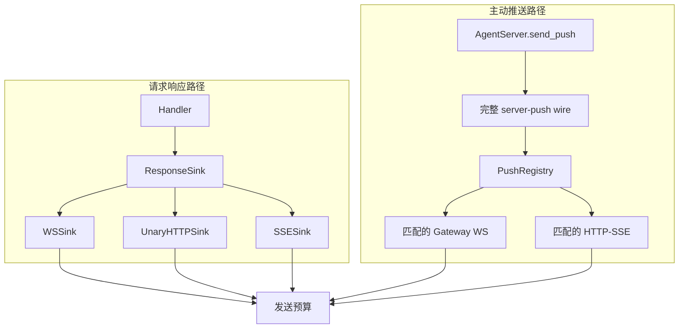
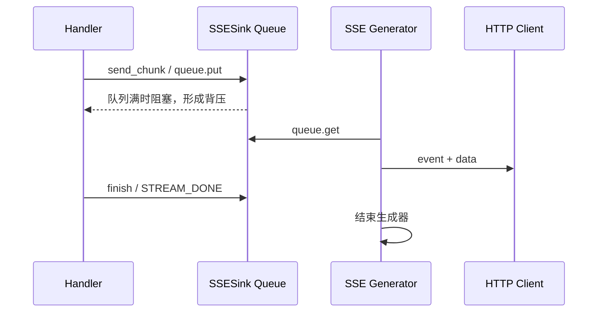
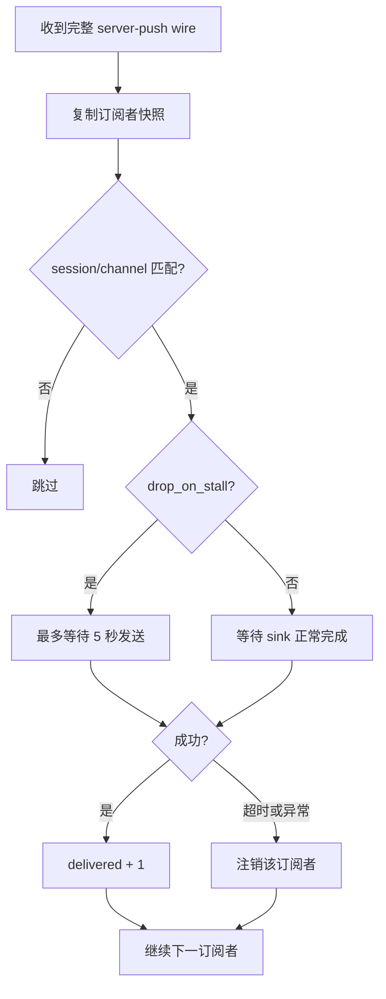

# JiuWenSwarm Server Transports 模块讲解

## 1. 文档范围与代码基线

本文档讲解 `jiuwenswarm/server/transports/**/*.py`，即 AgentServer 的响应出口与主动推送订阅管理，不展开 HTTP 路由、WebSocket 服务端和具体业务 handler。

代码基线：

- 分支：`dev-stable`
- 提交：`dc3a5e8519bdf3babdf91719ee48faa95d614c8a`
- 提交日期：2026-09-05
- 提交说明：`!6057 merge skill_acceleration_exec_0904 into dev-stable`
- Python 文件数：3

目录结构如下：

```text
jiuwenswarm/server/transports/
├── __init__.py
├── push_registry.py
└── sink.py
```

## 2. 整体模块说明

### 2.1 为什么需要传输抽象

AgentServer 同时提供 WebSocket、普通 HTTP 和 SSE 三种响应方式。业务 handler 如果直接操作 socket、FastAPI response 或 SSE 生成器，就会为每种入口复制编码、错误处理和大小限制逻辑。

`transports` 用 `ResponseSink` 把差异收口：handler 只表达“发送最终响应”“发送一个分片”“发送错误”或“发送已构造 wire”；由具体 sink 决定是立即写 WebSocket、暂存在内存，还是放入 SSE 队列。

| 场景 | Sink | 实际行为 |
|---|---|---|
| WebSocket 请求响应 | `WSSink` | 编码后加锁写入当前连接 |
| 普通 HTTP 请求 | `UnaryHTTPSink` | 暂存结果，路由在 handler 返回后生成 HTTP 响应 |
| HTTP 流式请求 | `SSESink` | 编码后放入有界队列，由 SSE 生成器逐项消费 |
| 服务端主动推送 | 已注册的 WS/SSE sink | `PushRegistry` 根据过滤条件扇出 |

### 2.2 普通响应与主动推送是两条路径



普通响应只面向本次请求携带的 sink；主动推送没有天然“当前请求连接”，因此先通过注册表找到订阅者。两条路径最终使用相同 wire 编码和发送预算。

### 2.3 模块边界

| 本模块负责 | 本模块不负责 |
|---|---|
| 业务对象编码为 wire | 解析入站请求 |
| 不同传输方式的写出策略 | 决定调用哪个业务 handler |
| SSE 队列背压与结束哨兵 | 构造业务 payload 的含义 |
| 主动推送订阅、过滤和扇出 | 建立 HTTP/WS 监听服务 |
| 反向 RPC owner 选择 | 实际执行 ACP/A2A 工具请求 |

## 3. `jiuwenswarm/server/transports/__init__.py`

### 文件说明

该文件定义包级说明，并从 `sink.py` 重新导出以下四个公共类型：

```text
ResponseSink
WSSink
UnaryHTTPSink
SSESink
```

`__all__` 只包含这些响应出口。`PushRegistry` 没有在包入口中重导出，主动推送调用方需要从 `push_registry.py` 显式导入。这也体现了两层边界：sink 是业务 handler 的常用公共依赖，注册表则是网络连接与主动推送流程使用的服务组件。

## 4. `jiuwenswarm/server/transports/sink.py`

### 4.1 `ResponseSink` 协议

`ResponseSink` 是运行时可检查的 `Protocol`，定义四个异步方法：

| 方法 | 输入 | 用途 |
|---|---|---|
| `send_unary()` | `AgentResponse` | 发送一次性最终响应 |
| `send_chunk()` | `AgentResponseChunk`、序号 | 发送流式分片 |
| `send_error()` | 请求 id、消息、错误码、频道 | 构造并发送标准失败响应 |
| `send_wire()` | 已编码的 wire 字典 | 发送解析错误、主动推送等已完成协议编码的数据 |

前三个方法让 handler 使用业务对象，具体 sink 内部调用统一的 E2A wire codec；`send_wire()` 则避免已经构造好的帧再次编码。

各发送方法返回 `bool`。`True` 表示原始帧被接受或发送，`False` 可能表示帧因超过预算被替换为降级错误，或者收尾投递未成功。调用方可据此停止继续发送后续大分片。

### 4.2 三种实现的差异

| 对比项 | `WSSink` | `UnaryHTTPSink` | `SSESink` |
|---|---|---|---|
| 网络写入时机 | 方法调用时立即写 socket | 不直接写网络 | SSE 生成器消费队列时写出 |
| 状态 | WebSocket 与共享发送锁 | 最后响应、wire、frame 列表 | 最大 256 项的异步队列 |
| 并发控制 | `asyncio.Lock` 防止同连接写入交错 | 单请求内暂存 | 队列容量形成背压 |
| 流分片 | 直接发送 | 记录 frame，但不把 chunk 当作普通 HTTP 最终响应 | 入队逐项发送 |
| 结束机制 | 请求流程自然结束 | handler 返回后读取 `last_frame` | `STREAM_DONE` 哨兵 |
| 大小限制 | `send_wire_payload()` | `enforce_send_budget()` | `enforce_send_budget()` |

### 4.3 `WSSink`

`WSSink` 持有 WebSocket 对象和连接级 `send_lock`。同一连接上可以并发处理多个请求，每个请求都有自己的上下文和 sink，但它们共享这把锁，因此两条协程不会同时调用 `ws.send()` 导致帧写入竞争。

```text
请求 A handler ─┐
                ├─ acquire send_lock → send_wire_payload → ws.send
请求 B handler ─┘
```

`send_unary()` 与 `send_chunk()` 先调用 E2A codec，`send_error()` 先构造失败的 `AgentResponse`，最终都进入 `send_wire()`。真正写 socket 前统一经过 `ws_send.send_wire_payload()`，超大帧会被替换为有界错误帧。

### 4.4 `UnaryHTTPSink`

普通 HTTP 的 handler 与 WebSocket handler 共用，因此仍按 sink 协议“发送”结果。但 HTTP 路由需要在业务处理结束后统一决定状态码和响应体，`UnaryHTTPSink` 就承担这个内存收集器角色。

它保存三类信息：

- `response`：最后一个普通 `AgentResponse` 业务对象；
- `wire`：经过发送预算检查后的最后 wire；
- `frames`：handler 产生过的全部 wire 记录，便于诊断非预期输出方式。

`send_chunk()` 会记录分片，但不会把它伪装成普通 HTTP 的最终响应。`last_frame()` 优先返回可用的最终 wire；如果 handler 只产生过 chunk 而没有普通响应，代码留下告警，提示路由和 handler 的流式/非流式接法可能不一致。

普通 HTTP 同样执行发送预算：即使没有 WebSocket，过大的业务结果也会得到和其他传输一致的降级错误，而不是让不同协议暴露不同上限。

### 4.5 `SSESink` 与背压

`SSESink` 使用 `asyncio.Queue` 连接生产者 handler 和消费者 SSE 生成器，默认最大容量为 256。



正常输出使用阻塞式 `queue.put()` 是有意设计：客户端消费慢时，handler 也应减速，避免内存无限堆积。

收尾路径不能无限等待。客户端中途断开后，SSE 生成器可能已经无人消费，而队列恰好已满；如果 `finish()` 仍永久等待 `put()`，取消 handler 的清理流程也会挂住。为此：

1. `offer()` 先尝试 `put_nowait()`；
2. 队列满时最多等待 `FINISH_TIMEOUT=5.0` 秒；
3. 仍无法投递则返回 `False`；
4. `finish()` 放弃结束哨兵并记录告警，不让任务永久泄漏。

`CancelledError` 不会被伪装成正常投递失败，而是继续向外传播，保留协程取消语义。

## 5. `jiuwenswarm/server/transports/push_registry.py`

### 5.1 文件定位

`push_registry.py` 把“向当前连接推送”改造成“向已登记且匹配的订阅者推送”。Gateway WebSocket 和 `GET /api/v1/events/stream` 建立的 HTTP-SSE 连接都注册在这里。

它与 `server/gateway_push` 角色不同：后者是业务调用方使用的推送客户端/构造入口，本文件是 AgentServer 侧决定投递对象的注册表。

### 5.2 订阅者模型

内部 `_Subscriber` 保存：

| 字段 | 说明 |
|---|---|
| `sink` | 已注册的 `ResponseSink` |
| `session_id` | 可选会话过滤；`None` 表示不按会话收窄 |
| `channel_id` | 可选频道过滤；`None` 表示不按频道收窄 |
| `drop_on_stall` | 发送停滞时是否应用超时并注销 |

过滤采取“订阅者主动收窄”语义。如果订阅者指定了 session 或 channel，wire 缺少对应字段也算不匹配；这样宁可少投递，也不把其他会话的数据发给受限订阅者。

`subscriber_kind()` 根据 id 前缀区分 `gateway-ws`、`http-sse` 和其他订阅者，主要用于诊断日志。

### 5.3 为什么 WebSocket 使用每连接唯一 id

`make_ws_push_subscriber_id(ws)` 返回 `gateway-ws:<id(ws)>`。每条存活 Gateway/Relay WebSocket 都占一个独立槽位。

```text
PushRegistry
├── gateway-ws:14001 → 长连接 A
├── gateway-ws:14002 → 短连接 B
└── http-sse:req_x:abcd → SSE 订阅 C
```

这样，短连接 B 断开时只注销自己的 id，不会清掉仍存活的 A。若使用一个固定 `gateway-ws` 键，短连接覆盖长连接后再断开，会让长连接虽然还能接收请求响应，却永久失去 `chat.file` 等主动推送。

保留的 `WS_PUSH_SUBSCRIBER_ID` 只是兼容前缀，不应再作为全局单槽 id 使用。

### 5.4 注册、注销和过滤

`register()` 将订阅者写入字典；相同 id 会覆盖旧记录。`unregister()` 是幂等的，不存在时静默返回，适合连接关闭和异常清理的重入路径。

普通 `push()` 的流程如下：



遍历使用注册表快照，因此发送过程中发生的新注册或注销不会改变本轮迭代。一个订阅者失败也不会中止其他订阅者，最终返回成功投递数量。

### 5.5 SSE 与 WebSocket 的停滞策略

| 订阅者 | `drop_on_stall` | 原因 |
|---|---:|---|
| HTTP-SSE | `True` | `SSESink.send_wire()` 可能因队列满而长期阻塞；需要 5 秒上限保护串行扇出 |
| Gateway WebSocket | `False` | 大帧或临时背压不应把仍有效的主连接误摘除；连接生命周期由 WS handler 管理 |

`push()` 是串行扇出。如果没有 SSE 超时，一个停止读取的客户端会卡住后续全部订阅者，并连带阻塞 Cron、文件推送和主动推荐等调用方。WebSocket 则沿用“不因慢发送注销”的语义，避免有效长连接静默丢失主动推送能力。

### 5.6 反向 RPC owner

普通 server push 可以扇出，但 ACP/A2A 反向 RPC 不能让多个 Gateway 或 SSE 客户端重复执行同一请求。因此注册表单独维护一个 owner：

- `register(..., reverse_rpc_capable=True)` 把该可信订阅者设为当前 owner；
- 后注册的可用 owner 替换前一个，并触发 owner 丢失回调；
- `push_reverse_rpc()` 只向当前 owner 点对点发送；
- owner 注销、超时或失败时清空所有权并通知回调；
- `reverse_rpc_ready()` 只在 owner id 仍存在于订阅表时返回 `True`。

```text
普通推送：一条 wire → 所有匹配订阅者
反向 RPC：一条 wire → 当前 reverse_rpc_owner
```

这两种语义被有意分开，不能用普通扇出代替反向 RPC 投递。

### 5.7 单例入口

`get_push_registry()` 返回模块级单例。AgentServer 连接处理、HTTP-SSE 路由和业务主动推送都通过同一个实例协作，因此 Cron、Team、Agent 工具等调用方不需要保存具体网络连接。

## 6. 两条完整传输链路

### 6.1 请求响应

```text
HTTP / WebSocket 入站
  → RequestContext.sink
  → handler.send_unary / send_chunk / send_error
  → E2A wire codec
  → 发送预算
  → WebSocket、HTTP 响应体或 SSE 队列
```

### 6.2 主动推送

```text
业务调用方
  → 构造完整 server-push wire
  → PushRegistry
  → session/channel 过滤
  → 普通扇出或 reverse RPC owner
  → subscriber.sink.send_wire
  → 发送预算
```

## 7. 设计要点总结

- `ResponseSink` 让 handler 与 WebSocket、HTTP、SSE 的写出细节解耦。
- 三种 sink 共享 wire codec 和字节预算，但根据协议选择加锁、暂存或有界队列。
- SSE 的正常发送允许背压，结束投递则有 5 秒上限，避免断连后任务泄漏。
- WebSocket 订阅使用每连接唯一 id，断开只清理本连接。
- 普通主动推送可以按 session/channel 扇出；反向 RPC 只投递给唯一 owner。
- `PushRegistry` 处理的是“推给谁”，不负责构造业务推送内容。
