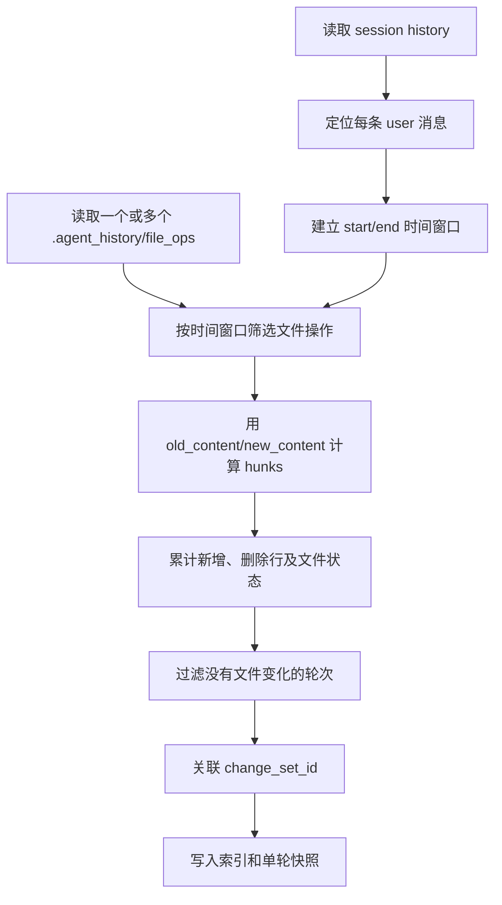
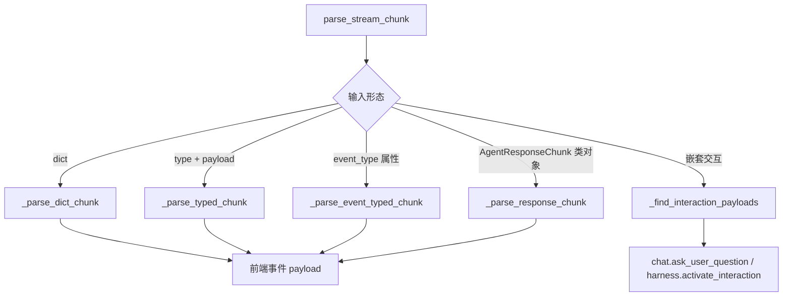

# JiuWenSwarm Server Utils 模块讲解

## 1. 文档范围与代码基线

本文档讲解 `jiuwenswarm/server/utils/**/*.py`，即 AgentServer 工具目录中的 Python 文件，不展开调用它们的 handler、运行时和传输层实现。

代码基线：

- 分支：`dev-stable`
- 提交：`dc3a5e8519bdf3babdf91719ee48faa95d614c8a`
- 提交日期：2026-09-05
- 提交说明：`!6057 merge skill_acceleration_exec_0904 into dev-stable`
- Python 文件数：4

目录结构如下：

```text
jiuwenswarm/server/utils/
├── __init__.py
├── diff_service.py
├── stream_utils.py
└── utils.py
```

## 2. 整体模块说明

### 2.1 Utils 承担什么职责

`utils` 不是单纯存放零散辅助函数的目录。这里包含三个彼此独立、被多个服务端流程复用的能力：

| 能力 | 文件 | 输入 | 输出或影响 |
|---|---|---|---|
| 会话轮次差异 | `diff_service.py` | 会话历史、Agent 文件操作记录、Git 工作区 | 每轮文件变更、统计、快照及恢复信息 |
| 流事件归一化 | `stream_utils.py` | 字典、SDK 输出对象、响应分片、交互对象 | 前端可识别且可 JSON 序列化的事件 payload |
| 请求字段判断 | `utils.py` | `AgentRequest` 或参数字典 | chat id、是否为 Team 模式 |
| 包边界 | `__init__.py` | 包导入 | 不执行初始化，也不聚合导出 |

这些能力共同遵循一个边界：它们不持有 WebSocket、HTTP 请求或 SSE 连接。工具模块只负责读取、计算和转换，结果由 handler 交给 `ResponseSink` 发送。

### 2.2 在服务端链路中的位置

```mermaid
flowchart LR
    A[Agent / openJiuwen 输出] --> B[stream_utils.py]
    B --> C[标准前端事件]
    C --> D[Handler]
    D --> E[ResponseSink]

    F[会话历史] --> G[diff_service.py]
    H[.agent_history/file_ops] --> G
    I[Git 工作区] --> G
    G --> J[/diff、rewind、redo]

    K[AgentRequest] --> L[utils.py]
    L --> M[聊天与 Team Handler]
```

`stream_utils.py` 解决“运行时输出形态很多”的问题；`diff_service.py` 解决“文件改动分散在历史记录、快照和 Git 状态中”的问题；`utils.py` 则统一少量容易被各 handler 重复实现的请求判断。

### 2.3 状态与副作用

| 文件 | 是否持有状态 | 是否访问磁盘 | 是否直接发送网络数据 |
|---|---:|---:|---:|
| `__init__.py` | 否 | 否 | 否 |
| `diff_service.py` | 是，进程级单例及变更集索引 | 是 | 否 |
| `stream_utils.py` | 否 | 否 | 否 |
| `utils.py` | 否 | 否 | 否 |

其中 `diff_service.py` 明显比普通工具函数更接近领域服务：它维护持久化索引和快照，并参与 rewind、redo、discard 等文件恢复流程。其他三个文件则保持无状态或空包入口。

## 3. `jiuwenswarm/server/utils/__init__.py`

### 文件说明

该文件是 `utils` 包的初始化文件。当前源码为空，不导入其他模块，也不定义 `__all__`。

因此，执行 `import jiuwenswarm.server.utils` 不会创建 `DiffService`、读取会话文件或安装任何运行时逻辑。调用方需要从具体模块显式导入 `diff_service`、`stream_utils` 或 `utils`。这种空入口避免在只需要轻量函数时连带加载体量较大的差异服务。

## 4. `jiuwenswarm/server/utils/diff_service.py`

### 4.1 文件定位

`diff_service.py` 实现以用户消息为边界的 turn-based diff 服务。它不是简单调用一次 `git diff`，而是把三类信息合并为稳定的会话视图：

1. 会话历史确定“第几轮”和每轮时间范围；
2. `.agent_history` 中的 `file_ops` 提供每次写文件前后的内容；
3. `change_sets.json` 与单轮快照保存已经建立的变更集身份和历史详情。

其结果被 `/diff`、会话轮次列表、discard、rewind 和 redo 等流程使用。

### 4.2 对外查询入口

| 入口 | 查询方式 | 返回特点 |
|---|---|---|
| `get_turn_diffs()` | 查询会话当前可重建的全部变更轮次 | 完整结果，按最新轮次在前返回 |
| `get_turn_diff_summaries()` | 当前结果再合并持久化索引/快照 | 当前 `file_ops` 已不可重建时，仍尽量保留历史概要 |
| `get_turn_diff()` | 优先按 `change_set_id`，否则按 1-based `turn_index` | 返回单轮详情、`None`，或明确报告历史过期 |
| `get_git_diff()` | 面向指定项目目录读取 Git 差异 | 组合 numstat、name-status、porcelain、hunk 与未跟踪文件 |
| `get_files_to_restore()` / `get_files_to_redo()` | 根据变更轮次收集文件内容 | 为撤销或重做提供具体文件集合 |
| `truncate_file_ops_by_timestamp()` | 按时间软隐藏文件操作 | 支持会话 rewind 后隐藏“未来”改动 |
| `restore_rewound_entries_by_timestamp()` | 恢复被 rewind 隐藏的条目 | 支持 redo 恢复可见性 |

`get_diff_service()` 提供进程级单例，使不同 handler 共享同一服务入口。写入 `change_sets.json` 时使用进程内锁，并采用临时文件替换，降低同进程并发惰性回填互相覆盖或留下半写文件的风险。

### 4.3 轮次差异如何形成

`_compute_turn_diffs()` 以每条用户消息作为一轮起点，下一条用户消息的时间作为本轮结束边界。这样，助手最终消息之后、下一次用户输入之前发生的文件操作仍属于当前轮。



每轮结果保留原始 `turnIndex`，不会因为某些轮没有文件改动而重新编号。这一点使差异结果可以继续和会话历史中的真实轮次对应。

### 4.4 单个文件的结果信息

| 字段 | 含义 |
|---|---|
| `filePath` | 文件路径 |
| `hunks` | 由旧内容和新内容计算出的差异片段 |
| `isNewFile` | 原内容为空且执行写入，表示新建文件 |
| `isDeletedFile` | 新内容为空而旧内容存在，表示删除文件 |
| `isBinary` | 是否为二进制文件 |
| `isLargeFile` / `isTruncated` | 是否因体量限制只保留部分详情 |
| `isUntracked` | 是否为 Git 未跟踪文件 |
| `linesAdded` / `linesRemoved` | 本轮增删行统计 |
| `lastEditTime` | 本轮内最后一次编辑时间 |

模块设置了明确的输出上限：最多展示 50 个文件、总 diff 最大约 1 MB、单文件最多 400 行差异；详细扫描最多考虑 500 个文件。超过限制时通过标记表达结果不完整，而不是让 `/diff` 响应无限增长。

### 4.5 变更集索引和快照

持久化数据放在会话目录中：

```text
<agent_sessions>/<session_id>/
├── change_sets.json
└── change_sets/
    ├── <change_set_id>.json
    └── ...
```

`change_sets.json` 保存轮次与 `change_set_id` 的索引关系；`change_sets/<id>.json` 保存当时的完整轮次快照。两者职责不同：索引用于发现历史轮次，快照用于在原始 `file_ops` 已变化或被清理后继续读取详情。

查询单轮时，代码会校验索引条目的时间和 `request_id` 是否仍与当前轮匹配，防止旧索引错误地绑定到后来重建的会话轮次。

### 4.6 “没有结果”和“历史过期”的区别

`DiffHistoryExpiredError` 表示：调用方持有的 `change_set_id` 或轮次索引仍能证明该历史曾存在，但当前既没有可用快照，也无法从现有文件操作记录重建详情。

| 情况 | 返回行为 |
|---|---|
| 从未存在匹配轮次或变更集 | 返回 `None` 或空列表 |
| 索引和快照均存在 | 返回快照 |
| 索引存在、当前记录可重建 | 返回重新计算的结果 |
| 索引表明历史存在，但详情不可恢复 | 抛出 `DiffHistoryExpiredError` |

这个区分避免上层把“历史资料已失效”错误显示为“这一轮没有改文件”。

### 4.7 工作区与 Agent 历史定位

`resolve_project_dir()` 优先使用显式项目目录，缺失时从会话 metadata 推断。读取 Agent 历史时还会考虑共享 workspace、额外 history root 和 Git worktree 容器，并通过优先级保证项目根目录的记录优先于共享或未知来源。

源码识别 `.worktrees` 和 `.jiuwen/worktrees` 两类 worktree 容器，并把 worktree 中记录的文件路径映射回实际项目。`.agent_history` 本身被列入内部未跟踪目录，不会作为用户项目改动展示。

### 4.8 Git 差异解析

除 `file_ops` 外，模块还封装 Git 命令和多种输出解析：

- `numstat` 用于增删行统计及二进制识别；
- `name-status` 用于新增、删除、重命名等状态；
- porcelain status 用于工作区状态；
- patch hunk 用于具体行级差异；
- 未跟踪文件单独收集，并过滤内部目录；
- 对 Git 引号路径和 C 风格转义路径进行还原。

当仓库处于 merge、rebase 等瞬态状态时，代码会避免把不稳定结果当成正常差异。大型文件的 diff 也会拆分或截断，和上面的结果预算共同保护服务响应。

### 4.9 rewind、discard 与 redo

文件操作记录采用两种软隐藏标记：

| 标记语义 | 用途 | 恢复边界 |
|---|---|---|
| `rewound_out` | 会话回退后隐藏时间点之后的“未来”操作 | 由对应 rewind/redo 时间范围恢复 |
| `discarded_out` | 用户显式丢弃某一轮文件变化 | redo 只恢复 discard 产生的隐藏 |

两种标记分开保存，避免 redo 错误地暴露会话 rewind 已经隐藏的未来记录。软隐藏仍保留 `old_content`，因此后续文件恢复不依赖当前工作区是否还保持原样。

## 5. `jiuwenswarm/server/utils/stream_utils.py`

### 5.1 文件定位

`stream_utils.py` 是 Agent/OpenJiuwen 输出到 JiuWenSwarm 前端事件协议之间的归一化层。运行时输出可能是普通字典、带 `type`/`payload` 属性的对象、带 `event_type` 的模型、`AgentResponseChunk`，也可能把人工交互深埋在多层 controller 结果中。`parse_stream_chunk()` 为这些形态提供单一入口。

传输层只需要认识归一化后的字典，不需要依赖各种 SDK 输出类型。

### 5.2 解析分派



解析结果可能为 `None`，例如空白内容或没有可见语义的中间对象。调用方应把 `None` 理解为“本块无需发送”，而不是解析失败。

### 5.3 常见事件转换

| 输入特征 | 归一化结果 |
|---|---|
| 字典已有 `event_type` | 保留事件语义并递归序列化 |
| `type="tool_call"` | `event_type="tool.use"` |
| `type="tool_result"` | `event_type="tool.result"` |
| 普通 `content` 或 `output` | 首段为 `chat.delta`，结束形态为 `chat.final` |
| `result_type="error"` | `chat.error` |
| `type="chat.ask_user_question"` | 标准提问 payload |
| `task.start` / `task.update` / `task.complete` | 保留任务进度字段 |
| 带 `event_type` 的 Pydantic/普通对象 | 导出对象字段并保留事件类型 |

函数通过 `_has_streamed_content` 判断一段内容应当表现为增量还是最终结果，避免同一输出同时被前端当作普通文本和最终帧。

### 5.4 人工交互解析

运行时的 `__interaction__` 可能出现在字典、列表、Pydantic 模型或对象的 `payload`、`data`、`value`、`result` 属性中。`_find_interaction_payloads()` 做有界递归搜索：最大深度为 8，并记录已访问对象 id，防止循环引用造成无限遍历。

发现交互后：

- 普通 interrupt 由公共转换函数整理成 `chat.ask_user_question`；
- `activate_confirm` 转为 `harness.activate_interaction`，保留扩展名称、运行路径、交互 id 和可选项；
- 旧字段 `_evolution_meta` 被规范为 `evolution_meta`，随后删除旧键。

这种处理让前端不需要了解 Controller 的内部包装层级。

### 5.5 JSON 安全序列化和来源标识

`_serialize_chunk_recursive()` 与 `_serialize_value()` 负责把输出变成可传输数据。日期和时间转为 ISO 字符串，枚举转为值，Pydantic 模型优先使用 JSON 模式导出，其他容器递归处理。

`_propagate_stream_source_id()` 保留 Skill Turbo 等并行执行节点写入的来源标识。这个 id 不改变事件内容，但允许上层区分多个并行流，避免把不同来源的增量错误拼接成一条输出。

## 6. `jiuwenswarm/server/utils/utils.py`

### 6.1 `get_chat_id()`

该函数统一取得平台聊天标识。读取顺序如下：

```text
request.chat_id
  → metadata.feishu_chat_id
  → metadata.wecom_chat_id
  → metadata.dingtalk_chat_id
  → metadata.xiaoyi_session_id
  → None
```

顶层 `chat_id` 是当前协议字段，metadata 回退用于兼容旧渠道载荷。多个旧字段同时存在时，按上述平台顺序取第一个非空值。

### 6.2 `is_team_params()`

该函数判断参数是否要求 Team 模式。非 `Mapping` 输入直接返回 `False`；有效字典满足以下任一条件即返回 `True`：

- `team` 字段为真值；
- `mode` 经去空格和转小写后为 `team`、`team.plan` 或 `code.team`。

集中判断可保证聊天执行、取消和 Team handler 使用同一组模式别名。

## 7. 模块协作关系

```text
chat / team handler
├── utils.py：读取 chat_id、识别 Team 模式
└── stream_utils.py：把 Agent 输出转换为前端事件
        └── ResponseSink：编码并发送

command / session handler
└── diff_service.py
    ├── session history：确定轮次
    ├── .agent_history/file_ops：重建当轮文件操作
    ├── Git：补充当前工作区差异
    └── change_sets：保存可寻址的历史快照
```

三类工具没有相互调用关系，分别服务于请求识别、流协议适配和文件历史领域。它们被放在同一目录，是因为都跨越多个 handler 复用，而不是因为属于同一条执行链。

## 8. 设计要点总结

- `diff_service.py` 的核心是“按会话轮次重建并持久化差异”，不是对 `git diff` 的薄封装。
- 变更集索引和单轮快照让历史差异具有稳定 id，并能区分不存在与已过期。
- rewind 和 discard 使用不同软隐藏标记，避免 redo 恢复错误的历史区间。
- `stream_utils.py` 把多种 SDK 输出统一为前端事件，同时处理人工交互和 JSON 序列化。
- `utils.py` 只保存两个跨 handler 的轻量判断；空 `__init__.py` 不制造隐式初始化副作用。
