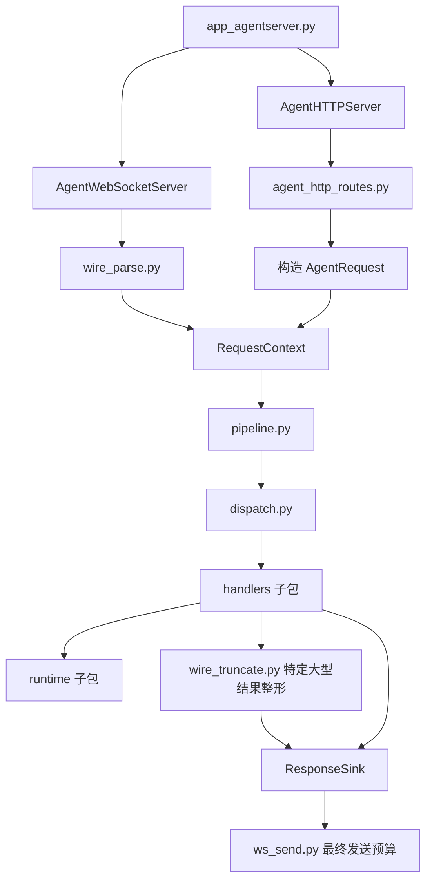
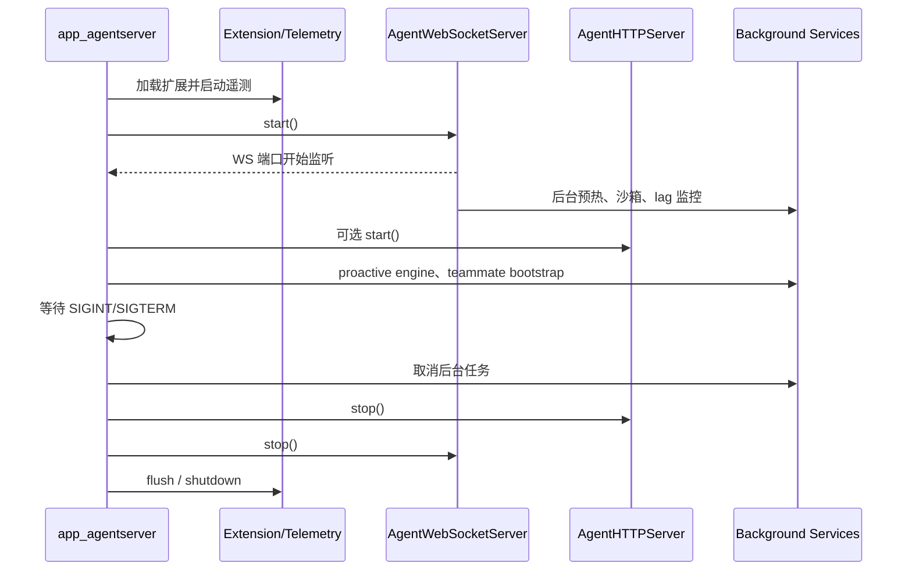
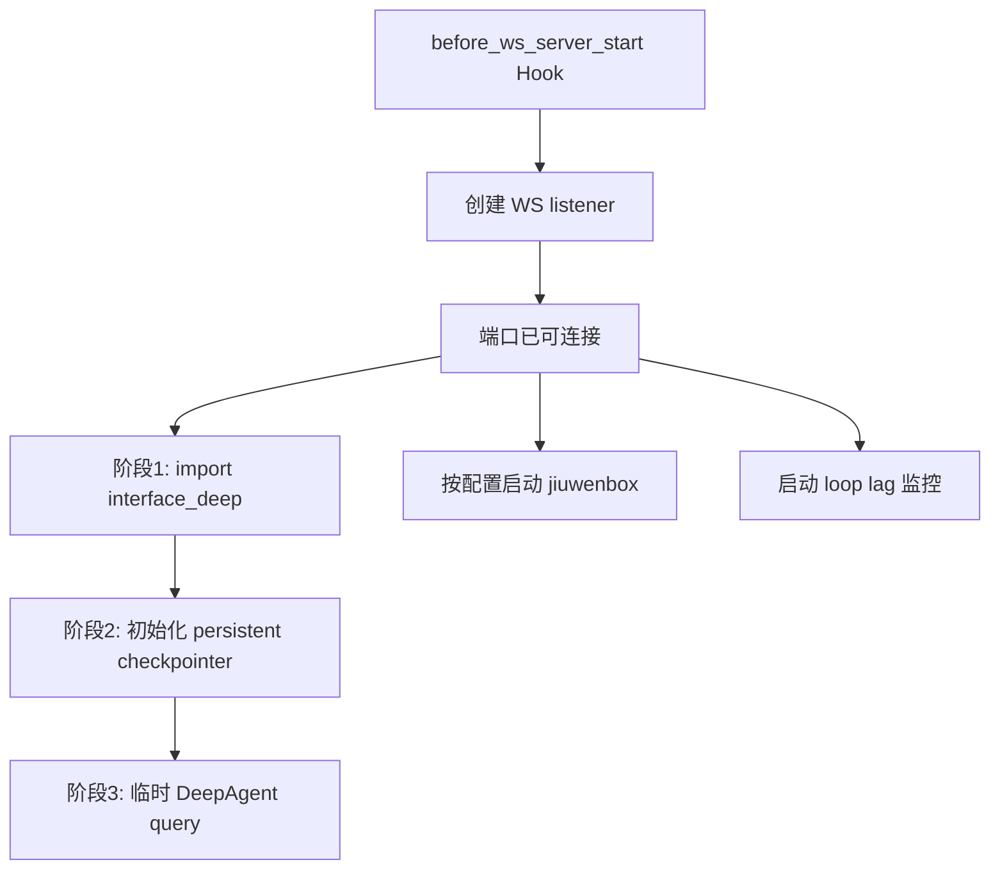
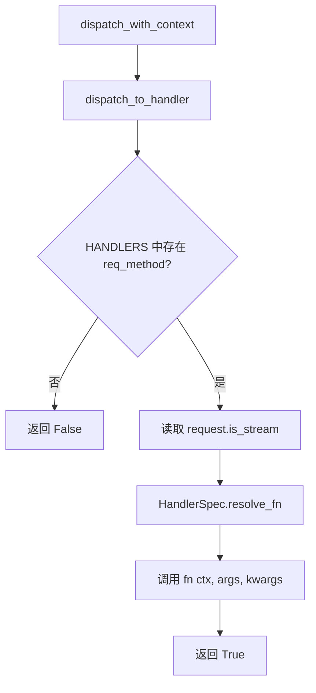
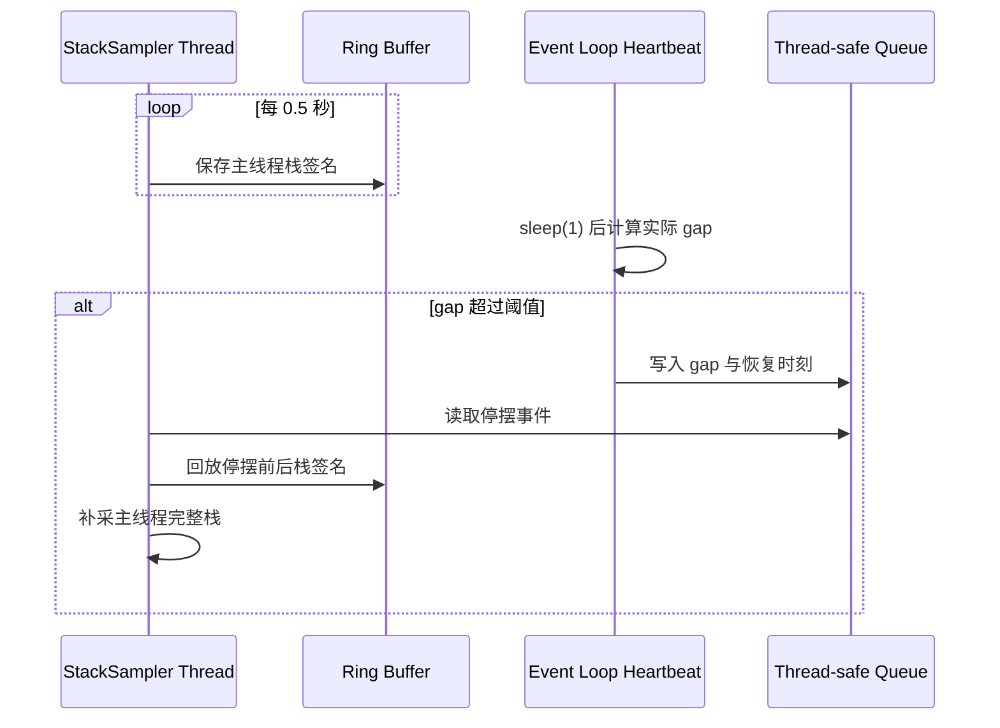
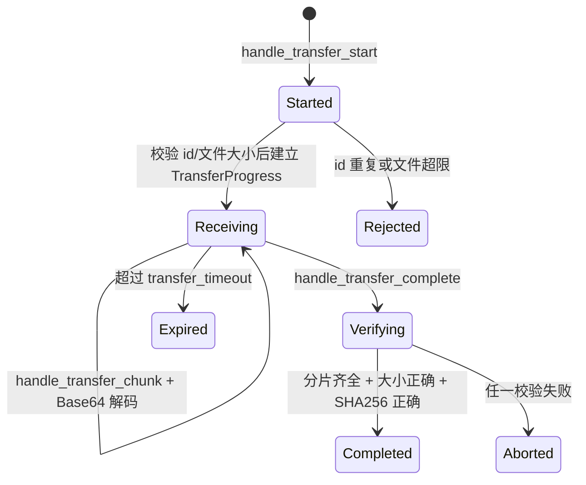
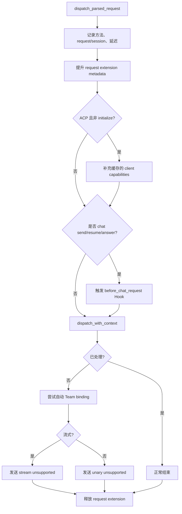
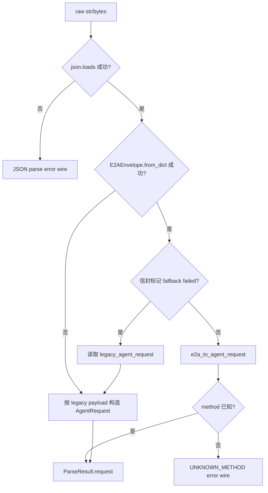

# JiuWenSwarm Server 根目录模块讲解

## 1. 文档范围与代码基线

本文档讲解 `jiuwenswarm/server/*.py`，只包含 `server` 根目录直接存放的 Python 文件，不重复展开 `handlers/`、`runtime/`、`transports/`、`gateway_push/` 等子目录的具体实现。

代码基线：

- 分支：`dev-stable`
- 提交：`dc3a5e8519bdf3babdf91719ee48faa95d614c8a`
- 提交时间：`2026-09-05 17:32:09 +0800`
- 提交说明：`!6057 merge skill_acceleration_exec_0904 into dev-stable`
- Python 文件数：14

目录结构如下：

```text
jiuwenswarm/server/
├── __init__.py
├── agent_http_routes.py
├── agent_http_server.py
├── agent_ws_server.py
├── app_agentserver.py
├── context.py
├── dispatch.py
├── event_loop_monitor.py
├── file_transfer_manager.py
├── pipeline.py
├── tool_concurrency.py
├── wire_parse.py
├── wire_truncate.py
└── ws_send.py
```

## 2. 整体模块说明

### 2.1 Server 根目录承担什么职责

`server` 根目录是 AgentServer 的运行外壳和请求骨架。它不直接实现 Agent 推理、会话存储或具体命令，而是把这些能力组织成可通过 WebSocket、HTTP 和 SSE 使用的服务。

这些文件可以分成六组：

| 模块组 | 文件 | 主要职责 |
|---|---|---|
| 进程装配 | `app_agentserver.py` | 初始化环境、扩展和遥测，启动/停止服务 |
| 网络入口 | `agent_ws_server.py`、`agent_http_server.py`、`agent_http_routes.py` | 接收 WS/REST/SSE 请求并管理连接 |
| 公共请求链路 | `wire_parse.py`、`context.py`、`pipeline.py`、`dispatch.py` | 解析请求、建立上下文、执行公共 Hook、分发 handler |
| 响应保护 | `wire_truncate.py`、`ws_send.py` | 对大型领域数据整形，并对所有 wire 帧执行最终预算检查 |
| 运行保障 | `event_loop_monitor.py`、`tool_concurrency.py` | 观测事件循环/内存，限制工具批次并发 |
| 辅助服务 | `file_transfer_manager.py` | 管理 Gateway 与 AgentServer 间的双向分片传输 |

`__init__.py` 另外提供 SDK 侧的惰性导出，不参与网络请求处理。

### 2.2 分层关系



WebSocket 和 HTTP 的差异主要存在于请求接入和响应写出两端。载荷成为 `AgentRequest` 后，两条路径都进入 `dispatch_parsed_request()`，使用同一个 `RequestContext` 和同一张 handler 分发表。

### 2.3 一次请求的公共路径

```text
原始 WS JSON / REST 参数 / E2A envelope
  → 解析或构造 AgentRequest
  → RequestContext(request, sink, connection_id, services)
  → 请求扩展元数据与聊天前 Hook
  → dispatch.py 查找 HandlerSpec
  → handler 调用 runtime
  → ctx.sink 发送响应
  → wire 编码和字节预算
  → WebSocket / HTTP / SSE
```

如果分发表没有找到处理器，pipeline 会先尝试为聊天请求自动绑定 Team，再判断流式请求还是普通请求并返回对应的 unsupported response。解析失败、handler 异常和连接关闭也在各自合适的层次处理，不把传输对象泄漏到业务 handler。

### 2.4 两种网络入口的差异

| 对比项 | WebSocket | HTTP / SSE |
|---|---|---|
| 主要文件 | `agent_ws_server.py` | `agent_http_server.py`、`agent_http_routes.py` |
| 请求形态 | 原始 E2A 或兼容 legacy JSON | REST 参数、通用 RPC 或原始 E2A |
| 连接标识 | `str(id(ws))`，每条连接独立 | 固定 `http`，请求本身仍有独立 request id |
| 流式输出 | socket 上连续 E2A 帧 | SSE 队列和事件生成器 |
| 主动推送 | WS 连接注册到 `PushRegistry` | `/events/stream` 注册 SSE 订阅 |
| 生命周期 | 长连接，可并发处理多条消息 | 请求级调用；SSE 为长响应 |

### 2.5 启动与停止关系



HTTP 入口默认关闭，并被设计成附加能力：其启动失败只记录错误，不阻断 WebSocket 主链路。

## 3. `jiuwenswarm/server/__init__.py`

### 文件说明

该文件是 `server` 包入口，惰性导出 `JiuWenSwarm` 和 `SkillManager`。类型检查阶段通过 `TYPE_CHECKING` 提供静态类型；运行时由模块级 `__getattr__()` 在第一次访问对应名称时导入真实实现。

| 导出名 | 实际来源 |
|---|---|
| `JiuWenSwarm` | `server.runtime.agent_adapter.interface` |
| `SkillManager` | `server.runtime.skill.skill_manager` |

访问其他不存在名称时抛出标准 `AttributeError`。这种方式避免执行 `import jiuwenswarm.server` 时立刻加载完整 Agent runtime 和 Skill 系统。

需要注意，当前基线并不从这里导出 `AgentWebSocketServer`；网络服务端由启动模块直接从 `agent_ws_server.py` 导入。

## 4. `jiuwenswarm/server/agent_http_routes.py`

### 4.1 文件定位

该文件把面向客户端的 REST 路径映射为内部 `ReqMethod`，并根据一张 `ROUTES` 表构建 FastAPI 应用。路径层只处理 HTTP 语义，业务执行仍交给 `AgentHTTPServer` 和公共 pipeline。

FastAPI 类型被保留在模块级导入，因为路由函数的注解会被框架运行时解析，并非可随意移到局部的普通依赖。

### 4.2 路由描述模型

`RouteSpec` 保存四类信息：HTTP 动词、路径、内部请求方法、成功状态码，以及可选参数默认值。表中路由覆盖：

| 路由组 | 典型能力 |
|---|---|
| 初始化与会话 | bootstrap、session create/list/get/delete/switch/history |
| 聊天与命令 | chat send/resume、command execute、history stream |
| Agent 与 Team | agent 配置、Team 操作、远端成员 |
| Skill 与扩展 | skill sources、extensions、hooks、plugins |
| 调度与问题 | schedule、issues、harness |
| 权限与配置 | permissions、config、运维接口 |
| 其他 | symphony、channel config、updater、heartbeat |

会话创建路由把 `create_token` 默认设置为当前 `request_id`，使客户端重试时可以获得幂等标识。

### 4.3 参数和请求上下文

`collect_params()` 合并 JSON body、path 参数和 query 参数，优先级为 body 高于 path，高于 query。空 body 或无效 JSON按空字典处理；若 JSON 顶层不是对象，则包装成 `{"body": data}`。

模块内的 HTTP `RequestContext` 与 `server.context.RequestContext` 不是同一个类型。前者先从 HTTP 请求提取身份和路由字段：

| 字段 | 主要来源 |
|---|---|
| `request_id` | `x-request-id`，缺失时生成新 id |
| `channel_id` | header，缺失默认 `web` |
| `session_id` | path 或 header |
| `user_id` | `x-user-id` |
| `routing` | group、bot、gateway 等 header |
| `tenant_ids` | service、agent、workspace header |
| `request_ext` | 内部扩展 header 解码结果 |

内部扩展 header 无法解析时返回 HTTP 400，避免把损坏的上下文悄悄传给业务层。

### 4.4 流式判定

普通 REST 请求满足以下任一条件时选择 SSE：

- `Accept` 包含 `text/event-stream`；
- 参数中的 `enable_streaming` 是 true-like 值。

`/e2a` 会优先读取信封自己的 `is_stream`，再参考 `Accept`。路由层据此在 `invoke_unary()` 与 `iter_stream()` 之间选择，不要求 handler 理解 HTTP header。

### 4.5 特殊路由

不能用普通 `RouteSpec` 完整表达的接口由专门逻辑注册：

| 路由 | 特殊行为 |
|---|---|
| `GET /health` | 直接返回服务健康状态 |
| `GET /events/stream` | 建立主动推送 SSE 订阅，注册唯一 id 和可选 session/channel 过滤 |
| `POST /chat/completions`、`/chat/resume` | 根据请求选择普通响应或 SSE |
| `GET /sessions/{id}/history/stream` | 以 SSE 返回历史流 |
| `POST /rpc/{method}` | 校验动态 `ReqMethod` 后通用透传 |
| `POST /e2a` | 保留完整 E2A 信封语义，直接进入 wire 解析路径 |

`/events/stream` 在生成器退出时注销订阅者。只有带受信任标识的 Gateway consumer 才声明 `reverse_rpc_capable`，防止普通 SSE 客户端成为 ACP/A2A 反向 RPC 执行者。

### 4.6 FastAPI 应用构建

`build_fastapi_app()` 创建文档前缀、CORS 和所有闭包路由。普通路由成功时可以使用 `RouteSpec.status` 返回 201 等状态；失败状态则由内部错误帧映射。路由闭包最终只负责调用 `AgentHTTPServer`，不复制 handler 分发逻辑。

## 5. `jiuwenswarm/server/agent_http_server.py`

### 5.1 文件定位

该文件实现可选的 HTTP/SSE 服务端，并复用 `AgentWebSocketServer` 已持有的 AgentManager、调度器、租户池等服务。HTTP 不是独立业务栈，而是同一 AgentServer 的第二种接入方式。

默认监听地址为 `127.0.0.1`，默认端口为 8766。是否开启、host 和 port 的优先级为环境变量高于配置文件，高于默认值；`http_server.enabled` 默认关闭。

### 5.2 请求构造与响应转换

REST 参数先构造成 E2A envelope，再通过公共兼容转换得到 `AgentRequest`。这样 REST 与原始 E2A 请求共享字段规范，包括 routing、request extension 和多租户标识。

`frame_to_http_envelope()` 把内部 wire 转成 HTTP 响应体和状态码：

- 成功帧提取 body 与 metadata；
- 失败帧优先读取明确错误 code；
- 没有明确 code 时，再根据错误信息关键词映射 4xx/5xx；
- 空帧仍产生结构完整的成功响应。

这种映射只发生在 HTTP 边界，内部 handler 继续使用统一的 `AgentResponse` 语义。

### 5.3 普通 HTTP 与 SSE

| 方法 | Sink | 行为 |
|---|---|---|
| `invoke_unary()` | `UnaryHTTPSink` | 强制 `is_stream=False`，等待 handler 完成后取最后 wire |
| `iter_stream()` | `SSESink` | 构造流式请求，由 SSE pump 逐帧产出 |
| `iter_raw_envelope()` | `SSESink` | 保留 `/e2a` 原信封并流式处理 |
| `dispatch_raw_envelope()` | 调用方提供 | 复用 `wire_parse.parse_inbound()` |

`_pump_sse()` 用独立任务运行 handler。handler 异常时尝试投递终止错误，结束时放入 `STREAM_DONE`；若 HTTP 客户端断开，生成器取消 runner，避免后台请求失去消费者后继续运行。

### 5.4 HTTP 连接上下文

HTTP 使用固定 `connection_id="http"` 建立公共 `RequestContext`。它没有把每个短请求伪装成 WebSocket 连接；请求隔离依靠独立 request id、session 和 sink。所有服务能力仍由 `AgentServerServices(ws_server)` 提供。

### 5.5 服务生命周期

`start()` 使用 uvicorn 后台任务启动应用，并在约 5 秒内确认服务是否真正进入 started 状态。端口被占用时按 `+1000` 的步长尝试最多 10 个候选端口。

HTTP 启动被包装成 best-effort：uvicorn 的 `SystemExit` 和其他异常不会拖垮已工作的 WebSocket 服务。`stop()` 先请求优雅退出，正常关闭最多等待 10 秒；启动失败的清理使用更短的 2 秒上限，最后才取消残留任务。

### 5.6 CORS 与直接访问保护

CORS 来源优先使用环境变量，其次配置；未配置时生成本地前端常用端口。若配置通配符，代码关闭 credentials 并记录告警，避免产生浏览器不接受的组合。

企业版还对部分 Skill HTTP 接口设置白名单保护，防止绕过 Gateway 的租户与权限路径直接调用敏感操作。

## 6. `jiuwenswarm/server/agent_ws_server.py`

### 6.1 文件定位

`agent_ws_server.py` 是 Gateway/Relay 与 AgentServer 之间的主连接服务，也是若干进程级服务对象的宿主。它既负责 WebSocket 监听和消息接入，也维护 AgentManager、流任务、调度器、模型缓存、jiuwenbox runner、proactive engine 及客户端能力缓存。

该类采用单例入口 `get_instance()`；`reset_instance()` 主要用于测试或进程级重置。

### 6.2 启动流程和后台预热

`start()` 优先使用 `websockets.legacy.server.serve` 以兼容 Gateway 的 legacy client，缺失时回退到新版 API。监听参数包括 ping 间隔、ping 超时和 `AGENT_WS_MAX_MESSAGE_BYTES` 入站上限。

关键设计是“先监听，再预热”：



阶段 1/2 放入可被首个真实请求兜底等待的后台 task；阶段 3 是独立 fire-and-forget query，不阻塞监听，也不让首请求等待一次可能很慢的预热模型调用。配置可关闭预热，默认 query 为 `hello`，默认使用 mock model 避免消耗 token。

`ensure_interface_deep_and_checkpointer()` 保证需要 Deep Adapter 的真实请求到达时，前两阶段依赖已经完成。

### 6.3 握手与连接管理

`_process_request()` 在 WebSocket 握手阶段提取 path 和 Origin。Origin 检查关闭时直接允许；开启时仅接受允许的浏览器来源，否则返回拒绝握手响应。

每条连接由 `_connection_handler()` 管理：

1. 触发 AgentServer started 扩展 Hook；
2. 创建该连接共享的 `send_lock`；
3. 用 `gateway-ws:<id(ws)>` 注册主动推送订阅；
4. 获取并写入身份上下文；
5. 为收到的每条消息创建独立任务，可并发处理；
6. 连接结束时取消/清理所属任务、能力缓存和订阅者。

每连接唯一订阅 id 确保短连接断开只删除自己，不会把仍存活的 Gateway 长连接从主动推送注册表移除。

### 6.4 消息处理

`_handle_message()` 自身很薄：调用 `parse_inbound()`，失败时在连接锁内发送解析器返回的 `error_wire`；成功时建立：

```text
RequestContext(
    request=<AgentRequest>,
    sink=WSSink(ws, send_lock),
    connection_id=str(id(ws)),
    services=AgentServerServices(self),
)
```

随后进入 `dispatch_parsed_request()`。这保证 WS 入口不直接调用具体 handler。

### 6.5 主动推送与反向 RPC

`send_push()` 根据 `response_kind` 区分普通推送与 ACP 输出请求。普通推送要求至少一个订阅者，反向 RPC 则要求注册表存在 owner。消息被编码为 E2A wire 后，分别交给 `PushRegistry.push()` 或 `push_reverse_rpc()`，返回成功送达数量。

返回 0 明确表示没有投递，而非“只记 warning 也算成功”。文件发送等调用方据此判断实际结果。

### 6.6 附属运行能力

| 能力 | 作用 |
|---|---|
| ACP client capabilities | 按连接保存 initialize 得到的客户端能力，后续请求注入使用 |
| session stream tasks | 记录每个 session 的存活流任务，服务于中断和断连清理，不决定交互输出所有权 |
| scheduler | 保存 AutoHarness service 和专用 agent，停止时解除 pin |
| model cache | 为调度任务复用模型配置 |
| tenant pool | 企业多租户 Agent 获取入口 |
| jiuwenbox runner | Linux 且显式 `sandbox.startup_mode=internal` 时 best-effort 自动启动 |
| loop lag task | 每秒测量事件循环唤醒延迟，超过 1 秒 warning、超过 5 秒 error |

jiuwenbox 自动启动只认用户显式配置的 `internal`，不会把缺失字段的默认值误当成授权；非 Linux、YuanRong 类型、policy 文件缺失或启动失败都只记录信息/告警，不阻断 AgentServer。

### 6.7 停止顺序

`stop()` 先取消启动预热和 lag task，再关闭 WebSocket listener，随后取消 KV cache 后台任务，停止 jiuwenbox。调度器等更高层资源由进程装配代码和相应服务清理。取消异常被限制在各自步骤，不影响其余收尾。

## 7. `jiuwenswarm/server/app_agentserver.py`

### 7.1 文件定位

这是 AgentServer 独立进程入口。它只启动 Agent runtime 和面向 Gateway/客户端的 WS、可选 HTTP 服务；Gateway 本身由另一个进程启动。模块大量代码发生在业务重依赖导入之前，目的是先确定实例环境、工作区和日志位置。

### 7.2 导入阶段的准备

```text
提前解析 --dotenv / --name
  → 迁移旧配置并准备工作区
  → 固定 openJiuwen 日志目录
  → 加载实例 config/.env
  → 写入本地业务环境
  → 安装 shell 安全和 SDK 兼容补丁
  → 注册工具并发、调试、thinking、性能 Hook
```

其中包括 SSE-only 模型响应兼容、skip-tool 消息修正、流式工具等待修正、Evolution rail 参数兼容、批量工具并发控制、subagent debug trace、thinking hook 和性能汇总 hook。这些补丁必须在真实 Agent 请求执行前完成。

### 7.3 运行时装配

`_run_with_telemetry()` 的主要步骤如下：

1. 冷加载日志脱敏规则；
2. 创建扩展 Registry/Manager，加载全部扩展；
3. 启动进程遥测；
4. 企业版按需刷新 memory、permission、logging 等配置；
5. 启动 `AgentWebSocketServer`；
6. 初始化 proactive engine；
7. 根据配置 best-effort 启动 HTTP/SSE；
8. 启动分布式 teammate bootstrap daemon；
9. 注册 SIGINT/SIGTERM 并等待停止事件。

扩展先于服务接流量完成加载，使启动前和聊天前 Hook 能在第一条请求时生效。

### 7.4 收尾与退出诊断

停止时按顺序取消 teammate daemon、停止 HTTP、停止 WS、flush 请求性能摘要、关闭 Team 与单 Agent 可观测性，并在线程中关闭 session history。

模块用 `_EXIT_REASON` 保存退出原因，`atexit` 最终以 critical 日志写出。`main()` 区分正常 `asyncio.run` 返回、`SystemExit` 和其他 `BaseException`，便于从日志判断是干净关闭、参数/启动退出还是未捕获异常。

### 7.5 命令行参数

| 参数 | 作用 |
|---|---|
| `--port` / `-p` | 显式指定 WS 端口 |
| `--name` | 启动 `instances.yaml` 中的命名实例 |
| `--dotenv` | 使用指定 `.env`，在模块最早阶段已经处理 |

端口未显式给出时依次读取 `AGENT_SERVER_PORT`、`AGENT_PORT`，最终默认 18092；host 默认 `127.0.0.1`。

## 8. `jiuwenswarm/server/context.py`

### 8.1 `RequestContext`

`RequestContext` 是不可变 dataclass，把传输无关的请求输入和响应出口放在一起：

| 字段 | 含义 |
|---|---|
| `request` | 已解析的 `AgentRequest` |
| `sink` | 当前请求的 `ResponseSink` |
| `connection_id` | WS 连接 id 或 HTTP 固定标识 |
| `services` | 受控的 AgentServer 服务门面 |

`params`、`request_id`、`channel_id`、`session_id` 属性为 handler 提供简洁访问。handler 不需要知道请求来自 WebSocket 还是 FastAPI。

### 8.2 `AgentServerServices`

该类不是任意代理，而是用 `SERVICE_MEMBERS` 白名单约束业务层可访问的 server 能力，主要包括：

- AgentManager、流任务、调度器、jiuwenbox、proactive engine、模型缓存；
- session switch、KV cache checkpointer、adapter 解析等跨域方法；
- 沙箱端口分配、tenant pool、ACP capability；
- `send_push()` 和 capability 更新。

`__getattr__()` 和 `__setattr__()` 只对名单中的名称委托给底层 server。`raw_server` 是为传输/兼容代码保留的逃生口，不鼓励业务 handler 绕过门面任意访问服务端内部状态。

### 8.3 上下文的价值

```text
网络层对象（ws / HTTP）
        ↓ 只在入口存在
RequestContext
├── request：业务输入
├── sink：业务输出
└── services：受控运行能力
        ↓
传输无关 Handler
```

这层抽象是 HTTP 与 WebSocket 共用 handler 的基础，也让 handler 测试可以替换 sink 和 services，而无需建立真实连接。

## 9. `jiuwenswarm/server/dispatch.py`

### 9.1 文件定位

`dispatch.py` 维护 `ReqMethod` 到业务处理函数的集中映射。它不解析 wire，也不决定 HTTP/WS 输出格式，只负责在公共上下文中找到并调用正确 handler。

当前基线在模块顶部直接导入各 handler 模块，`HandlerSpec.fn` 保存的是已经导入、可直接调用的函数对象，不是延迟导入字符串。`HandlerSpec.__post_init__()` 会验证 `fn` 和可选 `stream_fn` 都可调用。

### 9.2 `HandlerSpec`

| 字段 | 含义 |
|---|---|
| `fn` | 默认处理函数 |
| `args` | 预绑定的位置参数 |
| `kwargs` | 预绑定的关键字参数 |
| `stream_fn` | 可选流式专用处理函数 |

`resolve_fn(is_stream)` 在流式请求且存在 `stream_fn` 时选流式实现，否则使用 `fn`。例如 history get 可以为普通响应和 stream 使用不同入口。

调度类请求通过 `_schedule(action)` 把 action 预绑定到共享 schedule handler；issue、permission 等同类方法也采用共享入口，避免为只差一个动作名的协议方法复制包装函数。

### 9.3 分发过程



`False` 表示“没有处理器”，由 pipeline 决定是否尝试 Team 自动绑定和如何回复 unsupported；handler 抛出的异常不会在这里吞掉，而是交给公共 pipeline 统一转换。

`_default_context()` 仍可为兼容调用构造 `WSSink` 与 `AgentServerServices`，但标准入口是接入层已经建立好上下文后调用 `dispatch_with_context()`。

## 10. `jiuwenswarm/server/event_loop_monitor.py`

### 10.1 文件定位

该文件用于定位“同步代码长时间占住主线程/事件循环，导致 ping/pong 超时或任务整体取消”一类问题。它组合了事件循环心跳、独立线程栈采样和内存趋势日志，不参与业务响应。

### 10.2 三个观测组件

| 组件 | 运行位置 | 作用 |
|---|---|---|
| `loop_heartbeat_loop()` | asyncio 事件循环 | 每秒唤醒，根据实际间隔识别停摆 |
| `StackSampler` | 独立线程 | 每 0.5 秒缓存主线程栈签名，收到停摆事件后补采全栈 |
| `memory_trend_loop()` | asyncio 事件循环 | 默认每 120 秒记录 RSS、系统总内存和增量 |

默认停摆阈值为 2 秒，告警最小间隔默认 10 秒，避免反复短停顿刷屏。栈签名环形缓冲默认 120 条，对应约 60 秒回放窗口；每条保留顶部 6 帧摘要。停摆结束后还会以 0.25 秒间隔补采 3 次完整栈。

### 10.3 停摆定位流程



独立采样线程即使事件循环被阻塞仍能工作，因此日志能够指出阻塞期间主线程停在哪段同步调用，而不是只在恢复后得到一个“曾经很慢”的数字。

### 10.4 开关与生命周期

`JIUWENSWARM_EVENT_LOOP_MONITOR=0/false` 可关闭模块；停摆阈值、告警间隔、内存日志间隔和内存占比阈值都可通过环境变量调整。

`ensure_event_loop_monitor()` 幂等启动线程及两个协程；`stop_event_loop_monitor()` 取消协程、通知并等待采样线程退出，再清空事件队列和环形缓冲，支持测试或服务生命周期内重新安装。

内存达到系统总量默认 85% 时日志升级为 warning。它不依据“连续上涨”自动判断泄漏，因为正常连续创建任务也会增长，避免过度误报。

## 11. `jiuwenswarm/server/file_transfer_manager.py`

### 11.1 文件定位

该文件实现分布式部署下 Gateway 与 AgentServer 之间的双向分片文件传输。接收方向维护内存中的 `TransferProgress`，发送方向读取本地文件并通过回调逐帧推送。

管理器根据 `FileTransferConfig` 创建 service 级接收目录；`get_file_transfer_manager()` 返回进程级单例，`clear_file_transfer_manager()` 用于重置。

### 11.2 Gateway → AgentServer 接收状态机



`handle_transfer_start()` 拒绝重复 `transfer_id` 和超过 `max_file_size` 的文件。`handle_transfer_chunk()` 要求 transfer 已存在，对 Base64 数据解码并写入对应分片记录。完成阶段按顺序组合分片，并验证分片数量、文件大小和 SHA-256；校验失败会删除本次进度，发送方必须使用新 id 整体重传。

最终文件写入接收目录，返回成功状态和文件路径。文件名、MIME 类型、session 等元数据随 `TransferProgress` 保存。

### 11.3 AgentServer → Gateway 发送流程

`send_file()` 先检查文件存在性、stat 和大小限制，再计算分片数与 SHA-256，通过调用方提供的异步 `send_callback(event_type, params)` 发送 start、chunk、complete 三类消息。

| 阶段 | 主要信息 |
|---|---|
| start | transfer id、文件名、大小、分片总数、hash、session/channel/request |
| chunk | transfer id、分片索引、Base64 数据 |
| complete | transfer id、SHA-256 |

发送回调把文件协议与具体传输解耦，通常由主动推送链路实现。任何读取或发送异常都会转换成带 `success=False` 的结果，调用方可以准确判断未送达。

### 11.4 过期清理

`start_cleanup_task()` 创建后台循环，按 `cleanup_interval` 调用 `cleanup_expired_transfers()`；超过 `transfer_timeout` 的内存进度被删除。`stop_cleanup_task()` 取消任务并等待结束，重复启动/停止保持幂等。

## 12. `jiuwenswarm/server/pipeline.py`

### 12.1 文件定位

`pipeline.py` 是所有已解析请求的公共汇合点。它承担请求级日志、扩展上下文、聊天前 Hook、分发遗漏处理和异常响应，避免 HTTP 与 WS 各自维护一套业务前置/后置逻辑。

### 12.2 主流程



聊天前 Hook 只对 `chat.send`、`chat.resume` 和 `chat.answer` 等真实聊天入口触发，不会让所有管理类 RPC 都承担不必要的扩展回调。

### 12.3 异常策略

| 异常 | 处理 |
|---|---|
| `asyncio.CancelledError` | 记录后重新抛出，保留任务取消语义 |
| WebSocket 已关闭 | 记录连接诊断，不尝试继续写 |
| 其他异常 | 构造 `AgentResponse(ok=False)`，通过当前 sink 发送 |

无论成功或失败，请求扩展上下文都在 `finally` 中恢复，防止一个请求的 metadata 泄漏到同事件循环中的后续请求。

## 13. `jiuwenswarm/server/tool_concurrency.py`

### 13.1 文件定位

该文件把 JiuWenSwarm 配置中的 `react.concurrency.tool_limits` 转成 openJiuwen `AbilityManager` 使用的批次级并发控制器。

`ToolConcurrencyRule` 只保存 `limit`；`ConcurrencyPolicy` 保存全局 enabled 和按标准化工具名索引的规则。工具名会去空格并转小写。

### 13.2 配置解析

```yaml
react:
  concurrency:
    enabled: true
    tool_limits:
      some_tool: 2
      another_tool:
        limit: 1
```

限制值可直接是数字，也可使用 `limit`/`max` 字段。布尔值和无法转成整数的内容被忽略；小于 1 的值提升到 1，非整数浮点数会截断并记录告警。

| 配置状态 | 最终策略 |
|---|---|
| `enabled: false` | 返回 disabled 且清空规则 |
| 未配置 `tool_limits` | controller 仍注册，但当前不限制 |
| 配置读取失败 | 返回 disabled 策略并记录日志 |
| 后续热更新新增规则 | 已注册 controller 下次读取即可生效 |

### 13.3 注册方式

`_get_controller()` 创建进程级 controller，其 policy provider 每次解析当前配置。`register_tool_batch_concurrency()` 无论当前规则是否为空都接到 `AbilityManager.configure_tool_batch_concurrency()`，从而让以后配置热更新不必重启 AgentServer。

`apply_tool_concurrency_limit()` 是启动入口，注册失败只关闭限制并告警，不让可选保护机制阻断服务启动。

## 14. `jiuwenswarm/server/wire_parse.py`

### 14.1 文件定位

该文件只负责“原始 JSON 文本/字节 → `AgentRequest`”，明确不直接发送数据。解析失败时返回已经编码好的 `error_wire`，调用方使用自己的 WS 锁或 sink 写出。

### 14.2 解析兼容路径



`_payload_to_request()` 兼容字符串形式的 `ReqMethod`，并从 wire metadata 中删除内部键。顶层 `app_id` 会补入 metadata，供 Cron 等下游路由使用。

### 14.3 `ParseResult`

| 字段 | 成功时 | 失败时 |
|---|---|---|
| `request` | `AgentRequest` | `None` |
| `error_wire` | `None` | 已编码错误帧 |
| `log_context` | 通常为空 | JSON 错误等诊断信息 |
| `ok` | `True` | `False` |

这种结果对象让解析器与发送方式解耦：WS 入口可在连接锁内发送，HTTP `/e2a` 入口可通过自己的 sink/响应转换输出。

### 14.4 入站日志脱敏

普通载荷日志会遮蔽 `query`、`supplementary_info`，并专门替换 system prompt 中用户对话历史部分；短文本整体显示为星号，长文本只保留首尾少量字符。

`SYNC_AGENTS_CONFIGS` 可能携带很大的 Agent 目录，代码只记录 request、revision、service、agent 数量和原始长度等摘要，避免日志重复写入完整配置。

## 15. `jiuwenswarm/server/wire_truncate.py`

### 15.1 文件定位

该文件集中整理两类特别容易超过 wire 上限的领域数据：Team 历史记录和 swarmflow 工作流快照。所有函数都是纯转换，不访问磁盘或网络；大小统一按 JSON UTF-8 字节计算，而不是字符数。

### 15.2 主要预算

| 项目 | 基线值 |
|---|---:|
| 历史默认页大小 | 50 条 |
| 单个历史字符串 | 16 KiB |
| metadata 字符串 | 256 B |
| 单列表 | 100 项 |
| 递归深度 | 8 |
| 单条历史记录 | 64 KiB |
| Team history 默认/最大 limit | 500 / 1000 |
| Team history 默认帧预算 | 2 MiB |
| 可请求帧预算范围 | 2 KiB～6 MiB |
| workflow snapshot 总预算 | 6 MiB |
| workflow 数量上限 | 1000 |
| waiting-human prompt 上限 | 512 KiB |

### 15.3 历史记录的渐进降级

```text
原始记录
  → 限制字符串、列表和递归深度
  → 若单条仍超 64 KiB，折叠为关键 metadata
  → 若页面总预算不足，退化为最小记录
  → 在预算内选择一页并返回截断标志
```

折叠时仍保留 id、role、request/session、timestamp、event type、Team member、goal 与 evidence 等定位字段。可恢复的 assistant 事件类型也有明确白名单，包括 final、tool call/result、usage、file、team message 和 context summary 等。

### 15.4 工作流列表、详情和人工输入

工作流 `list` 只返回每个 run 的轻量概要并设置 `detail_pending=True`，让客户端通过 `action=get` 获取单条详情。若概要仍超预算，会依次缩减 phases、名称和统计，最小只保留 id、`detail_pending` 和截断标记。

详情同样经历 sanitize、collapse、minimal 多级降级，但有一个业务例外：状态为 `waiting_for_human` 的 Agent 节点必须尽力保留 `human_prompt`。模块先提取这些 prompt，整形后再恢复，并在最终预算中单独拟合。

`action=get_human_prompt` 还可按 agent id 或 correlation id 精确查询；找不到节点时返回结构化错误，节点没有 prompt 时返回空字符串。

### 15.5 与 `ws_send.py` 的区别

`wire_truncate.py` 理解 Team history 和 workflow 字段，因此能保留业务上最重要的信息；`ws_send.py` 不理解领域，只检查最终任意 wire 是否超过全局发送预算。前者是有语义的预整理，后者是最后兜底。

## 16. `jiuwenswarm/server/ws_send.py`

### 16.1 文件定位

该文件是所有 WebSocket wire 真正发送前的最终大小保护。`enforce_send_budget()` 先用 `ensure_ascii=False` 序列化并计算 UTF-8 字节数，未超预算则返回原始 JSON 和 `True`。

超限时不会截断任意 JSON 字符串，而是构造一个结构合法的小型失败帧：

| 原帧类型 | 降级帧 |
|---|---|
| 流式响应 | 完成态 `chat.error` chunk |
| `type=event` | `response.error` event |
| 普通响应 | `AgentResponse(ok=False)` |

错误 payload 包含 `response_too_large`、实际字节数和最大字节数。request/response/channel/sequence、agent reference 以及 session、task、context、correlation 等路由字段会尽量保留；server-push metadata 标识也会复制，保证 Gateway 仍按主动推送处理降级错误。

### 16.2 发送行为

```text
wire dict
  → json.dumps + UTF-8 size
  ├── 未超限：发送原帧，返回 True
  └── 超限：记录有界 preview
       → 构造错误帧
       → 再校验错误帧预算
       → 发送错误帧，返回 False
```

如果连最小错误帧都超过预算，代码抛出 `RuntimeError`，避免发送一个明知违规的帧。日志 preview 最多保留前 1000 个字符，防止排障日志本身再次被巨大内容淹没。

`send_wire_payload()` 只做预算检查和 `ws.send()`，返回值明确告诉上层原始数据是否真的被发送。

## 17. 文件协作关系

### 17.1 普通请求

```text
agent_ws_server / agent_http_routes
  → wire_parse 或 HTTP request builder
  → context.RequestContext
  → pipeline.dispatch_parsed_request
  → dispatch.HANDLERS
  → handlers / runtime
  → wire_truncate（特定大型结果在 handler 内先整形）
  → transports.ResponseSink
  → ws_send（最终通用预算）
```

### 17.2 进程生命周期

```text
app_agentserver
├── 环境、日志、兼容补丁、工具并发
├── 扩展与遥测
├── agent_ws_server
│   ├── 后台预热
│   ├── jiuwenbox
│   └── event_loop_monitor
├── agent_http_server（可选）
└── proactive / teammate bootstrap
```

### 17.3 辅助能力

`file_transfer_manager.py` 通过 handler 和主动推送跨越 Gateway/AgentServer；`tool_concurrency.py` 在 Agent 执行工具前由 openJiuwen 核心 Hook 生效；`event_loop_monitor.py` 旁路观测整个进程。它们不改变主分发层级，但保障主链路在分布式、大并发和阻塞故障下可运行、可诊断。

## 18. 设计要点总结

- HTTP、SSE 与 WebSocket 共用 `AgentRequest → RequestContext → pipeline → dispatch → handler` 主链路。
- `dispatch.py` 的 `HandlerSpec` 保存实际可调用函数；当前实现不是字符串形式的延迟导入表。
- `context.py` 用受控服务门面和统一 sink 隔离业务 handler 与具体网络对象。
- WebSocket 先开放监听再后台预热，降低 Gateway 启动阶段的无效重连等待。
- `wire_truncate.py` 做领域感知的渐进降级，`ws_send.py` 做任意帧的最终预算兜底。
- HTTP 入口和 jiuwenbox 自动启动都采用 best-effort，不应因附加能力失败拖垮 WS 主服务。
- 事件循环监控、内存趋势和工具并发控制分别提供阻塞诊断、资源观测和执行保护。
