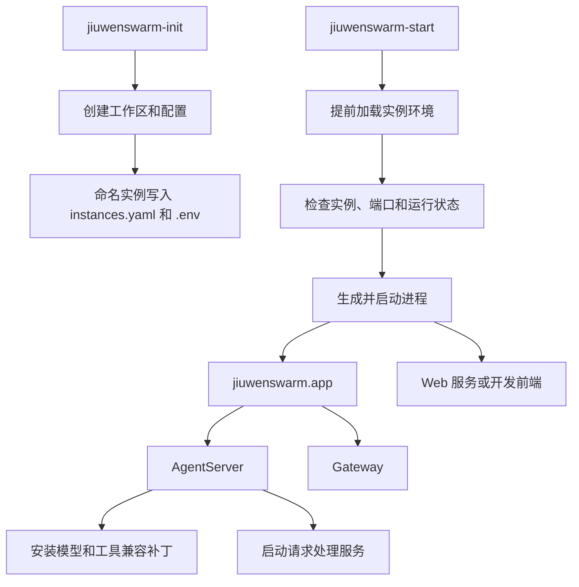

# JiuWenSwarm 根目录 Python 模块讲解

## 1. 文档范围与代码基线

本文档讲解 `jiuwenswarm/*.py`，即 `jiuwenswarm` 包根目录下的 Python 文件，不包含 `server/`、`gateway/`、`common/` 等子目录的具体实现细节。

代码基线：

- 分支：`dev-stable`
- 提交：`dc3a5e8519bdf3babdf91719ee48faa95d614c8a`
- 提交日期：2026-09-05
- 提交说明：`!6057 merge skill_acceleration_exec_0904 into dev-stable`

涉及的文件如下：

```text
jiuwenswarm/
├── __init__.py
├── app.py
├── deployment_mode.py
├── dotenv_early.py
├── edition.py
├── init_workspace.py
├── llm_sse_patch.py
├── openjiuwen_log_patch.py
├── openjiuwen_skip_tool_patch.py
├── openjiuwen_streaming_tool_patch.py
└── start_services.py
```

## 2. 整体模块说明

### 2.1 根目录代码承担什么职责

根目录模块构成 JiuWenSwarm 的启动和运行外壳。它们不直接实现聊天、会话、团队或工具业务，而是负责让这些业务能力在正确的目录、端口、部署方式和 SDK 环境中运行。

这些文件可以分成四组：

| 模块组 | 文件 | 作用 |
|---|---|---|
| 工作区初始化 | `init_workspace.py` | 创建默认实例或命名实例的数据目录和配置 |
| 服务启动 | `start_services.py`、`app.py` | 选择实例和启动模式，创建并管理服务进程 |
| 环境与运行模式 | `dotenv_early.py`、`edition.py`、`deployment_mode.py` | 确定实例环境、产品版本和 Gateway 部署规则 |
| 框架兼容 | `llm_sse_patch.py`、三个 `openjiuwen_*_patch.py` | 修正 openJiuwen 模型、日志和工具执行行为 |

从运行顺序看，这些模块依次解决以下问题：

```text
工作区是否存在
  → 当前使用哪个实例
  → 实例使用哪些端口
  → 需要启动哪些服务
  → AgentServer 和 Gateway 如何共同运行
  → 底层 SDK 是否满足当前产品需求
```

### 2.2 模块分层

```text
命令入口层
  jiuwenswarm-init / jiuwenswarm-start / jiuwenswarm-app
        │
        ▼
环境准备层
  dotenv_early / edition / deployment_mode
        │
        ▼
进程编排层
  start_services / app
        │
        ├── Web
        ├── Gateway
        └── AgentServer
                │
                ▼
底层兼容层
  llm_sse_patch / openjiuwen_*_patch
                │
                ▼
业务执行层
  pipeline → handlers → AgentManager → Adapter
```

工作区初始化发生在服务启动之前；实例环境必须在其他业务模块导入之前确定；兼容补丁则在 AgentServer 接收真实请求之前安装。

### 2.3 从初始化到服务启动

`pyproject.toml` 注册了三个直接对应根目录模块的命令：

| 命令 | 入口 | 用途 |
|---|---|---|
| `jiuwenswarm-init` | `init_workspace.main` | 初始化默认或命名实例 |
| `jiuwenswarm-start` | `start_services.main` | 启动服务或管理实例 |
| `jiuwenswarm-app` | `app.main` | 启动 AgentServer 与 Gateway |

整体流程如下：



在 `all` 模式下，通常形成以下进程关系：

```text
jiuwenswarm-start
├── app
│   ├── AgentServer
│   └── Gateway
└── web
```

`start_services.py` 管理整套服务；`app.py` 只管理后端组合。两级进程编排使 Web 可以独立启动或使用开发服务器，同时保持 AgentServer 与 Gateway 共同存亡。

### 2.4 默认实例和命名实例

JiuWenSwarm 支持一个默认实例和多个命名实例。

| 内容 | 默认实例 | 命名实例 |
|---|---|---|
| 工作区 | `~/.jiuwenswarm` | `instances.yaml` 指定目录 |
| 实例登记 | 不需要单独条目 | 写入 `instances.yaml` |
| 启动环境 | `~/.jiuwenswarm/config/.env` | 实例工作区根目录 `.env` |
| 端口 | 默认端口或环境变量 | 按实例索引分配并持久化 |
| 进程识别 | 默认实例状态检测 | 实例 PID 文件 |

`init_workspace.py` 创建上述数据；`start_services.py` 读取并检查它们；`dotenv_early.py` 在每个子进程中尽早加载相应实例环境。

### 2.5 与聊天请求流程的关系

服务启动后，聊天请求进入下面的业务链路：

```text
客户端
  → Gateway
  → AgentServer 网络入口
  → pipeline
  → dispatch / handlers
  → AgentManager
  → JiuWenSwarm Facade
  → Deep/Code Adapter
  → 模型与工具
```

根目录模块参与这条链路的外围部分：

- `dotenv_early.py` 保证 Gateway 和 AgentServer 使用同一实例目录和端口。
- `edition.py` 决定是否进入企业配置及多租户路径。
- `deployment_mode.py` 决定 Gateway 是否使用 Redis、选主和共享存储。
- `llm_sse_patch.py` 修正 Adapter 调用模型时的请求与响应。
- `openjiuwen_skip_tool_patch.py` 和 `openjiuwen_streaming_tool_patch.py` 修正工具执行阶段的消息完整性和等待超时。

## 3. `jiuwenswarm/__init__.py`

### 文件说明

该文件是 `jiuwenswarm` 包的初始化文件。当前代码只包含版权声明，没有导入其他模块，也没有执行配置或运行时初始化。

因此，单独执行 `import jiuwenswarm` 不会启动服务、加载用户配置或修改日志。调用方需要显式导入 `jiuwenswarm.app`、`jiuwenswarm.start_services` 等具体模块。

该文件没有函数，也不主动聚合其他子模块。

## 4. `jiuwenswarm/app.py`

### 文件说明

`app.py` 是后端组合进程编排器。它把 AgentServer 与 Gateway 作为一个共同运行的后端单元：先启动两个子进程，然后持续监控；任意一个退出后，停止另一个并结束组合进程。

AgentServer 负责 Agent、模型和工具执行，Gateway 负责客户端连接、消息路由和渠道接入。只有两者同时工作，聊天链路才完整。这个共同存亡关系主要由 `main()` 实现。

`app.py` 不负责启动 Web 服务。Web 由更外层的 `start_services.py` 单独创建，所以用户可以只启动后端、只启动 Web，或者在开发模式下把正式 Web 服务替换为前端开发服务器。

### 启动前的环境准备

该文件在导入业务模块前调用 `parse_dotenv_early("jiuwenswarm-app")`。如果命令带有 `--dotenv` 或 `--name`，实例环境会先写入当前进程，后续 `get_user_workspace_dir()` 才会解析到正确目录。

环境确定后，模块还会：

1. 清理旧版本 Team 遗留文件。
2. 检查配置文件和新旧工作区结构。
3. 必要时调用 `prepare_workspace()` 做增量初始化或迁移。
4. 加载实例工作区的 `config/.env`。
5. 重置免费搜索运行标志。

这些操作位于模块导入阶段，确保 AgentServer 和 Gateway 创建时看到的是完整、正确的运行环境。

### 后端进程的创建和监控

`main()` 解析 `--dotenv` 和 `--name`，并安装异步状态 dump 处理器。普通源码或包安装环境中，它构造以下命令：

```text
python -m jiuwenswarm.server.app_agentserver
python -m jiuwenswarm.gateway.app_gateway
```

在 PyInstaller 冻结环境中，则使用当前可执行文件的 `--desktop-run-agent` 和 `--desktop-run-gateway` 参数。

如果当前运行的是命名实例，早期解析得到的 `.env` 路径会同时传给 AgentServer 和 Gateway，使两个子进程使用相同的数据目录和端口。

进程启动顺序是 AgentServer 在前、Gateway 在后。Gateway 创建失败时，已经启动的 AgentServer 会立即终止。两个进程成功启动后，`main()` 每 0.25 秒检查一次状态；任意一个退出，就使用它的退出码结束当前组合进程。

`main()` 内部的 `_terminate_all()` 负责收尾：先调用 `terminate()`，等待最多 12 秒，再对残留进程调用 `kill()`。正常退出、子进程异常和键盘中断都会进入这一清理过程。

### 与其他模块的关系

```text
start_services.py
  → app.py
      ├── server.app_agentserver
      └── gateway.app_gateway
```

`app.py` 还通过 `dotenv_early.py` 继承实例环境，通过 `common.utils` 完成工作区检查和迁移。

## 5. `jiuwenswarm/start_services.py`

### 文件说明

`start_services.py` 是 JiuWenSwarm 的最外层服务启动器，也是本地多实例的管理入口。用户执行 `jiuwenswarm-start` 后，首先进入该文件。

它主要负责三件事：

1. 根据命令参数确定要启动或管理哪个实例。
2. 在启动前检查工作区、运行状态和端口，并保证端口配置一致。
3. 启动 Web、Gateway、AgentServer 相关进程，监控运行状态并统一清理。

该模块不直接实现 AgentServer、Gateway 或 Web 服务，而是把启动任务交给相应入口：

```text
jiuwenswarm-start
  → start_services.main
  → 校验实例和端口
  → 生成启动命令
  ├── jiuwenswarm.app
  │   ├── AgentServer
  │   └── Gateway
  └── Web 服务或前端开发服务器
```

### 命令入口与流程分发

`main()` 先配置控制台日志，再通过 `_parse_args()` 解析启动模式和实例管理参数，最后交给 `_dispatch_action()` 决定具体操作。

该命令既能启动服务，也能管理实例：

```text
jiuwenswarm-start all
jiuwenswarm-start app
jiuwenswarm-start web
jiuwenswarm-start dev

jiuwenswarm-start --name alice
jiuwenswarm-start --list
jiuwenswarm-start --status alice
jiuwenswarm-start --stop alice
jiuwenswarm-start --restart alice
```

`_dispatch_action()` 将管理命令交给 `_action_list()`、`_action_status()`、`_action_stop()` 或 `_action_restart()`；启动命令则根据是否指定 `--name`，进入 `_start_named_instance()` 或 `_run()`。

```text
main
  → _parse_args
  → _dispatch_action
      ├── 实例列表、状态、停止、重启
      ├── _run                    默认实例
      └── _start_named_instance   命名实例
```

### 实例信息的统一表示

默认实例和命名实例的配置来源不同。默认实例不依赖 `instances.yaml`，工作区通常是 `~/.jiuwenswarm`；命名实例从 `instances.yaml` 读取工作区和端口。

文件使用 `InstanceCommand` 收敛这种差异。对象创建后保存实例名称，调用 `validate_and_load()` 后得到：

```text
cmd.is_default   是否为默认实例
cmd.config       工作区和端口配置
cmd.status       运行状态和 PID
```

对于默认实例，`validate_and_load()` 根据默认工作区和索引 0 端口组构造临时 `InstanceConfig`。对于命名实例，它先校验名称，再加载 YAML 配置并查询进程状态。

后续启动、停止、状态查询和重启都使用这组统一信息。`check_workspace_exists()` 防止启动尚未初始化的命名实例；`check_running()` 识别重复启动；`check_ports_conflicts()` 逐项返回冲突端口。

### 默认实例的启动

默认实例从 `_run()` 进入：

```text
_run
  → 加载默认实例配置和状态
  → 检查端口
  → 同步最终端口
  → _build_commands
  → _run_processes
```

默认端口冲突时，`_run()` 调用 `_resolve_ports_with_fallback()` 寻找一组新的可用端口。没有冲突时，它仍会调用 `_sync_default_env_ports()`，把当前端口写回默认 `.env`。

这样可以处理旧端口残留：上一次启动可能因为冲突改用了备用端口；本次默认端口恢复后，如果不重新同步，子进程仍可能从 `.env` 读取旧端口。

默认实例每次启动都会保证：

```text
启动器采用的端口
    = config/.env 中保存的端口
    = Gateway、AgentServer 和 Web 使用的端口
```

### 命名实例的启动

命名实例从 `_start_named_instance()` 进入：

```text
_start_named_instance
  → 加载 instances.yaml
  → 检查工作区和运行状态
  → 处理端口冲突
  → 获取 InstanceLock
  → 创建 bootstrap .env
  → 生成启动命令
  → _run_instance_with_pid
  → 释放 InstanceLock
```

命名实例通过三类持久化信息维持运行：

- `instances.yaml` 保存名称、工作区和端口。
- 实例根目录 `.env` 向各子进程提供相同环境。
- PID 文件保存启动器 PID 和启动时间。

`InstanceLock` 防止两个终端同时启动相同实例；`_run_instance_with_pid()` 记录 PID，供 `--status`、`--stop` 和重复启动检测使用。

### 端口冲突与端口传递

JiuWenSwarm 会同时使用 AgentServer、Gateway、WebChannel、Web UI 和可选 HTTP API 等端口。`_resolve_ports_with_fallback()` 按完整端口组寻找备用值，而不是只替换冲突的单个端口。

扫描时会排除其他已配置实例登记的端口。找到端口后，同时更新：

```text
默认实例
  → cmd.config
  → ~/.jiuwenswarm/config/.env

命名实例
  → cmd.config
  → instances.yaml
  → 实例工作区/.env
```

如果持久化失败，启动立即结束，因为子进程仍会从旧配置读取冲突端口。

进程创建时，`_start_process()` 把最终端口写入子进程环境，并设置 `JIUWENSWARM_CLI_PORTS=1`。子进程中的 `dotenv_early.load_dotenv_runtime()` 会保留这些端口，不让磁盘 `.env` 的旧值覆盖。

`_start_process()` 还删除可能陈旧的 `AGENT_SERVER_URL`。Gateway 对该 URL 的优先级高于 `AGENT_SERVER_PORT`，保留旧 URL 可能导致它绕过本次重新分配的端口。

完整传递关系为：

```text
start_services 确定端口
  → 更新持久化配置
  → _start_process 注入子进程环境
  → dotenv_early 加载 .env
  → 恢复启动器注入的端口
  → 各服务使用同一端口组
```

### 启动模式与进程组成

`_build_commands()` 将启动模式转换成具体进程：

| 模式 | 启动内容 |
|---|---|
| `all` | 后端组合进程和 Web 服务 |
| `app` | 仅后端组合进程 |
| `web` | 仅 Web 服务 |
| `dev` | 后端组合进程和前端开发服务器 |

后端组合进程是 `jiuwenswarm.app`，它还会启动 AgentServer 和 Gateway。Web 模式通过 `jiuwenswarm.channels.web.app_web` 启动正式服务；开发模式使用 `npm run dev`。

命名实例会把 bootstrap `.env` 作为 `--dotenv` 参数传给 Python 子进程，使后端组合进程和 Web 服务进入相同实例环境。

### 服务就绪与进程生命周期

进程启动后，`_wait_for_services_ready()` 根据实际启动内容探测 Web UI、AgentServer WS、Gateway WS、WebChannel WS、Web HTTP 和可选 AgentServer HTTP。

端口探测同时尝试 `127.0.0.1` 和 `::1`，兼容 Windows 上开发服务器只监听 IPv6 的情况。Web UI 就绪后会先显示访问地址，再继续等待其他后端；必需进程提前退出时结束探测。

默认实例由 `_run_processes()` 运行，命名实例由 `_run_instance_with_pid()` 运行。两者都会启动全部进程、等待端口、持续监控，并在任意必需进程退出后清理其他进程。命名实例路径额外写入 PID 文件。

最终清理由 `_terminate_processes()` 完成：先调用 `terminate()`，等待 8 秒后再对残留进程调用 `kill()`。

### 与其他模块的关系

```text
start_services.py
├── dotenv_early.py：加载实例环境并保护最终端口
├── instance_manager/：配置、端口、锁、PID 和状态
├── app.py：启动 AgentServer 与 Gateway
└── channels.web.app_web / npm：启动 Web 服务
```

该文件的输出不是聊天响应，而是一组工作区正确、端口一致、可以互相连接的服务进程。

## 6. `jiuwenswarm/dotenv_early.py`

### 文件说明

`dotenv_early.py` 负责在其他 JiuWenSwarm 模块导入前解析实例环境。它解决的核心问题是：许多路径和配置在模块导入时就会读取环境变量，如果实例环境加载过晚，进程可能已经绑定到默认工作区。

因此，`start_services.py`、`app.py`、AgentServer 和 Gateway 等入口都会先调用 `parse_dotenv_early()`，然后才导入 `common.utils` 等路径相关模块。

模块导入时还设置 `GRPC_ENABLE_FORK_SUPPORT=0` 和 `GRPC_VERBOSITY=ERROR`。Agent 工具创建子进程时可能继承 gRPC 状态，这两个变量用于减少子进程 stderr 中与业务无关的 gRPC 日志。

### 实例环境的早期解析

`parse_dotenv_early()` 直接扫描 `sys.argv`，但不会删除参数，后续 argparse 仍可再次解析。

环境选择具有明确优先级：

```text
--dotenv <path>
  优先直接加载指定文件

--name <name>
  未指定 --dotenv 时加载命名实例环境

无上述参数
  不加载额外 bootstrap 环境
```

成功加载后，路径保存在 `_parsed_dotenv`，`get_parsed_dotenv()` 将它提供给 `app.py` 等父进程，使同一个 `.env` 可以继续传给子进程。

命名实例由 `_load_bootstrap_by_name_early()` 处理。为了保证足够早地运行，它避免依赖完整的实例管理初始化，而是自行完成实例名基础检查、`instances.yaml` 读取、工作区定位和 `.env` 加载。

如果实例工作区存在但 bootstrap `.env` 尚未创建，该函数才导入 `instance_manager.bootstrap` 的最小创建逻辑，生成后再加载。

### `.env` 加载和端口保护

`load_dotenv_runtime()` 是统一的 `.env` 加载包装。个人版本质上调用 `python-dotenv`，但在加载前后保护两类由上游进程注入的数据。

第一类是 `EXTENSION_DIRS`。relay-claw 等父进程可能已经设置扩展目录，而 `.env` 中的空值不应覆盖它。

第二类是当前启动会话的端口。`_should_preserve_session_ports()` 检查：

```text
JIUWENSWARM_DESKTOP=1
或
JIUWENSWARM_CLI_PORTS=1
```

任一标志成立时，函数在加载 `.env` 前保存 `WEB_PORT`、`GATEWAY_PORT`、`AGENT_SERVER_PORT` 等变量，加载完成后再恢复。

同一场景还会删除 `AGENT_SERVER_URL`。否则 Gateway 可能优先使用 `.env` 中的旧 URL，绕过启动器注入的新端口。

企业版由 `edition.is_enterprise()` 识别，不加载本地 `.env`，配置交给企业部署环境和配置系统提供。

### 早期日志和兼容入口

配置错误发生在完整日志系统初始化之前，因此 `_early_warning()` 和 `_early_error()` 使用一个只依赖标准库的 logger 向 stderr 输出，并带上当前组件名。

`set_component_name()` 可以调整日志组件名；实际入口通常直接向 `parse_dotenv_early()` 传入名称。`load_instance_bootstrap_by_name()` 是保留的兼容接口，新代码由 `instance_manager.bootstrap` 直接提供正常导入阶段的实现。

### 与其他模块的关系

```text
start_services / app / AgentServer / Gateway
  → dotenv_early
      ├── edition.is_enterprise
      ├── instances.yaml
      └── 实例 bootstrap .env
```

该文件决定后续模块从哪个工作区读取配置，是多实例隔离链路的最早入口。

## 7. `jiuwenswarm/init_workspace.py`

### 文件说明

`init_workspace.py` 是 `jiuwenswarm-init` 的实现入口，用于创建默认实例或命名实例的运行数据目录。

工作区中的配置模板、环境文件、规则和多语言 Markdown 文件由 `common.utils.init_user_workspace()` 实际创建。本文件负责外围流程：确定实例、检查运行状态、调用初始化、分配端口并登记命名实例。

模块的主体逻辑集中在 `run_init()`；`main()` 负责把 `-f/--force` 和 `--name` 转换为调用参数。

### 默认工作区初始化

未指定实例名时，目标目录是：

```text
~/.jiuwenswarm
```

`run_init()` 调用 `init_user_workspace()` 创建或增量补充工作区。使用 `--force` 时，初始化工具会进入强制重建流程；删除确认和实际文件处理仍在 `common.utils` 中完成。

默认实例只有在强制初始化时才显式检查运行状态，防止删除正在使用的数据。

### 命名实例初始化

指定 `--name` 后，`run_init()` 先调用 `validate_instance_name()`，再使用 `get_instance_workspace_path()` 确定目录。

如果实例已经登记，就读取其配置并检查状态；如果尚未登记，则先构造临时 `InstanceConfig` 用于运行状态判断。运行中的实例不能重新初始化。

工作区创建完成后，还会执行实例登记：

```text
计算实例索引
  → 计算对应端口组
  → 检查端口是否可用
  → 冲突时扫描新端口组
  → 更新 instances.yaml
  → 创建实例根目录 .env
```

端口扫描会排除其他实例已经登记的端口。即使当前没有进程监听，也不会选择将来启动其他实例时会发生冲突的端口。

最终，`instances.yaml` 和 bootstrap `.env` 使用同一组端口，使新实例初始化后可以直接交给 `jiuwenswarm-start --name <name>` 启动。

### 命令参数处理

`main()` 使用 `parse_known_args()` 解析 `--force` 和 `--name`。选择该方式是为了兼容 pytest 等宿主：宿主可能在 `sys.argv` 中留下其他参数，初始化入口不会因此直接报错退出。

### 与其他模块的关系

```text
init_workspace.py
├── common.utils.init_user_workspace：创建和合并工作区文件
└── instance_manager/
    ├── 校验实例名
    ├── 查询运行状态
    ├── 计算和扫描端口
    ├── 更新 instances.yaml
    └── 创建 bootstrap .env
```

初始化结果由 `start_services.py` 检查，并由 `dotenv_early.py` 在各子进程启动早期加载。

## 8. `jiuwenswarm/edition.py`

### 文件说明

`edition.py` 提供个人版与企业版的统一判断入口。

文件只依赖标准库 `os`，因此可以在完整配置系统尚未加载时使用。`dotenv_early.py` 就依赖这一点：它需要先判断是否为企业版，才能决定是否读取本地 `.env`。

文件只有一个函数 `is_enterprise()`。该函数读取 `JIUWENSWARM_EDITION`，去除首尾空白并转换为小写；值为 `enterprise` 时返回 `True`，其他情况返回 `False`。

这个简单判断会影响后续多项行为：

- 个人版可以读取本地 `.env`，企业版不读取。
- 企业版会进入多租户工作区和企业配置加载路径。
- 企业附件、权限及数据库配置会根据版本启用。
- Agent Adapter 只有在企业版中才接收企业工作区和租户 ID。

`common.local_env_config` 和 `common.utils` 会重新导出该函数，其他模块由此共享同一种版本判断口径。

## 9. `jiuwenswarm/deployment_mode.py`

### 文件说明

`deployment_mode.py` 集中描述 Gateway 的部署拓扑，并将模式名称转换成 Redis、选主、存储、Cron 和通道规则。

它解决的是“Gateway 副本之间如何协作”。`edition.py` 解决的是“当前产品是个人版还是企业版”，两者属于不同维度：企业版可以根据部署环境选择主备或分布式模式，个人运行通常采用单机模式。

文件定义三种部署模式：

| 模式 | 含义 |
|---|---|
| `standalone` | 单机运行，不连接 Gateway Redis，不选主 |
| `active-standby` | 主备运行，通过 Redis 和 LeaderElection 保证只有主节点处理 |
| `distributed` | 多副本同时运行，通过 Redis 共享状态，不进行选主 |

### 模式归一化和能力判断

所有判断从 `normalize_deployment_mode()` 开始。它将输入转成小写字符串，空值或非法值统一回退为 `standalone`。因此，各消费模块不需要分别处理空配置和拼写错误。

随后，调用方通过语义函数获取具体能力，而不是自行比较字符串：

- `uses_gateway_redis()` 表示是否需要连接 Gateway Redis。
- `uses_leader_election()` 表示是否需要选主。
- `session_storage_backend()` 返回 `local` 或 `redis`。
- `history_storage_backend()` 返回推荐的 `memory` 或 `mysql`。

主备和分布式模式都使用 Redis；只有主备模式选主。分布式模式允许多个副本同时处理请求，因此不能沿用主备模式的 LeaderElection 判断。

### Cron 和通道行为

`default_cron_enabled()` 在分布式模式中返回 `False`。原因是分布式副本没有单一主节点，如果每个副本都启动 Cron，同一任务可能被重复执行。

`channel_config_overlay_default()` 只为主备模式开启数据库 channel 配置覆盖。单机和分布式模式默认直接读取 YAML 中的 channels 配置。

`distributed_channel_whitelist()` 返回 `web` 和 `tui`，限制分布式模式允许启动的通道范围。

### 模式行为汇总

| 模式 | Redis | 选主 | Session | History 默认值 | Cron 默认值 |
|---|---|---|---|---|---|
| `standalone` | 否 | 否 | local | memory | 开启 |
| `active-standby` | 是 | 是 | redis | mysql | 开启 |
| `distributed` | 是 | 否 | redis | mysql | 关闭 |

实际 Web 历史存储仍允许显式数据库环境变量覆盖推荐默认值。

### 与其他模块的关系

该文件主要由 Gateway 启动、Redis Runtime、LeaderElection、SessionMap、Cron 和通道配置模块调用。它只提供规则，不创建 Redis 连接或运行调度器。

## 10. `jiuwenswarm/llm_sse_patch.py`

### 文件说明

`llm_sse_patch.py` 是模型客户端兼容层，在 AgentServer 启动阶段修正 openJiuwen `OpenAIModelClient` 的请求和响应行为。

它集中处理四类兼容问题：

1. 某些模型网关在非流式调用中仍返回 SSE 字符串。
2. GLM 原生工具调用标签可能混入工具参数。
3. openJiuwen 的 header 清洗可能移除显式 `Authorization`。
4. 华为 ModelArts MaaS 请求需要 `x-span-id` 进行链路追踪。

这些修正安装在模型客户端边界。主 Agent、子 Agent、心跳等只要使用同一个 `OpenAIModelClient`，就会得到一致行为，不需要在每条业务路径重复处理。

### 非流式 SSE 响应兼容

正常情况下，非流式 `invoke()` 应返回 OpenAI SDK 的 `ChatCompletion`。部分 SSE-only 网关即使收到非流式请求，仍返回完整的 `text/event-stream` 字符串，上层随后访问 `response.choices` 就会失败。

`apply_openai_sse_invoke_patch()` 包装客户端 `_parse_response()`。当响应已经是标准对象时直接沿用原逻辑；当响应是字符串时，先调用 `assemble_openai_response()` 进行重建。

组装过程按 SSE 行读取 `data:` 内容，通过 `_parse_chunk()` 解析 JSON，再由 `_extract_message_content()` 累计 reasoning 和正文。最后一个有效 chunk 用于确定工具调用、usage 和 finish reason。

如果消息包含工具调用，`_build_tool_calls()` 会构造 OpenAI SDK 对象，最终返回结构与普通非流式响应一致：

```text
SSE 字符串
  → data JSON
  → 累计正文和 reasoning
  → 构造 tool_calls 和 usage
  → ChatCompletion
  → openJiuwen 原始解析流程
```

### GLM 工具标签清理

部分 GLM 响应会把 `<arg_value>`、`<arg_key>`、`<tool_call>` 等原生标签混入工具 arguments。这些内容若进入 todo、历史或下一轮模型上下文，会破坏参数 JSON。

`_sanitize_glm_tool_xml_tags()` 负责清理完整闭合标签和被截断的开放标签，同时处理大小写和多标签情况。

清理发生在两处：

- 非流式 SSE 组装时，`_build_tool_calls()` 在创建工具调用对象前清理 arguments。
- 正常流式响应中，补丁包装 `_parse_stream_chunk()`，在原始解析完成后清理每个工具调用参数。

这样，无论模型通过非流式兼容路径还是正常流式路径返回工具调用，上层获得的 arguments 都使用相同规则。

### Authorization 保留

openJiuwen 构造请求头时会执行安全清洗，可能移除受保护的 `Authorization`。普通 OpenAI API 可以依赖 API key 重新生成 Bearer 头，但 OfficeClaw 或华为 MaaS 可能通过 `default_headers` 下发 Basic Authorization，API key 只是占位值。

`apply_openai_auth_header_patch()` 在 header 清洗前通过 `_extract_authorization_header()` 保存鉴权，清洗或合并后再由 `_restore_authorization_header()` 写回。

部分模型客户端已经使用 `from ... import build_base_headers` 保存了旧函数引用，只替换原模块属性不会影响这些引用。因此安装过程还会重新绑定 OpenAI、OpenAI Account 和 Anthropic 客户端模块中的函数。

此外，OpenAI 客户端创建函数也会被包装。`_resolve_model_client_authorization()` 优先读取模型配置中的显式 Authorization；当 API key 是 MaaS 占位值时，再从当前请求作用域的环境 overlay 获取默认 headers。找到的鉴权最终写入 `AsyncOpenAI` 的默认 header 集合。

### MaaS 链路追踪

`_is_huawei_maas_api_base()` 判断当前 API 地址是否属于华为 ModelArts MaaS。

总补丁分别包装 `invoke()` 和 `stream()`。每次调用前，如果地址匹配 MaaS，就向本次 `custom_headers` 加入一个 UUID hex 格式的 `x-span-id`；其他模型地址不修改。

每次调用都生成独立 span ID，使 MaaS 服务端日志可以与本地一次具体模型调用对应。

### 补丁安装过程

AgentServer 启动时调用 `apply_openai_sse_invoke_patch()`。它先安装鉴权补丁，再安装 SSE、GLM 和 MaaS span 补丁。

安装过程使用模块标志和客户端类属性保证幂等。openJiuwen 类型不可导入时记录警告并返回，避免兼容模块本身阻断 AgentServer 启动。

### 与其他模块的关系

```text
server.app_agentserver
  → apply_openai_sse_invoke_patch
      → OpenAIModelClient
          → Deep/Code Adapter 的模型调用
```

该模块不处理 `AgentRequest`，而是在 Adapter 下方修正模型通信。

## 11. `jiuwenswarm/openjiuwen_log_patch.py`

### 文件说明

`openjiuwen_log_patch.py` 用于让 openJiuwen 结构化日志遵循 JiuWenSwarm 的 `LOG_TO_FILE_ENABLED` 设置。

openJiuwen 自己维护普通输出、接口输出和性能输出配置。产品关闭文件日志时，这三类输出也应只写控制台，否则即使上层关闭文件日志，底层仍可能创建日志文件。

`apply_openjiuwen_log_to_file_setting()` 首先检查补丁是否已经执行，然后导入 openJiuwen 日志接口和产品 `Settings`。如果文件日志开启，它不修改现有配置；如果关闭，则读取日志配置快照，将以下字段统一设为 `['console']`：

```text
output
interface_output
performance_output
```

只有值发生变化时才调用 `configure_log_config()`，完成后记录幂等标志。

当前 `dev-stable` 的 `jiuwenswarm` 源码中没有搜索到该函数的直接调用。AgentServer 目前主要通过 `common.openjiuwen_logging.bootstrap_openjiuwen_logging()` 初始化 openJiuwen 日志。因此，该文件提供的是一个独立兼容入口，不属于当前 AgentServer 主启动链上的直接调用。

## 12. `jiuwenswarm/openjiuwen_skip_tool_patch.py`

### 文件说明

`openjiuwen_skip_tool_patch.py` 修复工具被 Rail 提前跳过时缺少 `ToolMessage` 的问题。

标准工具消息序列通常是：

```text
Assistant tool_call
  → 执行工具
  → ToolMessage/tool result
  → 下一轮模型调用
```

权限、策略或其他 Rail 可能在真正执行工具前设置 `_skip_tool`，并直接给出一个替代结果。如果这时没有创建 ToolMessage，历史中会只剩 tool call，没有与之配对的结果；后续模型接口可能拒绝这组消息。

AgentServer 启动阶段调用 `apply_skip_tool_tool_message_patch()`。该函数保存 `AbilityManager._railed_execute_single_tool_call()` 的原实现，并安装一个异步包装。

包装逻辑只在三个条件同时成立时补消息：

- `ctx.extra['_skip_tool']` 为真。
- 当前输入是 `ToolCallInputs`。
- Rail 尚未创建 `tool_msg`。

补充的 ToolMessage 使用当前工具调用 ID 和 Rail 已经产生的 `tool_result`。随后仍调用原始 `_railed_execute_single_tool_call()`，因此补丁不会改变是否跳过工具的决定，也不会替代原有后续流程。

模块通过 `_SKIP_TOOL_TOOL_MESSAGE_PATCHED` 保证补丁只安装一次。openJiuwen 相关类型不可导入时直接返回。

### 与其他模块的关系

```text
server.app_agentserver
  → apply_skip_tool_tool_message_patch
      → AbilityManager 的工具 Rail 执行路径
```

该补丁作用在 Adapter 下方，保证工具执行被短路时消息协议仍保持完整。

## 13. `jiuwenswarm/openjiuwen_streaming_tool_patch.py`

### 文件说明

`openjiuwen_streaming_tool_patch.py` 为旧版 openJiuwen 的 `StreamingToolExecutor.wait_all()` 增加可暂停超时，避免 ReAct 永久等待卡住的工具任务。

工具超时不能简单按自然时间计算。工具执行过程中可能进入 AskUser、权限确认或其他 HITL 状态，用户回复之前的等待不属于工具卡死。该模块因此将“实际工具运行时间”和“人工交互等待时间”分开计算。

主要执行关系为：

```text
模型产生多个 tool call
  → StreamingToolExecutor 创建工具任务
  → wait_all 等待所有工具
      ├── 正常完成：返回结果
      ├── HITL：暂停超时预算
      └── 实际执行超时：取消残留工具
```

### 可暂停的超时时钟

`_WaitTimeoutClock` 记录暂停深度、累计暂停时间、当前暂停起点和恢复事件。

首次调用 `pause()` 时，它记录单调时钟并清除恢复事件。多层逻辑可以重复暂停，`pause_depth` 会随之增加。只有对应的 `resume()` 将深度减到 0 时，才会累计本次暂停时长并通知等待方恢复。

这种深度计数可以避免嵌套 AskUser 或权限逻辑过早恢复计时。

每个 StreamingToolExecutor 都有自己的时钟。`_executor_wait_clock()` 优先把时钟保存在弱引用字典中；对象不能被弱引用时，回退到以对象 ID 为键的字典。

### HITL 如何找到当前 executor

工具执行函数由补丁包装后，会在调用前把所属 executor 写入 `_current_streaming_tool_executor` 这个 `ContextVar`，调用结束后再恢复 token。

因此，工具内部不需要逐层传递 executor 参数。`pause_streaming_tool_wait_timeout()` 和 `resume_streaming_tool_wait_timeout()` 可以直接从当前异步上下文找到正确实例。

`streaming_tool_wait_timeout_paused()` 将这两个操作封装成异步上下文管理器：进入时暂停，退出时在 `finally` 中恢复。AskUser 和权限等待可以用它包住相应的 `await`。

### 超时等待和取消

`_resolve_streaming_tool_wait_timeout_s()` 从 `STREAMING_TOOL_WAIT_TIMEOUT_S` 读取超时，默认 180 秒。非法值回退到默认值；小于等于 0 表示关闭兼容超时。

`_wait_all_with_pauseable_timeout()` 启动原始 `wait_all()`，然后循环检查工具任务、暂停状态和 deadline。

deadline 会加上 `paused_total`，所以人工交互等待不会消耗工具执行预算。达到超时后，函数调用 `executor.cancel_all()`，并提供最多 5 秒收尾时间。

工具因超时取消后，原始结果中可能出现 `CancelledError`。`_remap_wait_all_timeout_results()` 将它转换成包含工具名和超时秒数的 `TimeoutError`，让 ReAct 上层能够把结果理解为工具超时，而不是用户取消了整次请求。

### 根据 SDK 能力安装补丁

AgentServer 启动时调用 `apply_streaming_tool_wait_timeout_patch()`。

安装函数先检查当前 `StreamingToolExecutor.wait_all()` 是否已经包含 `timeout` 参数。如果新版 openJiuwen 已经提供原生超时，就记录状态并跳过 monkey patch；只有旧版 SDK 才替换构造函数和 `wait_all()`。

兼容版 `wait_all()` 的参数行为是：

- 未显式传值时，从环境变量读取默认超时。
- 显式传入 `None` 时，调用原始无限等待实现。
- 传入数值时，使用可暂停超时逻辑。

模块使用 `_STREAMING_TOOL_WAIT_TIMEOUT_PATCHED` 保证只安装一次，openJiuwen 不可导入时直接返回。

### 与其他模块的关系

```text
server.app_agentserver
  → apply_streaming_tool_wait_timeout_patch
      → StreamingToolExecutor
          → ReAct 多工具执行

AskUser / 权限等待
  → streaming_tool_wait_timeout_paused
      → 暂停当前 executor 的超时预算
```

## 14. 文件之间的完整联系

| 上游文件 | 下游文件或模块 | 联系 |
|---|---|---|
| `init_workspace.py` | `common.utils` | 创建、合并或重建工作区文件 |
| `init_workspace.py` | `instance_manager/*` | 创建命名实例配置、端口和 bootstrap `.env` |
| `start_services.py` | `dotenv_early.py` | 提前加载实例环境并保护本次端口 |
| `start_services.py` | `instance_manager/*` | 获取实例配置、状态、锁、PID 和端口 |
| `start_services.py` | `app.py` | 启动后端组合进程 |
| `app.py` | `server.app_agentserver` | 启动 Agent 执行服务 |
| `app.py` | `gateway.app_gateway` | 启动 Gateway |
| `dotenv_early.py` | `edition.py` | 判断是否允许加载本地 `.env` |
| Gateway 子模块 | `deployment_mode.py` | 决定 Redis、选主、存储、Cron 和通道行为 |
| `server.app_agentserver` | `llm_sse_patch.py` | 安装模型通信兼容补丁 |
| `server.app_agentserver` | `openjiuwen_skip_tool_patch.py` | 安装工具消息完整性补丁 |
| `server.app_agentserver` | `openjiuwen_streaming_tool_patch.py` | 安装流式工具等待超时补丁 |

整个根目录模块的运行关系可以归纳为：

```text
init_workspace
  → 准备工作区和实例配置

start_services + dotenv_early
  → 选择实例、端口和启动模式

app
  → 启动并维持 AgentServer 与 Gateway

edition + deployment_mode
  → 决定产品形态和部署行为

llm_sse_patch + openjiuwen patches
  → 保证模型与工具执行满足产品运行要求

server / gateway / common 子目录
  → 接管实际请求、状态和业务处理
```
