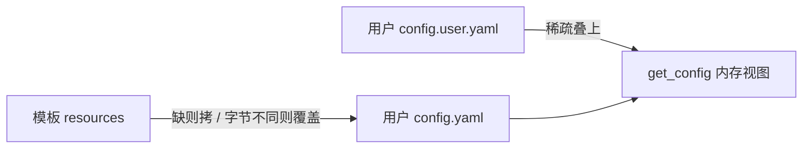
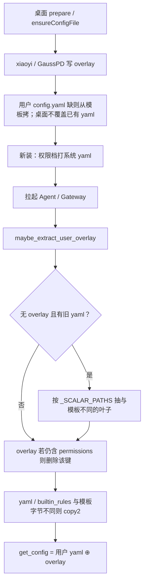

# 配置分层与升级

面向开发：新增 / 调整配置项时读本文。用户侧面板说明见 [配置信息](配置信息.md)。

活配置只在用户数据根（`JIUWENSWARM_DATA_DIR/config/`）。仓内 / 安装包 `jiuwenswarm/resources/` **只当拷贝源**，`get_config()` 不读包内。键名和模板默认值不随拆分改名。不加戳文件。`.env` 不拆。

小艺桌面展开：现网/dev `%APPDATA%\xiaoyiwork\users\<uidKey>\jiuwenswarm\config\`；调试包 `xiaoyiWorkDebug` 同结构。

| 缩写 | 位置 |
|---|---|
| 模板 | `jiuwenswarm/resources/config.yaml`、`builtin_rules.yaml` |
| 系统 yaml | 用户根 `config.yaml`（模板拷贝，升级可整文件覆盖） |
| overlay | 用户根 `config.user.yaml`（稀疏；跨升级保留的用户层） |

---

## 三层

| 层 | 文件 | 谁改 | 升级 |
|---|---|---|---|
| 系统 | `config.yaml`、`builtin_rules.yaml` | 模板覆盖；permissions persist / 档位写系统 yaml | 与模板字节不同则整文件覆盖 |
| 用户 | `config.user.yaml` | 桌面 xiaoyi/GaussPD/sandbox；`patch_user_config`；dump 默认 | **不覆盖** |
| 密钥 | `.env` | 桌面写模型项；缺则拷 `.env.template` | 只缺才拷 |

运行时权威 = 系统 yaml ⊕ overlay（稀疏）。禁止把合并结果 dump 回系统 yaml。

---

## 启动时序

进程入口：`app.py` / `server/app_agentserver.py` / `gateway/app_gateway.py` / `scripts/harmony_entry.py` → `maybe_extract_user_overlay()`。

`prepare_workspace`：先 `extract_user_overlay`，再按字节覆盖 yaml/rules；`.env` 仍只缺才拷。升级路径不再调用 `migrate_config_from_template`（函数体留给 CLI / 单测）。

抽离幂等：已有 overlay 不再根据旧混文件重抽。旧 `config.yaml` 不删、不改名。回滚到不认识 overlay 的旧版本时，只能看到覆盖后的系统 yaml。

---

## 强制覆盖

比较**整文件字节**，不是按 key merge。

- 触发：`maybe_extract_user_overlay` → `sync_system_files_from_package`；以及 `prepare_workspace`。
- 条件：模板存在，且（用户文件不存在或 `read_bytes()` ≠ 模板）。
- 覆盖：用户 `config.yaml`、`builtin_rules.yaml`。
- 不覆盖：`config.user.yaml`、`.env`。
- 开发态：改仓内模板 → 重启 → 字节变了就覆盖用户系统文件；overlay 不动。

`permissions` 整段在系统 yaml，覆盖会打回模板。档位本次会话可写系统 yaml；发消息时桌面 `syncPermissionProfile` 再打一次。`file_guard.paths` / HITL「总是允许」走 persist，必须写系统 yaml，不得进 overlay。

---

## 分层合并

`merge_config_layers(base, overlay, sparse=True)`（`jiuwenswarm/common/config.py`）：

- dict：递归；overlay 独有路径保留。
- 叶子：overlay 赢。
- 系统 list（工具名单等）：跟基底，overlay 改了也丢掉。
- `models.defaults`：按下标深合并（temperature 等用户叶可叠）。
- 用户 list（`mcp.servers` 等）：overlay 有则整段采用。

`get_config()` / `get_config_raw()`：先读用户系统 yaml，有 overlay 再 sparse merge。

---

## 写路径

| API | 落到哪 | 用途 |
|---|---|---|
| `dump_yaml_round_trip(CONFIG_YAML_PATH)` / `update_config` / `load_yaml_round_trip` 默认 | 有 overlay 或还没有系统 yaml → **overlay** | xiaoyi、GaussPD、`sandbox.enabled`、白名单其它项 |
| `dump_yaml_round_trip(..., follow_overlay=False)` / `update_system_config` | **系统 yaml** | permissions 档位、persist、`file_guard.paths` |
| `patch_user_config` | 只 overlay | 明确改用户层 |

dump 是 ruamel round-trip（保注释 / 缩进，tmp + replace）。会话级 `session_permissions.yaml` 与这两层无关。

小艺桌面：`configWriteFile()` 同 overlay 规则（xiaoyi / GaussPD / sandbox）；`applyPermissionProfile` 写 `configFile()`（系统 yaml）。

---

## overlay 白名单

权威名单：`jiuwenswarm/common/config_split.py` 的 `_SCALAR_PATHS`。抽离只拷 **与当时模板不同** 的白名单叶子。

当前：`auto_memory_enabled`、`channels.xiaoyi.{enabled,ws_url1,file_upload_url}`、`mcp.servers`、`sandbox.enabled`。

不抽：`logging`、`react.evolution`、`debug_trace`、`preferred_language`（init 仍可写入 overlay）、其它 IM、`hooks`、`email_settings`、整段 `permissions.tools`。

permissions 以后若进 overlay，只加旋钮：`enabled` / `permission_mode` / `tools.bash` / `mcp_free_search|mcp_paid_search|mcp_fetch_webpage` / `file_guard.defaults.read|write`。不要抽 `tools` 整段。persist 仍必须 `follow_overlay=False`。

---

## 新增 / 调整配置

### 只改系统默认（随升级覆盖）

1. 只改 `jiuwenswarm/resources/config.yaml`（或 `builtin_rules.yaml`）。
2. 不要把该路径加入 `_SCALAR_PATHS`，不要打 overlay。
3. 读 `get_config()`。用户目录旧系统文件下次启动按字节覆盖。

### 用户能改、且升级后要保留

1. 模板里仍保留该键（键名不改）。
2. 路径加入 `_SCALAR_PATHS`。
3. 写入走 `patch_user_config` / 默认 dump / 桌面 `configWriteFile()`。
4. 补 `tests/unit_tests/common/test_config_split_layers.py`：用户值 ≠ 模板 → overlay 有；系统 list 不进 overlay。
5. 与桌面仓同包发。

### 改已有键的默认值

改模板。系统文件下次启动覆盖。若该键已在 overlay 且用户值不同，运行时仍是用户值。要把用户也打回新默认：从 overlay 删掉该键，或不要放进白名单。

### 权限（现状）

整段跟系统 yaml。改默认只改模板。档位写 `update_system_config`。persist 用 `_load_yaml_round_trip` / `_dump_yaml_round_trip(..., follow_overlay=False)`。

---

## 相关代码

| 文件 | 作用 |
|---|---|
| `jiuwenswarm/common/config_split.py` | 白名单、抽离、字节覆盖、去掉 overlay 里的 permissions |
| `jiuwenswarm/common/config.py` | `get_config`、sparse merge、dump / `update_system_config` |
| `jiuwenswarm/common/utils.py` | `prepare_workspace` 拷/覆盖；`get_builtin_rules_file` 用户副本 |
| `jiuwenswarm/resources/config.yaml` | 模板（拷贝源） |
| 桌面 `src/core/runtime/jiuwen-runtime.ts` | `ensureConfigFile` |
| 桌面 `src/core/runtime/jiuwen-config.ts` | xiaoyi / GaussPD / 权限档 YAML 补丁 |
