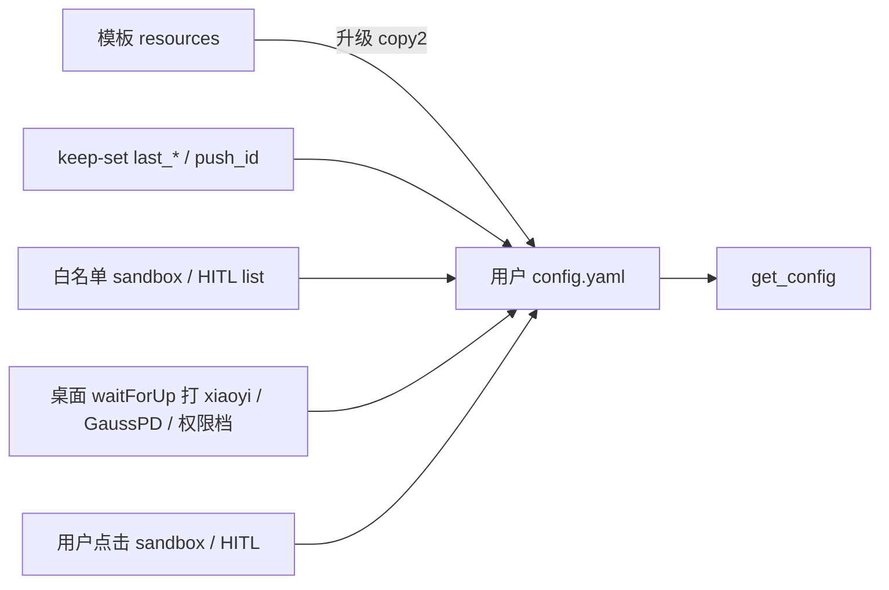
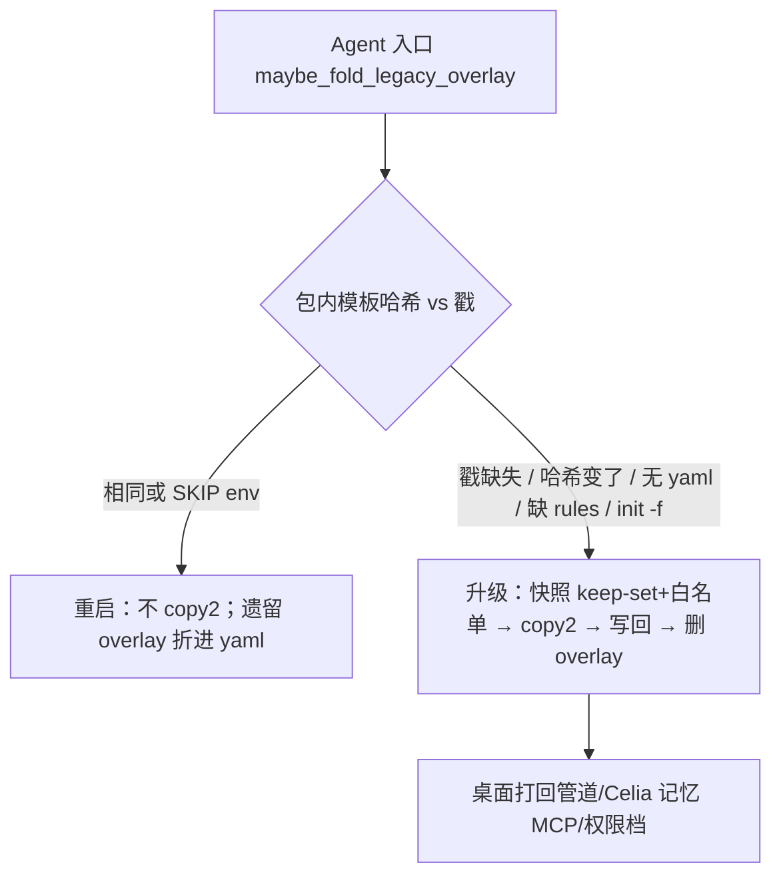

# 配置分层与升级

面向开发：新增 / 调整配置项时读本文。用户侧面板说明见 [配置信息](配置信息.md)。

活配置只在用户数据根 `config.yaml`。仓内 / 安装包 `jiuwenswarm/resources/` **只当拷贝源**，`get_config()` 不读包内。键名和模板默认值不随升级改名。`.env` 不拆。

探测升级用用户 config 目录的模板哈希戳（`config/.template.sha256`），比的是**包内模板文件哈希**，不是用户 yaml 是否等于模板。

小艺桌面展开：现网/dev `%APPDATA%\xiaoyiwork\users\<uidKey>\jiuwenswarm\config\`；调试包 `xiaoyiWorkDebug` 同结构。

| 缩写 | 位置 |
|---|---|
| 模板 | `jiuwenswarm/resources/config.yaml`、`builtin_rules.yaml` |
| 用户 yaml | 用户根 `config.yaml`（模板拷贝；**升级**才整文件覆盖，随后写回白名单与 keep-set） |
| 戳 | 用户根 `config/.template.sha256`（上次吃进的模板哈希） |

没有独立的 `config.user.yaml` 作为活配置。现网若还有该文件，启动时把白名单叶折进 `config.yaml` 后删除。

---

## 一条文件、一张白名单

用户分层的目的：升级强制覆盖时，**用户点过的配置不被冲掉**。白名单由开发确定（小艺 PC/手机点击入口），升级 `copy2` 之后把这些键写回 `config.yaml`。

| 层 | 文件 | 谁写 | 升级 |
|---|---|---|---|
| 系统 | `config.yaml`、`builtin_rules.yaml` | 模板覆盖；keep-set；白名单写回；桌面管道/Celia 记忆 MCP / 权限档 | 戳缺失或模板哈希变了才整文件覆盖，再写回白名单与 keep-set |
| 用户点击 | 同一份 `config.yaml` | 用户点过的 `sandbox.enabled`；小艺 HITL `approval_overrides` / `file_guard.paths` | 在白名单里则写回；从名单拿掉则跟新模板锁定 |
| 密钥 | `.env` | 桌面写模型项；缺则拷 `.env.template` | 只缺才拷 |

权限档 knobs 不进白名单：升级后桌面 `waitForUp` 打回。会话档位在 localStorage。

---

## 重启与升级

判定函数：`_needs_template_upgrade`。戳文件 `config/.template.sha256` 记的是**上次吃进的包内模板哈希**（`config.yaml` + `builtin_rules.yaml` 各一行 sha256），**不比用户 yaml 是否等于模板**。

因此运行时改用户 `config.yaml`（安全中心、HITL、桌面打管道、`last_*`）再重启，**不会**被判成升级。那是现网旧逻辑（用户文件与模板字节不同就覆盖）才会误判。

不要用安装包 / 应用版本号当 copy2 的主信号：配置要回答的是「包里这份模板用户吃过没有」，不是「exe 是不是新版本」。只改代码、模板没动时不应覆盖 yaml；改了模板但忘 bump 版本时哈希仍会 copy2。需要的话版本号只做日志，copy2 仍以模板哈希为准。

走升级当且仅当：戳缺失；戳与当前包内哈希不同；用户 `config.yaml` 不存在；包内有 `builtin_rules.yaml` 而用户侧还没有；`prepare_workspace(overwrite=True)` / `init -f`。

**重启**：yaml 不动（除非把遗留 overlay 折进去）。桌面等戳对齐后缺则补打 xiaoyi / GaussPD / 权限档，已有占位符则 no-op。安全中心入口仍隐藏时，桌面在白名单写回之后仍会把 `sandbox.enabled` 按成 false（开放后删这一调用）。

**升级**：整文件 copy2（新默认、新键、名单外改动都在这一步生效）→ 白名单叶写回 → keep-set 写回 → 新戳 → 删遗留 overlay → 桌面等戳对齐后再打管道。无戳 + 已有用户 yaml = 当作一次升级（现网第一次跑这套）。开发改仓内模板 = 哈希变了 = 与发版同一条路。

`init -f` 仍会快照并写回白名单，**不能**用来清用户点击项；要锁定某旋钮须从白名单拿掉。

进程入口：`app.py` / `server/app_agentserver.py` / `gateway/app_gateway.py` / `scripts/harmony_entry.py` → `maybe_fold_legacy_overlay()`。

桌面 Gateway 设 `JIUWENSWARM_SKIP_SYSTEM_FILE_SYNC=1`，不 copy2，只折遗留 overlay。无桌面的 CLI / harmony：升级走框架 keep-set + copy2，不保证 xiaoyi 占位符。

桌面与框架必须**同包发**。戳被删会再走一次升级（白名单与 keep-set 仍写回，管道靠桌面再打）。

---

## keep-set

覆盖后、手机再发之前：cron 读 `channels.xiaoyi.last_session_id` / `last_task_id` / `push_id`（含 `apps[].push_id`）做回推。这些键不是用户点击项，升级覆盖前必须快照、覆盖后写回。

- `channels.xiaoyi.last_session_id` / `last_task_id` / `last_message_id` / `push_id`
- 匹配到的 `channels.xiaoyi.apps[].push_id`（有值才写回）

不把 xiaoyi 凭据占位符、`mcp.servers` 放进 keep-set 或白名单（桌面打回负责）。

---

## 写路径

全部写 `config.yaml`。

| API | 用途 |
|---|---|
| `dump_yaml_round_trip` / `update_config` / `update_system_config` | 非点选默认、档位、Web rules、`/add-dir`、HITL list、沙箱开关 |
| HITL persist（小艺 PC/手机「永久记住」） | `approval_overrides` / `file_guard.paths` |
| 桌面安全中心 | `sandbox.enabled`（用户点过才写；缺键跟模板） |

小艺桌面：

- `configFile()`：活配置。xiaoyi / Celia 记忆 MCP / 权限档（重启缺则补；升级覆盖之后打回）。`sandbox.enabled` 用户点过才写，但安全中心未开放时 stamp 后仍 `forceSandboxOff`。
- Gateway：`JIUWENSWARM_SKIP_SYSTEM_FILE_SYNC`

---

## 白名单

权威名单：`jiuwenswarm/common/config_split.py` 的 `_SCALAR_PATHS` + `LIST_PATHS`。目的只有一条：升级 `copy2` 时，小艺 PC/手机**点过且与模板不同**的值写回 `config.yaml`。不是「这个键永远冻住」。

当前标量：`sandbox.enabled`（仅用户点过才写；缺键跟模板 false）。

当前 list：`permissions.approval_overrides`、`permissions.file_guard.paths`（小艺 HITL「永久记住」）。升级写回时按 id（路径条目按 path）upsert 到新模板 list 上，模板新增条目仍在。

不进白名单：整工具档位、Web/TUI `permissions.rules`、xiaoyi 三键、`last_*` / `push_id`、`mcp.servers`、`auto_memory_enabled`、其它 IM、整段 `tools`。权限档升级被模板冲掉后，桌面按当前档位再打，不是 yaml 里旧 knobs 跨升级保留。

快照（`snapshot_user_keep_set`）：

- 标量：用户 yaml 有值且**不等于当前包内模板**才保留。等于新模板 → 不进快照，升级后就是模板值。
- 遗留 overlay：只取当前白名单叶（不跟模板比），同键覆盖 yaml。
- list：只抽相对模板多出的用户条目。

现网遗留 overlay（含管道 / GaussPD / 误写入的档位叶）：启动只折**当前**白名单进 yaml，名单外丢掉。

### 白名单配置如何被强制改掉

1. **从名单拿掉**（产品要「新版本不放权给用户」）：下次升级 `copy2` 后不写回，跟新模板锁定。本次若只是重启（戳没变），yaml 仍保留旧值，直到一次真正升级。
2. **仍在名单，但用户值已等于新模板**：快照跳过，升级后即新默认（用户从没点过，或点完又和模板一样）。
3. **不改名单、只改模板里名单外的键**：`copy2` 整文件覆盖，那些键本来就会被强制覆写。

### 新增白名单

1. 确认是小艺 PC/手机点击、键与点击一一对应（无其它点击入口）。
2. 标量加入 `_SCALAR_PATHS`，场景 list 加入 `LIST_PATHS`。
3. 写入走 `update_system_config` 或桌面写 `config.yaml`；缺键跟模板，不要预写与模板相同的值。
4. 补 `tests/unit_tests/common/test_config_split_layers.py`。
5. 与桌面仓同包发。

已装用户：该键以前不在名单里，旧值会在**这次**升级被 `copy2` 冲掉；之后用户再点，才开始跨后续升级保留。

管道 / GaussPD 不要加名单，继续放覆盖之后的桌面打回。`last_*` / `push_id` 加 keep-set，不要加白名单。

### 删减白名单

从 `_SCALAR_PATHS` 或 `LIST_PATHS` 去掉该路径，同包发。下次升级不再写回，跟新模板。例：不要让用户再管沙箱 → 从 `_SCALAR_PATHS` 删 `sandbox.enabled` 并改模板默认。

---

## 与已发布形态的升级

| 已装 | 第一次启动 |
|---|---|
| 分层前（仅混 `config.yaml`） | 无戳 → 当升级：快照 keep-set 与白名单 → 覆盖 → 写回 → 桌面打回 xiaoyi / GaussPD |
| 现网 overlay（含管道 / GaussPD；HITL list 可能在 overlay） | 无戳 → 当升级：白名单从 yaml∪overlay 快照（overlay 同键赢）→ 覆盖并写回 → 删 overlay → 桌面打回管道 |
| 本方案已写戳、同模板 | 重启：不 copy2；若还有 overlay 则折进 yaml 后删除 |

---

## 新增 / 调整配置

### 只改系统默认（随升级覆盖）

1. 只改 `jiuwenswarm/resources/config.yaml`（或 `builtin_rules.yaml`）。
2. 不要把该路径加入 `_SCALAR_PATHS` / `LIST_PATHS`。
3. 读 `get_config()`。

跨升级记住的旋钮、以及从用户收回某键：见上一节「新增白名单」「删减白名单」。自动补丁不要加名单。

---

## 相关代码

| 文件 | 作用 |
|---|---|
| `jiuwenswarm/common/config_split.py` | 白名单、戳、keep-set、升级 copy2、遗留 overlay 折入 |
| `jiuwenswarm/common/config.py` | `get_config` 读 yaml；dump / 档位 / HITL / Web rules 写 yaml |
| `jiuwenswarm/common/utils.py` | `prepare_workspace` 走同一套同步 |
| 桌面 `src/core/runtime/jiuwen-runtime.ts` | 用户点过才写沙箱；权限档 / 管道打 yaml |
| 桌面 `src/core/runtime/jiuwen-config.ts` | xiaoyi / Celia 记忆 MCP / 权限档 YAML 补丁 |
