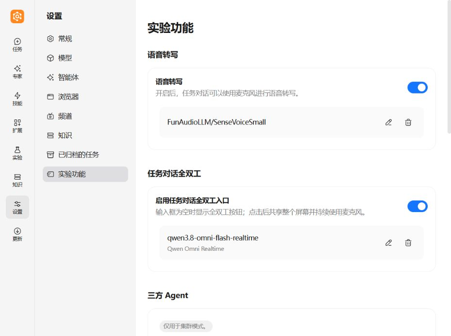
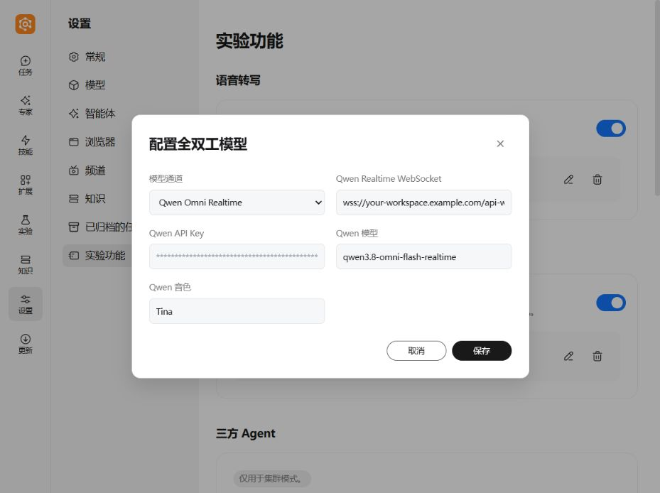
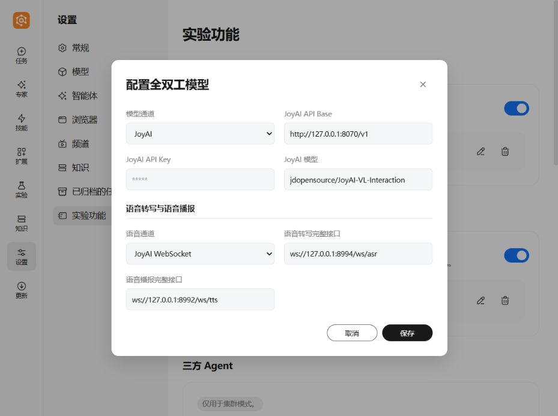
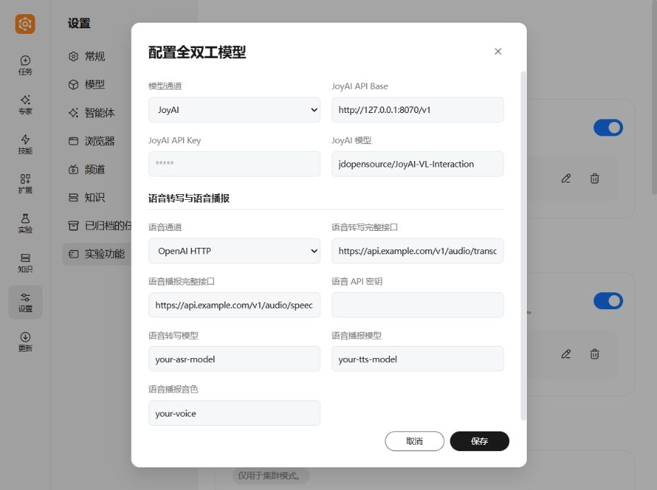
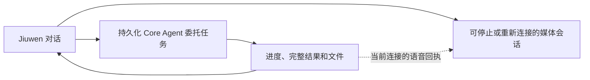
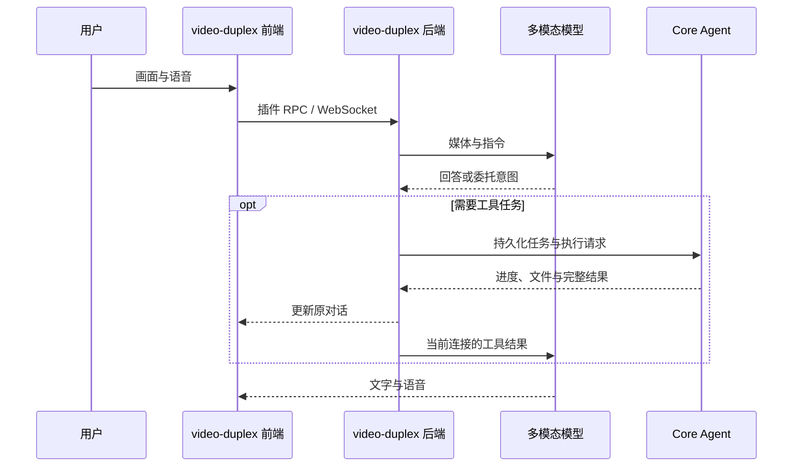

# 全双工视频对话

> 更新日期：2026-09-24。本文按本地 `0.2.7 + Xiangyu` 合并版本的界面与实现核对。
> 当前设置入口为 **设置 → 实验功能 → 任务对话全双工**。
> 版本依据、更新内容和验证边界见 [更新说明](UPDATE_NOTES.zh-CN.md)。

`video-duplex` 是 JiuwenSwarm 的全栈 Application Plugin，负责媒体采集、模型协议、
ASR/TTS 和 Core Agent 委托任务。任务页提供全双工入口；模型配置界面集成在应用设置中，
配置读取和持久化仍由插件后端负责。

## 1. 快速配置

1. 启动服务，打开 Web 界面。
2. 进入 **设置 → 实验功能**，打开 **任务对话全双工** 的「启用任务对话全双工入口」开关。
3. 未配置时点击「配置」；已有模型卡片时点击右侧铅笔「修改」。
4. 选择 **Qwen Omni Realtime** 或 **JoyAI**，按下文填写字段并保存。
5. 返回任务页，保持输入框为空、无附件，且不处于生成、语音转写或历史加载状态。
6. 点击全双工波形按钮（提示「共享整个屏幕并开始全双工对话」），按浏览器提示选择整个屏幕并授予麦克风权限。



图 1：当前配置入口。截图中的模型是本地实例配置，不代表所有部署的默认值。

### 三种开关不要混淆

| 配置 | 用途 | 保存位置 / 行为 |
|---|---|---|
| 任务对话全双工 | 控制任务输入区的全双工入口 | YAML 配置键 `experimental.task_full_duplex_enabled` |
| 语音转写 | 控制任务输入区的单独语音转写功能 | YAML 配置键 `experimental.task_asr_enabled`；不代替 JoyAI 的 ASR/TTS 配置 |
| `VIDEO_DUPLEX_ENABLED` | 插件级启用开关 | 环境配置；未设置时默认启用。设置为 `false` 会禁用插件，实验功能开关不能覆盖它 |

配置入口为 **设置 → 实验功能 → 任务对话全双工**。

## 2. Qwen Omni Realtime

在「配置全双工模型」对话框中，将模型通道设为 **Qwen Omni Realtime**。



图 2：实际配置表单。WebSocket 地址使用演示占位值；密钥由界面遮蔽。
截图中的 `qwen3.8-omni-flash-realtime` / `Tina` 是该实例已有值，
不是本文对上游模型可用性的保证，也不是代码默认值。

| 界面字段 | 环境变量 | 填写说明 |
|---|---|---|
| Qwen Realtime WebSocket | `QWEN_OMNI_REALTIME_URL` | 填服务提供的完整 WebSocket 地址，例如 `wss://your-workspace.example.com/api-ws/v1/realtime` |
| Qwen API Key | `QWEN_OMNI_API_KEY` | 填与上游地址对应的密钥 |
| Qwen 模型 | `QWEN_OMNI_MODEL_NAME` | 填该服务实际开放的模型名称 |
| Qwen 音色 | `QWEN_OMNI_VOICE` | 填该模型支持的音色 |

本版本代码初始默认值为 `qwen3.5-omni-flash-realtime` 和 `Cherry`；
服务端已有配置会覆盖默认值。模型名称、音色和地址需要配套，不能仅照抄截图。

该通道由模型处理实时音频，不需要填写 JoyAI 的独立 ASR/TTS 字段。
浏览器经 Gateway 的 `/ws/video/qwen-omni` 连接上游；上游密钥由服务端使用。

手工配置示例（占位地址与密钥必须替换）：

```dotenv
VIDEO_DUPLEX_ENABLED=true
VIDEO_LIVE_MODE=realtime
VIDEO_REALTIME_PROVIDER=qwen_omni
QWEN_OMNI_REALTIME_URL=wss://your-workspace.example.com/api-ws/v1/realtime
QWEN_OMNI_API_KEY=your-qwen-api-key
QWEN_OMNI_MODEL_NAME=qwen3.5-omni-flash-realtime
QWEN_OMNI_VOICE=Cherry
```

## 3. JoyAI 与独立 ASR/TTS

选择 **JoyAI** 后，先配置视觉模型，再选择语音协议。

| 界面字段 | 环境变量 | 填写说明 |
|---|---|---|
| JoyAI API Base | `JOYAI_API_BASE` | 填兼容服务的基础地址，通常到 `/v1`，不要填到 `/chat/completions` |
| JoyAI API Key | `JOYAI_API_KEY` | 视觉模型服务的密钥 |
| JoyAI 模型 | `JOYAI_MODEL_NAME` | 本版本默认 `jdopensource/JoyAI-VL-Interaction`，以部署服务为准 |
| 语音协议 | `VOICE_PROTOCOL` | JoyAI WebSocket 对应 `native_ws`；OpenAI HTTP 对应 `openai_http` |
| ASR 地址 | `VOICE_ASR_ENDPOINT` | 完整转写端点，协议必须与所选语音协议匹配 |
| TTS 地址 | `VOICE_TTS_ENDPOINT` | 完整语音合成端点，协议必须与所选语音协议匹配 |

JoyAI 视觉链路与语音链路分别配置。页面上方的「语音转写」卡片用于任务输入区，
不会自动替代这里的 `VOICE_*` 设置。

### 3.1 JoyAI WebSocket



图 3：JoyAI WebSocket 配置。图中的本机端口仅是部署示例，需要实际启动对应服务。
`127.0.0.1` 指向运行后端的主机；容器或远程部署需改成后端可访问的地址。

```dotenv
VIDEO_DUPLEX_ENABLED=true
VIDEO_LIVE_MODE=joyai
VIDEO_REALTIME_PROVIDER=
JOYAI_API_BASE=http://127.0.0.1:8070/v1
JOYAI_API_KEY=your-joyai-api-key
JOYAI_MODEL_NAME=jdopensource/JoyAI-VL-Interaction
VOICE_PROTOCOL=native_ws
VOICE_ASR_ENDPOINT=ws://127.0.0.1:8994/ws/asr
VOICE_TTS_ENDPOINT=ws://127.0.0.1:8992/ws/tts
```

### 3.2 OpenAI HTTP 兼容语音服务



图 4：OpenAI HTTP 模式会展示语音密钥、ASR 模型、TTS 模型及音色字段。
截图中的域名、模型与音色均为演示占位值。

| 附加字段 | 环境变量 | 填写说明 |
|---|---|---|
| 语音 API Key | `VOICE_API_KEY` | ASR/TTS 服务鉴权密钥，与 JoyAI 视觉模型密钥独立 |
| ASR 模型 | `VOICE_ASR_MODEL` | 语音服务支持的转写模型 |
| TTS 模型 | `VOICE_TTS_MODEL` | 语音服务支持的合成模型 |
| TTS 音色 | `VOICE_TTS_VOICE` | 与 TTS 模型匹配的音色标识 |

在上一节 JoyAI 基础配置上，将语音部分替换为：

```dotenv
VOICE_PROTOCOL=openai_http
VOICE_ASR_ENDPOINT=https://api.example.com/v1/audio/transcriptions
VOICE_TTS_ENDPOINT=https://api.example.com/v1/audio/speech
VOICE_API_KEY=your-voice-api-key
VOICE_ASR_MODEL=your-asr-model
VOICE_TTS_MODEL=your-tts-model
VOICE_TTS_VOICE=your-voice
```

**切换语音协议后要同时检查两个端点。** 表单不会自动把已有的
`ws://...` 地址改写为 HTTP 地址；选了 OpenAI HTTP 但仍保留 WebSocket 端点会导致请求失败。

## 4. 保存、密钥与配置文件

- 点击「保存」通过 `video.duplex.settings.update` 更新进程环境并写入当前实例使用的 dotenv 文件；
  新请求/新连接使用新配置。已有实时连接建议停止后重新启动，不能把保存成功视为上游会话已切换。
- 点击「取消」或关闭编辑框会丢弃未保存草稿。
- 已配置密钥以星号占位显示，不会从设置接口返回明文。修改其他字段时，密钥留空会保留原密钥；
  不要把星号复制成新密钥。需要更换时填写完整新值。
- 模型卡片表示配置字段已具备，不是网络连通、鉴权、音色或模型可用性测试。
- 关闭任务全双工开关用于隐藏入口，保留模型配置。
- 垃圾桶按钮意图清除两种模型通道及语音服务的配置和密钥，并非关闭开关。
  **当前版本存在删除校验冲突**：前端发送空 `voice_protocol`，后端只接受
  `native_ws` / `openai_http`，因此可能返回 `voice_protocol must be native_ws or openai_http`。
  不要将失败提示视为已删除；此问题仅记录在本文，本次文档更新未修改实现。

默认实例 dotenv 路径：

- Windows：`%USERPROFILE%\.jiuwenswarm\config\.env`
- macOS/Linux：`~/.jiuwenswarm/config/.env`

如启动时加载了其他 dotenv 文件，设置保存会使用实际加载文件。
手工编辑环境配置后应重启 Gateway。模型字段写入 dotenv，实验功能开关写入 YAML，
两者不是同一项配置。

## 5. 使用与检查

1. 确认服务已连接，插件未禁用，任务全双工开关已打开。
2. 在空白任务输入区启动，选择整个屏幕并授权麦克风。
3. 对当前屏幕内容提问，检查文字回答、语音播放与说话打断。
4. 提交需要 Core Agent 处理的请求，检查「进度」中的状态、完整结果与文件产物。
5. 点击全双工停止按钮，检查媒体采集停止；已提交的委托任务仍可继续。
6. 回到同一对话重新启动，检查新连接正常建立；刷新后检查任务记录恢复。

以上是建议的人工验收步骤。本次文档更新只核对配置界面和代码，
没有实际发起上游语音会话或提交付费模型请求。

| 现象 | 优先检查 |
|---|---|
| 找不到配置入口 | 进入「设置 → 实验功能 → 任务对话全双工」 |
| 没有全双工按钮 | 插件开关、实验功能开关、输入区是否有文字/附件，以及是否正在生成或转写 |
| 模型卡片存在但连接失败 | 完整端点、服务可达性、鉴权、模型名与音色；卡片不执行连通测试 |
| JoyAI 有画面回答但没有声音/转写 | `VOICE_PROTOCOL`、ASR/TTS 端点及对应服务；不要只检查独立「语音转写」卡片 |
| 切到 HTTP 后语音失败 | 是否仍保留 `ws://` 端点，是否填写 HTTP 语音模型、密钥与音色 |
| 改配置后会话仍使用旧值 | 保存后停止并重新启动全双工；手改 dotenv 后重启 Gateway |
| 停止后任务仍在运行 | 停止媒体不取消任务；需要在「进度」中对具体任务执行停止 |
| 重启后任务显示未知 | 执行归属丢失时保留不确定状态，不自动重放工具；先核实实际执行结果 |

## 6. 停止、重连与任务恢复

Jiuwen 对话、持久化委托任务和实时媒体连接分别管理：



- 停止全双工会释放媒体资源，不等于取消已提交的 Core Agent 任务。
- 任务按原对话归属，切换对话不会把其他对话的任务接入当前上下文。
- 前端订阅任务事件并查询未完成任务状态；进入有效对话后，通过 `video.search.list`
  分页恢复持久化任务，并定期重新同步。
- 任务记录存放在 Agent 数据根目录的 `voice-agent-tasks.sqlite`；对话时间线和文件历史另行保存。
  刷新后能够重新读取已保存记录，不应再描述为“仅保存在任务页运行时”。
- 恢复记录不恢复浏览器屏幕/麦克风授权，也不恢复 Qwen/JoyAI 上游实时连接或模型对话历史。
  旧结果恢复时不自动补播语音，旧 Qwen `call_id` 不交给新连接。
- 后端重新取得任务服务所有权时，原 `running`、`cancelling`、`waiting_user`
  及携带恢复回答的排队任务会标为 `unknown`；不会自动重放可能已经产生副作用的工具。
  普通未执行排队任务仍受依赖、资源与并发条件控制，不能把持久化恢复理解成所有任务自动续跑。

### 手动调整委托任务

任务页「进度」中，等待任务可调整顺序或设为下一项；可以取消等待任务，
或停止执行中的任务。「停止当前任务并执行此项」先请求停止当前任务，再处理目标任务，
不会关闭音视频连接。

「正在停止」表示尚未确认终止；已完成的外部操作不会回滚。
队列顺序由后端确认，过期请求会被拒绝并刷新。
调整作用于整项委托任务，不重排内部工具步骤；依赖和资源约束仍然生效，
不能通过手动排序强行绕过前置条件。

### 文件产物

文件沿用原生链路：
Core Agent `send_file_to_user` → `chat.file` → 原对话 `fileItems` → 产物列表、预览与下载。
文件事件写入历史，重新打开对话可恢复；停止全双工不阻止已知任务的文件返回。
仅在回答中写出路径或代码块不会自动生成文件产物。

内部 `video_tool` 渠道默认继承 `channels.web.send_file_allowed`；
显式设置 `channels.video_tool.send_file_allowed` 时使用该值。
路径、下载地址和令牌复用原生工具结果，不重新签发令牌或变更文件访问权限。

## 7. 运行流程与日志



| 能力 | JoyAI | Qwen Omni Realtime |
|---|---|---|
| 模型连接 | 逐帧 Chat Completions | 持久 WebSocket |
| 语音 | 独立 ASR/TTS | 模型原生音频 |
| 委托触发 | 模型 delegation | function call |
| 委托执行 | Jiuwen Core Agent | Jiuwen Core Agent |
| 打断 | 停止独立 TTS | `response.cancel` |

插件诊断日志写入 `~/.jiuwenswarm/logs/`（Windows 对应 `%USERPROFILE%\.jiuwenswarm\logs\`），
按实际触发的事件生成：

| 文件 | 用途 |
|---|---|
| `joyai-video.jsonl` | JoyAI 帧请求、结果与性能诊断 |
| `joyai-raw-content.jsonl` | JoyAI 原始内容诊断 |
| `asr-results.jsonl` | ASR 转写结果与处理信息 |
| `video-live-events.jsonl` | 视频会话事件 |
| `realtime-session.jsonl` | Realtime 会话诊断 |
| `realtime-interrupt.jsonl` | Realtime 打断诊断 |
| `qwen-realtime-errors.jsonl` | Qwen Realtime 错误诊断 |

诊断日志可能含转写文本或模型原始内容，共享前检查内容。
旧文档列出的 `video-task-routing.jsonl` 未在本次核对版本中找到写入点，
不再作为必然生成的日志列出。

## 8. 开发入口与验证命令

以下路径除特别说明外，均相对 `jiuwenswarm/extensions/video_duplex/`。

| 职责 | 文件 |
|---|---|
| 插件注册与贡献 | `extension.py`、`extension.yaml`、`frontend/index.tsx` |
| 当前实验功能开关 | `jiuwenswarm/channels/web/frontend/src/features/settings/modules/experimental/ExperimentalSettings.tsx`（仓库根相对路径） |
| 当前模型配置表单 | 同目录的 `VideoDuplexModelSettings.tsx` |
| 配置读取与持久化 | `backend/settings.py` |
| 任务输入区按钮 | `frontend/TaskFullDuplexAction.tsx` |
| 任务结果订阅、恢复与历史写入 | `frontend/TaskFullDuplexRuntime.tsx` |
| 任务归属与结果去重 | `frontend/taskDuplexJobs.ts` |
| 媒体页面 | `frontend/VideoLivePanel/index.tsx` |
| JoyAI / Qwen 会话 | `frontend/VideoLivePanel/joyaiProvider.ts`、`qwenOmniSession.ts` |
| 后端 RPC / WebSocket | `backend/video_live.py` |
| ASR/TTS | `backend/video_voice.py` |
| Core Agent 执行与结果展示 | `backend/video_search.py` |
| 任务协议适配 | `backend/task_adapter.py` |
| 任务生命周期与 SQLite 持久化 | `backend/tasks/service.py`、`backend/tasks/store.py` |

前端目录 `jiuwenswarm/channels/web/frontend/`：

```shell
npm run test:task-full-duplex
npm run test:qwen-barge-in
```

仓库根目录：

```shell
python -m pytest jiuwenswarm/extensions/video_duplex/tests/backend/test_video_task_queue.py jiuwenswarm/extensions/video_duplex/tests/backend/test_managed_tasks.py
```

这些是后续功能修改的验证入口；本次仅更新文档及截图，未运行上述功能测试。
