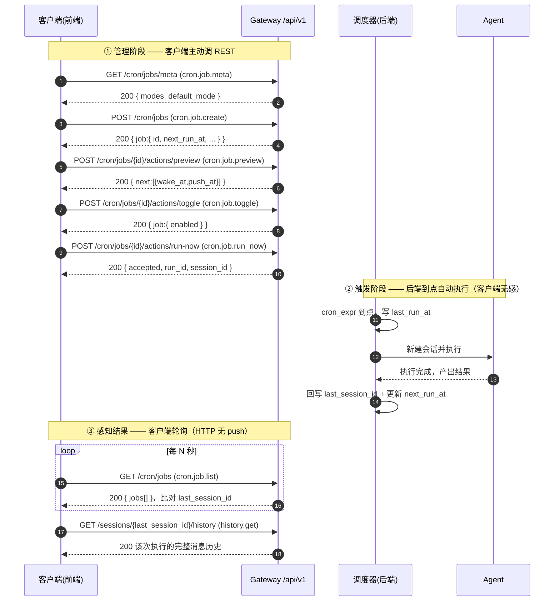
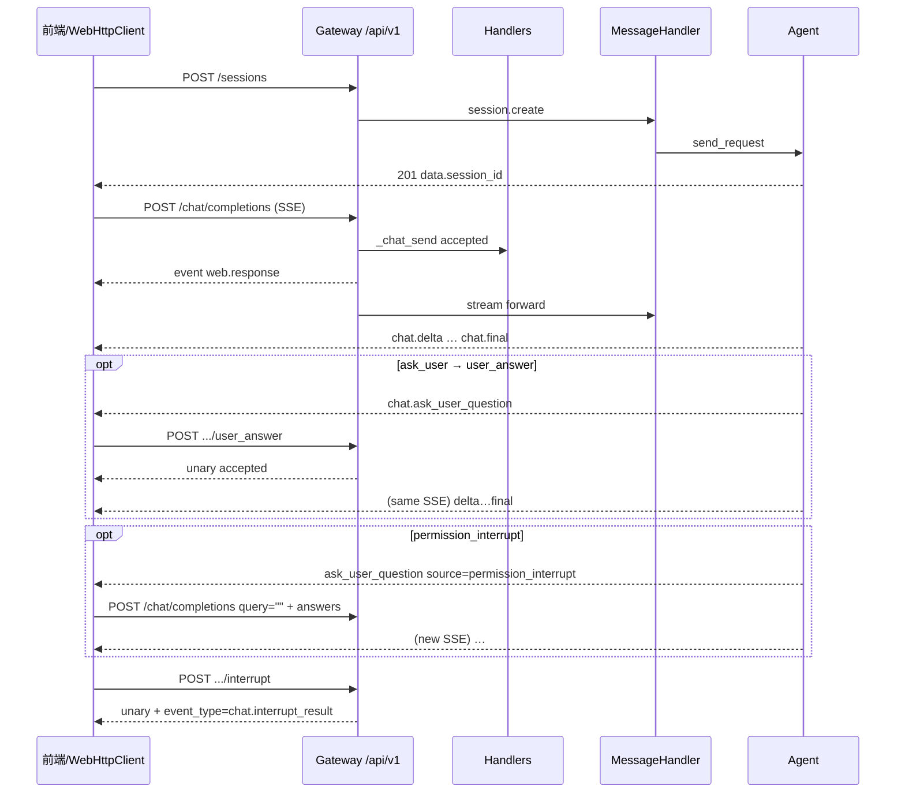

# Gateway Web HTTP 接口文档

> **目标**：将企业版浏览器 / 前端 调用 Gateway 的方式，由原 WebSocket（A1，`/ws`）并行扩展为 **HTTP + 标准 SSE（A2，**`/api/v1`**）**，并保证与现有 RPC 语义完全对齐。  
> **风格**：符合 RESTful 规范；一元响应采用 JSON（`Content-Type: application/json`）；流式响应采用 SSE（`Content-Type: text/event-stream`）。  
> **范围**：`session.create` / `chat.send` / `chat.interrupt` / `chat.user_answer` 会话与对话接口（含追问与权限确认分支）。同进程其它核心路由（如 `chat.resume`、`history.get`）见 `GET /api/v1/catalog`。  
> **对应实现**：`jiuwenswarm/gateway/channel_manager/web/web_http_app.py`、`web_http_dispatch.py`、`web_http_routes.py`、`outbound.py`、`web_http_server.py`；Handler / MessageHandler 与 A1 共用。  
> **证据原则**：标注「代码行为」均可回溯至上述源码；未实现项写「代码未定义」，**禁止当作已冻结承诺**。产品排期、Ingress 超时、Token claims、限流等以运行中 `/openapi.json` 与部署约定为准，本文不承诺未落地行为。

> **A2A 专项接口**：13 个出站 Web HTTP 路由、企业版实际放行范围以及 Manager Config Receiver 的 6 个写操作，统一见 [Gateway A2A HTTP 接口文档](./Gateway%20A2A接口文档.md)。本文保留 Web HTTP 通用信封、身份头和状态码约定，不重复维护 A2A DTO。

```text
【WS / A1】浏览器/前端 ── JSON 帧 ──► Gateway /ws        ──► Handler / MH ──► Agent
【HTTP/A2】浏览器/前端 ── REST/SSE ──► Gateway /api/v1   ──► 同一套 Handler / MH ──► Agent
```

---


## 0. 设计原则与映射约定


### 0.1 与 WebSocket（A1）的能力对齐映射

WebSocket 侧通过单一连接 + `method` 字段路由到不同 Handler。HTTP 侧将其拆解为标准 RESTful 资源 + HTTP 动词；流式仍对齐 A1 的 `event` 名与 `payload` 语义。


| WebSocket（A1）机制                    | HTTP/SSE（A2）对应                                              |
| ---------------------------------- | ----------------------------------------------------------- |
| 单一 WS 连接 + 多路 `req`                | 每次业务一条 HTTP；流式占用一条 SSE 直至终态或断开                              |
| `type=req` + `method` + `params`   | 资源路径 + HTTP 动词；body/query ≈ `params`                        |
| `id`（请求关联）                         | 请求头 `X-Request-Id`；回显于响应信封 / SSE `id:`                      |
| `type=res`（一元成功）                   | JSON：`{ request_id, ok:true, data, metadata }`              |
| `type=res`（接单，流式前）                 | SSE：`event: web.response`，`data` = 原 `payload`              |
| `type=res`（失败）                     | 一元：`ok:false` + `error`；流内：`event: chat.error`              |
| `type=event` + `event` + `payload` | SSE：`event:` = 同名事件；`data:` = **仅 payload JSON**            |
| `connection.ack`                   | `GET /api/v1/connection/status`（客户端可合成 ack）                 |
| 长连接多路复用                            | **不做** HTTP 多路复用；并行任务 = 多条 HTTP/SSE                         |
| 南向 Agent / Handler                 | **共用**；HTTP 仅换传输与出站（`HttpJsonOutbound` / `HttpSseOutbound`） |


**核心原则**


| 原则          | 说明                                                                    |
| ----------- | --------------------------------------------------------------------- |
| **语义不变**    | 同一套 A1 RPC `method` + `params`；Handler / MessageHandler / 南向 Agent 共用 |
| **只换传输**    | `type=req/res/event` → REST JSON 信封 + 标准 SSE                          |
| **路径以现网为准** | 以 `CORE_ROUTE_CATALOG` / OpenAPI 为准；**不是**清单草案中的扁平路径（见 §0.2）          |
| **未知可忽略**   | SSE 上未知 `event` 不得中断解析；body 中未建模字段 `extra=allow` 透传                   |


### 0.2 session/chat 接口路径映射（与清单草案对照）


| A1 method          | **现网正式路径**                                           | 清单草案路径（勿用）                        | 响应形态                  |
| ------------------ | ---------------------------------------------------- | --------------------------------- | --------------------- |
| `session.create`   | `POST /api/v1/sessions`                              | `POST /api/v1/session/create`     | Unary JSON，成功 **201** |
| `chat.send`        | `POST /api/v1/chat/completions`                      | `POST /api/v1/chat/send`（仅兼容隐藏路径） | 默认 **SSE**            |
| `chat.interrupt`   | `POST /api/v1/chat/{session_id}/actions/interrupt`   | `POST /api/v1/chat/interrupt`     | Unary JSON            |
| `chat.user_answer` | `POST /api/v1/chat/{session_id}/actions/user_answer` | `POST /api/v1/chat/user_answer`   | Unary JSON            |


兼容路径（不建议新接入使用）：

- `POST /api/v1/chat/send` → 同 `chat.completions`
- `POST /api/v1/chat/{session_id}/actions/answer` → 同 `user_answer`

**其它前端常需接口（同进程已落地，完整表见** `GET /api/v1/catalog`**）：**  
`GET /api/v1/health`、`GET /api/v1/connection/status`；会话管理 **§2.4**；历史 / 旁路 **§2.5**；`POST /api/v1/chat/resume` **§4.6**；config / models / locale / cron / permissions / skills / harness、`/file-api/*`。

---


## 1. 通用约定


### 1.1 基础 URL

```
http://{host}:{port}/api/v1
```


| 项         | 默认值（代码）                                               |
| --------- | ----------------------------------------------------- |
| HTTP 端口   | `GATEWAY_WEB_HTTP_PORT`，缺省 `WEB_PORT + 2` → **19002** |
| WS 端口（对照） | `WEB_PORT` → **19000**，路径 `/ws`                       |
| 本地联调 Base | `http://127.0.0.1:19002/api/v1`                       |
| 交互文档      | `http://127.0.0.1:19002/doc`                          |
| OpenAPI   | `http://127.0.0.1:19002/openapi.json`                 |


所有 **`/api/v1`** 接口路径均以该前缀为准。企业旁路 `GET /api/sessions*` **没有** `/api/v1` 前缀，见 §2.5。

> **入口边界**：本文件只描述 **Web HTTP**（浏览器 / 前端，默认 19002）。Manager 配置下发走 **Config Receiver**（默认 **8775**，信封 `{ code, message, data }`），见 [Gateway对接管理面接口文档.md](Gateway对接管理面接口文档.md)；二者端口、身份与返回格式均不同，不可混用。

### 1.2 通用请求头


| 头部                | 必填     | 说明                                                                                                                   |
| ----------------- | ------ | -------------------------------------------------------------------------------------------------------------------- |
| `Content-Type`    | 是（写操作） | `application/json`（建议 `charset=utf-8`）                                                                               |
| `Accept`          | 流式推荐   | `text/event-stream`：`chat.send` 走 SSE；亦可仅靠 body `enable_streaming`（默认 `true`）                                        |
| `Authorization`   | 否      | 现网前端常带 `Bearer <token>`；**Gateway Web HTTP 应用层无 auth middleware，不校验 Bearer**（鉴权通常由 Ingress / 壳层 / 反向代理 完成） |
| `X-Request-Id`    | 否      | 客户端追踪 id；缺省服务端 `uuid4().hex`；回显于响应头、信封 `request_id`、SSE `id:`                                                        |
| `X-Session-Id`    | 视接口    | 可补会话绑定；`session.create` **会剥离** body 中的 `session_id`，权威 ID 由服务端返回                                                    |
| `X-Channel-Id`    | 否      | 渠道标识，默认 `web`                                                                                                        |
| `X-User-Id`       | 企业推荐   | 用户 id；信任模式下写入路由身份                                                                                                 |
| `X-Group-Id`      | 企业推荐   | 租户 / 空间 id；企业 cron 写/列任务时与 `X-Bot-Id`、`X-User-Id` 三者齐全                                                            |
| `X-Bot-Id`        | 企业推荐   | 智能体实例 id                                                                                                             |
| `X-Gateway-Id`    | 企业可选   | 写入 `metadata.routing.gateway_id`；**不是**前端集群选择里的 `jiuwenclaw_id`                                                     |


> **租户头信任**：企业版默认信任并透传 `X-User-Id` / `X-Group-Id` / `X-Bot-Id` / `X-Gateway-Id`。可用 `GATEWAY_WEB_HTTP_TRUST_CLIENT_HEADERS=0|1` 强制关闭或打开；个人版仅信任本机（`127.0.0.1` / `::1` / `localhost`）。`chat.send` / `chat.resume` / `chat.user_answer` 若 Header 与 body 同时带了同一身份字段且值不一致，返回 `400 IDENTITY_CONFLICT`。


### 1.3 统一响应封装（一元 JSON）

所有非流式响应采用统一信封，对齐原 WS `type=res` 的成功/失败结构，并做 HTTP 扁平化。

#### 成功响应（HTTP 2xx）

```json
{
  "request_id": "req_abc_01",
  "ok": true,
  "data": { },
  "metadata": {
    "rpc_method": "session.create",
    "transport": "web-http"
  }
}
```


| 字段                    | 类型                    | 说明                        |
| --------------------- | --------------------- | ------------------------- |
| `request_id`          | string                | 回显请求 id（同 `X-Request-Id`） |
| `ok`                  | boolean               | 固定 `true`                 |
| `data`                | object / array / null | 业务结果，对应 A1 `res.payload`  |
| `metadata.rpc_method` | string                | 对应 A1 `method`            |
| `metadata.transport`  | string                | 固定 `web-http`             |


成功时响应头通常包含：

```http
X-Request-Id: req_abc_01
X-Web-RPC-Method: session.create
```


#### 失败响应（HTTP 4xx / 5xx）

```json
{
  "request_id": "req_abc_01",
  "ok": false,
  "error": {
    "code": "NOT_FOUND",
    "message": "session not found",
    "details": { }
  },
  "metadata": {
    "rpc_method": "chat.interrupt",
    "transport": "web-http"
  }
}
```


| 字段              | 类型     | 说明                      |
| --------------- | ------ | ----------------------- |
| `error.code`    | string | 机器可读错误码（见 §1.4）         |
| `error.message` | string | 人类可读描述                  |
| `error.details` | object | 可选附加详情（常来自下游 `payload`） |


### 1.4 HTTP 状态码与错误码


| HTTP 状态码                    | 语义                              | 典型 `error.code`                  |
| --------------------------- | ------------------------------- | -------------------------------- |
| `200 OK`                    | 一元成功（interrupt / user_answer 等） | —                                |
| `201 Created`               | 资源创建成功（`session.create`）        | —                                |
| `400 Bad Request`           | 参数错误 / 身份冲突                     | `BAD_REQUEST` / `IDENTITY_CONFLICT` |
| `401 Unauthorized`          | 未认证（本层映射存在；Bearer 默认不校验）        | `UNAUTHORIZED`                   |
| `403 Forbidden`             | 无权限                             | `FORBIDDEN`                      |
| `404 Not Found`             | 资源/方法不存在                        | `NOT_FOUND` / `METHOD_NOT_FOUND` |
| `409 Conflict`              | 资源冲突                            | `CONFLICT`                       |
| `500 Internal Server Error` | 未分类服务端异常                        | `INTERNAL_ERROR` 等               |
| `503 Service Unavailable`   | 依赖未就绪                           | `SERVICE_UNAVAILABLE`            |
| `504 Gateway Timeout`       | 一元等待超时                          | `TIMEOUT`                        |


**流内错误边界：** SSE 已返回 `HTTP 200` 后，业务/系统失败统一通过 `event: chat.error` 表达并结束流，**不再**改写该次请求的 HTTP 状态码。  
**限流 /** `Retry-After`**：** Web HTTP 应用层**未实现**。

### 1.5 SSE 流式响应约定

流式接口（`chat.send`）返回 `Content-Type: text/event-stream`。每个事件对齐 A1 的 `type=event` / 接单 `type=res`，经 `_sse_pack` 编码。

#### SSE 事件格式

```text
id: req_abc_01
event: web.response
data: {"accepted":true,"session_id":"web_xxx"}

id: req_abc_01
event: chat.delta
data: {"session_id":"web_xxx","content":"你","event_type":"chat.delta"}

id: req_abc_01
event: chat.final
data: {"session_id":"web_xxx","content":"你好","event_type":"chat.final"}
```


| SSE 字段  | 说明                                                             |
| ------- | -------------------------------------------------------------- |
| `id`    | 回显本次 `chat.send` 的 `X-Request-Id`                              |
| `event` | 事件类型；与 A1 **同名**（另增 `web.response`）                            |
| `data`  | **仅业务 payload 的 JSON 单行**，**不是**完整 `{type,id,ok,payload}` WS 帧 |
| 空行      | 事件块以 `\n\n` 结束（标准 SSE）                                         |
| `retry` | 当前实现**不强制**下发                                                  |


实现要点（`web_http_app._sse_pack`）：

```text
id: {request_id}\nevent: {event}\ndata: {json.dumps(payload, ensure_ascii=False)}\n\n
```


| 项            | 代码行为                                       |
| ------------ | ------------------------------------------ |
| Content-Type | **仅** `text/event-stream`                  |
| NDJSON       | **未实现** `application/x-ndjson`；客户端只需一种解析器 |
| 编码           | UTF-8；JSON 可含 Unicode                      |
| 多事件同包        | 允许；按空行切分事件块                                |
| `data` 多行合并  | 当前按单行输出；解析器仍建议按 SSE 规范合并多行 `data:`         |


**流结束判定：** 客户端收到 `event: chat.final` 或 `event: chat.error` 后视为该次流终止。  
**注意：** 客户端主动断开、网络中断时，**可能无终态帧即结束读端**；且**不会**自动等价于 `chat.interrupt`。

### 1.6 心跳与超时

空闲等待期间，服务端发送 **SSE 注释行**心跳（非业务 event）：

```text
: keepalive

```


| 环境变量                                | 默认          | 行为                                           |
| ----------------------------------- | ----------- | -------------------------------------------- |
| `GATEWAY_WEB_HTTP_SSE_KEEPALIVE`    | **30s**     | 等待帧超时则发送 `: keepalive`                       |
| `GATEWAY_WEB_HTTP_SSE_TIMEOUT`      | **0**（无总上限） | `>0` 时下发 `chat.error`（`stream timeout`）      |
| `GATEWAY_WEB_HTTP_SSE_IDLE_TIMEOUT` | **0**       | `>0` 时下发 `chat.error`（`stream idle timeout`） |
| `GATEWAY_WEB_HTTP_UNARY_TIMEOUT`    | **120s**    | 仅一元接口等待首帧 `res`；**与 SSE 长生成无关**              |
| Ingress read / idle                 | —           | **代码未定义**，需运维确认                              |


### 1.7 SSE / 事件类型对照（客户端应识别）


| `event`                                                    | 含义                                       | 备注                                 |
| ---------------------------------------------------------- | ---------------------------------------- | ---------------------------------- |
| `web.response`                                             | HTTP 接单（对应 A1 首帧 `res` / `accepted`）     | **仅 HTTP SSE** 出现                  |
| `chat.processing_status`                                   | 处理状态                                     |                                    |
| `chat.reasoning`                                           | 推理增量                                     | 可 coalesce                         |
| `chat.delta`                                               | 文本增量                                     |                                    |
| `chat.final`                                               | **正常终态**                                 | 结束 SSE                             |
| `chat.error`                                               | **失败终态**                                 | 结束 SSE                             |
| `chat.ask_user_question`                                   | 追问 / 权限确认                                | 原 SSE **不结束**                      |
| `chat.tool_call` / `chat.tool_update` / `chat.tool_result` | 工具链路                                     |                                    |
| `chat.interrupt_result`                                    | 中断结果                                     | HTTP 下常**合并进 interrupt 一元** `data` |
| `todo.updated`                                             | TODO 更新                                  |                                    |
| `context.usage`                                            | 上下文用量                                    |                                    |
| `context.compression_state`                                | 压缩状态                                     | 清单中的 `context.compressed` 请兼容本名称   |
| 其它                                                         | `chat.file` / `chat.notice` / `goal.*` 等 | **忽略未知事件并继续解析**                    |


---


## 2. 会话 — `session.create` 与会话管理

对应 A1 `method: "session.create"`。

### 2.1 业务语义

向 Agent 申请新执行会话；可绑定 `mode` / `project_id` / `project_dir` / `work_mode`。  
**权威** `session_id` **由服务端 / Agent 返回**，客户端不得将其当作权威入参。恢复已有会话请使用 `session.switch`（不在本四件套内）。

### 2.2 此前：WebSocket（A1）

```json
{
  "type": "req",
  "id": "req-create-1",
  "method": "session.create",
  "params": {
    "create_token": "tok-1",
    "mode": "agent",
    "project_id": "proj_001",
    "project_dir": "/data/proj_001",
    "work_mode": "work"
  }
}
```

成功时返回 `type=res`，`payload` 含 `session_id` 等；**无后续 event**。

### 2.3 HTTP 接口

```http
POST /api/v1/sessions HTTP/1.1
Host: 127.0.0.1:19002
Content-Type: application/json
X-Request-Id: req-create-1
X-User-Id: u1
X-Group-Id: g1
X-Bot-Id: b1
```

**完整请求体**

```json
{
  "create_token": "tok-1",
  "mode": "agent",
  "project_id": "proj_001",
  "project_dir": "/data/proj_001",
  "work_mode": "work"
}
```

最小可用请求体：

```json
{}
```

或：

```json
{
  "create_token": "tok-1",
  "mode": "agent"
}
```


| 字段             | 类型     | 必填        | 说明                                                                                                                     |
| -------------- | ------ | --------- | ---------------------------------------------------------------------------------------------------------------------- |
| `create_token` | string | 否         | 创建幂等令牌；省略时 Gateway 自动生成。**超时重试须固定同一 token**                                                                            |
| `mode`         | string | 否         | `agent`（默认）/ `code.normal` / `code.plan` / `code.team` / `team`；历史 `agent.plan`/`agent.fast`/`plan`/`fast` 归一为 `agent` |
| `project_id`   | string | 否         | 项目 id                                                                                                                  |
| `project_dir`  | string | 否         | 项目路径；与 `project_id` 一致性由下游校验                                                                                           |
| `work_mode`    | string | 否         | `work` / `code` 等                                                                                                      |
| `session_id`   | string | **勿传权威值** | HTTP 路径会剥离；权威 ID 只看响应 `data.session_id`                                                                                |
| 其它             | —      | —         | `SessionCreateBody`：`extra=allow`，未建模字段透传                                                                              |


**完整成功响应 —** `201 Created`

```http
HTTP/1.1 201 Created
Content-Type: application/json
X-Request-Id: req-create-1
X-Web-RPC-Method: session.create
```

```json
{
  "request_id": "req-create-1",
  "ok": true,
  "data": {
    "session_id": "web_a1b2c3d4e5f6",
    "mode": "agent",
    "project_id": "proj_001",
    "project_dir": "/data/proj_001"
  },
  "metadata": {
    "rpc_method": "session.create",
    "transport": "web-http"
  }
}
```

> `data` 内具体键以 Agent 返回的 `payload` 为准；上表为典型字段。客户端 **必须以** `data.session_id` **作为后续对话的会话主键**。

**失败响应示例 —** `400` **/** `409` **等**

```json
{
  "request_id": "req-create-1",
  "ok": false,
  "error": {
    "code": "BAD_REQUEST",
    "message": "invalid project binding",
    "details": {}
  },
  "metadata": {
    "rpc_method": "session.create",
    "transport": "web-http"
  }
}
```


| 幂等 / 生命周期        | 代码行为                              |
| ---------------- | --------------------------------- |
| `create_token`   | 有创建幂等语义；**无** `X-Request-Id` 去重窗口 |
| Session TTL / 清理 | Web HTTP **未定义**                  |
| 跨实例路由            | 企业依赖 Runtime：`session_id` + 租户头   |


**curl 示例**

```bash
curl -sS -X POST "http://127.0.0.1:19002/api/v1/sessions" \
  -H "Content-Type: application/json" \
  -H "X-Request-Id: req-create-1" \
  -H "X-Group-Id: g1" -H "X-Bot-Id: b1" -H "X-User-Id: u1" \
  -d '{"create_token":"tok-1","mode":"agent"}'
```

### 2.4 会话管理 HTTP 映射

`session.list` / `session.get_metadata` / `session.rename` / `session.pin` / `session.delete` 的**业务字段**见 [Gateway接口文档.md](./Gateway接口文档.md) **§2.1–2.6**。本节只写 HTTP 的参数位置、PATCH 分流与信封；**不要用 WS `params` 表直接当 HTTP 契约**。

实现：`web_http_app.py` 的 `session_list` / `session_get` / `session_patch` / `session_delete`，handler 与 A1 共用。Query 越界（如 `limit=0`）由 FastAPI 返回 **422**，不是 §1.3 信封。

#### `GET /api/v1/sessions` — `session.list`

`limit`、`offset` 只放 **query**（不在 path / body）。省略时 handler 默认 `limit=20`、`offset=0`。


| query    | 必填  | 约束 | 说明 |
| -------- | --- | --- | --- |
| `limit`  | 否   | 1..200 | 每页条数 |
| `offset` | 否   | ≥0     | 分页偏移 |


```http
GET /api/v1/sessions?limit=20&offset=0 HTTP/1.1
Host: 127.0.0.1:19002
X-Request-Id: req-list-1
X-User-Id: u1
X-Group-Id: g1
X-Bot-Id: b1
```

成功 — `200`，`data` 对应 A1 `session.list` payload（`sessions[]` / `total` / `limit` / `offset`；元素字段见 Gateway接口文档 §2.1，remote 路径还可能带 `pinned` / `pin_order`）：

```json
{
  "request_id": "req-list-1",
  "ok": true,
  "data": {
    "sessions": [
      {
        "session_id": "web_a1b2c3d4e5f6",
        "channel_id": "web",
        "user_id": "u1",
        "created_at": 1726800000.0,
        "last_message_at": 1726800100.0,
        "title": "会议纪要",
        "message_count": 3,
        "mode": "agent"
      }
    ],
    "total": 1,
    "limit": 20,
    "offset": 0
  },
  "metadata": {
    "rpc_method": "session.list",
    "transport": "web-http"
  }
}
```

```bash
curl -sS "http://127.0.0.1:19002/api/v1/sessions?limit=20&offset=0" \
  -H "X-Request-Id: req-list-1" \
  -H "X-Group-Id: g1" -H "X-Bot-Id: b1" -H "X-User-Id: u1"
```

#### `GET /api/v1/sessions/{session_id}` — `session.get_metadata`

`session_id` 只放 **path**。一元信封，`data` 即 metadata 对象（字段见 Gateway接口文档 §2.4）。

```http
GET /api/v1/sessions/web_a1b2c3d4e5f6 HTTP/1.1
Host: 127.0.0.1:19002
X-Request-Id: req-meta-1
X-User-Id: u1
X-Group-Id: g1
X-Bot-Id: b1
```

成功 — `200`：

```json
{
  "request_id": "req-meta-1",
  "ok": true,
  "data": {
    "session_id": "web_a1b2c3d4e5f6",
    "title": "会议纪要",
    "mode": "agent",
    "model": "",
    "project_dir": "",
    "project_id": "proj_001",
    "pinned": false,
    "pin_order": 0
  },
  "metadata": {
    "rpc_method": "session.get_metadata",
    "transport": "web-http"
  }
}
```

会话不存在时 handler 返回 `code=NOT_FOUND`（HTTP **404**，信封 `ok:false`）。remote 模式本地无目录时会回退 PG 投影，字段可能比本地 metadata 少，缺的键给缺省值。

#### `PATCH /api/v1/sessions/{session_id}` — 重命名 **或** 置顶（二选一）

`session_id` 放 **path**，写入 body。`session_patch` **按 body 键分流，一次请求只走一条 RPC**：


| Body | 选中的 RPC | 说明 |
| ---- | --------- | --- |
| 含键 `pinned` **或** `pin` | `session.pin` | **不会**再执行 `session.rename` |
| 否则 | `session.rename` | 即使同时想改标题，只要带了 `pinned`/`pin` 也不会改名 |


推荐只传 **`pinned`（bool）**。仅传 `{"pin": true}` 仍会进入 pin 分支，但 handler 读的是 `pinned`，会得到 `400 BAD_REQUEST`（`pinned must be boolean`）。

**重命名示例**

```http
PATCH /api/v1/sessions/web_a1b2c3d4e5f6 HTTP/1.1
Host: 127.0.0.1:19002
Content-Type: application/json
X-Request-Id: req-rename-1
X-User-Id: u1
X-Group-Id: g1
X-Bot-Id: b1
```

```json
{
  "title": "新标题"
}
```

成功时 `data` 含 `title` 等（remote 典型为 `session_id` / `title` / `previous_title`）。`title` 语义与 Gateway接口文档 §2.5 相同：不传→查询；空串→清除；非空→设置（截断 200 字符）。

**置顶示例**

```json
{
  "pinned": true
}
```

成功 — `200`，`data` 对齐 §2.6：

```json
{
  "request_id": "req-pin-1",
  "ok": true,
  "data": {
    "pinned": true,
    "pin_order": 1
  },
  "metadata": {
    "rpc_method": "session.pin",
    "transport": "web-http"
  }
}
```

**同时传 `title` 与 `pinned`：** 只走 `session.pin`，**不等于**两个操作都执行。需要改名请再发一次不含 `pinned`/`pin` 的 PATCH。

不存在：pin/rename 的 remote 与本地路径均可能返回 `404 NOT_FOUND`（`session not found`）。

```bash
curl -sS -X PATCH "http://127.0.0.1:19002/api/v1/sessions/web_a1b2c3d4e5f6" \
  -H "Content-Type: application/json" \
  -H "X-Request-Id: req-rename-1" \
  -H "X-Group-Id: g1" -H "X-Bot-Id: b1" -H "X-User-Id: u1" \
  -d '{"title":"新标题"}'

curl -sS -X PATCH "http://127.0.0.1:19002/api/v1/sessions/web_a1b2c3d4e5f6" \
  -H "Content-Type: application/json" \
  -H "X-Request-Id: req-pin-1" \
  -H "X-Group-Id: g1" -H "X-Bot-Id: b1" -H "X-User-Id: u1" \
  -d '{"pinned":true}'
```

#### `DELETE /api/v1/sessions/{session_id}` — `session.delete`

`session_id` 只放 **path**。

```http
DELETE /api/v1/sessions/web_a1b2c3d4e5f6 HTTP/1.1
Host: 127.0.0.1:19002
X-Request-Id: req-del-1
X-User-Id: u1
X-Group-Id: g1
X-Bot-Id: b1
```

**本地存储（非 remote）成功 — `200`：** `data` 含已删除的 `session_id`（与 Gateway接口文档 §2.3 对齐）。目录不存在 → **404** `NOT_FOUND`（`session not found`）；非法 id → **400** `BAD_REQUEST`。

**企业 remote（PG）实际行为：** handler **仍返回 `ok:true` / HTTP 200**，`data` 为 `{ "session_id": "…", "history_store_deleted": true|false }`。身份不匹配或行不存在时 `history_store_deleted` 为 `false`，**不会**改成 403/404。不要按「无权=403」去对接。

```bash
curl -sS -X DELETE "http://127.0.0.1:19002/api/v1/sessions/web_a1b2c3d4e5f6" \
  -H "X-Request-Id: req-del-1" \
  -H "X-Group-Id: g1" -H "X-Bot-Id: b1" -H "X-User-Id: u1"
```

### 2.5 历史查询与旁路接口

`history.get` 的 WS 事件语义见 [Gateway接口文档.md](./Gateway接口文档.md) **§3.4 / §20.4**（`history.message`）。HTTP 另有聚合 JSON 与企业旁路路径，**不能套用 WS 帧**。

#### `GET /api/v1/sessions/{session_id}/history` — `history.get`

| 参数 | 位置 | 约束 | 说明 |
| --- | --- | --- | --- |
| `session_id` | path | 必填 | 目标会话 |
| `page_idx` | query | ≥1；省略则 **1** | 页码从 1 开始 |

**返回形态由 `Accept` 决定**（`history_get`）：

| `Accept` | 行为 |
| -------- | --- |
| 不含 `text/event-stream`（默认） | `_history_json`：等流结束，聚合成 **一元 JSON 信封** |
| 含 `text/event-stream` | `_stream`：SSE；先可能 `web.response`（accepted），再 `history.message`，末帧 `status=done` |


**默认聚合 JSON — `200`：**

```http
GET /api/v1/sessions/web_a1b2c3d4e5f6/history?page_idx=1 HTTP/1.1
Host: 127.0.0.1:19002
X-Request-Id: req-hist-1
X-User-Id: u1
X-Group-Id: g1
X-Bot-Id: b1
```

```json
{
  "request_id": "req-hist-1",
  "ok": true,
  "data": {
    "session_id": "web_a1b2c3d4e5f6",
    "messages": [
      {
        "role": "user",
        "content": "你好",
        "timestamp": 1726800000.0,
        "session_id": "web_a1b2c3d4e5f6",
        "request_id": "req-send-1"
      }
    ],
    "total_pages": 1,
    "page_idx": 1
  },
  "metadata": {
    "rpc_method": "history.get",
    "transport": "web-http"
  }
}
```

JSON 路径若收到 `chat.error` 且文案含本地历史缺失，remote 模式可能回退 PG 合成同形 `data`；回退失败则 **404** `NOT_FOUND`。

**SSE 示例：**

```http
GET /api/v1/sessions/web_a1b2c3d4e5f6/history?page_idx=1 HTTP/1.1
Host: 127.0.0.1:19002
Accept: text/event-stream
X-Request-Id: req-hist-sse-1
X-User-Id: u1
X-Group-Id: g1
X-Bot-Id: b1
```

```text
id: req-hist-sse-1
event: web.response
data: {"accepted": true, "session_id": "web_a1b2c3d4e5f6", "page_idx": 1}

id: req-hist-sse-1
event: history.message
data: {"event_type":"history.message","message":{"role":"user","content":"你好"},"session_id":"web_a1b2c3d4e5f6","total_pages":1,"page_idx":1}

id: req-hist-sse-1
event: history.message
data: {"event_type":"history.message","status":"done","session_id":"web_a1b2c3d4e5f6","total_pages":1,"page_idx":1}
```

```bash
curl -sS "http://127.0.0.1:19002/api/v1/sessions/web_a1b2c3d4e5f6/history?page_idx=1" \
  -H "X-Request-Id: req-hist-1" \
  -H "X-Group-Id: g1" -H "X-Bot-Id: b1" -H "X-User-Id: u1"

curl -N "http://127.0.0.1:19002/api/v1/sessions/web_a1b2c3d4e5f6/history?page_idx=1" \
  -H "Accept: text/event-stream" \
  -H "X-Request-Id: req-hist-sse-1" \
  -H "X-Group-Id: g1" -H "X-Bot-Id: b1" -H "X-User-Id: u1"
```

#### 企业旁路 `GET /api/sessions*`（无 `/api/v1` 前缀）

挂在**同一 Web HTTP 端口**（默认 19002），仅 **enterprise** 注册（`web_http_sessions_compat.py`）。读 `ChatHistoryStore`，**不是** RPC `session.list` / `session.get_metadata`，**不用** `{ request_id, ok, data }` 信封。

身份：query `user` 优先；缺省或空白则读 `X-User-Id`。本旁路路由**不**把 `X-Group-Id` / `X-Bot-Id` 传入 store。`user` 与 Header 都缺时，store 侧按 `guest` 过滤。

##### `GET /api/sessions`


| query    | 必填  | 默认 | 约束 | 说明 |
| -------- | --- | --- | --- | --- |
| `limit`  | 否   | 20  | 1..100 | 与 `/api/v1/sessions` 的 1..200 不同 |
| `offset` | 否   | 0   | ≥0 | |
| `user`   | 否   | —   | 优先于 `X-User-Id` | |


成功直接：

```json
{
  "sessions": [
    {
      "session_id": "web_a1b2c3d4e5f6",
      "title": "会议纪要",
      "user": "u1"
    }
  ]
}
```

没有 `request_id` / `ok` / `data` / `total`。

```bash
curl -sS "http://127.0.0.1:19002/api/sessions?limit=20&offset=0&user=u1"
curl -sS "http://127.0.0.1:19002/api/sessions?limit=20&offset=0" \
  -H "X-User-Id: u1"
```

##### `GET /api/sessions/{session_id}`

旁路详情（瘦对白 `messages` 等）。身份规则同上。不存在或身份不符 → **404** 且 body 为 `{"error":"not_found"}`（同样无统一信封）。path 为空 → **400** `{"error":"missing_session_id"}`。

```bash
curl -sS "http://127.0.0.1:19002/api/sessions/web_a1b2c3d4e5f6" \
  -H "X-User-Id: u1"
```

#### `/api/v1/sessions*` 与 `/api/sessions*` 差异


| 项 | `GET /api/v1/sessions*` | `GET /api/sessions*`（旁路） |
| --- | --- | --- |
| 谁注册 | 所有 edition | **仅 enterprise** |
| 用途 | RPC：`session.list` / `get_metadata` / `history.get` | Web Pod 兼容：直读 ChatHistoryStore |
| 身份 | 租户头走 dispatch 路由身份（`X-User-Id` / `X-Group-Id` / `X-Bot-Id`） | **仅** query `user`，否则 `X-User-Id`；不传 group/bot |
| 信封 | §1.3 `{ request_id, ok, data\|error, metadata }` | 列表 `{sessions:[…]}`；详情为 store 对象；错误 `{error:…}` |
| 历史 | `/api/v1/sessions/{id}/history`：JSON 或 SSE | 详情里带 messages；无独立 history SSE |
| 分页 | list：`limit` 1..200；history：`page_idx`≥1 | list：`limit` 默认 20、1..100 |


---


## 3. 发送消息（流式）— `chat.send`

对应 A1 `method: "chat.send"`。核心流式接口。

### 3.1 业务语义

向**已有会话**发送用户消息：**先接单，再推送过程事件，直至终态**。  
同 channel 上新的 `chat.send` 会取消在途生成流（`MessageHandler`，`reason=new_chat_send`）。

### 3.2 此前：WebSocket（A1）


| 阶段   | 来源                             | 帧                                                             |
| ---- | ------------------------------ | ------------------------------------------------------------- |
| ① 接单 | `_chat_send`（`HANDLER_BEFORE`） | `type=res`，`payload: { accepted: true, session_id }`          |
| ② 流式 | MessageHandler ← Agent         | `type=event`，`event: chat.*` … 直至 `chat.final` / `chat.error` |


### 3.3 HTTP 接口

```http
POST /api/v1/chat/completions HTTP/1.1
Host: 127.0.0.1:19002
Content-Type: application/json
Accept: text/event-stream
X-Request-Id: req-send-1
X-Session-Id: web_a1b2c3d4e5f6
X-User-Id: u1
X-Group-Id: g1
X-Bot-Id: b1
```

**完整请求体（常规对话）**

```json
{
  "session_id": "web_a1b2c3d4e5f6",
  "query": "帮我总结一下今天的会议纪要",
  "content": "帮我总结一下今天的会议纪要",
  "mode": "agent",
  "enable_streaming": true,
  "model_name": "default",
  "skills": [],
  "input_mode": "text",
  "project_id": "proj_001",
  "project_dir": "/data/proj_001",
  "media_items": [],
  "files": {}
}
```

**带图片附件（示意）**

```json
{
  "session_id": "web_a1b2c3d4e5f6",
  "query": "请描述这张图",
  "mode": "agent",
  "enable_streaming": true,
  "media_items": [
    {
      "type": "image",
      "mime_type": "image/png",
      "base64Data": "<base64-without-data-url-prefix>"
    }
  ]
}
```


| 字段                                   | 类型             | 必填          | 说明                                                    |
| ------------------------------------ | -------------- | ----------- | ----------------------------------------------------- |
| `session_id`                         | string         | 是           | 已有会话（先 `POST /sessions`）；亦可辅以 `X-Session-Id`          |
| `query`                              | string         | 是*          | OpenAPI **必填**（可为空串）；仅传 `content` 不传 `query` 会 422 |
| `content`                            | string         | 否           | 与 `query` 互通；MessageHandler 运行时读 `query or content`；HTTP 层**不会**把 `content` 改写成 `query`。现网前端常**双写** |
| `mode`                               | string         | 否           | 默认 `agent`；枚举见 §3.5                                      |
| `enable_streaming`                   | boolean        | 否           | 默认 `true`；与 `Accept: text/event-stream` 共同决定走 SSE     |
| `model_name`                         | string         | 否           | 指定模型；透传                                               |
| `skills`                             | array          | 否           | 技能列表；透传                                               |
| `input_mode`                         | string         | 否           | 输入模式；透传                                               |
| `project_id` / `project_dir` / 工作区字段 | string         | 否           | 透传                                                    |
| `media_items`                        | array          | 否           | 图片附件；见 §3.6                                            |
| `files`                              | object / array | 否           | 附件结构；透传 / 由规范化写入                                      |
| `request_id`                         | string         | 权限 resume 时 | **问题/交互 ID**（非 Header 的 HTTP 请求 id）                   |
| `answers` / `source` / `status`      | —              | 权限 resume 时 | 见 §5.5；此时 `query` 常为空串                                |
| 其它                                   | —              | —           | `ChatSendBody`：`extra=allow`，未知字段**保留透传**，不因未知键直接 400 |


 OpenAPI 将 `query` 标为必填（字段必须出现，权限 resume 可传空字符串）。HTTP 层不会把单独的 `content` 改写成 `query`。

**流判定：** `Accept` 包含 `text/event-stream` **或** `enable_streaming !== false` → `_stream`。

### 3.4 完整 SSE 响应（未经整理的原文形态）

```http
HTTP/1.1 200 OK
Content-Type: text/event-stream
Cache-Control: no-cache
Connection: keep-alive
X-Request-Id: req-send-1
X-Web-RPC-Method: chat.send
```

```text
id: req-send-1
event: web.response
data: {"accepted": true, "session_id": "web_a1b2c3d4e5f6"}

id: req-send-1
event: chat.processing_status
data: {"session_id": "web_a1b2c3d4e5f6", "status": "thinking", "event_type": "chat.processing_status"}

id: req-send-1
event: chat.reasoning
data: {"session_id": "web_a1b2c3d4e5f6", "content": "先梳理要点…", "event_type": "chat.reasoning"}

id: req-send-1
event: chat.delta
data: {"session_id": "web_a1b2c3d4e5f6", "content": "会议", "event_type": "chat.delta"}

id: req-send-1
event: chat.delta
data: {"session_id": "web_a1b2c3d4e5f6", "content": "纪要如下：…", "event_type": "chat.delta"}

id: req-send-1
event: chat.final
data: {"session_id": "web_a1b2c3d4e5f6", "content": "会议纪要如下：…", "event_type": "chat.final"}

: keepalive

```

各阶段业务含义：


| 阶段   | SSE `event`                                                     | `data` 要点                                 | 是否终态        |
| ---- | --------------------------------------------------------------- | ----------------------------------------- | ----------- |
| 接单   | `web.response`                                                  | `{ "accepted": true, "session_id": "…" }` | 否（仅表示已接收）   |
| 过程   | `chat.processing_status` / `reasoning` / `delta` / `tool_*` / … | 与 A1 payload 对齐                           | 否           |
| 正常结束 | `chat.final`                                                    | 完整或汇总文本等                                  | **是** → 关闭流 |
| 失败结束 | `chat.error`                                                    | 错误信息 / code                               | **是** → 关闭流 |
| 追问   | `chat.ask_user_question`                                        | 含问题 `request_id`                          | **否**，流保持打开 |


**生命周期要点（代码）**

1. **首帧不保证一定是** `web.response`：队列上通常先有接单 `res`；`WebHttpClient` 在 HTTP 200 后即可合成 `{accepted:true}`，**不阻塞等待**该帧。
2. `accepted` **/** `web.response` **≠ 最终成功**。
3. **正常终态仅** `chat.final`**；失败终态** `chat.error`。
4. **可能无终态帧就结束读端**（客户端 disconnect / outbound 关闭）——**不**自动 `interrupt`。
5. **空回答**：无专用协议；可为 `chat.final` + 空 `content`。


### 3.5 `mode` 枚举

合法：`agent`、`code.plan`、`code.normal`、`code.team`、`team`。  
历史别名 `agent.plan` / `agent.fast` / `plan` / `fast` **归一为** `agent`；未知值回落 `agent`。

### 3.6 图片附件（`media_items`）

Gateway 在 `chat.send` 入站时校验并落盘（`jiuwenswarm/gateway/media_attachments.py`）：

| 项 | 代码行为 |
| --- | --- |
| 识别条件 | `type` 必须为 `image`；其它条目忽略 |
| MIME | `image/png` / `image/jpeg` / `image/webp` / `image/gif`（`mime_type` 或 `mimeType`） |
| 数据字段 | **`base64Data` 或 `base64_data`**（不要用 `data`；不要带 `data:` URL 前缀） |
| 上限 | 最多 **8** 张，单张 **10MiB**；超限条目被丢弃 |
| 处理后 | 替换为 `{ type, filename, mime_type, path, size_bytes }`，并写入 `files.uploaded_images` |

### 3.7 幂等与重试


| 场景                   | 代码行为                             |
| -------------------- | -------------------------------- |
| 相同 `X-Request-Id` 再发 | **无**去重；视为新请求                    |
| 同 `session_id` 再发    | 取消在途流，启动新任务（`new_chat_send`）     |
| 断线后同 ID 重试           | 新请求；**无** Last-Event-ID / seq 续传 |


### 3.8 curl 示例

```bash
curl -N -X POST "http://127.0.0.1:19002/api/v1/chat/completions" \
  -H "Content-Type: application/json" \
  -H "Accept: text/event-stream" \
  -H "X-Request-Id: req-send-1" \
  -H "X-Session-Id: web_a1b2c3d4e5f6" \
  -H "X-Group-Id: g1" -H "X-Bot-Id: b1" -H "X-User-Id: u1" \
  -d '{"session_id":"web_a1b2c3d4e5f6","query":"你好","mode":"agent","enable_streaming":true}'
```

---


## 4. 中断对话 — `chat.interrupt`

对应 A1 `method: "chat.interrupt"`。

### 4.1 业务语义

按 **session** 维度对在途任务执行暂停 / 取消 / 恢复 / 补充输入。  
`intent`：`pause` | `cancel` | `resume` | `supplement`（可带 `new_input` / 附件）。

### 4.2 此前：WebSocket（A1）

1. 先下发 `type=res`：`{ accepted, session_id, intent? }`
2. 再独立下发 `event: chat.interrupt_result`


### 4.3 HTTP 接口

```http
POST /api/v1/chat/{session_id}/actions/interrupt HTTP/1.1
Host: 127.0.0.1:19002
Content-Type: application/json
X-Request-Id: req-interrupt-1
X-User-Id: u1
X-Group-Id: g1
X-Bot-Id: b1
```

**完整请求体（取消）**

```json
{
  "intent": "cancel"
}
```

**完整请求体（补充输入）**

```json
{
  "intent": "supplement",
  "new_input": "请改用中文重新回答",
  "media_items": []
}
```


| 字段                 | 类型     | 必填             | 说明                                              |
| ------------------ | ------ | -------------- | ----------------------------------------------- |
| `intent`           | string | 否              | `cancel` / `pause` / `resume` / `supplement`；HTTP 省略时 enrich 路径按 **`cancel`** |
| `new_input`        | string | `supplement` 时 | 补充文本                                            |
| `media_items` / 其它 | —      | 否              | `ChatActionBody`：`extra=allow`，透传               |


路径参数：


| 参数           | 说明                                                            |
| ------------ | ------------------------------------------------------------- |
| `session_id` | 目标会话；**中止维度是 session**，不是 Header 里某次 `chat.send` 的 request_id |


### 4.4 完整成功响应 — `200 OK`

因一元响应返回后即拆除 outbound，后续独立 `chat.interrupt_result` 事件无法再推给该 HTTP 客户端。故 `_chat_interrupt` 将结果**合并进同一** `data`：

```http
HTTP/1.1 200 OK
Content-Type: application/json
X-Request-Id: req-interrupt-1
X-Web-RPC-Method: chat.interrupt
```

```json
{
  "request_id": "req-interrupt-1",
  "ok": true,
  "data": {
    "accepted": true,
    "session_id": "web_a1b2c3d4e5f6",
    "intent": "cancel",
    "event_type": "chat.interrupt_result",
    "success": true,
    "message": "任务已取消"
  },
  "metadata": {
    "rpc_method": "chat.interrupt",
    "transport": "web-http"
  }
}
```


| 字段（`data`）            | 说明                                      |
| --------------------- | --------------------------------------- |
| `accepted`            | 请求已被 Handler 受理                         |
| `session_id`          | 会话 id                                   |
| `intent`              | 回显意图                                    |
| `event_type`          | 固定语义标记 `chat.interrupt_result`（供前端合成事件） |
| `success` / `message` | 合并结果；HTTP enrich 路径可能少于完整 WS 事件字段       |


**失败响应示例**

```json
{
  "request_id": "req-interrupt-1",
  "ok": false,
  "error": {
    "code": "NOT_FOUND",
    "message": "session not found",
    "details": {}
  },
  "metadata": {
    "rpc_method": "chat.interrupt",
    "transport": "web-http"
  }
}
```


### 4.5 与原 `chat.send` SSE / 关流关系


| 场景                                      | 代码行为                                                       |
| --------------------------------------- | ---------------------------------------------------------- |
| 原 SSE 是否再收 `interrupt_result` / `final` | **不保证**；请以 interrupt **一元响应**收尾 UI                         |
| 客户端主动关闭 `chat.send` SSE                | **仅停止推送**；**不**自动 cancel Agent                             |
| 网络异常断 SSE                               | 默认任务**继续**                                                 |
| 可靠停止                                    | **必须**调用本接口                                                |
| 按 `request_id` 精确中止单任务                  | HTTP **无**该参数；按 **session**                                |
| 重复中止 / 任务已结束                            | 仍可能返回成功类信封；以 `ok` + `event_type` + `intent` + `success` 判断 |


**curl 示例**

```bash
curl -sS -X POST "http://127.0.0.1:19002/api/v1/chat/web_a1b2c3d4e5f6/actions/interrupt" \
  -H "Content-Type: application/json" \
  -H "X-Request-Id: req-interrupt-1" \
  -H "X-Group-Id: g1" -H "X-Bot-Id: b1" -H "X-User-Id: u1" \
  -d '{"intent":"cancel"}'
```

### 4.6 恢复对话 — `chat.resume`

WS 业务语义见 [Gateway接口文档.md](./Gateway接口文档.md) **§3.5**（Web 前端也可用 **§4** `chat.interrupt` + `intent: "resume"`）。本节只写 HTTP 契约。

`POST /api/v1/chat/resume` 走 `_unary(..., is_stream=True)`：等到首帧 `res` 后即拆 outbound，**本请求不返回 SSE**。`accepted: true` **只表示请求已被受理，不等于任务已完成**。HTTP **不保证**原 `chat.send` SSE 会续接后续 delta/final。

**目标会话必须显式给出**：body `session_id` 或头 `X-Session-Id`（`bind_http_session`）。两者都缺时会生成内部 `webhttp_*` 占位 id，**不能**当作恢复目标。

`chat.resume` 与 `chat.send` / `chat.user_answer` 一样做身份冲突检查：Header 与 body 同时带了同一身份字段且值不一致 → `400 IDENTITY_CONFLICT`。

```http
POST /api/v1/chat/resume HTTP/1.1
Host: 127.0.0.1:19002
Content-Type: application/json
X-Request-Id: req-resume-1
X-Session-Id: web_a1b2c3d4e5f6
X-User-Id: u1
X-Group-Id: g1
X-Bot-Id: b1
```

```json
{
  "session_id": "web_a1b2c3d4e5f6"
}
```

成功 — **一元 JSON `200`**（handler `_chat_resume` 的 payload 进 `data`）：

```json
{
  "request_id": "req-resume-1",
  "ok": true,
  "data": {
    "accepted": true,
    "session_id": "web_a1b2c3d4e5f6"
  },
  "metadata": {
    "rpc_method": "chat.resume",
    "transport": "web-http"
  }
}
```

**按当前实现取恢复后结果：** 本 HTTP 调用结束后，用 `GET /api/v1/sessions/{session_id}/history`（§2.5）拉取会话历史；或再开一条 `POST /api/v1/chat/completions` SSE（那是**新**流，会按 `new_chat_send` 顶替在途生成）。不要假设旧 SSE 仍在推。

```bash
curl -sS -X POST "http://127.0.0.1:19002/api/v1/chat/resume" \
  -H "Content-Type: application/json" \
  -H "X-Request-Id: req-resume-1" \
  -H "X-Session-Id: web_a1b2c3d4e5f6" \
  -H "X-Group-Id: g1" -H "X-Bot-Id: b1" -H "X-User-Id: u1" \
  -d '{"session_id":"web_a1b2c3d4e5f6"}'
```

---


## 5. 用户回答与追问 / 权限确认 — `chat.user_answer`

对应 A1 `method: "chat.user_answer"`；并说明与 `chat.send` 权限 resume 的分工。

### 5.1 业务语义

当 SSE 上出现 `chat.ask_user_question` 时：

- **普通追问**：调用本接口提交答案；**后续事件仍写在原** `chat.send` **SSE**。  
- **权限 / interrupt 类**：见 §5.5，多数情况**再次** `POST /chat/completions`，而不是本接口。


### 5.2 HTTP 接口（普通追问）

```http
POST /api/v1/chat/{session_id}/actions/user_answer HTTP/1.1
Host: 127.0.0.1:19002
Content-Type: application/json
X-Request-Id: req-answer-1
X-User-Id: u1
X-Group-Id: g1
X-Bot-Id: b1
```

兼容路径：`POST /api/v1/chat/{session_id}/actions/answer`。

**完整请求体**

```json
{
  "request_id": "q-100",
  "status": "answered",
  "answers": [
    {
      "question": "是否允许执行该高风险操作？",
      "selected_options": ["同意"],
      "custom_input": ""
    }
  ],
  "source": "ask_user"
}
```

多选 / 自由文本示例：

```json
{
  "request_id": "q-101",
  "status": "answered",
  "answers": [
    {
      "question": "请选择关注重点",
      "selected_options": ["成本", "性能"],
      "custom_input": "优先控制成本"
    }
  ]
}
```

跳过：

```json
{
  "request_id": "q-102",
  "status": "skipped",
  "answers": []
}
```


| 字段           | 类型     | 必填  | 说明                                                                                          |
| ------------ | ------ | --- | ------------------------------------------------------------------------------------------- |
| `request_id` | string | 是   | **问题/交互 ID** = `chat.ask_user_question` payload 中的 `request_id`（**不是** Header 的 HTTP 请求 id） |
| `answers`    | array  | 是*  | 答案列表；元素见下表                                                                                  |
| `status`     | string | 否   | `answered`                                                                                  |
| `source`     | string | 否   | 追问来源标记；透传                                                                                   |
| 其它           | —      | —   | `extra=allow`                                                                               |


`answers[]` 元素：


| 字段                 | 类型       | 必填  | 说明              |
| ------------------ | -------- | --- | --------------- |
| `selected_options` | string[] | 常用  | 同意/拒绝/单选/多选选项文本 |
| `question`         | string   | 否   | 原问题文本（可选回传）     |
| `custom_input`     | string   | 否   | 自由文本补充          |


### 5.3 完整成功响应 — `200 OK`

本接口为**一元 JSON**，**不返回 SSE**：

```http
HTTP/1.1 200 OK
Content-Type: application/json
X-Request-Id: req-answer-1
X-Web-RPC-Method: chat.user_answer
```

```json
{
  "request_id": "req-answer-1",
  "ok": true,
  "data": {
    "accepted": true,
    "session_id": "web_a1b2c3d4e5f6",
    "request_id": "q-100"
  },
  "metadata": {
    "rpc_method": "chat.user_answer",
    "transport": "web-http"
  }
}
```

其后，原 `chat.send` SSE（`id: req-send-1`）上继续出现例如：

```text
id: req-send-1
event: chat.delta
data: {"session_id":"web_a1b2c3d4e5f6","content":"好的，继续…","event_type":"chat.delta"}

id: req-send-1
event: chat.final
data: {"session_id":"web_a1b2c3d4e5f6","content":"…","event_type":"chat.final"}
```


| 问题          | 答复                                                                          |
| ----------- | --------------------------------------------------------------------------- |
| 原 SSE 是否结束？ | **否**（默认未开 idle 强制超时）                                                       |
| 等待期是否心跳？    | **是**，`: keepalive`                                                         |
| 原流已结束如何拿后续？ | **无**按 request_id 的 SSE 续传；可 `GET /api/v1/sessions/{session_id}/history` 补偿 |
| 追问专用 TTL    | **代码未定义**                                                                   |


### 5.4 ID 贯穿约定


| ID                                      | 含义                                      | 出现位置                             |
| --------------------------------------- | --------------------------------------- | -------------------------------- |
| Header `X-Request-Id` / 信封 `request_id` | **本次 HTTP 调用** id                       | 每次 REST                          |
| SSE `id:`                               | **发起该条 SSE 的** `chat.send` 的 request_id | 整条流恒定                            |
| `ask_user_question.payload.request_id`  | **问题/交互 ID**                            | 回答时回传为 body.`request_id`         |
| `stream_id` / `seq`                     | 可选业务字段                                  | **不**作为 SSE 强制顶层；**不承诺**严格单调去重续传 |


### 5.5 权限确认（仍走 `chat.send`）

下列 `source`（与现网前端一致）**再次调用** `POST /api/v1/chat/completions`，**不是**统一改为 `user_answer`：

- `permission_interrupt`
- `confirm_interrupt`
- `ask_user_interrupt`
- `evolution_interrupt`
- 部分需 `approval_transport=interrupt` 的演进确认

**完整请求体（权限 resume）**

```json
{
  "session_id": "web_a1b2c3d4e5f6",
  "query": "",
  "content": "",
  "mode": "agent",
  "enable_streaming": true,
  "request_id": "q-200",
  "status": "answered",
  "source": "permission_interrupt",
  "answers": [
    {
      "question": "是否授权执行 skill X？",
      "selected_options": ["同意"],
      "custom_input": ""
    }
  ]
}
```

该次调用建立（或顶替为）**新的 SSE**；同 session 上旧流会被 `new_chat_send` 取消。客户端应按**新 SSE**消费后续事件。

### 5.6 推荐时序

```text
# 普通追问
POST /chat/completions          → SSE₁
  … → event: chat.ask_user_question  data.request_id = QID
POST …/actions/user_answer      → 200 JSON { accepted }
  → 后续 delta/final 仍在 SSE₁

# 权限 interrupt 类
POST /chat/completions          → SSE₁
  … → ask_user_question (source=permission_interrupt, QID)
POST /chat/completions          → SSE₂  (query="", request_id=QID, answers, source)
  → 后续在 SSE₂
```

**curl（user_answer）**

```bash
curl -sS -X POST "http://127.0.0.1:19002/api/v1/chat/web_a1b2c3d4e5f6/actions/user_answer" \
  -H "Content-Type: application/json" \
  -H "X-Request-Id: req-answer-1" \
  -H "X-Group-Id: g1" -H "X-Bot-Id: b1" -H "X-User-Id: u1" \
  -d '{"request_id":"q-100","status":"answered","answers":[{"selected_options":["同意"]}]}'
```

---


## 6. 定时任务（Cron）

对应 A1 `method: "cron.job.*"`。企业版前端通过 REST 管理定时任务。**本章只说明后端提供的能力与边界**，不涉及官方前端实现。

### 6.1 与核心接口的区别：结果不走 SSE push


| 维度   | 核心接口（chat/session）  | 定时任务（cron）                                |
| ---- | ------------------- | ----------------------------------------- |
| 触发方式 | 客户端显式调用             | 后端按 `cron_expr` 到点自动执行                    |
| 结果推送 | `chat.send` 有 SSE 流 | **企业版 HTTP 无 cron 结果 push（能力边界，见 §6.4）**  |
| 管理模型 | session 资源          | job 资源（CRUD + toggle + preview + run-now） |


定时任务的执行结果（Agent 生成的内容）**不通过任何 SSE 长连接回推**给 HTTP 客户端；企业版 HTTP 客户端需要**自行轮询**（建议见 §6.4）。

### 6.2 Cron REST 接口清单

下表由 `web_http_routes.py` 的 `_CRON_ROUTES` 与项目路由定义，为 cron 相关 REST 接口的完整清单。


| HTTP 方法  | 路径                                     | RPC `method`                | 说明                               |
| -------- | -------------------------------------- | --------------------------- | -------------------------------- |
| `GET`    | `/cron/jobs`                           | `cron.job.list`             | 列任务；返回 `data.jobs[]`             |
| `POST`   | `/cron/jobs`                           | `cron.job.create`           | 创建任务（入参见下方字段表）                   |
| `GET`    | `/cron/jobs/meta`                      | `cron.job.meta`             | 元数据（modes / 默认超时）                |
| `GET`    | `/cron/jobs/{id}`                      | `cron.job.get`              | 获取单个任务；返回 `data.job`             |
| `PATCH`  | `/cron/jobs/{id}`                      | `cron.job.update`           | 更新任务；body 为 `{ "patch": { … } }` |
| `DELETE` | `/cron/jobs/{id}`                      | `cron.job.delete`           | 删除任务；返回 `data.deleted`           |
| `POST`   | `/cron/jobs/{id}/actions/toggle`       | `cron.job.toggle`           | 启停；body `{ "enabled": bool }`    |
| `POST`   | `/cron/jobs/{id}/actions/preview`      | `cron.job.preview`          | 预览未来若干次运行；返回 `data.next[]`       |
| `POST`   | `/cron/jobs/{id}/actions/run-now`      | `cron.job.run_now`          | 立即执行一次                           |
| `GET`    | `/projects/{project_id}/cron-sessions` | `project.get_cron_sessions` | 某项目下的 cron 执行会话列表                |


**租户头**：cron 接口同样走 §1.2 的 `X-User-Id` / `X-Group-Id` / `X-Bot-Id`。企业 cron 启用后，**list / create / update 等写读路径**均要求三者齐全，缺失返回 `400`（`enterprise cron list requires group_id, bot_id and user_id` 或 `enterprise cron requires group_id, bot_id and user_id`）。企业版 Gateway 默认信任并透传这三个租户头。

**关键响应结构 — CronJob 对象**（`data.job` / `data.jobs[]` 元素）：


| key                   | 必填  | 类型         | 说明                       |
| --------------------- | --- | ---------- | ------------------------ |
| `id`                  | 是   | string     | 任务 ID                    |
| `name`                | 是   | string     | 任务名称                     |
| `enabled`             | 是   | bool       | 是否启用                     |
| `expired`             | 是   | bool       | 是否已过期（单次任务执行后置 true 并停用） |
| `cron_expr`           | 是   | string     | Cron 表达式                 |
| `timezone`            | 是   | string     | 时区，如 `Asia/Shanghai`     |
| `wake_offset_seconds` | 是   | int        | 相对推送时刻提前唤醒 Agent 的秒数     |
| `description`         | 是   | string     | 任务说明（发送给 Agent 的内容）      |
| `targets`             | 是   | string     | 推送频道，如 `web`、`feishu`    |
| `created_at`          | 是   | float      | 创建时间，Unix 时间戳（秒）         |
| `updated_at`          | 是   | float      | 更新时间，Unix 时间戳（秒）         |
| `next_run_at`         | 是   | float/null | 下次触发时间，Unix 时间戳（秒）       |
| `last_run_at`         | 是   | float/null | 上次触发时间，Unix 时间戳（秒）       |
| `service_id`          | 是   | string     | 多租户 scope，默认 `default`       |
| `agent_id`            | 是   | string     | 多租户 scope，默认 `default`       |
| `project_id`          | 是   | string     | 归属项目 ID（空串表示默认项目）        |
| `work_mode`           | 是   | string     | `work` / `code`（由项目归属派生）    |
| `mode`                | 否   | string     | 执行模式，默认 `agent`；企业版 **拒绝** `team` / `team.plan` / `code.team` |
| `model_name`          | 否   | string     | 执行所用模型名                  |
| `delete_after_run`    | 否   | bool       | 仅 `true` 时输出；单次定时器标记       |
| `last_session_id`     | 否   | string     | 最近一次执行会话 ID（未执行过不输出）     |


> 浮点时间戳均以**秒**为单位；`next_run_at`/`last_run_at` 为 UTC 语义，展示时按 `timezone` 换算。

---

**各接口入参与出参**（REST 视角；统一信封见 §1.3，租户头 `X-User-Id`/`X-Group-Id`/`X-Bot-Id` 见 §1.2）：

> 下列「出参」均指**成功响应**（HTTP 200，`ok: true`）时 `data` 里的字段；失败时 HTTP 状态码 400/403/404/500，`error.code` 见各接口末尾标注。


##### `cron.job.list` — `GET /cron/jobs`

入参（查询参数）：


| key                               | 必填   | 类型     | 说明                                    |
| --------------------------------- | ---- | ------ | ------------------------------------- |
| `group_id` / `bot_id` / `user_id` | 企业必填 | string | 企业版强校验三者齐全，可走 Header 或 query          |
| `project_id`                      | 否    | string | 按项目过滤（默认项目用 `default`/`default_code`） |


出参（`data.jobs[]`）：CronJob 对象列表（字段见上方「CronJob 对象」表）。

失败：缺租户头 → `400 BAD_REQUEST`。

##### `cron.job.get` — `GET /cron/jobs/{id}`

入参：路径 `{id}`（任务 ID）。

出参（`data.job`）：CronJob 对象。

失败：任务不存在 → `404 NOT_FOUND`。

##### `cron.job.create` — `POST /cron/jobs`

入参（body）：


| key                   | 必填  | 类型     | 默认值             | 说明                                                             |
| --------------------- | --- | ------ | --------------- | -------------------------------------------------------------- |
| `name`                | 是   | string | —               | 任务名称（≤64 字符）                                                   |
| `description`         | 是   | string | —               | 任务说明（≤500 字符，发送给 Agent 的内容）                                    |
| `cron_expr`           | 是   | string | —               | Cron 表达式（执行计划）                                                 |
| `timezone`            | 否   | string | `Asia/Shanghai` | 时区（IANA）                                                       |
| `targets`             | 否   | string | 当前请求通道    | 推送频道：`web`/`tui`/`feishu`/`dingtalk`/`whatsapp`/`wecom`/`xiaoyi`/`wechat`，或 `feishu_enterprise:<app_id>`。省略时用当前请求源通道；源通道也未定时则 `400` |
| `enabled`             | 否   | bool   | true            | 是否启用                                                           |
| `wake_offset_seconds` | 否   | int    | 0               | 提前唤醒秒数                                                         |
| `project_dir`         | 否   | string | —               | 项目路径（未选传空串归默认项目）                                               |
| `project_id`          | 否   | string | —               | 归属项目 ID（优先于 project_dir）                                       |


出参（`data.job`）：新建的 CronJob 对象。

失败：参数非法（如 cron 表达式、团队模式）→ `400 BAD_REQUEST`。

##### `cron.job.update` — `PATCH /cron/jobs/{id}`

入参：路径 `{id}`；body 为 `{ "patch": { ... } }`，`patch` 内可写字段与 `cron.job.create` 的入参相同，均为可选项，传哪个改哪个。

出参（`data.job`）：更新后的 CronJob 对象。

失败：任务不存在 → `404 NOT_FOUND`；参数非法 → `400 BAD_REQUEST`。

##### `cron.job.delete` — `DELETE /cron/jobs/{id}`

入参：路径 `{id}`。

出参（`data.deleted`）：`true`/`false`。

失败：任务不存在 → `404 NOT_FOUND`；无权限 → `403 FORBIDDEN`。

##### `cron.job.toggle` — `POST /cron/jobs/{id}/actions/toggle`

入参：路径 `{id}`；body `{ "enabled": bool }`（目标开关状态，必填）。

出参（`data.job`）：更新后的 CronJob 对象。

失败：任务不存在 → `404 NOT_FOUND`；缺 `enabled` → `400 BAD_REQUEST`。

##### `cron.job.preview` — `POST /cron/jobs/{id}/actions/preview`

入参：路径 `{id}`；body/query 可选 `count`（预览条数，默认 5，最大 50）。

出参（`data.next[]`）：


| key       | 必填  | 类型     | 说明                  |
| --------- | --- | ------ | ------------------- |
| `wake_at` | 是   | string | 唤醒 Agent 时刻（ISO 时间） |
| `push_at` | 是   | string | 向用户推送时刻（ISO 时间）     |


失败：任务不存在 → `404 NOT_FOUND`。

##### `cron.job.run_now` — `POST /cron/jobs/{id}/actions/run-now`

入参：路径 `{id}`。

出参（`data`）：


| key          | 必填  | 类型     | 说明                    |
| ------------ | --- | ------ | --------------------- |
| `accepted`   | 是   | bool   | 恒为 `true`             |
| `run_id`     | 是   | string | 本次触发 ID               |
| `session_id` | 是   | string | 本次执行会话 ID（真实会话，可直接跳转） |


失败：任务不存在 → `404 NOT_FOUND`。

##### `cron.job.meta` — `GET /cron/jobs/meta`

无入参。

出参（`data`）：`modes`（支持的执行模式列表）、`default_mode`、`default_timeout_seconds`、`default_team_timeout_seconds`、`max_timeout_seconds`。企业版 `modes` **不含** team 类模式。

##### `project.get_cron_sessions` — `GET /projects/{project_id}/cron-sessions`

入参：路径 `{project_id}`；可选 query `cron_id`（按任务过滤，只返回该任务的历史执行会话）。

出参（`data`）：`sessions`（array）、`total`。

### 6.3 任务字段语义（感知「执行完成」的两个关键字段）

`data.jobs[]` 中两个时间/会话字段容易混淆，其语义如下：


| 字段                | 何时写入                  | 含义                                    | 是否适合作「新结果」信号                  |
| ----------------- | --------------------- | ------------------------------------- | ----------------------------- |
| `last_run_at`     | 到点「认领」本次执行那一刻即写库      | 最近一次触发时间                              | **否** —— 此刻 Agent 可能尚未执行、结果为空 |
| `last_session_id` | Agent 本轮执行结束后回写 | 最近一次执行会话 ID；未执行过该字段**不输出**（而非 `null`） | **是** —— 权威的「这一趟跑完了」标志        |


因此，判断「某任务刚刚完成了一轮」应**比对** `last_session_id` **是否变化**，而非 `last_run_at`。

### 6.4 能力边界与「感知新结果」的建议

**能力边界（代码行为）**：企业版 Gateway 的 `/api/v1` 是半双工 HTTP，`cron.job.`* 与执行结果**均无服务端主动推送**；不存在 `cron.response` SSE 事件。执行结果最终会写入该次执行的 session（通过 `last_session_id` 关联），并可由 `GET /sessions/{session_id}/history` 读取。

**给自研前端的建议（可选，一个最小示例）**：周期性 `GET /cron/jobs` 轮询，比对每个 job 的 `last_session_id`，变化即代表该任务完成新的一轮，再去拉取对应 session 的历史。

```bash
# 1. 初次拉取，建立基准
curl -sS "http://127.0.0.1:19002/api/v1/cron/jobs" \
  -H "X-Request-Id: poll-1" \
  -H "X-Group-Id: g1" -H "X-Bot-Id: b1" -H "X-User-Id: u1"

# 2. N 秒后再次拉取，比对同名 job 的 last_session_id
curl -sS "http://127.0.0.1:19002/api/v1/cron/jobs" \
  -H "X-Request-Id: poll-2" \
  -H "X-Group-Id: g1" -H "X-Bot-Id: b1" -H "X-User-Id: u1"

# 3. 发现某 job 的 last_session_id 变化后，拉取该执行会话的结果
curl -sS "http://127.0.0.1:19002/api/v1/sessions/{last_session_id}/history" \
  -H "X-Group-Id: g1" -H "X-Bot-Id: b1" -H "X-User-Id: u1"
```

> 轮询间隔由客户端自定；相较 WS push，HTTP pull 存在**最多一个轮询周期的感知延迟**，这是半双工传输的固有取舍，非后端缺陷。


### 6.5 完整时序（各阶段调用的接口）

一个定时任务从创建到感知执行结果，涉及三个阶段；除「触发」由后端自动完成外，其余均由客户端主动调用 REST 接口。




- **① 管理阶段**：`meta` → `create` →（可选）`preview` / `toggle` / `run-now`，均为客户端显式调用。
- **② 触发阶段**：后端调度器按 `cron_expr` 到点自动执行，**不产生任何 HTTP 请求**；`last_run_at` 在认领时写入，`last_session_id` 在 Agent 本轮执行结束后回写。
- **③ 感知结果**：HTTP 无服务端 push，客户端周期性 `list` 比对 `last_session_id`，变化后再 `history.get` 拉取该次会话结果。

---


## 7. 核心接口行为速查


| 接口                 | 路径                           | Promise / `data`                        | 额外事件                                     |
| ------------------ | ---------------------------- | --------------------------------------- | ---------------------------------------- |
| `session.create`   | `POST /sessions`             | `{ session_id, … }`（201）                | 无                                        |
| `session.list`     | `GET /sessions`              | `{ sessions, total, limit, offset }`    | 无；query 见 §2.4                          |
| `session.get_metadata` | `GET /sessions/{id}`     | metadata 对象                            | 无                                        |
| `session.rename` / `session.pin` | `PATCH /sessions/{id}` | 见 §2.4 分流                             | **一次只走一条**                             |
| `session.delete`   | `DELETE /sessions/{id}`      | 见 §2.4                                 | remote 可能仍 200 + `history_store_deleted` |
| `history.get`      | `GET /sessions/{id}/history` | JSON `data.messages` 或 SSE             | 见 §2.5                                   |
| `chat.send`        | `POST /chat/completions`     | `{ accepted, session_id }`（接单）          | `web.response` + §1.7 直至 `final`/`error` |
| `chat.interrupt`   | `POST …/actions/interrupt`   | 含 `event_type=chat.interrupt_result`    | 前端可合成 interrupt 事件；原 SSE 不保证再推           |
| `chat.user_answer` | `POST …/actions/user_answer` | `{ accepted, session_id, request_id? }` | 续流在**原** send SSE                        |
| `chat.resume`      | `POST /chat/resume`          | `{ accepted, session_id }`（一元，非 SSE）   | **不保证**原 SSE 续接；结果用 history（§4.6）     |


---


## 8. 联调必读（注意事项）

1. 路径以 `/sessions`、`/chat/completions`、`…/actions/interrupt|user_answer`、`/chat/resume` 为准；勿用清单草案扁平路径。
2. 只认标准 SSE，不要实现 NDJSON。
3. `data:` 是 payload，不是整帧 WS JSON。
4. `accepted` / `web.response` ≠ 成功结束。
5. **关 SSE ≠ 取消 Agent**；可靠停止必须 `interrupt`。
6. **权限确认仍走** `chat.send`**（空 query）**。
7. `user_answer` 后续依赖原 SSE 存活。
8. 企业租户头（`X-User-Id` / `X-Group-Id` / `X-Bot-Id`）默认信任；Header 与 body 身份不一致会 `400 IDENTITY_CONFLICT`。
9. `Authorization` 前端可带；Gateway `/api/v1` **不校验**。
10. 无 Last-Event-ID / seq 续传；补偿用 `history`。
11. `/ws` 与 `/api/v1` 可同进程并行；WS 下线日**代码未定义**。
12. 以运行中 `/openapi.json` 与 `GET /api/v1/catalog` 为准。
13. 图片附件用 `base64Data` / `base64_data`，不要用 `data`。
14. `PATCH /sessions/{id}`：有 `pinned`/`pin` 键只走置顶，**不会**同时重命名；推荐 `{"pinned":true}`。
15. `GET …/history` 默认聚合 JSON；`Accept: text/event-stream` 才是 SSE。
16. `GET /api/sessions*` 无统一信封，且仅 enterprise；不要当成 `/api/v1/sessions*`。
17. `POST /chat/resume` 一元 `accepted` ≠ 完成；结果用 `GET …/history`，不要假定原 SSE 续接。

---


## 9. 回归检查清单

- [ ] `POST /sessions` → **201** + 完整信封 + `data.session_id`  
- [ ] `GET /sessions?limit=&offset=` → `data.sessions` / `total`  
- [ ] `PATCH /sessions/{id}` `{"title":"新标题"}` 走 rename；`{"pinned":true}` 走 pin；两者同传只 pin  
- [ ] `DELETE /sessions/{id}`：本地不存在为 404；remote 看 `history_store_deleted`  
- [ ] `GET /sessions/{id}/history` 默认 JSON；带 `Accept: text/event-stream` 为 SSE `history.message`  
- [ ] 企业 `GET /api/sessions` 返回 `{sessions:[…]}`，无 `ok`/`data`；`user` 优先于 `X-User-Id`  
- [ ] `GET /api/sessions/{id}` 不存在 → 404 `{"error":"not_found"}`  
- [ ] 租户头齐全，无企业路由 `VALIDATION`  
- [ ] `POST /chat/completions` → `200` + `text/event-stream`  
- [ ] 可解析 `web.response`（或合成 accepted），并以 `chat.final` / `chat.error` 结束  
- [ ] 每条 `data:` 可 `JSON.parse`；可见 `: keepalive`  
- [ ] 普通追问 → `user_answer` 一元后原 SSE 续流  
- [ ] 权限类 → 再 `chat.send` 空 query，消费新 SSE  
- [ ] `interrupt` 一元含 `event_type: chat.interrupt_result`  
- [ ] 仅关闭 SSE **不能**代替 interrupt  
- [ ] 同 session 二次 send 顶替旧 SSE  
- [ ] `POST /chat/resume` 一元 `{accepted, session_id}`；结果用 history，不假设原 SSE 续接  
- [ ] `GET /cron/jobs` 租户头齐全 → `data.jobs[]`，缺失租户头返回 `400`  
- [ ] `POST /cron/jobs/{id}/actions/run-now` → `data` 含 `accepted`/`run_id`/`session_id`  
- [ ] cron 无 SSE push；轮询 `last_session_id` 变化可感知新结果  
- [ ] Header 与 body 身份不一致 → `400 IDENTITY_CONFLICT`  
- [ ] 图片附件使用 `base64Data` / `base64_data`（不是 `data`）  

---


## 10. 源码索引


| 主题                          | 文件                                                                            |
| --------------------------- | ----------------------------------------------------------------------------- |
| 路由 / 信封 / SSE pack / 状态码    | `jiuwenswarm/gateway/channel_manager/web/web_http_app.py`                     |
| 超时 / keepalive              | `…/web_http_server.py`                                                        |
| Outbound 终态                 | `…/outbound.py`                                                               |
| 租户头 / 身份信任               | `…/web_http_dispatch.py`                                                      |
| interrupt enrich            | `…/app_web_handlers.py`                                                       |
| 取消流 / interrupt_result      | `…/message_handler/message_handler.py`                                        |
| 事件白名单                       | `…/web_ws_transport.py`                                                       |
| catalog                     | `…/web_http_routes.py`                                                        |
| 企业旁路 `/api/sessions*`      | `…/web_http_sessions_compat.py`                                               |
| cron 路由 / 租户头               | `…/web_http_routes.py`（`_CRON_ROUTES`）、`…/app_web_handlers.py`（`_cron_job_*`） |
| cron 数据模型 / 字段语义            | `jiuwenswarm/gateway/cron/models.py`（`CronJob.to_dict`）                       |
| cron 调度 / run-now / preview | `jiuwenswarm/gateway/cron/controller.py`                                      |
| HTTP 客户端                    | `…/channels/web/frontend/src/services/webHttpClient.ts`                       |
| 权限 vs user_answer           | `…/channels/web/frontend/src/hooks/useWebSocket.ts`                           |
| Header / Bearer             | `…/channels/web/frontend/src/services/runtimeScope.ts`                        |
| answers 类型                  | `…/channels/web/frontend/src/types/websocket.ts`                              |
| 图片附件                        | `jiuwenswarm/gateway/media_attachments.py`                                    |


---

## 附录 A. 端到端时序




---

*本文写法对齐《JiuwenSwarm RESTful + SSE 接口设计文档》的原则/约定/完整样例结构；协议事实以 Gateway `dev-stable` 现网实现与运行中 `/openapi.json`、`GET /api/v1/catalog` 为准。*
