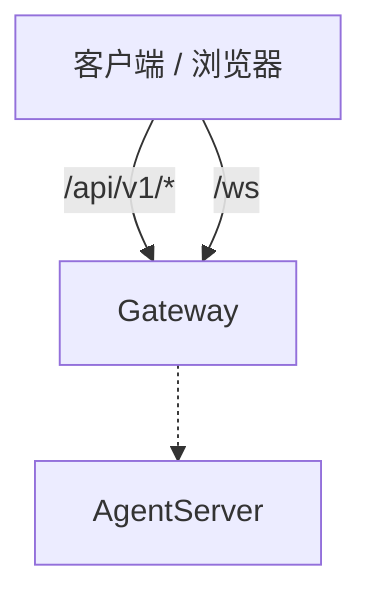

## 0. 概述

> **读者**：企业版（`gateway.edition = enterprise`）接入方——浏览器、BFF 或经 Ingress / 反向代理访问 Gateway 的 HTTP、WebSocket 客户端。  
> **范围**：本文仅 **A1（`/ws`）** 与 **A2（`/api/v1` HTTP）**；TUI、ACP、A2A、SSH、ClawManager 等不在本版展开。

- 部署：`gateway.deployment_mode`（`distributed` / `active-standby` 等）
- **目标架构**：客户端只面对 **Gateway**（`distributed` 下推荐 **A2 HTTP**；**A1 WebSocket** 同语义可选）。Gateway 再连 AgentServer。静态前端由部署侧另行托管，**不属于本文协议范围**。
- 监听端口一览（默认，同一 Gateway 进程 path 分流）


| 协议       | 默认端口  | 路径          | 说明       |
| -------- | ----- | ----------- | -------- |
| Web HTTP | 19000 | `/api/v1/*` | 见 **A2** |
| Web WS   | 19000 | `/ws`       | 见 **A1** |


### 交互拓扑（目标架构）




---

## Part A — Gateway Web 接入（enterprise）

> 对外协议由 **Gateway** 定义：**A2** HTTP 与 **A1** WebSocket 语义一致，字段表以 **A1** 为准。

### A1 Web 协议（`/ws`）


| 项目       | 说明                                                                                  |
| -------- | ----------------------------------------------------------------------------------- |
| 连接地址     | `ws://{host}:19000/ws`                                                              |
| 鉴权       | 握手 `Origin` 须在 `gateway.ws_origin` 白名单                                              |
| 请求       | 见下方示例；表格「入参」即 `params` 里的字段                                                         |
| 响应成功     | 见下方示例；表格「出参」即 `ok=true` 时 `payload` 里的字段                                            |
| 响应失败     | 见下方示例；读 `error`（文字说明）和 `code`（错误码）                                                  |
| 推送       | event 帧，`event` + `payload`；见 **§20**                                               |
| 连接 query | 握手 URL 可选 `?user_id=&group_id=&bot_id=` 等；绑定该连接。单条 `params` 也可带同名身份字段，**params 优先** |
| 范围       | 合并后 `:19000/ws` 全部 `req/res` method（kub + Swarm 并集）                                 |


**范围说明**：本章写 **`/ws`** 上的 method 与 event，以合并目标为准（kub + Swarm 并集，如 `project.*`、`project.git.*`）。走 HTTP 时见 **A2**，字段相同。

**请求示例：**

```json
{ "type": "req", "id": "1", "method": "config.get", "params": {} }
```

**响应成功示例：**

```json
{ "type": "res", "id": "1", "ok": true, "payload": { "model": "..." } }
```

**响应失败示例：**

```json
{ "type": "res", "id": "1", "ok": false, "payload": {}, "error": "params must be object", "code": "BAD_REQUEST" }
```

**`code` 取值（`ok=false` 时）：**


| code                           | 含义                                   |
| ------------------------------ | ------------------------------------ |
| `BAD_REQUEST`                  | 入参不合法、JSON 格式错误、缺少必填字段等              |
| `METHOD_NOT_FOUND`             | `method` 未注册                         |
| `NOT_FOUND`                    | 资源不存在（如会话、模型、定时任务）                   |
| `ALREADY_EXISTS`               | 资源已存在（如重复创建会话）                       |
| `FORBIDDEN`                    | 无权限（如 Cron 租户校验失败）                   |
| `SERVICE_UNAVAILABLE`          | 依赖服务不可用（如 ChannelManager 未就绪）        |
| `INTERNAL_ERROR`               | Gateway 内部异常                         |
| `INTERNAL_CONFIGURATION_ERROR` | 部署配置错误                               |
| `LLM_ERROR`                    | 模型探测/调用失败（如 `config.validate_model`） |


`error` 为可读字符串，随具体接口和场景变化，上表只归纳 `code`。

---

#### 1. 连接与状态

##### 1.1 `connection.status`

查询 AgentServer 是否就绪。

**入参**（`params`）


| key | 必填  | 类型  | 默认值 | 说明  |
| --- | --- | --- | --- | --- |
| —   | —   | —   | —   | 无   |


**出参**（`payload`，`ok=true`）


| key              | 必填  | 类型     | 默认值     | 说明              |
| ---------------- | --- | ------ | ------- | --------------- |
| agent_ready      | 是   | bool   | —       | Agent 已就绪为 true |
| protocol_version | 是   | string | `"1.0"` | 协议版本            |


浏览器连上 `/ws` 且 Agent 就绪后，Gateway 自动推送 event `connection.ack`（见 §20.1）。

---

#### 2. 会话

##### 2.1 `session.list`

分页列出会话。

**入参**（`params`）


| key    | 必填  | 类型  | 默认值 | 说明         |
| ------ | --- | --- | --- | ---------- |
| limit  | 否   | int | 20  | 每页条数，1–200 |
| offset | 否   | int | 0   | 分页偏移       |


**出参**（`payload`，`ok=true`）


| key      | 必填  | 类型    | 默认值 | 说明         |
| -------- | --- | ----- | --- | ---------- |
| sessions | 是   | array | —   | 会话列表，元素见下表 |
| total    | 是   | int   | —   | 会话总数       |
| limit    | 是   | int   | —   | 本次 limit   |
| offset   | 是   | int   | —   | 本次 offset  |


`**sessions` 数组元素**


| key             | 必填  | 类型     | 默认值         | 说明                     |
| --------------- | --- | ------ | ----------- | ---------------------- |
| session_id      | 是   | string | —           | 会话 ID                  |
| channel_id      | 是   | string | `""`        | 创建时 Channel            |
| user_id         | 是   | string | `""`        | 用户 ID                  |
| created_at      | 是   | float  | —           | 创建时间（Unix 秒）           |
| last_message_at | 是   | float  | —           | 最后消息时间                 |
| title           | 是   | string | `""`        | 标题                     |
| message_count   | 是   | int    | 0           | 消息数                    |
| mode            | 是   | string | `"unknown"` | 会话模式                   |
| project_dir     | 否   | string | —           | 绑定项目目录                 |
| project_id      | 否   | string | —           | 归属项目 ID（Swarm）         |
| work_mode       | 否   | string | —           | `work` / `code`（Swarm） |


##### 2.2 `session.create`

创建会话目录并初始化 metadata。

**入参**（`params`）


| key         | 必填  | 类型     | 默认值         | 说明                     |
| ----------- | --- | ------ | ----------- | ---------------------- |
| session_id  | 是   | string | —           | 非空，格式校验                |
| title       | 否   | string | `""`        | 标题                     |
| mode        | 否   | string | `"unknown"` | 模式                     |
| project_dir | 否   | string | —           | 工作目录                   |
| project_id  | 否   | string | —           | 归属项目 ID（Swarm）         |
| work_mode   | 否   | string | —           | `work` / `code`（Swarm） |
| channel_id  | 否   | string | `""`        | Channel                |
| user_id     | 否   | string | `""`        | 用户 ID                  |


**出参**（`payload`，`ok=true`）


| key        | 必填  | 类型     | 默认值 | 说明       |
| ---------- | --- | ------ | --- | -------- |
| session_id | 是   | string | —   | 规范化后的 ID |


##### 2.3 `session.delete`

删除会话目录。

**入参**（`params`）


| key        | 必填  | 类型     | 默认值 | 说明       |
| ---------- | --- | ------ | --- | -------- |
| session_id | 是   | string | —   | 待删除会话 ID |


**出参**（`payload`，`ok=true`）


| key        | 必填  | 类型     | 默认值 | 说明       |
| ---------- | --- | ------ | --- | -------- |
| session_id | 是   | string | —   | 已删除会话 ID |


##### 2.4 `session.get_metadata`

Gateway 本地读会话 metadata（Swarm）。

**入参**（`params`）


| key        | 必填  | 类型     | 说明  |
| ---------- | --- | ------ | --- |
| session_id | 是   | string |     |


**出参**（`payload`，`ok=true`）：metadata object，含 `mode`、`model`、`project_dir`、`project_id`、`last_user_message_at` 等

##### 2.5 `session.rename`

Gateway 本地重命名会话标题（Swarm）。

**入参**（`params`）


| key        | 必填  | 类型     | 说明                           |
| ---------- | --- | ------ | ---------------------------- |
| session_id | 否   | string | 省略则用连接 session               |
| title      | 否   | string | 不传→查询；空串→清除；非空→设置（截断 200 字符） |


**出参**（`payload`，`ok=true`）：`title` 等

##### 2.6 `session.pin`

Gateway 本地置顶/取消置顶（Swarm）。

**入参**（`params`）


| key        | 必填  | 类型     | 说明  |
| ---------- | --- | ------ | --- |
| session_id | 是   | string |     |
| pinned     | 是   | bool   |     |


**出参**（`payload`，`ok=true`）


| key       | 必填  | 类型   | 说明     |
| --------- | --- | ---- | ------ |
| pinned    | 是   | bool |        |
| pin_order | 是   | int  | 重编号后顺序 |


##### 2.7 `session.switch`

转发 AgentServer；切换当前会话上下文（Swarm）。

**入参**（`params`）：见 Agent 契约

**出参**（`payload`，`ok=true`）：Agent 返回

---

#### 3. 对话与历史

Gateway 对下列 method **立即**返回 `res`（`accepted: true`）；Agent 执行结果通过 **§20** 的 event 推送。`req.id` 建议客户端生成，用于过滤同 session 的 event。

##### 3.1 `chat.send`

发送用户消息，启动 Agent 执行。

**入参**（`params`）


| key             | 必填  | 类型     | 默认值   | 说明                                     |
| --------------- | --- | ------ | ----- | -------------------------------------- |
| session_id      | 是   | string | —     | 会话 ID                                  |
| content         | 否   | string | —     | 用户文本；与 `query` 二选一                     |
| query           | 否   | string | —     | 同 content，Agent 侧优先读此字段                |
| mode            | 否   | string | —     | `agent.plan` / `agent.fast` / `team` 等 |
| interactive_ask | 否   | bool   | false | 是否启用结构化问答                              |
| model_name      | 否   | string | —     | 指定模型名                                  |
| files           | 否   | array  | —     | 附件，元素见 **chat 文件对象**                   |
| request_id      | 否   | string | —     | 续答/权限场景关联 ID                           |
| answers         | 否   | array  | —     | 结构化答案（权限续答时）                           |
| source          | 否   | string | —     | 如 `permission_interrupt`               |
| agent_scope_id  | 否   | string | —     | 子 Agent 范围 ID                          |


**chat 文件对象**


| key             | 必填  | 类型     | 说明     |
| --------------- | --- | ------ | ------ |
| url             | 否   | string | 远程 URL |
| name / filename | 否   | string | 文件名    |
| size            | 否   | int    | 字节数    |


**出参**（`payload`，`ok=true`）


| key        | 必填  | 类型     | 说明    |
| ---------- | --- | ------ | ----- |
| accepted   | 是   | bool   | true  |
| session_id | 是   | string | 会话 ID |


**推送 event**：`chat.processing_status`、`chat.delta`、`chat.final`、`chat.tool_call`、`chat.tool_result`、`chat.ask_user_question`、`chat.error` 等（见 §20.3）

##### 3.2 `chat.interrupt`

暂停、取消、补充输入或恢复任务。Web 端恢复任务通常用 `intent: "resume"`，也可调 **3.5** `chat.resume`。

**入参**（`params`）


| key        | 必填  | 类型     | 默认值        | 说明                                           |
| ---------- | --- | ------ | ---------- | -------------------------------------------- |
| session_id | 是   | string | —          |                                              |
| intent     | 否   | string | `"cancel"` | `pause` / `cancel` / `supplement` / `resume` |
| new_input  | 否   | string | —          | `intent=supplement` 时的新输入                    |
| files      | 否   | array  | —          | supplement 附件                                |


**出参**（`payload`，`ok=true`）


| key        | 必填  | 类型     | 说明   |
| ---------- | --- | ------ | ---- |
| accepted   | 是   | bool   | true |
| session_id | 是   | string |      |
| intent     | 否   | string | 回显   |


**推送 event**：`chat.interrupt_result`

##### 3.3 `chat.user_answer`

提交 `chat.ask_user_question` 的用户答案。

**入参**（`params`）


| key            | 必填  | 类型     | 说明              |
| -------------- | --- | ------ | --------------- |
| session_id     | 是   | string |                 |
| request_id     | 是   | string | 对应问答 event 的 ID |
| answers        | 是   | array  | 见 **answer 对象** |
| source         | 否   | string | 如 `ask_tool`    |
| agent_scope_id | 否   | string |                 |


**answer 对象**


| key              | 必填  | 类型     | 说明           |
| ---------------- | --- | ------ | ------------ |
| selected_options | 否   | array  | 选项 string 列表 |
| custom_input     | 否   | string | 自定义输入        |
| action           | 否   | string | 动作           |


**出参**（`payload`，`ok=true`）


| key        | 必填  | 类型     | 说明   |
| ---------- | --- | ------ | ---- |
| accepted   | 是   | bool   | true |
| session_id | 是   | string |      |
| request_id | 否   | string |      |


##### 3.4 `history.get`

按页拉取会话历史；结果通过 event `history.message` 推送。

**入参**（`params`）


| key        | 必填  | 类型     | 默认值 | 说明     |
| ---------- | --- | ------ | --- | ------ |
| session_id | 是   | string | —   |        |
| page_idx   | 是   | int    | —   | 从 1 开始 |


**出参**（`payload`，`ok=true`）


| key        | 必填  | 类型     | 说明   |
| ---------- | --- | ------ | ---- |
| accepted   | 是   | bool   | true |
| session_id | 是   | string |      |
| page_idx   | 否   | int    | 回显   |


**推送 event**：`history.message`（见 §20.4）

##### 3.5 `chat.resume`

恢复已暂停任务。Web 前端常用 **3.2** `chat.interrupt` + `intent: "resume"` 代替。

**入参**（`params`）


| key        | 必填  | 类型     | 说明  |
| ---------- | --- | ------ | --- |
| session_id | 是   | string |     |


**出参**（`payload`，`ok=true`）


| key        | 必填  | 类型     | 说明   |
| ---------- | --- | ------ | ---- |
| accepted   | 是   | bool   | true |
| session_id | 是   | string |      |


#### 4. 配置与模型

##### 4.1 `config.get`

读取可编辑配置。

**入参**（`params`）


| key | 必填  | 类型  | 默认值 | 说明  |
| --- | --- | --- | --- | --- |
| —   | —   | —   | —   | 无   |


**出参**（`payload`，`ok=true`）


| key                               | 必填  | 类型     | 默认值                    | 说明                                     |
| --------------------------------- | --- | ------ | ---------------------- | -------------------------------------- |
| app_version                       | 是   | string | —                      | 应用版本                                   |
| model_provider                    | 是   | string | `""`                   | 主模型                                    |
| model                             | 是   | string | `""`                   | 主模型                                    |
| api_base                          | 是   | string | `""`                   | 主模型                                    |
| api_key                           | 是   | string | `""`                   | 主模型                                    |
| video_provider                    | 是   | string | `""`                   | 视频模型                                   |
| video_model                       | 是   | string | `""`                   | 视频模型                                   |
| video_api_base                    | 是   | string | `""`                   | 视频模型                                   |
| video_api_key                     | 是   | string | `""`                   | 视频模型                                   |
| audio_provider                    | 是   | string | `""`                   | 音频模型                                   |
| audio_model                       | 是   | string | `""`                   | 音频模型                                   |
| audio_api_base                    | 是   | string | `""`                   | 音频模型                                   |
| audio_api_key                     | 是   | string | `""`                   | 音频模型                                   |
| vision_provider                   | 是   | string | `""`                   | 视觉模型                                   |
| vision_model                      | 是   | string | `""`                   | 视觉模型                                   |
| vision_api_base                   | 是   | string | `""`                   | 视觉模型                                   |
| vision_api_key                    | 是   | string | `""`                   | 视觉模型                                   |
| email_address                     | 是   | string | `""`                   | 邮箱                                     |
| email_token                       | 是   | string | `""`                   | 邮箱                                     |
| embed_api_key                     | 是   | string | `""`                   | Embedding                              |
| embed_api_base                    | 是   | string | `""`                   | Embedding                              |
| embed_model                       | 是   | string | `""`                   | Embedding                              |
| jina_api_key                      | 是   | string | `""`                   | 搜索/检索                                  |
| bocha_api_key                     | 是   | string | `""`                   | 搜索/检索                                  |
| serper_api_key                    | 是   | string | `""`                   | 搜索/检索                                  |
| perplexity_api_key                | 是   | string | `""`                   | 搜索/检索                                  |
| github_token                      | 是   | string | `""`                   | GitHub                                 |
| evolution_auto_scan               | 是   | string | `""`                   | 技能进化自动扫描，`"true"` / `"false"`          |
| free_search_ddg_enabled           | 是   | string | `"true"`               | DuckDuckGo 免费搜索开关                      |
| free_search_bing_enabled          | 是   | string | `"true"`               | Bing 免费搜索开关                            |
| free_search_proxy_url             | 是   | string | `""`                   | 免费搜索 HTTP 代理地址                         |
| tool_result_display_max_chars     | 是   | string | `"500"`                | 工具结果截断长度                               |
| deepsearch_llm_model_name         | 是   | string | `""`                   | DeepSearch LLM                         |
| deepsearch_llm_model_type         | 是   | string | `""`                   | DeepSearch LLM                         |
| deepsearch_llm_base_url           | 是   | string | `""`                   | DeepSearch LLM                         |
| deepsearch_llm_api_key            | 是   | string | `""`                   | DeepSearch LLM                         |
| deepsearch_web_search_engine_name | 是   | string | `"tavily"`             | DeepSearch 搜索                          |
| deepsearch_web_search_api_key     | 是   | string | `""`                   | DeepSearch 搜索                          |
| deepsearch_web_search_url         | 是   | string | `""`                   | DeepSearch 搜索                          |
| deepsearch_execution_method       | 是   | string | `"dependency_driving"` | DeepSearch 编排方式，如 `dependency_driving` |
| context_engine_enabled            | 是   | string | `"false"`              | 上下文引擎开关                                |
| kv_cache_affinity_enabled         | 是   | string | `"false"`              | KV 缓存释放（算力亲和）开关                        |
| permissions_enabled               | 是   | string | `"false"`              | `"true"` / `"false"`                   |
| memory_forbidden_enabled          | 是   | string | `"false"`              | `"true"` / `"false"`                   |
| memory_forbidden_description      | 是   | string | `""`                   | 当前语言文案                                 |
| disabled_tools                    | 是   | array  | `[]`                   | 元素 string                              |
| gateway_web_session_storage       | 是   | string | `"local"`              | `local` / `remote`                     |


##### 4.2 `config.set`

增量更新配置；只传需要改的字段。

**入参**（`params`）


| key                               | 必填  | 类型             | 默认值 | 说明                   |
| --------------------------------- | --- | -------------- | --- | -------------------- |
| model_provider                    | 否   | string         | —   | 主模型                  |
| model                             | 否   | string         | —   | 主模型                  |
| api_base                          | 否   | string         | —   | 主模型                  |
| api_key                           | 否   | string         | —   | 主模型                  |
| video_provider                    | 否   | string         | —   | 视频模型                 |
| video_model                       | 否   | string         | —   | 视频模型                 |
| video_api_base                    | 否   | string         | —   | 视频模型                 |
| video_api_key                     | 否   | string         | —   | 视频模型                 |
| audio_provider                    | 否   | string         | —   | 音频模型                 |
| audio_model                       | 否   | string         | —   | 音频模型                 |
| audio_api_base                    | 否   | string         | —   | 音频模型                 |
| audio_api_key                     | 否   | string         | —   | 音频模型                 |
| vision_provider                   | 否   | string         | —   | 视觉模型                 |
| vision_model                      | 否   | string         | —   | 视觉模型                 |
| vision_api_base                   | 否   | string         | —   | 视觉模型                 |
| vision_api_key                    | 否   | string         | —   | 视觉模型                 |
| email_address                     | 否   | string         | —   | 邮箱                   |
| email_token                       | 否   | string         | —   | 邮箱                   |
| embed_api_key                     | 否   | string         | —   | Embedding            |
| embed_api_base                    | 否   | string         | —   | Embedding            |
| embed_model                       | 否   | string         | —   | Embedding            |
| jina_api_key                      | 否   | string         | —   | 搜索/检索                |
| bocha_api_key                     | 否   | string         | —   | 搜索/检索                |
| serper_api_key                    | 否   | string         | —   | 搜索/检索                |
| perplexity_api_key                | 否   | string         | —   | 搜索/检索                |
| github_token                      | 否   | string         | —   | GitHub               |
| evolution_auto_scan               | 否   | string         | —   | 技能进化                 |
| free_search_ddg_enabled           | 否   | string         | —   | 免费搜索                 |
| free_search_bing_enabled          | 否   | string         | —   | 免费搜索                 |
| free_search_proxy_url             | 否   | string         | —   | 免费搜索                 |
| tool_result_display_max_chars     | 否   | string         | —   | 0–100000 的整数         |
| deepsearch_llm_model_name         | 否   | string         | —   | DeepSearch LLM       |
| deepsearch_llm_model_type         | 否   | string         | —   | DeepSearch LLM       |
| deepsearch_llm_base_url           | 否   | string         | —   | DeepSearch LLM       |
| deepsearch_llm_api_key            | 否   | string         | —   | DeepSearch LLM       |
| deepsearch_web_search_engine_name | 否   | string         | —   | DeepSearch 搜索        |
| deepsearch_web_search_api_key     | 否   | string         | —   | DeepSearch 搜索        |
| deepsearch_web_search_url         | 否   | string         | —   | DeepSearch 搜索        |
| deepsearch_execution_method       | 否   | string         | —   | DeepSearch 执行方式      |
| context_engine_enabled            | 否   | string / bool  | —   | `"true"` / `"false"` |
| kv_cache_affinity_enabled         | 否   | string / bool  | —   | `"true"` / `"false"` |
| permissions_enabled               | 否   | string / bool  | —   | `"true"` / `"false"` |
| memory_forbidden_enabled          | 否   | string / bool  | —   | `"true"` / `"false"` |
| memory_forbidden_description      | 否   | string         | —   | 当前语言文案               |
| disabled_tools                    | 否   | array / string | —   | 数组或 JSON 字符串         |
| extension_configs                 | 否   | string         | —   | 扩展插件配置（JSON 字符串）     |
| extension_security_configs        | 否   | string         | —   | 扩展插件安全配置（JSON 字符串）   |


**出参**（`payload`，`ok=true`）


| key                     | 必填  | 类型    | 默认值  | 说明                 |
| ----------------------- | --- | ----- | ---- | ------------------ |
| updated                 | 是   | array | —    | 已更新键名，元素 string    |
| applied_without_restart | 是   | bool  | true | 配置已生效，无需重启 Gateway |


##### 4.3 `config.validate_model`

探测模型 API 连通性。

**入参**（`params`）


| key            | 必填  | 类型     | 默认值   | 说明                             |
| -------------- | --- | ------ | ----- | ------------------------------ |
| api_base       | 是   | string | —     | 可含 `/chat/completions`         |
| api_key        | 是   | string | —     | 模型 API Key                     |
| model          | 是   | string | —     | 模型名称                           |
| model_provider | 是   | string | —     | ProviderType 枚举                |
| verify_ssl     | 否   | bool   | false | 是否校验 HTTPS 证书；内网/自签名可设 `false` |


**出参**（`payload`，`ok=true`）


| key            | 必填  | 类型     | 默认值  | 说明            |
| -------------- | --- | ------ | ---- | ------------- |
| ok             | 是   | bool   | true | 探测成功          |
| model_provider | 是   | string | —    | 回显所用 Provider |


##### 4.4 `models.list`

列出生效模型（企业策略优先）。

**入参**（`params`）


| key        | 必填  | 类型     | 默认值 | 说明                          |
| ---------- | --- | ------ | --- | --------------------------- |
| group_id   | 否   | string | —   | 企业路由，可来自连接 query            |
| bot_id     | 否   | string | —   | 企业租户：机器人 ID                 |
| user_id    | 否   | string | —   | 企业租户：用户 ID                  |
| service_id | 否   | string | —   | 企业租户：服务 ID（可已是 32 位 hex）    |
| agent_id   | 否   | string | —   | 企业租户：Agent ID（可已是 32 位 hex） |


**出参**（`payload`，`ok=true`）


| key          | 必填  | 类型     | 默认值 | 说明                                                                         |
| ------------ | --- | ------ | --- | -------------------------------------------------------------------------- |
| models       | 是   | array  | —   | 元素见下表                                                                      |
| active_model | 是   | string | —   | 列表首项名称                                                                     |
| model_source | 是   | string | —   | 本次 `models` 的数据来源：`enterprise_policy` 为企业策略下发，`config.yaml` 为 Gateway 本地配置 |


`**models` 数组元素**


| key            | 必填  | 类型     | 默认值  | 说明               |
| -------------- | --- | ------ | ---- | ---------------- |
| model_name     | 是   | string | —    | 展示名              |
| api_base       | 是   | string | —    | 模型 API 地址        |
| api_key        | 是   | string | —    | 可能为加密态           |
| model_provider | 是   | string | —    | ProviderType 枚举值 |
| temperature    | 是   | float  | 0.95 | 采样温度，越大输出越随机     |
| template_id    | 是   | string | `""` | 企业模板 ID          |


##### 4.5 `models.save`

新增或更新模型配置。

**入参**（`params`）


| key                 | 必填  | 类型     | 默认值   | 说明               |
| ------------------- | --- | ------ | ----- | ---------------- |
| model_name          | 是   | string | —     | 模型展示名            |
| original_model_name | 否   | string | —     | 重命名时填旧名          |
| api_base            | 否   | string | `""`  | 模型 API 地址        |
| api_key             | 否   | string | `""`  | 写入时加密            |
| model_provider      | 否   | string | `""`  | ProviderType 枚举值 |
| temperature         | 否   | float  | 0.95  | 采样温度             |
| timeout             | 否   | int    | 1800  | 请求超时（秒）          |
| verify_ssl          | 否   | bool   | false | 是否校验 HTTPS 证书    |


**出参**（`payload`，`ok=true`）


| key        | 必填  | 类型     | 默认值 | 说明                                |
| ---------- | --- | ------ | --- | --------------------------------- |
| model_name | 是   | string | —   |                                   |
| action     | 是   | string | —   | `created` / `updated` / `renamed` |


##### 4.6 `models.remove`

删除模型（至少保留一个）。

**入参**（`params`）


| key        | 必填  | 类型     | 默认值 | 说明      |
| ---------- | --- | ------ | --- | ------- |
| model_name | 是   | string | —   | 待删除的模型名 |


**出参**（`payload`，`ok=true`）


| key        | 必填  | 类型     | 默认值 | 说明      |
| ---------- | --- | ------ | --- | ------- |
| model_name | 是   | string | —   | 已删除的模型名 |


##### 4.7 `models.validate`

同 **4.3 `config.validate_model`**。

##### 4.8 `models.set_active`

将模型移到列表首位作为默认。

**入参**（`params`）


| key        | 必填  | 类型     | 默认值 | 说明       |
| ---------- | --- | ------ | --- | -------- |
| model_name | 是   | string | —   | 设为默认的模型名 |


**出参**（`payload`，`ok=true`）


| key        | 必填  | 类型     | 默认值 | 说明      |
| ---------- | --- | ------ | --- | ------- |
| model_name | 是   | string | —   | 当前默认模型名 |


##### 4.9 `locale.get_conf`

读取界面与文案使用的首选语言。

**入参**（`params`）


| key | 必填  | 类型  | 默认值 | 说明  |
| --- | --- | --- | --- | --- |
| —   | —   | —   | —   | 无   |


**出参**（`payload`，`ok=true`）


| key                | 必填  | 类型     | 默认值    | 说明          |
| ------------------ | --- | ------ | ------ | ----------- |
| preferred_language | 是   | string | `"zh"` | `zh` 或 `en` |


##### 4.10 `locale.set_conf`

设置首选语言并写回配置。

**入参**（`params`）


| key                | 必填  | 类型     | 默认值 | 说明            |
| ------------------ | --- | ------ | --- | ------------- |
| preferred_language | 是   | string | —   | 仅 `zh` / `en` |


**出参**（`payload`，`ok=true`）


| key                | 必填  | 类型     | 默认值 | 说明          |
| ------------------ | --- | ------ | --- | ----------- |
| preferred_language | 是   | string | —   | `zh` 或 `en` |


##### 4.11 `path.get`

读取浏览器自动化使用的 Chrome/Chromium 可执行文件路径。

**入参**（`params`）


| key | 必填  | 类型  | 默认值 | 说明  |
| --- | --- | --- | --- | --- |
| —   | —   | —   | —   | 无   |


**出参**（`payload`，`ok=true`）


| key         | 必填  | 类型     | 默认值  | 说明                                 |
| ----------- | --- | ------ | ---- | ---------------------------------- |
| chrome_path | 是   | string | `""` | Chrome/Chromium 可执行文件绝对路径；未配置为空字符串 |


##### 4.12 `path.set`

设置 Chrome/Chromium 可执行文件路径并写回配置。

**入参**（`params`）


| key         | 必填  | 类型     | 默认值 | 说明                                                                  |
| ----------- | --- | ------ | --- | ------------------------------------------------------------------- |
| chrome_path | 是   | string | —   | 可执行文件绝对路径，如 `C:\Program Files\Google\Chrome\Application\chrome.exe` |


**出参**（`payload`，`ok=true`）


| key         | 必填  | 类型     | 默认值 | 说明     |
| ----------- | --- | ------ | --- | ------ |
| chrome_path | 是   | string | —   | 写回后的路径 |


##### 4.13 `memory.compute`

查询 Gateway 进程与系统内存占用。

**入参**（`params`）


| key | 必填  | 类型  | 默认值 | 说明  |
| --- | --- | --- | --- | --- |
| —   | —   | —   | —   | 无   |


**出参**（`payload`，`ok=true`）


| key          | 必填  | 类型    | 默认值 | 说明         |
| ------------ | --- | ----- | --- | ---------- |
| rss_mb       | 是   | float | —   | 进程 RSS（MB） |
| total_mb     | 是   | float | —   | 系统总内存      |
| available_mb | 是   | float | —   | 可用内存       |


---

#### 5. Channel（IM 通道）

##### 5.1 `channel.get`

列出当前 Gateway 已启用的 IM 通道。

**入参**（`params`）


| key | 必填  | 类型  | 默认值 | 说明  |
| --- | --- | --- | --- | --- |
| —   | —   | —   | —   | 无   |


**出参**（`payload`，`ok=true`）


| key      | 必填  | 类型    | 默认值 | 说明    |
| -------- | --- | ----- | --- | ----- |
| channels | 是   | array | —   | 元素见下表 |


`**channels` 数组元素**


| key        | 必填  | 类型     | 默认值 | 说明               |
| ---------- | --- | ------ | --- | ---------------- |
| channel_id | 是   | string | —   | 如 `feishu`、`web` |


##### 5.2 `channel.{id}.get_conf`

读取 IM 通道配置。`{id}` 为 `feishu` / `xiaoyi` / `telegram` / `dingtalk` / `whatsapp` / `discord` / `wecom` / `wechat`。各通道 `config` 字段见 **5.2.1–5.2.8**。

**入参**（`params`）


| key | 必填  | 类型  | 默认值 | 说明  |
| --- | --- | --- | --- | --- |
| —   | —   | —   | —   | 无   |


**出参**（`payload`，`ok=true`）


| key    | 必填  | 类型     | 默认值 | 说明                                                |
| ------ | --- | ------ | --- | ------------------------------------------------- |
| config | 是   | object | —   | 结构见 **5.2.1–5.2.8**；`set_conf` 时整对象作为 `params` 传入 |


`get_conf` 与 `set_conf` 读写同一份 `config`。`set_conf` 为**整段替换**（不是增量 patch）；飞书单 Bot / 多 Bot 二选一，不可混在同一 `config` 里。

##### 5.2.1 `feishu` — `channel.feishu.get_conf` / `set_conf`

**单 Bot**（顶层直接写字段；`app_id`、`app_secret` 非空且 `enabled=true` 时启用）：


| key                     | 必填    | 类型     | 默认值   | 说明                             |
| ----------------------- | ----- | ------ | ----- | ------------------------------ |
| enabled                 | 否     | bool   | false | 是否启用                           |
| app_id                  | 启用时必填 | string | `""`  | 飞书应用 App ID                    |
| app_secret              | 启用时必填 | string | `""`  | 飞书应用 App Secret                |
| encrypt_key             | 否     | string | `""`  | 事件订阅 Encrypt Key               |
| verification_token      | 否     | string | `""`  | 事件订阅 Verification Token        |
| allow_from              | 否     | array  | `[]`  | 用户 open_id 白名单；空数组表示不限制        |
| enable_streaming        | 否     | bool   | true  | 是否流式下发过程消息                     |
| chat_id                 | 否     | string | `""`  | 固定推送目标（群 `oc_xxx` 或个人 open_id） |
| send_file_allowed       | 否     | bool   | true  | 是否允许发文件                        |
| group_digital_avatar    | 否     | bool   | false | 群聊数字分身                         |
| my_user_id              | 否     | string | `""`  | 数字分身对应用户 open_id               |
| bot_name                | 否     | string | `""`  | 群内 @ 识别用机器人名称                  |
| enable_memory           | 否     | bool   | false | 群聊记忆                           |
| message_merge_window_ms | 否     | int    | 15000 | 连续消息合并窗口（毫秒）                   |
| last_chat_id            | 否     | string | `""`  | 运行时回写，最近会话 chat_id             |
| last_open_id            | 否     | string | `""`  | 运行时回写，最近用户 open_id             |


**多 Bot**（顶层**不能**再写 `app_id` / `app_secret`；用自定义键名挂多个 Bot，如 `bot_a`、`feishu_1`。运行时注册为 `feishu:<app_id>`，`channel.get` 可见多个 id，但 Web 配置接口仍读写整段 `channels.feishu`）：


| key          | 必填  | 类型     | 说明                        |
| ------------ | --- | ------ | ------------------------- |
| （自定义 bot 键名） | 是   | object | 键名自定；值为 **feishu Bot 对象** |


`**feishu Bot` 对象**（多 Bot 模式下每个子 Bot）：


| key                  | 必填    | 类型     | 默认值   | 说明          |
| -------------------- | ----- | ------ | ----- | ----------- |
| enabled              | 否     | bool   | false | 该 Bot 是否启用  |
| app_id               | 启用时必填 | string | —     | App ID      |
| app_secret           | 启用时必填 | string | —     | App Secret  |
| encrypt_key          | 否     | string | `""`  |             |
| verification_token   | 否     | string | `""`  |             |
| allow_from           | 否     | array  | `[]`  | open_id 白名单 |
| enable_streaming     | 否     | bool   | true  |             |
| chat_id              | 否     | string | `""`  |             |
| group_digital_avatar | 否     | bool   | false |             |
| my_user_id           | 否     | string | `""`  |             |
| bot_name             | 否     | string | `""`  |             |
| enable_memory        | 否     | bool   | false |             |
| last_chat_id         | 否     | string | `""`  | 运行时回写       |
| last_open_id         | 否     | string | `""`  | 运行时回写       |


##### 5.2.2 `xiaoyi` — `channel.xiaoyi.get_conf` / `set_conf`

由 `mode` 区分两种接入（二选一）：

`**mode = xiaoyi_channel`（默认）** — 启用需 `ak`、`sk`、`agent_id` 非空且 `enabled=true`：


| key                 | 必填    | 类型     | 默认值                | 说明                   |
| ------------------- | ----- | ------ | ------------------ | -------------------- |
| enabled             | 否     | bool   | false              | 是否启用                 |
| mode                | 否     | string | `"xiaoyi_channel"` | 固定为 `xiaoyi_channel` |
| ak                  | 启用时必填 | string | `""`               | 访问密钥 AK              |
| sk                  | 启用时必填 | string | `""`               | 访问密钥 SK              |
| agent_id            | 启用时必填 | string | `""`               | 小艺 Agent ID          |
| api_id              | 否     | string | `""`               | API ID               |
| push_id             | 否     | string | `""`               | Push ID              |
| ws_url1             | 否     | string | （见 yaml 默认）        | WebSocket 地址 1       |
| ws_url2             | 否     | string | （见 yaml 默认）        | WebSocket 地址 2       |
| enable_streaming    | 否     | bool   | true               | 流式过程消息               |
| phone_tools_enabled | 否     | bool   | false              | 是否注入手机端插件 tools      |
| send_file_allowed   | 否     | bool   | true               | 是否允许发文件              |


`**mode = xiaoyi_claw**` — 启用需 `agent_id` 等非空且 `enabled=true`：


| key                 | 必填  | 类型     | 默认值   | 说明                |
| ------------------- | --- | ------ | ----- | ----------------- |
| enabled             | 否   | bool   | false | 是否启用              |
| mode                | 是   | string | —     | 必须为 `xiaoyi_claw` |
| uid                 | 否   | string | `""`  | 用户 UID            |
| api_key             | 否   | string | `""`  | API Key           |
| api_id              | 否   | string | `""`  |                   |
| push_id             | 否   | string | `""`  |                   |
| push_url            | 否   | string | `""`  | 推送 URL            |
| file_upload_url     | 否   | string | `""`  | 文件上传 URL          |
| agent_id            | 否   | string | `""`  | Agent ID          |
| ws_url1             | 否   | string | —     | WebSocket 地址 1    |
| ws_url2             | 否   | string | —     | WebSocket 地址 2    |
| enable_streaming    | 否   | bool   | true  |                   |
| phone_tools_enabled | 否   | bool   | false |                   |
| send_file_allowed   | 否   | bool   | true  |                   |


##### 5.2.3 `dingtalk` — `channel.dingtalk.get_conf` / `set_conf`

启用需 `client_id`、`client_secret` 非空且 `enabled=true`：


| key               | 必填    | 类型     | 默认值   | 说明                 |
| ----------------- | ----- | ------ | ----- | ------------------ |
| enabled           | 否     | bool   | false | 是否启用               |
| client_id         | 启用时必填 | string | `""`  | 钉钉应用 Client ID     |
| client_secret     | 启用时必填 | string | `""`  | 钉钉应用 Client Secret |
| allow_from        | 否     | array  | `[]`  | 员工 ID 白名单；空表示不限制   |
| send_file_allowed | 否     | bool   | true  | 是否允许发文件            |


##### 5.2.4 `telegram` — `channel.telegram.get_conf` / `set_conf`

启用需 `bot_token` 非空且 `enabled=true`：


| key             | 必填    | 类型     | 默认值          | 说明                                       |
| --------------- | ----- | ------ | ------------ | ---------------------------------------- |
| enabled         | 否     | bool   | false        | 是否启用                                     |
| bot_token       | 启用时必填 | string | `""`         | @BotFather 颁发的 Bot Token                 |
| allow_from      | 否     | array  | `[]`         | Telegram user_id 白名单；空表示不限制              |
| parse_mode      | 否     | string | `"Markdown"` | 出站消息解析：`Markdown` / `HTML` / `None`      |
| group_chat_mode | 否     | string | `"mention"`  | 群聊响应：`mention` / `reply` / `all` / `off` |


##### 5.2.5 `discord` — `channel.discord.get_conf` / `set_conf`

启用需 `bot_token` 非空且 `enabled=true`：


| key            | 必填    | 类型     | 默认值   | 说明                  |
| -------------- | ----- | ------ | ----- | ------------------- |
| enabled        | 否     | bool   | false | 是否启用                |
| bot_token      | 启用时必填 | string | `""`  | Discord Bot Token   |
| application_id | 否     | string | `""`  | 应用 ID               |
| guild_id       | 否     | string | `""`  | 服务器（Guild）ID        |
| channel_id     | 否     | string | `""`  | 频道 ID               |
| allow_from     | 否     | array  | `[]`  | Discord user_id 白名单 |
| block_dm       | 否     | bool   | false | 为 true 时关闭私信        |


##### 5.2.6 `whatsapp` — `channel.whatsapp.get_conf` / `set_conf`

通过本地 Baileys bridge WebSocket 接入；启用需 `enabled=true`：


| key               | 必填  | 类型     | 默认值                                 | 说明                         |
| ----------------- | --- | ------ | ----------------------------------- | -------------------------- |
| enabled           | 否   | bool   | false                               | 是否启用                       |
| bridge_ws_url     | 否   | string | `"ws://127.0.0.1:19600/ws"`         | Bridge WebSocket 地址        |
| default_jid       | 否   | string | `""`                                | 默认对话 JID                   |
| allow_from        | 否   | array  | `[]`                                | 发送方 JID 白名单                |
| enable_streaming  | 否   | bool   | true                                | 流式过程消息                     |
| auto_start_bridge | 否   | bool   | false                               | 是否由 Gateway 自动拉起 bridge 进程 |
| bridge_command    | 否   | string | `"node scripts/whatsapp-bridge.js"` | 启动 bridge 的命令              |
| bridge_workdir    | 否   | string | `""`                                | bridge 工作目录                |


##### 5.2.7 `wecom` — `channel.wecom.get_conf` / `set_conf`

企业微信 AI 机器人；**仅单 Bot**。启用需 `bot_id`、`secret` 非空且 `enabled=true`：


| key                   | 必填    | 类型     | 默认值                                 | 说明            |
| --------------------- | ----- | ------ | ----------------------------------- | ------------- |
| enabled               | 否     | bool   | false                               | 是否启用          |
| bot_id                | 启用时必填 | string | `""`                                | 企业微信后台 Bot ID |
| secret                | 启用时必填 | string | `""`                                | Bot Secret    |
| ws_url                | 否     | string | `"wss://openws.work.weixin.qq.com"` | WebSocket 地址  |
| allow_from            | 否     | array  | `[]`                                | 用户 ID 白名单     |
| enable_streaming      | 否     | bool   | true                                | 流式过程消息        |
| send_thinking_message | 否     | bool   | false                               | 是否发送「思考中」类提示  |
| send_file_allowed     | 否     | bool   | true                                | 是否允许发文件       |
| group_digital_avatar  | 否     | bool   | false                               | 群聊数字分身        |
| my_user_id            | 否     | string | `""`                                | 数字分身用户 ID     |
| bot_name              | 否     | string | `""`                                | 群内机器人名称       |
| enable_memory         | 否     | bool   | false                               | 群聊记忆          |


##### 5.2.8 `wechat` — `channel.wechat.get_conf` / `set_conf`

个人微信 iLink Bot API；**仅单 Bot**。扫码登录见 **5.4** `channel.wechat.get_login_ui`。


| key                      | 必填  | 类型     | 默认值                                  | 说明            |
| ------------------------ | --- | ------ | ------------------------------------ | ------------- |
| enabled                  | 否   | bool   | false                                | 是否启用          |
| base_url                 | 否   | string | `"https://ilinkai.weixin.qq.com"`    | iLink API 基址  |
| bot_token                | 否   | string | `""`                                 | Bot Token     |
| ilink_bot_id             | 否   | string | `""`                                 | iLink Bot ID  |
| ilink_user_id            | 否   | string | `""`                                 | iLink User ID |
| allow_from               | 否   | array  | `[]`                                 | 发送方白名单        |
| auto_login               | 否   | bool   | true                                 | 是否自动触发扫码登录    |
| enable_streaming         | 否   | bool   | false                                | 流式过程消息        |
| qrcode_poll_interval_sec | 否   | float  | 2.0                                  | 二维码轮询间隔（秒）    |
| long_poll_timeout_sec    | 否   | int    | 45                                   | 长轮询超时（秒）      |
| backoff_base_sec         | 否   | float  | 1.0                                  | 重连退避基数（秒）     |
| backoff_max_sec          | 否   | float  | 30.0                                 | 重连退避上限（秒）     |
| credential_file          | 否   | string | `"~/.wx-ai-bridge/credentials.json"` | 本地凭据文件路径      |


##### 5.3 `channel.{id}.set_conf`

更新指定 IM 通道配置并重新加载该通道。`params` **即 5.2.x 中对应 `{id}` 的整段 `config` 对象**（整对象替换，勿与单 Bot / 多 Bot 字段混写）。

**入参**（`params`）


| key         | 必填  | 类型     | 默认值 | 说明                                  |
| ----------- | --- | ------ | --- | ----------------------------------- |
| （整段 config） | 是   | object | —   | 结构见 **5.2.1–5.2.8** 中与 `{id}` 对应的小节 |


**出参**（`payload`，`ok=true`）


| key    | 必填  | 类型     | 默认值 | 说明       |
| ------ | --- | ------ | --- | -------- |
| config | 是   | object | —   | 写回后的配置快照 |


##### 5.4 `channel.wechat.get_login_ui`

获取微信通道扫码登录状态与二维码。

**入参**（`params`）


| key | 必填  | 类型  | 默认值 | 说明  |
| --- | --- | --- | --- | --- |
| —   | —   | —   | —   | 无   |


**出参**（`payload`，`ok=true`）


| key                | 必填  | 类型     | 默认值  | 说明                              |
| ------------------ | --- | ------ | ---- | ------------------------------- |
| phase              | 是   | string | —    | 如 `idle`                        |
| message            | 是   | string | —    | 当前登录阶段提示文案                      |
| qr                 | 否   | object | null | 见 **qr 对象**                     |
| credentials        | 否   | object | null | 已登录时的凭证信息                       |
| credentials_source | 否   | string | null | `scan` 扫码登录 / `local_file` 本地文件 |
| error              | 否   | string | null | 登录失败原因                          |
| updated_at         | 是   | int    | —    | Unix 秒                          |


`**qr` 对象**


| key   | 必填  | 类型     | 默认值 | 说明                                     |
| ----- | --- | ------ | --- | -------------------------------------- |
| kind  | 是   | string | —   | `url` / `data_url` / `encode` / `text` |
| value | 是   | string | —   | 二维码链接或编码内容                             |


##### 5.5 `channel.wechat.unbind`

解除微信账号绑定并清空登录凭证。

**入参**（`params`）


| key | 必填  | 类型  | 默认值 | 说明  |
| --- | --- | --- | --- | --- |
| —   | —   | —   | —   | 无   |


**出参**（`payload`，`ok=true`）


| key    | 必填  | 类型     | 默认值 | 说明             |
| ------ | --- | ------ | --- | -------------- |
| config | 是   | object | —   | 解绑后的 wechat 配置 |


---

#### 6. 数字分身权限

##### 6.1 `permissions.owner_scopes.get`

读取数字分身 owner 权限范围配置。

**入参**（`params`）


| key | 必填  | 类型  | 默认值 | 说明  |
| --- | --- | --- | --- | --- |
| —   | —   | —   | —   | 无   |


**出参**（`payload`，`ok=true`）


| key                   | 必填  | 类型     | 默认值  | 说明                        |
| --------------------- | --- | ------ | ---- | ------------------------- |
| owner_scopes          | 是   | object | `{}` | 结构见下方 **owner_scopes 对象** |
| deny_guidance_message | 是   | string | `""` | 权限拒绝时的提示文案                |


**owner_scopes 对象**

键为 channel_id（如 `feishu`、`wecom`），值为 **owner scope 用户表**。


| key          | 必填  | 类型     | 说明                     |
| ------------ | --- | ------ | ---------------------- |
| （channel_id） | 否   | object | 值为 **owner scope 用户表** |


**owner scope 用户表**

键为 user_id（如 `ou_xxx`），值为 **owner scope 配置**。


| key       | 必填  | 类型     | 说明                    |
| --------- | --- | ------ | --------------------- |
| （user_id） | 否   | object | 值为 **owner scope 配置** |


**owner scope 配置**


| key                | 必填  | 类型              | 默认值 | 说明     |
| ------------------ | --- | --------------- | --- | ------ |
| defaults           | 否   | object          | —   |        |
| tools              | 否   | object          | —   | 键为工具名  |
| external_directory | 否   | object / string | —   | 对象时见下表 |


**defaults 对象**


| key | 必填  | 类型     | 默认值      | 说明                       |
| --- | --- | ------ | -------- | ------------------------ |
| `*` | 否   | string | `"deny"` | `allow` / `deny` / `ask` |


**tools 对象**

键为工具名（如 `mcp_exec_command`、`skill`）。值为 `allow` / `deny` / `ask`，或 **tool 条目对象**。

**tool 条目对象**


| key      | 必填  | 类型     | 说明                                       |
| -------- | --- | ------ | ---------------------------------------- |
| `*`      | 否   | string | `allow` / `deny` / `ask`                 |
| patterns | 否   | object | 键为匹配 pattern，值为 `allow` / `deny` / `ask` |


**external_directory 对象**（值为 object 时）


| key | 必填  | 类型     | 说明               |
| --- | --- | ------ | ---------------- |
| `*` | 否   | string | `allow` / `deny` |


**示例**

```json
{
  "owner_scopes": {
    "feishu": {
      "ou_xxxx": {
        "defaults": { "*": "allow" },
        "tools": {
          "mcp_exec_command": {
            "*": "deny",
            "patterns": {
              "git status *": "allow",
              "git log *": "allow"
            }
          },
          "skill": "deny"
        },
        "external_directory": { "*": "deny" }
      }
    }
  },
  "deny_guidance_message": "该工具未被授权在数字分身模式下使用。"
}
```

##### 6.2 `permissions.owner_scopes.set`

更新数字分身 owner 权限范围配置。

**入参**（`params`）


| key                   | 必填  | 类型     | 默认值 | 说明                          |
| --------------------- | --- | ------ | --- | --------------------------- |
| owner_scopes          | 否   | object | —   | 结构见 **6.1**；整表替换，不传则写入 `{}` |
| deny_guidance_message | 否   | string | —   | 不传则不更新                      |


**出参**（`payload`，`ok=true`）


| key | 必填  | 类型   | 默认值  | 说明  |
| --- | --- | ---- | ---- | --- |
| ok  | 是   | bool | true |     |


---

#### 7. 权限

##### 7.1 `permissions.enabled.get`

读取权限总开关。

**入参**（`params`）


| key | 必填  | 类型  | 默认值 | 说明  |
| --- | --- | --- | --- | --- |
| —   | —   | —   | —   | 无   |


**出参**（`payload`，`ok=true`）


| key     | 必填  | 类型   | 默认值 | 说明       |
| ------- | --- | ---- | --- | -------- |
| enabled | 是   | bool | —   | 权限引擎是否启用 |


##### 7.2 `permissions.enabled.set`

设置权限引擎总开关。

**入参**（`params`）


| key     | 必填  | 类型   | 默认值 | 说明      |
| ------- | --- | ---- | --- | ------- |
| enabled | 是   | bool | —   | 权限引擎总开关 |


**出参**（`payload`，`ok=true`）


| key     | 必填  | 类型   | 默认值 | 说明      |
| ------- | --- | ---- | --- | ------- |
| enabled | 是   | bool | —   | 写回后的开关值 |


##### 7.3 `permissions.tools.get`

读取各工具的 allow / ask / deny 权限。

**入参**（`params`）


| key | 必填  | 类型  | 默认值 | 说明  |
| --- | --- | --- | --- | --- |
| —   | —   | —   | —   | 无   |


**出参**（`payload`，`ok=true`）


| key   | 必填  | 类型     | 默认值  | 说明                                        |
| ----- | --- | ------ | ---- | ----------------------------------------- |
| tools | 是   | object | `{}` | 键为工具名（string），值为 `allow` / `ask` / `deny` |


##### 7.4 `permissions.tools.set`

整表替换工具权限。

**入参**（`params`）


| key   | 必填  | 类型     | 默认值 | 说明                    |
| ----- | --- | ------ | --- | --------------------- |
| tools | 是   | object | —   | 结构同 **7.3** 的 `tools` |


**出参**（`payload`，`ok=true`）


| key | 必填  | 类型   | 默认值  | 说明  |
| --- | --- | ---- | ---- | --- |
| ok  | 是   | bool | true |     |


##### 7.5 `permissions.tools.update`

更新单个工具的权限级别。

**入参**（`params`）


| key   | 必填  | 类型     | 默认值 | 说明                       |
| ----- | --- | ------ | --- | ------------------------ |
| tool  | 是   | string | —   | 工具名；也可用 `name`           |
| level | 是   | string | —   | `allow` / `ask` / `deny` |


**出参**（`payload`，`ok=true`）


| key   | 必填  | 类型     | 默认值 | 说明                          |
| ----- | --- | ------ | --- | --------------------------- |
| tools | 是   | object | —   | 更新后的完整 tools 映射，结构同 **7.3** |


##### 7.6 `permissions.tools.delete`

删除单个工具的权限配置项。

**入参**（`params`）


| key  | 必填  | 类型     | 默认值 | 说明               |
| ---- | --- | ------ | --- | ---------------- |
| tool | 是   | string | —   | 待删工具名；也可用 `name` |


**出参**（`payload`，`ok=true`）


| key   | 必填  | 类型     | 默认值 | 说明                          |
| ----- | --- | ------ | --- | --------------------------- |
| tools | 是   | object | —   | 删除后的完整 tools 映射，结构同 **7.3** |


##### 7.7 `permissions.rules.get`

读取命令 allow / deny 规则列表。

**入参**（`params`）


| key | 必填  | 类型  | 默认值 | 说明  |
| --- | --- | --- | --- | --- |
| —   | —   | —   | —   | 无   |


**出参**（`payload`，`ok=true`）


| key   | 必填  | 类型    | 默认值  | 说明                   |
| ----- | --- | ----- | ---- | -------------------- |
| rules | 是   | array | `[]` | 规则列表，元素见 **rule 对象** |


`**rule` 对象**


| key         | 必填  | 类型     | 默认值 | 说明               |
| ----------- | --- | ------ | --- | ---------------- |
| id          | 是   | string | —   | 规则 ID            |
| pattern     | 是   | string | —   | 命令模式             |
| action      | 是   | string | —   | `allow` / `deny` |
| description | 否   | string | —   | 说明               |


##### 7.8 `permissions.rules.create`

新增一条命令规则。

**入参**（`params`）


| key  | 必填  | 类型     | 默认值 | 说明                           |
| ---- | --- | ------ | --- | ---------------------------- |
| rule | 是   | object | —   | 见 **rule 对象**；`id` 可省略，服务端生成 |


**出参**（`payload`，`ok=true`）


| key  | 必填  | 类型     | 默认值 | 说明           |
| ---- | --- | ------ | --- | ------------ |
| rule | 是   | object | —   | 落盘后的 rule 对象 |


##### 7.9 `permissions.rules.update`

更新一条命令规则。

**入参**（`params`）


| key   | 必填  | 类型     | 默认值 | 说明                                      |
| ----- | --- | ------ | --- | --------------------------------------- |
| id    | 是   | string | —   | 规则 ID                                   |
| patch | 是   | object | —   | 可含 `pattern` / `action` / `description` |


**出参**（`payload`，`ok=true`）


| key  | 必填  | 类型     | 默认值 | 说明           |
| ---- | --- | ------ | --- | ------------ |
| rule | 是   | object | —   | 合并后的 rule 对象 |


##### 7.10 `permissions.rules.delete`

删除一条命令规则。

**入参**（`params`）


| key | 必填  | 类型     | 默认值 | 说明    |
| --- | --- | ------ | --- | ----- |
| id  | 是   | string | —   | 规则 ID |


**出参**（`payload`，`ok=true`）


| key | 必填  | 类型   | 默认值  | 说明  |
| --- | --- | ---- | ---- | --- |
| ok  | 是   | bool | true |     |


##### 7.11 `permissions.approval_overrides.get`

读取审批覆盖规则列表。

**入参**（`params`）


| key | 必填  | 类型  | 默认值 | 说明  |
| --- | --- | --- | --- | --- |
| —   | —   | —   | —   | 无   |


**出参**（`payload`，`ok=true`）


| key                | 必填  | 类型    | 默认值  | 说明                           |
| ------------------ | --- | ----- | ---- | ---------------------------- |
| approval_overrides | 是   | array | `[]` | 元素见 **approval_override 对象** |


`**approval_override` 对象**


| key         | 必填  | 类型     | 默认值 | 说明                                            |
| ----------- | --- | ------ | --- | --------------------------------------------- |
| id          | 是   | string | —   | 覆盖规则 ID                                       |
| pattern     | 是   | string | —   | 命令模式                                          |
| action      | 是   | string | —   | 通常为 `allow`                                   |
| scope       | 是   | string | —   | 匹配范围：`head` 命令头 / `exact` 全匹配 / `wildcard` 通配 |
| description | 否   | string | —   | 规则说明                                          |


##### 7.12 `permissions.approval_overrides.delete`

删除一条审批覆盖规则。

**入参**（`params`）


| key | 必填  | 类型     | 默认值 | 说明          |
| --- | --- | ------ | --- | ----------- |
| id  | 是   | string | —   | override ID |


**出参**（`payload`，`ok=true`）


| key | 必填  | 类型   | 默认值  | 说明  |
| --- | --- | ---- | ---- | --- |
| ok  | 是   | bool | true |     |


##### 7.13 `permissions.file_guard.workspace.rw_enabled.get`

读取是否允许 Agent 读写工作区文件。

**入参**（`params`）


| key | 必填  | 类型  | 默认值 | 说明  |
| --- | --- | --- | --- | --- |
| —   | —   | —   | —   | 无   |


**出参**（`payload`，`ok=true`）


| key        | 必填  | 类型   | 默认值 | 说明        |
| ---------- | --- | ---- | --- | --------- |
| rw_enabled | 是   | bool | —   | 工作区读写是否允许 |


##### 7.14 `permissions.file_guard.workspace.rw_enabled.set`

设置工作区读写开关。

**入参**（`params`）


| key        | 必填  | 类型   | 默认值 | 说明                 |
| ---------- | --- | ---- | --- | ------------------ |
| rw_enabled | 是   | bool | —   | 是否允许 Agent 读写工作区文件 |


**出参**（`payload`，`ok=true`）


| key        | 必填  | 类型   | 默认值 | 说明    |
| ---------- | --- | ---- | --- | ----- |
| rw_enabled | 是   | bool | —   | 写回后的值 |


---

#### 8. 记忆

##### 8.1 `memory.forbidden.get`

读取记忆禁区配置（禁止写入长期记忆的内容规则）。

**入参**（`params`）


| key | 必填  | 类型  | 默认值 | 说明  |
| --- | --- | --- | --- | --- |
| —   | —   | —   | —   | 无   |


**出参**（`payload`，`ok=true`）


| key         | 必填  | 类型     | 默认值  | 说明                      |
| ----------- | --- | ------ | ---- | ----------------------- |
| enabled     | 是   | bool   | —    | 是否启用记忆禁区                |
| patterns    | 是   | array  | `[]` | 禁止写入记忆的内容匹配规则，元素 string |
| description | 是   | object | —    | 见下表                     |


`**description` 对象**


| key | 必填  | 类型     | 默认值 | 说明   |
| --- | --- | ------ | --- | ---- |
| zh  | 否   | string | —   | 中文说明 |
| en  | 否   | string | —   | 英文说明 |


##### 8.2 `memory.forbidden.set`

更新记忆禁区配置。

**入参**（`params`）


| key         | 必填  | 类型     | 默认值 | 说明                         |
| ----------- | --- | ------ | --- | -------------------------- |
| enabled     | 否   | bool   | —   | 是否启用记忆禁区                   |
| patterns    | 否   | array  | —   | 元素 string                  |
| description | 否   | object | —   | 见 **8.1 `description` 对象** |


**出参**（`payload`，`ok=true`）


| key | 必填  | 类型   | 默认值  | 说明  |
| --- | --- | ---- | ---- | --- |
| ok  | 是   | bool | true |     |


---

#### 9. 企业技能

> §9.1 为 Gateway 本地读库；§9.2–9.3 转发 AgentServer（`handle_skills_web_install/uninstall`）。

##### 9.1 `skills.enterprise.list`

企业版：按租户列出已安装技能。

**入参**（`params`）


| key        | 必填  | 类型     | 默认值 | 说明          |
| ---------- | --- | ------ | --- | ----------- |
| group_id   | 否   | string | —   | 可来自连接 query |
| bot_id     | 否   | string | —   | 企业租户：机器人 ID |
| user_id    | 否   | string | —   | 企业租户：用户 ID  |
| service_id | 否   | string | —   | 解析前可传逻辑 ID  |
| agent_id   | 否   | string | —   | 解析前可传逻辑 ID  |


**出参**（`payload`，`ok=true`）


| key        | 必填  | 类型     | 默认值 | 说明            |
| ---------- | --- | ------ | --- | ------------- |
| skills     | 是   | array  | —   | 元素见下表         |
| service_id | 是   | string | —   | 解析后的租户 ID     |
| agent_id   | 是   | string | —   | 解析后的 Agent ID |


`**skills` 数组元素**


| key           | 必填  | 类型     | 默认值 | 说明                                          |
| ------------- | --- | ------ | --- | ------------------------------------------- |
| skill_name    | 是   | string | —   |                                             |
| skill_id      | 是   | string | —   |                                             |
| skill_version | 是   | string | —   |                                             |
| source_type   | 是   | string | —   | `prebuilt` 内置 / `user` 用户安装                 |
| skill_source  | 是   | string | —   | 来源标识，如 `web:` / `skillnet:` / `clawhub:` 前缀 |
| user_id       | 是   | string | —   |                                             |
| group_id      | 是   | string | —   |                                             |
| bot_id        | 是   | string | —   |                                             |
| service_id    | 是   | string | —   |                                             |
| agent_id      | 是   | string | —   |                                             |
| installed_at  | 是   | string | —   | ISO 时间                                      |
| updated_at    | 是   | string | —   | ISO 时间                                      |
| removable     | 是   | bool   | —   | 用户安装技能为 true                                |


##### 9.2 `skills.enterprise.install`

企业版：按签名 URL 安装技能到当前租户。

**入参**（`params`）


| key        | 必填  | 类型     | 说明       |
| ---------- | --- | ------ | -------- |
| url        | 是   | string | 技能包 URL  |
| signature  | 否   | string | HMAC 验签  |
| service_id | 是   | string | 租户 ID    |
| agent_id   | 是   | string | Agent ID |
| group_id   | 否   | string |          |
| bot_id     | 否   | string |          |
| user_id    | 否   | string |          |
| session_id | 否   | string |          |


**出参**（`payload`，`ok=true`）


| key           | 必填  | 类型     | 说明            |
| ------------- | --- | ------ | ------------- |
| success       | 是   | bool   |               |
| skill         | 否   | object | 成功时含 `name` 等 |
| error_code    | 否   | string | 失败时           |
| error_message | 否   | string | 失败时           |


##### 9.3 `skills.enterprise.uninstall`

**入参**（`params`）


| key        | 必填  | 类型     | 说明  |
| ---------- | --- | ------ | --- |
| name       | 是   | string | 技能名 |
| service_id | 是   | string |     |
| agent_id   | 是   | string |     |
| group_id   | 否   | string |     |
| bot_id     | 否   | string |     |
| user_id    | 否   | string |     |


**出参**（`payload`，`ok=true`）


| key           | 必填  | 类型     | 说明  |
| ------------- | --- | ------ | --- |
| success       | 是   | bool   |     |
| name          | 否   | string | 成功时 |
| error_code    | 否   | string |     |
| error_message | 否   | string |     |


---

#### 10. Cron

**CronJob 对象**（`job` 字段及 `jobs[]` 元素）


| key                 | 必填  | 类型     | 默认值       | 说明                            |
| ------------------- | --- | ------ | --------- | ----------------------------- |
| id                  | 是   | string | —         | 任务 ID                         |
| name                | 是   | string | —         | 任务名称                          |
| enabled             | 是   | bool   | false     | 是否启用                          |
| expired             | 是   | bool   | false     | 一次性任务是否已过期                    |
| cron_expr           | 是   | string | —         | Cron 表达式                      |
| timezone            | 是   | string | —         | 时区，如 `Asia/Shanghai`          |
| wake_offset_seconds | 是   | int    | —         | 相对推送时刻提前唤醒 Agent 的秒数          |
| description         | 是   | string | `""`      | 任务说明                          |
| targets             | 是   | string | —         | 推送目标 channel，如 `web`、`feishu` |
| session_id          | 否   | string | —         | 绑定会话 ID                       |
| created_at          | 否   | float  | —         | Unix 时间戳                      |
| updated_at          | 否   | float  | —         | Unix 时间戳                      |
| chat_type           | 否   | string | —         | `group` / `p2p`               |
| mode                | 是   | string | `"agent"` | `plan` / `agent`              |
| delete_after_run    | 是   | bool   | false     | 执行并推送后是否自动删除                  |
| group_id            | 否   | string | —         | 企业隔离                          |
| bot_id              | 否   | string | —         | 企业隔离                          |
| user_id             | 否   | string | —         | 企业隔离                          |


##### 10.1 `cron.job.list`

列出定时任务。

**入参**（`params`）


| key             | 必填   | 类型     | 默认值     | 说明           |
| --------------- | ---- | ------ | ------- | ------------ |
| group_id        | 企业必填 | string | —       | 可来自连接 query  |
| bot_id          | 企业必填 | string | —       |              |
| user_id         | 企业必填 | string | —       |              |
| match           | 否    | string | `"and"` | `and` / `or` |
| include_unbound | 否    | bool   | false   | 是否包含未绑定租户的任务 |


**出参**（`payload`，`ok=true`）


| key  | 必填  | 类型    | 默认值 | 说明           |
| ---- | --- | ----- | --- | ------------ |
| jobs | 是   | array | —   | CronJob 对象列表 |


##### 10.2 `cron.job.get`

获取单个定时任务详情。

**入参**（`params`）


| key      | 必填  | 类型     | 默认值 | 说明     |
| -------- | --- | ------ | --- | ------ |
| id       | 是   | string | —   | 任务 ID  |
| group_id | 否   | string | —   | 企业租户校验 |
| bot_id   | 否   | string | —   |        |
| user_id  | 否   | string | —   |        |


**出参**（`payload`，`ok=true`）


| key | 必填  | 类型     | 默认值 | 说明         |
| --- | --- | ------ | --- | ---------- |
| job | 是   | object | —   | CronJob 对象 |


##### 10.3 `cron.job.create`

创建定时任务。

**入参**（`params`）


| key                 | 必填   | 类型     | 默认值               | 说明                             |
| ------------------- | ---- | ------ | ----------------- | ------------------------------ |
| name                | 是    | string | —                 | 任务名称                           |
| cron_expr           | 是    | string | —                 | Cron 表达式                       |
| timezone            | 否    | string | `"Asia/Shanghai"` | 时区                             |
| enabled             | 否    | bool   | true              | 创建后是否启用                        |
| description         | 否    | string | —                 | 任务说明                           |
| wake_offset_seconds | 否    | int    | —                 | 提前唤醒秒数，默认 60                   |
| targets             | 否    | string | —                 | 推送目标 channel                   |
| session_id          | 否    | string | —                 | 绑定会话 ID                        |
| chat_type           | 否    | string | —                 | `group` 群聊 / `p2p` 私聊，影响 IM 路由 |
| mode                | 否    | string | —                 | `agent` / `plan`，默认 `agent`    |
| delete_after_run    | 否    | bool   | —                 | 执行一次后是否删除                      |
| id                  | 否    | string | —                 | 自定义 job id                     |
| group_id            | 企业必填 | string | —                 |                                |
| bot_id              | 企业必填 | string | —                 |                                |
| user_id             | 企业必填 | string | —                 |                                |


**出参**（`payload`，`ok=true`）


| key | 必填  | 类型     | 默认值 | 说明             |
| --- | --- | ------ | --- | -------------- |
| job | 是   | object | —   | 新建的 CronJob 对象 |


##### 10.4 `cron.job.update`

更新定时任务字段。

**入参**（`params`）


| key      | 必填  | 类型     | 默认值 | 说明             |
| -------- | --- | ------ | --- | -------------- |
| id       | 是   | string | —   | 任务 ID          |
| patch    | 是   | object | —   | CronJob 可写字段子集 |
| group_id | 否   | string | —   | 企业租户校验         |
| bot_id   | 否   | string | —   |                |
| user_id  | 否   | string | —   |                |


**出参**（`payload`，`ok=true`）


| key | 必填  | 类型     | 默认值 | 说明              |
| --- | --- | ------ | --- | --------------- |
| job | 是   | object | —   | 更新后的 CronJob 对象 |


##### 10.5 `cron.job.delete`

删除定时任务。

**入参**（`params`）


| key      | 必填  | 类型     | 默认值 | 说明     |
| -------- | --- | ------ | --- | ------ |
| id       | 是   | string | —   | 任务 ID  |
| group_id | 否   | string | —   | 企业租户校验 |
| bot_id   | 否   | string | —   |        |
| user_id  | 否   | string | —   |        |


**出参**（`payload`，`ok=true`）


| key     | 必填  | 类型   | 默认值 | 说明     |
| ------- | --- | ---- | --- | ------ |
| deleted | 是   | bool | —   | 是否删除成功 |


##### 10.6 `cron.job.toggle`

启用或禁用定时任务。

**入参**（`params`）


| key      | 必填  | 类型     | 默认值 | 说明     |
| -------- | --- | ------ | --- | ------ |
| id       | 是   | string | —   | 任务 ID  |
| enabled  | 是   | bool   | —   | 目标开关状态 |
| group_id | 否   | string | —   | 企业租户校验 |
| bot_id   | 否   | string | —   |        |
| user_id  | 否   | string | —   |        |


**出参**（`payload`，`ok=true`）


| key | 必填  | 类型     | 默认值 | 说明              |
| --- | --- | ------ | --- | --------------- |
| job | 是   | object | —   | 更新后的 CronJob 对象 |


##### 10.7 `cron.job.preview`

预览定时任务未来若干次触发时间。

**入参**（`params`）


| key   | 必填  | 类型     | 默认值 | 说明         |
| ----- | --- | ------ | --- | ---------- |
| id    | 是   | string | —   | 任务 ID      |
| count | 否   | int    | 5   | 预览条数，最大 50 |


**出参**（`payload`，`ok=true`）


| key  | 必填  | 类型    | 默认值 | 说明    |
| ---- | --- | ----- | --- | ----- |
| next | 是   | array | —   | 元素见下表 |


`**next` 数组元素**


| key     | 必填  | 类型     | 默认值 | 说明                  |
| ------- | --- | ------ | --- | ------------------- |
| wake_at | 是   | string | —   | 唤醒 Agent 时刻（ISO 时间） |
| push_at | 是   | string | —   | 向用户推送时刻（ISO 时间）     |


##### 10.8 `cron.job.run_now`

立即手动触发一次定时任务。

**入参**（`params`）


| key      | 必填  | 类型     | 默认值 | 说明     |
| -------- | --- | ------ | --- | ------ |
| id       | 是   | string | —   | 任务 ID  |
| group_id | 否   | string | —   | 企业租户校验 |
| bot_id   | 否   | string | —   |        |
| user_id  | 否   | string | —   |        |


**出参**（`payload`，`ok=true`）


| key    | 必填  | 类型     | 默认值 | 说明      |
| ------ | --- | ------ | --- | ------- |
| run_id | 是   | string | —   | 本次触发 ID |


---

#### 11. 心跳

##### 11.1 `heartbeat.get_conf`

读取 Agent 定时心跳配置（间隔、转发目标、生效时段）。

**入参**（`params`）


| key | 必填  | 类型  | 默认值 | 说明  |
| --- | --- | --- | --- | --- |
| —   | —   | —   | —   | 无   |


**出参**（`payload`，`ok=true`）


| key          | 必填  | 类型     | 默认值 | 说明                         |
| ------------ | --- | ------ | --- | -------------------------- |
| every        | 是   | float  | —   | 心跳间隔（秒）                    |
| target       | 否   | string | —   | relay 目标 channel，如 `web`   |
| active_hours | 否   | object | —   | 生效时段，见 **active_hours 对象** |


`**active_hours` 对象**


| key   | 必填  | 类型     | 默认值 | 说明      |
| ----- | --- | ------ | --- | ------- |
| start | 是   | string | —   | `HH:MM` |
| end   | 是   | string | —   | `HH:MM` |


##### 11.2 `heartbeat.set_conf`

更新 Agent 定时心跳配置。

**入参**（`params`）


| key          | 必填  | 类型     | 默认值 | 说明                                            |
| ------------ | --- | ------ | --- | --------------------------------------------- |
| every        | 否   | float  | —   | 间隔秒，须 > 0                                     |
| target       | 否   | string | —   | relay 目标 channel                              |
| active_hours | 否   | object | —   | 见 **active_hours 对象**；缺 `start`/`end` 则清除时段限制 |


**出参**（`payload`，`ok=true`）


| key          | 必填  | 类型     | 默认值 | 说明  |
| ------------ | --- | ------ | --- | --- |
| every        | 是   | float  | —   |     |
| target       | 否   | string | —   |     |
| active_hours | 否   | object | —   |     |


##### 11.3 `heartbeat.get_path`

返回心跳内容文件 `HEARTBEAT.md` 的路径，供前端打开或编辑。

**入参**（`params`）


| key | 必填  | 类型  | 默认值 | 说明  |
| --- | --- | --- | --- | --- |
| —   | —   | —   | —   | 无   |


**出参**（`payload`，`ok=true`）


| key  | 必填  | 类型     | 默认值 | 说明                         |
| ---- | --- | ------ | --- | -------------------------- |
| path | 是   | string | —   | 相对 Agent 根目录的路径，与文件 API 一致 |


---

#### 12. 升级

##### 12.1 `updater.get_status`

获取应用升级状态（版本、下载进度等）。

**入参**（`params`）


| key | 必填  | 类型  | 默认值 | 说明  |
| --- | --- | --- | --- | --- |
| —   | —   | —   | —   | 无   |


**出参**（`payload`，`ok=true`）


| key              | 必填  | 类型     | 默认值 | 说明             |
| ---------------- | --- | ------ | --- | -------------- |
| current_version  | 是   | string | —   | 当前安装版本         |
| latest_version   | 否   | string | —   | 远端最新版本         |
| state            | 是   | string | —   | 如 `idle`       |
| has_update       | 是   | bool   | —   | 是否有可安装的新版本     |
| release_notes    | 否   | string | —   | 新版本说明          |
| published_at     | 否   | string | —   | 版本发布时间         |
| asset_name       | 否   | string | —   | 安装包文件名         |
| download_url     | 否   | string | —   | 安装包下载地址        |
| sha256_url       | 否   | string | —   | 校验文件下载地址       |
| downloaded_path  | 否   | string | —   | 本地已下载路径        |
| downloaded_bytes | 否   | int    | —   | 已下载字节数         |
| total_bytes      | 否   | int    | —   | 安装包总字节数        |
| error            | 否   | string | —   | 检查或下载失败原因      |
| checked_at       | 否   | float  | —   | 上次检查时间（Unix 秒） |
| installing       | 否   | bool   | —   | 是否正在安装         |


##### 12.2 `updater.check`

检查远端是否有新版本。

**入参**（`params`）


| key    | 必填  | 类型   | 默认值   | 说明       |
| ------ | --- | ---- | ----- | -------- |
| manual | 否   | bool | false | 是否手动触发检查 |


**出参**（`payload`，`ok=true`）


| key                | 必填  | 类型     | 默认值 | 说明              |
| ------------------ | --- | ------ | --- | --------------- |
| （同 11.1）           | —   | —      | —   | UpdateStatus 字段 |
| platform           | 否   | string | —   | 当前平台            |
| platform_supported | 否   | bool   | —   | 是否支持自动升级        |


##### 12.3 `updater.download`

开始下载升级安装包。

**入参**（`params`）


| key | 必填  | 类型  | 默认值 | 说明  |
| --- | --- | --- | --- | --- |
| —   | —   | —   | —   | 无   |


**出参**（`payload`，`ok=true`）


| key      | 必填  | 类型  | 默认值 | 说明              |
| -------- | --- | --- | --- | --------------- |
| （同 11.1） | —   | —   | —   | UpdateStatus 字段 |


##### 12.4 `updater.get_conf`

读取升级源配置（GitHub 仓库、安装包匹配规则等）。

**入参**（`params`）


| key | 必填  | 类型  | 默认值 | 说明  |
| --- | --- | --- | --- | --- |
| —   | —   | —   | —   | 无   |


**出参**（`payload`，`ok=true`）


| key                 | 必填  | 类型     | 默认值               | 说明                  |
| ------------------- | --- | ------ | ----------------- | ------------------- |
| enabled             | 是   | bool   | true              |                     |
| repo_owner          | 是   | string | `"CharlieZhao95"` |                     |
| repo_name           | 是   | string | `"jiuwenclaw"`    |                     |
| release_api_url     | 是   | string | —                 | GitHub Releases API |
| asset_name_pattern  | 否   | string | —                 | 安装包文件名匹配模式          |
| sha256_name_pattern | 否   | string | —                 | 校验文件名匹配模式           |
| timeout_seconds     | 是   | int    | 20                | 最小 5                |


##### 12.5 `updater.set_conf`

更新升级源配置。

**入参**（`params`）


| key                 | 必填  | 类型     | 默认值 | 说明   |
| ------------------- | --- | ------ | --- | ---- |
| enabled             | 否   | bool   | —   |      |
| repo_owner          | 否   | string | —   |      |
| repo_name           | 否   | string | —   |      |
| release_api_url     | 否   | string | —   |      |
| asset_name_pattern  | 否   | string | —   |      |
| sha256_name_pattern | 否   | string | —   |      |
| timeout_seconds     | 否   | int    | —   | 最小 5 |


**出参**（`payload`，`ok=true`）


| key      | 必填  | 类型  | 默认值 | 说明     |
| -------- | --- | --- | --- | ------ |
| （同 11.4） | —   | —   | —   | 写回后的配置 |


---

---

#### 13. 技能

Gateway 转发 AgentServer；`res` 返回 Agent 结果。

##### 13.1 `skills.list`


| key                  | 必填  | 类型   | 默认值   | 说明              |
| -------------------- | --- | ---- | ----- | --------------- |
| refresh_marketplaces | 否   | bool | false | 先刷新 marketplace |
| with_installed       | 否   | bool | false | 同时返回 `plugins`  |


**出参**：`skills`（array）、可选 `plugins`（array）

##### 13.2 `skills.get`


| key  | 必填  | 类型     | 说明  |
| ---- | --- | ------ | --- |
| name | 是   | string | 技能名 |


**出参**：技能详情（含 `content`、`allowed_tools` 等）

##### 13.3 `skills.install`


| key   | 必填  | 类型     | 说明                     |
| ----- | --- | ------ | ---------------------- |
| spec  | 是   | string | 如 `plugin@marketplace` |
| force | 否   | bool   |                        |


**出参**：`success`（bool）、`detail`（string，可选）

##### 13.4 `skills.import_local`


| key             | 必填  | 类型     | 说明                |
| --------------- | --- | ------ | ----------------- |
| path            | 是   | string | 本地路径或 http(s) URL |
| force           | 否   | bool   |                   |
| checksum_sha256 | 否   | string | 远程包校验             |


**出参**：`success`、`detail`、可选 `skill.name`

##### 13.5 `skills.uninstall`


| key  | 必填  | 类型     | 说明  |
| ---- | --- | ------ | --- |
| name | 是   | string | 插件名 |


**出参**：`success`、`detail`

##### 13.6 `skills.marketplace.list`

**入参**：无

**出参**：`marketplaces`（array）

##### 13.7 `skills.marketplace.add`


| key  | 必填  | 类型     | 说明      |
| ---- | --- | ------ | ------- |
| name | 是   | string |         |
| url  | 是   | string | git URL |


**出参**：`success`、`detail`

##### 13.8 `skills.marketplace.remove`


| key          | 必填  | 类型     | 说明      |
| ------------ | --- | ------ | ------- |
| name         | 是   | string |         |
| remove_cache | 否   | bool   | 默认 true |


**出参**：`success`、`name`、可选 `cache_removed`

##### 13.9 `skills.marketplace.toggle`


| key     | 必填  | 类型     | 说明  |
| ------- | --- | ------ | --- |
| name    | 是   | string |     |
| enabled | 是   | bool   |     |


**出参**：`success`、`name`、`enabled`

##### 13.10 `skills.skillnet.search`


| key   | 必填  | 类型     | 说明  |
| ----- | --- | ------ | --- |
| q     | 是   | string | 关键词 |
| limit | 否   | int    |     |


**出参**：`success`、`skills`（array）

##### 13.11 `skills.skillnet.install`


| key   | 必填  | 类型     | 说明  |
| ----- | --- | ------ | --- |
| url   | 是   | string |     |
| force | 否   | bool   |     |


**出参**：`success`、`pending`、`install_id`；完成后轮询 **13.12**

##### 13.12 `skills.skillnet.install_status`


| key        | 必填  | 类型     | 说明  |
| ---------- | --- | ------ | --- |
| install_id | 是   | string |     |


**出参**：`success`、`status`（`pending` / `done` / `failed`）、可选 `skill`、`detail`

##### 13.13 `skills.skillnet.evaluate`


| key | 必填  | 类型     | 说明  |
| --- | --- | ------ | --- |
| url | 是   | string |     |


**出参**：`success`、可选 `evaluation`、`detail`

##### 13.14 `skills.clawhub.get_token`

**入参**：无

**出参**：`success`、`token`（掩码）、`has_token`

##### 13.15 `skills.clawhub.set_token`


| key   | 必填  | 类型     | 说明  |
| ----- | --- | ------ | --- |
| token | 是   | string |     |


**出参**：`success`、`token`（掩码）

##### 13.16 `skills.clawhub.search`


| key   | 必填  | 类型     | 说明  |
| ----- | --- | ------ | --- |
| q     | 是   | string |     |
| limit | 否   | int    |     |


**出参**：`success`、`skills`（array）

##### 13.17 `skills.clawhub.download`


| key   | 必填  | 类型     | 说明  |
| ----- | --- | ------ | --- |
| slug  | 是   | string |     |
| force | 否   | bool   |     |


**出参**：`success`、可选 `skill`、`detail`

##### 13.18 `skills.evolution.get`


| key  | 必填  | 类型     | 说明  |
| ---- | --- | ------ | --- |
| name | 是   | string | 技能名 |


**出参**：`name`、`exists`、`entries`（array）等

##### 13.19 `skills.evolution.save`


| key     | 必填  | 类型     | 说明              |
| ------- | --- | ------ | --------------- |
| name    | 是   | string |                 |
| entries | 是   | array  | 完整 evolution 条目 |


**出参**：`success`、`name`、`entry_count`、`updated_at`

##### 13.20 `skills.installed`

返回已安装的 marketplace 插件列表（等价于 `skills.list` + `with_installed: true` 的 `plugins` 字段）。

**入参**（`params`）


| key | 必填  | 类型  | 默认值 | 说明  |
| --- | --- | --- | --- | --- |
| —   | —   | —   | —   | 无   |


**出参**（`payload`，`ok=true`）


| key     | 必填  | 类型    | 说明                |
| ------- | --- | ----- | ----------------- |
| plugins | 是   | array | 元素见 **plugin 对象** |


**plugin 对象**


| key          | 必填  | 类型     | 说明                   |
| ------------ | --- | ------ | -------------------- |
| plugin_name  | 是   | string |                      |
| marketplace  | 是   | string |                      |
| spec         | 是   | string | 如 `name@marketplace` |
| version      | 否   | string |                      |
| installed_at | 否   | string |                      |
| git_commit   | 否   | string |                      |
| skills       | 是   | array  | 插件内 skill 名列表        |


##### 13.21 `skills.evolution.status`


| key  | 必填  | 类型     | 说明  |
| ---- | --- | ------ | --- |
| name | 是   | string | 技能名 |


**出参**（`payload`，`ok=true`）


| key    | 必填  | 类型     | 说明                     |
| ------ | --- | ------ | ---------------------- |
| name   | 是   | string |                        |
| exists | 是   | bool   | 是否存在 `evolutions.json` |


---

#### 14. 扩展插件

##### 14.1 `extensions.list`

**入参**：无

**出参**（`payload`，`ok=true`）


| key        | 必填  | 类型    | 说明                       |
| ---------- | --- | ----- | ------------------------ |
| extensions | 是   | array | 元素见 **RailExtension 对象** |


**RailExtension 对象**


| key         | 必填  | 类型     | 说明  |
| ----------- | --- | ------ | --- |
| name        | 是   | string |     |
| class_name  | 是   | string |     |
| enabled     | 是   | bool   |     |
| description | 是   | string |     |
| priority    | 是   | int    |     |


##### 14.2 `extensions.import`


| key         | 必填  | 类型     | 说明              |
| ----------- | --- | ------ | --------------- |
| folder_path | 是   | string | 含 `rail.py` 的目录 |


**出参**：**RailExtension 对象**

##### 14.3 `extensions.delete`


| key  | 必填  | 类型     | 说明  |
| ---- | --- | ------ | --- |
| name | 是   | string |     |


**出参**：`deleted`（bool）、`name`

##### 14.4 `extensions.toggle`


| key     | 必填  | 类型     | 说明  |
| ------- | --- | ------ | --- |
| name    | 是   | string |     |
| enabled | 是   | bool   |     |


**出参**：**RailExtension 对象**

---

#### 15. 浏览器

##### 15.1 `browser.start`

启动浏览器自动化服务（依赖 **§4.12** `path.set` 配置的 Chrome 路径）。

**入参**：无

**出参**（`payload`，`ok=true`）


| key        | 必填  | 类型  | 说明          |
| ---------- | --- | --- | ----------- |
| returncode | 是   | int | 进程退出码；0 为成功 |


---

#### 16. SkillDev

Gateway 转发 AgentServer。`skilldev.start`、`skilldev.respond` 为**流式** method：Gateway 立即 ack 后，进度经 **§20.5** event 推送；其余 method 返回单次 `res`。

##### 16.1 `skilldev.start`

发起 SkillDev 任务并执行 Pipeline，直至挂起点或完成。

**入参**（`params`）


| key             | 必填  | 类型     | 默认值          | 说明              |
| --------------- | --- | ------ | ------------ | --------------- |
| task_id         | 否   | string | `session_id` | 任务 ID           |
| session_id      | 否   | string | —            | 无 `task_id` 时使用 |
| query           | 否   | string | —            | 用户描述            |
| files           | 否   | array  | —            | 附件              |
| skill_packages  | 否   | array  | —            | 技能包引用           |
| tool_spec_files | 否   | array  | —            | 工具规格文件          |


**出参**：无单次完整 `payload`；首帧 event `skilldev.started`，过程中见 **§20.5**，末帧 `skilldev.completed` 或 `skilldev.suspended`

##### 16.2 `skilldev.respond`

在挂起点恢复任务；`action` 与当前阶段确认框按钮 id 一致。

**入参**（`params`）


| key      | 必填  | 类型     | 说明                                         |
| -------- | --- | ------ | ------------------------------------------ |
| task_id  | 是   | string |                                            |
| action   | 是   | string | 如 `submit` / `accept` / `improve` / `skip` |
| answers  | 否   | array  | 澄清问答                                       |
| feedback | 否   | string | `improve` 时的反馈                             |


**出参**：流式 event，末帧同 **16.1**

##### 16.3 `skilldev.status`


| key     | 必填  | 类型     | 说明           |
| ------- | --- | ------ | ------------ |
| task_id | 否   | string | 不传则列出全部任务 id |


**出参**（`payload`，`ok=true`）


| key     | 必填  | 类型     | 说明                     |
| ------- | --- | ------ | ---------------------- |
| ok      | 是   | bool   |                        |
| tasks   | 否   | array  | 无 `task_id` 时：任务 id 列表 |
| task_id | 否   | string | 有 `task_id` 且存在时       |
| stage   | 否   | string | 当前阶段                   |
| error   | 否   | string | 任务不存在时                 |


##### 16.4 `skilldev.parse_skill`

任务开始前导入 `.zip` / `.skill` 到工作区 `skill/`；已有 `state.json` 时拒绝。

**入参**（`params`）


| key           | 必填  | 类型     | 说明                     |
| ------------- | --- | ------ | ---------------------- |
| task_id       | 否   | string | 与 `session_id` 二选一     |
| session_id    | 否   | string |                        |
| skill_package | 是   | object | 见 **skill_package 对象** |


**skill_package 对象**


| key        | 必填  | 类型     | 说明                 |
| ---------- | --- | ------ | ------------------ |
| filename   | 否   | string | 本地：`base64Data` 必填 |
| base64Data | 否   | string |                    |
| url        | 否   | string | 远程下载               |


**出参**（`payload`，`ok=true`）：`ok`、`task_id`、`message`；过程中可推送 `skilldev.skill_name_ready`

##### 16.5 `skilldev.download`


| key     | 必填  | 类型     | 说明  |
| ------- | --- | ------ | --- |
| task_id | 是   | string |     |


**出参**（`payload`，`ok=true`）


| key        | 必填  | 类型     | 说明     |
| ---------- | --- | ------ | ------ |
| filename   | 是   | string |        |
| url        | 是   | string | 下载 URL |
| mimeType   | 是   | string |        |
| exportId   | 否   | string |        |
| exportedAt | 否   | string | ISO 时间 |


##### 16.6 `skilldev.cancel`


| key     | 必填  | 类型     | 说明  |
| ------- | --- | ------ | --- |
| task_id | 是   | string |     |


**出参**（`payload`，`ok=true`）：`ok`、`message`

##### 16.7 `skilldev.file.list`


| key     | 必填  | 类型     | 说明  |
| ------- | --- | ------ | --- |
| task_id | 是   | string |     |


**出参**（`payload`，`ok=true`）：`ok`、`tree`（array，工作区 `skill/` 文件树）

##### 16.8 `skilldev.file.read`


| key     | 必填  | 类型     | 说明              |
| ------- | --- | ------ | --------------- |
| task_id | 是   | string |                 |
| path    | 是   | string | 相对 `skill/` 的路径 |


**出参**（`payload`，`ok=true`）：`ok`、`path`、`content`

---

#### 17. 工具

##### 17.1 `tools.add`

注册用户 MCP 工具：解析 `mcp_json` 落盘并热加载。

**入参**（`params`）


| key      | 必填  | 类型     | 说明                         |
| -------- | --- | ------ | -------------------------- |
| mcp_json | 是   | string | JSON 字符串，根对象含 `mcpServers` |


**出参**（`payload`，`ok=true`）


| key              | 必填  | 类型     | 说明               |
| ---------------- | --- | ------ | ---------------- |
| saved            | 是   | array  | `{ name, path }` |
| tools_dir        | 是   | string |                  |
| registered_tools | 是   | array  | `{ name, id }`   |


---

#### 18. 项目（Swarm，`project.*`）

> **编号说明**：A1 内第 18 节，`/ws` 上的 `project.`* method。

项目与会话分组；Gateway 本地处理。默认项目 ID：`default`（work）、`default_code`（code）。

**项目条目**（`project.list` / `project.info` / `project.create` 的 `project` 字段）


| key                  | 类型     | 说明              |
| -------------------- | ------ | --------------- |
| project_id           | string |                 |
| name                 | string | 展示名             |
| project_dir          | string | 工作目录；默认项目为空     |
| pinned               | bool   |                 |
| pin_order            | int    |                 |
| is_default           | bool   |                 |
| hidden               | bool   | 软删除标记           |
| work_mode            | string | `work` / `code` |
| git                  | object | 快照，见下表          |
| session_count        | int    | 非置顶普通会话数        |
| last_message_at      | float  | null            |
| last_user_message_at | float  | null            |
| created_at           | float  |                 |
| updated_at           | float  |                 |


`**git` 快照**


| key                        | 类型     | 说明                                           |
| -------------------------- | ------ | -------------------------------------------- |
| enabled                    | bool   | code 模式才可能为 true                             |
| repo_root                  | string |                                              |
| initialized_by_jiuwenswarm | bool   |                                              |
| detected_at                | float  |                                              |
| status                     | string | `disabled` / `ready` / `not_git` / `error` 等 |
| branch                     | string |                                              |
| error                      | string |                                              |
| error_code                 | string |                                              |
| hint                       | string |                                              |
| is_dirty                   | bool   |                                              |


**会话条目**（`project.get_sessions` 等返回的 `sessions` 元素）


| key                  | 类型     | 说明         |
| -------------------- | ------ | ---------- |
| session_id           | string |            |
| title                | string |            |
| created_at           | float  |            |
| last_message_at      | float  |            |
| message_count        | int    |            |
| mode                 | string |            |
| team_name            | string |            |
| pinned               | bool   |            |
| pin_order            | int    |            |
| project_dir          | string |            |
| project_id           | string |            |
| cron_id              | string | 非空表示定时任务会话 |
| last_user_message_at | float  | null       |
| model                | string |            |
| work_mode            | string |            |


##### 18.1 `project.list`

获取项目列表（含统计），已排序，含虚拟默认项目。

**入参**（`params`）


| key            | 必填  | 类型     | 默认值   | 说明                            |
| -------------- | --- | ------ | ----- | ----------------------------- |
| filter         | 否   | string | `all` | `all` / `pinned` / `unpinned` |
| include_hidden | 否   | bool   | false | 是否含 `hidden:true` 项目          |
| work_mode      | 否   | string | —     | `code` / `work`；不传返回全部        |


**出参**（`payload`，`ok=true`）


| key      | 必填  | 类型    | 说明       |
| -------- | --- | ----- | -------- |
| projects | 是   | array | 项目条目，见上表 |


##### 18.2 `project.info`

获取单个项目详情（含统计）。

**入参**（`params`）


| key            | 必填  | 类型     | 说明                                 |
| -------------- | --- | ------ | ---------------------------------- |
| project_id     | 是   | string | 真实 ID 或 `default` / `default_code` |
| include_hidden | 否   | bool   | 查隐藏项目时传 true                       |


**出参**（`payload`，`ok=true`）：`project` 对象 + 与项目条目同名字段平铺

##### 18.3 `project.create`

创建项目并指定工作目录；命中同 `work_mode` 的隐藏项目时自动恢复。

**入参**（`params`）


| key         | 必填  | 类型     | 说明                      |
| ----------- | --- | ------ | ----------------------- |
| name        | 是   | string | 项目名                     |
| project_dir | 否   | string | 绝对路径；省略则在默认工作区自动建目录     |
| work_mode   | 否   | string | `code` / `work`；默认按通道推断 |


**出参**（`payload`，`ok=true`）


| key         | 必填  | 类型     | 说明            |
| ----------- | --- | ------ | ------------- |
| project_id  | 是   | string |               |
| project_dir | 是   | string |               |
| restored    | 是   | bool   | true 表示恢复隐藏项目 |
| work_mode   | 是   | string |               |
| git         | 是   | object | git 快照        |
| project     | 是   | object | 完整项目条目        |


**错误码补充**：`CONFLICT`（目录或名称重复）、`PROJECT_DIR_MISSING`（目录不存在）

##### 18.4 `project.rename`

重命名展示名，不改 `project_dir`。默认项目禁止。

**入参**（`params`）


| key        | 必填  | 类型     | 说明  |
| ---------- | --- | ------ | --- |
| project_id | 是   | string |     |
| name       | 是   | string |     |


**出参**（`payload`，`ok=true`）：`project_id`、`name`、`work_mode`

##### 18.5 `project.pin`

置顶/取消置顶项目；操作后对所有置顶项目重编号为 1..N。默认项目禁止。

**入参**（`params`）


| key        | 必填  | 类型     | 说明  |
| ---------- | --- | ------ | --- |
| project_id | 是   | string |     |
| pinned     | 是   | bool   |     |


**出参**（`payload`，`ok=true`）：`pinned`、`pin_order`

##### 18.6 `project.remove`

软删除项目（`hidden:true`）；其下非置顶会话临时归入默认项目。

**入参**（`params`）


| key        | 必填  | 类型     | 说明  |
| ---------- | --- | ------ | --- |
| project_id | 是   | string |     |


**出参**（`payload`，`ok=true`）：`project_id`、`hidden`（true）、`affected_sessions`

##### 18.7 `project.restore`

恢复隐藏项目。

**入参**（`params`）


| key        | 必填  | 类型     | 说明  |
| ---------- | --- | ------ | --- |
| project_id | 是   | string |     |


**出参**（`payload`，`ok=true`）：`project_id`、`restored`（true）、`work_mode`、`affected_sessions`

##### 18.8 `project.get_sessions`

获取项目下非置顶普通会话（`cron_id` 为空），按 `last_user_message_at` 倒序。

**入参**（`params`）


| key        | 必填  | 类型     | 说明                               |
| ---------- | --- | ------ | -------------------------------- |
| project_id | 是   | string | `default` / `default_code` 表示默认桶 |
| limit      | 否   | int    | 不传则不限                            |
| offset     | 否   | int    | 默认 0                             |


**出参**（`payload`，`ok=true`）：`sessions`（array）、`total`

##### 18.9 `project.get_cron_sessions`

获取项目下定时任务会话（`cron_id` 非空）。

**入参**（`params`）


| key        | 必填  | 类型     | 说明        |
| ---------- | --- | ------ | --------- |
| project_id | 是   | string |           |
| cron_id    | 否   | string | 按任务 ID 过滤 |
| limit      | 否   | int    |           |
| offset     | 否   | int    |           |


**出参**（`payload`，`ok=true`）：`sessions`、`total`

##### 18.10 `project.pinned_sessions`

获取全部置顶会话，按 `pin_order` 升序；无入参。

**出参**（`payload`，`ok=true`）：`sessions`

---

#### 19. Git RPC（Swarm，`project.git.*`）

> **编号说明**：A1 内第 19 节。Git RPC 可走 **A1** `/ws` 或 **A2** `/api/v1/project/git/...`；Git diff 实时订阅本版不展开。

仅 **code** 模式项目可用。Git 领域错误时 `ok=false`，`payload.detail` 含结构化 `{ code, message, ... }`，顶层 `code`/`error` 与 `detail` 一致。

**Git 状态 payload**（`project.git.status` / `probe` / `init` 及写操作返回的 `status` 字段）


| key          | 类型     | 说明                                                                     |
| ------------ | ------ | ---------------------------------------------------------------------- |
| project_id   | string |                                                                        |
| project_name | string |                                                                        |
| project_dir  | string |                                                                        |
| work_mode    | string |                                                                        |
| repo         | object | `is_git`、`repo_root`、`branch`、`head`、`detached`、`transient`、`upstream` |
| working_tree | object | `is_dirty`、`staged`、`unstaged`、`untracked`、`conflicted`                |
| branches     | object | `current`、`locals`、`remotes`                                           |
| generated_at | float  |                                                                        |


##### 19.1 `project.git.status`

查询 Git 状态；merge/rebase 中间态返回 `repo.transient=true`，不报错。

**入参**（`params`）


| key        | 必填  | 类型     | 说明  |
| ---------- | --- | ------ | --- |
| project_id | 是   | string |     |


**出参**（`payload`，`ok=true`）：Git 状态 payload

##### 19.2 `project.git.probe`

重新探测 Git 并刷新 `Project.git` 快照；不执行 `git init`。

**入参/出参**：同 §19.1

##### 19.3 `project.git.init`

初始化 Git 仓库。

**入参**（`params`）


| key            | 必填  | 类型     | 默认值    | 说明  |
| -------------- | --- | ------ | ------ | --- |
| project_id     | 是   | string | —      |     |
| initial_branch | 否   | string | `main` |     |


**出参**（`payload`，`ok=true`）：Git 状态 payload

##### 19.4 `project.git.switch_branch`

切换分支。

**入参**（`params`）


| key           | 必填  | 类型     | 说明                           |
| ------------- | --- | ------ | ---------------------------- |
| project_id    | 是   | string |                              |
| branch        | 是   | string |                              |
| require_clean | 否   | bool   | true 时工作区脏则 `WORKTREE_DIRTY` |


**出参**（`payload`，`ok=true`）：`switched`（true）、`previous_branch`、`current_branch`、`status`（Git 状态 payload）

##### 19.5 `project.git.create_branch`

新建分支，可选同时 checkout。

**入参**（`params`）


| key         | 必填  | 类型     | 默认值  | 说明        |
| ----------- | --- | ------ | ---- | --------- |
| project_id  | 是   | string | —    |           |
| branch      | 是   | string | —    |           |
| checkout    | 否   | bool   | true |           |
| start_point | 否   | string | —    | 默认当前 HEAD |


**出参**（`payload`，`ok=true`）：`created`（true）、`checked_out`、`branch`、`status`

##### 19.6 `project.git.commit`

提交当前工作区改动。

**入参**（`params`）


| key        | 必填  | 类型     | 说明                                   |
| ---------- | --- | ------ | ------------------------------------ |
| project_id | 是   | string |                                      |
| message    | 是   | string | 非空                                   |
| stage_all  | 否   | bool   | JSON 布尔；未传 `paths` 且非 amend 时默认 true |
| paths      | 否   | array  | 显式暂存路径；与 `stage_all` 互斥              |
| amend      | 否   | bool   | 默认 false                             |
| no_verify  | 否   | bool   | 默认 false                             |


**出参**（`payload`，`ok=true`）：`committed`（true）、`commit_hash`、`amended`、`status`

##### 19.7 `project.git.push`

推送到远程。

**入参**（`params`）


| key          | 必填  | 类型     | 默认值      | 说明                                |
| ------------ | --- | ------ | -------- | --------------------------------- |
| project_id   | 是   | string | —        |                                   |
| remote       | 否   | string | `origin` |                                   |
| branch       | 否   | string | —        | detached HEAD 须显式传                |
| set_upstream | 否   | bool   | false    |                                   |
| force        | 否   | bool   | false    | `--force-with-lease`              |
| delete       | 否   | bool   | false    | 删远程分支；与 `set_upstream`/`force` 互斥 |


**出参**（`payload`，`ok=true`）：`pushed`（true）、`remote`、`branch`、`deleted`、`upstream_set`、`status`

##### 19.8 `project.git.diff_status`

拉取当前分支 diff 与上一轮对话 diff 快照；用于首次加载、手动刷新、断线重连。

**入参**（`params`）


| key           | 必填  | 类型     | 说明                               |
| ------------- | --- | ------ | -------------------------------- |
| project_id    | 是   | string |                                  |
| session_id    | 否   | string | 指定会话以计算 turn diff                |
| include_files | 否   | bool   | 返回文件列表                           |
| include_hunks | 否   | bool   | 隐含 `include_files=true` 并返回 hunk |


**出参**（`payload`，`ok=true`）：`repo`、`current`、`previous_turn` 等 diff 快照字段；transient 时 `current` 为 null

##### 19.9 `project.git.turn_diff_list`

查询历史 diff 摘要列表。

**入参**（`params`）


| key        | 必填  | 类型     | 默认值 | 说明                 |
| ---------- | --- | ------ | --- | ------------------ |
| project_id | 是   | string | —   |                    |
| session_id | 是   | string | —   | 须绑定同一 `project_id` |
| limit      | 否   | int    | 50  |                    |
| cursor     | 否   | int    | 0   |                    |


**出参**（`payload`，`ok=true`）：分页列表（含 `items`、`next_cursor` 等）

##### 19.10 `project.git.turn_diff`

查询指定轮次 diff 详情。

**入参**（`params`）


| key           | 必填  | 类型     | 说明                 |
| ------------- | --- | ------ | ------------------ |
| project_id    | 是   | string |                    |
| session_id    | 是   | string |                    |
| change_set_id | 否   | string | 与 `turn_index` 二选一 |
| turn_index    | 否   | int    |                    |
| include_files | 否   | bool   | 默认 true            |
| include_hunks | 否   | bool   | 默认 true            |


**出参**（`payload`，`ok=true`）：单轮 diff 详情

**Git 相关错误码**（节选）：`PROJECT_NOT_FOUND`、`GIT_NOT_FOUND`、`NOT_GIT_REPOSITORY`、`WORKTREE_DIRTY`、`GIT_TRANSIENT_STATE`、`BRANCH_NOT_FOUND`、`DIFF_HISTORY_EXPIRED`、`SESSION_NOT_BOUND`、`PROJECT_SESSION_MISMATCH`

---

#### 20. 服务端推送事件

**event 帧示例**

```json
{ "type": "event", "event": "chat.delta", "payload": { "session_id": "sess_xxx", "content": "..." }, "request_id": "req_xxx" }
```

**event 帧**


| key        | 必填  | 类型     | 说明           |
| ---------- | --- | ------ | ------------ |
| type       | 是   | string | 固定 `"event"` |
| event      | 是   | string | 事件名          |
| payload    | 是   | object | 见各小节         |
| request_id | 否   | string | 关联 `req.id`  |
| seq        | 否   | int    |              |
| stream_id  | 否   | string |              |


##### 20.1 `connection.ack`

连接握手；`/ws` 建立且 Agent 就绪后自动推送。

**payload**


| key              | 必填  | 类型     | 默认值       | 说明            |
| ---------------- | --- | ------ | --------- | ------------- |
| session_id       | 是   | string | —         | Gateway 生成    |
| mode             | 是   | string | `"BUILD"` | 当前固定为 BUILD   |
| tools            | 是   | array  | `[]`      | 可用工具名列表，当前恒为空 |
| protocol_version | 是   | string | `"1.0"`   | Web 协议版本      |


##### 20.2 `heartbeat.relay`

心跳内容转发（配置了 relay target 时）。

**payload**


| key       | 必填  | 类型     | 默认值 | 说明            |
| --------- | --- | ------ | --- | ------------- |
| heartbeat | 是   | string | —   | Agent 返回的心跳文本 |


##### 20.3 对话与协作 event

帧顶 `request_id` 与 `chat.send` / `chat.interrupt` 的 `req.id` 一致时，用于过滤同会话 event。下列 `payload` 均含 `session_id`（string，必填），未重复列出。

`**chat.delta` / `chat.final` / `chat.reasoning**`


| key     | 必填  | 类型     | 说明        |
| ------- | --- | ------ | --------- |
| content | 是   | string | 文本片段或完整内容 |


`**chat.processing_status**`


| key           | 必填  | 类型     | 说明     |
| ------------- | --- | ------ | ------ |
| is_processing | 是   | bool   | 是否处理中  |
| current_task  | 否   | string | 当前任务描述 |


`**chat.tool_call**`


| key       | 必填  | 类型     | 说明                     |
| --------- | --- | ------ | ---------------------- |
| tool_call | 是   | object | 含 `name`、`arguments` 等 |


`**chat.tool_calls.delta**`


| key        | 必填  | 类型     | 说明     |
| ---------- | --- | ------ | ------ |
| tool_calls | 是   | array  | 工具调用片段 |
| source     | 否   | string |        |


`**chat.tool_update**`


| key          | 必填  | 类型     | 说明  |
| ------------ | --- | ------ | --- |
| tool_call_id | 否   | string |     |
| status       | 否   | string |     |


`**chat.tool_result**`


| key         | 必填  | 类型     | 说明                            |
| ----------- | --- | ------ | ----------------------------- |
| tool_result | 是   | object | 含 `name`、`result`、`success` 等 |


`**chat.error**`


| key         | 必填  | 类型     | 说明    |
| ----------- | --- | ------ | ----- |
| error       | 是   | string | 错误信息  |
| code        | 否   | string |       |
| recoverable | 否   | bool   | 是否可恢复 |


`**chat.interrupt_result**`


| key          | 必填  | 类型     | 说明                                           |
| ------------ | --- | ------ | -------------------------------------------- |
| intent       | 是   | string | `pause` / `cancel` / `supplement` / `resume` |
| success      | 是   | bool   |                                              |
| message      | 否   | string |                                              |
| new_input    | 否   | string |                                              |
| merged_input | 否   | string |                                              |


`**chat.ask_user_question**`


| key                 | 必填  | 类型     | 说明                                |
| ------------------- | --- | ------ | --------------------------------- |
| request_id          | 是   | string | 对应 **3.3** 续答                     |
| questions           | 是   | array  | 元素含 `question`、`header`、`options` |
| source              | 否   | string |                                   |
| agent_scope_id      | 否   | string |                                   |
| expires_at_ms       | 否   | int    |                                   |
| skill_approval_card | 否   | object | Skill 审批卡                         |


`**chat.invocation_paused**`


| key                 | 必填  | 类型   | 说明  |
| ------------------- | --- | ---- | --- |
| awaiting_user_input | 是   | bool |     |


`**chat.subtask_update**`


| key         | 必填  | 类型     | 说明                                                               |
| ----------- | --- | ------ | ---------------------------------------------------------------- |
| task_id     | 是   | string |                                                                  |
| description | 否   | string |                                                                  |
| status      | 否   | string | `starting` / `tool_call` / `tool_result` / `completed` / `error` |
| index       | 否   | int    |                                                                  |
| total       | 否   | int    |                                                                  |


`**chat.media**`


| key        | 必填  | 类型     | 说明  |
| ---------- | --- | ------ | --- |
| content    | 否   | string |     |
| media_type | 否   | string |     |


`**chat.file**`


| key  | 必填  | 类型     | 说明  |
| ---- | --- | ------ | --- |
| url  | 否   | string |     |
| name | 否   | string |     |
| size | 否   | int    |     |


`**chat.usage_summary**`


| key           | 必填  | 类型  | 说明  |
| ------------- | --- | --- | --- |
| input_tokens  | 否   | int |     |
| output_tokens | 否   | int |     |
| total_tokens  | 否   | int |     |


`**chat.usage_metadata**`


| key      | 必填  | 类型     | 说明      |
| -------- | --- | ------ | ------- |
| metadata | 否   | object | 模型用量元数据 |


`**chat.evolution_status**`


| key    | 必填  | 类型     | 说明              |
| ------ | --- | ------ | --------------- |
| status | 是   | string | `start` / `end` |


`**task.start` / `task.complete**`


| key         | 必填  | 类型     | 说明  |
| ----------- | --- | ------ | --- |
| task_id     | 否   | string |     |
| description | 否   | string |     |


`**todo.updated**`


| key   | 必填  | 类型    | 说明      |
| ----- | --- | ----- | ------- |
| todos | 否   | array | Todo 条目 |


`**context.compressed` / `context.usage` / `session.updated` / `chat.session_result**`

Agent 下发结构；字段随场景变化，客户端按 `event` 名解析 object 载荷。

**团队模式**（`team.message` / `team.task` / `team.member` 及 `team.member.tool_call` / `team.member.tool_result`）


| key                     | 必填  | 类型     | 说明                                 |
| ----------------------- | --- | ------ | ---------------------------------- |
| type                    | 否   | string | 子类型，如 `team.member.status_changed` |
| member_id               | 否   | string |                                    |
| new_status              | 否   | string |                                    |
| content                 | 否   | string | 消息体                                |
| tool_call / tool_result | 否   | object | 成员工具事件                             |


**兼容旧名**（Gateway 实际推送见 **18.1** / **18.2**）


| event                  | 实际对应                       |
| ---------------------- | -------------------------- |
| `hello`                | **18.1** `connection.ack`  |
| `connection.heartbeat` | **18.2** `heartbeat.relay` |


##### 20.4 `history.message`

`history.get` 成功后推送；最后一帧 `payload.status` 为 `"done"`。


| key         | 必填  | 类型     | 说明                        |
| ----------- | --- | ------ | ------------------------- |
| event_type  | 否   | string | `"history.message"`       |
| message     | 否   | object | 历史消息；含 `role`、`content` 等 |
| page_idx    | 否   | int    |                           |
| total_pages | 否   | int    |                           |
| status      | 否   | string | 末帧为 `"done"`              |


##### 20.5 SkillDev event

`skilldev.start` / `skilldev.respond` 流式推送。

**公共 payload**


| key     | 必填  | 类型     | 说明    |
| ------- | --- | ------ | ----- |
| task_id | 是   | string | 任务 ID |
| stage   | 否   | string | 当前阶段  |


| event                                               | payload 要点                         |
| --------------------------------------------------- | ---------------------------------- |
| `skilldev.started`                                  | 仅 `task_id`                        |
| `skilldev.stage_changed`                            | `stage`                            |
| `skilldev.progress`                                 | 进度文案字段                             |
| `skilldev.agent_thinking` / `skilldev.agent_output` | `content`（流式片段）                    |
| `skilldev.tool_call` / `skilldev.tool_result`       | `tool_call` / `tool_result` object |
| `skilldev.confirm_request`                          | `confirm_type`、`data`              |
| `skilldev.todos_update`                             | `todos` array                      |
| `skilldev.artifact_ready`                           | `artifact` object                  |
| `skilldev.error`                                    | `error` string                     |
| `skilldev.suspended` / `skilldev.completed`         | `stage`                            |


---

### A2 Web HTTP 协议（`/api/v1`）

> **定位**：与 **A1** 同一套业务能力，传输层改为 HTTP。经 Ingress 暴露 **Gateway** `/api/v1/*`；**入参/出参**引用 **A1**，本文不重写。

**与 A1 的差异**

| 项目 | A1 `/ws` | A2 HTTP |
|---|---|---|
| 连接握手 | 有；就绪后推 `connection.ack`（§20.1） | 无长连接；探活可用 `POST /api/v1/connection/status` |
| 鉴权 | 握手 `Origin` 白名单 + query/`params` 身份字段 | Header（如 `Authorization`）+ body 身份字段，规则同 A1 |
| 推送 event | 独立 `event` 帧（§20） | 合并在**同一 HTTP 响应**流式 body 内（见下） |


| 项目           | 说明                                                              |
| ------------ | --------------------------------------------------------------- |
| Base URL     | `http(s)://{gateway_host}:{port}/api/v1`（默认与 `/ws` 同端口 `19000`） |
| Method       | 统一 `POST`                                                       |
| Content-Type | `application/json; charset=utf-8`                               |
| 鉴权           | Header（如 `Authorization`）；身份扩展字段规则同 A1                          |


#### 与 A1 的映射


| A1（`/ws`）                                  | HTTP                                                                                     |
| ------------------------------------------ | ---------------------------------------------------------------------------------------- |
| `method`                                   | URL path：`{method}` 中 `.` 换 `/`，前缀 `/api/v1/`。例：`config.get` → `POST /api/v1/config/get` |
| `params`                                   | HTTP request body（JSON object）                                                           |
| `res`（`ok` / `payload` / `error` / `code`） | HTTP response body（JSON object）                                                          |
| `req.id`                                   | 可选 Header `X-Request-Id` 或 body 顶层 `id`；流式响应中用于关联 event                                  |


**请求示例**

```http
POST /api/v1/config/get HTTP/1.1
Content-Type: application/json

{}
```

**响应示例（同步）**

```json
{ "ok": true, "payload": { "model": "..." } }
```

```json
{ "ok": false, "payload": {}, "error": "params must be object", "code": "BAD_REQUEST" }
```

HTTP 状态码：业务成败以 body 内 `ok` 为准；`4xx`/`5xx` 仅表示传输/网关层异常（如 404 path 不存在、502 上游不可达）。

#### 流式响应（原 A1 event 合并进同一 HTTP 响应）

部分接口在 WS 上会先 `res.accepted` 再推 event（如 `chat.send`、SkillDev）。走 HTTP 时 **不另开订阅连接**；**同一 HTTP 响应**内按序输出多帧 JSON（`Content-Type: application/x-ndjson` 或 `text/event-stream`，实现二选一，客户端按行/按 event 解析）：

1. 首帧：等同 WS `res`（含 `ok`、`payload`，异步接口可为 `{ "accepted": true }`）
2. 中间帧：等同 WS `event`（`event` + `payload`，字段见 **A1 §20**）
3. 末帧：结束标记或最终 `res`/`chat.final`

**示例（概念）**

```json
{"ok":true,"payload":{"accepted":true,"session_id":"sess_xxx"}}
{"event":"chat.delta","payload":{"session_id":"sess_xxx","content":"..."}}
{"event":"chat.final","payload":{"session_id":"sess_xxx","content":"..."}}
```

#### 范围


| 能力             | 说明                              |
| -------------- | ------------------------------- |
| A1 全部 `method` | 按上表映射为 `/api/v1/...`；字段见 **A1** |
| Git diff 订阅/推送 | 本版不展开                           |


