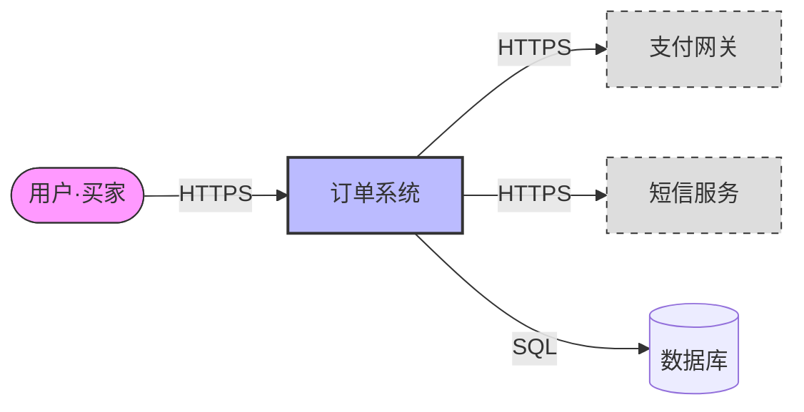
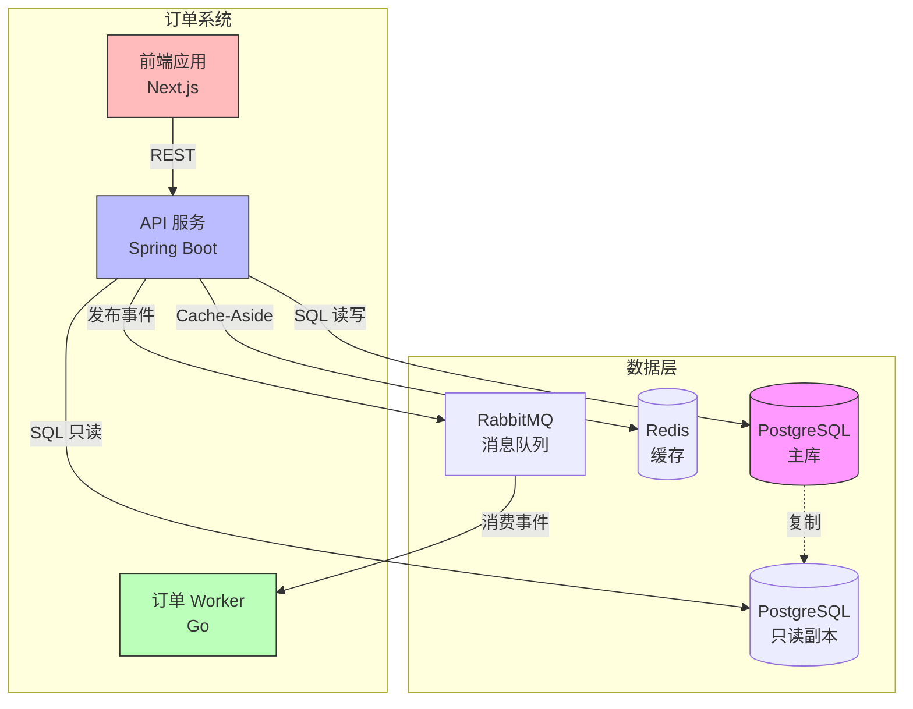
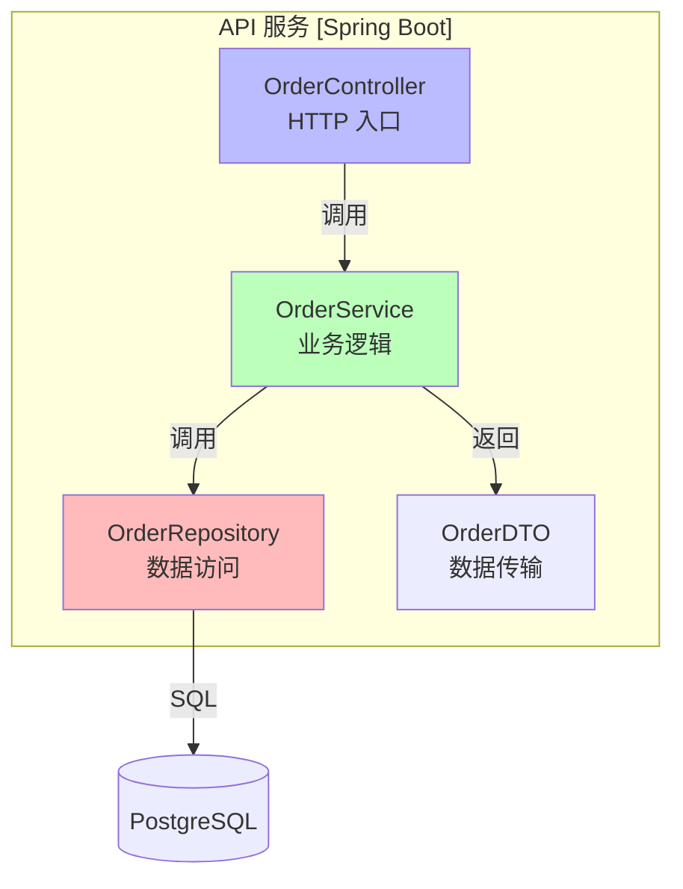
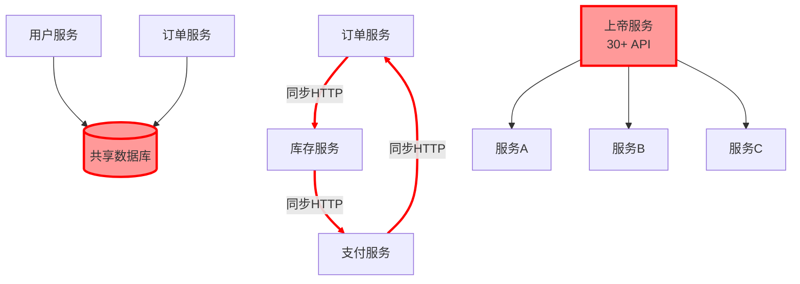
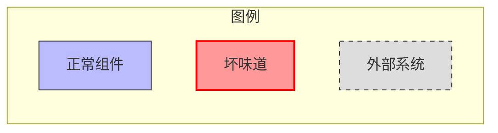

# C4 模型画法规范

## 核心原则

C4 不是一种图，而是四层抽象——从粗到细，每层服务不同受众。画图前先回答"给谁看"，再决定画到哪层。

```
Context   → 给非技术人员看（业务方、管理层）
Container → 给运维/架构师看（部署、技术栈）
Component → 给开发看（模块、依赖）
Code      → 极少需要，仅复杂核心领域才画
```

## 命名规范

| 层级 | 元素命名 | 示例 |
|------|---------|------|
| Context | 系统名 + 角色/外部系统名 | "订单系统"、"支付网关"、"用户（买家）" |
| Container | 组件类型 + 技术栈 | "API 服务 [Spring Boot]"、"数据库 [PostgreSQL]" |
| Component | 模块名 + 职责 | "OrderService - 订单创建" |
| Code | 类名/接口名 | "OrderRepository" |

```
命名规则：
✅ 每个元素标注技术栈（Container 层）：[Spring Boot]、[PostgreSQL]、[Redis]
✅ 每个元素标注职责（Component 层）：一句话说明做什么
✅ 箭头标注协议/数据流方向：HTTP/REST、gRPC、事件、SQL
✅ 外部系统用灰色/虚线区分
❌ 不画无标注的箭头——每条线都要说明是什么
❌ 不在一个图里混画多层——Context 图不出现 Component
```

## 每层画到什么粒度

### Context（系统上下文）— 最粗

画什么：系统边界 + 外部参与者 + 外部系统
不画：内部组件、技术栈、数据库

停止信号：当图里出现内部模块时，说明该画 Container 了

### Container（容器）— 中等

画什么：可独立部署的单元 + 数据存储 + 通信协议
不画：容器内部的类/函数

停止信号：当需要看一个容器内部怎么组织时，画 Component

### Component（组件）— 最细（通常足够）

画什么：容器内的主要模块 + 模块间依赖 + 共享代码
不画：每个类/方法（除非核心领域模型）

停止信号：99% 的场景到 Component 就够了。只有当某个组件的内部设计有争议或需要精确文档时才画 Code 层

### Code（代码）— 极少

画什么：类图/接口关系（UML 风格）
何时画：核心领域模型、复杂状态机、关键算法

## Mermaid 模板

### Context 图



### Container 图



### Component 图



## PlantUML 模板

### Context 图

```plantuml
@startuml C4_Context
!include https://raw.githubusercontent.com/plantuml-stdlib/C4-PlantUML/master/C4_Context.puml

Person(user, "用户·买家", "下单购买商品")
System(order_sys, "订单系统", "处理订单创建、支付、履约")
System_Ext(payment, "支付网关", "第三方支付")
System_Ext(sms, "短信服务", "发送通知")

Rel(user, order_sys, "HTTPS")
Rel(order_sys, payment, "HTTPS")
Rel(order_sys, sms, "HTTPS")
@enduml
```

### Container 图

```plantuml
@startuml C4_Container
!include https://raw.githubusercontent.com/plantuml-stdlib/C4-PlantUML/master/C4_Container.puml

System_Boundary(sys, "订单系统") {
    Container(api, "API 服务", "Spring Boot", "处理 REST 请求")
    Container(worker, "订单 Worker", "Go", "消费事件、异步处理")
    Container(web, "前端应用", "Next.js", "用户界面")
}

Container_Boundary(data, "数据层") {
    ContainerDb(db, "PostgreSQL", "PostgreSQL 15", "主库")
    ContainerDb(replica, "只读副本", "PostgreSQL 15", "读扩展")
    ContainerDb(cache, "Redis", "Redis 7", "缓存")
    ContainerQueue(mq, "消息队列", "RabbitMQ", "事件流")
}

Rel(web, api, "REST")
Rel(api, db, "SQL 读写")
Rel(api, replica, "SQL 只读")
Rel(api, cache, "Cache-Aside")
Rel(api, mq, "发布事件")
Rel(mq, worker, "消费事件")
@enduml
```

## As-Is vs To-Be 画法差异

| 维度 | As-Is（现状） | To-Be（目标） |
|------|-------------|-------------|
| 数据来源 | 从代码反推 | 从设计推导 |
| 标注重点 | 坏味道、耦合热点、技术债 | 目标架构、质量属性目标 |
| 颜色用法 | 红色标注问题 | 绿色标注改进点 |
| 粒度 | Component 层（够诊断即可） | Container + Component 层 |
| 用途 | 输入演进路线图 | 演进路线图的目标 |

## 坏味道在图里怎么标红

### Mermaid 标红方法



### 标注规范

| 坏味道 | 标注方式 | 颜色 |
|--------|---------|------|
| 循环依赖 | 红色粗线 + 标注"循环" | `stroke:#f00` |
| 共享数据库 | 红色填充 + 标注"共享" | `fill:#f99` |
| 上帝服务 | 红色填充 + 标注方法数 | `fill:#f99` |
| 跨层引用 | 红色虚线 + 标注"跨层" | `stroke:#f00,stroke-dasharray:5 5` |
| 单点故障 | 橙色边框 + 标注"单点" | `stroke:#f90,stroke-width:3px` |
| 无健康检查 | 灰色填充 + 标注"无探针" | `fill:#ccc` |

### 图例

每个 C4 图必须包含图例，说明颜色含义：



## 常见画图错误

| 错误 | 问题 | 正确做法 |
|------|------|---------|
| 一图画全部 | 无法阅读，失去沟通价值 | 按层画，每层只画该层元素 |
| 箭头无标注 | 不知道是什么通信 | 每条线标注协议/数据类型 |
| 混合层级 | Context 图里出现 Component | 严格分层，不跨层 |
| 过度细节 | Component 图画到每个类 | 只画主要模块，类级用 Code 层 |
| 无图例 | 颜色含义不明 | 每图必带图例 |
| 不标技术栈 | Container 不知道用什么 | 每个容器标注技术栈 |
