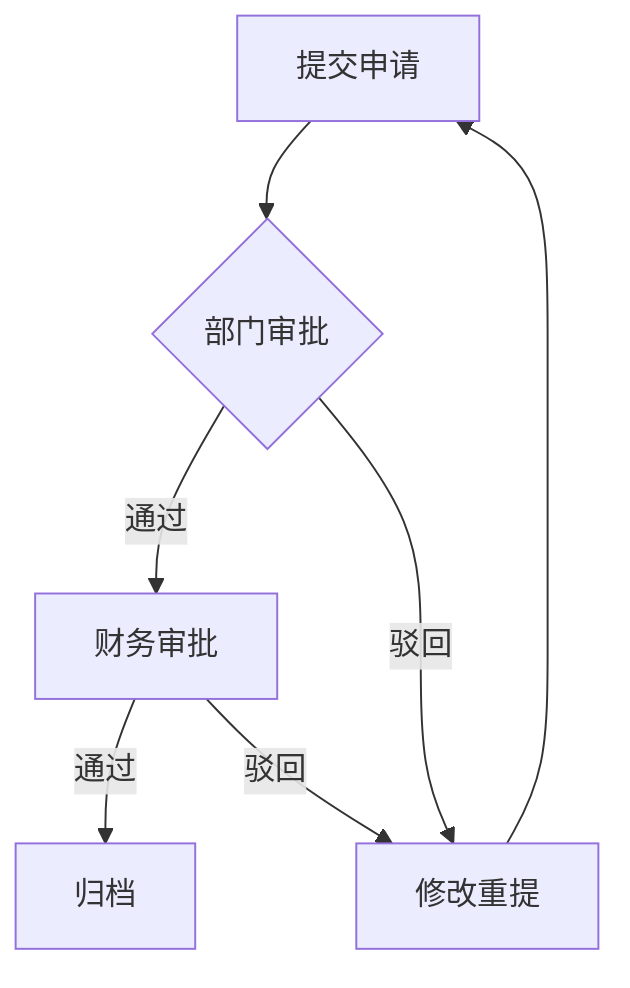
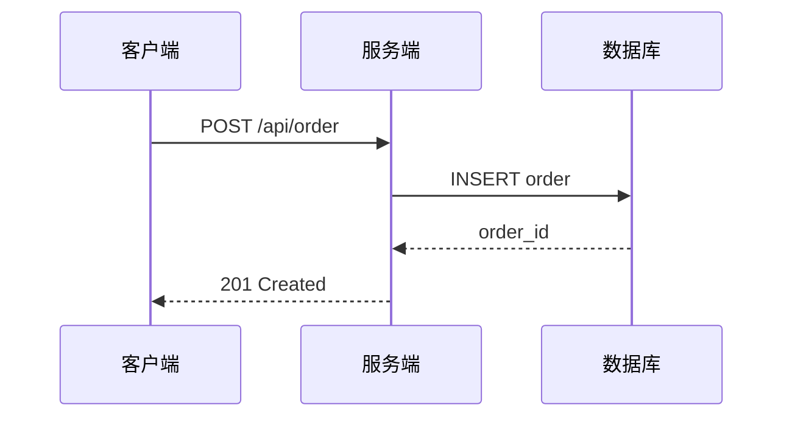

# Visualization Guidelines / 可视化与图表嵌入指南

长文档中需要架构图、流程图、对比表等视觉件时，按本指南选择类型、制作和嵌入。

## 核心原则

**视觉件服务于内容，不是装饰**：每个视觉件必须承担一个明确的信息传递功能——解释结构、展示流程、对比差异。不为"看起来专业"而加图。

## 视觉件类型与选择

| 类型 | 适用场景 | 推荐格式 | 嵌入方式 |
| --- | --- | --- | --- |
| 架构图 | 系统结构、模块关系、组织架构 | SVG 源码 | ```svg 围栏包裹 |
| 流程图 | 操作步骤、决策流程、审批流程 | Mermaid flowchart | ```mermaid 围栏包裹 |
| 时序图 | 交互流程、API 调用、消息传递 | Mermaid sequence | ```mermaid 围栏包裹 |
| 对比表 | 多维度横向对比、特性矩阵、优劣分析 | Markdown 表格 | 直接写 Markdown 表格语法 |
| 数据图 | 趋势、占比、分布 | Mermaid xychart/pie 或 SVG | ```mermaid 或 ```svg 围栏 |
| 关系图 | 知识图谱、概念关系、因果链 | Mermaid graph | ```mermaid 围栏包裹 |

## 何时嵌入视觉件

| 信号 | 推荐视觉件 |
| --- | --- |
| 正文用文字描述了结构关系但读者难以想象 | 架构图（SVG） |
| 正文有 3 步以上流程或分支判断 | 流程图（Mermaid） |
| 正文在对比 3 个以上对象的多个维度 | 对比表（Markdown） |
| 正文描述了多角色交互顺序 | 时序图（Mermaid） |
| 正文有数据趋势但只有文字描述 | 数据图（Mermaid/SVG） |
| 概念之间有复杂依赖或因果关系 | 关系图（Mermaid） |

**不嵌入的情况**：
- 2 步以内的简单流程（直接用文字更清楚）
- 只对比 2 个对象 1-2 个维度（用文字或短表即可）
- 纯粹为了"好看"而加图，不增加信息量

## 架构图（SVG）

### 制作规范
- 用 ```svg 围栏包裹完整自包含的 `<svg>...</svg>` 源码
- SVG 须自包含：内联样式，不引用外部资源
- 宽度建议 `viewBox` 自适应，不写死 `width/height`
- 配色用语义色（如蓝=输入、绿=处理、红=输出），不用装饰色
- 每个节点有清晰文字标签，不用纯图标

### 嵌入示例
```markdown
以下是系统架构：

```svg
<svg viewBox="0 0 600 300" xmlns="http://www.w3.org/2000/svg">
  <rect x="50" y="50" width="150" height="60" fill="#e3f2fd" stroke="#1565c0"/>
  <text x="125" y="85" text-anchor="middle">用户层</text>
  ...
</svg>
```
```

### 与正文的关系
- SVG 前面用一句话说明这个图展示什么
- SVG 后面用正文解释图中的关键关系，不重复图中已有的全部信息

## 流程图（Mermaid）

### 制作规范
- 用 ```mermaid 围栏包裹
- 节点命名简短（如 A、B、C），标签写清楚
- 分支用菱形 `{}`
- 方向优先从上到下（`graph TD`），宽流程可用从左到右（`graph LR`）
- 超过 15 个节点的流程考虑拆分为子图

### 嵌入示例
```markdown
审批流程如下：


```

## 对比表（Markdown）

### 制作规范
- 第一列是对比对象，后续列是对比维度
- 每个维度有明确列名
- 相同维度用相同标准描述，不忽长忽短
- 支持项用 ✅，不支持用 ❌，部分支持用 ⚠️
- 表格不超过 7 列（超过时拆分或用分组表）

### 嵌入示例
```markdown
三种方案的对比：

| 维度 | 方案A | 方案B | 方案C |
| --- | --- | --- | --- |
| 实现成本 | 低 | 中 | 高 |
| 维护难度 | 高 | 中 | 低 |
| 扩展性 | ❌ | ⚠️ | ✅ |
| 性能 | 中 | 高 | 高 |
```

## 时序图（Mermaid）

### 制作规范
- 用 ```mermaid 围栏包裹
- 参与者命名简短，别名写清楚
- 消息箭头方向明确（`->>` 实线，`-->>` 虚线）
- 关键步骤加 `Note` 说明

### 嵌入示例
```markdown
API 调用时序：


```

## 与 document_exporter 的协作

document_exporter Tool 的 `sections[].content` 字段接受 Markdown 文本，其中可以包含：
- ```svg 围栏的 SVG 源码
- ```mermaid 围栏的 Mermaid 代码
- 标准 Markdown 表格

导出时这些视觉件原样保留在对应章节中，不做额外处理。

## 视觉件写作标准

- 每个视觉件前面有一句话说明它展示什么
- 视觉件后面有正文解释关键信息，不把图当全部内容
- 图中的文字标签与正文术语一致
- 同一文档中同类视觉件风格统一（配色、命名、方向）
- 不用视觉件代替正文论证——图是辅助，不是替代
- 视觉件编号（图1、图2...），正文引用时用编号定位

## 禁止

- 为"看起来专业"而加无信息量的图
- SVG 引用外部资源或依赖外部样式
- Mermaid 图超过 20 个节点不拆分
- 对比表超过 7 列导致难以阅读
- 视觉件与正文术语不一致
- 用图代替必要的文字论证