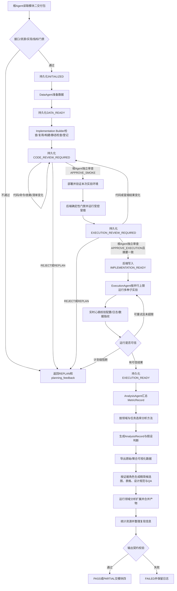

# Experiment Workflow

## Overview

四个子Agent是根Agent的直属子Agent，必须串行调用，彼此不直接委派。各阶段只通过严格响应和运行目录中的原子状态文件交接，完整字段见[内部Agent契约](../references/internal-agent-contracts.md)。

## 阶段要求

1. **输入门禁**：校验`MethodDesign`、`ExperimentPlan`、`DataPlan`、`Domain`和资源约束，不修改上游订单。
2. **实现构建与门禁**：按[Implementation Manifest](../references/implementation-manifest.md)支持`inspect → reuse → build → test → register → request_approval`，其中测试因安全门禁被拆到第一次`request_approval`和根Agent代码审查之后。后端门禁通过才运行最长60秒的小数据冒烟；根Agent再审代码、命令和真实冒烟证据。`ready=false`、`verified=false`、审查拒绝或摘要不一致都不得进入ExecutionAgent。
3. **计划标准化**：从实验矩阵、假设覆盖和消融方案生成模块三内部`ExecutionSpec`；每个非`key=value`实现展开全部seed，映射不清时退回模块二。
4. **数据准备**：记录来源、许可、预处理步骤、切分方法和seed；数据路径必须位于`run_dir`内。该流程适用任意领域和文件类型。模块二有地址时优先验证并下载（Hugging Face/Zenodo页面会先解析为实际数据文件）；没有地址时查询公开注册表并只自动接受唯一精确名称匹配。搜索候选、仓库错误、最终URL和版本写入`data/source-resolution/`。精确源失效时，带许可、不可变版本和真实文件的语义兼容候选只用于触发模块二重规划；模块二未重写全部交叉引用前，不得把近似数据挂在旧名称下执行。有界闭环耗尽后停止并给出`run_dir`内的手动数据目录。
5. **环境与实现**：优先复用可靠实现或受控通用执行器；新代码仅写入本次`run_dir/implementations`。保存依赖、许可、参数、版本、命令和冒烟结果。代码审查后，`CURRENT`模式校验当前环境，`VENV`模式部署运行目录内隔离环境；只有显式授权才安装已经审查且精确固定版本的依赖，绝不修改全局环境。
6. **实验执行与监控**：按唯一`experiment_id`记录主实验、基线和消融；命令不通过shell执行，使用`max_parallel_runs`并行不同冻结任务，GPU任务另受`max_parallel_gpu_runs`限制。失败按`max_retries`有限重试，超时由`timeout_seconds`限制；`execution-monitor.json`提供实时快照，`execution-events.jsonl`保留心跳与校验事件。配置、日志或数据指纹改变时立即终止对应任务。
7. **结果分析**：先收集命令实际生成的test指标，再结合领域、任务和数据条件选择适用分析方法；记录方法、参数、假设、结构化结果和局限，再对照成功标准和预期。禁止逆向筛选结果，也不按领域名称机械套用固定分析。
8. **证据映射**：每条发现绑定实验ID、指标和假设；没有证据的内容不得交给写作模块。
9. **可视化数据**：导出至少一个`RAW`实验级/样本级/seed级绘图数据文件；需要时同时导出带明确聚合规则的`AGGREGATED`文件。
10. **候选设计**：根据实验问题和`AnalysisRecord`生成默认目标4幅、主交付最多8幅承担不同证据角色的`VisualizationCandidate`，并输出写作证据摘要。图表类型不设固定枚举，每个候选必须引用数据、分析、发现和实验，导出SVG/PDF/PNG/TIFF与独立QA；证据不足时宁可`PARTIAL`并说明短缺，也不得复制图形凑数量。过长方法名可使用仅限展示的稳定缩写，但必须随图保存`display_label_map`，原始契约和跨模块引用仍使用完整名称。
11. **领域扩展**：内置标量分析不够时运行manifest中已就绪的`analysis_extensions`，读取统一上下文并合并专用分析、数据和候选图表；扩展不得修改已有数字。
12. **交付门禁**：使用`ExperimentModuleOutput`校验，并生成覆盖模块四伴随文件的`artifact-manifest.json`；输出`PASS`、`PARTIAL`、`REPLAN`或`FAILED`。

## 回退边界

- 数据源不可访问、名称检索不唯一、数据许可不明、预算不足、实验ID映射不清或指标评价意图有歧义：退模块二`REPLAN`；数据问题同时给出准确的手动放置目录和续跑方式。
- 基线官方实现缺失但论文描述足以可信复现：模块三可自主实现，并在`BaselineImplementation.implementation_notes`中披露。
- 临时代码错误、超时且仍有重试额度：模块三内部修复和重试。
- 假设未得到支持：不回退、不改结果，如实标记`NOT_SUPPORTED`。
- 模块四发现论文数字无法追溯：退模块三重新核对指标和产物，不得在写作侧修改数字。
- 模块四可以从候选中选图、合并子图或依据`visualization_data`重绘；如果要改变聚合方式、统计分析或源数字，必须退模块三重新计算。
