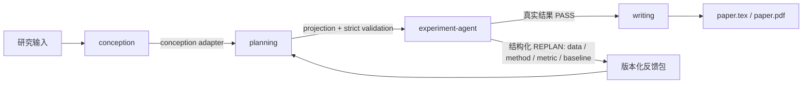

# Paper-Gen：JiuwenSwarm 论文流水线编排包

`paper-gen` 是 JiuwenSwarm 内部的顶层编排 Skill，负责把四个独立模块按顺序连接起来：

```text
conception → planning → experiment → writing
      研究构思     方法/实验计划    真实实验       论文与 PDF
```

它不替代四个模块的专业职责；它负责输入适配、阶段状态、日志、耗时与 token 汇总、可恢复运行和跨模块的 `REPLAN` 反馈。

## 当前状态（2026-09-26）

四阶段编排、模块二到模块三的严格投影、`experiment-agent` SDK 接入以及实际 E2E 夹具均已可用。新版 evidence-first writing 已接入；模块三使用内容寻址的 `runs/<run_id>`，REPLAN 使用版本化 feedback bundle、重规划目录和重实验目录。

新版 writing 的正式链路是：先把模块一至三产物归一化为证据账本和论文规格；以章节为单位生成与审阅；由图表规划 Agent 和图表审阅 Agent 优先筛选可审计的模块三图、必要时再从真实记录确定性重绘；最后受控生成 `refs.bib`、LaTeX 和 ICLR PDF。短流程图会收紧导出留白，宽结果表会分指标面板而非缩小字体。只有证据、引用、视觉资产和 PDF 版式门禁同时通过，才会发布 `paper.pdf`。

实验前置条件不满足、结果被标为合成、或证据不足时，流水线会安全停止或返回 `REPLAN`，不会把未验证数字包装成论文结论。

## 目录与职责

| 目录 | 角色 | 主要产物 |
|---|---|---|
| `skills/conception` | 文献与研究问题构思 | `conception_output.json` |
| `skills/planning` | 方法设计、实验计划、数据计划、共同约定账本与跨产物校验 | `method_design.json`、`experiment_plan.json`、`data_plan.json`、`contract_ledger.json` |
| `skills/experiment` | 数据准备、方法/基线实现、真实运行、指标、统计与图表 | `experiment-module-output.json`、原始指标、表格、图表、运行日志 |
| `skills/writing` | 证据归一化、6 个专职章节作者、整合编辑、claim/literature-novelty/argument/visual 专项审查、定点修订、受控引用、图表与 ICLR PDF 门禁 | `paper_contract.json`、`evidence/`、`sections/`、`reviews/`、`assets/`、`refs.bib`、`paper.tex`、`paper.pdf`、`pdf_validation.json` |
| `skills/paper-gen` | 顶层顺序编排、投影适配、状态聚合、缓存、token/时间遥测 | `run_summary.json`、`stage_metrics.json`、`token_usage.json`、四个 stage 目录 |
| `plugins/agent_templates/experiment-agent` | 模块三根 Agent 与数据/实现/执行/分析四子 Agent | Agent 模板、工具白名单、编排 Skill |

## 运行入口与模块 Agent

顶层编排入口是 `paper-gen` Skill。部分模块另有长会话 Agent 模板：

| 阶段 | 可直接调用的 Skill | 长会话 Agent 模板 | 说明 |
|---|---|---|---|
| 顶层编排 | `paper-gen` | 无 | CLI/SDK 编排走 `paper-gen`。 |
| 构思 | `conception` | `conception-agent` | Agent 维护用户构思修改上下文，Skill 完成文献与结构化构思工作。 |
| 规划 | `planning` | `plan-agent` | 当前 paper-gen 直接调 planning Skill；plan-agent 可在 TUI 中管理规划检查点。 |
| 实验 | `experiment` | `experiment-agent` + 4 子 Agent | 当前 paper-gen 的 SDK 直连实际加载 experiment-agent。四个子 Agent 分别处理数据、实现、执行和分析。 |
| 写作 | `writing` | 无独立模板 | `writing` 是独立的模块四 Skill；内部包含论文架构师、6 个章节作者、整合编辑、4 个专项 reviewer、修订协调/裁决、formatter 与终稿 reviewer。 |

当前源码保留 `conception-agent`、`plan-agent`、`experiment-agent` 三个模块 Agent 模板；顶层旧 `paper-gen-agent` 模板已移除。

## 调用关系



### 关键接口规则

- `planning` 保留丰富的结构，供 `writing` 使用；`paper-gen` 在模块二到模块三边界做确定性投影，模块三不需要接受宽松字段。
- `planning` 的 `method-design` 与 `experiment-plan` 通过共享约定账本和共同 critic 对齐：实验 ID、假设 ID、指标名和对照关系由后生成的实验计划采用。
- `experiment` 是 fail-closed：不确定的数据、实现、指标或消融不会被自动猜测；会产生带 `[data]`、`[method]`、`[metric]`、`[baseline]` 等类别的 `REPLAN`。
- `writing` 只应消费带真实实验结果的模块三输出。`REPLAN` 或空结果时，`paper-gen` 先把结构化反馈交给 planning；重试耗尽或证据仍无效时跳过写作，避免生成没有证据支撑的论文。

## 如何运行

### 1. 环境

从 JiuwenSwarm 项目根目录运行全部 Python 命令：

```powershell
cd D:\jiuwenswarm
uv sync
```

测试真实 LLM 前，先在后台启动本地火山代理：

```powershell
uv run python scripts/llm_volcengine_proxy.py
```

代理健康检查：

```powershell
uv run python scripts/llm_proxy_smoke.py
```

模型配置由本机 JiuwenSwarm 配置和环境变量提供。不要把 API Key 写入输入 JSON、日志或本包。

### 2. 启动顶层流程

```powershell
uv run python -m jiuwenswarm.resources.agent.workspace.skills.paper_gen.scripts.main `
  --input-dir mock/run1 `
  --output-dir out/run1
```

- 已完成阶段会读取其 `status.json` 并复用缓存。
- 使用 `--force` 才会要求所有阶段重新跑。
- 顶层状态见 `out/run1/run_summary.json`；逐阶段 token、耗时见 `out/run1/stage_metrics.json`。
- `out/run1/token_usage.json` 和 `token_usage_report.md` 将最终成功链路、REPLAN/失败/被替代尝试及总消耗分开统计；全流程未完成时成功链路会标记为 provisional。
- Token 账本的 `measurement_status` 明确区分：`reported`（提供商或日志已回传真实用量）、`not_applicable`（确定性或 dry-run 阶段未调用模型）和 `unavailable`（调用预期存在但提供商未回传用量）。后者不会再被误报为 0 token，也会使账本 coverage 标记为不完整。

### 3. 排查某个阶段

优先查看：

```text
out/<run>/paper_gen.log
out/<run>/run_summary.json
out/<run>/stage1_conception/status.json
out/<run>/stage2_planning/status.json
out/<run>/stage3_experiment/status.json
out/<run>/stage4_writing/status.json
```

每个阶段保留自己的输入、状态、日志和中间产物。不要通过修改已完成的 `stage2_planning` 原始产物来修复模块三；应修复 planning 规则或由 `paper-gen` 的投影层处理确定性形状差异。

## 模块三当前必须补齐的工作

这部分需要 **experiment 模块制作者** 完成，之后从 `experiment` 与 `writing` 重跑即可，不必重跑已缓存的 conception/planning。

1. **真实数据下载与版本固定**
   - 下载 LoCoMo、LongMemEval 等计划数据；记录来源、许可、版本、校验和和本地路径。
   - 把下载后的数据转换为实现可读格式，并在数据计划中补齐样本量、任务类型、标签字段、切分策略和随机种子。
2. **主方法、基线和消融的可执行实现**
   - 为主方法、每个基线提供受版本控制的实现或经审查的生成方案。
   - 为每个消融给出独立实验 ID、可执行方法名和明确的 `ablation=<component>` 映射；不要用自由文本替代实现名。
3. **指标与评估器**
   - 实现并登记 `compression_ratio`、QA/temporal QA 等计划指标的真实计算方式、比较方向、单位和输入输出契约。
   - 补 `task_type`、标签/答案读取逻辑、预测格式和失败样本记录。
4. **运行资源与可复现性**
   - 明确模型、GPU/CPU、依赖版本、运行命令、种子、超时和磁盘需求。
   - 保留原始预测、逐次运行指标、聚合统计、置信区间、日志和失败原因。
5. **实验结果交付给写作**
   - 输出真实 `experiment-module-output.json`、`artifact-manifest.json`、表格数据和候选图表。
   - 只有实际执行产生的数字能进入论文；不要用占位值或人工编造的表格。

## 模块四：新版 writing 的输入、图表与发布门禁

`writing` 直接消费模块一、二、三的结构化 JSON；不要再传入或构造 `Part1/Part2` 文本。对跨领域测试，最关键的是模块三提供真实、可追溯的运行记录：实验 ID、方法/基线、指标方向和单位、逐种子数值、聚合结果、数据版本与原始图表数据。

- **章节化写作**：每个章节单独生成、审阅并可局部修订，结论只能引用证据账本中登记的结果。
- **图表 Agent**：Visual Planner 按问题、方法和可用数据选择必要图/表；Visual Reviewer 检查是否有数据支撑、标签/编号/引用是否一致以及是否避免重复。当前确定性渲染器支持方法/模型/算法流程图、分组柱状图、点区间图、strip/box/violin 分布图、种子轨迹、Pareto 散点图和主结果/协议表；无对应数据时不会臆造图表。
- **引用**：正文 `\\cite{...}` 必须对应受控 `refs.bib` 中的条目，并与模块一的文献证据一致；ICLR 的 `natbib` 参考文献默认使用作者—年份形式，不应手工添加 `【1】` 序号。
- **PDF**：Tectonic 编译 ICLR LaTeX，随后用 PDF 验证器检查页数、文本可提取性、必需章节、参考文献和图表资产。预览回退不属于可发布 PDF；PDF 门禁失败时不会把它标记为正式成品。

随机森林 E2E 夹具及一次真实 LLM 的新版 writing 结果已随交接包提供，仅用于功能验证，不能视为可投稿的研究结论。

## 当前源码结构与安装

当前源码保持 JiuwenSwarm 的目录层级：

```text
jiuwenswarm/
  resources/agent/workspace/
    skills/{paper-gen,conception,planning,experiment,writing}/
    plugins/agent_templates/{conception-agent,plan-agent,experiment-agent}/
    plugins/agent_templates/marketplace.json
```

将其中的 `jiuwenswarm/` 与目标仓库的同名目录合并。不要整体覆盖目标仓库已有的 `marketplace.json`；应合并其中 `experiment-agent` 的注册项。安装后重新启动 JiuwenSwarm，再运行上面的代理和 paper-gen 命令。
