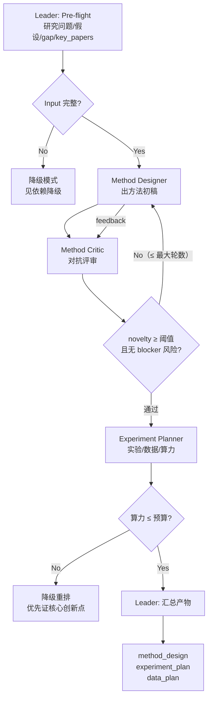

# Workflow: 规划模块（研究问题 → 方法蓝图 → 实验与数据蓝图）

> 规划模块编排。只覆盖模块内部；四模块整体编排待四个模块齐后再搭。

## Overview



## Detailed Steps

### Step 0 — Pre-flight: 依赖检查

- **Executor**: Leader
- **Input**: [dependencies.yaml](../dependencies.yaml)
- **Action**: 核对外部检索依赖（arXiv / HuggingFace / Papers with Code 等）是否配置 API key；未配置时按降级规则处理。
- **Output**: 依赖核对结果报给用户，缺项由用户决议 go/no-go。

### Step 1 — 方法初稿（Method Designer）

- **Executor**: method-designer
- **Input**: research_question / hypotheses / gap_report / key_papers
- **Action**: 生成方法设计初稿 `method_design`：研究目标、总体框架（组件+数据流）、创新点（逐条关联假设）、假设覆盖矩阵、边界与局限。
- **Output**: `MethodDesign`（强格式，见 [references/planning-schemas.md](../references/planning-schemas.md)）
- **Serial / Parallel**: 串行
- **Quality gate**: 结构完整（research_goal / overall_framework / innovation_points / hypothesis_coverage / limitations 各节齐、无空节）；不足则打回重写。

### Step 2 — 对抗评审（Method Critic）

- **Executor**: method-critic
- **Input**: `MethodDesign` 初稿 + gap_report / key_papers
- **Action**: 对抗式审查：逐创新点 novelty 三要素判定、总评、可行性风险、假设缺口、缺失字段；给出 `verdict`。
- **Output**: `MethodReview`（强格式）
- **Serial / Parallel**: 串行（与 Step 1 构成反思循环）
- **Quality gate**: `novelty_score ≥ ADEQUACY_PASS(7.0)` 且无 `severity=blocker` 风险 → 通过进入 Step 3；否则将定向 feedback 原样回传给 method-designer 重写，重写后再次评审。**最大轮数 `MAX_METHOD_ROUNDS`**（见 [references/planning-schemas.md](../references/planning-schemas.md) § 评审门禁），超轮仍未过 → Leader 将当前 review 与缺口完整记入产物并以「未定稿」标记交给用户裁决。

### Step 3 — 实验规划（Experiment Planner）

- **Executor**: experiment-planner
- **Input**: 定稿 `MethodDesign` + `resource_constraints`（预算：算力/时间/存储）
- **Action**: 生成 `experiment_plan`（主实验/消融/基线/指标/算力估算）与 `data_plan`（数据订单/总成本）；数据与基线可用性核对。
- **Output**: `ExperimentPlan` + `DataPlan`（强格式）
- **Serial / Parallel**: 串行
- **Quality gate**: 每条消融对应一个可识别设计变量；每条指标可量化；数据集项非 `inferred` 状态下需真实溯源。算力超预算 → 按降级三档（见 [references/planning-schemas.md](../references/planning-schemas.md) § 算力门禁）重排实验，优先保证核心创新点可证。

### Step 4 — Final: 汇总产物

- **Executor**: Leader
- **Input**: `MethodDesign` + `ExperimentPlan` + `DataPlan`
- **Action**: 汇总为规划模块最终产物，标注未解决项（未通过评审的创新点、算力降级点、inferred 数据项）。
- **Output**: 产物三件套（见下）

#### Final Output Format（规划模块产物）

```markdown
# 规划模块产物

## Method Design
- research_goal / overall_framework / innovation_points / hypothesis_coverage / limitations

## Experiment Plan
- main_experiments / ablations / baselines / metrics / compute_estimate

## Data Plan
- datasets / total_estimate

## 未解决项与备注
- 未通过评审的创新点、降级决策、inferred 数据项、依赖缺失
```

## Acceptance Criteria

- 三个 agent 的输出均与其 `## Output Schema` 一致（无缺字段、无自造节）。
- `novelty_score ≥ 7.0` 且无 blocker 高风险（或已显式记录超轮未定稿并交用户裁决）。
- 每个创新点关联到至少一个假设和一个可量化评测途径。
- 数据订单全部可溯源（`status=available`）或显式标注 `unavailable / inferred` 且说明替代方案。
- 算力计划与预算比对结果、超限降级策略明确写入产物。

---

## Quick Start：从 main 入口使用本 Skill

> 适用场景：模块一（conception）产物已落盘到某目录，需要运行模块二产生产物。
> 完整接口契约见 [references/planning-schemas.md](../references/planning-schemas.md)；
> 主入口 CLI 实现见 [scripts/main.py](../scripts/main.py)。

### 1. 准备输入目录

`--input-dir` 应含 8 个 JSON 文件（字段契约见 conception-schemas.md §7）：

```
plan_input/
├── research_question.json      # ResearchQuestion  {topic, scope, success_criteria}
├── hypotheses.json             # Hypothesis[]        [{id, claim, verifiable}]
├── gap_report.json             # GapReport           {research_question, existing_state, missing_capability, opportunities?}
├── key_papers.json             # PaperRef[]          [{id, title, method_key, is_baseline?}]
├── references.json             # Reference[]         模块一核验后的完整 10 篇参考文献
├── resource_constraints.json   # ResourceConstraints {gpu_hours, memory_gb, time_budget_days, gpu_type?, budget?}
├── research_frontier.json      # ResearchFrontier    {frontier_text}
└── domain.json                 # Domain              {domain_name}
```

> ⚠️ 8 个文件名固定，`load_inputs.py` 按名单读取，不扫描其他 JSON。为兼容旧缓存，
> 历史运行缺少 `references.json` 时会加载为空列表并给出警告；新运行必须传递该文件。

### 2. 最简单跑法

```bash
cd D:/jiuwenswarm
uv run python -m jiuwenswarm.resources.agent.workspace.skills.planning.scripts.main \
    --input-dir plan_input/ \
    --output-dir plan_output/
```

跑完后 `plan_output/` 下有 5 对文件（10 个）：
- `method_design.json` / `.md`
- `method_review.json` / `.md`
- `experiment_plan.json` / `.md`
- `data_plan.json` / `.md`
- `execution_config.json` / `.md`（含 `run_dir=<output>/run`、`result_dir=<output>/run/results`、默认 `seeds=[42]`、`max_retries=2`、`timeout_seconds=null`、`dry_run=false`）

### 3. 常用参数

| 参数 | 默认 | 用途 |
|---|---|---|
| `--max-method-rounds N` | `3` | 方法反思循环最大轮数；超过则按"超轮未定稿"处理并交用户裁决 |
| `--strict` | `false` | 严格模式：任一错误即退出码 1（CI/批处理用） |
| `--replan-from <dir-or-json>` | `None` | REPLAN 入口：传上一轮 `PlanningFeedback` 路径或含 `planning_feedback.json` 的目录 |
| `--seeds N [N ...]` | `[42]` | ExecutionConfig.seeds（多随机种子跑实验） |
| `--max-retries N` | `2` | 单次实验最大重试次数 |
| `--timeout-seconds N` | `null` | 单次实验超时（秒）；null = 不设超时 |
| `--dry-run` | `false` | 试跑：模块三读到 `dry_run=true` 时跳过实际训练只跑占位 |

### 4. 典型场景示例

#### 场景 A：首次跑（无 REPLAN 反馈）

```bash
uv run python -m jiuwenswarm.resources.agent.workspace.skills.planning.scripts.main \
    --input-dir plan_input/ \
    --output-dir runs/v1/
```

#### 场景 B：模块三返回 REPLAN 后重跑

模块三的 `PlanningFeedback` 写到 `runs/v1/planning_feedback.json`（`status=REPLAN` 时落地），
按 `blockers[].category` 路由：
- `[data]` → 复用 `runs/v1/experiment_plan.json`，重出 `DataPlan`
- `[compute]` → 自动按预算降档（TIER_TRIM / TIER_CORE）
- `[baseline]` / `[method]` / `[metric]` → 重出 `MethodDesign`
- `[schema]` → `--strict` 模式下退出码 1，需人工修 schema

```bash
uv run python -m jiuwenswarm.resources.agent.workspace.skills.planning.scripts.main \
    --input-dir plan_input/ \
    --output-dir runs/v2/ \
    --replan-from runs/v1/planning_feedback.json
```

#### 场景 C：批跑多 seed + 设超时

```bash
uv run python -m jiuwenswarm.resources.agent.workspace.skills.planning.scripts.main \
    --input-dir plan_input/ \
    --output-dir runs/v3/ \
    --seeds 42 43 44 \
    --max-retries 3 \
    --timeout-seconds 7200
```

生成的 `execution_config.json`：
```json
{
  "run_dir": "D:/jiuwenswarm/runs/v3/run",
  "result_dir": "D:/jiuwenswarm/runs/v3/run/results",
  "seeds": [42, 43, 44],
  "max_retries": 3,
  "timeout_seconds": 7200,
  "dry_run": false
}
```

#### 场景 D：CI / 严格校验

```bash
uv run python -m jiuwenswarm.resources.agent.workspace.skills.planning.scripts.main \
    --input-dir plan_input/ \
    --output-dir runs/ci/ \
    --strict
```

任一契约违反（缺字段 / 类型错 / 跨字段不一致）即返回 1，便于 PR 检查。

### 5. 单独跑子步骤

每个子脚本都是独立 CLI，可在主流程外单独调试：

| 子脚本 | 用途 | 用法 |
|---|---|---|
| `load_inputs.py` | 仅做输入解析 | `python -m scripts.load_inputs --input-dir <dir> [--strict]` |
| `validate_plan.py` | 仅做产物契约校验 | `python -m scripts.validate_plan --method-design <path> --method-review <path> --experiment-plan <path> --data-plan <path> [--execution-config <path>]` |
| `write_outputs.py` | 把 5 产物写 .json + .md 双格式 | `python -m scripts.write_outputs --method-design <path> ... --output-dir <dir>` |
| `estimate_compute.py` | 算力估算 + 三档判定 | `python -m scripts.estimate_compute --estimate <path> --budget <num \| null>` |

### 6. 常见失败模式

| 现象 | 原因 | 修法 |
|---|---|---|
| `ModuleNotFoundError: No module named 'scripts.xxx'` | 没在 `skills/planning/` 下跑，或没加 `-m` | `cd .../skills/planning && python -m scripts.main ...` |
| `[hypotheses] id 格式不符` | id 不是 `H\d+`（如 `H01` / `h1`） | 改成 `H1` / `H2` ... |
| `[resource_constraints] gpu_hours=... 不在合法范围 [≥0]` | 负数 / 类型错 | 改成 ≥0 的整数 |
| `[load_inputs] 软警告: key_papers 数量 < MIN_KEY_PAPERS=3` | 关键论文 < 3 | 回模块一补检索（不阻塞） |
| `[cross] gap_report.research_question 与 research_question.topic 语义不一致` | 两者指向不同研究问题 | 同步两个字段 |
| REPLAN 路径返回 1 | `[schema]` 类 blocker + `--strict` | 修 schema 后重跑，去掉 `--strict` 可软通过 |

---

## Human Review（4 个人审检查点）

> 适用场景：单人 / 团队跑规划模块时，对 LLM 产出物的**内容/策略**做人工把关。
> 结构性校验已在 `load_inputs` / `validate_plan` / `check_feasibility` 完成，**不需要**人审。
>
> 实现方式：4 个检查点直接调 SwarmFlow 的 `await human(prompt, schema=...)` 算子
> （不再是手撸 stdin）。每个检查点配一个 Pydantic schema 强约束答案结构：
>
> - JiuwenSwarm TUI 主界面 `h` 键回复（该 TUI 文档随宿主 JiuwenSwarm 安装提供）
> - `StructuredAskUserRail` 把 schema 转成可点击 options
> - 答案自动按 Pydantic schema 解析，不用自己再 validate
>
> 关闭方法：CLI 加 `--no-human-review`（CI / 批处理 / 自动跑分用）—— 关闭后所有检查点
> 走 schema 默认值（AUTO-APPROVE / AUTO-DOWNGRADE），**不可中断流程**。

### 4 个检查点

| # | 触发位置 | 产物 | Schema | 关注点 |
|---|---|---|---|---|
| 1 | stage 1 完成后 | `method_design` + `method_review` | `MethodReviewDecision` | 创新点是否清晰可证伪；假设是否全部承接；`adequacy_score >= 7` |
| 2 | stage 2 完成后 | `experiment_plan` + `data_plan` | `ExperimentPlanDecision` | 数据集真实可下载；基线 paper_id 真在 key_papers；消融覆盖所有组件 |
| 3 | stage 3 后（仅 `tier > 0` 触发） | `tier` + 超支比例 | `TierDowngradeDecision` | 是否走 LLM 降级 / 改 budget / 中止（三选一与上面不同） |
| 4 | ExecutionConfig 产出后 | `execution_config` | `ExecutionConfigDecision` | 仅展示（ec 主要是 CLI 参数），modify 仅记日志 |

### 检查点 schema 定义（[scripts/planning_flow.py](../scripts/planning_flow.py)）

```python
class MethodReviewDecision(BaseModel):
    action: Literal["approve", "modify", "abort"] = "approve"
    feedback: str = ""        # modify 时必填

class ExperimentPlanDecision(BaseModel):
    action: Literal["approve", "modify", "abort"] = "approve"
    feedback: str = ""

class TierDowngradeDecision(BaseModel):
    action: Literal["downgrade", "manual", "abort"] = "downgrade"   # d/m/x
    new_budget: float | None = None                                   # manual 时填

class ExecutionConfigDecision(BaseModel):
    action: Literal["approve", "modify", "abort"] = "approve"
    feedback: str = ""
```

### 反馈流转机制

`action=modify` 时 `feedback` 作为 `previous_feedback` 拼回对应阶段的 LLM payload：
- 检查点 1 → `iterate_method_design(..., previous_feedback=...)`
- 检查点 2 → `plan_experiment_with_data(..., previous_feedback=...)`
- 检查点 3 → 触发 `downgrade_with_llm`（LLM 按"对核心创新点的支撑度"裁剪 plan）
- 检查点 4 → 仅记日志（ec 实际是用户 CLI 参数，不重跑）

每个 persona 的 Self-Reflection Checklist 已支持"带 feedback 的迭代"模式。
人审迭代上限 `MAX_HUMAN_REVIEW_ROUNDS=2`（避免死循环）。

### 与结构性校验的分工

| 类别 | 工具 | 触发位置 |
|---|---|---|
| 结构性（类型/格式/范围/存在/唯一性） | `load_inputs` / `validate_plan` / `check_feasibility` | 自动执行；不通过即报错或告警 |
| 内容性（语义/策略/可证伪） | LLM persona 的 **Self-Reflection Checklist** | 自动在生成时自查 |
| 策略性（人判断走哪条路） | **本节 Human Review** | 4 个 `await human()` + Pydantic schema |

### 升级到 team 模式时

`planning_flow.py` 的 `await human()` 调用**完全不动**——team 模式下 human() 行为一致。
sub-agent 拉起**已经统一**走 `facade.agent()`（见 [_subagent.py](../scripts/_subagent.py)），
升级到 team 模式时只需把 stage 脚本里的 `call_agent_async` 替换为 `team_session` 算子
（拉起 leader + 组员 agent），persona 抽取逻辑保留。
