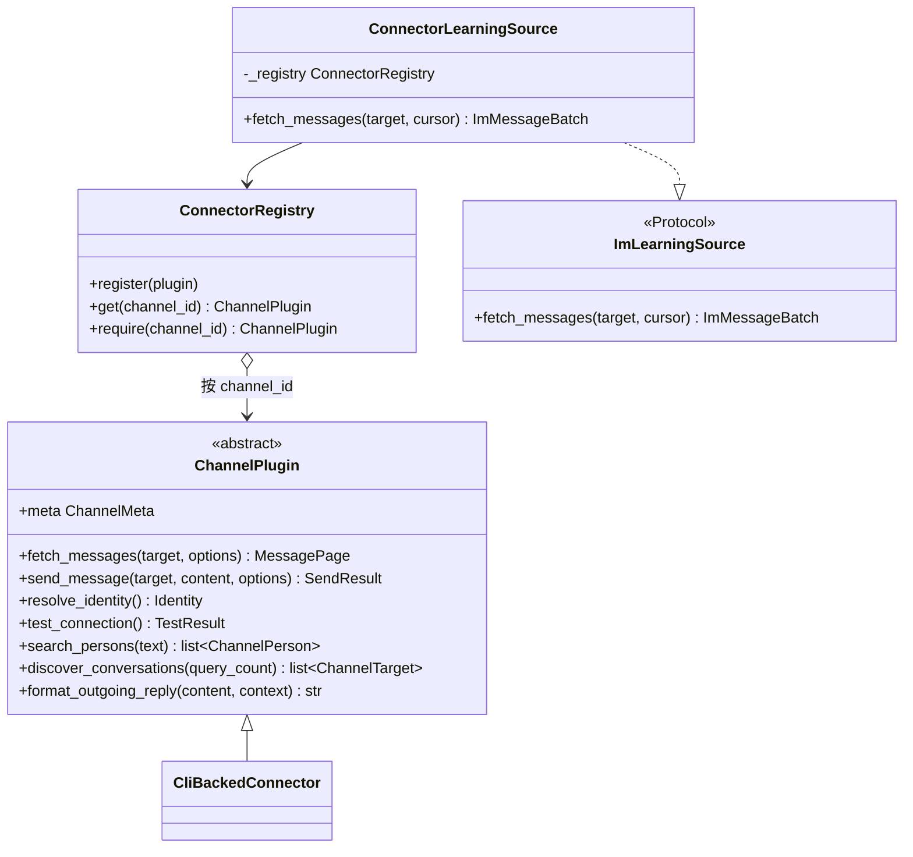
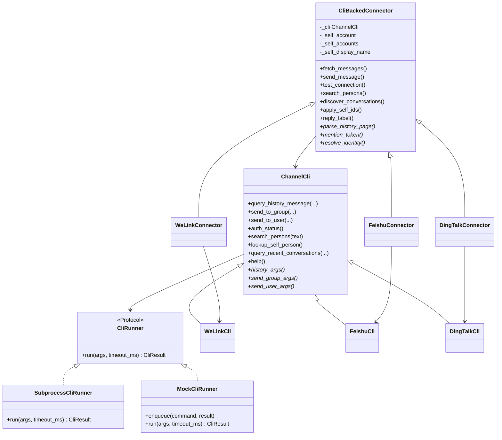
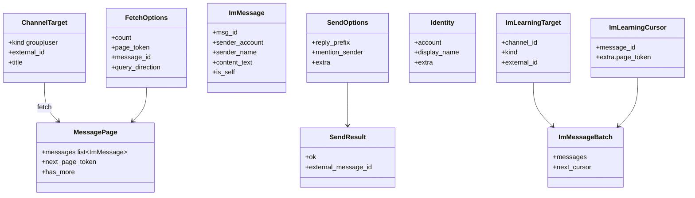
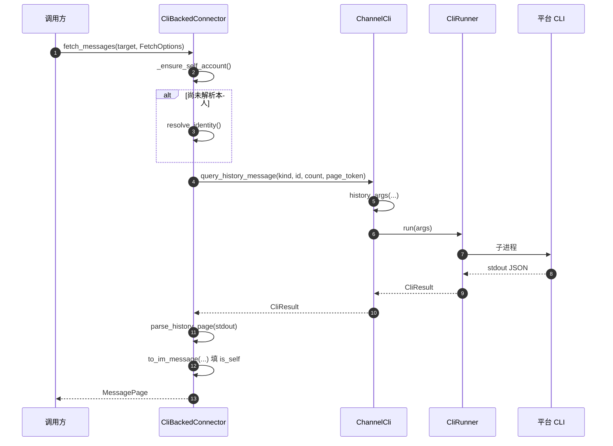
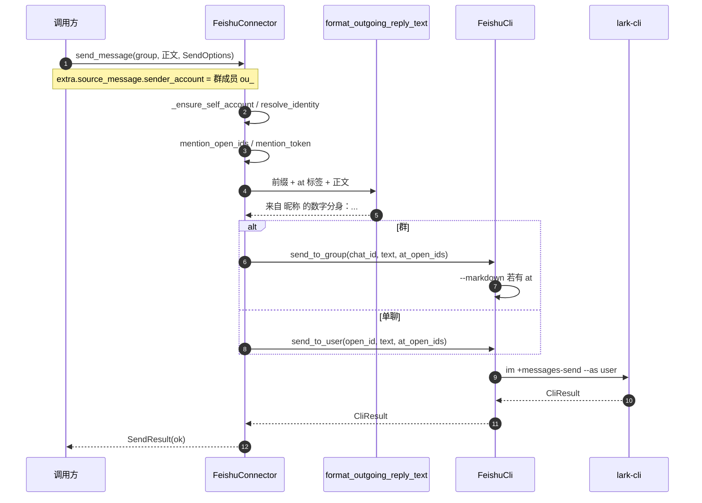
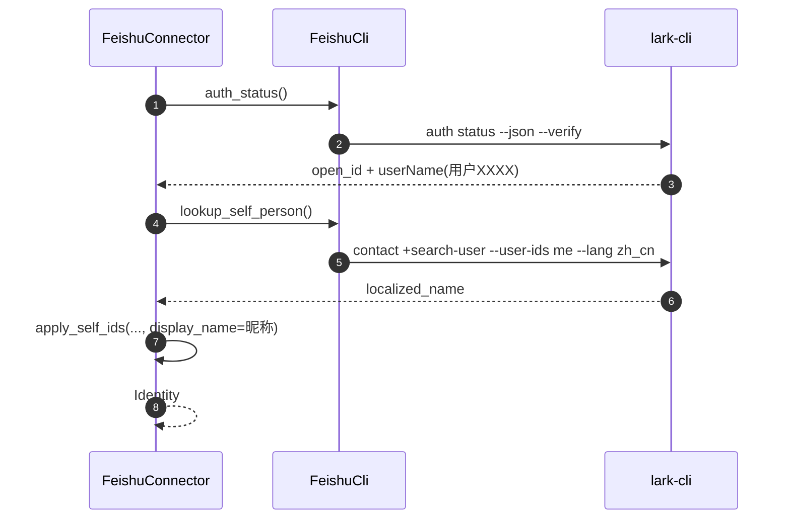
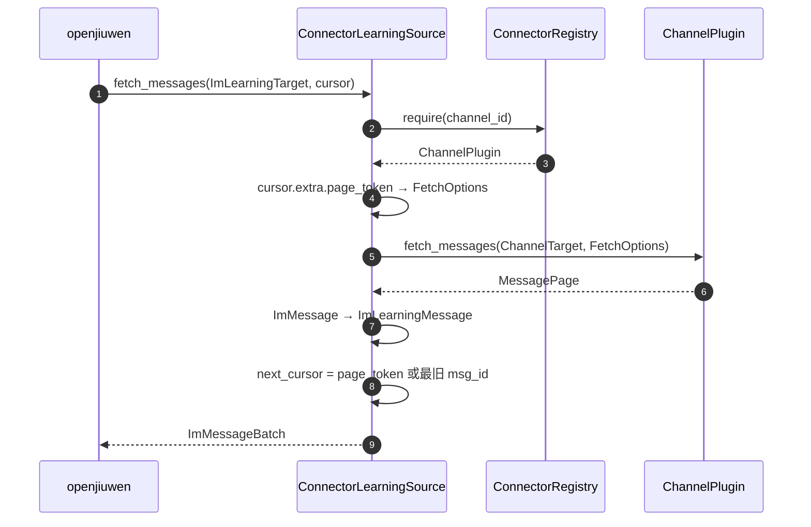
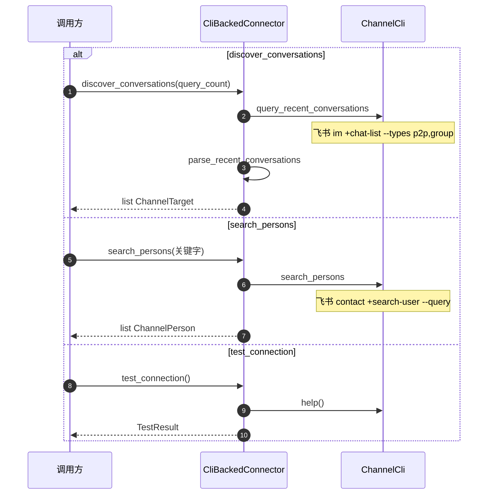

# 用户态 IM Connector 结构

本文描述当前已实现的 `jiuwenswarm/server/im/im_connector`（含 agent-core 侧只读学习接口）。不含托管轮询、门控、落库、Web。

分层：

- **openjiuwen**：`ImLearningSource` 只读协议，不感知 CLI。
- **AgentServer Connector**：`ChannelPlugin` + 三家 CLI 实现；学习侧用 `ConnectorLearningSource` 适配。
- **平台 CLI**：`welink-cli` / `lark-cli --as user` / `dws`。

```
openjiuwen.harness.personal_context.im
        ▲ 只读 fetch
ConnectorLearningSource
        ▲
ChannelPlugin  ←  ConnectorRegistry
        ▲
CliBackedConnector
        ▲
WeLinkConnector / FeishuConnector / DingTalkConnector
        │
    ChannelCli  →  CliRunner  →  平台 CLI 进程
```

## 类图

### 契约与注册



### CLI 运行时与通道实现



平台子类只做三件事：拼 argv、解析 JSON、补身份 / @ 规则。拉取、发送、发现会话的主流程在 `CliBackedConnector`。

| 通道 | CLI | 身份 | @ 原发送人 |
|---|---|---|---|
| WeLink | `welink-cli` | `auth status` → 搜 uid | 默认 `@name` |
| 飞书 | `lark-cli --as user` | `auth status` → `+search-user --user-ids me` 取 `localized_name` | `<at user_id="ou_…">`，有 @ 时走 `--markdown` |
| 钉钉 | `dws` | `get-self` → 搜人拿 `openDingTalkId` | `<@DGU…>` |

### 主要数据对象



`FetchOptions.page_token` 给钉钉 / 飞书分页；`message_id` + `query_direction` 给 WeLink。学习侧把飞书/钉钉 token 放在 `ImLearningCursor.extra["page_token"]`。

## 时序图

### 拉历史 `fetch_messages`



飞书群：`im +chat-messages-list --chat-id`；飞书单聊：`--user-id`。有下一页时 `has_more` + `next_page_token` 来自平台字段，不用 `msg_id` 冒充。

### 发消息 `send_message`（飞书群 @）



`resolve_identity`（飞书）多一步通讯录昵称：



钉钉 @ 用 `<@DGU>` + `--at-open-dingtalk-ids`；飞书必须用群成员自己的 `ou_`，搜通讯录同名外部账号会导致客户端灰色 @。

### 学习拉取 `ConnectorLearningSource`



学习路径 **不会** 调用 `send_message`。

### 发现会话 / 搜人 / 探测



## 目录对应

| 路径 | 职责 |
|---|---|
| `plugin.py` / `types.py` | ChannelPlugin 与 DTO |
| `registry.py` | 按 `feishu` / `dingtalk` / `welink` 注册 |
| `backed.py` | 共用 fetch/send/discover |
| `cli_runtime.py` | 进程、节流、429 重试；发送只重试 1 次 |
| `reply.py` / `messages.py` | 出站前缀；入站归一化 |
| `learning_source.py` | Plugin → `ImLearningSource` |
| `connectors/*/cli.py` | argv |
| `connectors/*/parser.py` | JSON → 中间 dict |
| `connectors/*/plugin.py` | 身份、@、分页解析覆盖 |
| `openjiuwen/.../im/` | 学习 Protocol 与 DTO |

当前 **没有** `im_hosting`：没有轮询、watermark、回合状态机、出站门禁 RPC。
