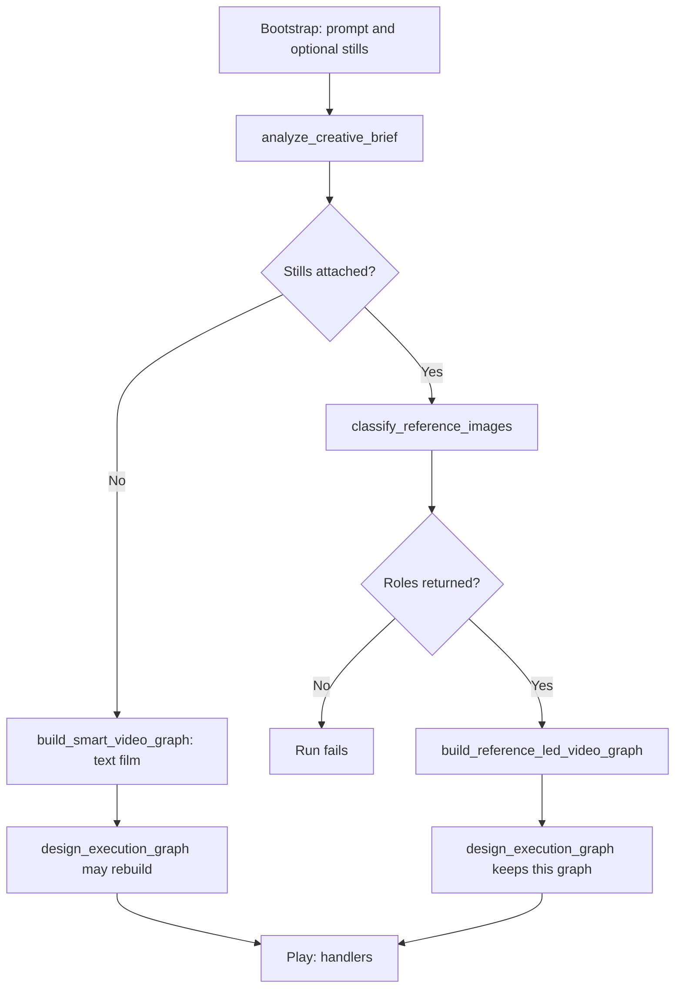

# Reference-led pipeline report

Branch: `Design-ReferenceImage-1.0`.

The text-only film path is unchanged. A run uses the new graph only when attached stills have been given roles. With no still, the builder, the clip call, and the director rebuild stay on the existing film path.

Behavior is chosen from a role and a binding. The graph code does not look for a product name, a place, or an example sentence. The classifier assigns the role.

## Supported cases

| Case | Role and binding | Graph | Video call |
|---|---|---|---|
| Text film | No still. No reference intent | Brief → storyboard → character sheets → empty plates → clips → compose | Reference-to-video from the generated sheets and plate |
| Product | `product_hero`, verbatim | Upload wired to the clips. No sheet, no plate | Reference-to-video. Image 1 is the item and stays unchanged |
| Animate the still | `still_motion_source`, verbatim | Upload is the first frame. No sheet, no plate | Image-to-video of that file |
| Animate in another medium | `still_motion_source`, condition | One restyle still in the approved medium, then one clip | Image-to-video of the restyled still |
| Use the image as the place | `scene_source`, verbatim | The upload is the plate. Scene generation is skipped | Reference-to-video, that file last |
| Use the image as the person | `character_identity`, condition | Photo → studio sheet. A new place plate is generated from the analyzed setting | Reference-to-video. Sheet first, plate last. Pose may change |

A later shot always carries the previous end state, lists the previous action as already finished, and uses a different action. Style, lighting, crowd, and duration are copied onto every clip. Durations are contiguous and sum to the film length.

### Bindings

| Binding | Meaning |
|---|---|
| `verbatim` | Pass the file through. Do not regenerate it. |
| `condition` | Generate a new still with that file as the visual authority. |

### Roles

| Role | Locked | May change | Default binding |
|---|---|---|---|
| `product_hero` | The item's pixels | Motion around it | `verbatim` — file is reference 1 |
| `still_motion_source` | This image is what moves | Motion. Medium only when binding is `condition` | `verbatim` — file is the first frame |
| `scene_source` | This place: layout, light, existing props | Action staged inside it | `verbatim` — file is the plate |
| `character_identity` | Face, hair, body, wardrobe | Pose and a new place from the analysis | `condition` — studio sheet, then the clip |
| `style_source` | Medium and palette of a different image | Subject, action, layout | `condition` on image calls only |

`style_source` is a second file. It is not an extra role on the image that is already the motion source.

## End-to-end flow



| Step | Who | Input | Output |
|---|---|---|---|
| Enter | `designer_adapter` bootstrap | Prompt, up to 3 stills | Stored uploads |
| Analyze | `analyze_creative_brief` | Prompt. Stills are visible to the model only when attached | Cast, scenes, shots, style. An empty cast is allowed only when stills were sent |
| Classify | `classify_reference_images` | Each still and the prompt | `roles` and `binding` per slot |
| Branch | `build_smart_video_graph` | Analysis | Text-film graph, or the reference-led graph |
| Director | `design_execution_graph` | The graph | Text films may be rebuilt. Reference-led graphs are returned as built |
| Play | Clip, image, and upload handlers | Upstream files and the shot prompt | A passthrough file, a sheet, a plate, or a clip |

Upload nodes are marked immutable and return the original file. Identity sheets and medium-change stills keep that file on the image call. If the image service rejects the file, those nodes fail instead of redrawing from text.

### Text film nodes

No still is attached. `creative_intent` is absent.

```
n_brief
   └── n_storyboard
          ├── n_character_*     identity sheets
          ├── n_scene_*         empty environment plates
          └── n_clip_*          reference-to-video
                 └── n_compose
```

`design_execution_graph` may rebuild this graph from the approved brief and storyboard.

### Reference-led nodes

| Case | Nodes | Edges that matter |
|---|---|---|
| Product | `n_ref_01` → `n_clip_*` → `n_compose` | Product file is reference 1 on every clip |
| Motion, verbatim | `n_ref_01` → `n_clip_*` | `reference_call_mode=i2v`, `reference_first_frame` is the upload |
| Motion, condition | `n_ref_01` → `n_restyle_01` → `n_clip_*` | Restyle uses the approved medium. The clip's first frame is `n_restyle_01` |
| Scene | `n_ref_01` → `n_clip_*` | No `n_scene_*`. The upload is the last reference |
| Character | `n_ref_01` → `n_character_1`, plus `n_scene_1` → `n_clip_*` | Sheet is reference 1. Generated place is last |

Brief and storyboard are still on the graph. Their job is the request plus the reference roles. They do not replace a reference-led subject with an invented cast.

`design_execution_graph` returns immediately for `creative_intent.mode = reference_led` and does not replace the graph.

## What each file does

| File | Role in the step |
|---|---|
| `pipeline/reference_led.py` | Role list, binding, graph shape, prompt text, and image-to-video versus reference-to-video |
| `smart_graph.py` | Calls the new builder only when `creative_intent.mode` is `reference_led` |
| `script_analysis.py` | Stores roles on each read. Relaxes the cast requirement only when stills were sent |
| `user_references.py` | Asks the classifier for a general role and binding |
| `gateway_adapter/designer_adapter.py` | Stamps the intent after classification. Missing roles fail the run |
| `orchestration.py` | Skips the director rebuild for a reference-led graph |
| `handlers/clip.py`, `node_agent.py` | Pass the selected video mode into the model call |
| `pipeline/video_prompt_practice.py` | Leaves reference prompts in place instead of rewriting them into a cast-in-a-room shot |
| `video_styles.py` | Does not treat a motion-source still as the ending pose |
| `handlers/image_nodes.py` | Identity and medium-change prompts, and they keep the reference file |

Paths are under `jiuwenswarm/server/runtime/designer/` unless noted.

## Clip prompt contract

Every reference-led clip prompt includes:

- shot index, timeline, and duration
- visual style and medium
- lighting and crowd when the shot carries them
- for shot 2 and later: `continues from` the previous end state, and the previous action marked finished
- `Action:` for this shot only

| Contract | Extra sentence |
|---|---|
| Motion (`i2v`) | Animate this image. The attached still is the first frame. |
| Product | Image 1 is the referenced subject and stays unchanged. Motion happens around it. |
| Scene | The place is the last reference image. Keep its layout and stage the action inside it. |
| Character | Image 1 is the person. The place is the last reference image. The pose may change. Face and wardrobe stay. |

## Test report

Suite: `tests/unit_tests/test_reference_led_scenarios.py`.

1000 cases per scenario. Each case changes shot count (2–4), per-shot duration, style, lighting, and crowd.

Confirming run: **5003 passed, 0 failed, 20.92s**. Pass rate **100%**, inside the five-run limit.

| Case | Tests | Passed | Failed | Checks |
|---|---:|---:|---:|---|
| Text film | 1000 | 1000 | 0 | Cast and plate nodes remain. Style is on every clip. Actions differ. A later shot is not the first of the setting. The video call stays reference-to-video |
| Product | 1000 | 1000 | 0 | No sheet, no plate, product is reference 1, durations sum, light, crowd, and style repeat, shot 2 continues and does not repeat shot 1 |
| Motion | 1000 | 1000 | 0 | Image-to-video. Half the cases use the file as the first frame. Half restyle in the approved medium first. Same continuity, light, crowd, style, and duration checks |
| Scene | 1000 | 1000 | 0 | No generated plate. The upload is the last reference |
| Character | 1000 | 1000 | 0 | One identity sheet and one generated place. Sheet then plate |
| Guards | 3 | 3 | 0 | No scene-specific phrases in the new module. An unset video mode matches today's call. The director does not rebuild a reference-led graph |

### Bugs found while running

| Bug | Where | What happened |
|---|---|---|
| Tests read `config.role` after normalize, which stores the canvas type. The pipeline name is `config.pipeline` | Test suite | Assertions were corrected. The graph was already right |
| Reference nodes lacked `user_reference_id`, so Play could try to regenerate the upload | `reference_led.py` | Nodes now route to the upload passthrough. The suite was run again and stayed at 100% |
| This environment has no `openjiuwen` install, which the text-film builder imports through config | Test runner only | The suite stubs that import so the film builder can execute. The product code was not changed for it |

These tests check the graph, the prompt, and the call mode. They do not render frames, so a video model can still ignore a lighting or continuity line.
